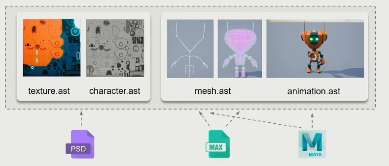
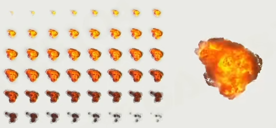

# 104

## 引擎架构分层

1. 工具层（引擎提供的各种编辑器）
2. 功能层（让游戏世界动起来、看得见）


> 动画、相机、渲染、物理、脚本、UI等

3. 资源层（加载、管理资源）

> PSD、MAX、Mp3、XML、MPEG、JSON等文件

4. 核心代码层

> 容器、内存分配、垃圾回收、线程池等

5. 平台层

> Android、PC、Mac...  
> 手柄、鼠标、键盘、方向盘...

### 资源层

**以动画系统（Animation System）为例**

一套动画资源可能包括：骨骼信息、动作信息、蒙皮信息、数据文件等

在**源文件**中，这些文件可能包含额外的一些编辑时会用到的信息，这些信息在游戏中是无用的

> 比如同一篇文章，用word和txt两种格式存储的文件大小是完全不同的

又或者，原本的文件格式是不合适的，比如图片的PNG和JPEG是不能直接给GPU进行计算绘制的，需要将其转换成可以直接通过GPU绘制的文件格式

因此需要将这些离线文件转变成**引擎资产**

同样是上面动画资源的例子，一个文件可能关联其他多个文件，因此这些文件之间需要维系关联信息



```xml
<character name="robot" GUID="81-02985-0192835">
    <geometry>
        <mesh file_path="robot.mesh.ast"/>
        <texture>
            <abledo_texture file_path="robot_ambient.texture.ast"/>
            <roughness_texture file_path="robot_roughness.texture.ast"/>
        </texture>
        <material file_path="robot.material.ast" />
    </geometery>
    <animation>
        <animation_clip name="stand">
            <clip_file path="robot_stand.animation.ast" />
        </animation_clip>
        <animation_clip name="walk">
            <clip_file path="robot_walk.animation.ast" />
        </animation_clip>
    </animation>
</character>
```

对于上面图片中的一组关联文件，使用上面的XML配置可以记录关联信息

| key | 意义 |
| --- | --- |
| character | 表示角色 |
| geometry | 几何体信息 |
| mesh | 网格信息 |
| texture | 贴图信息 |
| material | 材质信息 |
| animation | 动作信息 |

注意上述XML中 `character` 标签中的 **GUID** 属性，表示唯一编号，通过该值可以唯一确定整个游戏项目中的一个文件，即该值全局唯一

通过记录**GUID**，即使文件位置被挪动，也可以快速定位，重新配置上述XML文件

综上所述，定义**引擎资产**的好处很多
1. 去除文件冗余数据，减少文件大小
2. 转换文件到合适的格式
3. 关联多文件之间的信息
4. 定义**GUID**确定唯一文件标识

一般游戏引擎都有**资源管理器**，属于一个虚拟的文件系统，通过路径加载、卸载各种资源；同时还要通过**hanle系统**管理资源的生命周期和各种引用

资源层一般就是管理资源的整个生命周期


在整个游戏的过程中，资源会被不停的加载、卸载，如果某个瞬间加载、卸载的资源数目过多，会严重影响游戏的体验，因此资源管理器在游戏引擎中是十分重要的

### 功能层


如何让游戏世界动起来，**tick**就是关键

```cpp

void tickLogic(float delta_time) {
    tickCamera(delta_time);
    tickMotor(delta_time);
    tickController(delta_time);
    tickAnimation(delta_time);
    tickPhysics(delta_time)l;
    /* ... */
}

void tickRender(float delta_time){
    tickRenderCamera();
    culling();
    rendering();
    postprocess();
    present();
}

void tickMain(float delta_time) {
    while(!exit_flag) {
        tickLogic(delta_time);
        tickRender(delta_time);
    }
}
```

一般会先tick计算Logic(逻辑)，然后再计算Render(渲染)

因此，如何让一个角色动起来：
1. 逻辑帧匹配角色的动画帧
2. 驱动角色骨骼和蒙皮
3. 在每一个渲染帧中完成角色的渲染作业

除此了tick外，功能层还有多线程任务分配等操作


> 目前游戏引擎的多线程任务分配


> 理想的满线程使用的任务分配，但是因为任务之间的关联性，很多信息的计算必须在某个任务执行完毕之后，所以目前这种线程的分配方式不太好实现

### 核心层

核心层首当其冲就是**数学库**，各种值的计算、转换等操作都依赖数学库

> 游戏逻辑、绘制、物理等

**SIMD**全称Single Instruction Multiple Data，单指令多数据流，能够通过一条指令执行多次计算

> 以加法指令为例，单指令单数据（SISD）的CPU对加法指令译码后，执行部件先访问内存，取得第一个操作数；之后再一次访问内存，取得第二个操作数；随后才能进行求和运算。而在SIMD型的CPU中，指令译码后几个执行部件同时访问内存，一次性获得所有操作数进行运算。这个特点使SIMD特别适合于多媒体应用等数据密集型运算

除了**数学库**，核心层还提供各种常用的**数据结构**
- Array
- LinkList
- Queue
- Heap
- Tree
- Graph
- Stack
- Hashing
- Skeleton Tree
- Animation Frame Sequence 
- ...

当然还有最重要的**内存管理**
游戏引擎会一次性申请一大堆内存自行管理（**内存池**），以此来追求最大的效率

> 因为内存都在一起，所以**Cache的命中率**会更高

当然还要注意的就是**内存对齐**

### 平台层

平台层就是为了使开发者不用关注不同平台之间差异，从而提高开发效率

1. 系统不同

不同平台的文件路径、正反斜线都有区别

2. 图形渲染不同

不同平台的图形API也不同：OpenGLES、DirectX11、DirectX12等等

> RHI 硬件渲染接口，重新定义一层渲染API，将不同硬件的SDK的区别封装起来

3. CPU不同


需要考虑哪个算法在哪个核心中计算更合理（部分CPU特别提供计算核心）

### 工具层

给用户提供编辑各种文件的界面，游戏场景的可视化、动画资源预览、可编程的shader等

工具层是依赖游戏引擎的，它具有创建、编辑、交换游戏资源的能力

工具层的开发方式比较灵活，游戏引擎最佳是C++(效率)，但是工具层任何语言都是可以的考虑的

除了引擎工具层提供的资产生产工具外，还有其他厂商提供的开发工具

**DCC** => Digital Content Creation，数字资产

无论是自己通过引擎创建的，或者通过其他厂商工具创建的**DCC**，全部都可以通过游戏引擎的**资源层**导入到游戏引擎中，通过**Asset Conditioning Pipeline**，即各种导入、导出工具

#### 总结

与网络分层类似，每个层次只关注自己层次的功能实现，低层次为高层次提供服务，高层次不需要知道低层次的存在

一般来说高层次的发展会更加快速，低层次发展会较慢

## 构建游戏世界

### GameObject和Component

1. 动态物：游戏中会运动的物体，例如：人
2. 静态物：游戏中不会移动的物体，例如：房子
3. 地形系统
4. 植被
5. 天空

游戏中所有的物体都可以抽象成 GO -> **GameObject**，游戏最重要的就是管理这些GameObject

那么如何定义游戏中的对象？

最经典的做法就是**继承**，鸭子 => 会叫的鸭子 => 会飞的鸭子 => ...

但是随着游戏越做越复杂，很多东西并没有清晰的父子关系：水陆两栖坦克(坦克+巡逻艇， 坦克派生自汽车，巡逻艇派生自船)

为了应对**继承**带来的一些问题，现代游戏引擎提供了**组件化**的开发方法，将行为/能力拆分到组件中，然后添加到对象上

对于**组件化**开发，最容易想到的就是枪械了，比如吃鸡中的1、2、3、4倍镜，各种握把等，都可以理解为组件，为枪械提供了某些能力

```cpp
class BaseComponent {

}

class TransformComponnet : public BaseComponent{

};

class AIComponent : public BaseComponnet {

};

class FlyComponent : public BaseComponent {

};

class GameobjectBase {
    vector<BaseComponent*> Components;
}

class FlyRobot : public GameobjectBase {
    Components = [FlyComponent, AIComponent, TransformComponnet];
}
```

角色能力统一封装到组件中，在角色中存储这些组件，即代表角色存在这些能力，此时想要添加或者修改能力只需要添加或者替换组件即可实现


> U3D和UE中的Component

**综上**：游戏中的任何物体都是一个GameObject，每个GameObject由各种不同的Component组成

### GameObject之间的交互

最简单的写法就是

```cpp
void Bomb::OnExpode(){
    // 炸弹要自己判断各种类型的处理方式
    // ...
    switch(touch_type){
        case TouchType.Humen:
            // 扣血
            break;
        case TouchType.Tank:
            // 扣血
            break;
        case TouchType.Stone:
            // 不做处理
            break;
    }
    // ...
}
```

上面就是最暴力的写法，爆炸的时候获得爆炸影响的对象，用switch判断其类型，走不同的逻辑

这种写法最大的问题就是，**不好维护**，当后续对象类型添加到几百种，总不能写几百种Switch-case

此时，比较好的解决方案其实是 **事件**（Event） 机制

参考设计模式：**观察者模式**，使用事件的好处就是只是通知被影响的物体发生了何种事情，由被通知的对象自行做后续处理

```cpp
void Bomb::OnExpode(){
    // ...
    sendExploadEvent(go_actor); // 炸弹只做事件分发，不做数据处理
    // ...
}
```

```cpp
DECLARE_DYNAMIC_MULTICAST_SPARSE_DELEGATE_TwoParams(FActorComponentActivatedSignature, UActorComponent, OnComponentActivated, UActorComponent*, Component, bool, bReset);
DECLARE_DYNAMIC_MULTICAST_SPARSE_DELEGATE_OneParam(FActorComponentDeactivateSignature, UActorComponent, OnComponentDeactivated, UActorComponent*, Component);

DECLARE_MULTICAST_DELEGATE_OneParam(FActorComponentGlobalCreatePhysicsSignature, UActorComponent*);
DECLARE_MULTICAST_DELEGATE_OneParam(FActorComponentGlobalDestroyPhysicsSignature, UActorComponent*);
```

> 虚幻中的事件声明

### GameObject的管理

每个GameObject都需要一个唯一ID 作为唯一标识  
每个GameObject都需要一个坐标

> 这里GameObject是场景中的物体，并非UE中的UObject这种，更像是UE中的AActor


上图中左边为普通网格管理，右边为八叉树管理

因为地图中的物体并不是均匀分布的，导致如果采用网格管理的方式，会出现一些网格中的对象过多，另一部分网格中却没有对象


当然除了**八叉树**外，还有其他的算法去做场景对象管理


当时游戏发开并没有完全通用的解决方案，还是不同情况采用更为合适的方案为宜

### 其他

当子 GameObject 绑定到父 GameObject 后，tick 时要先计算父 GameObject ，再计算子 GameObject

再比如消息的传递，A 给 B 发送信息，同时 B 也给 A 发送了信息，此时微观上其实是由先后顺序的，但是如果信息的处理是交给两个核心处理，那么可能这次是 A 先收到信息，下次是 B 先收到信息，这样程序的运行结果可能不同，导致严重的问题出现

所以，很多时候会有信息管理器，将信息统一发送到一个管理器中，再由管理器去根据顺序统一发送信息

因此游戏引擎中，**时序**是一个很重要的问题，需要着重考虑

## 游戏引擎的渲染

游戏绘制系统会遇到的问题
1. 成千上万的渲染对象和千奇百怪的渲染类型(水体、植被、角色、云等绘制算法各不相同)
2. 深度适配当代硬件(CPU、GPU)
3. 如何把计算时间维持在固定的时间内，以此来维持帧率
4. 游戏渲染不能占用100%的CPU资源，否则其他模块无法计算

渲染顺序

1. 传入顶点的3D空间坐标
2. 映射顶点的3D空间坐标到屏幕空间上
3. 三角面片
4. 栅格化
5. 贴图
6. 输出


一些游戏内的物体需要挂载`MeshComponent`才能被渲染出来，换句话说物体想要被看到需要挂载一些 `Renderable` 的组件


`Mesh Primitive` 网格基本体的形状数据

通过记录每个点的坐标、连接关系可以绘制出一个形状

```cpp
struct Vertex {
    Vector3 m_Position;
    UByte4 m_Color;
    Vector3 m_Normal;
}

struct Triangle {
    Vertext m_Vertex[3];
};
```

使用 `OpenGL` 或者 `DX` 时可以发现，并没有定义 `Triangle` 这种对象，而是使用一个数组去存储所有的顶点，然后模型去存出顶点的索引值。因为一些顶点是通用的，如果每个三角形都存储所有点的信息，很多信息就是冗余的，浪费了内存空间


`Mesh Primitive` 网格基本体的材质数据

常见的渲染模型：`Phong Model`、`PBR Model`、`Subsurface Material`....

除了模型之外，纹理`Texture`也非常重要

另外还有`Shader`着色器

每个 Mesh 可以有多个 submesh 来使用不同的贴图


抽象来看就是：将整个 Mesh 抽成了一个大buffer， 每个 submesh 只用了 buffer 中的一部分；每个 submesh 有对应的材质、贴图、shader

如果场景中存在很多的Mesh，那么数据量会特别大，甚至很多Mesh 会使用相同的贴图、材质等

现代游戏引擎中，一般的做法是建立 Pool：`MeshResPool`、`ShaderResPool`、`TextureResPool`，那么即使场景中有多个相同的Mesh，其对应的内存数据也只用存储一份即可


> 参考设计模式中的享元模式

## 动画系统

游戏动画的挑战

- 复杂的动画状态并且与游戏的其他系统交互
  1. 在复杂环境中的动态调整
  2. 与其他游戏系统耦合
  3. 需要监听玩家输入
  4. ...

- 动画是实时渲染的
  1. 所有的计算都是实时的
  2. 动画数据庞大，导致数据读写消耗甚至打到读写瓶颈

- 游戏动画自然感和流畅度要求越来越高
  1. 更多的体验
  2. 更多生动的表达

### 2D动画技术 - 2D Animation


最常见的就是 `Sprite Animation` 精灵帧动画，就是把游戏中的角色一帧一帧的循环播放

| 帧动画 | 各角度 |
| --- | --- |
|  |  |

为了让表现更加真实，记录多个角度的帧动画，能够用 2D 模拟出 3D 的感觉

虽然 2D 动画技术很古老，但是现在仍然会在游戏中频繁使用



> 通过帧动画模拟粒子爆炸特效

除了前面介绍的 `Sprite Animation` 之外，经常使用的还有 `Live2D`


通过将图片旋转、变形、扭曲、编辑来实现角色动作


将角色身上的所有元素：眉毛、眼睛、头发、手、脚、胳膊等变成一个个小的**图元**，最后将图元变成大的资源

对于角色身上的每个图元都可以通过旋转、放缩、变形等操作可以做出非常鲜活的动作效果

`Live2D` 可以设置每个图元的深度保证每个图元动起来的时候不会互相影响导致穿帮; 其次 `Live2D` 可以给每个图元设置**控制网格**，通过控制网格可以更加细腻的控制图元的扭曲

除了 `Live2D` 之外还有 Spine 和 龙骨动画，通过绑定骨骼的方式来操作图元的移动，以此来模拟 3D 的骨骼蒙皮操作


### 3D动画技术 - 3D Animation

DoF (Degrees of Freedom) 自由度


对于一个在3维空间的刚体来说，它在整个空间运动的自由度就是6个自由度：平移的三个自由度、旋转的三个自由度

那么对于3D动画来说，其核心就是对刚体运动的表达。在游戏中，做3D动画最基础的就是**基于层次结构的刚体的动画**，类似皮影戏


因为关节骨骼是树状结构，所以也叫 `Hierarchical`，也就是一层一层一级一级的分布下来


如果只是单纯的将 Mesh 和 骨骼 进行绑定，那么很容易出现上图的的问题，那就是 Mesh 与 Mesh 之间出现重合，也就是俗称的穿模

由于单纯的将 Mesh 与 骨骼 进行绑定会出现很多问题，因此引入了 **蒙皮动画** `Skin Animation`


参考人体的骨骼和皮肤，模型的一个点的位置可能由多个骨骼同时作用，可以尽可能保证角色运动的时候模型不会互相穿插，会比前面的刚体动画更加合适

除了上述的两种 3D 动画技术之外，还有一个 `Physics-based Animation` 基于物理的动画

比如常见的 `Ragdoll` **布娃娃系统**；`Cloth and Fluid simulation` 布料、流体模拟；`Iverse Kinamatics (IK)` 反向动力学，就是给定某个点让身体运动更加自然

至于如何创建 3D 动画，一般就两种方法：动画师在软件中**K帧** 和 **动作捕捉**

### 蒙皮动画 - Skinned Animation Implementation

让 Mesh 动起来

1. 创建一个模型
2. 给模型创建一个配套骨骼
3. 给每一个骨骼刷蒙皮，就是上模型的顶点与骨骼进行关联
4. 给骨骼制作对应的动画
5. 骨骼运动带动对应的模型顶点运动


在骨骼运动的时候，所有动画系统的计算都是在骨骼各自的空间中计算的

| **World Space** | **Model Space** | **Local Space** |
| --- | --- | --- |
| 世界坐标系 | 模型坐标系 | 骨骼的本地坐标系 |


也就是骨骼在自己的局部坐标系下的移动，通过一级一级的向上传递，从而计算得到模型坐标系下的移动信息

因为骨骼是个层级的结构，比如你的手腕转了30度，这是相对于局部坐标系的。对于世界坐标系，手腕可能转动的就不是30度了，所以用局部坐标系更方便


Joint 是由动画师直接操纵来控制运动的物体, Bone 是关节之间的空隙；而局部坐标系的原点在 Joint 上

> Joint 是有很多自由度的，但是 Bone 是没有自由度的

游戏中除了与人体相关的骨骼之外，还会添加很多其他的骨骼用于控制模型


与人体骨骼类似，披风上的骨骼可以控制披风的运动和变形


通过将人和马两个 Object 上对应的两个骨骼 Attach，保证坐标和旋转相同，然后人播放人的动画，马播放马的动画，就可以实现人骑马的效果


关于模型的姿势，一般分两种 `T-Pose` 和 `A-Pose`

> T 和 A 表示人物的站姿

早期模型一般都是 `T-Pose` 的，后面发现 `T-Pose` 的模型在肩膀会出现挤压的情况，这样会导致做肩甲处的动作时精度不够的情况，所以后面改为使用 `A-Pose` 这样肩膀处的精度就足够了

对于角色某一个固定的动作可以称之为 Pose，把很多的 Pose 连到一起就形成了动画

对于骨骼来说有9个自由度：平移、旋转、缩放，对于骨骼缩放可以实现人脸的变形、弹性变化等

### 3D 旋转的数学

每个关节做的最多的运动其实是旋转，手臂的旋转带动了手掌的移动，手腕的旋转带动了手指的移动

那么如何在 3D 空间表示旋转？


> 绕单个轴旋转时点的计算公式


> 同时绕 x、y、z 三轴旋转时的计算公式

上述就是对欧拉角的计算公式，但是使用欧拉角会存在很多问题，比如：万向锁、需要严格按照顺序执行、难以插值计算、难以计算叠加


如上图所示，对同一个物体进行旋转操作时，会根据操作顺序的不同导致结果不同

由于如上欧拉角的一些问题，导致在动画中计算时会出现很多问题，所以一般动画都使用**四元数**

[四元数与三维旋转](https://github.com/Krasjet/quaternion)

#### 复数的计算

**复数**可以表示为 `a + bi` 的形式，其中 a 是实数部分，b 是虚数部分，i 是虚数单位

> 复数也可以用来表示二维空间中的点或向量，也可以用来表示二维空间中的旋转变换
> 复数有自己的运算法则，包括加法，减法，乘法，除法等，它们满足一些代数性质，如交换律，结合律，分配律等
> 复数还有一些特殊的表示形式，如指数形式，三角形式，极坐标形式等，它们可以方便地进行一些复数的运算和分析

因为 𝑧 = 𝑎 + 𝑏𝑖 其实就是对于 {1, 𝑖} 这个基（Basis）的线性组合（Linear Combination），我们也可以用向量来表示一个复数：

$$
z = 
\begin{bmatrix}
    a \\
    b
\end{bmatrix}
$$

因为这个向量有两个元素，我们可以使用复平面上的一个点来表示一个复数, 复平面的横坐标 𝑅𝑒 代表它的实部，纵坐标 𝐼𝑚 代表它的虚部：


复数加法，他们的和就是分量相加的结果

$$
z_1 = a + bi \\
z_2 = c + di \\
z_1 + z_2 = (a + c) + (b + d)i
$$

复数减法，他们的差就是分量相减的结果

$$
z_1 - z_2 = (a - c) + (b - d)i
$$

复数乘法，通过分配律来计算乘积

$$
z_1 * z_2 = ac - bd + adi + bci = (ac - bd) + (bc + ad)i
$$

> 也就是说乘积的结果就是一个新的复数，其实部为 `ac - bd`，虚部为 `bc + ad`

通过上述计算结果不难发现，其实复数的乘法符合矩阵与向量的相乘的规则

$$
z_1 * z_2 = bc - bd + (bc + ad)i = \begin{bmatrix}
    a & -b \\ b & a
\end{bmatrix} * \begin{bmatrix}
    c \\ d
\end{bmatrix}
$$

右侧的 $
\begin{bmatrix}
    c \\ d
\end{bmatrix}
$ 是用向量的形式来表示 $z_2$ 

左侧的 $
\begin{bmatrix}
    a & -b \\ b & a
\end{bmatrix}
$ 则是用矩阵的形式来表示 $z_1$

> 问题：为什么复数的矩阵可以这么表示？

那么，在矩阵形式下，复数与复数相乘可以表示为矩阵相乘

$$
z_1 = a + bi \\
z_2 = c + di \\
z_1 * z_2 = \begin{bmatrix}
    a & -b \\
    b & a
\end{bmatrix} * \begin{bmatrix}
    c & -d \\
    d & c
\end{bmatrix} = \begin{bmatrix}
    ac - bd & -(bc+ad) \\
    bc + ad & ac - bd
\end{bmatrix}
$$

并且复数的乘法是满足交换律的

$$
z_2 * z_1 = \begin{bmatrix}
    c & -d \\
    d & c
\end{bmatrix} * \begin{bmatrix}
    a & -b \\
    b & a
\end{bmatrix} = \begin{bmatrix}
    ac - bd & -(bc+ad) \\
    bc + ad & ac - bd
\end{bmatrix}
$$

一般称 I 为单位矩阵， 也就是 

$$
I = \begin{bmatrix}
    1 & 0 \\
    0 & 1
\end{bmatrix}
$$

虚数单位 i 则等价于 

$$
\begin{bmatrix}
    0 & -1 \\
    1 & 0
\end{bmatrix}
$$

可以发现 

$$
i^2 = i * i = \begin{bmatrix}
    0 & -1 \\
    1 & 0
\end{bmatrix} * \begin{bmatrix}
    0 & -1 \\
    1 & 0
\end{bmatrix} = \begin{bmatrix}
    -1 & 0 \\
    0 & -1
\end{bmatrix} = -I = -1
$$

复数的模长

如果 `z = a + bi`，那么其模长为 $||z|| = \sqrt{a^2 + b^2}$

复数的共轭

如果 `z = a + bi`，那么其共轭为 $\overline{z} = a - bi$ ，也就是反转 z 虚部的符号

尝试计算 $z * \overline{z}$ 可以发现

$$
z \overline{z} = (a + bi)(a - bi) = a^2 - abi + abi + b^2 = a^2 + b^2 = ||z||^2
$$

因此得出结论 $||z|| = \sqrt{z*\overline{z}}$

#### 复数相乘与2D旋转

既然与复数相乘代表与 $\begin{bmatrix}
    a & -b \\
    b & a
\end{bmatrix}$ 矩阵所作出的变换，那么这种变换代表什么？

$$
\begin{bmatrix}
    a & -b \\
    b & a
\end{bmatrix} = \sqrt{a^2 + b^2} * \begin{bmatrix}
    \frac{a}{\sqrt{a^2 + b^2}} & \frac{-b}{\sqrt{a^2 + b^2}} \\
    \frac{b}{\sqrt{a^2 + b^2}} & \frac{a}{\sqrt{a^2 + b^2}} 
\end{bmatrix}
$$

将矩阵的每个元素都处于模场 $||z|| = \sqrt{a^a + b^2}$ 并将其提到矩阵外面


如上图 `||z||` 正是复数 z 与坐标轴所形成的三角形的斜边长，而 a、b 分别为三角形的两个直角边，如果将斜边与实数轴 Re 正方向的夹角记为 $\theta$ ，按照三角函数的定义可以得出 $\frac{a}{\sqrt{a^2 + b^2}} = \cos\theta$ 且 $\frac{b}{\sqrt{a^2 + b^2}} = \sin\theta$，因此原矩阵可以变换成

$$
\begin{bmatrix}
    a & -b \\
    b & a
\end{bmatrix} = \sqrt{a^2 + b^2} * \begin{bmatrix}
    \cos\theta & -\sin\theta \\
    \sin\theta & \cos\theta
\end{bmatrix} \\ = ||z|| * \begin{bmatrix}
    \cos\theta & -\sin\theta \\
    \sin\theta & \cos\theta 
\end{bmatrix} \\ = || zz || * I * \begin{bmatrix}
    \cos\theta & -\sin\theta \\
    \sin\theta & \cos\theta 
\end{bmatrix} \\ =\begin{bmatrix}
    ||z|| & 0 \\
    0 & ||z||
\end{bmatrix} * \begin{bmatrix}
    \cos\theta & -\sin\theta \\
    \sin\theta & \cos\theta 
\end{bmatrix}
$$

> 上面的 I 就是单位矩阵的意思

而 $\begin{bmatrix} \cos\theta & -\sin\theta \\ \sin\theta & \cos\theta \end{bmatrix}$ 又是经典的 2D 旋转矩阵

用 $\begin{bmatrix} 1 \\ 0 \end{bmatrix}$ 和 $\begin{bmatrix}  0 \\ 1 \end{bmatrix}$ 分别带入计算一下

$$
\begin{bmatrix}
    a & -b \\
    b & a
\end{bmatrix} \begin{bmatrix}
    1 \\ 0
\end{bmatrix} = \begin{bmatrix}
    ||z|| & 0 \\
    0 & ||z||
\end{bmatrix} \begin{bmatrix}
    \cos\theta & -\sin\theta \\
    \sin\theta & \cos\theta
\end{bmatrix} \begin{bmatrix}
    1 \\ 0
\end{bmatrix} = \begin{bmatrix}
    ||z|| & 0 \\
    0 & ||z||
\end{bmatrix} \begin{bmatrix}
    \cos\theta \\
    \sin\theta
\end{bmatrix} = \begin{bmatrix}
    ||z||\cos\theta \\
    ||z||\sin\theta
\end{bmatrix}
$$

首先将 $\begin{bmatrix} 1 \\ 0 \end{bmatrix}$ 变换到 $\begin{bmatrix} \cos\theta \\ \sin\theta \end{bmatrix}$ 的位置，也就是逆时针旋转了 $\theta$ 度，接下来将矩阵 $\begin{bmatrix} \cos\theta \\ \sin\theta \end{bmatrix}$ 缩放了 ||z|| 倍

$$
\begin{bmatrix}
    a & -b \\
    b & a
\end{bmatrix} \begin{bmatrix}
    0 \\ 1
\end{bmatrix} = \begin{bmatrix}
    ||z|| & 0 \\
    0 & ||z||
\end{bmatrix} \begin{bmatrix}
    \cos\theta & -\sin\theta \\
    \sin\theta & \cos\theta
\end{bmatrix} \begin{bmatrix}
    0 \\ 1
\end{bmatrix} = \begin{bmatrix}
    ||z|| & 0 \\
    0 & ||z||
\end{bmatrix} \begin{bmatrix}
    -\sin\theta \\
    \cos\theta
\end{bmatrix} = \begin{bmatrix}
    -||z||\sin\theta \\
    ||z||\cos\theta
\end{bmatrix}
$$

这里同样是将 $\begin{bmatrix}  0 \\ 1 \end{bmatrix}$ 变换到了  $\begin{bmatrix}  -\sin\theta \\ \cos\theta \end{bmatrix}$ 位置，也就是逆时针旋转了 $\theta$ 度

上述的计算过程大概就是下面的表现效果


所以，复数的相乘其实是**旋转与缩放变换的复合**

如果有一个复数 `z = a + bi`, 那么 z 与任何一个复数 c 相乘都会将 c 逆时针旋转 $\theta$ 度，并将其缩放 $||z|| = \sqrt{a^2 + b^2}$ 倍

> $\theta = \arctan{\frac{b}{a}}$

如果复数的 $a^2 + b^2 = 1$，即这个复数可以用一个单位想来来表示，那么这个复数所代表的几何意义就只有旋转了，只留下单纯的旋转矩阵 

$$
V' = \begin{bmatrix}
    \cos\theta & -\sin\theta \\
    \sin\theta & \cos\theta
\end{bmatrix} V
$$

其实 $\begin{bmatrix} \cos\theta & -\sin\theta \\ \sin\theta & \cos\theta \end{bmatrix}$ 这个旋转矩阵如果写成复数形式的话就是 $\cos\theta + i\sin\theta$

如果将向量 $v = \begin{bmatrix} x \\ y \end{bmatrix}$ 看作是一个复数 $v = x + yi$ 其中实部为 x，虚部为 y。可以构造一个复数 $z = \cos\theta + i \sin\theta$ 并将它与 v 相乘来进行旋转，旋转 $\theta$ 度之后的向量 $v'$ 可以用等价的复数乘法来表示

$$
v' = zv = (\cos\theta + i\sin\theta)v
$$ 

又根据**欧拉公式**，可以得到 $\cos\theta + i\sin\theta = e^{i\theta}$，可以可以将复数进一步表示为

$$
z = ||z||\begin{bmatrix}
    \cos\theta & -\sin\theta \\
    \sin\theta & \cos\theta
\end{bmatrix} = ||z||(\cos\theta + i\sin\theta) = ||z||e^{i\theta}
$$

如果定义 `r = ||z||` 那么就可以得到复数的极坐标公式 $z = re^{i\theta}$

$$
v' = re^{i\theta}v
$$

如果有两个代表 2D 旋转的单位复数 $z_1 = \cos\theta + i\sin\theta$ 和 $z_2 = \cos\gamma + i\sin\gamma$ 以及一个向量 `v = x + yi`，可以先对 v 进行 $z_1$ 的旋转 $v' = z_1 v$ 然后对 v' 进行 $z_2$ 的旋转 $v'' = z_2(z_1v)$

定义 $z_{net} = z_1 z_2$, 那么 $v'' = z_{net}v$

又因为复数的乘法符合交换律，所以 $z_{net} = z_1z_2 = z_2z_1$

#### 四元数

四元数的定义和复数非常相似，唯一的区别就是四元数一共有三个虚部，而复数只有一个 $q = a + bi + cj + dk$ 其中 $i^2 = j^2 = k^2 = ijk = -1$

与复数类似，四元素其实就是对于基`{1, i, j, l}`的线性组合，四元数也可以写成向量形式 $q=\begin{bmatrix} a \\ b \\ c \\ d \end{bmatrix}$

