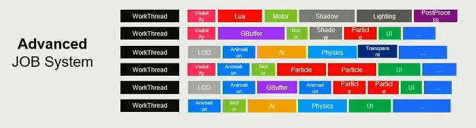

# 104

## 引擎架构分层

1. 工具层（引擎提供的各种编辑器）
2. 功能层（让游戏世界动起来、看得见）


> 动画、相机、渲染、物理、脚本、UI等

3. 资源层（加载、管理资源）

> PSD、MAX、Mp3、XML、MPEG、JSON等文件

4. 核心代码层

> 容器、内存分配、垃圾回收、线程池等

5. 平台层

> Android、PC、Mac...  
> 手柄、鼠标、键盘、方向盘...

### 资源层

**以动画系统（Animation System）为例**

一套动画资源可能包括：骨骼信息、动作信息、蒙皮信息、数据文件等

在**源文件**中，这些文件可能包含额外的一些编辑时会用到的信息，这些信息在游戏中是无用的

> 比如同一篇文章，用word和txt两种格式存储的文件大小是完全不同的

又或者，原本的文件格式是不合适的，比如图片的PNG和JPEG是不能直接给GPU进行计算绘制的，需要将其转换成可以直接通过GPU绘制的文件格式

因此需要将这些离线文件转变成**引擎资产**

同样是上面动画资源的例子，一个文件可能关联其他多个文件，因此这些文件之间需要维系关联信息


```xml
<character name="robot" GUID="81-02985-0192835">
    <geometry>
        <mesh file_path="robot.mesh.ast"/>
        <texture>
            <abledo_texture file_path="robot_ambient.texture.ast"/>
            <roughness_texture file_path="robot_roughness.texture.ast"/>
        </texture>
        <material file_path="robot.material.ast" />
    </geometery>
    <animation>
        <animation_clip name="stand">
            <clip_file path="robot_stand.animation.ast" />
        </animation_clip>
        <animation_clip name="walk">
            <clip_file path="robot_walk.animation.ast" />
        </animation_clip>
    </animation>
</character>
```

对于上面图片中的一组关联文件，使用上面的XML配置可以记录关联信息

| key | 意义 |
| --- | --- |
| character | 表示角色 |
| geometry | 几何体信息 |
| mesh | 网格信息 |
| texture | 贴图信息 |
| material | 材质信息 |
| animation | 动作信息 |

注意上述XML中 `character` 标签中的 **GUID** 属性，表示唯一编号，通过该值可以唯一确定整个游戏项目中的一个文件，即该值全局唯一

通过记录**GUID**，即使文件位置被挪动，也可以快速定位，重新配置上述XML文件

综上所述，定义**引擎资产**的好处很多
1. 去除文件冗余数据，减少文件大小
2. 转换文件到合适的格式
3. 关联多文件之间的信息
4. 定义**GUID**确定唯一文件标识

一般游戏引擎都有**资源管理器**，属于一个虚拟的文件系统，通过路径加载、卸载各种资源；同时还要通过**hanle系统**管理资源的生命周期和各种引用

资源层一般就是管理资源的整个生命周期


在整个游戏的过程中，资源会被不停的加载、卸载，如果某个瞬间加载、卸载的资源数目过多，会严重影响游戏的体验，因此资源管理器在游戏引擎中是十分重要的

### 功能层


如何让游戏世界动起来，**tick**就是关键

```cpp

void tickLogic(float delta_time) {
    tickCamera(delta_time);
    tickMotor(delta_time);
    tickController(delta_time);
    tickAnimation(delta_time);
    tickPhysics(delta_time)l;
    /* ... */
}

void tickRender(float delta_time){
    tickRenderCamera();
    culling();
    rendering();
    postprocess();
    present();
}

void tickMain(float delta_time) {
    while(!exit_flag) {
        tickLogic(delta_time);
        tickRender(delta_time);
    }
}
```

一般会先tick计算Logic(逻辑)，然后再计算Render(渲染)

因此，如何让一个角色动起来：
1. 逻辑帧匹配角色的动画帧
2. 驱动角色骨骼和蒙皮
3. 在每一个渲染帧中完成角色的渲染作业

除此了tick外，功能层还有多线程任务分配等操作


> 目前游戏引擎的多线程任务分配



> 理想的满线程使用的任务分配，但是因为任务之间的关联性，很多信息的计算必须在某个任务执行完毕之后，所以目前这种线程的分配方式不太好实现

### 核心层

核心层首当其冲就是**数学库**，各种值的计算、转换等操作都依赖数学库

> 游戏逻辑、绘制、物理等

**SIMD**全称Single Instruction Multiple Data，单指令多数据流，能够通过一条指令执行多次计算

> 以加法指令为例，单指令单数据（SISD）的CPU对加法指令译码后，执行部件先访问内存，取得第一个操作数；之后再一次访问内存，取得第二个操作数；随后才能进行求和运算。而在SIMD型的CPU中，指令译码后几个执行部件同时访问内存，一次性获得所有操作数进行运算。这个特点使SIMD特别适合于多媒体应用等数据密集型运算

除了**数学库**，核心层还提供各种常用的**数据结构**
- Array
- LinkList
- Queue
- Heap
- Tree
- Graph
- Stack
- Hashing
- Skeleton Tree
- Animation Frame Sequence 
- ...

当然还有最重要的**内存管理**
游戏引擎会一次性申请一大堆内存自行管理（**内存池**），以此来追求最大的效率

> 因为内存都在一起，所以**Cache的命中率**会更高

当然还要注意的就是**内存对齐**

### 平台层

平台层就是为了使开发者不用关注不同平台之间差异，从而提高开发效率

1. 系统不同

不同平台的文件路径、正反斜线都有区别

2. 图形渲染不同

不同平台的图形API也不同：OpenGLES、DirectX11、DirectX12等等

> RHI 硬件渲染接口，重新定义一层渲染API，将不同硬件的SDK的区别封装起来

3. CPU不同


需要考虑哪个算法在哪个核心中计算更合理（部分CPU特别提供计算核心）

### 工具层

给用户提供编辑各种文件的界面，游戏场景的可视化、动画资源预览、可编程的shader等

工具层是依赖游戏引擎的，它具有创建、编辑、交换游戏资源的能力

工具层的开发方式比较灵活，游戏引擎最佳是C++(效率)，但是工具层任何语言都是可以的考虑的

除了引擎工具层提供的资产生产工具外，还有其他厂商提供的开发工具

**DCC** => Digital Content Creation，数字资产

无论是自己通过引擎创建的，或者通过其他厂商工具创建的**DCC**，全部都可以通过游戏引擎的**资源层**导入到游戏引擎中，通过**Asset Conditioning Pipeline**，即各种导入、导出工具

#### 总结

与网络分层类似，每个层次只关注自己层次的功能实现，低层次为高层次提供服务，高层次不需要知道低层次的存在

一般来说高层次的发展会更加快速，低层次发展会较慢

