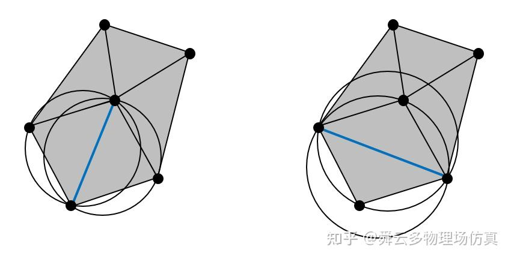
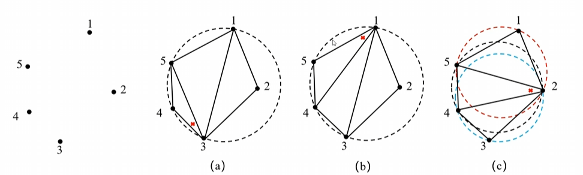
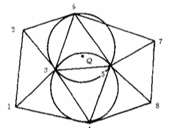
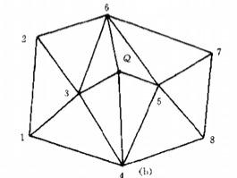
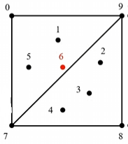
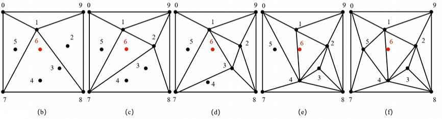
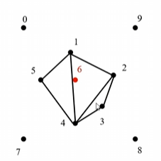
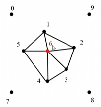
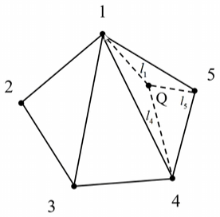

# Delaunay 三角刨分

> 德劳内三角刨分

Delaunay 三角形划分方法，是将**平面上一组已给定的点**连成三角形的方法，这些连接而成的点具有一些特点

1. 所形成的三角形互不重叠
2. 所形成的三角形可以覆盖整个平面
3. 每个点均不位于不包含该点的三角形内的外接圆内，每个三角形的外接圆只包含该三角形的三个点

如上图所示，左边的三角形满足第三点，每个三角形的外接圆只包含该三角形的三个点。右边的三角形不满足第三点，一个三角形外接圆包含除了三角形三点之外的其他点

Delaunay 三角形的优点

1. Delaunay 三角形化方法所连接成的各三角形中的**最小角**最大化
2. 生成的三角形变成的均匀性最好，最接近**正三角形**

> 三角形中**最小角**最大，三角形内角和 180°，有三个角，那么最小角最大是 60°，也就是正三角形

首先给出确定的点集合 1~5，根据这些点可以有 a、b、c 三种构成三角形的方法

a、b 两种构建方法不符合**外接圆**的要求，c 的最小角最大并且满足外接圆要求

## 已经构建完 Delaunay 三角后 新增点

以上图为例，原本通过 1~8 构成完毕，现在想要新增一个点 Q 到集合中

1. 对每个三角形做外接圆
2. 找到包含点 Q 的外接圆，外接圆对应的三角形需要修改，因为它们已经不符合 Delaunay 三角形的外接圆规则
3. 消去外接圆包括 Q 的这些三角形的公共边，形成 Delaunay 空腔(3, 4, 5, 6)
4. 连接 Q 点和 Delaunay 空腔内各个顶点，构成新的 Delaunay 三角形

| 通过外接圆找到需要修改的三角形 | 连接空腔各个顶点 |
| --- | --- | 
|  |  |

### 边界匹配问题

对于上图，给定了 1~5 点，6为预先给出的内点

1. 包围求解区域的各个边界点，做一个辅助正四边形以及两个三角形 790 和 789
2. 考虑点 1，消去公共线 79，连接得到图 b
3. 考虑点 2，消去公共线 18，连接得到图 c
4. 考虑点 3、4、5，最终连接得到图 f

参考点 4 的加入，也就是从 d -> e 的过程

在图 d 中，考虑加入点 4 时，有四个三角形 (017、173、738、123) 的内切圆中包含了点 4，所以去除了 17、13、37 三个边，并重新连接得到图 e

> 一个点加入时，公共线不一定只有一条

最后将辅助边和辅助点(0、7、8、9)都删掉

此时按照前面的方法，再加入点 6，得到最终结果

### 向求解区域引入内设点

为什么需要向已经初始化的 Delaunay 设点？因为仅用边界点生成的 Delaunay 三角网格可能出现网格疏密与边界不一致（边界密集、内部稀疏），也可能出现过于扁平的三角形（最小角接近0°）导致数值计算不稳定

向初始化的 Delaunay 三角形内加点的过程是生成非结构网格的关键步骤，需要满足三个基本要求

1. 过程能够自动进行，即加入的点的位置选择符合一定规则
2. 内点的生成能将边界上已经设定的网格点疏密程度光滑的传递到求解区域内部
3. 方便控制区域内**点（或者某一条直线）**附近网格的疏密

> 第 2 点，其实就是期望边界密度自然传递至内部

为了完成上述要求，引入两个几何参数

1. 长度标尺
2. 三角形外接圆无量纲半径

**长度标尺**

长度标尺是赋予网格点的一个几何参数。对边界上的网格点及内部的网格点的**长度标尺**做以下定义

- **边界上网格点**的**长度标尺**定义为：该点到边界上相邻两网格点的距离的平均值的 $\sqrt{3}/2$ 倍
- **内部网格点**的**长度标尺**则采用下列倒数原则，由边界上的网格点的**长度标尺**的**插值**而得

以上图为例，设 Q 是要插入到 三角形145 中的一点，Q的长度标尺 `L(Q)` 表示如下

$$
L(Q) = \frac{L(1)/l_1 + L(4)/l_4 + L(5)/l_5}{1/l_1 + 1/l_4 + 1/l_5}
$$

`L(1)`、`L(4)`、`L(5)` 是边界网格点的长度标尺，`l1`、`l4`、`l5` 是 Q 点到三顶点的距离

**三角形外接圆的无量纲半径**

设任意一个 Delaunay 三角形为 `k`，其外接圆的半径为 `r(k)`，其外接圆的圆心长度标尺为 `L(Q)`，其外接圆无量纲半径 `R(k)`

$$
R(k) = \frac{r(k)}{L(Q)}
$$

- **长度标尺**代表了别接上网格疏密的程度，网格点稠密的地方长度尺度小，稀疏处长度标尺大
- **无量纲半径**用于判断三角形偏离正三角形的严重程度，`R(k)` 越大偏离越严重。应该先向 `R(k)` 较大的三角形中添加内点，以改善网格质量

接下来需要添加内点

1. 计算所有已经生成的 Delaunay 三角形外接圆圆心的长度标尺 `L(k)` 以及外接圆半径 `r(k)`
2. 计算所有无量纲半径 `R(k)`
3. 对所有现存的三角形按 `R(k)` 进行排序，从大到小
4. 得到 `R(k)` 最大三角形，向其**外接圆圆心**处增加一个新的内点 Q
5. 利用之前 Delaunay 三角形化方法，连接 Q 与有关网格点，生成一组新的 Delaunay 三角形
6. 重新计算现存三角形的 `R(k)` 并排序
7. 如果 `R(k)` 最大值大于一个**设定值**，则重复**第四步**；否则结束

