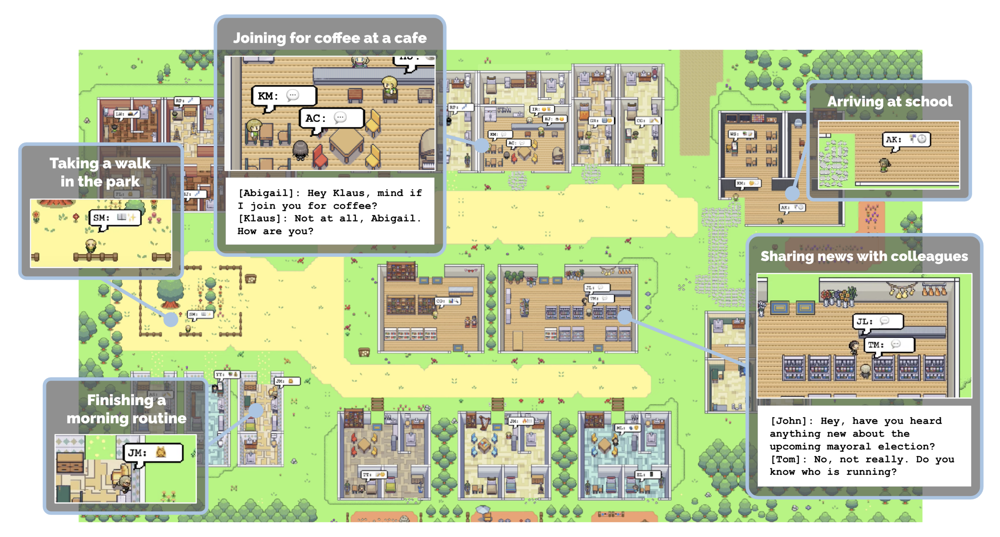
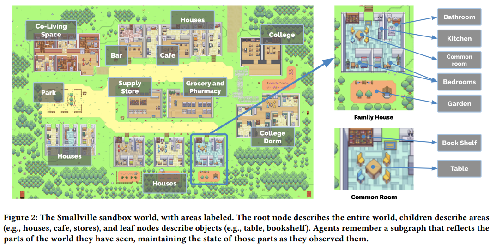
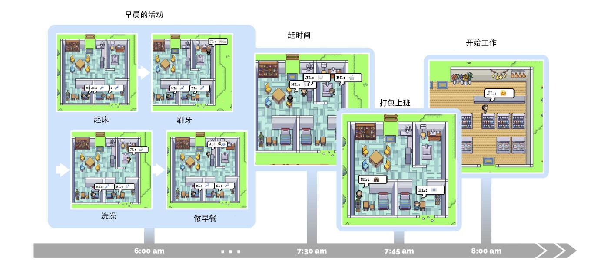
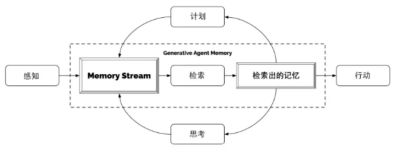
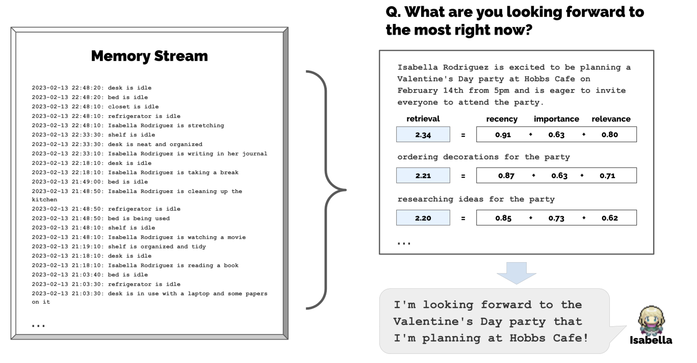
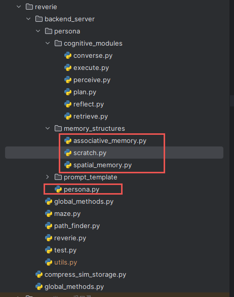

# Generative Agents

生成式智能体

项目路径：[joonspk-research/generative_agents](https://github.com/joonspk-research/generative_agents)

论文路径：[Generative Agents: Interactive Simulacra of Human Behavior](https://arxiv.org/abs/2304.03442)

中文翻译：[斯坦福大学AI小镇论文《Generative Agents :interactive simulacra of human behavior》（全文翻译）](https://zhuanlan.zhihu.com/p/662730929)

> 生成式智能对象：人类行为的交互式模拟

## 论文解读

### 1. INTRODUCTION



这是一个基于 Gpt3.5 开发的虚拟小镇，小镇中有 25 名居民，这些居民都是由生成式智能体模拟

实现这样的虚拟小镇需要三个组件：记忆(`memory stream`)、反思(`reflect`)、计划(`planning`)

To enable generative agents, we describe an architecture that extends a large language model to store a complete record of the agent’s experiences using natural language, synthesize those memories over time into higher-level reflections, and retrieve them dynamically to plan behavior

为了实现生成代理，我们描述了一种架构，该架构扩展了一个大型语言模型，使用自然语言存储代理体验的完整记录，将这些**记忆**随着时间的推移合成为更高层次的**反馈**，并动态检索它们以**计划**行为

> `Large Language Model` 大语言模型 `LLM`

We demonstrate through ablation that the components of our agent architecture—`observation`, `planning`, and `reflection`—each contribute critically to the believability of agent behavior. 

我们通过消融证明，我们的代理架构的各个组成部分——**观察**、**规划**和**反思**——都对代理行为的可信度做出了关键性的贡献

> `Observation` 其实就是 `Memory Stream` 记忆系统

> `Agents` 把 `LLM` 作为大脑，其还需要一个身体去做 `Action`

Our architecture comprises three main components. The first is the `memory stream`, a long-term memory module that records, in natural language, a comprehensive list of the agent’s experiences. A memory retrieval model combines relevance, recency, and importance to surface the records needed to inform the agent’s moment-to-moment behavior. The second is `reflection`, which synthesizes memories into higher level inferences over time, enabling the agent to draw conclusions about itself and others to better guide its behavior. The third is `planning`, which translates those conclusions and the current environment into high-level action plans and then recursively into detailed behaviors for action and reaction. These reflections and plans are fed back into the memory stream to influence the agent’s future behavior

我们的架构包括三个主要组件。第一个是**记忆流**，一个**长期记忆模块**，用自然语言记录代理的全面经历列表。记忆检索模型结合相关性、新近性和重要性，浮现出需要告知代理瞬时行为的记录。第二个是**反思**，随着时间的推移将记忆综合成更高层次的推论，使代理能够得出关于自己和他人的结论，以更好地指导其行为。第三个是**规划**，将这些结论和当前环境转化为高层次的行动计划，然后递归地转化为详细的行为以进行行动和反应。这些反思和计划被反馈到记忆流中，以影响代理的未来行为

> 需要通过 **记忆** 进行 **反思**；根据 **记忆** 进行长期的 **规划**

### 2. RELATED WORK

第二章 `RELATED WORK` 相关工作介绍了 **人类和AI的交互**、**可信的人类行为模拟**、**大模型和人类行为**，其中 **大模型和人类行为** 介绍了如何使用大模型实现**人类和AI的交互**以及**可信的人类行为模拟**

大型语言模型从其训练数据中编码了广泛的人类行为

- 如果在一个狭义定义的上下文中进行提示，这些模型可以用来生成可信的行为。例如，社会模拟使用大型语言模型生成用户，以填充新的社交计算系统，原型化其涌现的社会动态
- 大型语言模型还被用来生成用户可以参与的互动人类行为。例如，在游戏中，这些模型被用来创建互动小说和文字冒险游戏
- 由于它们能够生成和分解动作序列，大型语言模型还被用于规划机器人任务。例如，当面对一个任务，如捡起一个瓶子时，模型会被提示将任务分解为较小的动作序列，如前往瓶子所在的桌子并捡起它

基于上述工作，大型语言模型可以成为创建可信代理的关键成分

可信代理不仅需要基于其当前环境，还需要基于大量的过去经验，这对于使用 `first-order prompting` 来说是不合适的（截至目前，由于底层模型的有限上下文窗口，这是不可能的）。最近的研究试图通过增加一个静态知识库和信息检索方案或一个简单的总结方案来超越 `first-order prompting`

### 3. GENERATIVE AGENT BEHAVIOR AND INTERACTION

> 生成式智能体行为和交互



这是一个名为 `Smallville` 的小村庄，里面有学校、学校宿舍、酒吧、住宅区、公园等，模拟了一个典型的村庄结构

某些建筑中还有细节内容，比如桌子、椅子、厨房、卧室等结构

> 项目支持 25 个独一无二的 agents

编写一段自然语言描述每个代理的身份，包括他们的职业、与其他代理的关系作为初始记忆

代理通过他们的行动与世界互动，并通过自然语言彼此交流

- 代理间通信：代理通过他们的行动与世界互动，并通过自然语言彼此交流。在沙盒引擎的每个时间步，代理输出一个描述其当前行动的自然语言陈述
- 用户控制：用户通过指定代理应该如何看待他们的角色，以自然语言与代理交流
  - 例如用户指定自己是新闻“记者”并通过说“谁在竞选公职？”来询问即将到来的选举

用户和代理可以影响这个世界中对象的状态，就像在《模拟人生》等沙盒游戏中一样。例如，当代理在睡觉时，床可以被占用，当代理用完早餐的食材时，冰箱可以是空的。最终用户还可以通过用自然语言重写代理周围对象的状态来重塑代理在 `Smallville` 的环境

代理在 `Smallville` 中的移动就像在简单的游戏中一样，进入和离开建筑物，导航其地图，并接近其他代理。代理的移动由生成代理架构和沙盒游戏引擎指挥：当模型指示代理将移动到某个位置时，我们计算到 `Smallville` 环境中目的地的行走路径，代理开始移动

> 如果用户在 `Isabella` 进入浴室时将她的淋浴状态设置为**漏水**，她会从客厅拿工具并尝试修理漏水

从单段描述开始，生成代理开始计划他们的一天。随着沙盒世界中时间的推移，这些代理的行为随着它们彼此和世界的互动而演变，建立记忆和关系，并协调联合活动

通过彼此互动，`Smallville` 中的生成代理交换信息，形成新关系，并协调联合活动。扩展先前的工作，这些社会行为是**涌现**的，而不是预先编程的



> 生成虚拟人John Lin的一天早晨。John大约在早上6点醒来，完成他的早晨常规，包括刷牙、洗澡和吃早餐。他在出门开始工作之前，与妻子Mei和儿子Eddy简短地交流一下

- **信息扩散**：当代理注意到彼此时，它们可能会进行对话——在这样做时，信息可以从一个代理传播到另一个代理
- **关系记忆**：`Smallville` 中的代理随着时间的推移形成新关系，并记住他们与其他代理的互动
- **协调**：用户只设置了 `Isabella` 举办派对的初始意图和 `Maria` 对 `Klaus` 的暗恋，传播消息、装饰、互相邀请、参加派对和在派对上互动的社会行为都是由代理架构发起的



> 生成虚拟人的整体架构。虚拟人会感知其当前所处环境，并将所有感知保存在一个全面记录虚拟人经历的记忆流中。基于它们的感知，该架构检索相关的记忆，并使用这些检索到的记忆来确定虚拟人的行为。检索出的记忆同时也用于形成长期计划和创建更高层次的思考，这两者都被输入到记忆流中以供将来使用

### GENERATIVE AGENT ARCHITECTURE

> 架构

将大型语言模型与合成和检索相关信息的机制相结合，以调节语言模型的输出，保证虚拟人能够根据过去的经验作出反应，并进行重要推理

**记忆的检索**

架构的核心模块是**记忆流**，本质上它是一个数据库记录了虚拟人的全部经历。在记忆流中，虚拟人根据所需进行检索历史记录用以规划虚拟人的行为，并对自身所处环境做出相应的反应。历史记录会递归地合成为越来越高层次的思考来指导虚拟人行为。所有内容都以自然语言描述的方式记录和推理，这就是为何我们的架构能与大语言模型进行兼容的原因所在

如果虚拟人一次性将所有的记忆全部提交给大语言模型，可能会分散模型的注意力，并当前模型的上下文有大小限制，最终可能会导致大语言模型产生一个无效信息的回答

为了解决这个问题，记忆流使用一个**对象列表**来维护虚拟人的全部历史记录，每个**对象**包含自然语言描述、创建时间和最近访问时间戳

> 记忆流最近基本元素是视觉观察

> 常见的古观察包括虚拟人自己的行为、他人行为、物体对象的状态

项目提供检索函数，以虚拟人所处的现状为输入值，返回记忆流的子集给大语言模型

通过 `Recency`、`Importance` 和 `Relevance` 对记忆进行评分

- Recency: 最近访问记忆的时间
- Importance: 记忆的重要性**普通记忆**或者**核心记忆**
- Relevance: 记忆与当前情况的相关性



-----------------------

**思考**

> 当虚拟人感知到的最新事件的重要性得分之和超过一个阈值（在我们的实现中为150）时就会形成思考。在实践中，我们的虚拟人大约每天思考两到三次

思考的第一步是确定虚拟人要思考什么，通过确定根据虚拟人最近的经验可以提出哪些问题

该项目将虚拟人最近的100条记忆流记录提供给大模型，来得到有关联并且重要的三个问题

-----------------------

**计划和反馈**

虽然一个大型语言模型可以根据情境信息生成合理的行为，但虚拟人需要在**更长的时间范围**内进行规划，以确保他们的行动序列连贯可信

计划描述了虚拟人的未来行动序列，并有助于保持虚拟人的行为在时间上的一致性。计划包括**位置**、**开始时间**和**持续时间**

和反思一样，计划被存储在记忆流中，并包含在检索过程中。这使得虚拟人在决定如何行动时可以同时考虑观察、思考和计划。虚拟人在需要时可以更改他们的计划

生成虚拟人在一个行动循环中运行，每个时间步骤中，它们感知周围的世界，这些感知的结果被存储在它们的记忆流中。我们用这些感知结果提示语言模型，以决定虚拟人是否应该继续执行现有计划，还是做出动作反应

虚拟人在彼此互动时进行对话交流。我们通过将虚拟人的话语与他们对彼此的记忆联系起来来生成他们的对话

### SANDBOX ENVIRONMENT IMPLEMENTATION

> 沙盒环境的实现

服务器维护一个包含沙盒世界中每个虚拟人的信息的JSON数据结构，包括它们当前的位置，当前动作的描述以及它们正在与之交互的沙盒对象。在每个沙盒时间步骤中，沙盒服务器解析JSON以获取来自虚拟人的任何更改，将虚拟人移动到新位置，并更新虚拟人正在与之交互的任何沙盒对象的状态

沙盒服务器还负责将每个虚拟人视觉范围内的所有虚拟人和对象发送到该虚拟人的内存中，以便虚拟人可以适当地做出反应。然后，虚拟人的输出动作更新JSON，并循环进行下一个时间步骤

沙盒环境——区域和物体——表示为一个树形数据结构，树中的边表示沙盒世界中的包含关系。将这棵树转换为自然语言，传递给虚拟人。例如， **炉子** 作为 **厨房** 的子项被转化为 **厨房里有一个炉子** 

当虚拟人在沙盒世界中行走时，虚拟人的子树会进行更新，用以反映新感知到的区域。虚拟人并不是全知全能的：当它们离开一个区域时，它们的树可能变得过时，并在重新进入该区域时进行更新

## 代码

### 数据存储结构



| 类名 | 作用 |
| --- | --- |
| `Scratch` | 管理代理的短期记忆（`short-term memory`）。它存储了代理当前的状态、行为和环境感知，包括视觉范围、注意力带宽和记忆保持时间等属性。该类还包括代理的基本身份信息（如名字、年龄、特质）、每日计划、当前行动和对话等数据 |
| `MemoryTree` | 类用于管理代理的空间记忆（`spatial memory`），即代理对虚拟环境中各个区域和对象的记忆。该类通过树结构存储不同世界、区域和竞技场之间的关系，以及各个区域内的对象 |
| `ConceptNode` | `ConceptNode` 类用于表示单个记忆节点，这些记忆可以是事件、思考或聊天。它存储了记忆节点的各个属性，包括三元组(`subject`, `predicate`, `object`)、描述、创建时间、过期时间和关键词等 |
| `AssociativeMemory` | 用于管理代理的核心长期记忆（`long-term memory`），包括事件、思考和聊天。该类通过 `ConceptNode` 类表示单个记忆节点，并提供添加、保存和检索记忆的方法 |
| `Persona` | 生成代理的核心类，包含代理的所有认知功能，包括感知、检索、计划、执行和反思。该类整合了 `Scratch`, `MemoryTree`, `AssociativeMemory` 和 `ConceptNode` 等类，提供了一个完整的代理行为模型 |

`Persona` 类包含 `Scratch`, `MemoryTree`, `AssociativeMemory` 这三个类的实例，用于管理代理的短期记忆、空间记忆和长期记忆。这些记忆模块为 `Persona` 类提供了感知、检索、计划、执行和反思功能所需的数据支持

`MemoryTree` 类是代理的空间记忆管理器，不直接使用 `ConceptNode` 类。但它可能会在空间记忆中存储一些与事件或对象相关的 `ConceptNode` 信息

`AssociativeMemory` 类使用 `ConceptNode` 类来表示单个记忆节点，包括事件、思考和聊天。`AssociativeMemory` 类通过 `ConceptNode` 对象管理代理的长期记忆，提供添加、保存和检索记忆的方法

`Memory Tree` 类中只有一个属性 `tree`，它是一个字典存储着场景物体的空间信息

```py
{
  "world_1": {
    "sector_1": {
      "arena_1": ["object_1", "object_2"],
      "arena_2": ["object_3"]
    },
    "sector_2": {
      "arena_3": ["object_4"]
    }
  },
  "world_2": {
    "sector_3": {
      "arena_4": ["object_5"]
    }
  }
}
```

`AssociativeMemory` 类用于管理代理的核心长期记忆，包括事件、思考和聊天。这个类通过 `ConceptNode` 表示单个记忆节点

`AssociativeMemory` 中属性如下

| AssociativeMemory 的属性名 | 作用 |
| --- | --- |
| `id_to_node` | 节点 ID 到节点对象的映射字典 |
| `seq_event`, `seq_thought`, `seq_chat` | 事件、思考和聊天的序列列表 |
| `kw_to_event`, `kw_to_thought`, `kw_to_chat` | 关键字到事件、思考和聊天的映射字典 |
| `kw_strength_event`, `kw_strength_thought` | 关键字在事件和思考中的强度字典 |
| `embeddings` | 节点的嵌入表示字典,嵌入向量用于计算节点之间的相似度或关联性，有助于在检索和比较节点时进行更细致的分析 |

一个 `ConceptNode` 会分别在 `id_to_node` 和 `seq_***` 中各存一份，以此来提高检索效率、简化操作、增强灵活性

`ConceptNode` 节点中存储着节点的描述：主谓宾、描述、重要程度、关键字、访问事件、过期事件和补充信息
