# 漏斗算法

> 文章：https://blog.csdn.net/fengkeyleaf/article/details/118832924

在导航网格中

1. 通过凸包和三角形划分，能够得到有关联关系的多边形数组
2. 通过 A* 寻路算法，能够得到从起点到目标点会经过的多边形数组

需要通过多边形数组来定位需要经过的路径

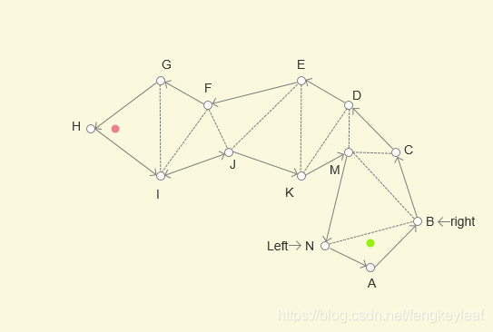

> 一般是会切割成多个三角形不会出现多边形。因为当玩家进入一个三角形的时候，一个边是玩家的入口，另一个边是障碍物，最后只有一个边是出口，比较明确出入关系

绿点作为起点，红点作为终点，如何找到一条最短路径能够从起点到终点呢？

设定 **绿点** 为 `X`，**红点**为 `Y`

绿点作为起点，被包括在三角形 ABN 中，首先定位到下一个三角形是 NMB，那么公共边 NB 是一定要经过的，所以将 XN 作为左边界，XB 作为右边界，形成一个**漏斗**形状

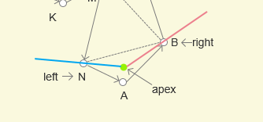

漏斗算法计算流程就是下面两步交替运行

1. 如果新的顶点与 判定点 形成的漏斗比原来的小，那么将对应的左顶点或者右顶点移动到该位置；反之不做更新
2. 如果新的一侧顶点与 判定点 形成的边界，越过了另一侧原顶点与 判定点 形成的边界，则将另一侧原顶点设置新的 判定点，并将该点添加到最路径中

根据上图所示的情况，进行实际分析

1. 对于 N 和 B 两点，B点在下一个三角形 `BCM` 边界上，N 没有，所以先动 左边界 XN，左边界变成 `XM`
2. 由于新边界 `XM` 和 `XB` 形成的漏斗比原来小，则 `XM` 形成新边界

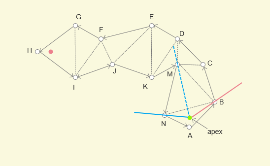

3. 再动右边界，从 `XB` 变更为 `XC`，由于 `XM` 和 `XC` 形成的漏斗更小，所以右边界变更为 `XC`

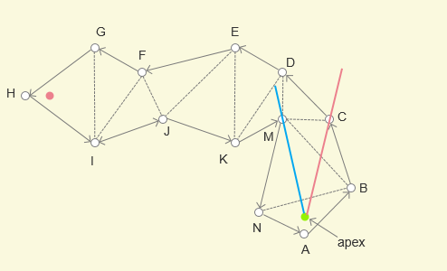

4. 再判断 M 和 C 两点，由于 M 在下一个三角形 `KMD` 边界上，所以先动 C 点，也就是右边界
5. 由于新右边界 `XD` 和 `XM` 形成的漏斗更小了，所以右边界更新为 `XD`

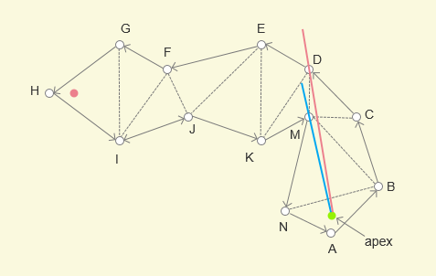

6. 更新左边界，`XM` 更新为 `XK`，由于 `XK` 和 `XD` 形成的漏斗变大了，所以 `XK` 更新失败，退回到 `XM`

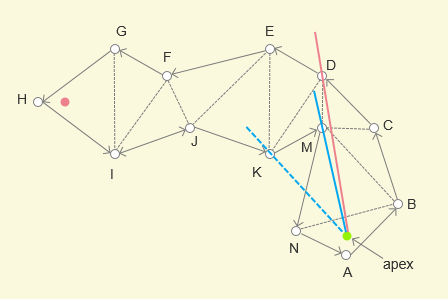

7. 更新右边界，由于右边界 `XE` 超过了左边界 `XM`，所以更新目标点，从 X 点变为 M 点，并将 M 点添加到最短路径中

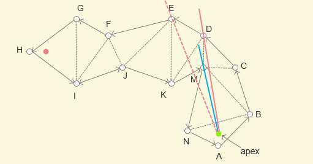

8. 以 M 点作为新的判定点，重新设置漏斗

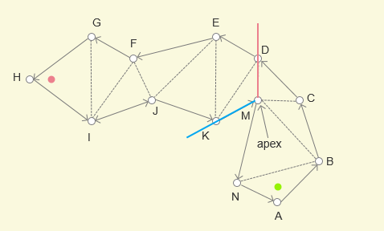

9. 将右边界从 `MD` 更新为 `ME`，角度减少，右边界更新成功，变为 `ME`
10. 将左边界从 `MK` 更新为 `MJ`，角度减少，左边界更新成功，变为 `MJ`
11. 将右边界从 `ME` 更新为 `MF`，角度减少，右边界更新成功，变为 `MF`
12. 将左边界从 `MJ` 更新为 `MI`，角度增加，左边界更新失败，保持为 `MJ`
13. 将右边界从 `MF` 更新为 `MG`，角度增加，右边界更新失败，保持为 `MF`
14. 将左边界从 `MJ` 更新为 `MY` (Y是终点)，角度减少，左边界更新成功
15. 将右边界从 `MF` 更新为 `MY` (Y是终点)，角度减少，右边界更新成功
16. 左右边界都是 MY，漏斗算法结束

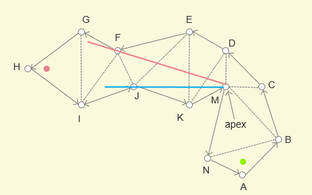

那么最短路径也就确定了，从 X(起点) -> M -> Y(终点)

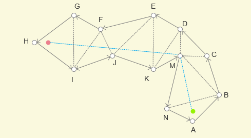

## 补充说明

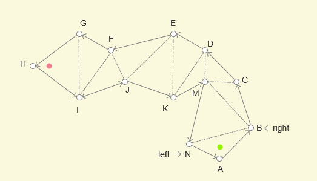

以 N 点为例，规定其为左边界顶点，那么沿着多边形的外边(实线边)，所经过的顶点都是左边界顶点，不包括 H

同理，B 为右边界顶点，那么 B、C、D、E、F、G 也都是右边界顶点

通过，这个规则，确定了左边界顶点和右边界顶点

那么，每次更新顶点的时候是先更新**左顶点**还是**右顶点**呢？

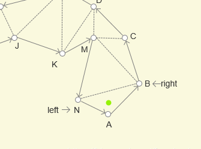

由于所有都是三角形，并且每个三角形只有一个相邻的三角形，所以所以三角形中一定存在一个**导航边**，和一个**外边**

以上图为例，BM 作为连接 MCB 和 NMB 的边是**导航边**，那么另一个边 MN 就是**外边**

同理，对于三角形 MCD 来说，MD 是**导航边**，CD 是**外边** 

