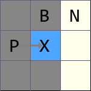
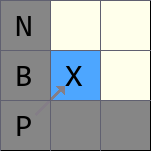
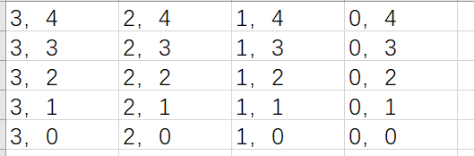
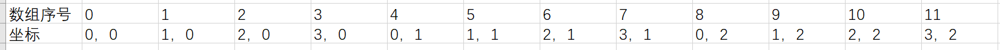
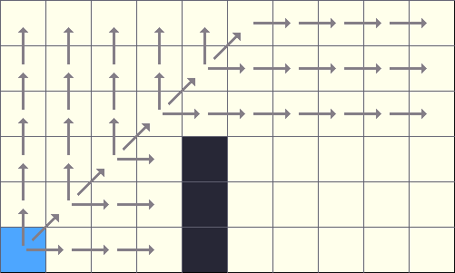

# JPS

> Jump Point Search

参考文档： https://zhuanlan.zhihu.com/p/500807732
参考代码： https://github.com/ai-winter/ros_motion_planning/blob/master/src/core/path_planner/path_planner/src/graph_planner/jps_planner.cpp

## 概念解释

### 强制邻居



从 P 点进入 X 点，当前在 X 点

P 点可以通过 B 点 到达 N 点；P 点可以通过 X 点到达 N 点

如果此时 B 点变成障碍物，无法达到，那么 P 点到达 N 点**只能**通过 X 点

所以说 N 点是 X 点的强制邻居



> 上图同理，如果 B 点为障碍物，那么 N 点只能通过 X 点才能到达

## 代码分析

### 基本结构定义

定义基本结构体 Node

```cpp
class JNode : public Node
{
  public:
    /* @brief Construct a new JNode object
     * @param x   节点对应 X 轴坐标
     * @param y   节点对应 Y 轴坐标
     * @param g   节点对应 到 StartNode 的 Cast
     * @param h   节点对应 到 EndNode 的 Cast
     * @param id  节点对应 的 ID
     * @param pid 节点对应 的 Parent 的 ID
     * @param fid 节点对应 强制邻居 Forced neighbor ID
     */
    JNode(int x = 0, int y = 0, double g = 0.0, double h = 0.0, int id = 0, int pid = -1, int fid = 0)
      : Node(x, y, g, h, id, pid), fid_(fid)
    {}  

    struct compare_cost
    {
        bool operator()(const Node& n1, const Node& n2) const
        {
            return (n1.g() + n1.h() > n2.g() + n2.h()) || ((n1.g() + n1.h() == n2.g() + n2.h()) && (n1.h() > n2.h()));
        };
    };
}
```

- 定义 x 轴的长度为 nx_
- 定义 y 轴的长度为 ny_

定义 左 是 x 轴正方向；定义 上 是 y 轴正方向

```cpp
// [left, right, top, bottom, left-top, right-bottom, right-top, left-bottom]
const std::array<int, 8> dirs_ = { 1, -1, nx_, -nx_, nx_ + 1, -nx_ - 1, nx_ - 1, -nx_ + 1 };
const std::unordered_map<int, std::pair<int, int>> dir_to_obs_id_ = {
  { -nx_, { 0, 1 } },      // direction bottom, obstacle detection [left-right]
  { nx_, { 0, 1 } },       // direction top, obstacle detection [left-right]
  { -1, { 2, 3 } },        // direction right, obstacle detection [top-bottom]
  { 1, { 2, 3 } },         // direction left, obstacle detection [top-bottom]
  { -nx_ - 1, { 0, 2 } },  // direction right-bottom, obstacle detection [left-top]
  { nx_ + 1, { 1, 3 } },   // direction left-top, obstacle detection [right-bottom]
  { -nx_ + 1, { 1, 2 } },  // direction left-bottom, obstacle detection [right-top]
  { nx_ - 1, { 0, 3 } },   // direction right-top, obstacle detection [left-bottom]
};
```

大概的坐标点分布如下图所示



通过一个一维数组来存储二维矩阵，使用 `dirs_` 数组来定义 **移动方向**



所以 dirs_ 数组中，序号为 index 的节点，左侧节点序号是是 index + 1，上方节点序号是 index + nx_

使用 `dir_to_obs_id_` 来映射 **强制邻居检测** 

key 表示 移动方向， value 表示 dirs_ 数组的索引，用于表示检测方向

### 查找强制邻居

通过 dir 和 cur_id 可以确定从 哪个 方向进入的 当前节点


> 以上图为例，从 P 点到 X 点，方向是右移，对应的 `dir_` 序号是 -1

- 如果是 水平移动，则需要判断新节点的 上下节点 是否存在 强制邻居
- 如果是 竖直移动，则需要判断新节点的 左右节点 是否存在 强制邻居
- 如果是 斜向移动，则需要判断新节点的 反向分解方向的节点
  - 如果是 右上角移动，则需要判断新节点的 左 和 下 节点
  - 如果是 左上角移动，则需要判断新节点的 右 和 下 节点


> 这里从 P 移动到 X 是右上角移动，则需要判断 X 的 左节点 和 下节点

```cpp
bool JPSPathPlanner::_forceNeighborDetect(int dir, int cur_id, std::vector<int>& fn_id)
{
  fn_id.clear();
  std::array<int, 2> delta_obs = { dirs_[dir_to_obs_id_.at(dir).first], dirs_[dir_to_obs_id_.at(dir).second] };

  // horizon or vertical
  if (dir == 1 || dir == -1 || dir == nx_ || dir == -nx_)
  {
    for (int i = 0; i < 2; i++)
    {
      if (costmap_->getCharMap()[cur_id + delta_obs[i]] >= costmap_2d::LETHAL_OBSTACLE * obstacle_factor_ &&
          costmap_->getCharMap()[cur_id + delta_obs[i] + dir] < costmap_2d::LETHAL_OBSTACLE * obstacle_factor_)
      {
        fn_id.push_back(cur_id + delta_obs[i] + dir);
      }
    }
  }
  // slash
  else
  {
    for (int i = 0; i < 2; i++)
    {
      if (costmap_->getCharMap()[cur_id + delta_obs[i]] >= costmap_2d::LETHAL_OBSTACLE * obstacle_factor_ &&
          costmap_->getCharMap()[cur_id + 2 * delta_obs[i] + dir] < costmap_2d::LETHAL_OBSTACLE * obstacle_factor_)
      {
        fn_id.push_back(cur_id + 2 * delta_obs[i] + dir);
      }
    }
  }

  return !fn_id.empty();
}
```


上述情况 配和 代码，这么理解

通过 `dir` 从 `dir_to_obs_id_` 和 `dirs_` 中得到需要判断 **障碍物** 的方向

此时 `delta_obs` 的内容是 上 和 下

- 遍历 `delta_obs`
  - 如果 **当前节点** 的 **上节点** 是 **障碍物**，那么 **当前节点** 的 **上节点** 的 右节点 是 强制邻居
  - 如果 **当前节点** 的 **下节点** 是 **障碍物**，那么 **当前节点** 的 **下节点** 的 **右节点** 是 强制邻居

注意，需要判断 **强制邻居** 不能是 **障碍物**

> `ostmap_->getCharMap()[id]` 值大于 `obstacle_factor_` 表示障碍物


上述情况 配合 代码，这么理解

通过 `dir` 从 `dir_to_obs_id_` 和 `dirs_` 中得到需要判断 障碍物 的方向

此时 `delta_obs` 的内容是 左 和 下

- 遍历 `delta_obs`
  - 如果 **当前节点** 的 **左节点** 是 **障碍物**，那么 **当前节点** 的 **左上角** 节点是 **强制邻居**
  - 如果 **当前节点** 的 **下节点** 是 **障碍物**，那么 **当前节点** 的 **右下角** 节点是 **强制邻居**

> 注意，需要判断 **强制邻居** 不能是 **障碍物**

如果是斜向时，强制邻居的 id 是 `cur_id + 2 * delta_obs[i] + dir`，仍然以上述情况为例子

移动方向是 **右上角**，**当前节点** 的 **左节点** 是 **障碍物**，那么 **当前节点** 的 **左上角** 节点是 **强制邻居**

此时 `delta_obs[i]` 表示 左方向， cur_id + 左方向 * 2 + 右上 得到的就是 左上角

### _checkStraightLine 和 _checkSlashLine

> _checkStraightLine 检查所有 竖直 或者 水平 方向  
> _checkSlashLine 检查所有 斜向

JPS 查询一个点，是先查询这个点的斜向

比如样例代码中，先查询起点的 左上方向 和 右下方向，再查询 左下方向 和 右上方向

```cpp
// initialization
for (int i = 4; i < 6; i++)
{  // explore left-top and right-bottom from current
  _checkSlashLine(dirs_[i], start_, open_list_);
}
for (int i = 6; i < 8; i++)
{  // explore left-bottom and right-top from next
  _checkSlashLine(dirs_[i], start_, open_list_, false);
}
```

在斜向查询的时候，会分解斜向向量，比如如果是 右上方向查询，会将查询区分为 右 和 上 两个方向，并一直查询下去，直到遇到 **障碍物**、**终点**、**强制邻居**




> 先查找当前点 **上方向** 所有点，再查询 **右方向** 所有点

当 当前节点 的 右方向 和 上方向 全部遍历完毕之后，沿着当前节点的 右上角 移动，再判断新节点的 右方向 和 上方向 全部节点

### _jump

因为 `_checkStraightLine` 和 `_checkSlashLine` 遍历节点时，遇到 **强制邻居** 就会停止搜索，导致后续节点可能没有搜索完毕

通过 parent_Id 和自己的 ID，沿着未搜索完的方向继续搜索

```cpp
int dir = calDir(node.id(), node.pid());
if (dir == 1 || dir == -1 || dir == nx_ || dir == -nx_)
{
  _checkStraightLine(dir, node, open_list);
}
else
{
  _checkSlashLine(dir, node, open_list);
}
```

然后沿着 强制邻居 方向继续搜索

```cpp
if (node.fid() != -1)
{
  int f_dir = calDir(node.fid(), node.id());
  _checkSlashLine(f_dir, node, open_list, false);
}
```

这 `_jump` 函数中，仍然会向 `open_list` 中添加新的节点

### plan

首先从 `start_` 起点开始，初始化 `open_list_` 的内容

```cpp  
// initialization
for (int i = 4; i < 6; i++)
{  // explore left-top and right-bottom from current
  _checkSlashLine(dirs_[i], start_, open_list_);
}
for (int i = 6; i < 8; i++)
{  // explore left-bottom and right-top from next
  _checkSlashLine(dirs_[i], start_, open_list_, false);
}
```

然后对 `open_list_` 进行遍历，通过 `_jump` 对跳点进行处理

```cpp
while (!open_list_.empty())
{
  // pop current node from open list
  auto current = open_list_.top();
  open_list_.pop();

  // current node do not exist in closed list
  if (closed_list_.find(current.id()) != closed_list_.end())
    continue;

  closed_list_.insert(std::make_pair(current.id(), current));
  expand.emplace_back(current.x(), current.y());

  // goal found
  if (current == goal_)
  {
    // 找到目标点
  }

  // 对跳点进行处理
  _jump(current, open_list_);
}
```
