# UE 编辑器开发指南

> **目标读者**：有一定 C++ 基础、对 UE 编辑器想要深度了解的初学者  
> **引擎版本**：Unreal Engine 5.4.4  
> **内容来源**：直接阅读引擎源码，所有结论均来自真实代码  

---

## 目录

1. [UE 编辑器整体框架结构](#1-ue-编辑器整体框架结构)
2. [蓝图编辑器详细拆解（Actor Blueprint）](#2-蓝图编辑器详细拆解)
   - [2.1 Viewport 预览界面](#21-viewport-预览界面)
   - [2.2 Details 属性面板](#22-details-属性面板)
   - [2.3 函数/Events 节点图界面](#23-函数events-节点图界面)
   - [2.4 蓝图编译流程](#24-蓝图编译流程)
   - [2.5 Find 查找功能](#25-find-查找功能)
   - [2.6 右键菜单节点选项](#26-右键菜单节点选项)
   - [2.7 节点连接判断](#27-节点连接判断)
   - [2.8 运行时节点数据存储](#28-运行时节点数据存储)
3. [编辑器扩展实战](#3-编辑器扩展实战)
   - [3.1 添加菜单项到 Window 菜单](#31-添加菜单项到-window-菜单)
   - [3.2 创建新资产类型](#32-创建新资产类型)
   - [3.3 为新资产类型创建专属编辑器](#33-为新资产类型创建专属编辑器)

---

## 1. UE 编辑器整体框架结构

### 编辑器是怎么组织的？

UE 编辑器是一个巨大的 C++ 程序，但它并不是铁板一块——而是由数百个独立的 **模块（Module）** 拼合而成。每个模块是一个 DLL，有自己的 `.Build.cs` 构建文件，遵守"模块只能向上依赖"的原则（Runtime 不依赖 Editor）。

> **关键理解**：  
> - 所有 `Source/Runtime/` 下的代码在打包后游戏中也会存在  
> - 所有 `Source/Editor/` 下的代码**只在编辑器构建中存在**，打包不含这些代码  
> - 判断方式：看 `.Build.cs` 里 `Target.Type == TargetRules.TargetType.Editor` 的条件判断

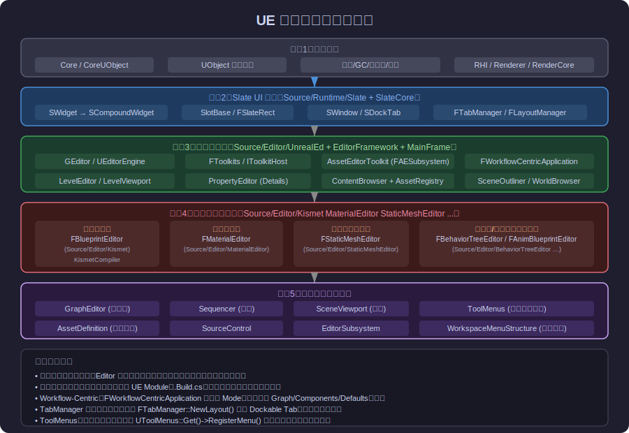

### 核心继承体系

每一个资产编辑器（比如蓝图编辑器、材质编辑器）都沿着以下继承链往上追溯：

```
FBlueprintEditor
  └─> FWorkflowCentricApplication
       └─> FAssetEditorToolkit
            └─> FBaseToolkit
                 └─> IToolkit (纯接口)
```

**为什么有这么多层？**

- `IToolkit`：定义了"一个可停靠在工具栏宿主上的工具"的最小接口
- `FBaseToolkit`：提供工具栏、命令绑定、菜单、热键的通用实现
- `FAssetEditorToolkit`：增加了"编辑一个 UObject 资产"的能力（打开/保存/撤销等）
- `FWorkflowCentricApplication`：允许同一个工具有**多个模式（Mode）**切换，每种模式有不同的 Tab 布局
- `FBlueprintEditor`：蓝图编辑器自己的逻辑

### Slate UI 系统——UE 的 UI 不是 Qt，不是 ImGui

UE 使用**自研的声明式 UI 框架 Slate**。每个 UI 元素是一个 `SWidget`，采用类似 HTML 的树形结构组织。

Slate 的特点：
- 所有 Widget 都在堆上分配，通过 `TSharedRef<SWidget>` 持有
- 使用宏 `SNew(WidgetType)` 创建，`.Attribute()` 链式设置属性
- 布局靠 `SHorizontalBox`, `SVerticalBox`, `SSplitter`, `SOverlay` 等组合
- 绑定数据靠 **Attribute**（每帧重新计算）或 **Delegate**（事件通知）

```cpp
// Slate 代码示例：创建一个水平布局，含文本和按钮
return SNew(SHorizontalBox)
    + SHorizontalBox::Slot()
    .AutoWidth()
    [
        SNew(STextBlock)
        .Text(LOCTEXT("MyLabel", "Hello"))
    ]
    + SHorizontalBox::Slot()
    .FillWidth(1.0f)
    [
        SNew(SButton)
        .OnClicked(this, &FMyEditor::OnButtonClicked)
        [
            SNew(STextBlock).Text(LOCTEXT("Btn", "Click Me"))
        ]
    ];
```

### Tab 管理系统

编辑器的每个面板（Viewport、Details、Graph…）都是一个 **Dockable Tab**，由 `FTabManager` 管理。布局通过 JSON 序列化存盘（文件名如 `Standalone_BlueprintEditor_Layout_v7`）。

每个 Tab 对应一个 **`FWorkflowTabFactory`** 子类，负责：
1. 定义 Tab 的 ID 和标题
2. `CreateTabBody()` 方法返回该 Tab 的 Slate Widget

**文件位置**：
- `Source/Editor/Kismet/Private/BlueprintEditorModes.cpp`：蓝图编辑器三种模式（Graph/Components/Defaults）及其 Tab 布局
- `Source/Runtime/Slate/Public/Framework/Docking/TabManager.h`：TabManager 完整接口

---

## 2. 蓝图编辑器详细拆解

先看一眼蓝图编辑器的整体界面布局：

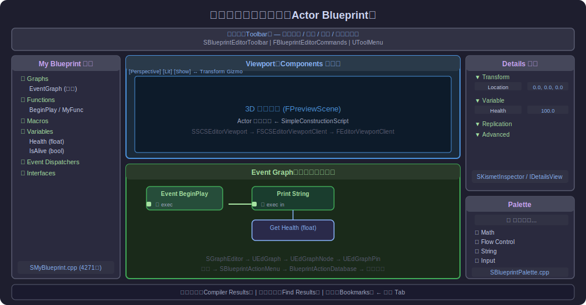

蓝图编辑器由**三种模式**组成（在顶部工具栏切换）：

| 模式名 | ID | 显示内容 |
|---|---|---|
| Components 模式 | `"ComponentsName"` | Viewport + Components 树 + Details |
| Graph 模式（默认） | `"GraphName"` | My Blueprint + Graph + Details + Palette |
| Defaults 模式 | `"DefaultsName"` | 所有变量默认值 |

每种模式的 Tab 布局在 `FBlueprintEditorApplicationMode` 构造函数中通过 `FTabManager::NewLayout(...)` 定义。

> **源码参考**：`Source/Editor/Kismet/Private/BlueprintEditorModes.cpp`，约第1行起

---

### 2.1 Viewport 预览界面

**这个 Viewport 是什么？**

不是 Level Editor 的 Viewport，而是蓝图编辑器在 **Components 模式** 下专门为这个 Blueprint 的 Actor 做的预览窗口。你可以在这里拖动组件的位置。

**类层次结构**：

```
SSCSEditorViewport          (Slate Widget 外壳)
  └── FSCSEditorViewportClient  (真正的渲染逻辑，继承 FEditorViewportClient)
       └── FPreviewScene          (持有一个独立的 UWorld，Actor 在里面)
```

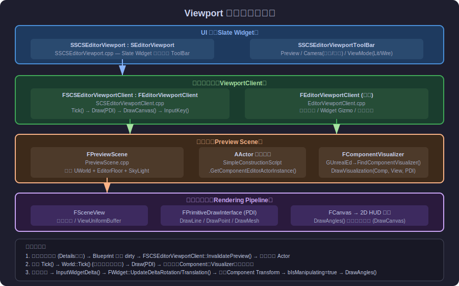

#### Slate 外壳：SSCSEditorViewport

位置：`Source/Editor/Kismet/Private/SSCSEditorViewport.cpp`

这个 Widget 的主要职责：
1. 创建 `FSCSEditorViewportClient` 实例（在 `MakeEditorViewportClient()` 中）
2. 提供上方的 **ToolBar**（`SSCSEditorViewportToolBar`），包含：
   - **Preview** 按钮：切换物理模拟预览
   - **Camera** 下拉：透视/顶视/前视/左视等正交视角
   - **View Mode** 下拉：Lit / Unlit / Wireframe / CollisionVisibility

#### 渲染核心：FSCSEditorViewportClient

位置：`Source/Editor/Kismet/Private/SCSEditorViewportClient.cpp`（约1000行）

这个类继承 `FEditorViewportClient`，覆写了几个关键的虚函数：

**`Tick(float DeltaSeconds)`** — 每帧调用
```cpp
// 关键逻辑（简化）：
void FSCSEditorViewportClient::Tick(float DeltaSeconds)
{
    FEditorViewportClient::Tick(DeltaSeconds);  // 相机插值等

    // 确保 Preview Actor 是最新的（重新编译后 Actor 实例会换）
    if (PreviewActor != Blueprint->SimpleConstructionScript->GetComponentEditorActorInstance())
        Blueprint->SimpleConstructionScript->SetComponentEditorActorInstance(PreviewActor);

    // 驱动 PreviewScene 的 World Tick
    PreviewScene->GetWorld()->Tick(LEVELTICK_ViewportsOnly, DeltaSeconds);
}
```

**`Draw(const FSceneView* View, FPrimitiveDrawInterface* PDI)`** — 每帧绘制
```cpp
void FSCSEditorViewportClient::Draw(const FSceneView* View, FPrimitiveDrawInterface* PDI)
{
    FEditorViewportClient::Draw(View, PDI);  // 画 Gizmo 等

    // 对每个选中的组件，找到对应的 ComponentVisualizer 并让它画辅助线
    for (auto SelectedNode : BlueprintEditor->GetSelectedSubobjectEditorTreeNodes())
    {
        const UActorComponent* Comp = SelectedNode->FindComponentInstanceInActor(PreviewActor);
        TSharedPtr<FComponentVisualizer> Visualizer = GUnrealEd->FindComponentVisualizer(Comp->GetClass());
        if (Visualizer.IsValid())
            Visualizer->DrawVisualization(Comp, View, PDI);  // 比如相机锥形框
    }
}
```

**`DrawCanvas(FViewport&, FSceneView&, FCanvas&)`** — 绘制 2D HUD 覆盖

当你正在拖动组件（`bIsManipulating == true`），这里会调用 `DrawAngles()` 显示当前旋转角度的文字 overlay。

**`InputKey(...)` / `ProcessClick(...)` / `InputWidgetDelta(...)`** — 处理鼠标/键盘

- 点击时 `ProcessClick()` 通过 `HHitProxy` 判断你点的是什么（Gizmo轴？组件？）
- 拖动时 `InputWidgetDelta()` 修改选中组件的 Transform，并设置 `bIsManipulating = true`

#### 预览场景：FPreviewScene

位置：`Source/Editor/UnrealEd/Public/PreviewScene.h`

`FPreviewScene` 是一个轻量级的 `UWorld` 包装器，专为编辑器预览用。它：
- 持有一个 `UWorld`（与 Level Editor 的 World 完全独立）
- 加了一个 Editor 地板网格（`EditorFloorComp`，可在用户设置里关闭）
- 加了天空盒（`SetSkyCubemap`）和方向光

**属性修改时 Viewport 怎么刷新？**

```
用户在 Details 面板改了组件属性
  → FPropertyChangedEvent 触发
  → SKismetInspector::NotifyPostChange()
  → FBlueprintEditor::OnObjectPropertyChanged()
  → FSCSEditorViewportClient::InvalidatePreview(bReInitScene=false)
  → 销毁旧 Preview Actor，用 Blueprint 重建新的
```

---

### 2.2 Details 属性面板

**Details 面板是什么？**

当你在 Viewport 里选中一个组件，或在 My Blueprint 里选中一个变量，右侧就会显示它的属性。这就是 Details 面板。

**类层次**：

```
FSelectionDetailsSummoner (Tab 工厂)
  └── 创建 SKismetInspector (蓝图编辑器专属的 Details 容器)
       └── 内部持有 IDetailsView (通用 PropertyEditor 界面)
            └── 每个属性由 SPropertyEditor 子类渲染
```

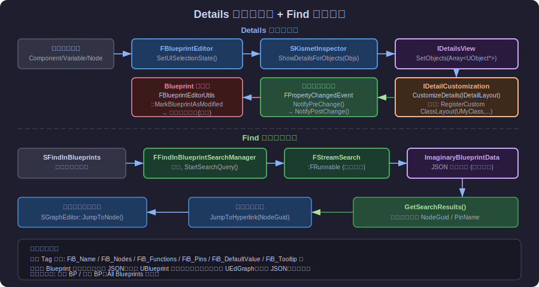

#### 谁创建 Details Tab？

`FSelectionDetailsSummoner` 继承 `FWorkflowTabFactory`，在 `FBlueprintEditorApplicationMode` 构造函数中注册：

```cpp
// BlueprintEditorModes.cpp（简化）
TabFactories.RegisterFactory(MakeShareable(new FSelectionDetailsSummoner(InBlueprintEditor)));
```

#### SKismetInspector

位置：`Source/Editor/Kismet/Private/SKismetInspector.cpp`

这是蓝图编辑器对 Details 面板的特化封装。它覆盖了 `IDetailsView` 的默认行为，让显示更符合蓝图工作流：

```cpp
void SKismetInspector::ShowDetailsForObjects(TArray<UObject*> Objects)
{
    // 过滤掉 null，设置标题文字
    // 调用内部 IDetailsView::SetObjects(Objects)
}
```

#### IDetailsView 与属性定制

`IDetailsView` 是 PropertyEditor 模块（`Source/Editor/PropertyEditor/`）提供的通用属性显示界面。每行属性对应一个 `IDetailPropertyRow`。

**如果想定制某个类在 Details 面板中的显示方式**，继承 `IDetailCustomization`：

```cpp
class FMyActorDetails : public IDetailCustomization
{
public:
    static TSharedRef<IDetailCustomization> MakeInstance() 
    { 
        return MakeShareable(new FMyActorDetails); 
    }

    virtual void CustomizeDetails(IDetailLayoutBuilder& DetailBuilder) override
    {
        // 隐藏某个属性
        DetailBuilder.HideProperty("SomePropertyName");
        
        // 添加自定义 UI 行
        IDetailCategoryBuilder& MyCategory = DetailBuilder.EditCategory("MyCategory");
        MyCategory.AddCustomRow(LOCTEXT("MyRow", "My Widget"))
        .ValueContent()
        [
            SNew(SButton).Text(LOCTEXT("Btn", "Do Something"))
        ];
    }
};

// 在模块 StartupModule() 中注册
FPropertyEditorModule& PropModule = FModuleManager::LoadModuleChecked<FPropertyEditorModule>("PropertyEditor");
PropModule.RegisterCustomClassLayout("MyActor", 
    FOnGetDetailCustomizationInstance::CreateStatic(&FMyActorDetails::MakeInstance));
```

#### 属性修改的广播链

```
用户修改一个属性值（在 SPropertyEditor 的文本框里）
  ↓
IPropertyHandle::SetValue()
  ↓
FPropertyChangedEvent 被构建
  ↓
UObject::PreEditChange()    ← 对象可以在这里做备份
  ↓
[属性值真正写入内存]
  ↓
UObject::PostEditChangeProperty(FPropertyChangedEvent)  ← 对象可以在这里响应变化
  ↓
FBlueprintEditorUtils::MarkBlueprintAsModified()
```

这个广播链使得属性改动能够：
1. 刷新 Viewport 预览（SCS 重建 Actor 实例）
2. 标记 Blueprint 为脏（提示需要保存）
3. 可选地触发自动重新编译

---

### 2.3 函数/Events 节点图界面

这是蓝图编辑器最核心的功能——可视化编程节点图。

#### 数据模型：三层对象

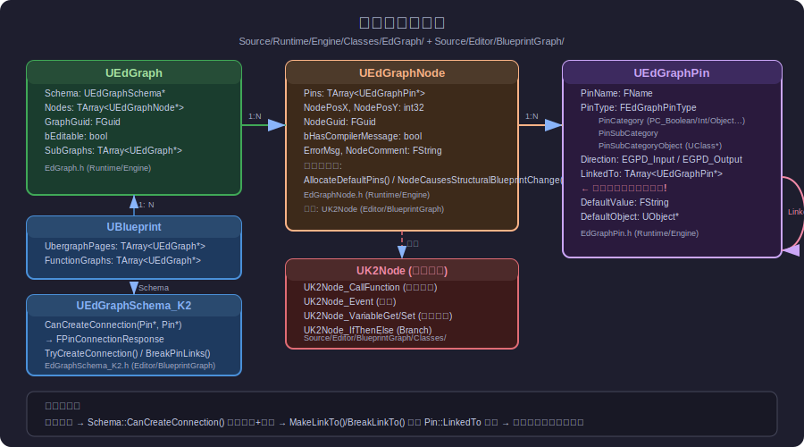

**第一层：`UEdGraph`**（位置：`Source/Runtime/Engine/Classes/EdGraph/EdGraph.h`）

这是整张图本身。一个 Blueprint 可以包含多张图：

```cpp
// 在 UBlueprint 里
TArray<UEdGraph*> UbergraphPages;   // Event Graph（主图，通常只有1张）
TArray<UEdGraph*> FunctionGraphs;  // 每个自定义函数一张图
TArray<UEdGraph*> MacroGraphs;     // 每个 Macro 一张图
```

`UEdGraph` 持有：
- `Nodes`：该图中所有节点的数组
- `Schema`：`UEdGraphSchema*`，决定了这张图支持哪些操作（K2图的 Schema 是 `UEdGraphSchema_K2`）
- `GraphGuid`：全局唯一ID，用于 Find 功能定位

**第二层：`UEdGraphNode`**（位置：`Source/Runtime/Engine/Classes/EdGraph/EdGraphNode.h`）

每个节点。`UEdGraphNode` 是基类，真正使用的是 `UK2Node` 的各种子类（位置：`Source/Editor/BlueprintGraph/Classes/`）：

| 子类 | 作用 |
|---|---|
| `UK2Node_CallFunction` | 调用一个 UFunction |
| `UK2Node_Event` | 事件节点（BeginPlay 等） |
| `UK2Node_VariableGet` | 读取变量 |
| `UK2Node_VariableSet` | 写入变量 |
| `UK2Node_IfThenElse` | Branch 节点 |
| `UK2Node_MacroInstance` | 调用一个 Macro |
| `UK2Node_CustomEvent` | 自定义事件 |
| `UK2Node_Knot` | 连线折角点 |

每个节点最重要的虚函数：
- `AllocateDefaultPins()`：初始化时自动创建该节点应该有哪些 Pin
- `GetNodeContextMenuActions()`：定义该节点右键菜单有哪些选项
- `ExpandNode()`：编译前展开（某些节点编译时会被替换成更简单的节点）

**第三层：`UEdGraphPin`**（位置：`Source/Runtime/Engine/Classes/EdGraph/EdGraphPin.h`）

每个节点的输入/输出引脚。最重要的字段：

```cpp
struct UEdGraphPin
{
    FName PinName;            // 引脚名称（显示给用户看）
    FEdGraphPinType PinType;  // 引脚类型（见下方说明）
    EEdGraphPinDirection Direction;  // EGPD_Input 或 EGPD_Output
    
    TArray<UEdGraphPin*> LinkedTo;  // ← 所有连线就存在这里！
    
    FString DefaultValue;       // 没有连线时的默认值（文字）
    UObject* DefaultObject;     // 没有连线时的默认值（对象引用）
};
```

**`FEdGraphPinType` 的 `PinCategory` 常见值**（定义在 `EdGraphSchema_K2.h`）：

```cpp
PC_Boolean    // bool
PC_Int        // int32
PC_Int64      // int64
PC_Real       // float 或 double（由 PinSubCategory 区分）
PC_String     // FString
PC_Name       // FName
PC_Text       // FText
PC_Object     // UObject* 子类（PinSubCategoryObject 指向 UClass）
PC_Struct     // 结构体（PinSubCategoryObject 指向 UScriptStruct）
PC_Exec       // 执行流控制线（白色三角形引脚）
```

#### 连线就是修改 `LinkedTo` 数组

当用户拖拽一根线从 Pin A 到 Pin B：
1. 调用 Schema 验证：`UEdGraphSchema_K2::CanCreateConnection(PinA, PinB)`
2. 验证通过后：`PinA->MakeLinkTo(PinB)` → 把 B 加入 A.LinkedTo，把 A 加入 B.LinkedTo
3. 断开连线时：`PinA->BreakLinkTo(PinB)`

> **重要**：连线信息**只存在于编辑器的 `UEdGraphPin::LinkedTo`** 中。运行时根本没有这些对象。

---

### 2.4 蓝图编译流程

按下 **Compile** 按钮后，蓝图编辑器调用：

```cpp
FBlueprintCompilationManager::CompileSynchronously(UBlueprint* Blueprint, EBlueprintCompileOptions Options)
```

整个编译是一个**16阶段的流水线**，处理所有相互依赖的 Blueprint（因为你可能有继承关系）：

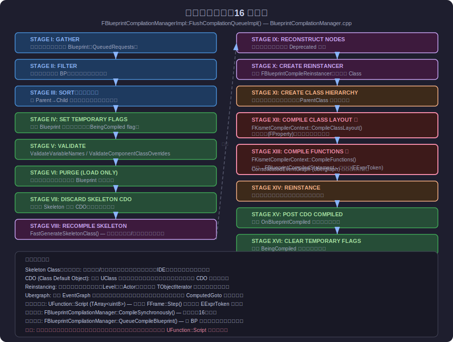

#### 关键阶段详解

**STAGE VIII: RECOMPILE SKELETON（快速生成骨架类）**

"骨架类"（Skeleton Class）是一个只含**变量定义和函数签名**、不含函数体字节码的特殊 UClass。它的用途：
- 让依赖这个 Blueprint 的其他 Blueprint 能看到变量和函数（IDE补全靠这个）
- 在真正编译完成前提供占位

```
Blueprint → FastGenerateSkeletonClass()
  → 创建 SKEL_UMyActor_C（注意前缀 SKEL_）
  → 只设置 UProperty 和 UFunction 签名
  → 不执行 CompileFunctions
```

**STAGE XII + XIII: COMPILE CLASS LAYOUT & COMPILE FUNCTIONS（核心！）**

这两个阶段由 `FKismetCompilerContext` 执行（位置：`Source/Editor/KismetCompiler/`）：

```
第一步：CompileClassLayout()
  → CreateClassVariablesFromBlueprint()  — 把蓝图变量转成 FProperty
  → 设定 UClass 的内存布局（每个 FProperty 的偏移量）

第二步：CompileFunctions()
  → 收集所有 Event Graph → 合并成一张 ConsolidatedEventGraph（Ubergraph）
  → 对每个节点调用 NodeHandlingFunctor::RegisterNets()
     — 把节点的每个 Pin 转成 FBPTerminal（VM 的虚拟寄存器概念）
  → 对每个节点调用 NodeHandlingFunctor::Compile()
     — 生成 FBlueprintCompiledStatement 列表（中间表示）
  → 调用 FKismetCompilerVMBackend::GenerateCodeFromClass()
     — 把 Statement 列表转成 EExprToken 字节码
     — 写入 UFunction::Script（TArray<uint8>）
```

#### 中间表示：FBlueprintCompiledStatement

在节点→字节码的翻译过程中，引擎使用 `FBlueprintCompiledStatement` 作为中间形式（类似汇编指令），常见类型：

```cpp
KCST_CallFunction       // 调用函数：target->func(args)
KCST_Assignment         // 赋值：target = source
KCST_GotoIfNot          // 条件跳转：if (!cond) goto label
KCST_UnconditionalGoto  // 无条件跳转：goto label
KCST_Return             // 返回
KCST_ComputedGoto       // 动态跳转（用于 Ubergraph 分发）
KCST_CreateArray        // 创建数组字面量
KCST_DynamicCast        // Cast<T>(obj)
```

例如，一个 **Branch 节点**会被编译成大约这样：
```
KCST_GotoIfNot  (condition_pin) → else_label
KCST_Nop        // true 分支继续往下
...
KCST_UnconditionalGoto → end_label
else_label:
KCST_Nop        // false 分支
...
end_label:
```

#### STAGE XIV: REINSTANCE（重新实例化）

编译完成后，旧类已被新类替换，但 Level 里还有用旧类创建的 Actor 实例。引擎通过 `FBlueprintCompileReinstancer` 遍历所有存活实例，把它们的数据"迁移"到新类实例中（逐属性拷贝）。

---

### 2.5 Find 查找功能

按 `Ctrl+F`（或菜单 Edit → Find）打开 **SFindInBlueprints** 面板，可以在蓝图内容中搜索节点、变量、函数等。

架构如下（见 [详见图](Images/details-and-find.svg) 底部部分）：

#### 搜索索引的建立

蓝图在**保存时**，`FFindInBlueprintSearchManager` 会把该蓝图的所有可搜索内容序列化成 JSON 格式，存入 Blueprint 资产的元数据。这个 JSON 叫做 `ImaginaryBlueprintData`（"虚拟蓝图数据"，因为搜索时不需要加载真实的 UEdGraph，只需要这份 JSON）。

可搜索的标签（Tag）包括：
```
FiB_Name          // 节点/变量名
FiB_Nodes         // 所有节点
FiB_Functions     // 函数
FiB_Macros        // Macro
FiB_Pins          // 引脚
FiB_DefaultValue  // 默认值
FiB_Tooltip       // 工具提示
FiB_NodeGuid      // 节点的唯一ID（用于跳转）
FiB_Components    // 组件
```

#### 搜索执行

搜索词输入后：

```cpp
// 1. SearchManager 创建 FStreamSearch（继承 FRunnable，在独立线程运行）
TSharedRef<FStreamSearch> Search = MakeShareable(
    new FStreamSearch(SearchTerm, ESearchQueryFilter::AllFilter, EBlueprint::AllBlueprints));

// 2. FStreamSearch 在后台线程逐个遍历所有 Blueprint 的 ImaginaryBlueprintData
// 3. 用 FFiBSearchInstance 做字符串匹配
// 4. 结果收集到树形结构后，发回 UI 线程
// 5. SFindInBlueprints 在 Tick 里轮询结果并更新列表
```

#### 跳转到结果

用户点击搜索结果后：
```cpp
FBlueprintEditor::JumpToHyperlink(UObject* Node)
// 或
FKismetEditorUtilities::BringKismetToFocusAttentionOnObject(UObject*)
  → 找到包含该节点的 Graph → 在 SGraphEditor 中聚焦对应节点
```

---

### 2.6 右键菜单节点选项

在 EventGraph 空白处右键，会弹出节点选择菜单。

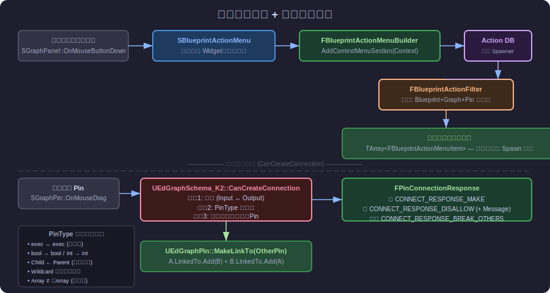

#### 节点选择菜单的产生

```
SGraphPanel::OnMouseButtonDown (右键)
  → SBlueprintActionMenu 被创建并弹出
    → 构造时调用 FBlueprintActionMenuBuilder::AddContextMenuSection(Context)
       → 创建 FBlueprintActionContext（包含：目标 Blueprint + 当前 Graph + 可能还有 Pin）
       → 查询 FBlueprintActionDatabase（全局单例，存储所有已注册的节点 Spawner）
       → 用 FBlueprintActionFilter 过滤（基于当前上下文，去掉不兼容的）
       → 生成 TArray<FBlueprintActionMenuItem> 列表
       → 显示给用户
```

#### FBlueprintActionDatabase — 节点的"注册中心"

每种节点（如 `UK2Node_CallFunction`）通过 **`UBlueprintNodeSpawner`** 在数据库里注册自己：

```cpp
// 某个节点类的静态方法，在模块启动时调用
void UK2Node_CallFunction::GetMenuActions(FBlueprintActionDatabaseRegistrar& ActionRegistrar)
{
    // 为每个可从蓝图调用的 UFunction 创建一个 Spawner
    UBlueprintFunctionNodeSpawner* Spawner = UBlueprintFunctionNodeSpawner::Create(Function);
    Spawner->CustomizeNodeDelegate = ... // 可以定制节点创建后的行为
    ActionRegistrar.AddBlueprintAction(Spawner);
}
```

#### 如何给自定义节点添加右键菜单项

在你的 `UK2Node` 子类里覆写：

```cpp
void UMyK2Node::GetNodeContextMenuActions(UToolMenu* Menu, UGraphNodeContextMenuContext* Context) const
{
    Super::GetNodeContextMenuActions(Menu, Context);
    
    FToolMenuSection& Section = Menu->AddSection("MySection", LOCTEXT("MySectionTitle", "My Actions"));
    Section.AddMenuEntry(
        "MyAction",
        LOCTEXT("MyActionLabel", "Do My Thing"),
        LOCTEXT("MyActionTip", "Does my thing"),
        FSlateIcon(),
        FUIAction(FExecuteAction::CreateUObject(
            const_cast<UMyK2Node*>(this), &UMyK2Node::DoMyThing))
    );
}
```

---

### 2.7 节点连接判断

当你在蓝图编辑器里拖拽一根线，UE 调用 Schema 的 `CanCreateConnection()` 来验证这根线是否合法。

**位置**：`Source/Editor/BlueprintGraph/Public/EdGraphSchema_K2.h`，实现在 `EdGraphSchema_K2.cpp`

```cpp
FPinConnectionResponse UEdGraphSchema_K2::CanCreateConnection(
    const UEdGraphPin* PinA, 
    const UEdGraphPin* PinB) const
```

返回类型 `FPinConnectionResponse` 包含：
- `Response` 枚举：`CONNECT_RESPONSE_MAKE`（允许）/ `CONNECT_RESPONSE_DISALLOW`（拒绝）/ `CONNECT_RESPONSE_BREAK_OTHERS`（允许但会断开原有连线）
- `Message`：拒绝时显示给用户的原因文字

**检查的规则（代码读取）**：

| 检查项 | 说明 |
|---|---|
| 方向检查 | Input 只能连 Output，反之亦然（不能 Output→Output） |
| 同节点检查 | 不能连到同一个节点自己的 Pin |
| Exec 类型检查 | Exec Pin（流控）只能连 Exec Pin，不能连数据 Pin |
| 类型兼容检查 | `FEdGraphPinType::GetPinTypeCompatibility()` — 子类可连父类变量，Wildcard 可连任意，Array 不能连非Array |
| 自循环检查 | 检测是否会形成无限循环（对 Pure 节点） |
| 已连接检查 | 某些类型的 Pin（如 Input 数据 Pin）最多只允许一个连线 |

**类型兼容的核心逻辑**（`ArePinTypesCompatible`）：

```
bool compatible = false;

// 1. 类型完全相同 → 兼容
if (PinA.PinCategory == PinB.PinCategory && ...)
    compatible = true;

// 2. 其中一个是 Wildcard → 兼容
if (PinA.PinCategory == PC_Wildcard || PinB.PinCategory == PC_Wildcard)
    compatible = true;

// 3. 都是 Object 类型，检查 UClass 继承关系
if (PinA.PinCategory == PC_Object && PinB.PinCategory == PC_Object)
{
    UClass* A = Cast<UClass>(PinA.PinSubCategoryObject);
    UClass* B = Cast<UClass>(PinB.PinSubCategoryObject);
    compatible = A->IsChildOf(B) || B->IsChildOf(A);
}
```

---

### 2.8 运行时节点数据存储

> **最重要的认知**：**蓝图节点（UEdGraphNode/UEdGraphPin）在运行时根本不存在！**

编译完成后，节点图被"烧录"成字节码，存入 `UBlueprintGeneratedClass`（继承 `UClass`）的各个 `UFunction` 中：

```
UBlueprintGeneratedClass (= 最终的运行时类)
  ├── UFunction "ExecuteUbergraph_MyBlueprint"  ← 所有 Event Graph 合并后的函数
  │     Script: TArray<uint8>  ← 字节码在这里
  ├── UFunction "MyCustomFunction"
  │     Script: TArray<uint8>
  └── ... (其他函数)
```

**运行时执行流程**：

```
某个事件触发（如 BeginPlay）
  → UObject::ProcessEvent(UFunction* Function, void* Parms)
     → 创建 FFrame（栈帧）
     → FFrame::Step() 循环执行字节码
        → 读取一个 EExprToken
        → 跳转到对应的 GNativeFuncTable[ExprToken] 执行
        → 继续下一条字节码
```

**字节码指令（EExprToken）** 的例子（来自 `Script/ScriptOpcodes.h`）：

```cpp
EX_CallMath       // 调用纯数学函数
EX_CallFunction   // 调用 UFunction
EX_Let            // 赋值
EX_Jump           // 无条件跳转
EX_JumpIfNot      // 条件跳转
EX_Return         // 函数返回
EX_DynamicCast    // 动态类型转换
```

**Ubergraph（超图）是什么？**

一个 Actor Blueprint 可以有多个 Event Graph（通常只有默认的一个），但编译器会把它们**合并成一个大函数** `ExecuteUbergraph_XXX`。每个事件（BeginPlay、Tick、自定义事件…）都是这个大函数中的一段代码，通过 `EX_Jump`/`ComputedGoto` 区分入口点。

好处：减少函数调用开销，所有执行在一个栈帧里进行。

---

## 3. 编辑器扩展实战

UE 提供了三个主要的扩展点，让你在不修改引擎代码的情况下添加功能。

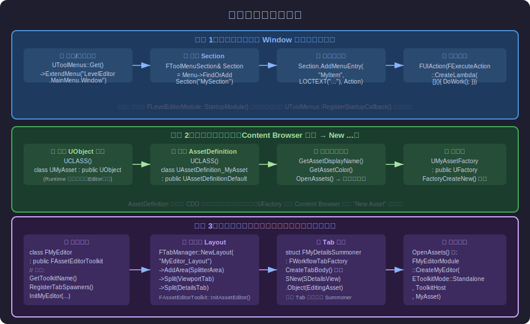

---

### 3.1 添加菜单项到 Window 菜单

**场景**：你想在 Level Editor 的 Window 菜单中添加一项"打开我的工具"。

**系统**：`UToolMenus`（`Source/Editor/ToolMenus/`），UE5 推荐的菜单系统。

**完整代码**：

```cpp
// 在你的 Editor 模块的 StartupModule() 里
void FMyEditorModule::StartupModule()
{
    // 延迟注册（等 LevelEditor 模块加载后）
    UToolMenus::RegisterStartupCallback(
        FSimpleMulticastDelegate::FDelegate::CreateRaw(this, &FMyEditorModule::RegisterMenus)
    );
}

void FMyEditorModule::RegisterMenus()
{
    // 获取或注册 Window 菜单
    UToolMenu* Menu = UToolMenus::Get()->ExtendMenu("LevelEditor.MainMenu.Window");
    
    // 找到或创建一个 Section（菜单分组）
    FToolMenuSection& Section = Menu->FindOrAddSection("MyToolsSection");
    Section.Label = LOCTEXT("MyToolsSectionLabel", "My Tools");
    
    // 添加一个菜单项
    Section.AddMenuEntry(
        "OpenMyTool",
        LOCTEXT("OpenMyToolLabel", "Open My Tool"),
        LOCTEXT("OpenMyToolTip", "Opens My Custom Tool Window"),
        FSlateIcon(FAppStyle::GetAppStyleSetName(), "LevelEditor.GameSettings"),  // 图标
        FUIAction(
            FExecuteAction::CreateLambda([]()
            {
                // 点击时执行
                FGlobalTabmanager::Get()->TryInvokeTab(FTabId("MyToolTab"));
            })
        )
    );
}

void FMyEditorModule::ShutdownModule()
{
    UToolMenus::UnRegisterStartupCallback(this);
    UToolMenus::Get()->UnregisterOwner(this);
}
```

**菜单路径的命名规则**：

- `"LevelEditor.MainMenu.Window"` — Level Editor 顶部菜单栏的 Window 菜单
- `"LevelEditor.MainMenu.Edit"` — Edit 菜单
- `"ContentBrowser.AssetContextMenu"` — Content Browser 资产右键菜单
- `"Graph.Node.ContextMenu"` — 蓝图图中节点的右键菜单

可以用 `UToolMenus::Get()->GetAllMenus()` 列出所有已注册的菜单名。

---

### 3.2 创建新资产类型

**场景**：你想创建一个新的资产类型 `UMyDialogueAsset`，让它出现在 Content Browser 的右键 "Miscellaneous" 中，双击时打开专属编辑器。

#### 步骤1：定义资产类（Runtime 模块）

```cpp
// Source/Runtime/MyGame/Public/MyDialogueAsset.h

UCLASS(BlueprintType)
class MYGAME_API UMyDialogueAsset : public UObject
{
    GENERATED_BODY()
public:
    UPROPERTY(EditAnywhere, Category="Dialogue")
    TArray<FString> Lines;
    
    UPROPERTY(EditAnywhere, Category="Dialogue")
    float DelayBetweenLines = 2.0f;
};
```

> **注意**：资产类本身放在 Runtime 模块，不要依赖 Editor 代码。

#### 步骤2：定义 AssetDefinition（Editor 模块）

UE5 使用新的 `UAssetDefinition` 系统（替代旧的 `IAssetTypeActions`）：

```cpp
// Source/Editor/MyGameEditor/Private/AssetDefinition_MyDialogueAsset.h

#include "AssetDefinitionDefault.h"
#include "MyDialogueAsset.h"

UCLASS()
class UAssetDefinition_MyDialogueAsset : public UAssetDefinitionDefault
{
    GENERATED_BODY()
public:
    // 资产在 Content Browser 中显示的名字
    virtual FText GetAssetDisplayName() const override
    { return LOCTEXT("MyDialogueAsset", "Dialogue Asset"); }
    
    // Content Browser 资产图标的颜色
    virtual FLinearColor GetAssetColor() const override
    { return FLinearColor(FColor(128, 200, 128)); }
    
    // 该 Definition 管理哪个类
    virtual TSoftClassPtr<UObject> GetAssetClass() const override
    { return UMyDialogueAsset::StaticClass(); }
    
    // 双击时打开（返回 Handled 表示我们自己处理了）
    virtual EAssetCommandResult OpenAssets(const FAssetOpenArgs& OpenArgs) const override
    {
        for (UMyDialogueAsset* Asset : OpenArgs.LoadObjects<UMyDialogueAsset>())
        {
            // 通过模块工厂函数打开编辑器
            FMyGameEditorModule& Module = FModuleManager::GetModuleChecked<FMyGameEditorModule>("MyGameEditor");
            Module.CreateDialogueEditor(OpenArgs.GetToolkitMode(), OpenArgs.ToolkitHost, Asset);
        }
        return EAssetCommandResult::Handled;
    }
};
```

**`UAssetDefinition` 无需手动注册**——引擎通过 CDO（Class Default Object）自动发现所有 `UAssetDefinition` 子类并注册它们。

#### 步骤3：定义工厂类（控制右键 "Create" 菜单）

```cpp
// Source/Editor/MyGameEditor/Private/MyDialogueAssetFactory.h

UCLASS()
class UMyDialogueAssetFactory : public UFactory
{
    GENERATED_BODY()
public:
    UMyDialogueAssetFactory()
    {
        bCreateNew = true;          // 支持 "New Asset" 创建（右键 → Miscellaneous）
        bEditAfterNew = true;       // 创建后立即打开编辑器
        SupportedClass = UMyDialogueAsset::StaticClass();
    }

    // 实际创建资产
    virtual UObject* FactoryCreateNew(UClass* Class, UObject* InParent, FName Name, 
                                       EObjectFlags Flags, UObject* Context, 
                                       FFeedbackContext* Warn) override
    {
        return NewObject<UMyDialogueAsset>(InParent, Class, Name, Flags);
    }
    
    // Content Browser 中 "Create" 按钮的分类
    virtual FText GetDisplayName() const override
    { return LOCTEXT("DialogueAssetFactory", "Dialogue Asset"); }
    
    virtual uint32 GetMenuCategories() const override
    { return EAssetTypeCategories::Misc; }
};
```

---

### 3.3 为新资产类型创建专属编辑器

**场景**：双击 `UMyDialogueAsset` 时，打开一个带有属性面板和自定义预览面板的专属编辑器窗口。

这一步是最复杂的，需要：
1. 创建编辑器类（继承 `FAssetEditorToolkit`）
2. 定义 Tab 布局
3. 为每个 Tab 创建 Summoner

#### 步骤1：编辑器类

```cpp
// Source/Editor/MyGameEditor/Public/MyDialogueEditor.h

class FMyDialogueEditor : public FAssetEditorToolkit
{
public:
    // 这是唯一的编辑器 App ID（必须全局唯一）
    static const FName AppIdentifier;
    static const FName DetailsTabId;
    static const FName PreviewTabId;

    void InitDialogueEditor(
        const EToolkitMode::Type Mode, 
        const TSharedPtr<IToolkitHost>& InitToolkitHost,
        UMyDialogueAsset* InAsset);

    UMyDialogueAsset* GetEditingAsset() const { return EditingAsset; }

    // FAssetEditorToolkit 必须实现的接口
    virtual FName GetToolkitFName() const override { return "MyDialogueEditor"; }
    virtual FText GetBaseToolkitName() const override { return LOCTEXT("DialogueEditor", "Dialogue Editor"); }
    virtual FString GetWorldCentricTabPrefix() const override { return "DialogueEditor"; }
    virtual FLinearColor GetWorldCentricTabColorScale() const override { return FLinearColor(0.3f, 0.2f, 0.5f); }
    virtual void RegisterTabSpawners(const TSharedRef<FTabManager>& InTabManager) override;
    virtual void UnregisterTabSpawners(const TSharedRef<FTabManager>& InTabManager) override;

private:
    UMyDialogueAsset* EditingAsset = nullptr;
    
    TSharedRef<SDockTab> SpawnDetailsTab(const FSpawnTabArgs& Args);
    TSharedRef<SDockTab> SpawnPreviewTab(const FSpawnTabArgs& Args);
};
```

#### 步骤2：初始化布局

```cpp
// Source/Editor/MyGameEditor/Private/MyDialogueEditor.cpp

const FName FMyDialogueEditor::AppIdentifier("MyDialogueEditorApp");
const FName FMyDialogueEditor::DetailsTabId("MyDialogueEditor_Details");
const FName FMyDialogueEditor::PreviewTabId("MyDialogueEditor_Preview");

void FMyDialogueEditor::InitDialogueEditor(
    const EToolkitMode::Type Mode,
    const TSharedPtr<IToolkitHost>& InitToolkitHost,
    UMyDialogueAsset* InAsset)
{
    EditingAsset = InAsset;

    // 定义 Tab 布局（类似 HTML 的分栏布局）
    const TSharedRef<FTabManager::FLayout> Layout =
        FTabManager::NewLayout("MyDialogueEditor_Layout_v1")
        ->AddArea
        (
            FTabManager::NewPrimaryArea()
            ->SetOrientation(Orient_Horizontal)
            ->Split
            (
                // 左侧：预览面板（占60%宽度）
                FTabManager::NewStack()
                ->SetSizeCoefficient(0.6f)
                ->AddTab(PreviewTabId, ETabState::OpenedTab)
            )
            ->Split
            (
                // 右侧：属性面板
                FTabManager::NewStack()
                ->SetSizeCoefficient(0.4f)
                ->AddTab(DetailsTabId, ETabState::OpenedTab)
            )
        );

    // 初始化（这会创建工具栏、打开窗口等）
    const bool bCreateDefaultStandaloneMenu = true;
    const bool bCreateDefaultToolbar = true;
    FAssetEditorToolkit::InitAssetEditor(
        Mode, InitToolkitHost, AppIdentifier,
        Layout, bCreateDefaultStandaloneMenu, bCreateDefaultToolbar,
        InAsset);
}

void FMyDialogueEditor::RegisterTabSpawners(const TSharedRef<FTabManager>& InTabManager)
{
    FAssetEditorToolkit::RegisterTabSpawners(InTabManager);
    
    // 注册 Details Tab
    InTabManager->RegisterTabSpawner(DetailsTabId,
        FOnSpawnTab::CreateSP(this, &FMyDialogueEditor::SpawnDetailsTab))
        .SetDisplayName(LOCTEXT("DetailsTab", "Details"))
        .SetIcon(FSlateIcon(FAppStyle::GetAppStyleSetName(), "LevelEditor.Tabs.Details"));
    
    // 注册 Preview Tab
    InTabManager->RegisterTabSpawner(PreviewTabId,
        FOnSpawnTab::CreateSP(this, &FMyDialogueEditor::SpawnPreviewTab))
        .SetDisplayName(LOCTEXT("PreviewTab", "Preview"))
        .SetIcon(FSlateIcon(FAppStyle::GetAppStyleSetName(), "LevelEditor.Tabs.Viewports"));
}

TSharedRef<SDockTab> FMyDialogueEditor::SpawnDetailsTab(const FSpawnTabArgs& Args)
{
    // 创建标准 Details View
    FDetailsViewArgs DetailsArgs;
    DetailsArgs.bHideSelectionTip = true;
    DetailsArgs.bLockable = false;
    DetailsArgs.NameAreaSettings = FDetailsViewArgs::HideNameArea;
    
    TSharedRef<IDetailsView> DetailsView = 
        FModuleManager::GetModuleChecked<FPropertyEditorModule>("PropertyEditor")
            .CreateDetailView(DetailsArgs);
    DetailsView->SetObject(EditingAsset);
    
    return SNew(SDockTab)
        .TabRole(ETabRole::PanelTab)
        [
            DetailsView
        ];
}

TSharedRef<SDockTab> FMyDialogueEditor::SpawnPreviewTab(const FSpawnTabArgs& Args)
{
    return SNew(SDockTab)
        .TabRole(ETabRole::PanelTab)
        [
            // 这里放你的自定义预览 Widget
            SNew(SVerticalBox)
            + SVerticalBox::Slot()
            .AutoHeight()
            [
                SNew(STextBlock)
                .Text_Lambda([this]() 
                { 
                    return FText::Format(
                        LOCTEXT("LineCount", "对话行数: {0}"),
                        EditingAsset ? EditingAsset->Lines.Num() : 0);
                })
            ]
        ];
}
```

#### 步骤3：从模块暴露工厂方法

```cpp
// Source/Editor/MyGameEditor/Public/MyGameEditorModule.h

class FMyGameEditorModule : public IModuleInterface
{
public:
    virtual void StartupModule() override;
    virtual void ShutdownModule() override;
    
    TSharedRef<FMyDialogueEditor> CreateDialogueEditor(
        const EToolkitMode::Type Mode,
        const TSharedPtr<IToolkitHost>& InitToolkitHost,
        UMyDialogueAsset* Asset)
    {
        TSharedRef<FMyDialogueEditor> Editor = MakeShareable(new FMyDialogueEditor());
        Editor->InitDialogueEditor(Mode, InitToolkitHost, Asset);
        return Editor;
    }
};
```

---

## 附录：常用文件位置速查

| 功能 | 源码位置 |
|---|---|
| 蓝图编辑器主类 | `Source/Editor/Kismet/Private/BlueprintEditor.cpp` |
| 蓝图编辑器公共 API | `Source/Editor/Kismet/Public/BlueprintEditor.h` |
| Viewport 外壳 | `Source/Editor/Kismet/Private/SSCSEditorViewport.cpp` |
| Viewport 渲染 | `Source/Editor/Kismet/Private/SCSEditorViewportClient.cpp` |
| 三种模式/Tab布局 | `Source/Editor/Kismet/Private/BlueprintEditorModes.cpp` |
| Details面板容器 | `Source/Editor/Kismet/Private/SKismetInspector.cpp` |
| 节点图 (UEdGraph) | `Source/Runtime/Engine/Classes/EdGraph/EdGraph.h` |
| 节点 (UEdGraphNode) | `Source/Runtime/Engine/Classes/EdGraph/EdGraphNode.h` |
| 引脚 (UEdGraphPin) | `Source/Runtime/Engine/Classes/EdGraph/EdGraphPin.h` |
| K2 节点基类 | `Source/Editor/BlueprintGraph/Classes/K2Node.h` |
| K2 Schema（连线规则） | `Source/Editor/BlueprintGraph/Public/EdGraphSchema_K2.h` |
| Blueprint 编译管理器 | `Source/Editor/KismetCompiler/Private/BlueprintCompilationManager.cpp` |
| K2 编译器核心 | `Source/Editor/KismetCompiler/Private/KismetCompiler.cpp` |
| 编译中间表示 | `Source/Editor/KismetCompiler/Public/BlueprintCompiledStatement.h` |
| Find 功能 | `Source/Editor/Kismet/Private/FindInBlueprintManager.cpp` |
| 右键菜单构建 | `Source/Editor/Kismet/Private/BlueprintActionMenuBuilder.cpp` |
| 资产定义系统 | `Source/Editor/AssetDefinition/Public/AssetDefinition.h` |
| 行为树编辑器（参考）| `Source/Editor/BehaviorTreeEditor/` |
| 菜单系统 | `Source/Editor/ToolMenus/Public/ToolMenus.h` |
| Slate 布局容器 | `Source/Runtime/Slate/Public/Widgets/Layout/` |
| Property Editor | `Source/Editor/PropertyEditor/Public/IDetailsView.h` |

---

## 附录：理解 UE 编辑器的关键心智模型

1. **编辑器 vs 运行时的分离**：蓝图节点只在编辑器里存在，编译后变成字节码。永远不要在运行时代码里引用 `UEdGraphNode`。

2. **Slate 是声明式的**：不要用命令式思维写 Slate（"先创建button，然后设位置，然后设文字"），而是"描述这个 Widget 树长什么样"。

3. **一切通过委托（Delegate）通信**：组件之间不直接调用，而是通过 `DECLARE_DELEGATE` / `DECLARE_MULTICAST_DELEGATE` 解耦。这让模块之间可以相互不知道对方的存在。

4. **Tab 是独立的**：每个 Tab 里的 Widget 可以被用户关闭/移走，你的代码不能假设某个 Tab 一定在屏幕上。

5. **UObject 是中心**：资产（`UObject` 子类）是数据的载体；编辑器只是视图+控制器。数据保存在 `.uasset` 文件里，与编辑器无关。

6. **Schema 定义了图的规则**：一张 `UEdGraph` 通过 `Schema` 知道自己支持哪些操作。材质图有 `UMaterialGraphSchema`，蓝图图有 `UEdGraphSchema_K2`，行为树有自己的 Schema。

---

*本文档基于 UE 5.4.4 源码分析，所有代码路径均经过实际验证。*

---

## 4. 图系统核心对象详解

> 本节基于 UE 5.4.4 源码实际阅读，覆盖五个核心对象：`SGraphEditor`、`UEdGraphSchema`、`FGraphPanelPinFactory`、`UEdGraph`、`UEdGraphNode`。

---

### 4.1 SGraphEditor — 节点图 Slate 控件

**源文件：** `Source/Editor/UnrealEd/Public/GraphEditor.h`

**作用：** `SGraphEditor` 是一个 Slate 控件（`SCompoundWidget` 子类），它是节点图可视化与交互的**统一入口**。编辑器里所有能看到的节点图界面（蓝图图、材质图、行为树等）都是通过 `SGraphEditor` 展示的。

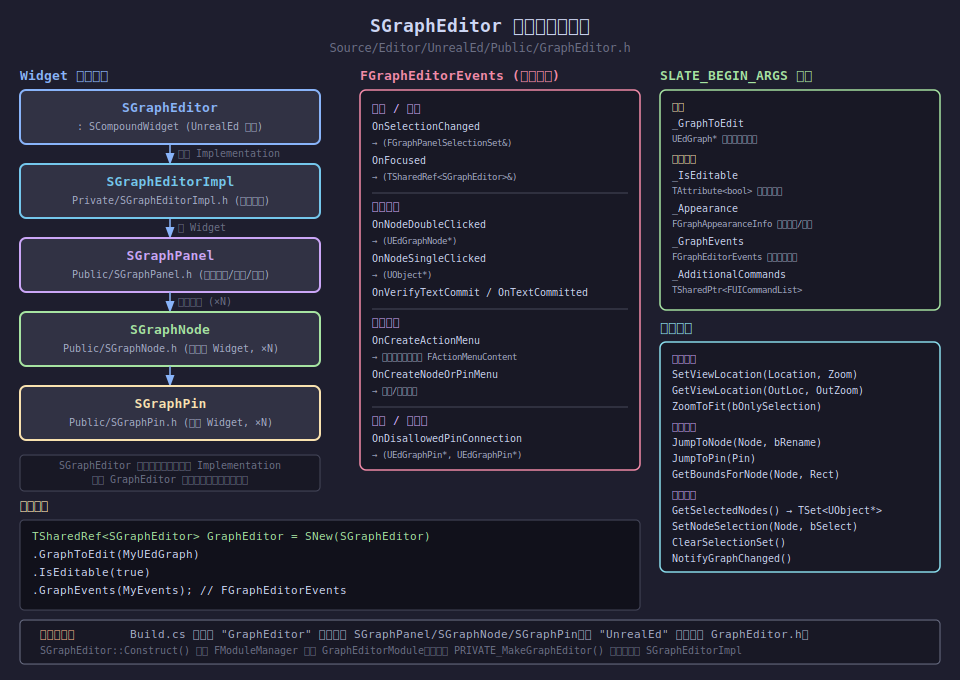

#### 内部架构

`SGraphEditor` 本身是一个"壳"（Façade），真正的实现在 `SGraphEditorImpl`（私有类，位于 `Private/SGraphEditorImpl.h`）。这种设计的目的是：**支持 GraphEditor 模块热重载**。当模块被卸载时，壳仍然有效，不会崩溃。

```
SGraphEditor (SCompoundWidget)            ← 公开入口，在 UnrealEd 模块
  └─ Implementation: SGraphEditorImpl     ← 真正实现，在 GraphEditor 模块
       └─ SGraphPanel                     ← 节点画布（滚动、缩放）
            └─ SGraphNode (×N)            ← 每个节点的 Widget
                 └─ SGraphPin (×N)        ← 每个引脚的 Widget
```

#### 创建方式

```cpp
// Build.cs 需要添加 "GraphEditor" 和 "UnrealEd" 模块依赖
SGraphEditor::FGraphEditorEvents Events;
Events.OnSelectionChanged = FOnSelectionChanged::CreateSP(this, &FMyEditor::OnSelectionChanged);
Events.OnNodeDoubleClicked = FSingleNodeEvent::CreateSP(this, &FMyEditor::OnNodeDoubleClicked);

TSharedRef<SGraphEditor> GraphEditorWidget = SNew(SGraphEditor)
    .GraphToEdit(MyEdGraph)          // 必填：要展示的数据图
    .IsEditable(true)                // 是否可编辑
    .GraphEvents(Events);            // 事件回调
```

#### FGraphEditorEvents 事件回调

| 事件 | 签名 | 触发时机 |
|------|------|---------|
| `OnSelectionChanged` | `(const FGraphPanelSelectionSet&)` | 选择变化 |
| `OnNodeDoubleClicked` | `(UEdGraphNode*)` | 双击节点 |
| `OnNodeSingleClicked` | `(UObject*)` | 单击节点（无拖动） |
| `OnFocused` | `(TSharedRef<SGraphEditor>&)` | 图获得焦点 |
| `OnCreateActionMenu` | 返回 `FActionMenuContent` | 空白区右键 |
| `OnCreateNodeOrPinMenu` | 返回 `FActionMenuContent` | 节点/引脚右键 |
| `OnDisallowedPinConnection` | `(UEdGraphPin*, UEdGraphPin*)` | 不合法连接尝试 |
| `OnTextCommitted` | `(FText, ETextCommit::Type, UEdGraphNode*)` | 节点标题文字提交 |

#### 常用方法

```cpp
// 视图控制
GraphEditorWidget->SetViewLocation(FVector2D(0,0), 1.0f);
GraphEditorWidget->ZoomToFit(false);  // 缩放到全图

// 节点导航
GraphEditorWidget->JumpToNode(MyNode, /*bRequestRename=*/false);
GraphEditorWidget->JumpToPin(MyPin);

// 选择操作
const FGraphPanelSelectionSet& Selected = GraphEditorWidget->GetSelectedNodes();
GraphEditorWidget->SetNodeSelection(MyNode, true);
GraphEditorWidget->ClearSelectionSet();

// 通知 UI 刷新（数据变化后调用）
GraphEditorWidget->NotifyGraphChanged();
GraphEditorWidget->RefreshNode(*MyNode);
```

---

### 4.2 UEdGraphSchema — 图规则引擎

**源文件：** `Source/Runtime/Engine/Classes/EdGraph/EdGraphSchema.h`

**作用：** `UEdGraphSchema` 是一个抽象 `UObject`，它定义了**图内所有规则**：哪些节点可以创建、哪些引脚可以连接、连接后发生什么、右键菜单显示什么。不同类型的图有各自的 Schema 子类：

| 图类型 | Schema 子类 |
|--------|-------------|
| 蓝图 K2 图 | `UEdGraphSchema_K2` |
| 材质图 | `UMaterialGraphSchema` |
| 行为树 | `UBehaviorTreeGraphSchema` |
| 动画蓝图 | `UAnimationGraphSchema` |

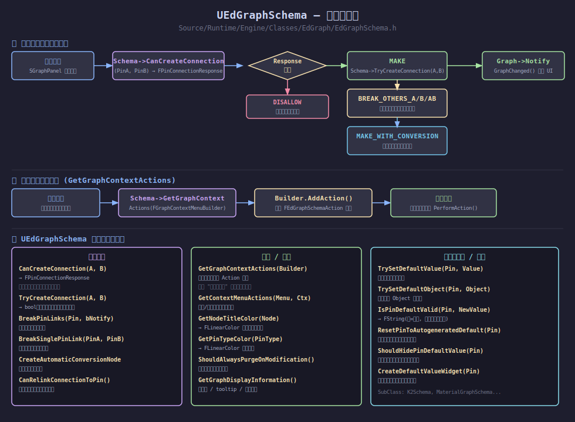

#### 连接验证 — CanCreateConnection

```cpp
// 判断两个引脚是否可以连接（不做实际操作）
virtual const FPinConnectionResponse CanCreateConnection(
    const UEdGraphPin* A, 
    const UEdGraphPin* B) const;

// 返回值 FPinConnectionResponse 包含：
//   Response: ECanCreateConnectionResponse 枚举
//   Message:  FText 提示文字
```

**ECanCreateConnectionResponse 枚举值：**

| 枚举值 | 含义 |
|--------|------|
| `CONNECT_RESPONSE_MAKE` | 允许连接 |
| `CONNECT_RESPONSE_DISALLOW` | 禁止连接，显示错误气泡 |
| `CONNECT_RESPONSE_BREAK_OTHERS_A` | 允许，但先断开 A 的现有连接 |
| `CONNECT_RESPONSE_BREAK_OTHERS_B` | 允许，但先断开 B 的现有连接 |
| `CONNECT_RESPONSE_BREAK_OTHERS_AB` | 允许，同时断开 A 和 B 的现有连接 |
| `CONNECT_RESPONSE_MAKE_WITH_CONVERSION_NODE` | 允许，自动插入类型转换节点 |
| `CONNECT_RESPONSE_MAKE_WITH_PROMOTION` | 允许，将低精度类型提升（如 Float→Double）|

#### 右键菜单 — GetGraphContextActions

```cpp
// 空白区右键 / 从引脚拖出 → 填充可创建节点列表
virtual void GetGraphContextActions(FGraphContextMenuBuilder& ContextMenuBuilder) const;

// 实现示例（在子类中重写）：
void UMySchema::GetGraphContextActions(FGraphContextMenuBuilder& ContextMenuBuilder) const
{
    // ContextMenuBuilder.FromPin 不为空说明是从引脚拖出
    TSharedPtr<FEdGraphSchemaAction_NewNode> Action = MakeShared<FEdGraphSchemaAction_NewNode>(
        FText::FromString("MyCategory"),   // 分类
        FText::FromString("Create MyNode"), // 菜单名
        FText::FromString("Creates a MyNode"), // Tooltip
        0);                                // 排序权重
    Action->NodeTemplate = NewObject<UMyNode>(ContextMenuBuilder.OwnerOfTemporaries);
    ContextMenuBuilder.AddAction(Action);
}
```

#### 实现自定义 Schema 的关键重写

```cpp
UCLASS()
class UMyGraphSchema : public UEdGraphSchema
{
    GENERATED_BODY()
public:
    // 必须重写：连接合法性判断
    virtual const FPinConnectionResponse CanCreateConnection(
        const UEdGraphPin* A, const UEdGraphPin* B) const override;

    // 必须重写：右键菜单内容
    virtual void GetGraphContextActions(
        FGraphContextMenuBuilder& ContextMenuBuilder) const override;

    // 可选：引脚颜色
    virtual FLinearColor GetPinTypeColor(const FEdGraphPinType& PinType) const override;

    // 可选：节点标题颜色
    virtual FLinearColor GetNodeTitleColor(const UEdGraphNode* Node) const override;
};
```

---

### 4.3 FGraphPanelPinFactory — 自定义引脚外观

**源文件：** `Source/Editor/UnrealEd/Public/EdGraphUtilities.h`

**作用：** `FGraphPanelPinFactory` 是一个简单的工厂基类，允许插件/模块为特定类型的 `UEdGraphPin` 创建自定义 Slate 控件（`SGraphPin`），从而改变引脚的显示方式（如颜色选择器、滑条、枚举下拉框等）。

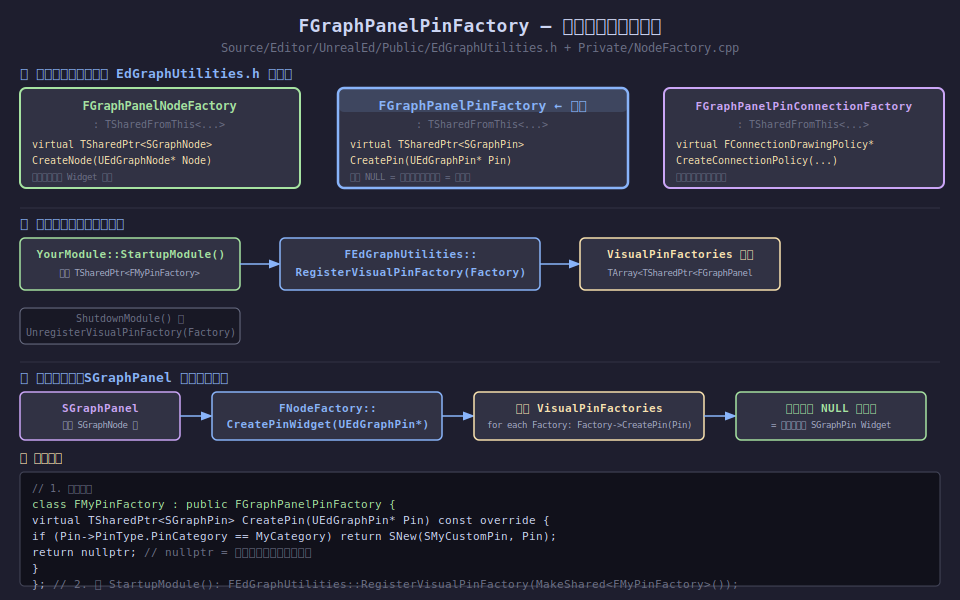

#### 三种工厂类型

| 工厂类 | 用途 | 虚函数 |
|--------|------|--------|
| `FGraphPanelNodeFactory` | 自定义节点外观 | `CreateNode(UEdGraphNode*)` |
| `FGraphPanelPinFactory` | 自定义引脚外观 | `CreatePin(UEdGraphPin*)` |
| `FGraphPanelPinConnectionFactory` | 自定义连线绘制 | `CreateConnectionPolicy(Schema, ...)` |

#### 调用链

```
SGraphPanel 构建节点时
  → FNodeFactory::CreatePinWidget(UEdGraphPin*)
      → 遍历 FEdGraphUtilities::VisualPinFactories[]
          → 依次调用 Factory->CreatePin(Pin)
          → 第一个返回非 nullptr 的工厂获胜
      → 若全部返回 nullptr，使用默认的 SGraphPin
```

#### 实现步骤

**第一步：** 定义工厂类

```cpp
// MyPinFactory.h
class FMyPinFactory : public FGraphPanelPinFactory
{
public:
    virtual TSharedPtr<SGraphPin> CreatePin(UEdGraphPin* Pin) const override
    {
        // 只处理特定 PinCategory
        if (Pin->PinType.PinCategory == FName("MyCustomType"))
        {
            return SNew(SMyCustomPin, Pin);
        }
        return nullptr; // nullptr = 交给下一个工厂处理
    }
};
```

**第二步：** 在模块启动时注册

```cpp
// MyEditorModule.cpp
void FMyEditorModule::StartupModule()
{
    MyPinFactory = MakeShared<FMyPinFactory>();
    FEdGraphUtilities::RegisterVisualPinFactory(MyPinFactory);
}

void FMyEditorModule::ShutdownModule()
{
    FEdGraphUtilities::UnregisterVisualPinFactory(MyPinFactory);
    MyPinFactory.Reset();
}
```

**第三步：** 实现自定义引脚 Widget

```cpp
// SMyCustomPin.h
class SMyCustomPin : public SGraphPin
{
public:
    SLATE_BEGIN_ARGS(SMyCustomPin) {}
    SLATE_END_ARGS()

    void Construct(const FArguments& InArgs, UEdGraphPin* InPin);

protected:
    // 重写引脚内容区域
    virtual TSharedRef<SWidget> GetDefaultValueWidget() override;
};
```

---

### 4.4 UEdGraph — 图数据模型

**源文件：** `Source/Runtime/Engine/Classes/EdGraph/EdGraph.h`

**作用：** `UEdGraph` 是节点图的数据模型。它是一个 `UObject`，保存在 `.uasset` 文件里，**仅在编辑器下存在**。它存储所有节点、子图引用、以及使用哪个 Schema。

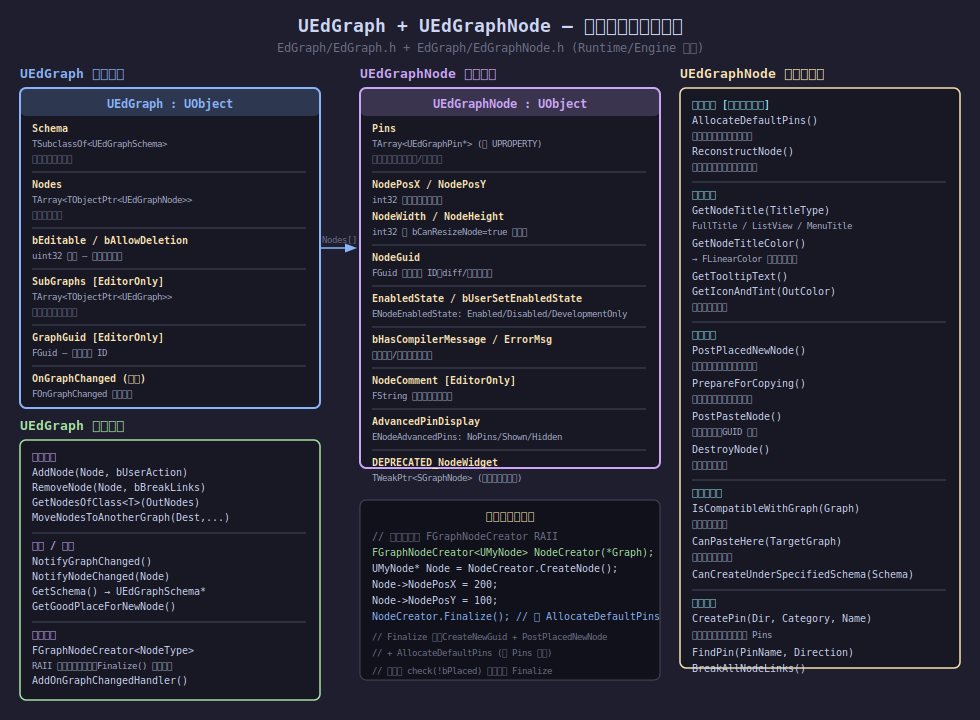

#### 核心数据结构

```cpp
UCLASS(MinimalAPI)
class UEdGraph : public UObject
{
    // 图使用的 Schema 类
    UPROPERTY()
    TSubclassOf<UEdGraphSchema> Schema;

    // 所有节点
    UPROPERTY()
    TArray<TObjectPtr<UEdGraphNode>> Nodes;

    // 编辑权限
    UPROPERTY() uint32 bEditable:1;
    UPROPERTY() uint32 bAllowDeletion:1;
    UPROPERTY() uint32 bAllowRenaming:1;

    // 子图（EditorOnly）
    UPROPERTY()
    TArray<TObjectPtr<UEdGraph>> SubGraphs;

    // 唯一 ID（EditorOnly）
    UPROPERTY()
    FGuid GraphGuid;

private:
    // 图变化时广播
    FOnGraphChanged OnGraphChanged;
};
```

#### 节点管理

```cpp
// 添加节点
Graph->AddNode(NewNode, /*bUserAction=*/true, /*bSelectNewNode=*/true);

// 移除节点
Graph->RemoveNode(NodeToRemove, /*bBreakAllLinks=*/true);

// 查找特定类型节点
TArray<UMyNode*> MyNodes;
Graph->GetNodesOfClass<UMyNode>(MyNodes);

// 获取 Schema
const UEdGraphSchema* Schema = Graph->GetSchema();

// 获取新节点的合适放置位置
FVector2D NewPos = Graph->GetGoodPlaceForNewNode();
```

#### 推荐的节点创建模式 — FGraphNodeCreator

```cpp
// RAII 模式，确保 Finalize 被调用
{
    FGraphNodeCreator<UMyNode> NodeCreator(*Graph);
    UMyNode* NewNode = NodeCreator.CreateNode();
    NewNode->NodePosX = 200;
    NewNode->NodePosY = 100;
    // 在这里设置节点属性
    NodeCreator.Finalize(); // 调用 CreateNewGuid + PostPlacedNewNode + AllocateDefaultPins
}
// NodeCreator 析构时会 check(!bPlaced)，防止忘记 Finalize
```

#### 监听图变化

```cpp
// 订阅图变化事件
FDelegateHandle Handle = Graph->AddOnGraphChangedHandler(
    FOnGraphChanged::FDelegate::CreateSP(this, &FMyEditor::OnGraphChanged)
);

// 取消订阅
Graph->RemoveOnGraphChangedHandler(Handle);

// 手动触发（数据修改后通知 UI 刷新）
Graph->NotifyGraphChanged();
Graph->NotifyNodeChanged(ModifiedNode);
```

---

### 4.5 UEdGraphNode — 节点数据模型

**源文件：** `Source/Runtime/Engine/Classes/EdGraph/EdGraphNode.h`

**作用：** `UEdGraphNode` 是图中每个节点的数据模型，是 `UObject` 子类，存储节点位置、引脚、错误状态、GUID 等信息。所有具体节点类型（K2 函数调用节点、事件节点、材质节点等）都继承自它。

#### 核心数据成员

| 成员 | 类型 | 说明 |
|------|------|------|
| `Pins` | `TArray<UEdGraphPin*>` | 节点所有引脚（非 UPROPERTY） |
| `NodePosX/Y` | `int32` | 节点在画布上的坐标 |
| `NodeGuid` | `FGuid` | 唯一标识符（用于 diff/序列化） |
| `EnabledState` | `ENodeEnabledState` | Enabled/Disabled/DevelopmentOnly |
| `bHasCompilerMessage` | `uint8:1` | 是否有编译错误/警告 |
| `ErrorMsg` | `FString` | 编译错误消息 |
| `NodeComment` | `FString` | 节点注释文字（EditorOnly） |
| `AdvancedPinDisplay` | `ENodeAdvancedPins` | 高级引脚显示状态 |

#### 子类必须实现的虚函数

```cpp
UCLASS()
class UMyGraphNode : public UEdGraphNode
{
public:
    // 【必须】创建引脚——节点首次放入图时调用
    virtual void AllocateDefaultPins() override
    {
        CreatePin(EGPD_Input,  UEdGraphSchema_K2::PC_Exec, UEdGraphSchema_K2::PN_Execute);
        CreatePin(EGPD_Output, UEdGraphSchema_K2::PC_Exec, UEdGraphSchema_K2::PN_Then);
        CreatePin(EGPD_Input,  UEdGraphSchema_K2::PC_Float, FName("Value"));
    }

    // 【推荐】节点标题
    virtual FText GetNodeTitle(ENodeTitleType::Type TitleType) const override
    {
        return FText::FromString(TEXT("My Custom Node"));
    }

    // 【推荐】标题栏颜色（默认为灰色）
    virtual FLinearColor GetNodeTitleColor() const override
    {
        return FLinearColor(0.1f, 0.3f, 0.7f); // 蓝色
    }

    // 【可选】放置后初始化（绑定蓝图函数等）
    virtual void PostPlacedNewNode() override { Super::PostPlacedNewNode(); }

    // 【可选】类型变化后重建引脚
    virtual void ReconstructNode() override;
};
```

#### 引脚操作

```cpp
// 创建引脚（在 AllocateDefaultPins 中调用）
UEdGraphPin* ExecPin = Node->CreatePin(EGPD_Input, UEdGraphSchema_K2::PC_Exec, FName("Execute"));
UEdGraphPin* FloatPin = Node->CreatePin(EGPD_Input, UEdGraphSchema_K2::PC_Float, FName("Value"));

// 查找引脚
UEdGraphPin* Pin = Node->FindPin(FName("Value"));
UEdGraphPin* PinChecked = Node->FindPinChecked(FName("Execute")); // 找不到就 check 失败

// 断开所有连接
Node->BreakAllNodeLinks();

// 获取所属图
UEdGraph* OwnerGraph = Node->GetGraph();
```

---

### 4.6 综合使用示例 — 完整自定义图编辑器

下面是一个将五个对象组合使用的典型场景：**创建一个带自定义节点的简单图编辑器**。

#### 1. 定义图 Schema

```cpp
// MyGraphSchema.h
UCLASS()
class UMyGraphSchema : public UEdGraphSchema
{
    GENERATED_BODY()
public:
    virtual const FPinConnectionResponse CanCreateConnection(
        const UEdGraphPin* A, const UEdGraphPin* B) const override
    {
        // 只允许同类型引脚连接
        if (A->PinType.PinCategory != B->PinType.PinCategory)
            return FPinConnectionResponse(CONNECT_RESPONSE_DISALLOW, TEXT("类型不匹配"));
        return FPinConnectionResponse(CONNECT_RESPONSE_MAKE, TEXT(""));
    }

    virtual void GetGraphContextActions(FGraphContextMenuBuilder& Builder) const override
    {
        TSharedPtr<FEdGraphSchemaAction_NewNode> Action = MakeShared<FEdGraphSchemaAction_NewNode>(
            FText::FromString("My Nodes"), FText::FromString("Add My Node"),
            FText::FromString("Adds a custom node"), 0);
        Action->NodeTemplate = NewObject<UMyGraphNode>(Builder.OwnerOfTemporaries);
        Builder.AddAction(Action);
    }
};
```

#### 2. 创建数据图并加入节点

```cpp
// 创建 UEdGraph
UEdGraph* MyGraph = NewObject<UEdGraph>(MyAsset);
MyGraph->Schema = UMyGraphSchema::StaticClass();

// 使用 FGraphNodeCreator 创建节点
FGraphNodeCreator<UMyGraphNode> Creator(*MyGraph);
UMyGraphNode* Node = Creator.CreateNode();
Node->NodePosX = 100; Node->NodePosY = 100;
Creator.Finalize(); // 触发 AllocateDefaultPins
```

#### 3. 在编辑器 Tab 中显示

```cpp
TSharedRef<SDockTab> FMyEditor::SpawnGraphTab(const FSpawnTabArgs& Args)
{
    SGraphEditor::FGraphEditorEvents Events;
    Events.OnSelectionChanged = FOnSelectionChanged::CreateSP(
        this, &FMyEditor::OnSelectionChanged);

    GraphEditorWidget = SNew(SGraphEditor)
        .GraphToEdit(MyGraph)
        .IsEditable(true)
        .GraphEvents(Events);

    return SNew(SDockTab).TabRole(ETabRole::PanelTab)
        [ GraphEditorWidget.ToSharedRef() ];
}
```

#### 4. 注册自定义引脚工厂（在模块启动时）

```cpp
void FMyEditorModule::StartupModule()
{
    MyPinFactory = MakeShared<FMyPinFactory>();
    FEdGraphUtilities::RegisterVisualPinFactory(MyPinFactory);
}
```

---

### 4.7 各对象职责总结

| 对象 | 层次 | 职责 | 模块 |
|------|------|------|------|
| `UEdGraph` | 数据层 | 图的容器，存节点+Schema引用 | `Engine` (Runtime) |
| `UEdGraphNode` | 数据层 | 单个节点的数据（位置、引脚等） | `Engine` (Runtime) |
| `UEdGraphSchema` | 规则层 | 定义图的连接规则和菜单内容 | `Engine` (Runtime) |
| `FGraphPanelPinFactory` | 工厂层 | 决定引脚用哪个 Slate Widget 渲染 | `UnrealEd` (Editor) |
| `SGraphEditor` | 视图层 | 节点图的 Slate 渲染与交互控件 | `UnrealEd` / `GraphEditor` |

> **关键原则：** 数据对象（`UEdGraph`、`UEdGraphNode`）在 Runtime 模块中定义，运行时代码不应引用编辑器专属类型。`SGraphEditor` 和 `FGraphPanelPinFactory` 只在 Editor 模块中存在。

---

## 5. 蓝图虚拟机深度解析

> **前置示例：BP_Enemy 蓝图**
> BP_Enemy 继承自 Actor，有两个成员属性 `HP`（int）和 `bAlive`（bool），并定义了一个蓝图函数 `SetHP(NewHP: int)`：
>
> ```
> [FunctionEntry: NewHP(int)]
>         │
>         ▼
> [Branch: bAlive == true?]
>   True ─────────────────▶ [Set Variable: HP = NewHP]
>   False ────────────────▶ [PrintString("dead")]
> ```

---

### 5.1 uasset 文件数据格式

一个 `.uasset` 文件是 UE 的**通用包格式（Package Format）**，所有资产都以此格式存储。下图展示了 `BP_Enemy.uasset` 的完整数据分布：

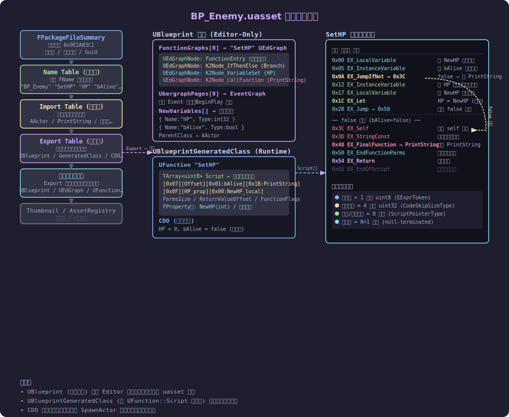

#### 文件段结构

| 段名 | 内容 | 关键字段 |
|------|------|---------|
| `FPackageFileSummary` | 文件头（固定在开头） | 魔法数字 `0x9E2A83C1`、文件版本、包 Guid、Name/Import/Export 表偏移 |
| **Name Table** | 所有 `FName` 字符串 | `"BP_Enemy"`, `"SetHP"`, `"HP"`, `"bAlive"`, `"PrintString"`, … |
| **Import Table** | 引用的**外部**对象描述（不包含数据，只有路径） | AActor、KismetMathLibrary、引擎基础类 |
| **Export Table** | **本包**拥有的对象描述（含数据偏移和大小） | `UBlueprint`, `UBlueprintGeneratedClass`, `BP_Enemy_C` CDO |
| **序列化对象数据** | Export 表中每个对象的实际属性和字节码 | `UBlueprint`（图结构）、`UFunction`（Script 字节码）、CDO 默认值 |
| Thumbnail / AssetRegistry | 缩略图缓存、搜索标记 | 仅 Editor 使用 |

#### UBlueprint vs UBlueprintGeneratedClass

```
BP_Enemy.uasset
├── UBlueprint  (编辑器 only，打包后剥离)
│   ├── FunctionGraphs[0] "SetHP" UEdGraph
│   │   ├── UK2Node_FunctionEntry  (入口，带 NewHP 参数引脚)
│   │   ├── UK2Node_IfThenElse     (Branch)
│   │   ├── UK2Node_VariableSet    (HP = NewHP)
│   │   └── UK2Node_CallFunction   (PrintString)
│   ├── NewVariables[] → { HP:int, bAlive:bool }
│   └── ParentClass → AActor
│
└── UBlueprintGeneratedClass  "BP_Enemy_C"  (运行时核心)
    ├── FIntProperty "HP"
    ├── FBoolProperty "bAlive"
    ├── UFunction "SetHP"
    │   ├── FIntProperty "NewHP" (参数)
    │   └── TArray<uint8> Script  ← 编译后字节码
    └── CDO  (Default__BP_Enemy_C)
        └── HP=0, bAlive=false
```

> **关键原则**：`UBlueprint` 是"源代码"（图节点），`UBlueprintGeneratedClass` 是"可执行文件"（字节码）。打包（cook）时只保留后者。

---

### 5.2 什么是蓝图虚拟机

**蓝图虚拟机（Blueprint VM / Kismet VM）** 是 UE 内置的一个**字节码解释器**，让 Blueprint 脚本可以在运行时执行，而无需编译成本地机器码。

#### 核心组成

| 组件 | 类/文件 | 作用 |
|------|---------|------|
| **字节码指令集** | `EExprToken`（`Script.h`） | 完整指令枚举，`EX_Let`、`EX_JumpIfNot`、`EX_FinalFunction`…（约 80 条） |
| **执行帧** | `FFrame`（`Stack.h`） | 每次函数调用一个帧，持有 `Code` 指针、`Locals` 内存、`FlowStack` |
| **全局分派表** | `GNatives[EX_Max]`（`ScriptCore.cpp`） | 数组大小 255，每个槽存一个 `exec` 函数指针，O(1) 分派 |
| **入口点** | `UObject::ProcessEvent`（`ScriptCore.cpp`） | 一切 Blueprint 函数调用的起点 |
| **解释循环** | `UObject::ProcessInternal` | 循环调用 `FFrame::Step` 直到 `EX_Return` |
| **编译器** | `FKismetCompilerContext`（`KismetCompiler.cpp`） | 将图节点编译成字节码 |
| **VM 后端** | `FKismetCompilerVMBackend`（`KismetCompilerVMBackend.cpp`） | 将中间表示 `KCST_*` 翻译为 `EX_*` 字节 |

#### VM 做了什么

1. **编译时**（在编辑器中点击 Compile）：`FKismetCompilerContext::Compile()` 将 UEdGraph 节点图编译成 `TArray<uint8> Script` 存入 `UFunction`
2. **运行时调用时**：`ProcessEvent` 分配帧内存 → 创建 `FFrame` → 调用 `Function->Invoke` → 进入 `ProcessInternal`
3. **解释循环**：每次循环读一个 opcode → 查 `GNatives[opcode]` → 调用对应的 `execXxx` 函数 → `Code` 指针前进

---

### 5.3 SetHP 函数：节点→字节码的编译过程

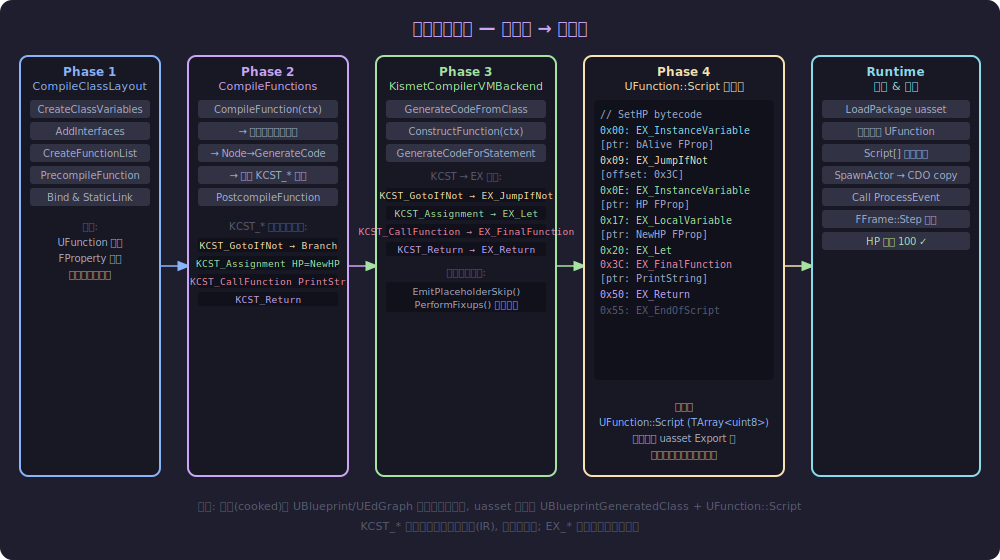

#### Phase 1 — CompileClassLayout（构建类布局）

**输入**：`UBlueprint`（含 FunctionGraphs、NewVariables）

| 步骤 | 操作 | 对应函数 |
|------|------|---------|
| 1 | 清理旧 GeneratedClass 数据 | `CleanAndSanitizeClass` |
| 2 | 从 `NewVariables` 创建 `FProperty`（HP、bAlive） | `CreateClassVariablesFromBlueprint` |
| 3 | 遍历 `FunctionGraphs`，为每个图创建 `FKismetFunctionContext` | `CreateFunctionList` |
| 4 | 为 SetHP 函数创建 `UFunction` 骨架，注册 `FIntProperty "NewHP"` 参数 | `PrecompileFunction` |
| 5 | Bind & StaticLink，确定 `ParmsSize`、`PropertiesSize` | `NewClass->Bind() / StaticLink` |

#### Phase 2 — CompileFunctions（生成中间表示 KCST_*）

**输入**：`FKismetFunctionContext`（含已排序的节点执行顺序）

编译器遍历 SetHP 图中的节点，每个节点调用 `Node->RegisterNets()` 和 `Node->ExpandNode()` 生成 `FBlueprintCompiledStatement` 列表：

```
UK2Node_IfThenElse   → KCST_GotoIfNot  { Condition: bAlive, Target: &PrintString_stmt }
                       KCST_UnconditionalGoto { Target: &Return_stmt }  (true 分支末尾)
UK2Node_VariableSet  → KCST_Assignment { Dest: HP, Source: NewHP }
UK2Node_CallFunction → KCST_CallFunction { Func: PrintString, Params: [StringConst] }
FunctionReturn       → KCST_Return
```

> `KCST_*` 是编译器内部 IR（中间表示），**不会写入磁盘**，只在编译过程中存在。

#### Phase 3 — VMBackend（生成字节码 EX_*）

`FKismetCompilerVMBackend::GenerateCodeForStatement` 将每条 KCST_* 翻译成二进制字节序列：

| KCST_* 语句 | 产生的字节码 |
|------------|------------|
| `KCST_GotoIfNot` | `[EX_JumpIfNot=0x07][4字节目标偏移][求值bAlive的子表达式]` |
| `KCST_Assignment` | `[EX_Let=0x0F][PropertyPtr][EX_InstanceVariable(HP)][EX_LocalVariable(NewHP)]` |
| `KCST_CallFunction` | `[EX_FinalFunction=0x1C][FuncPtr: PrintString][参数列表][EX_EndFunctionParms=0x16]` |
| `KCST_Return` | `[EX_Return=0x04][EX_Nothing=0x0B]` |

跳转地址通过 **两步法** 填入：
1. `EmitPlaceholderSkip()` 先写一个 0 占位，记录位置
2. 所有节点编译完毕后 `PerformFixups()` 回填正确的偏移

**最终产物**：`UFunction::Script` 是一个连续的 `TArray<uint8>`，存储所有字节码。

---

### 5.4 SetHP 函数：字节码的运行时执行

#### 完整执行流程图

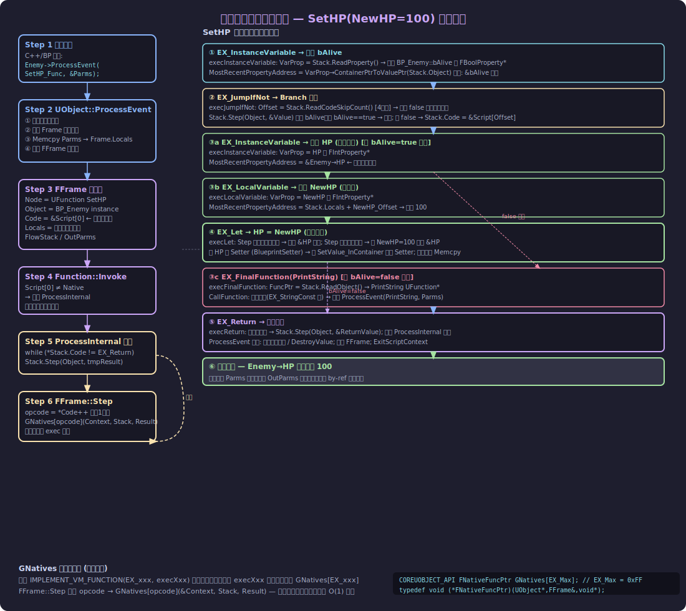

#### Step-by-Step 解释

##### Step 1 — 调用发起

某处代码（C++ 或其他蓝图）调用 `SetHP`：

```cpp
// C++ 调用方式
FSetHP_Params Parms;
Parms.NewHP = 100;
Enemy->ProcessEvent(SetHP_UFunction, &Parms);
```

##### Step 2 — UObject::ProcessEvent（`ScriptCore.cpp:1971`）

```cpp
void UObject::ProcessEvent(UFunction* Function, void* Parms)
{
    // ① 检查对象合法性
    checkf(!IsUnreachable(), ...);

    // ② 分配 Frame 内存（包含参数 + 本地变量）
    uint8* Frame = (uint8*)FMemory_Alloca(Function->PropertiesSize);

    // ③ 拷贝参数到 Frame.Locals
    FMemory::Memcpy(Frame, Parms, Function->ParmsSize);

    // ④ 构建 FFrame 执行帧
    FFrame NewStack(this, Function, Frame, NULL, Function->ChildProperties);

    // ⑤ 调用函数（非 native → ProcessInternal）
    Function->Invoke(this, NewStack, ReturnValueAddress);

    // ⑥ 析构本地变量
    for (FProperty* P = Function->DestructorLink; P; P = P->DestructorLinkNext)
        P->DestroyValue_InContainer(NewStack.Locals);
}
```

**输入**：`UFunction* SetHP`、`void* Parms`（含 `NewHP=100`）
**输出**：创建 `FFrame`，即将进入解释循环

##### Step 3 — FFrame 数据结构

`FFrame`（`Stack.h:125`）持有一次函数调用所需的全部上下文：

```cpp
struct FFrame {
    UFunction*  Node;          // 当前执行的函数 (UFunction SetHP)
    UObject*    Object;        // 目标对象 (BP_Enemy 实例)
    uint8*      Code;          // 当前字节码指针，初始 = Script.GetData()
    uint8*      Locals;        // 本地变量内存块 (含参数 NewHP=100 + 临时变量)
    FFrame*     PreviousFrame; // 调用链（用于堆栈跟踪）
    FlowStackType FlowStack;   // 执行流跳转目标栈（for latent nodes）
    FOutParmRec* OutParms;     // by-ref 输出参数链表
    FProperty*  MostRecentProperty;      // 最近一次 Step 设置的属性类型
    uint8*      MostRecentPropertyAddress; // 最近一次 Step 设置的内存地址
};
```

##### Step 4 — FFrame::Step（分派核心）

```cpp
// Stack.h (inline 实现)
FORCEINLINE void FFrame::Step(UObject* Context, RESULT_DECL)
{
    uint8 Opcode = *Code++;          // 读取 1 字节 opcode，Code 指针前进
    (Context->*GNatives[Opcode])(*this, RESULT_PARAM); // 查表调用 exec 函数
}
```

> `GNatives` 是大小 255 的全局函数指针数组，由 `IMPLEMENT_VM_FUNCTION` 宏在模块加载时填充。

##### Step 5 — 逐条字节码执行（SetHP, bAlive=true 路径）

**① 读取 bAlive 地址（EX_InstanceVariable）**

```cpp
// execInstanceVariable (ScriptCore.cpp:2209)
FProperty* VarProperty = Stack.ReadProperty();  // 读8字节指针 → bAlive FBoolProperty*
Stack.MostRecentPropertyAddress = VarProperty->ContainerPtrToValuePtr<uint8>(Stack.Object);
// 此时 MostRecentPropertyAddress = &Enemy->bAlive
```

**② 条件跳转（EX_JumpIfNot）**

```cpp
// execJumpIfNot (ScriptCore.cpp:2532)
CodeSkipSizeType Offset = Stack.ReadCodeSkipCount(); // 读4字节：false分支偏移
bool Value = 0;
Stack.Step(Stack.Object, &Value);   // 递归 Step 求值 bAlive
if (!Value) {
    Stack.Code = &Stack.Node->Script[Offset]; // 跳到 false 分支
}
// bAlive=true → 继续顺序执行
```

**③ 赋值 HP = NewHP（EX_Let）**

```cpp
// execLet (ScriptCore.cpp:2782)
// 先 Step 求值目标表达式 → 得到 &Enemy->HP
Stack.Step(Stack.Object, nullptr);
uint8* DestAddr = Stack.MostRecentPropertyAddress; // &HP

// 再 Step 求值源表达式 → 直接写入目标地址
Stack.Step(Stack.Object, DestAddr); // 从 Locals 读 NewHP=100 → 写入 DestAddr
// Enemy->HP 现在 = 100 ✓
```

**④ 函数返回（EX_Return）**

```cpp
// execReturn
Stack.Step(Stack.Object, RESULT_PARAM); // 处理返回值（void → EX_Nothing）
// ProcessInternal 循环退出
```

##### Step 6 — false 路径（bAlive=false）

如果 `bAlive=false`，Step 2 的 `EX_JumpIfNot` 将 `Code` 跳转到 `EX_FinalFunction(PrintString)` 处：

```cpp
// execFinalFunction (ScriptCore.cpp:3202)
UFunction* Func = (UFunction*)Stack.ReadObject(); // 读8字节指针 → PrintString UFunction*
P_THIS->CallFunction(Stack, RESULT_PARAM, Func);
// CallFunction 会继续 Step 收集参数 (EX_StringConst, EX_EndFunctionParms)
// 然后递归 ProcessEvent(Func, Parms)
```

---

### 5.5 VM 执行过程分步详解（摘要表）

| 步骤 | 输入 | 操作 | 输出 |
|------|------|------|------|
| 1 | C++ 调用触发 | 打包 Parms 结构体 | `void* Parms = {NewHP:100}` |
| 2 | ProcessEvent | 验证、分配 Frame 内存、复制参数 | `FFrame` 创建完毕，`Code = &Script[0]` |
| 3 | ProcessInternal | 进入字节码解释主循环 | 循环开始 |
| 4 | `EX_InstanceVariable` (bAlive) | `ReadProperty()` 读指针，`ContainerPtrToValuePtr` | `MostRecentPropertyAddress = &bAlive` |
| 5 | `EX_JumpIfNot` | 读偏移，`Step` 求值 bAlive，条件跳转 | `Code` 指针更新（true→继续; false→跳转） |
| 6 | `EX_InstanceVariable` (HP) | 同步骤4，目标为 HP | `MostRecentPropertyAddress = &HP` |
| 7 | `EX_LocalVariable` (NewHP) | 从 `Stack.Locals` 偏移处读取参数 | `MostRecentPropertyAddress = &Locals[NewHP]` |
| 8 | `EX_Let` | 两次 `Step` 分别求值目标和源，执行内存写入 | `Enemy->HP = 100` |
| 9 | `EX_Jump` | 跳过 false 分支 | `Code` 跳至 Return |
| 10 | `EX_Return` | 处理返回值，退出循环 | `ProcessInternal` 返回 |
| 11 | ProcessEvent 尾部 | 析构本地变量，`ExitScriptContext` | 调用完成，栈恢复 |

> **为什么要这样设计？**
> - `FFrame` 每次函数调用栈上分配（`FMemory_Alloca`），无堆分配开销，支持递归
> - `GNatives` 数组查表 O(1)，避免大量 if/switch 的分支预测代价
> - `MostRecentPropertyAddress` 作为"寄存器"在相邻指令间传递地址，减少重复读取

---

### 5.6 关键源码位置速查

#### 字节码指令集（EExprToken 枚举）

```cpp
// Source/Runtime/CoreUObject/Public/UObject/Script.h
enum EExprToken : uint8
{
    EX_LocalVariable    = 0x00,  // 读本地变量地址
    EX_InstanceVariable = 0x01,  // 读成员变量地址
    EX_Return           = 0x04,  // 函数返回
    EX_Jump             = 0x06,  // 无条件跳转
    EX_JumpIfNot        = 0x07,  // 条件跳转（false时跳）
    EX_Let              = 0x0F,  // 赋值（任意类型）
    EX_LetBool          = 0x14,  // 赋值（bool）
    EX_Self             = 0x17,  // Self 对象引用
    EX_VirtualFunction  = 0x1B,  // 虚函数调用
    EX_FinalFunction    = 0x1C,  // 最终函数调用（已知指针）
    EX_IntConst         = 0x1D,  // int 常量
    EX_StringConst      = 0x1F,  // string 常量
    EX_EndFunctionParms = 0x16,  // 参数列表结束哨兵
    EX_CallMath         = 0x68,  // 纯静态函数（Pure Node）
    EX_EndOfScript      = 0x53,  // 字节码末尾标记
};
```

#### FFrame 执行帧

```cpp
// Source/Runtime/CoreUObject/Public/UObject/Stack.h:125
struct FFrame : public FOutputDevice {
    UFunction*  Node;          // 当前函数
    UObject*    Object;        // 执行目标对象
    uint8*      Code;          // 字节码当前位置
    uint8*      Locals;        // 本地变量内存
    FFrame*     PreviousFrame; // 调用链
    FlowStackType FlowStack;   // 执行流栈
    FOutParmRec* OutParms;     // by-ref 输出参数

    void Step(UObject* Context, RESULT_DECL); // 读一条指令并执行
};
```

#### ProcessEvent（调用入口）

```cpp
// Source/Runtime/CoreUObject/Private/UObject/ScriptCore.cpp:1971
void UObject::ProcessEvent(UFunction* Function, void* Parms)
{
    // 分配帧内存（栈上）
    uint8* Frame = (uint8*)FMemory_Alloca(Function->PropertiesSize);
    FMemory::Memcpy(Frame, Parms, Function->ParmsSize);  // 复制参数

    FFrame NewStack(this, Function, Frame, NULL, Function->ChildProperties);
    Function->Invoke(this, NewStack, ReturnValueAddress);  // 进入解释器
}
```

#### exec 函数注册宏

```cpp
// Source/Runtime/CoreUObject/Private/UObject/ScriptCore.cpp
// 注册一个 VM 指令的实现
IMPLEMENT_VM_FUNCTION(EX_JumpIfNot, execJumpIfNot);
IMPLEMENT_VM_FUNCTION(EX_Let, execLet);
IMPLEMENT_VM_FUNCTION(EX_FinalFunction, execFinalFunction);

// 宏展开后等价于：
// GNatives[EX_JumpIfNot] = &UObject::execJumpIfNot;
```

#### 编译器主入口

```cpp
// Source/Editor/KismetCompiler/Private/KismetCompiler.cpp:5338
void FKismetCompilerContext::Compile()
{
    CompileClassLayout(EInternalCompilerFlags::None);  // Phase 1: 类结构
    CompileFunctions(EInternalCompilerFlags::None);    // Phase 2+3: 字节码
}
```

#### VM 后端：KCST → EX 翻译

```cpp
// Source/Editor/KismetCompiler/Private/KismetCompilerVMBackend.cpp:2133
void GenerateCodeForStatement(..., FBlueprintCompiledStatement& Statement, ...)
{
    switch (Statement.Type)
    {
    case KCST_CallFunction:   EmitFunctionCall(...);     break; // → EX_FinalFunction/EX_VirtualFunction
    case KCST_Assignment:     EmitAssignmentStatment(Statement); break; // → EX_Let
    case KCST_GotoIfNot:      EmitGoto(Statement);       break; // → EX_JumpIfNot
    case KCST_Return:         EmitReturn(FunctionContext); break; // → EX_Return
    }
}
```

---

### 5.7 总结：关键心智模型

```
编辑器（保存时）:
  UEdGraph 节点图
      ↓ FKismetCompilerContext::Compile()
  KCST_* 中间表示 (内存中，临时)
      ↓ FKismetCompilerVMBackend::GenerateCodeForStatement()
  EX_* 字节码 → UFunction::Script (TArray<uint8>)
      ↓ 序列化
  .uasset 文件 (Export 段中的 UFunction 对象)

运行时（每次调用 SetHP 时）:
  C++ / Blueprint 调用
      ↓ UObject::ProcessEvent(UFunction*, void* Parms)
  FFrame 构建（栈上分配本地变量内存）
      ↓ Function->Invoke → ProcessInternal
  字节码解释循环:
      Code[0]=opcode → GNatives[opcode](Object, Frame, Result)
      Code 指针前进 → 下一条指令
      …
      EX_Return → 退出循环
  Enemy->HP = 100  ✓
```

> **蓝图 VM 本质上是一台"寄存器-指针混合型"栈式虚拟机**：
> - 无独立操作数栈（不同于 JVM）
> - 用 `MostRecentPropertyAddress` 作为"隐式寄存器"在相邻指令间传值
> - 函数帧是栈式的（`PreviousFrame` 链），但局部变量用连续内存块（`Locals`）
> - 指令分派用 **函数指针数组**（`GNatives`），而非 switch-case 或 computed goto

---

## 6. CustomThunk 深度解析

### 6.1 什么是 CustomThunk？

**Thunk 的含义**

当蓝图调用一个 C++ 函数时，VM 并不直接调用函数本身。它调用的是一个名为 **thunk（转换层）** 的中间函数，这个 thunk 负责：

1. 从 `FFrame` 字节码流中读取所有参数
2. 以正确类型调用真正的 C++ 函数
3. 将返回值写回 `RESULT_PARAM`

通常情况下，**UHT（Unreal Header Tool）** 会在 `.gen.cpp` 文件里为每个 `UFUNCTION` 自动生成这个 thunk：

```cpp
// UHT 自动生成（开发者无需编写）
DEFINE_FUNCTION(UMyLib::execAddIntegers) {
    P_GET_PROPERTY(FIntProperty, A);
    P_GET_PROPERTY(FIntProperty, B);
    P_FINISH;
    P_NATIVE_BEGIN;
    *(int32*)RESULT_PARAM = P_THIS->AddIntegers(A, B);
    P_NATIVE_END;
}
```

**CustomThunk 的含义**

`CustomThunk` 是 `UFUNCTION` 的一个说明符，它告诉 UHT：**不要生成上面那段 thunk 代码，我自己来写**。

```cpp
UFUNCTION(BlueprintCallable, CustomThunk,
    meta=(ArrayParm="TargetArray", ArrayTypeDependentParams="NewItem"))
static int32 Array_Add(const TArray<int32>& TargetArray, const int32& NewItem);
// ↑ 这只是一个"占位符"声明，供蓝图编辑器推导引脚类型和工具提示
// 真正运行的是开发者手写的 execArray_Add
```

---

### 6.2 CustomThunk 的工作原理

参考架构图：[Images/custom-thunk-mechanism.svg](Images/custom-thunk-mechanism.svg)

**普通 UFUNCTION 调用链：**

```
Blueprint VM
  → EX_FinalFunction / EX_VirtualFunction opcode
    → UObject::CallFunction(Stack, RESULT_PARAM, Function)
      → Function->Invoke(Context, Stack, RESULT_PARAM)  // 调用 Invoke
        → GNatives[funcIdx](Context, Stack, RESULT_PARAM)
          → execAddIntegers  ← UHT 自动生成，固定参数类型
            → AddIntegers(A, B)  ← 实际 C++ 逻辑
```

**CustomThunk 调用链：**

```
Blueprint VM
  → EX_FinalFunction opcode
    → Function->Invoke(Context, Stack, RESULT_PARAM)
      → GNatives[funcIdx](Context, Stack, RESULT_PARAM)
        → execArray_Add  ← 开发者手写，可读取运行时类型
          ├─ Stack.StepCompiledIn<FArrayProperty>(nullptr)
          │    → Stack.MostRecentProperty = 真实的 FArrayProperty*
          │    → Stack.MostRecentPropertyAddress = TArray 内存地址
          ├─ P_FINISH
          └─ GenericArray_Add(addr, arrProp, item)  ← 泛型实现
```

关键区别：CustomThunk 可以在运行时获得 **`FProperty*`** 类型信息，实现对任意元素类型的 TArray 进行操作。

---

### 6.3 DEFINE_FUNCTION — 手写 Thunk 的宏

```cpp
// 定义位置: Source/Runtime/CoreUObject/Public/UObject/ObjectMacros.h:749
#define DEFINE_FUNCTION(func) void func( UObject* Context, FFrame& Stack, RESULT_DECL )
// RESULT_DECL 展开为:
//   void* const RESULT_PARAM  (定义在 Script.h)
```

因此 `DEFINE_FUNCTION(UMyLib::execMyFunc)` 展开为：

```cpp
void UMyLib::execMyFunc( UObject* Context, FFrame& Stack, void* const RESULT_PARAM )
```

**三个参数含义：**

| 参数 | 类型 | 含义 |
|------|------|------|
| `Context` | `UObject*` | 函数调用目标对象（等价于 `this`，但是原始指针） |
| `Stack` | `FFrame&` | 当前 VM 执行帧，包含字节码指针、局部变量、类型信息 |
| `RESULT_PARAM` | `void* const` | 返回值目标内存地址；写入 `*(ReturnType*)RESULT_PARAM = value` |

**对应的 DECLARE_FUNCTION（用于类声明中）：**

```cpp
// ObjectMacros.h:746
#define DECLARE_FUNCTION(func) static void func( UObject* Context, FFrame& Stack, RESULT_DECL )
// 注意是 static，声明为类的静态成员函数
```

通常在 `.h` 文件里：

```cpp
class UMyLib : public UBlueprintFunctionLibrary {
    DECLARE_FUNCTION(execMyFunc);   // 在 .cpp 中用 DEFINE_FUNCTION 实现
};
```

---

### 6.4 Stack (FFrame) 完整字段与用法

`FFrame` 就是蓝图 VM 的**执行帧**（等同于调用栈的一帧），其完整结构在 `Source/Runtime/CoreUObject/Public/UObject/Stack.h` 中定义。

#### 核心字段

```cpp
struct FFrame {
    // ── 当前函数的元信息 ──
    UFunction*   Node;                       // 正在执行的 UFunction

    // ── 执行目标 ──
    UObject*     Object;                     // 函数所在对象（等价于 Context）

    // ── 字节码指针 ──
    uint8*       Code;                       // 当前字节码位置（P_GET_* 宏会自动推进）

    // ── 本地变量 ──
    uint8*       Locals;                     // 栈上分配的本地变量内存块（含参数和局部变量）

    // ── 泛型类型信息（CustomThunk 核心） ──
    FProperty*   MostRecentProperty;         // 最近一次 Step/StepCompiledIn 后的属性类型
    uint8*       MostRecentPropertyAddress;  // 最近一次 Step/StepCompiledIn 后的值内存地址
    uint8*       MostRecentPropertyContainer;// 最近一次 Step/StepCompiledIn 后的容器地址

    // ── 调用链 ──
    FFrame*      PreviousFrame;              // 调用者的帧（用于栈回溯）
    FOutParmRec* OutParms;                   // by-ref 输出参数的链表

    // ── 控制流 ──
    FlowStackType FlowStack;                 // 用于 break/continue 的流控制栈
    bool         bAbortingExecution;         // 是否正在中止执行
};
```

#### 主要操作方法

```cpp
// 执行下一个 opcode，将结果写入 Result（通用，适用于任意字节码）
void Step(UObject* Context, RESULT_DECL);

// 读取一个参数（有编译期类型检查），推进 Code 指针
template<class TProperty>
void StepCompiledIn(void* Result);
// 同上，但不存结果 → 之后用 MostRecentProperty 获取类型
// 例: Stack.StepCompiledIn<FArrayProperty>(nullptr);

// 读取一个参数并返回引用
template<class TProperty, typename TNativeType>
TNativeType& StepCompiledInRef(void* TemporaryBuffer);

// 获取当前蓝图调用栈（调试用）
FString GetStackTrace() const;

// 输出运行时警告/错误（Blueprint 日志）
static void KismetExecutionMessage(const TCHAR* Message, ELogVerbosity::Type Verbosity,
                                   FName WarningId = FName());
```

---

### 6.5 P_GET_* 宏全览

所有 `P_GET_*` 宏定义在 `Source/Runtime/CoreUObject/Public/UObject/ScriptMacros.h`，本质上都是对 `Stack.StepCompiledIn<PropertyType>(&outVar)` 的封装。

#### 基础类型宏

```cpp
// 读取普通 property（TCppType 对应 FIntProperty::TCppType = int32 等）
P_GET_PROPERTY(FIntProperty, VarName)      // → int32 VarName
P_GET_PROPERTY(FFloatProperty, VarName)    // → float VarName（注：UE5用double）
P_GET_PROPERTY(FNameProperty, VarName)     // → FName VarName
P_GET_PROPERTY(FStrProperty, VarName)      // → FString VarName

// by-ref 版本（VarName 是对原始内存的引用）
P_GET_PROPERTY_REF(FIntProperty, VarName)  // → int32& VarName

// Bool 特殊宏（处理 bitfield 存储格式）
P_GET_UBOOL(bMyFlag)     // → bool bMyFlag
P_GET_UBOOL_REF(bMyFlag) // → bool& bMyFlag（修改原始值）
```

#### 结构体宏

```cpp
P_GET_STRUCT(FVector, VecVal)         // → FVector VecVal（by value）
P_GET_STRUCT_REF(FVector, VecRef)     // → FVector& VecRef（by reference）
P_GET_STRUCT_X_REF(StructType, Name)  // 同 REF
```

#### 对象/指针宏

```cpp
P_GET_OBJECT(AActor, ActorPtr)        // → AActor* ActorPtr
P_GET_OBJECT_REF(AActor, ActorRef)    // → AActor*& ActorRef
P_GET_OBJECT_NO_PTR(UObject, Obj)     // 返回 UObject 而非 UObject*
P_GET_WEAKOBJECT(AActor, WeakPtr)     // → TWeakObjectPtr<AActor>
P_GET_SOFTOBJECT(UObject, SoftPtr)    // → TSoftObjectPtr<UObject>
```

#### 接口宏

```cpp
P_GET_TINTERFACE(IMyInterface, Iface)     // → TScriptInterface<IMyInterface>
P_GET_TINTERFACE_REF(IMyInterface, Iface) // by-ref 版本
```

#### 容器宏

```cpp
P_GET_TARRAY(int32, MyArr)               // → TArray<int32> MyArr
P_GET_TARRAY_REF(int32, MyArrRef)        // → TArray<int32>& MyArrRef（常用于 Out 参数）
P_GET_TMAP(FString, int32, MyMap)        // → TMap<FString,int32>
P_GET_TSET(int32, MySet)                 // → TSet<int32>
```

#### 枚举宏

```cpp
P_GET_ENUM(EMyEnum, EnumVal)             // → TEnumAsByte<EMyEnum> EnumVal
P_GET_ENUM_REF(EMyEnum, EnumRef)         // by-ref 版本
```

#### 控制宏

```cpp
P_FINISH              // 消耗 EX_EndFunctionParms 字节（所有参数读完后必须调用）
P_NATIVE_BEGIN        // { SCOPED_SCRIPT_NATIVE_TIMER(...)  （性能统计 scope 开始）
P_NATIVE_END          // }                                   （性能统计 scope 结束）

P_THIS_OBJECT         // Context（原始 UObject*）
P_THIS_CAST(AMyActor) // ((AMyActor*)Context)（不安全转型）
P_THIS                // ((ThisClass*)Context)（其中 ThisClass 由类定义提供）
```

---

### 6.6 泛型类型访问：MostRecentProperty 模式

CustomThunk 最强大的能力是在运行时读取参数的 **FProperty 类型描述符**。这让你可以编写对"任意类型 TArray"操作的蓝图节点。

#### 模式示例：读取"泛型"参数

```cpp
DEFINE_FUNCTION(UKismetArrayLibrary::execArray_Add)
{
    // ① 读取 TargetArray 参数（不存 C++ 值，只让 VM 求值该参数）
    Stack.StepCompiledIn<FArrayProperty>(nullptr);
    
    // ② 从 MostRecentProperty 获取运行时的 FArrayProperty 类型
    FArrayProperty* ArrayProperty =
        CastField<FArrayProperty>(Stack.MostRecentProperty);
    
    // ③ 从 MostRecentPropertyAddress 获取 TArray 的实际内存地址
    void* ArrayAddr = Stack.MostRecentPropertyAddress;
    
    // ④ 用相同方式读取 NewItem
    Stack.StepCompiledIn<FProperty>(nullptr);
    const void* NewItemAddr = Stack.MostRecentPropertyAddress;
    
    // ⑤ 消耗帧结束标记（必须调用！）
    P_FINISH;
    
    P_NATIVE_BEGIN;
    // ⑥ 调用真正的泛型实现（使用 FArrayProperty 操作元素，无需知道具体类型）
    *(int32*)RESULT_PARAM = GenericArray_Add(ArrayAddr, ArrayProperty, NewItemAddr);
    P_NATIVE_END;
}
```

**GenericArray_Add 如何不知道元素类型却能操作数组：**

```cpp
int32 UKismetArrayLibrary::GenericArray_Add(void* TargetArray,
                                             const FArrayProperty* ArrayProp,
                                             const void* NewItem)
{
    FScriptArrayHelper ArrayHelper(ArrayProp, TargetArray);
    FProperty* InnerProp = ArrayProp->Inner;       // 运行时元素类型描述符

    int32 NewIndex = ArrayHelper.AddValue();        // 在数组末尾添加一个空元素
    InnerProp->CopySingleValueToScriptVM(          // 将 NewItem 内存拷贝进去
        ArrayHelper.GetRawPtr(NewIndex), NewItem);
    return NewIndex;
}
```

> `FProperty::CopySingleValueToScriptVM` 和 `FScriptArrayHelper` 是 UE 反射系统提供的"类型擦除"工具，能够在不知道 C++ 具体类型的情况下操作内存。

---

### 6.7 KismetSystemLibrary 中的 SetEditorProperty 案例

`SetEditorProperty` 是另一个经典示例：通过属性名 + 任意值类型，在运行时给对象的属性赋值。

**头文件声明（KismetSystemLibrary.h）：**

```cpp
UFUNCTION(BlueprintCallable, CustomThunk,
    meta=(CustomStructureParam="PropertyValue", AdvancedDisplay="ChangeNotifyMode"))
static bool SetEditorProperty(UObject* Object, const FName PropertyName,
                              const int32& PropertyValue,
                              EPropertyAccessChangeNotifyMode ChangeNotifyMode
                                = EPropertyAccessChangeNotifyMode::Default);
// ↑ int32& 只是占位符，真正运行时 PropertyValue 可以是任何类型
```

**实现（KismetSystemLibrary.cpp）：**

```cpp
DEFINE_FUNCTION(UKismetSystemLibrary::execSetEditorProperty)
{
    P_GET_OBJECT(UObject, Object);                     // 读取目标对象
    P_GET_PROPERTY(FNameProperty, PropertyName);       // 读取属性名

    // 读取"任意类型"的 PropertyValue（不存结果，通过 MostRecentProperty 获取类型）
    Stack.StepCompiledIn<FProperty>(nullptr);
    const FProperty* ValueProp = Stack.MostRecentProperty;     // 运行时真实类型
    const void*      ValuePtr  = Stack.MostRecentPropertyAddress;  // 运行时内存地址

    P_GET_ENUM(EPropertyAccessChangeNotifyMode, ChangeNotifyMode);
    P_FINISH;

    // 错误检查
    if (!ValueProp || !ValuePtr) {
        FBlueprintExceptionInfo ExInfo(EBlueprintExceptionType::AccessViolation, ...);
        FBlueprintCoreDelegates::ThrowScriptException(P_THIS, Stack, ExInfo);
    }

    bool bResult = false;
    if (Object) {
        P_NATIVE_BEGIN;
        bResult = Generic_SetEditorProperty(Object, PropertyName,
                                            ValuePtr, ValueProp, ChangeNotifyMode);
        P_NATIVE_END;
    }
    *(bool*)RESULT_PARAM = bResult;  // 写入返回值
}
```

---

### 6.8 在自己的代码中使用 CustomThunk

#### 完整示例：实现一个"打印任意结构体字段值"的蓝图节点

**.h 文件：**

```cpp
#pragma once
#include "Kismet/BlueprintFunctionLibrary.h"
#include "MyBlueprintLib.generated.h"

UCLASS()
class MYGAME_API UMyBlueprintLib : public UBlueprintFunctionLibrary
{
    GENERATED_BODY()

public:
    /**
     * 打印 UObject 上某个属性的值（支持任意属性类型）
     * PropertyValue 只是占位符，运行时可以是任何类型
     */
    UFUNCTION(BlueprintCallable, CustomThunk,
        meta=(CustomStructureParam="PropertyValue",
              DisplayName="Print Property Value"))
    static void PrintPropertyValue(UObject* Target, FName PropertyName,
                                   const int32& PropertyValue);

    // CustomThunk 的实际实现声明（在 .cpp 中用 DEFINE_FUNCTION 定义）
    DECLARE_FUNCTION(execPrintPropertyValue);

    // 真正的 C++ 逻辑（类型无关）
    static void Generic_PrintPropertyValue(UObject* Target, FName PropertyName,
                                           const void* ValuePtr,
                                           const FProperty* ValueProp);
};
```

**.cpp 文件：**

```cpp
#include "MyBlueprintLib.h"

// CustomThunk 手写 Thunk：从 VM 栈读取参数
DEFINE_FUNCTION(UMyBlueprintLib::execPrintPropertyValue)
{
    // 1. 按顺序读取所有参数（顺序必须与函数声明一致！）
    P_GET_OBJECT(UObject, Target);                // 读取 Target（UObject*）
    P_GET_PROPERTY(FNameProperty, PropertyName);  // 读取 PropertyName（FName）

    // 2. 泛型参数：用 StepCompiledIn 求值，不存结果
    Stack.StepCompiledIn<FProperty>(nullptr);
    const FProperty* ValueProp = Stack.MostRecentProperty;
    const void*      ValuePtr  = Stack.MostRecentPropertyAddress;

    // 3. 消耗帧结束标记（必须！）
    P_FINISH;

    // 4. 防御性检查
    if (!Target || !ValueProp || !ValuePtr)
    {
        FFrame::KismetExecutionMessage(
            TEXT("PrintPropertyValue: 参数无效"), ELogVerbosity::Warning);
        return;
    }

    // 5. 调用真正的 C++ 实现
    P_NATIVE_BEGIN;
    Generic_PrintPropertyValue(Target, PropertyName, ValuePtr, ValueProp);
    P_NATIVE_END;
    // 本函数无返回值，不需要写 RESULT_PARAM
}

void UMyBlueprintLib::PrintPropertyValue(UObject* Target, FName PropertyName,
                                          const int32& PropertyValue)
{
    // 这个函数体永远不会被调用（CustomThunk 会绕过它）
    // 但必须提供一个定义（防止链接错误）
    check(0);
}

void UMyBlueprintLib::Generic_PrintPropertyValue(UObject* Target, FName PropertyName,
                                                  const void* ValuePtr,
                                                  const FProperty* ValueProp)
{
    // 用 FProperty::ExportTextItem 将任意类型值转为字符串
    FString ValueStr;
    ValueProp->ExportTextItem_Direct(ValueStr, ValuePtr, nullptr, nullptr, PPF_None);
    UE_LOG(LogTemp, Log, TEXT("[%s] %s = %s"),
           *Target->GetName(), *PropertyName.ToString(), *ValueStr);
}
```

---

### 6.9 StepCompiledIn vs Step — 核心区别

| | `Step(Object, &buf)` | `StepCompiledIn<T>(&buf)` |
|---|---|---|
| 来源 | 直接执行当前 `Code` 所指的 opcode | 若有字节码则执行 `Step`；无字节码则从 `PropertyChainForCompiledIn` 读取 |
| 类型检查 | 无 | 有编译期 `checkSlow` 验证类型兼容 |
| 使用场景 | 通用 opcode 执行 | CustomThunk 中读取函数参数 |
| 副作用 | 设置 `MostRecentProperty` / `Address` | 同左 |

`StepCompiledIn` 增加了处理 **"无字节码路径"** 的能力，这在蓝图函数库被原生 C++ 直接调用时会触发（通过 `PropertyChainForCompiledIn` 而非字节码传参）。

---

### 6.10 调试与错误处理

在 CustomThunk 中抛出蓝图运行时异常：

```cpp
// 方式一：轻量警告（不中断执行）
FFrame::KismetExecutionMessage(TEXT("数组越界"), ELogVerbosity::Warning, WarningId);

// 方式二：致命异常（会在蓝图调试器中暂停，显示红色错误节点）
FBlueprintExceptionInfo ExInfo(
    EBlueprintExceptionType::AccessViolation,
    NSLOCTEXT("MyLib", "MyError", "访问了空对象")
);
FBlueprintCoreDelegates::ThrowScriptException(P_THIS, Stack, ExInfo);
```

**P_THIS 的类型**：

```cpp
// 在 DEFINE_FUNCTION 中，P_THIS 展开为 ((ThisClass*)Context)
// ThisClass 由所在类自动推导（GENERATED_BODY() 宏注入）
// 若在 FunctionLibrary 中，Context 是调用者对象（通常不使用 P_THIS）
// 若在普通类中（如 UFUNCTION on AMyActor），P_THIS 就是 this
```

---

### 6.11 CustomThunk 能力总结

| 能力 | 普通 UFUNCTION | CustomThunk |
|------|--------------|-------------|
| 操作泛型容器（TArray任意类型） | ❌ | ✅（MostRecentProperty） |
| 按属性名操作（SetProperty by name） | ❌ | ✅（StepCompiledIn + FProperty*） |
| 抛出蓝图运行时异常 | ❌ | ✅（ThrowScriptException） |
| 访问调用帧元信息（Node/Code/Locals） | ❌ | ✅（FFrame& Stack） |
| 自定义参数读取顺序/逻辑 | ❌ | ✅（完全控制 Step 调用） |
| UHT 自动生成 Thunk | ✅ | ❌（由开发者手写） |
| 蓝图编辑器引脚类型推导 | ✅（自动）| ✅（通过 meta 标记如 ArrayParm/CustomStructureParam） |

---

### 6.12 关键心智模型

```
CustomThunk 的本质：
  开发者接管了 VM 和 C++ 之间的"翻译层"

普通调用：
  VM → [UHT 自动生成的翻译层] → C++（类型固定）

CustomThunk 调用：
  VM → [开发者手写的翻译层] → C++（类型运行时确定）
              ↑
         可以：
         ① 读 Stack.MostRecentProperty 获取 FProperty* 类型描述
         ② 读 Stack.MostRecentPropertyAddress 获取裸内存地址
         ③ 调用 FProperty 的类型无关操作（CopyValue/ExportText等）
         ④ 抛出蓝图运行时异常
         ⑤ 查看调用帧（Stack.Node/Object/PreviousFrame）

最常见用途：
  KismetArrayLibrary  — TArray<任意类型> 操作
  KismetSystemLibrary — SetEditorProperty 按名赋值
  DataTableUtils      — 泛型 DataTable 行操作
```


---

## 7. 结构体属性细节面板定制（IPropertyTypeCustomization）

> **本节适用范围**：为 `USTRUCT` 或枚举类型在 Details Panel 中自定义显示方式。  
> **相关头文件**：`IPropertyTypeCustomization.h`, `PropertyHandle.h`, `DetailWidgetRow.h`, `IDetailChildrenBuilder.h`, `PropertyEditorModule.h`（均在 `Source/Editor/PropertyEditor/Public/`）

参考架构图：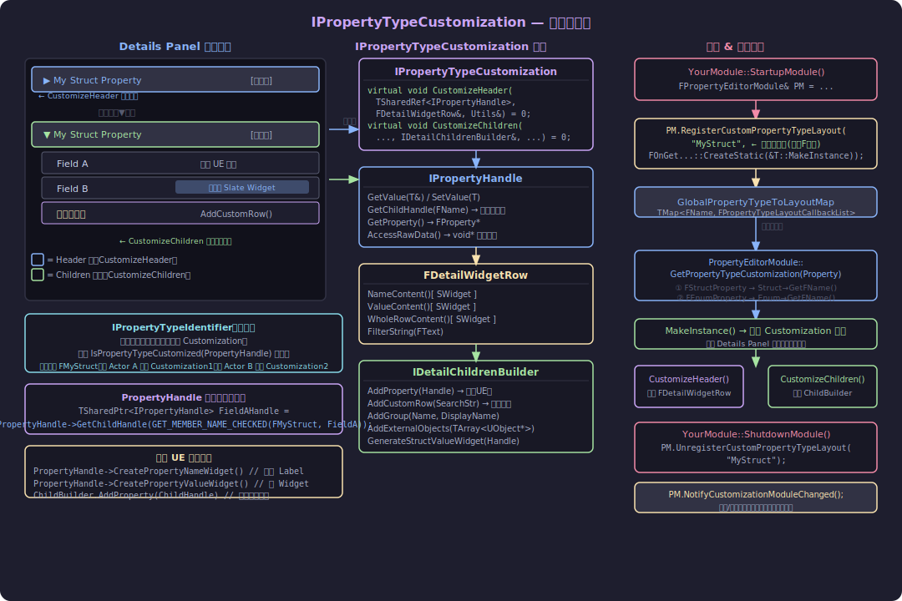

---

### 7.1 IPropertyTypeCustomization 是什么？

Details Panel 展示属性时，对于每个 `USTRUCT` 或枚举类型，UE 会先查找是否有注册的 **IPropertyTypeCustomization**。若有，就调用它来决定如何渲染；若没有，就使用 UE 内置的默认展开方式（逐字段平铺）。

`IPropertyTypeCustomization` 只有两个纯虚函数，分别对应 Details Panel 中一个属性的"两层结构"：

```cpp
// Source/Editor/PropertyEditor/Public/IPropertyTypeCustomization.h

class IPropertyTypeCustomization : public TSharedFromThis<IPropertyTypeCustomization>
{
public:
    // 渲染属性的 "折叠行"（Header Row）
    virtual void CustomizeHeader(
        TSharedRef<IPropertyHandle> PropertyHandle,
        FDetailWidgetRow& HeaderRow,
        IPropertyTypeCustomizationUtils& CustomizationUtils) = 0;

    // 渲染属性展开后的 "子行"（Children Rows）
    virtual void CustomizeChildren(
        TSharedRef<IPropertyHandle> PropertyHandle,
        IDetailChildrenBuilder& ChildBuilder,
        IPropertyTypeCustomizationUtils& CustomizationUtils) = 0;
};
```

---

### 7.2 什么是 Header，什么是 Children？

**形象理解：**

```
Details Panel 中一个结构体属性的显示
━━━━━━━━━━━━━━━━━━━━━━━━━━━━━━━━━━━━━━━━━━━━
▶  My Struct Property         [值预览文字]   ← Header 行
━━━━━━━━━━━━━━━━━━━━━━━━━━━━━━━━━━━━━━━━━━━━

点击 ▶ 展开：

▼  My Struct Property         [值预览文字]   ← Header 行（不变）
    Field A                   [输入框]       ← Children 第1行
    Field B                   [自定义Widget] ← Children 第2行
    [自定义整行内容]                          ← Children 第3行（AddCustomRow）
━━━━━━━━━━━━━━━━━━━━━━━━━━━━━━━━━━━━━━━━━━━━
```

| | **Header** | **Children** |
|---|---|---|
| 对应函数 | `CustomizeHeader` | `CustomizeChildren` |
| 参数类型 | `FDetailWidgetRow&` | `IDetailChildrenBuilder&` |
| 始终可见 | ✅（即使折叠） | ❌（仅展开时可见） |
| 典型内容 | 属性名 + 紧凑预览值 | 各字段逐一展示 |
| 不添加内容时 | 该行隐藏（不显示三角） | 无子行（不可展开） |

---

### 7.3 关键参数详解

#### IPropertyHandle — 属性句柄

`IPropertyHandle` 是访问和修改属性值的"安全代理"，封装了 Pre/PostEditChange 和 Undo/Redo。

**常用操作：**

```cpp
// ── 读写值 ──
FPropertyAccess::Result Result = PropertyHandle->GetValue(SomeVar);
PropertyHandle->SetValue(NewValue);  // 自动触发 Notify/Transaction

// ── 字符串读写（适用于不知道类型时）──
FString StrVal;
PropertyHandle->GetValueAsFormattedString(StrVal);
PropertyHandle->SetValueFromFormattedString(TEXT("42"));

// ── 获取底层 FProperty ──
FProperty* Prop = PropertyHandle->GetProperty();

// ── 原始内存访问（CustomThunk 风格）──
TArray<void*> RawData;
PropertyHandle->AccessRawData(RawData);
FMyStruct* StructPtr = (FMyStruct*)RawData[0];  // 多对象时有多个指针

// ── 获取子属性句柄（结构体内的字段）──
TSharedPtr<IPropertyHandle> FieldHandle =
    PropertyHandle->GetChildHandle(GET_MEMBER_NAME_CHECKED(FMyStruct, FieldA));

// ── 监听值变化 ──
PropertyHandle->SetOnPropertyValueChanged(FSimpleDelegate::CreateLambda([this](){
    // 值改变时重建/刷新
}));

// ── 创建默认的名称/值 Widget（直接复用 UE 原生样式）──
TSharedRef<SWidget> NameWidget  = PropertyHandle->CreatePropertyNameWidget();
TSharedRef<SWidget> ValueWidget = PropertyHandle->CreatePropertyValueWidget();
```

#### FDetailWidgetRow — 单行 Widget 声明

用于 `CustomizeHeader` 中填充 Header 行内容：

```cpp
// 三种插槽，可以只填其中一个或多个
HeaderRow
    .NameContent()
    [
        SNew(STextBlock).Text(LOCTEXT("Label", "My Struct"))
    ]
    .ValueContent()
    [
        SNew(SEditableTextBox)
        .Text(this, &FMyCustomization::GetPreviewText)
    ];

// 或者整行自定义：
HeaderRow
    .WholeRowContent()
    [
        SNew(SHorizontalBox)
        + SHorizontalBox::Slot()[ ... ]
        + SHorizontalBox::Slot()[ ... ]
    ];

// 设置搜索过滤字符串（关键词搜索时此行是否可见）
HeaderRow.FilterString(LOCTEXT("Filter", "my struct search text"));
```

#### IDetailChildrenBuilder — 子行构建器

用于 `CustomizeChildren` 中添加子行：

```cpp
// ① 直接添加子属性（使用 UE 默认外观）
ChildBuilder.AddProperty(FieldAHandle);

// ② 添加子属性，但自定义该行的 Widget
ChildBuilder.AddProperty(FieldBHandle)
    .CustomWidget()
    .NameContent()[ SNew(STextBlock).Text(LOCTEXT("B", "My Field B")) ]
    .ValueContent()[ SNew(SMyCustomWidget) ];

// ③ 添加完全自定义的行（无属性绑定）
ChildBuilder.AddCustomRow(LOCTEXT("CustomRow", "Extra Info"))
    [
        SNew(SButton)
        .Text(LOCTEXT("Btn", "点我执行操作"))
        .OnClicked(this, &FMyCustomization::OnButtonClicked)
    ];

// ④ 创建分组
IDetailGroup& Group = ChildBuilder.AddGroup("MyGroup", LOCTEXT("GrpLabel", "分组"));
// Group 也有 AddProperty/AddCustomRow

// ⑤ 添加外部对象的属性（在结构体 Customization 里嵌入对象属性）
ChildBuilder.AddExternalObjects(MyObjects);
```

---

### 7.4 将 Customization 与自己的结构体绑定

#### 步骤一：定义结构体

```cpp
// MyData.h
USTRUCT(BlueprintType)
struct FMyDamageInfo
{
    GENERATED_BODY()

    UPROPERTY(EditAnywhere)
    float BaseDamage = 0.f;

    UPROPERTY(EditAnywhere)
    float CritMultiplier = 1.5f;

    UPROPERTY(EditAnywhere)
    FName DamageType;
};
```

#### 步骤二：声明 Customization 类

```cpp
// FMyDamageInfoCustomization.h
#pragma once
#include "IPropertyTypeCustomization.h"

class FMyDamageInfoCustomization : public IPropertyTypeCustomization
{
public:
    // UE 通过这个函数工厂方法创建实例
    static TSharedRef<IPropertyTypeCustomization> MakeInstance()
    {
        return MakeShared<FMyDamageInfoCustomization>();
    }

    virtual void CustomizeHeader(TSharedRef<IPropertyHandle> PropertyHandle,
        FDetailWidgetRow& HeaderRow,
        IPropertyTypeCustomizationUtils& Utils) override;

    virtual void CustomizeChildren(TSharedRef<IPropertyHandle> PropertyHandle,
        IDetailChildrenBuilder& ChildBuilder,
        IPropertyTypeCustomizationUtils& Utils) override;

private:
    TSharedPtr<IPropertyHandle> BaseDamageHandle;
    TSharedPtr<IPropertyHandle> CritHandle;
    TSharedPtr<IPropertyHandle> DamageTypeHandle;
};
```

#### 步骤三：在 Editor 模块的 StartupModule 里注册

```cpp
// YourEditorModule.cpp
#include "PropertyEditorModule.h"
#include "Modules/ModuleManager.h"
#include "FMyDamageInfoCustomization.h"

void FYourEditorModule::StartupModule()
{
    FPropertyEditorModule& PropertyModule =
        FModuleManager::LoadModuleChecked<FPropertyEditorModule>("PropertyEditor");

    // 第一个参数是结构体名称（不带 F 前缀），必须与 USTRUCT 的名字严格一致
    PropertyModule.RegisterCustomPropertyTypeLayout(
        "MyDamageInfo",
        FOnGetPropertyTypeCustomizationInstance::CreateStatic(
            &FMyDamageInfoCustomization::MakeInstance));

    // 注册完毕后必须调用，否则已打开的 Details Panel 不会更新
    PropertyModule.NotifyCustomizationModuleChanged();
}

void FYourEditorModule::ShutdownModule()
{
    if (FModuleManager::Get().IsModuleLoaded("PropertyEditor"))
    {
        FPropertyEditorModule& PropertyModule =
            FModuleManager::GetModuleChecked<FPropertyEditorModule>("PropertyEditor");
        PropertyModule.UnregisterCustomPropertyTypeLayout("MyDamageInfo");
        PropertyModule.NotifyCustomizationModuleChanged();
    }
}
```

> **注意**：
> - 注册用的名称是 `"MyDamageInfo"`（`GetFName()` 返回值），不是 `"FMyDamageInfo"`，也不是类路径
> - 必须在 **Editor 模块**（`YourProject.Editor.uproject` 或插件 Editor 模块）中注册，不要放在 Runtime 模块
> - 该模块的 `Type` 应为 `"Editor"` 且依赖 `"PropertyEditor"`

---

### 7.5 为各子属性绑定及使用默认外观

#### 获取子属性句柄

在 `CustomizeChildren` 中，通过 `PropertyHandle->GetChildHandle(MemberName)` 拿到结构体内某个字段的句柄：

```cpp
void FMyDamageInfoCustomization::CustomizeChildren(
    TSharedRef<IPropertyHandle> PropertyHandle,
    IDetailChildrenBuilder& ChildBuilder,
    IPropertyTypeCustomizationUtils& Utils)
{
    // 获取每个字段的句柄（推荐用 GET_MEMBER_NAME_CHECKED 避免拼写错误）
    BaseDamageHandle = PropertyHandle->GetChildHandle(
        GET_MEMBER_NAME_CHECKED(FMyDamageInfo, BaseDamage));
    CritHandle = PropertyHandle->GetChildHandle(
        GET_MEMBER_NAME_CHECKED(FMyDamageInfo, CritMultiplier));
    DamageTypeHandle = PropertyHandle->GetChildHandle(
        GET_MEMBER_NAME_CHECKED(FMyDamageInfo, DamageType));

    // ...（见下方不同场景）
}
```

#### 场景一：直接使用 UE 默认外观

若某个属性不需要特殊处理，直接 `AddProperty` 即可还原 UE 内置样式：

```cpp
// 使用完全默认的 UE 渲染（包括名称、值输入框、Reset to Default 按钮等）
ChildBuilder.AddProperty(BaseDamageHandle.ToSharedRef());
ChildBuilder.AddProperty(DamageTypeHandle.ToSharedRef());
```

#### 场景二：只替换值 Widget，名称保持默认

```cpp
ChildBuilder.AddProperty(CritHandle.ToSharedRef())
    .CustomWidget()
    .NameContent()
    [
        CritHandle->CreatePropertyNameWidget()   // UE 原生名称 Label
    ]
    .ValueContent()
    [
        SNew(SHorizontalBox)
        + SHorizontalBox::Slot().AutoWidth()
        [
            SNew(SSpinBox<float>)
            .MinValue(1.f)
            .MaxValue(10.f)
            .Value(this, &FMyDamageInfoCustomization::GetCritValue)
            .OnValueChanged(this, &FMyDamageInfoCustomization::OnCritChanged)
        ]
        + SHorizontalBox::Slot().AutoWidth().Padding(4, 0)
        [
            SNew(STextBlock)
            .Text(FText::FromString(TEXT("×")))
        ]
    ];
```

#### 场景三：整行完全自定义（AddCustomRow）

```cpp
ChildBuilder.AddCustomRow(LOCTEXT("DmgPreview", "Damage Preview"))
    [
        SNew(SBorder)
        .BorderBackgroundColor(FLinearColor(0.2f, 0.05f, 0.05f))
        .Padding(4.f)
        [
            SNew(STextBlock)
            .Text(this, &FMyDamageInfoCustomization::GetDamagePreviewText)
            .ColorAndOpacity(FSlateColor(FLinearColor::Red))
        ]
    ];
```

---

### 7.6 定义 Header 行（CustomizeHeader）

`CustomizeHeader` 决定折叠状态下这一行显示什么。常见做法有两种：

**方式一：显示紧凑摘要**

```cpp
void FMyDamageInfoCustomization::CustomizeHeader(
    TSharedRef<IPropertyHandle> PropertyHandle,
    FDetailWidgetRow& HeaderRow,
    IPropertyTypeCustomizationUtils& Utils)
{
    HeaderRow
        .NameContent()
        [
            PropertyHandle->CreatePropertyNameWidget()   // 显示属性的本地化名称
        ]
        .ValueContent()
        .MinDesiredWidth(200.f)
        [
            SNew(STextBlock)
            .Font(IPropertyTypeCustomizationUtils::GetRegularFont())
            .Text(this, &FMyDamageInfoCustomization::GetHeaderSummary)
        ];
}

FText FMyDamageInfoCustomization::GetHeaderSummary() const
{
    float Base = 0.f, Crit = 0.f;
    if (BaseDamageHandle.IsValid()) BaseDamageHandle->GetValue(Base);
    if (CritHandle.IsValid()) CritHandle->GetValue(Crit);
    return FText::Format(LOCTEXT("Summary", "{0} (暴击 ×{1})"), Base, Crit);
}
```

> `BaseDamageHandle` 需要在 `CustomizeHeader` 调用前已通过 `CustomizeChildren` 初始化，  
> 但实际上 UE 会先调用 `CustomizeHeader`，再调用 `CustomizeChildren`。  
> **推荐做法**：在 `CustomizeHeader` 里同时初始化子句柄：

```cpp
void FMyDamageInfoCustomization::CustomizeHeader(
    TSharedRef<IPropertyHandle> PropertyHandle,
    FDetailWidgetRow& HeaderRow,
    IPropertyTypeCustomizationUtils& Utils)
{
    // Header 里就初始化，这样 GetHeaderSummary 就能用
    BaseDamageHandle = PropertyHandle->GetChildHandle(
        GET_MEMBER_NAME_CHECKED(FMyDamageInfo, BaseDamage));
    CritHandle = PropertyHandle->GetChildHandle(
        GET_MEMBER_NAME_CHECKED(FMyDamageInfo, CritMultiplier));

    HeaderRow
        .NameContent()[ PropertyHandle->CreatePropertyNameWidget() ]
        .ValueContent()[ SNew(STextBlock).Text(this, &FMyDamageInfoCustomization::GetHeaderSummary) ];
}
```

**方式二：不添加任何内容（Header 行消失，子属性直接平铺）**

```cpp
void FMyDamageInfoCustomization::CustomizeHeader(
    TSharedRef<IPropertyHandle> PropertyHandle,
    FDetailWidgetRow& HeaderRow,
    IPropertyTypeCustomizationUtils& Utils)
{
    // 什么都不做 → Header 行不显示，Children 直接展示在父属性所在位置
}
```

---

### 7.7 UE 如何知道什么时候要显示 Customization？

**完整触发流程（源码追踪）：**

```
Details Panel 刷新（选中 Actor、属性改变等）
  ↓
SDetailsView::Tick / ForceRefresh()
  ↓
PropertyGenerationUtilities::BuildPropertyNodes()
  为对象上的每个 FProperty 创建 FPropertyNode
  ↓
SDetailsSingleItemRow / SDetailCustomWidgetRow 构建时
  ↓
FPropertyEditorModule::GetPropertyTypeCustomization(
    const FProperty* Property,          ← 当前属性
    const IPropertyHandle& Handle,
    const FCustomPropertyTypeLayoutMap& InstanceMap)
  ↓
  ① CastField<FStructProperty>(Property) → StructProperty->Struct->GetFName()
  ② 查 InstancedPropertyTypeLayoutMap（本 SDetailsView 私有的布局表）
     → 未找到 → 查 GlobalPropertyTypeToLayoutMap（全局注册表）
  ③ 若 Struct 上有元数据 meta=(PresentAsType="OtherName")，则用 OtherName 查
  ↓
找到 FPropertyTypeLayoutCallback（含 MakeInstance 委托）
  ↓
MakeInstance() → TSharedRef<IPropertyTypeCustomization>
  ↓
调用 CustomizeHeader(Handle, HeaderRow, Utils)
调用 CustomizeChildren(Handle, ChildBuilder, Utils)
```

**关键数据结构：**

```cpp
// PropertyEditorModule.h 内部（简化）
TMap<FName, FPropertyTypeLayoutCallbackList> GlobalPropertyTypeToLayoutMap;
// Key   = 结构体/枚举的 FName（如 "MyDamageInfo"）
// Value = 回调列表（支持同一类型注册多个，通过 IPropertyTypeIdentifier 区分）
```

**UserDefinedStruct 的特殊处理：**

`IsCustomizedStruct()` 中有一条检查：

```cpp
if (Struct && !Struct->IsA<UUserDefinedStruct>())
```

蓝图中创建的"用户自定义结构体"(`UUserDefinedStruct`) **不走** CustomPropertyTypeLayout 路径，始终使用默认展开方式。自定义仅对 C++ 定义的 `USTRUCT` 生效。

---

### 7.8 IPropertyTypeIdentifier — 同一类型多套 Customization

如果需要对同一个结构体在不同上下文下显示不同样式，可以使用 `IPropertyTypeIdentifier`：

```cpp
class FMyContextIdentifier : public IPropertyTypeIdentifier
{
public:
    // 返回 true 时，使用这套 Customization
    virtual bool IsPropertyTypeCustomized(const IPropertyHandle& Handle) const override
    {
        // 例：只有父属性是 AMySpecialActor 时才使用
        TArray<UObject*> Outers;
        Handle.GetOuterObjects(Outers);
        for (UObject* Outer : Outers)
        {
            if (Outer && Outer->IsA<AMySpecialActor>()) return true;
        }
        return false;
    }
};

// 注册时带上 Identifier
TSharedPtr<FMyContextIdentifier> Id = MakeShared<FMyContextIdentifier>();
PropertyModule.RegisterCustomPropertyTypeLayout(
    "MyDamageInfo",
    FOnGetPropertyTypeCustomizationInstance::CreateStatic(&FSpecialCustomization::MakeInstance),
    Id);   // ← 第三个参数
```

---

### 7.9 完整实例：FMyDamageInfo 的最终实现

```cpp
// FMyDamageInfoCustomization.cpp

#include "FMyDamageInfoCustomization.h"
#include "DetailWidgetRow.h"
#include "IDetailChildrenBuilder.h"
#include "PropertyHandle.h"
#include "Widgets/Input/SNumericEntryBox.h"
#include "Widgets/Text/STextBlock.h"

#define LOCTEXT_NAMESPACE "MyDamageInfo"

void FMyDamageInfoCustomization::CustomizeHeader(
    TSharedRef<IPropertyHandle> PropertyHandle,
    FDetailWidgetRow& HeaderRow,
    IPropertyTypeCustomizationUtils& Utils)
{
    // 提前拿到子属性句柄，方便 Header 预览使用
    BaseDamageHandle = PropertyHandle->GetChildHandle(
        GET_MEMBER_NAME_CHECKED(FMyDamageInfo, BaseDamage));
    CritHandle       = PropertyHandle->GetChildHandle(
        GET_MEMBER_NAME_CHECKED(FMyDamageInfo, CritMultiplier));
    DamageTypeHandle = PropertyHandle->GetChildHandle(
        GET_MEMBER_NAME_CHECKED(FMyDamageInfo, DamageType));

    HeaderRow
        .NameContent()
        [
            PropertyHandle->CreatePropertyNameWidget()
        ]
        .ValueContent()
        [
            SNew(STextBlock)
            .Font(IPropertyTypeCustomizationUtils::GetRegularFont())
            .Text(this, &FMyDamageInfoCustomization::GetHeaderSummary)
        ];
}

void FMyDamageInfoCustomization::CustomizeChildren(
    TSharedRef<IPropertyHandle> PropertyHandle,
    IDetailChildrenBuilder& ChildBuilder,
    IPropertyTypeCustomizationUtils& Utils)
{
    // BaseDamage：使用 UE 默认样式
    ChildBuilder.AddProperty(BaseDamageHandle.ToSharedRef());

    // CritMultiplier：自定义 SpinBox（值范围 1x ~ 10x）
    ChildBuilder.AddProperty(CritHandle.ToSharedRef())
        .CustomWidget()
        .NameContent()
        [
            CritHandle->CreatePropertyNameWidget()
        ]
        .ValueContent()
        [
            SNew(SNumericEntryBox<float>)
            .AllowSpin(true)
            .MinValue(1.f) .MaxValue(10.f)
            .MinSliderValue(1.f) .MaxSliderValue(5.f)
            .Value(this, &FMyDamageInfoCustomization::GetCritValue)
            .OnValueChanged(this, &FMyDamageInfoCustomization::OnCritChanged)
            .OnValueCommitted(this, &FMyDamageInfoCustomization::OnCritCommitted)
        ];

    // DamageType：使用 UE 默认样式
    ChildBuilder.AddProperty(DamageTypeHandle.ToSharedRef());

    // 额外一行：伤害预览
    ChildBuilder.AddCustomRow(LOCTEXT("Preview", "Damage Preview"))
        [
            SNew(STextBlock)
            .Text(this, &FMyDamageInfoCustomization::GetDamagePreviewText)
            .ColorAndOpacity(FSlateColor(FLinearColor(1.f, 0.4f, 0.4f)))
        ];
}

FText FMyDamageInfoCustomization::GetHeaderSummary() const
{
    float Base = 0.f;
    if (BaseDamageHandle.IsValid()) BaseDamageHandle->GetValue(Base);
    return FText::Format(LOCTEXT("Hdr", "{0} Dmg"), FText::AsNumber(Base));
}

TOptional<float> FMyDamageInfoCustomization::GetCritValue() const
{
    float Val = 1.f;
    if (CritHandle.IsValid()) CritHandle->GetValue(Val);
    return Val;
}

void FMyDamageInfoCustomization::OnCritChanged(float NewVal)
{
    if (CritHandle.IsValid())
        CritHandle->SetValue(NewVal, EPropertyValueSetFlags::InteractiveChange);
}

void FMyDamageInfoCustomization::OnCritCommitted(float NewVal, ETextCommit::Type)
{
    if (CritHandle.IsValid())
        CritHandle->SetValue(NewVal);
}

FText FMyDamageInfoCustomization::GetDamagePreviewText() const
{
    float Base = 0.f, Crit = 1.5f;
    if (BaseDamageHandle.IsValid()) BaseDamageHandle->GetValue(Base);
    if (CritHandle.IsValid()) CritHandle->GetValue(Crit);
    return FText::Format(LOCTEXT("Preview", "普通: {0}  暴击: {1}"),
        FText::AsNumber(Base), FText::AsNumber(Base * Crit));
}

#undef LOCTEXT_NAMESPACE
```

---

### 7.10 心智模型总结

```
Details Panel 决策树
─────────────────────────────────────────────────────────────────
  发现 FStructProperty（FMyDamageInfo）
      ↓
  IsCustomizedStruct("MyDamageInfo") ?
      ├─ YES → 调用 MakeInstance() → IPropertyTypeCustomization
      │          ├─ CustomizeHeader  → 渲染折叠行（FDetailWidgetRow）
      │          └─ CustomizeChildren → 渲染展开子行（IDetailChildrenBuilder）
      │
      └─ NO  → 默认：逐字段 AddProperty，全部使用 UE 内置样式
─────────────────────────────────────────────────────────────────

开发者控制权对比：
  AddProperty(Handle)              → 完全交给 UE，什么都不用写
  AddProperty(Handle).CustomWidget → 名称/值槽位可替换，Reset 按钮等自动保留
  AddCustomRow(SearchStr)[...]     → 完全自定义，不绑定任何 FProperty
```

