# UE 如何驱动 SkeletalMesh 动画——深度技术解析

> **目标读者**：有基础 C++ 能力、刚接触 UE 的大学生  
> **内容来源**：直接阅读 UE 5.4.4 源代码，所有结论均有文件路径和行号支撑  
> **源码根目录**：`Engine/Source/`

---

## 目录

1. [动画系统整体架构](#1-动画系统整体架构)
2. [Animation Blueprint 与分层状态机](#2-animation-blueprint-与分层状态机)
3. [Animation Layer Interface 与解耦](#3-animation-layer-interface-与解耦)
4. [骨骼动画计算流程](#4-骨骼动画计算流程)
   - [4.1 时间推进（Time Advancement）](#41-时间推进time-advancement)
   - [4.2 Montage 混合](#42-montage-混合)
   - [4.3 BlendSpace/BlendSpace1D 算法](#43-blendspaceblendspace1d-算法)
5. [IK/FK 计算](#5-ikfk-计算)
   - [5.1 FK 正向运动学](#51-fk-正向运动学)
   - [5.2 TwoBoneIK：余弦定理求解](#52-twoboneik余弦定理求解)
   - [5.3 CCDIK：循环坐标下降](#53-ccdik循环坐标下降)
   - [5.4 Jacobian Transpose：从多变量视角理解 IK](#54-jacobian-transpose从多变量视角理解-ik)
6. [BlueprintThreadSafeUpdateAnimation 详解](#6-blueprintthreadsafeupdateanimation-详解)
7. [UE 动画性能优化](#7-ue-动画性能优化)

---

## 1. 动画系统整体架构

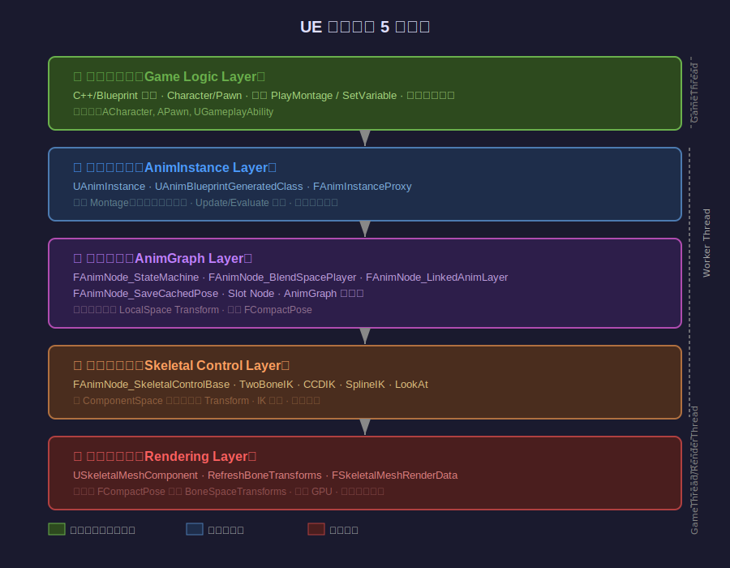

UE 动画系统从底到顶分为 **5 个逻辑层**（并非严格 API 边界，而是职责分工）：

### 层次说明（从源代码验证）

| 层 | 核心类/模块 | 主要职责 |
|----|------------|--------|
| ① 游戏逻辑层 | `ACharacter`, `APawn`, `UGameplayAbility` | 触发动画事件（`Montage_Play`、设置变量） |
| ② 动画实例层 | `UAnimInstance`, `FAnimInstanceProxy` | 状态管理、Montage 调度、Update/Evaluate 入口 |
| ③ 动画图层 | `FAnimNode_StateMachine`, `FAnimNode_BlendSpacePlayer` 等 | 按节点图计算 LocalSpace `FCompactPose` |
| ④ 骨骼控制层 | `FAnimNode_SkeletalControlBase`, CCDIK, TwoBoneIK | 在 ComponentSpace 修改骨骼 Transform（IK） |
| ⑤ 渲染驱动层 | `USkeletalMeshComponent::RefreshBoneTransforms` | 将 Pose 写入 BoneMatrix → GPU 蒙皮 |

**关键数据类型**（贯穿全系统）：

```cpp
// FA2Pose：最简单的姿势容器——本地空间骨骼变换数组
// Runtime/Engine/Classes/Animation/AnimTypes.h
struct FA2Pose {
    TArray<FTransform> Bones;  // 索引与 BoneContainer 对应
};

// FCompactPose：经过 RequiredBones 过滤后的紧凑版本
// 只包含当前动画需要的骨骼（跳过不需要的），减少计算量
struct FCompactPose : FA2Pose { ... };

// FA2CSPose：ComponentSpace（组件空间）姿势，带懒加载标记
struct FA2CSPose {
    TArray<uint8> ComponentSpaceFlags;  // 0=未计算，1=已计算
    // GetComponentSpaceTransform(i) 内部调用 CalculateComponentSpaceTransform(i)
    // 该函数会向上递归到最近已计算的父骨骼，沿路填充 Flags
};
```

**每帧数据流**：

```
DeltaTime
  → TickComponent()
    → [Worker Thread] UpdateAnimation_WithRoot()
        → 推进 AnimGraph 节点状态（权重、时间）
    → [Worker Thread] EvaluateAnimation_WithRoot()
        → 采样 AnimSequence → 生成 FCompactPose（LocalSpace）
        → IK 节点在 ComponentSpace 修改骨骼位置
    → [Game Thread] RefreshBoneTransforms()
        → FCompactPose → ComponentSpaceTransforms[]
        → 发送 BoneMatrix 到 GPU
```

---

## 2. Animation Blueprint 与分层状态机

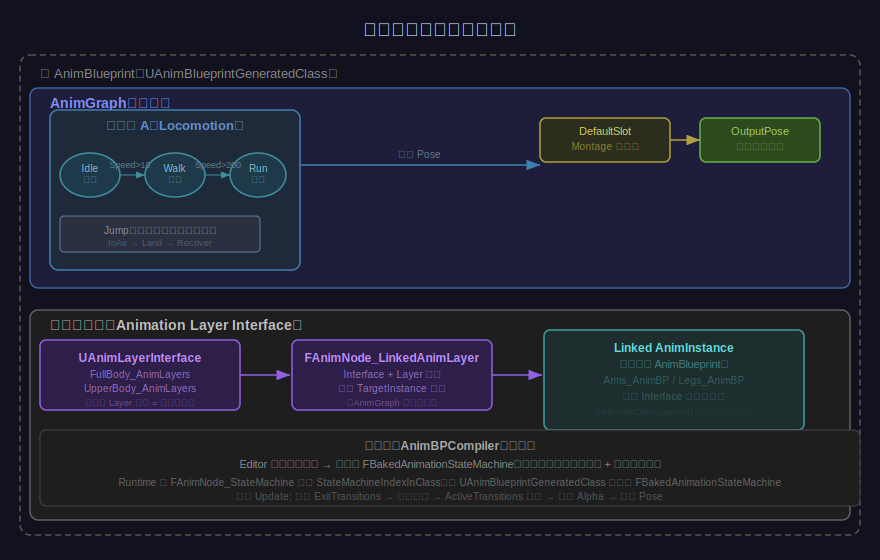

### 2.1 AnimBlueprint 的编译原理

AnimBlueprint 在编辑器中是可视化节点图，**保存时**由 `FAnimBlueprintCompilerContext` 编译为：

1. **`FBakedAnimationStateMachine`**（只读描述数据）—— 保存在 `UAnimBlueprintGeneratedClass::BakedStateMachines[]`
2. **节点属性偏移表** —— 运行时通过偏移访问节点数据（避免虚函数开销）
3. **编译后 C++ 函数** —— Blueprint 节点逻辑转为 C++ 字节码或原生函数

`FBakedAnimationStateMachine` 包含：

```
States[]         ← 状态列表（每个状态含 AnimGraph 节点引用）
Transitions[]    ← 所有可能的转换（含条件 Lambda 引用）
InitialState     ← 初始状态索引
```

### 2.2 状态机运行时：FAnimNode_StateMachine

**源文件**：`Source/Runtime/Engine/Classes/Animation/AnimNode_StateMachine.h`

```cpp
struct FAnimNode_StateMachine : public FAnimNode_Base {
    int32 StateMachineIndexInClass;   // 在 BakedStateMachines[] 中的索引
    int32 MaxTransitionsPerFrame;     // 每帧最多评估几次转换条件
    int32 CurrentState;               // 当前活跃状态
    float ElapsedTime;                // 当前状态已持续时间
    
    // 活跃的转换列表（可同时有多个转换在混合中）
    TArray<FAnimationActiveTransitionEntry> ActiveTransitionArray;
};
```

**关键：`FAnimationActiveTransitionEntry`**（转换中间状态）

```cpp
struct FAnimationActiveTransitionEntry {
    float ElapsedTime;                // 转换已进行的时间
    float Alpha;                      // 混合因子 [0,1]
    float CrossfadeDuration;          // 总混合时长
    FAlphaBlend Blend;                // 控制 Alpha 曲线（Linear/Cubic 等）
    int32 NextState;                  // 目标状态
    int32 PreviousState;              // 源状态
    TArray<FBlendSampleData> StateBlendData;  // 状态内采样数据
    UBlendProfile* BlendProfile;      // 骨骼级别混合权重（不同骨骼不同权重）
};
```

**每帧 Update 流程**（`FAnimNode_StateMachine::Update_AnyThread`）：

```
1. 评估当前状态的所有 ExitTransitions 条件
2. 满足条件的转换加入 ActiveTransitionArray
3. 对每个活跃转换：ElapsedTime += DeltaTime，Alpha = ElapsedTime/CrossfadeDuration
4. Alpha >= 1.0 时：转换完成，更新 CurrentState，移除转换
5. 限制 MaxTransitionsPerFrame（防止单帧无限状态跳转）
```

**每帧 Evaluate 流程**（`FAnimNode_StateMachine::Evaluate_AnyThread`）：

```
如果有活跃转换:
    Pose_current = Evaluate(PreviousState)
    Pose_next    = Evaluate(NextState)
    Output Pose  = Lerp(Pose_current, Pose_next, Alpha)
    Alpha 由 FAlphaBlend 根据 BlendOption 曲线映射
否则:
    Output Pose  = Evaluate(CurrentState)
```

### 2.3 分层状态机（Layered State Machine）

**层叠状态机**（Layered/Hierarchical State Machine）指一个状态机内部的某个状态本身包含另一个子状态机。UE 实现方式：

- 状态内部有独立的 AnimGraph 节点图
- 该子图可以包含另一个 `FAnimNode_StateMachine`
- 嵌套深度无限制（受性能限制，通常 2-3 层）

示例：`Locomotion 状态机` → `Jump 状态` → 内含 `InAir/Land/Recover 子状态机`

---

## 3. Animation Layer Interface 与解耦


### 3.1 设计目的

当角色动画需要**由多个团队独立开发**时（比如基础移动 AnimBP 由 AI 团队维护，武器动画由战斗团队维护），需要一个**接口合约**，让主 AnimBP 不依赖具体实现。

### 3.2 UAnimLayerInterface 源码

**源文件**：`Source/Runtime/Engine/Classes/Animation/AnimLayerInterface.h`

```cpp
// 纯标记接口，不含任何成员
UCLASS(Abstract, NotBlueprintable)
class UAnimLayerInterface : public UInterface
{
    GENERATED_BODY()
};

// 对应的 C++ 接口（空）
class IAnimLayerInterface
{
    GENERATED_BODY()
};
```

接口本身是空的！它只是一个**类型标签**（Type Tag）。真正的"接口函数"是在 AnimBlueprint 编辑器中以 `UAnimLayerInterface` 的子类为基础定义的**动画层函数**（Animation Layer Functions），这些函数签名被编译时记录在 `UAnimBlueprintGeneratedClass` 中。

### 3.3 FAnimNode_LinkedAnimLayer 实现解耦

**源文件**：`Source/Runtime/Engine/Classes/Animation/AnimNode_LinkedAnimLayer.h`

```cpp
struct FAnimNode_LinkedAnimLayer : public FAnimNode_LinkedAnimGraph
{
    // Interface 类型（可选；设置后只接受实现此接口的实例）
    TSubclassOf<UAnimLayerInterface> Interface;
    
    // 具体使用哪个层函数
    FName Layer;

    // 运行时设置链接目标
    void SetLinkedLayerInstance(const UAnimInstance* InOwningAnimInstance,
                                UAnimInstance* InNewLinkedInstance);

    // 返回层函数名（供 FAnimNode_LinkedAnimGraph 使用）
    virtual FName GetDynamicLinkFunctionName() const override;
    
    // 返回当前绑定的 UAnimInstance
    virtual UAnimInstance* GetDynamicLinkTarget(UAnimInstance* InOwningAnimInstance) const override;
};
```

**运行时工作原理**：

```
主 AnimBP 的 AnimGraph 中有 LinkedAnimLayer 节点
  └── Interface = "IWeaponAnimLayers"
  └── Layer     = "UpperBody"

运行时调用：
  Character->GetMesh()->GetAnimInstance()
            ->LinkAnimClassLayers(AK47_AnimBP_Class)

效果：
  AnimInstance 查找 AK47_AnimBP_Class 实现的 "UpperBody" 函数
  将 LinkedAnimLayer 节点的执行重定向到 AK47_AnimBP 中对应子图
  主 AnimBP 完全不知道 AK47_AnimBP 的存在
```

**解耦效果**：
- 主 AnimBP 只声明"我需要一个 UpperBody 层"
- 任何实现了 `IWeaponAnimLayers` 的 AnimBP 都可以在运行时换绑
- 空手、手枪、步枪分别有各自的 AnimBP，通过 `LinkAnimClassLayers` 动态切换

---

## 4. 骨骼动画计算流程

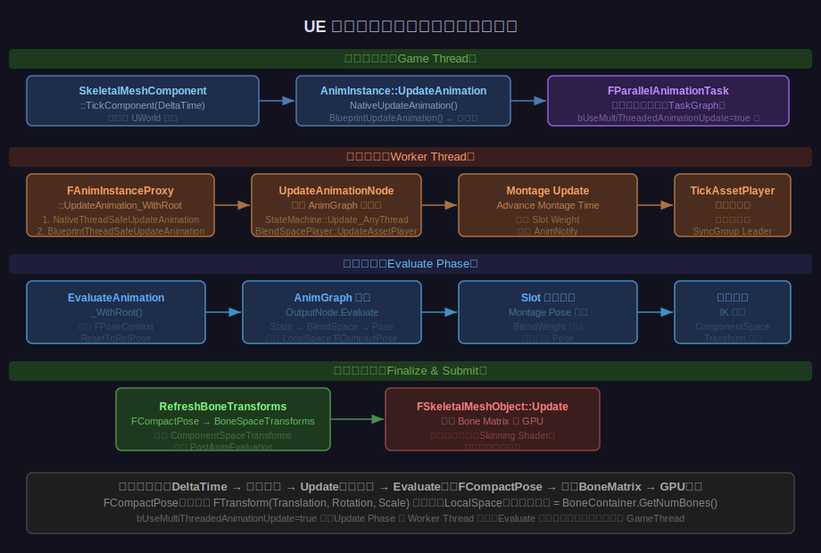

### 4.1 时间推进（Time Advancement）

#### 4.1.1 整体驱动链

**源文件**：`Source/Runtime/Engine/Private/Animation/AnimInstanceProxy.cpp`

```cpp
// UpdateAnimation_WithRoot (line 1228)
void FAnimInstanceProxy::UpdateAnimation_WithRoot(
    FAnimationUpdateContext& Context, FAnimNode_Base* InRootNode, FName InLayerName)
{
    // 步骤1: 确保骨骼缓存有效（父骨骼数组）
    CacheBones_WithRoot(InRootNode);

    // 步骤2: 仅在每帧第一次调用时执行（防重复）
    if (!bUpdatingRoot && FrameCounterForUpdate != GFrameCounter)
    {
        // ③ 调用线程安全更新（后文详述）
        GetAnimInstanceObject()->NativeThreadSafeUpdateAnimation(DeltaSeconds);
        GetAnimInstanceObject()->BlueprintThreadSafeUpdateAnimation(DeltaSeconds);

        // ④ 调用普通帧更新（主线程版本，在多线程时此处已是工作线程）
        Update(DeltaSeconds);  // → NativeUpdateAnimation + BlueprintUpdateAnimation

        FrameCounterForUpdate = GFrameCounter;  // 标记本帧已更新
    }

    // 步骤3: 更新 AnimGraph 所有节点（递归）
    UpdateAnimationNode_WithRoot(InContext, InRootNode, InLayerName);
    // 内部调用: RootNode->Update_AnyThread(InContext) → 递归所有子节点
    
    // 步骤4: 推进所有 AssetPlayer 时间（统一处理 SyncGroup）
    Sync.TickAssetPlayerInstances(this);
}
```

#### 4.1.2 时间轴推进的核心函数

每个动画资产（AnimSequence / BlendSpace）的时间通过 `FAnimationRuntime::AdvanceTime` 推进：

```cpp
// 源码 AnimationRuntime.cpp
static void AdvanceTime(bool bIsLooping, float MoveDelta, float& InOutTime, float EndTime)
{
    InOutTime += MoveDelta;
    if (bIsLooping) {
        // 使用 FMath::Wrap 循环
        InOutTime = FMath::Wrap(InOutTime, 0.f, EndTime);
    } else {
        InOutTime = FMath::Clamp(InOutTime, 0.f, EndTime);
    }
}
```

- `MoveDelta = DeltaTime × PlayRate × RateScale × SampleRateScale`
- **BlendSpace** 使用**归一化时间**（0-1），通过 `NewAnimLength = GetAnimationLengthFromSampleData(SampleDataList)` 将加权样本的时长混合为统一时长，再换算回实际时间

#### 4.1.3 SyncGroup 同步机制

多个动画（如跑步上下半身）需要同步时：

```
SyncGroupName 相同的 AssetPlayer 同属一个同步组
第一个调用 TickAssetPlayer 的节点成为 Leader（通常权重最高者）
Leader 推进时间后，其他 Follower 同步到 Leader 的 NormalizedTime
```

SyncGroup 保证混合动画不产生步伐错位。

### 4.2 Montage 混合

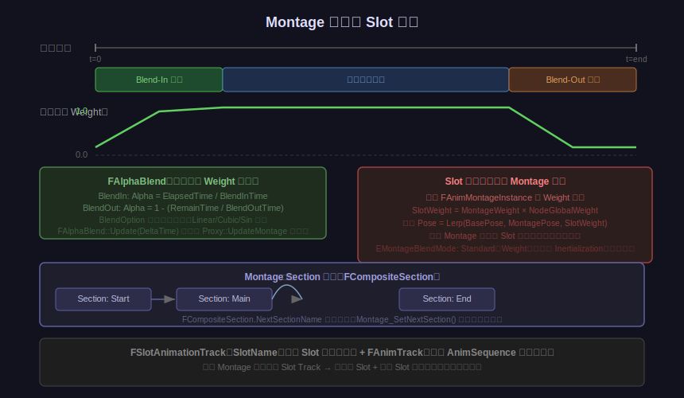

#### 4.2.1 数据结构

**源文件**：`Source/Runtime/Engine/Classes/Animation/AnimMontage.h`

```cpp
// Montage 核心资产
class UAnimMontage : public UAnimCompositeBase
{
    // Section 系统——将 Montage 分为命名片段
    TArray<FCompositeSection> CompositeSections;
    
    // Slot 轨道——每个 Slot 含一段动画序列
    TArray<FSlotAnimationTrack> SlotAnimTracks;
    
    // 混合参数
    FAlphaBlend BlendIn;      // 淡入配置
    FAlphaBlend BlendOut;     // 淡出配置
    float BlendOutTriggerTime;// 触发淡出时刻（从 Montage 末尾倒数）
    
    // 混合模式
    EMontageBlendMode MontageBlendMode; // Standard 或 Inertialization
};

// FCompositeSection：定义 Section 跳转关系
struct FCompositeSection {
    FName SectionName;     // 本 Section 名称（如 "Start", "Loop", "End"）
    FName NextSectionName; // 播完后跳转到哪个 Section（空 = 不循环）
    float StartTime;       // 在 Montage 时间轴上的起始时间
};

// FSlotAnimationTrack：一个 Slot 的动画片段
struct FSlotAnimationTrack {
    FName SlotName;            // 对应 AnimGraph 中 Slot 节点的名称
    FAnimTrack AnimTrack;      // 实际的 AnimSequence 片段列表
};
```

#### 4.2.2 FAnimMontageInstance 运行时状态

当调用 `Montage_Play()` 时，创建 `FAnimMontageInstance`：

```cpp
// AnimInstance.cpp 内，每个播放中的 Montage 实例
struct FAnimMontageInstance {
    UAnimMontage* Montage;    // 指向资产
    float Position;           // 当前播放位置（秒）
    float Weight;             // 当前混合权重 [0,1]
    float PlayRate;           // 播放速率
    FAlphaBlend Blend;        // 控制 Weight 的淡入淡出状态机
    int32 CurrentSectionIndex;// 当前 Section 索引
};
```

#### 4.2.3 Weight 计算流程

**每帧**（在 `UpdateAnimation_WithRoot` 内）：

```
FAnimMontageInstance::Advance(DeltaTime)
  │
  ├── Blend.Update(DeltaTime)
  │    └── FAlphaBlend 内部：
  │         BlendIn 阶段:  Alpha += DeltaTime / BlendInTime
  │         播放阶段:      Alpha = 1.0
  │         BlendOut 阶段: Alpha -= DeltaTime / BlendOutTime  
  │         (BlendOption 应用曲线映射，如 EAlphaBlendOption::Cubic)
  │
  └── Weight = Alpha  （最终权重）
```

**Slot 节点（`FAnimNode_Slot`）混合时**：

```
对每个在此 Slot 上播放的 MontageInstance:
    SlotNodeWeight  += MontageInstance.Weight
    SlottedPose     = Blend(SlottedPose, MontagePose, MontageInstance.Weight)

最终 OutputPose = Lerp(BasePose, SlottedPose, SlotNodeWeight)
```

**多 Montage 同一 Slot**：
- 权重按比例归一化，确保总权重不超过 1
- 先来的 Montage 被后来者的 BlendIn 逐渐压制

#### 4.2.4 Section 跳转

```cpp
// 运行时修改 Section 流向（循环技能动画）
AnimInstance->Montage_SetNextSection("Loop", "Loop", MyMontage);
// 效果：Loop Section 完毕后继续跳回 Loop，实现循环

// 停止循环
AnimInstance->Montage_SetNextSection("Loop", "End", MyMontage);
// 效果：Loop 完毕后播放 End Section 再退出
```

### 4.3 BlendSpace/BlendSpace1D 算法

#### 4.3.1 BlendSpace1D——线性插值

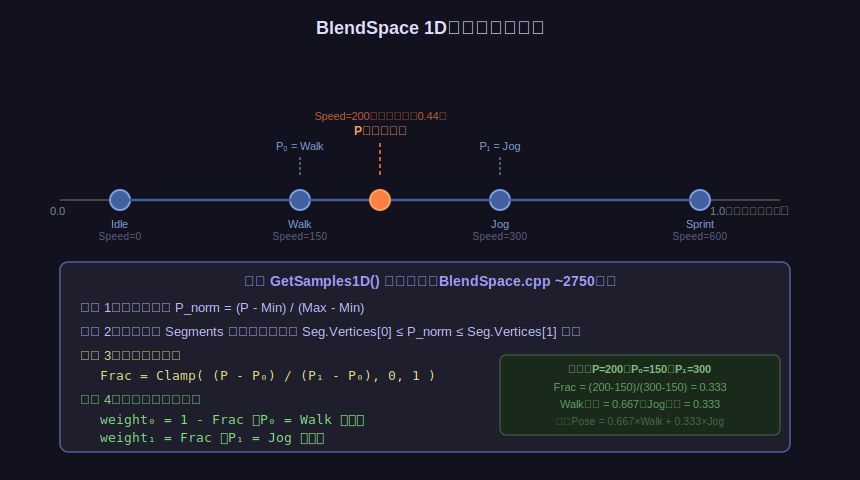

**源文件**：`Source/Runtime/Engine/Private/Animation/BlendSpace.cpp`，约 2691 行

**数据结构**：

```cpp
// 编辑器预计算，存储到资产中
struct FBlendSpaceSegment {
    float Vertices[2];      // 两端归一化坐标 [P0_norm, P1_norm]
    int32 SampleIndices[2]; // 两端对应的 FBlendSample 索引
};
```

**GetSamples1D() 算法**：

```cpp
// 简化后的核心逻辑（实际源码在 BlendSpace.cpp:2691）
float P_norm = (InputValue - BlendParam.Min) / (BlendParam.Max - BlendParam.Min);

// 1. 从缓存的上一帧 Segment 索引开始搜索（优化：通常只移动 0-1 步）
while (不在当前 Segment 内) {
    if (P_norm < Segment.Vertices[0]) --SegmentIndex;
    else ++SegmentIndex;
}

// 2. 计算插值因子
float P0 = Segment.Vertices[0];
float P1 = Segment.Vertices[1];
float Frac = FMath::Clamp((P_norm - P0) / (P1 - P0), 0.f, 1.f);

// 3. 输出两个加权样本
OutWeightedSamples.Push({ Segment.SampleIndices[0], 1.f - Frac });  // 左样本
OutWeightedSamples.Push({ Segment.SampleIndices[1], Frac         }); // 右样本
```

**数学公式**：

$$\text{Frac} = \frac{P - P_0}{P_1 - P_0}$$

$$w_{\text{left}} = 1 - \text{Frac}, \quad w_{\text{right}} = \text{Frac}$$

$$\text{Pose} = w_{\text{left}} \cdot \text{Pose}_{P_0} + w_{\text{right}} \cdot \text{Pose}_{P_1}$$

#### 4.3.2 BlendSpace 2D——三角剖分 + 重心坐标

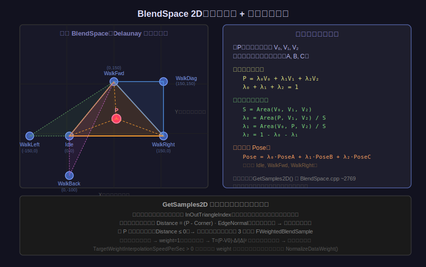

**编辑器预计算（Delaunay 三角剖分）**：

当用户在 BlendSpace 编辑器中添加采样点后，编辑器会自动构建 Delaunay 三角剖分，将二维采样点空间剖分为若干三角形，存储为：

```cpp
struct FBlendSpaceTriangle {
    static const int32 NUM_VERTICES = 3;
    FVector2D Vertices[3];      // 三角形三个顶点的归一化 2D 坐标
    int32 SampleIndices[3];     // 对应 FBlendSample 索引
    
    struct FEdgeInfo {
        FVector2D Normal;       // 边的外法线（指向三角形外部）
        int32 NeighborTriangle; // 相邻三角形索引（-1 = 边界）
    } EdgeInfo[3];
};
```

**GetSamples2D() 三角形查找算法**（边法线增量搜索）：

```cpp
// 源码：BlendSpace.cpp ~2769
// 从上一帧缓存的三角形开始（InOutTriangleIndex）
for (int Attempt = 0; Attempt < Triangles.Num(); ++Attempt)
{
    // 查找 P 最远在哪条边的外侧
    float LargestDistance = KINDA_SMALL_NUMBER;
    int32 LargestEdgeIndex = -1;
    for (int v = 0; v < 3; ++v) {
        float Distance = dot(P - Triangle.Vertices[v], Triangle.EdgeInfo[v].Normal);
        if (Distance > LargestDistance) {
            LargestDistance = Distance;
            LargestEdgeIndex = v;
        }
    }
    
    if (LargestEdgeIndex == -1) {
        // P 在三角形内部（所有边内侧）→ 找到了！
        break;
    }
    // 跳到相邻三角形继续搜索
    InOutTriangleIndex = Triangle.EdgeInfo[LargestEdgeIndex].NeighborTriangle;
}
```

**重心坐标计算**：

找到包含 P 的三角形 $\{V_0, V_1, V_2\}$ 后，计算重心坐标：

$$S = \text{Area}(V_0, V_1, V_2) = \frac{1}{2} |（V_1-V_0） \times (V_2-V_0)|$$

$$\lambda_0 = \frac{\text{Area}(P, V_1, V_2)}{S}, \quad \lambda_1 = \frac{\text{Area}(V_0, P, V_2)}{S}, \quad \lambda_2 = 1 - \lambda_0 - \lambda_1$$

**最终混合**：

$$\text{Pose} = \lambda_0 \cdot \text{Pose}_{V_0} + \lambda_1 \cdot \text{Pose}_{V_1} + \lambda_2 \cdot \text{Pose}_{V_2}$$

其中 $\lambda_0 + \lambda_1 + \lambda_2 = 1$，保证混合权重之和为 1。

**输入平滑（Input Filtering）**：

BlendSpace 的输入值在 `TickAssetPlayer` 内先经过 `FilterInput()` 平滑处理：

```cpp
// FilterInput 使用 FBlendFilter，支持：
// - SpringDamper（弹簧阻尼，物理感更强）
// - Exponential（指数滑动平均，简单平滑）
// 作用：防止输入突变导致动画抖动
FVector FilteredInput = FilterInput(Instance.BlendSpace.BlendFilter, RawInput, DeltaTime);
```

**权重跨帧平滑**（`TargetWeightInterpolationSpeedPerSec > 0` 时）：

```
NewWeights = GetSamplesFromBlendInput(FilteredInput)     // 目标权重
OldWeights = 上一帧的 BlendSampleDataCache               // 当前权重

每帧对每个样本:
    CurrentWeight += (TargetWeight - CurrentWeight) × (TargetWeightInterpolationSpeed × DeltaTime)
    
最后 NormalizeDataWeight(SampleDataCache) 归一化
```

---

## 5. IK/FK 计算

### 5.1 FK 正向运动学

FK（Forward Kinematics，正向运动学）是动画系统的**基础**：

$$\mathbf{T}_{\text{bone}_i}^{\text{world}} = \mathbf{T}_{\text{root}}^{\text{world}} \cdot \prod_{k=1}^{i} \mathbf{T}_{\text{bone}_k}^{\text{parent}}$$

即每块骨骼的**世界变换** = 从根到该骨骼的变换矩阵连乘积。

UE 中对应 `FA2CSPose::CalculateComponentSpaceTransform()`：

```cpp
// 懒加载计算：只有被 Evaluate 时才计算
FTransform FA2CSPose::GetComponentSpaceTransform(FCompactPoseBoneIndex BoneIndex)
{
    if (ComponentSpaceFlags[BoneIndex.GetInt()] == 0)
    {
        // 未计算，向上递归到已计算的父骨骼
        FCompactPoseBoneIndex ParentIndex = BoneContainer.GetParentBoneIndex(BoneIndex);
        FTransform ParentCS = GetComponentSpaceTransform(ParentIndex);  // 递归
        FTransform LocalTransform = Pose.Bones[BoneIndex.GetInt()];
        
        // 子变换 = 父变换 × 局部变换
        ComponentSpaceTransforms[BoneIndex.GetInt()] = LocalTransform * ParentCS;
        ComponentSpaceFlags[BoneIndex.GetInt()] = 1;  // 标记已计算
    }
    return ComponentSpaceTransforms[BoneIndex.GetInt()];
}
```

**FK 的优点**：直接给定关节角，计算简单，$O(n)$；  
**FK 的缺点**：很难直接让末端骨骼（手/脚）精确到达指定位置。

IK 解决的正是这个问题。

### 5.2 TwoBoneIK：余弦定理求解

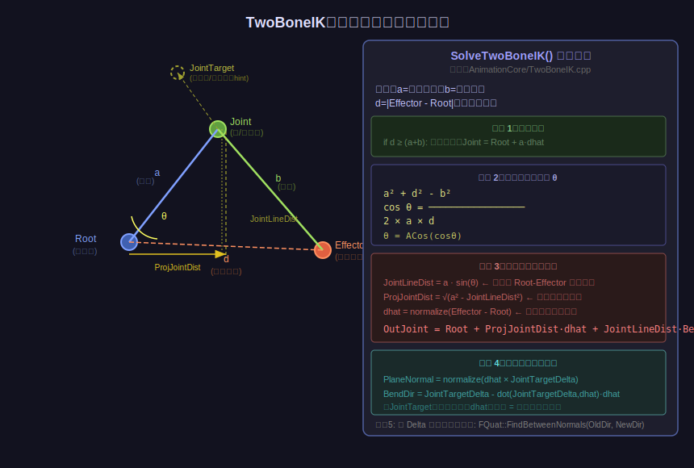

**源文件**：`Source/Runtime/AnimationCore/Private/TwoBoneIK.cpp`

适用场景：手臂、腿部（上臂-小臂-手腕，大腿-小腿-脚踝）。

#### 5.2.1 问题定义

给定：
- $P_r$：根骨骼位置（肩膀）
- $P_j$：关节位置（肘部，未知）
- $P_e$：效果器目标位置（手腕应该到哪里）
- $a$：上臂长度
- $b$：小臂长度
- JointTarget：控制肘部朝向的辅助点

求：$P_j$ 的精确位置。

#### 5.2.2 余弦定理推导

设目标距离 $d = |P_e - P_r|$，考虑三角形 $\{P_r, P_j, P_e\}$：

$$\cos\theta = \frac{a^2 + d^2 - b^2}{2ad}$$

其中 $\theta$ 是上臂 $a$ 与根-效果器方向之间的夹角。

$$\theta = \arccos\left(\frac{a^2 + d^2 - b^2}{2ad}\right)$$

关节位置分解：

$$\text{JointLineDist} = a \sin\theta \quad \text{（关节到 Root-Effector 连线的垂直距离）}$$

$$\text{ProjJointDist} = \sqrt{a^2 - \text{JointLineDist}^2} \quad \text{（沿 Root-Effector 方向的分量）}$$

$$\hat{d} = \frac{P_e - P_r}{|P_e - P_r|} \quad \text{（目标方向单位向量）}$$

$$P_j = P_r + \text{ProjJointDist} \cdot \hat{d} + \text{JointLineDist} \cdot \hat{n}_{\text{bend}}$$

其中 $\hat{n}_{\text{bend}}$ 是弯曲方向（JointTarget 在垂直于 $\hat{d}$ 平面上的投影方向）：

$$\hat{n}_{\text{bend}} = \text{normalize}\left(P_{\text{JointTarget}} - P_r - \langle P_{\text{JointTarget}} - P_r, \hat{d} \rangle \hat{d}\right)$$

#### 5.2.3 关节旋转更新

求得新的 $P_j$ 后，计算各骨骼的旋转增量：

```cpp
// 对根骨骼（上臂）：
FVector OldUpperDir = normalize(OldJointPos - RootPos);
FVector NewUpperDir = normalize(OutJointPos - RootPos);
FQuat DeltaRot_Root = FQuat::FindBetweenNormals(OldUpperDir, NewUpperDir);
OutBoneTransforms[RootBoneIndex].SetRotation(DeltaRot_Root * RootBone.GetRotation());

// 对关节骨骼（小臂）：
FVector OldLowerDir = normalize(OldEndPos - OldJointPos);
FVector NewLowerDir = normalize(EffectorPos - OutJointPos);
FQuat DeltaRot_Joint = FQuat::FindBetweenNormals(OldLowerDir, NewLowerDir);
OutBoneTransforms[JointBoneIndex].SetRotation(DeltaRot_Joint * JointBone.GetRotation());
```

#### 5.2.4 伸展（Stretching）

当 $d \geq a + b$（目标超出手臂最大伸展距离）时，开启可选的拉伸：

```cpp
if (bAllowStretching && d > MaxLimbLength)
{
    float Scale = FMath::Lerp(1.f, d / MaxLimbLength,
                              FMath::Max(0.f, d - MaxLimbLength * StartStretchRatio)
                              / (MaxLimbLength * (MaxStretchScale - 1)));
    // 等比例缩放上臂和小臂
    a *= Scale;
    b *= Scale;
}
```

### 5.3 CCDIK：循环坐标下降

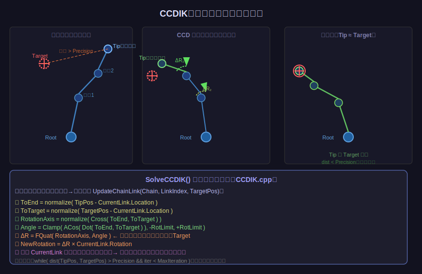

**源文件**：`Source/Runtime/AnimationCore/Private/CCDIK.cpp`

适用场景：任意长度链条（脊椎、尾巴、手指），链节数量不受限。

#### 5.3.1 算法思想

CCD（Cyclic Coordinate Descent）的核心思想：**每次只优化一个关节角，使末端尽量靠近目标**。反复从末端向根循环，直到收敛。

这是一种**坐标下降法**（Coordinate Descent）：每步最小化一个变量，固定其他变量。

#### 5.3.2 单次迭代数学

对链条中第 $k$ 个关节（从末端向根方向遍历）：

$$\vec{v}_{\text{end}} = \text{normalize}(P_{\text{tip}} - P_k) \quad \text{（当前末端方向）}$$

$$\vec{v}_{\text{target}} = \text{normalize}(P_{\text{target}} - P_k) \quad \text{（目标方向）}$$

旋转轴：

$$\hat{n} = \text{normalize}(\vec{v}_{\text{end}} \times \vec{v}_{\text{target}})$$

旋转角（带旋转限制）：

$$\alpha = \text{Clamp}\left(\arccos(\vec{v}_{\text{end}} \cdot \vec{v}_{\text{target}}), -\text{RotLimit}_k, +\text{RotLimit}_k\right)$$

增量四元数：

$$\Delta R_k = \text{FQuat}(\hat{n}, \alpha)$$

更新关节旋转：

$$R_k^{\text{new}} = \Delta R_k \cdot R_k^{\text{old}}$$

然后**向下传播**（Forward Kinematics）：更新 $k$ 之后所有子骨骼的世界坐标，然后对下一个关节重复。

#### 5.3.3 外层迭代控制

```cpp
// CCDIK.cpp：SolveCCDIK 外层循环
int32 IterationCount = 0;
while (FVector::Dist(TipPos, TargetPos) > Precision && IterationCount < MaxIteration)
{
    // bStartFromTail=true: 从末端链节向根遍历（更快收敛）
    for (int32 LinkIndex = (bStartFromTail ? Chain.Num()-2 : 1);
         bStartFromTail ? (LinkIndex >= 0) : (LinkIndex < Chain.Num()-1);
         bStartFromTail ? --LinkIndex : ++LinkIndex)
    {
        UpdateChainLink(Chain, LinkIndex, TargetPos, bEnableRotationLimit,
                        RotationLimitPerJoints);
        // UpdateChainLink 内部执行上述单次迭代数学
    }
    ++IterationCount;
}
```

**收敛条件**：末端骨骼与目标距离 $< \text{Precision}$，或达到 `MaxIteration`。

**典型参数**：Precision=0.1（cm），MaxIteration=10-20。

### 5.4 Jacobian Transpose：从多变量视角理解 IK

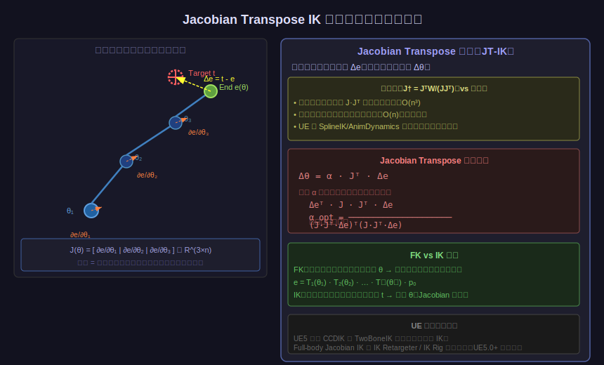

虽然 UE 5.4 中的主流运行时 IK（TwoBoneIK, CCDIK）不直接使用 Jacobian，但理解 Jacobian 是理解 IK 的数学本质的关键，也是 UE5 IK Rig 系统的理论基础。

#### 5.4.1 问题形式化

设关节角向量 $\boldsymbol{\theta} = [\theta_1, \theta_2, \ldots, \theta_n]^T \in \mathbb{R}^n$。

末端位置是关节角的函数：

$$\mathbf{e}(\boldsymbol{\theta}) = \text{FK}(\boldsymbol{\theta}) \in \mathbb{R}^3$$

IK 目标：找 $\boldsymbol{\theta}^*$ 使 $\mathbf{e}(\boldsymbol{\theta}^*) = \mathbf{t}$（目标位置）。

#### 5.4.2 Jacobian 矩阵定义

雅可比矩阵 $J$ 描述末端位置对关节角的一阶偏导：

$$J(\boldsymbol{\theta}) = \frac{\partial \mathbf{e}}{\partial \boldsymbol{\theta}} = 
\begin{bmatrix}
\frac{\partial e_x}{\partial \theta_1} & \frac{\partial e_x}{\partial \theta_2} & \cdots & \frac{\partial e_x}{\partial \theta_n} \\
\frac{\partial e_y}{\partial \theta_1} & \frac{\partial e_y}{\partial \theta_2} & \cdots & \frac{\partial e_y}{\partial \theta_n} \\
\frac{\partial e_z}{\partial \theta_1} & \frac{\partial e_z}{\partial \theta_2} & \cdots & \frac{\partial e_z}{\partial \theta_n}
\end{bmatrix} \in \mathbb{R}^{3 \times n}$$

**第 $k$ 列的几何意义**：当只有 $\theta_k$ 微小变化 $d\theta_k$ 时，末端位置的变化量：

$$\frac{\partial \mathbf{e}}{\partial \theta_k} = \hat{z}_k \times (\mathbf{e} - P_k)$$

其中 $\hat{z}_k$ 是第 $k$ 个关节的旋转轴，$P_k$ 是第 $k$ 个关节的位置。

#### 5.4.3 线性化近似

$$\Delta \mathbf{e} \approx J(\boldsymbol{\theta}) \cdot \Delta \boldsymbol{\theta}$$

目标：给定误差向量 $\Delta \mathbf{e} = \mathbf{t} - \mathbf{e}$，求 $\Delta \boldsymbol{\theta}$。

#### 5.4.4 Jacobian Transpose 方法

最简单的近似：用 $J^T$ 代替 $J^+$（伪逆），每步更新：

$$\Delta \boldsymbol{\theta} = \alpha \cdot J^T \cdot \Delta \mathbf{e}$$

**为什么 $J^T$ 有效？**  
将 $J^T \Delta \mathbf{e}$ 视为梯度方向：

$$\frac{\partial \|\Delta \mathbf{e}\|^2}{\partial \boldsymbol{\theta}} = -2 J^T \Delta \mathbf{e}$$

即 $J^T \Delta \mathbf{e}$ 是使末端靠近目标的**负梯度方向**的反向（正方向），沿此方向更新关节角即可缩小误差。

**自适应步长**（防止振荡）：

$$\alpha_{\text{opt}} = \frac{(J \Delta \boldsymbol{\theta})^T \cdot \Delta \mathbf{e}}{(J \Delta \boldsymbol{\theta})^T \cdot (J \Delta \boldsymbol{\theta})} = \frac{\|\Delta \mathbf{e}\|_J^2}{\|J J^T \Delta \mathbf{e}\|^2}$$

#### 5.4.5 CCD 与 Jacobian 的关系

CCDIK 可以看作是 Jacobian 方法的一个特例：

- 每次只处理一个关节 $k$，等效于 $n=1$ 的 Jacobian 子问题
- $\Delta \theta_k$ 最优解（最小二乘）恰好就是将末端旋转至目标方向所需的角度
- 因此 CCD 每步都是"局部最优解"，但全局收敛性依赖循环迭代

TwoBoneIK 则是 **$n=2$ 关节的解析解**（Closed-Form Solution），比迭代法更快，精度更高。

---

## 6. BlueprintThreadSafeUpdateAnimation 详解

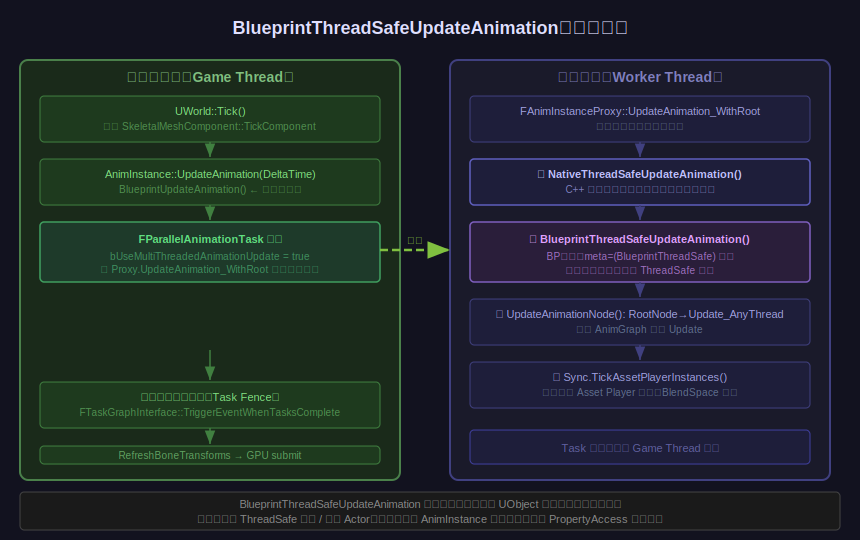

### 6.1 为什么需要线程安全更新？

动画系统是 UE 性能瓶颈之一。对于同屏大量角色，若全在游戏主线程更新动画，会造成严重卡顿。

解决方案：`bUseMultiThreadedAnimationUpdate = true`（默认开启），将**整个动画 Update 阶段**移到工作线程并行执行。

### 6.2 哪些函数在哪个线程执行？

| 函数 | 线程 | 说明 |
|------|------|------|
| `BlueprintUpdateAnimation` | 游戏主线程 | 传统更新函数，可访问任何 UObject |
| `NativeUpdateAnimation` | 游戏主线程（多线程时） | 注：多线程启用时实际在工作线程调用，见下 |
| `BlueprintThreadSafeUpdateAnimation` | 工作线程 | 编译器强制线程安全检查 |
| `NativeThreadSafeUpdateAnimation` | 工作线程 | C++ override，须自行保证线程安全 |

**重要纠正**：查看源码 `AnimInstanceProxy.cpp` 第 1228 行，`NativeUpdateAnimation`（通过 `Update()` 间接调用）和 `BlueprintThreadSafeUpdateAnimation` **都在** `UpdateAnimation_WithRoot` 内被调用，而该整体函数在工作线程执行。

实际上，当多线程启用时：
- `BlueprintUpdateAnimation` 在主线程 `AnimInstance::UpdateAnimation` 内调用（早于工作线程派发）
- `NativeThreadSafeUpdateAnimation` + `BlueprintThreadSafeUpdateAnimation` 在工作线程 `UpdateAnimation_WithRoot` 内调用

### 6.3 BlueprintThreadSafe 的编译器保证

**声明位置**：`Source/Runtime/Engine/Classes/Animation/AnimInstance.h`

```cpp
// 函数声明带有 BlueprintThreadSafe 元标记
UFUNCTION(BlueprintCallable, meta=(BlueprintThreadSafe), Category="Animation")
void BlueprintThreadSafeUpdateAnimation(float DeltaTimeX);
```

UE Blueprint 编译器（`FKismetCompilerContext`）在编译 AnimBlueprint 时：
1. 检测调用链中所有函数
2. 若从 `BlueprintThreadSafeUpdateAnimation` 中调用任何**未标记 `BlueprintThreadSafe`** 的函数，**编译报错**

这是**静态检查**（编译期），不是运行时锁。

### 6.4 正确使用方式

```cpp
// ✅ 正确：BlueprintThreadSafeUpdateAnimation 中安全的操作
void UMyAnimInstance::NativeThreadSafeUpdateAnimation(float DeltaSeconds)
{
    // 1. 读写 AnimInstance 自身的成员变量（已设计为线程安全）
    Speed = GetOwningComponent()->GetVelocity().Size();  // ❌ 错误！GetOwningComponent 访问 UObject
    
    // 2. 正确做法：使用 PropertyAccess 系统（UE5.0+）
    // 在 AnimBP 编辑器中用 "Property Access" 节点绑定 Character.Velocity
    // UE 编译器自动在主线程 pre-fetch 数据，在工作线程只读取缓存值
}
```

**Blueprint 中的 PropertyAccess 节点**：

```
【主线程 pre-fetch 阶段】
    访问 Character.Velocity → 缓存到 AnimInstance 的 CachedVelocity 变量

【工作线程 ThreadSafeUpdate 阶段】  
    读取 CachedVelocity → 安全使用
```

### 6.5 `bUseMultiThreadedAnimationUpdate` 的实际影响

```
多线程动画开启时：
┌─────────────────────────────────────────────────────────────┐
│ Game Thread                 Worker Thread                    │
│ ─────────────               ─────────────                   │
│ Tick()                      UpdateAnimation_WithRoot()        │
│ └── BlueprintUpdateAnim     ├── NativeThreadSafeUpdateAnim   │
│                             ├── BPThreadSafeUpdateAnim       │
│                             ├── UpdateAnimGraph (All Nodes)  │
│                             └── TickAssetPlayerInstances     │
│                                                              │
│ Wait(TaskFence)             [Task Complete]                  │
│ └── RefreshBoneTransforms                                    │
│ └── GPU Submit                                              │
└─────────────────────────────────────────────────────────────┘
```

单个角色动画 Update 从 ~1ms 降至可与其他 4 个角色并行，性能提升显著。

---

## 7. UE 动画性能优化

### 7.1 `FA2CSPose` 懒加载（Lazy Evaluation）

```cpp
// 组件空间骨骼变换不全量计算，而是按需计算
// ComponentSpaceFlags[i] = 0 表示未计算
// GetComponentSpaceTransform(i) 递归向上，直到遇到已计算的父骨骼

// 好处：IK 节点通常只操作少数骨骼，不触发完整骨骼链计算
// 节省：N 骨骼角色，若 IK 只用到 3 根骨骼，则只计算 3 根的 CS 变换
```

### 7.2 `BoneContainer` 骨骼过滤（RequiredBones）

```cpp
// FBoneContainer 记录当前帧需要计算的骨骼列表
// 不在摄像机视野内的角色可降级为更少的骨骼数量
// AnimLOD：SkeletalMesh LOD 系统会降低远距离角色的骨骼数量
// 结果：FCompactPose 的骨骼数量 << 完整骨架骨骼数量
```

### 7.3 动画 LOD 系统

| 设置 | 效果 |
|------|------|
| `UpdateRateOptimizations` | 对远处角色降低 UpdateRate（每 2-4 帧才更新一次动画） |
| `AnimLOD` | 对 LOD2+ 角色禁用 IK 节点、粒子通知等 |
| `bEnableUpdateRateOptimizations` | 开启动画更新频率优化 |
| `MaxDistanceFactor` | 超过此距离完全冻结动画更新 |

### 7.4 Animation Sharing（动画共享）插件

对大量相同角色（如 NPC 群体），可让多个角色共享同一个 `UAnimInstance` 的计算结果：

```
AnimSharing Plugin：
  Leader 角色：正常执行动画 Update + Evaluate
  Follower 角色：每帧直接复制 Leader 的 BoneSpaceTransforms
  性能：100 个 NPC 的动画开销 ≈ 少数几个 Leader 的开销
```

### 7.5 `CacheBones` 阶段

每当骨架发生变化（LOD 切换、Attach/Detach），通过 `CacheBones_AnyThread` 通知所有节点重新构建内部缓存（节点可能缓存了骨骼索引映射），避免每帧重新查找。

### 7.6 `bSkipFirstUpdateTransition`

`FAnimNode_StateMachine` 的 `bSkipFirstUpdateTransition = true`：当状态机首次激活（或重新激活）时，跳过混合直接跳转到目标状态，避免第一帧的突变混合。

### 7.7 `SaveCachedPose` 节点

当同一个 Pose 在动画图中被多个分支引用时，使用 `FAnimNode_SaveCachedPose` 缓存计算结果：

```
[StateMachine] ─┬─> [UpperBody Layer] ─┐
                │                       ├─> [Final Blend] → Output
                └─> [LowerBody Layer] ─┘
```

如果上图中 `StateMachine` 的 Pose 同时被 Upper 和 Lower 层引用，`SaveCachedPose` 确保只计算一次。

---

## 八、StrideWarping —— 步幅匹配原理与数学推导

> **源文件**：`Plugins/Animation/AnimationWarping/Source/Runtime/Private/BoneControllers/AnimNode_StrideWarping.cpp`  
> **头文件**：`Plugins/Animation/AnimationWarping/Source/Runtime/Public/BoneControllers/AnimNode_StrideWarping.h`

### 8.1 为什么需要 StrideWarping？

角色动画资产中烘焙了特定速度下的步幅（脚步跨度）。当游戏运行时的实际移动速度与动画速度不匹配时：

- **速度 > 动画速度**：腿部步幅不够大，脚像在"滑步"。  
- **速度 < 动画速度**：腿部步幅过大，步子迈得比角色实际移动的还远，也会滑步。

StrideWarping 的解决思路：**在运行时动态拉伸 / 收缩 IK 脚骨的位置**，使得脚步跨度与实际速度匹配，彻底消除滑步。

### 8.2 总体流程

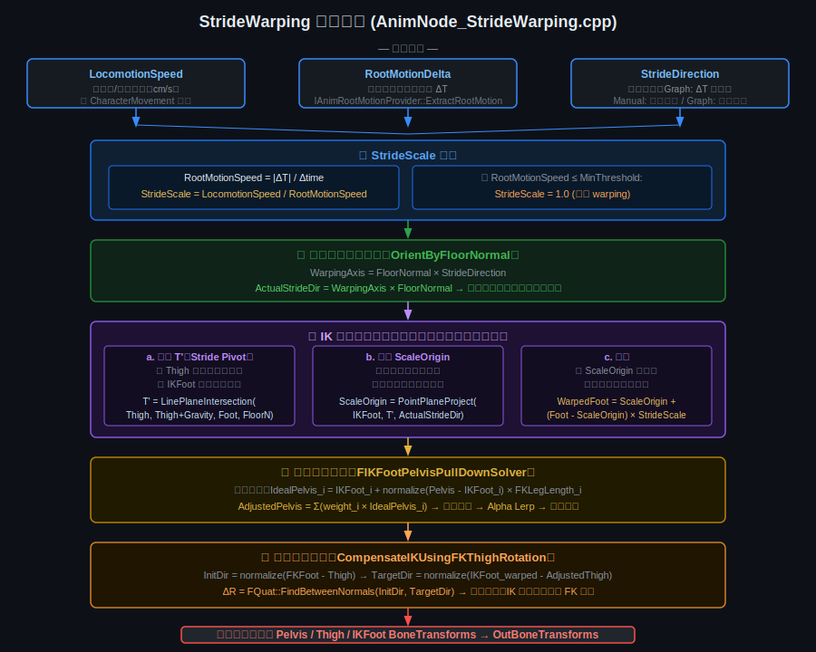

整个算法分为五个阶段，每帧执行一次，入口函数为：

```cpp
// AnimNode_StrideWarping.cpp — EvaluateSkeletalControl_AnyThread()
void FAnimNode_StrideWarping::EvaluateSkeletalControl_AnyThread(
    FComponentSpacePoseContext& Output,
    TArray<FBoneTransform>& OutBoneTransforms)
```

### 8.3 输入参数详解

| 参数 | 类型 | 含义 |
|------|------|------|
| `LocomotionSpeed` | `float` | 胶囊体 / 物理的实际移动速度（cm/s），由 `CharacterMovementComponent` 提供 |
| `RootMotionDelta` | `FTransform` | 动画子图本帧根骨骼的位移量 `ΔT`，由 `IAnimRootMotionProvider` 提供 |
| `StrideDirection` | `FVector` | 步幅朝向。Graph 模式：自动从 `RootMotionDelta` 提取；Manual 模式：用户手动指定 |
| `FloorNormalDirection` | `FWarpingVectorValue` | 地面法线（默认世界 +Z），用于修正步幅方向 |
| `GravityDirection` | `FWarpingVectorValue` | 重力方向（默认世界 -Z），用于计算大腿投影点 |
| `PelvisBone` | `FBoneReference` | 骨盆骨骼 |
| `FootDefinitions` | `TArray<FStrideWarpingFootDefinition>` | 每条腿：IK 脚骨、FK 脚骨、大腿骨 |

### 8.4 第一步：StrideScale 计算

**StrideScale** 是步幅缩放因子，表示"应该比动画步幅大/小多少倍"。

**Graph 模式**（推荐，自动计算）：

```cpp
// 从动画子图提取本帧根骨骼位移
RootMotionProvider->ExtractRootMotion(Output.CustomAttributes, RootMotionTransformDelta);

// 计算动画的等效速度（单位时间内根骨骼移动距离）
CachedRootMotionDeltaSpeed = CachedRootMotionDeltaTranslation.Size() / CachedDeltaTime;

// 核心公式
ActualStrideScale = LocomotionSpeed / CachedRootMotionDeltaSpeed;
```

数学表达：

$$\text{StrideScale} = \frac{V_{\text{locomotion}}}{V_{\text{rootmotion}}} = \frac{V_{\text{locomotion}}}{|\Delta T| / \Delta t}$$

- $V_{\text{locomotion}}$：胶囊体每秒移动距离（物理驱动）
- $|\Delta T|$：动画根骨骼本帧位移的模长
- $\Delta t$：本帧 DeltaTime

**直觉**：若动画每秒走 200cm，但实际速度是 300cm/s，则 `StrideScale = 1.5`，脚步需要拉伸 1.5 倍才能匹配。

**Guard 条件**（防止原地/极慢动画时的错误缩放）：

```cpp
if (CachedRootMotionDeltaSpeed <= MinRootMotionSpeedThreshold)
    ActualStrideScale = 1.0f;  // 速度过低时不做 warping
```

最后，缩放值经过 `StrideScaleModifier`（`FInputClampConstants`）做可选的 Clamp 和弹簧插值平滑。

### 8.5 第二步：步幅方向地面修正

步幅方向 `ActualStrideDir` 必须平行于地面，否则脚会被拉到地面以上/以下。修正公式：

```cpp
const FVector StrideWarpingAxis = ResolvedFloorNormal ^ ActualStrideDirection;  // 叉积
ActualStrideDirection = StrideWarpingAxis ^ ResolvedFloorNormal;                // 再叉积
```

这是"将向量投影到平面"的正交分解技巧：

$$\hat{d}_{\text{floor}} = (\hat{n} \times \hat{d}) \times \hat{n}$$

其中 $\hat{n}$ 为地面法线，$\hat{d}$ 为原步幅方向。结果是去掉了 $\hat{d}$ 中垂直地面的分量，使其严格平行地面。

### 8.6 第三步：IK 脚部位置缩放（核心数学）

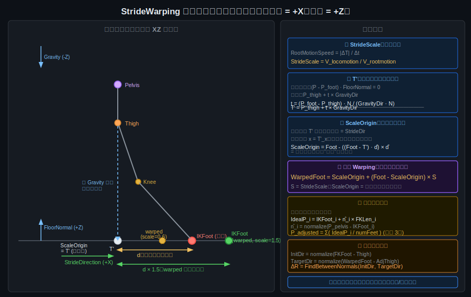

这是 StrideWarping 最核心的部分，对每条腿的 IK 脚骨独立执行：

```cpp
for (auto& Foot : FootData)
{
    const FVector IKFootLocation  = Foot.IKFootBoneTransform.GetLocation();
    const FVector ThighBoneLocation = Output.Pose.GetComponentSpaceTransform(Foot.ThighBoneIndex).GetLocation();

    // Step A: 计算 StrideWarpingPlaneOrigin (T')
    const FVector StrideWarpingPlaneOrigin = FMath::LinePlaneIntersection(
        ThighBoneLocation,
        ThighBoneLocation + ResolvedGravityDirection,
        IKFootLocation,
        ResolvedFloorNormal);

    // Step B: 计算 ScaleOrigin
    const FVector ScaleOrigin = FVector::PointPlaneProject(
        IKFootLocation, StrideWarpingPlaneOrigin, ActualStrideDirection);

    // Step C: 缩放
    const FVector WarpedLocation = ScaleOrigin + (IKFootLocation - ScaleOrigin) * ActualStrideScale;
    Foot.IKFootBoneTransform.SetLocation(WarpedLocation);
}
```

#### 8.6.1 第 A 步：计算 T'（StrideWarpingPlaneOrigin）

**几何含义**：沿重力方向将大腿骨（Thigh）投影到脚所在的地板平面，得到点 $T'$。$T'$ 是"大腿在地板上的正投影"，也是步幅的自然枢轴（pivot）。

**数学推导**：

地板平面定义（以脚的位置为参考点，法线为 $\hat{n}$）：
$$\{P \mid (P - P_{\text{foot}}) \cdot \hat{n} = 0\}$$

大腿沿重力方向的射线：
$$P(t) = P_{\text{thigh}} + t \cdot \hat{g}$$

代入平面方程求 $t$：
$$(P_{\text{thigh}} + t\hat{g} - P_{\text{foot}}) \cdot \hat{n} = 0$$
$$t = \frac{(P_{\text{foot}} - P_{\text{thigh}}) \cdot \hat{n}}{\hat{g} \cdot \hat{n}}$$

最终：
$$T' = P_{\text{thigh}} + \frac{(P_{\text{foot}} - P_{\text{thigh}}) \cdot \hat{n}}{\hat{g} \cdot \hat{n}} \cdot \hat{g}$$

> **特殊情况**（重力与地板平行时，`|g·n| ≤ DELTA`）：源码直接将 $T'$ 取为 $P_{\text{foot}}$，退化为以脚本身为枢轴。

**直觉**：在水平地面、竖直重力的常见情况下，$T'$ 就是大腿正下方地面上的那个点，即 $T' = (P_{\text{thigh}}.x,\ P_{\text{thigh}}.y,\ P_{\text{foot}}.z)$。

#### 8.6.2 第 B 步：计算 ScaleOrigin

**几何含义**：将脚的位置投影到"以 $T'$ 为原点、以步幅方向 $\hat{d}$ 为法线的平面"上。即去掉脚在步幅方向上的位移分量，得到缩放时的基点。

`FVector::PointPlaneProject(V, Origin, Normal)` 的数学定义：

$$\text{ScaleOrigin} = P_{\text{foot}} - \bigl[(P_{\text{foot}} - T') \cdot \hat{d}\bigr] \cdot \hat{d}$$

展开理解：$(P_{\text{foot}} - T') \cdot \hat{d}$ 是脚相对于 $T'$ 在步幅方向上的投影长度（即原始步幅偏移量 $d$）。

减去这个向量分量后，ScaleOrigin 的步幅方向坐标与 $T'$ 相同，只保留了侧向（Y）和高度（Z）分量：

$$\text{ScaleOrigin} = T' + [(P_{\text{foot}} - T') - d \cdot \hat{d}]$$

在简化的 XZ 侧视图中（$\hat{d} = +X$，脚在地面 $Z=0$）：
$$\text{ScaleOrigin} = (T'_x,\; P_{\text{foot}}.y,\; P_{\text{foot}}.z)$$

#### 8.6.3 第 C 步：缩放

核心公式：

$$\boxed{P_{\text{warped}} = \text{ScaleOrigin} + (P_{\text{foot}} - \text{ScaleOrigin}) \times S}$$

其中 $S = \text{StrideScale}$，$P_{\text{foot}} - \text{ScaleOrigin} = d \cdot \hat{d}$（步幅偏移向量）。

展开：

$$P_{\text{warped}} = \text{ScaleOrigin} + d \cdot S \cdot \hat{d}$$

**结论**：

- **仅步幅方向（X）被缩放**，脚的侧向（Y）和高度（Z）保持不变。
- 缩放的枢轴是 $T'$（大腿正下方地面点），而非脚骨本身。
- $S > 1$：步幅变大（脚往前迈得更远）；$S < 1$：步幅缩短；$S = 1$：无变化。

### 8.7 第四步：骨盆下拉修正

脚被拉伸后腿变长，骨盆可能需要略微下降，否则腿会过度拉伸（超出最大 FK 腿长）。

**源文件**：`Runtime/AnimGraphRuntime/Private/BoneControllers/BoneControllerSolvers.cpp`

```cpp
// 迭代求理想骨盆位置
for (int32 Iter = 0; Iter < PelvisAdjustmentMaxIter; ++Iter)
{
    AdjustedPelvisLocation = FVector::ZeroVector;
    for (int32 Index = 0; Index < IKFootLocationsCount; ++Index)
    {
        // 理想骨盆 = 沿（骨盆→IK脚）方向，距离 = FK 腿长
        const FVector IdealLocation = IKFootLocations[Index]
            + (PreAdjustmentLocation - IKFootLocations[Index]).GetSafeNormal()
            * FKFootDistancesToPelvis[Index];
        AdjustedPelvisLocation += IdealLocation * PerFootWeight;
    }
    // 判断收敛...
}
```

**迭代公式**（每次迭代，每条腿贡献均等权重 $w = 1/N$）：

$$P_{\text{pelvis}}^{(k+1)} = \sum_{i=1}^{N} w \cdot \left( P_{\text{IKFoot}_i} + \hat{n}_i \cdot L_{\text{FK}_i} \right)$$

其中：
- $\hat{n}_i = \text{normalize}(P_{\text{pelvis}}^{(k)} - P_{\text{IKFoot}_i})$：骨盆到 IK 脚的方向
- $L_{\text{FK}_i}$：第 $i$ 条腿原始 FK 脚骨到骨盆的距离（腿最大伸展长）

**收敛判断**：若相邻两次迭代调整量之差 $\leq$ `PelvisAdjustmentErrorTolerance`（默认 1cm），提前退出。

**后处理**：调整量通过 `FVectorRK4SpringInterpolator` 做弹簧插值（时间平滑），再与 `PelvisAdjustmentInterpAlpha` 做 Lerp（保留部分原始骨盆动态），最后 Clamp 到 `PelvisAdjustmentMaxDistance` 防止过大偏移。

### 8.8 第五步：大腿旋转补偿

骨盆下移后，需要旋转大腿使 IK 脚目标仍然可达，并保持腿的整体形状。

```cpp
const FVector InitialDir = (FKFootTransform.GetLocation() - ThighTransform.GetLocation()).GetSafeNormal();
const FVector TargetDir  = (Foot.IKFootBoneTransform.GetLocation() - AdjustedThighTransform.GetLocation()).GetSafeNormal();
const FQuat DeltaRotation = FQuat::FindBetweenNormals(InitialDir, TargetDir);
AdjustedThighTransform.SetRotation(DeltaRotation * AdjustedThighTransform.GetRotation());
```

公式：

$$\Delta R = \text{FQuat}(\hat{n},\ \theta)$$

$$\hat{n} = \frac{\hat{d}_{\text{init}} \times \hat{d}_{\text{target}}}{|\hat{d}_{\text{init}} \times \hat{d}_{\text{target}}|}, \quad \theta = \arccos(\hat{d}_{\text{init}} \cdot \hat{d}_{\text{target}})$$

与 CCDIK 中的增量旋转原理完全相同（参见第五节）。

**IK 脚过伸检测**（`bClampIKUsingFKLimits`）：

```cpp
const float FKLength = FVector::Dist(FKFootTransform.GetLocation(), ThighTransform.GetLocation());
const float IKLength = FVector::Dist(Foot.IKFootBoneTransform.GetLocation(), AdjustedThighTransform.GetLocation());
if (IKLength > FKLength)
{
    Foot.IKFootBoneTransform.SetLocation(
        AdjustedThighTransform.GetLocation() + TargetDir * FKLength);
}
```

若 warped 后的 IK 腿长超过原始 FK 腿长，将脚位置 Clamp 回 FK 腿长范围内，防止腿完全拉直时出现视觉异常。

### 8.9 骨骼数据流总结

```
输入：ComponentSpacePose（IK/FK/Thigh 原始位姿）
        ↓
① 提取 RootMotionDelta → 计算 StrideScale、ActualStrideDir
        ↓
② 每条腿：计算 T' → ScaleOrigin → WarpedIKFoot（IK 脚 CS 位置修改）
        ↓
③ PelvisIKFootSolver：迭代求 AdjustedPelvis（骨盆 CS 位置修改）
        ↓
④ 每条腿：旋转 AdjustedThigh（大腿 CS 旋转修改）+ IK 脚过伸 Clamp
        ↓
输出：OutBoneTransforms = [Pelvis, Thigh×N, IKFoot×N]（排序后写回）
```

`OutBoneTransforms` 按 `FCompareBoneTransformIndex` 排序后，由 `FAnimNode_SkeletalControlBase` 的基类逻辑写回骨架 ComponentSpace 变换缓冲区，供后续 IK Solver 或渲染使用。

---

## 九、程序化动画（Procedural Animation）

### 9.1 什么是程序化动画

**程序化动画**是指在运行时通过算法实时计算骨骼变换，而非回放预先录制的关键帧数据。它允许角色动态响应任意地形、物体和游戏状态，是高质量 AAA 游戏动画的核心技术之一。

| 维度 | 关键帧动画 | 物理模拟 | 程序化动画 |
|------|-----------|---------|-----------|
| 数据来源 | 美术预制资产 | 物理引擎自动算 | 算法 + 环境感知 |
| 适应性 | 固定，无法适应地形 | 完全随机，无法控制 | 可控且自适应 |
| 性能 | 采样开销低 | 解算开销高 | 中等，可优化 |
| 典型用途 | 通用动作表演 | 布料/毛发/破碎 | 脚步/脊柱/IK 修正 |

**核心思想**：以 FK 动画 Pose 为基础，用 IK 算法 + 场景查询 + 弹簧插值在运行时修正骨骼变换，使角色对环境产生自然响应。

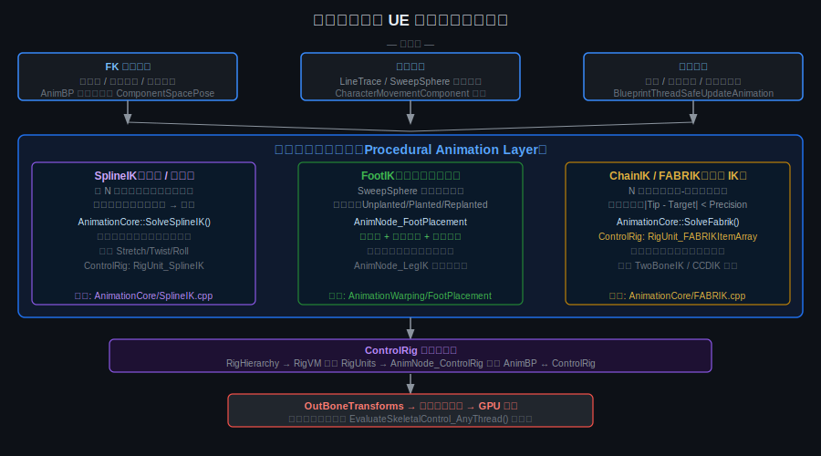

---

### 9.2 程序化动画与 IK 的关系

IK（逆向运动学）是程序化动画的核心原语：

```
程序化动画 = IK 算法 + 场景感知（RayTrace）+ 状态机 + 弹簧插值
```

具体拆解：

- **IK 算法**（FABRIK / TwoBoneIK / SplineIK / CCDIK）：给定末端执行器目标位置，反算关节链中各骨骼旋转
- **场景感知**：`World->SweepSingleByChannel()` / `LineTraceSingle()` 实时查询地形高度、法线方向
- **状态机**：控制哪条腿处于 Planted/Unplanted/Swing 阶段，决定 IK 何时激活
- **弹簧插值**（`FVectorSpringState` / `FQuatSpringState`）：将 IK 修正从"立即跳变"平滑成自然的弹性过渡

UE 动画管线中，所有程序化动画节点都继承 `FAnimNode_SkeletalControlBase`，在 `EvaluateSkeletalControl_AnyThread()` 中接收 FK ComponentSpace Pose，执行修正，输出 `OutBoneTransforms`。

---

### 9.3 ChainIK：FABRIK 算法（正向-反向迭代）

**源码位置**：`Source/Runtime/AnimationCore/Private/FABRIK.cpp`  
**核心函数**：`AnimationCore::SolveFabrik(InOutChain, TargetPosition, MaximumReach, Precision, MaxIterations)`

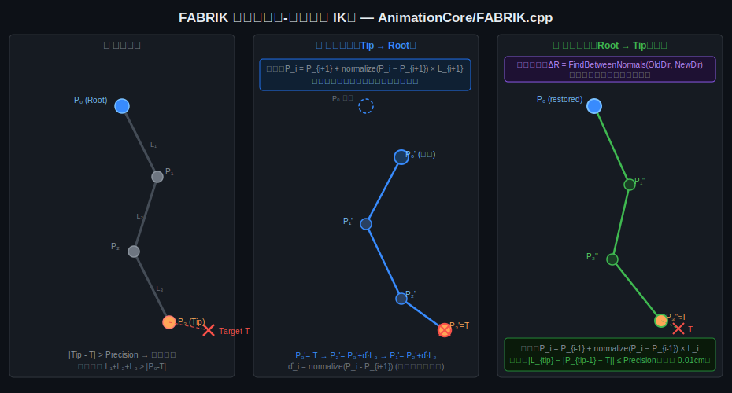

#### 算法流程

**输入**：骨链 `P₀…Pₙ`（P₀ 为根，Pₙ 为末端），链接长度 `L₁…Lₙ`，目标 `T`

**情况 1 — 目标超出最大伸展**：

$$|T - P_0|^2 > \left(\sum_{i=1}^{n} L_i\right)^2$$

将所有骨骼沿 `P₀→T` 方向拉直成一条线，按各段骨长累加放置。

**情况 2 — 目标在可达范围内，迭代求解**：

**前向传递（Forward Pass，Tip → Root）**：

$$P_i = P_{i+1} + \hat{r}_{i,i+1} \cdot L_{i+1}, \quad \hat{r}_{i,i+1} = \frac{P_i - P_{i+1}}{|P_i - P_{i+1}|}$$

从 `i = Tip-1` 倒数至 `i = 1`；先将 Tip 移到目标，再逐步向根部调整，保持每段骨长不变。

**后向传递（Backward Pass，Root → Tip）**：

$$P_i = P_{i-1} + \hat{r}_{i-1,i} \cdot L_i, \quad \hat{r}_{i-1,i} = \frac{P_i - P_{i-1}}{|P_i - P_{i-1}|}$$

从 `i = 1` 到 `i = Tip`；恢复根节点位置，再从根向末端逐步调整。

**收敛条件**：

$$\left| L_{tip} - \text{dist}(P_{tip-1},\ T) \right| < \text{Precision}$$

默认 `Precision = 0.01cm`，最多 `MaxIterations = 10` 次。

**骨骼旋转修正**（`FABRIK.cpp` 迭代后执行）：

$$\Delta R = \text{FQuat}\!\left(\hat{u} \times \hat{v},\ \arccos(\hat{u} \cdot \hat{v})\right), \quad \hat{u} = \text{OldBoneDir},\ \hat{v} = \text{NewBoneDir}$$

```cpp
// FABRIK.cpp 核心循环（简化）
// Forward pass
for (int32 i = TipBoneIndex - 1; i >= 1; --i) {
    FVector Dir = (Chain[i].Position - Chain[i+1].Position).GetSafeNormal();
    Chain[i].Position = Chain[i+1].Position + Dir * Chain[i+1].Length;
}
// Backward pass (root fixed)
Chain[0].Position = RootPosition;
for (int32 i = 1; i <= TipBoneIndex; ++i) {
    FVector Dir = (Chain[i].Position - Chain[i-1].Position).GetSafeNormal();
    Chain[i].Position = Chain[i-1].Position + Dir * Chain[i].Length;
}
```

**ControlRig 对应节点**：`RigUnit_FABRIKItemArray`（`RigUnit_FABRIK.cpp`），内部直接调用 `AnimationCore::SolveFabrik()`，之后用 `FQuat::FindBetweenNormals()` 重新对齐每根骨骼朝向。

**UE 中的 AnimGraph 节点**：`FABRIK` 节点；多关节腿链由 `AnimNode_LegIK` 自动选择 FABRIK 还是 TwoBoneIK（依据 `NumBonesInLimb`）。

---

### 9.4 SplineIK：骨骼链沿样条曲线变形

**源码位置**：`Source/Runtime/AnimationCore/Private/SplineIK.cpp`  
**核心函数**：`AnimationCore::SolveSplineIK(BoneTransforms, PositionSpline, RotationSpline, ScaleSpline, ...)`

将 N 根骨骼沿一条 Catmull-Rom 样条分布，使骨链能弯曲成任意曲线形状（蛇身、脊柱、触手）。

#### 算法步骤

**① 拉伸比率**（控制骨链能否随样条伸缩）：

$$\text{TotalStretchRatio} = \frac{\text{Lerp}(L_{\text{orig}},\ L_{\text{curr}},\ \alpha_{\text{stretch}})}{L_{\text{orig}}}$$

其中 $L_{\text{orig}}$ 为原始样条长度，$L_{\text{curr}}$ 为当前样条长度，$\alpha_{\text{stretch}} \in [0,1]$ 为拉伸程度参数。

**② 球面求交找样条参数**（对第 `i` 根骨骼）：

在样条上找参数 $\alpha_i$，使得：

$$|P(\alpha_i) - P_{\text{prev}}| = L_i \cdot \text{TotalStretchRatio}$$

即在前一骨骼落点为圆心、骨长（含拉伸）为半径的球面与样条的第一个交点。  
实现中用 `FindParamAtFirstSphereIntersection()` 沿样条线性近似步进求解。

**③ 骨骼位置**：

$$\text{BoneTransform}[i].\text{Location} = \text{PositionSpline.Eval}(\alpha_i)$$

**④ 骨骼旋转**：

$$R_i = R_{\text{roll}} \cdot \text{FindBetweenNormals}(\hat{u}_{\text{current}},\ \hat{v}_{\text{new}}) \cdot R_{\text{boneOffset}} \cdot \text{SplineRot.Eval}(\alpha_i)$$

其中 $\hat{v}_{\text{new}}$ 为样条在 $\alpha_i$ 处的切线方向，$\text{FindBetweenNormals}$ 计算从当前骨骼轴到新方向的最短旋转。

**ControlRig 对应节点**：`RigUnit_SplineIK`；`AnimGraph` 节点：`Spline IK`。

---

### 9.5 FootIK：FootPlacement 系统（接触约束 + 弹簧锁定）

**源码位置**：`Plugins/Animation/AnimationWarping/Source/Runtime/Private/BoneControllers/AnimNode_FootPlacement.cpp`  
**头文件**：`AnimNode_FootPlacement.h`

FootPlacement 是比简单 RayHit 偏移更完整的脚步接触系统，解决了普通 FootIK 无法处理的"脚滑""穿插""骨盆抖动"问题。

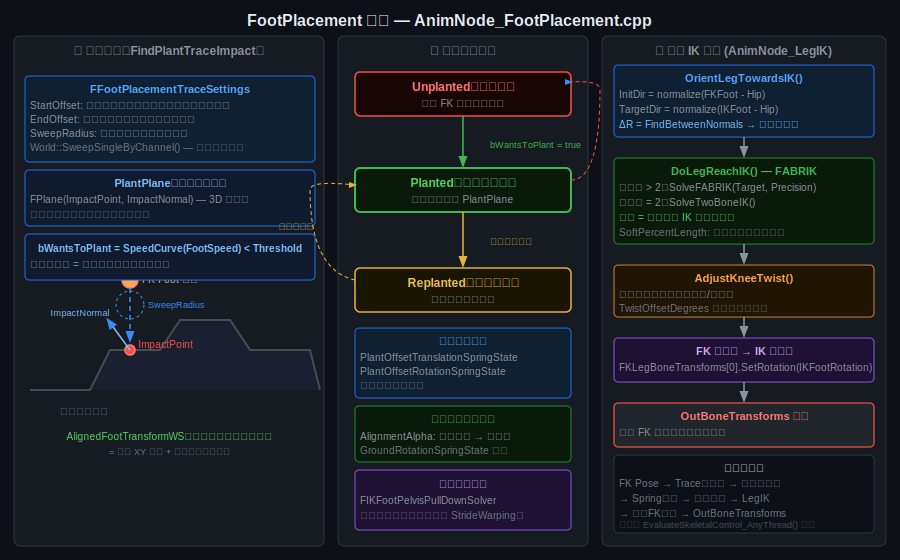

#### 核心数据结构

```cpp
// AnimNode_FootPlacement.h
enum class EPlantType : uint8 {
    Unplanted,   // 摆动相：脚随 FK 动画自由运动
    Planted,     // 支撑相：脚锁定在 PlantPlane 上
    Replanted,   // 重新落点：平滑过渡到新的锁定位置
};

struct FLegRuntimeData {
    // 运动状态
    float      Speed;                  // FK 脚速度（从曲线读取）
    float      LockAlpha;              // 当前锁定混合比
    float      DistanceToPlant;        // 脚到落地目标距离
    bool       bWantsToPlant;          // 是否应当进入 Planted 状态
    // 锁定信息
    FPlane     PlantPlaneWS;           // 锁定地面平面（世界空间）
    FQuat      TwistCorrection;        // 脚踝扭转修正
    // 弹簧状态
    FVectorSpringState PlantOffsetTranslationSpringState;
    FQuatSpringState   PlantOffsetRotationSpringState;
    FFloatSpringState  GroundHeightSpringState;
    FQuatSpringState   GroundRotationSpringState;
};
```

#### 核心流程

**① 场景探测**：`FindPlantTraceImpact()`

```cpp
// AnimNode_FootPlacement.cpp
World->SweepSingleByChannel(
    HitResult,
    TraceStart,     // IK 足位置 + StartOffset（向上偏移）
    TraceEnd,       // IK 足位置 - EndOffset（向下偏移）
    FQuat::Identity,
    ECC_Visibility,
    FCollisionShape::MakeSphere(Settings.SweepRadius)
);
// 若 !HitResult.bBlockingHit：fallback 到 CharacterMovementComponent 地面
```

**② 步态相位判断**：

```cpp
bWantsToPlant = (FootSpeedCurve.Eval(NormalizedTime) < PlantSpeedThreshold);
// 脚速曲线低点 = 支撑相 = 脚应当贴地锁定
```

**③ 状态机转换**：

```
Unplanted ──(bWantsToPlant=true)──► Planted
Planted   ──(锁定点不可达)──────► Replanted
Replanted ──(新落点确认)──────► Planted
Planted/Replanted ─(bWantsToPlant=false)─► Unplanted
```

**④ 弹簧平滑**：所有从旧位置到新锁定位置的过渡均通过 `FVectorSpringState` / `FQuatSpringState` 平滑，防止位置/旋转跳变。

**⑤ 骨盆补偿**：与 StrideWarping 相同的 `FIKFootPelvisPullDownSolver`，迭代下移骨盆使所有腿的 IK 目标在可伸展范围内。

**⑥ 腿部 IK**（`AnimNode_LegIK`）：

```cpp
// AnimNode_LegIK.cpp — EvaluateSkeletalControl_AnyThread
OrientLegTowardsIK();  // FQuat::FindBetweenNormals(FKDir, IKDir) 旋转整条腿
DoLegReachIK();        // SolveFABRIK() 或 SolveTwoBoneIK()
AdjustKneeTwist();     // 修正膝关节朝向
// 最终：FK 脚旋转替换为 IK 脚旋转
FKLegBoneTransforms[0].SetRotation(IKFootRotation);
```

---

### 9.6 ControlRig：程序化动画的运行时框架

**源码位置**：`Plugins/Animation/ControlRig/Source/ControlRig/`

ControlRig 是 UE 提供的可视化程序化动画编程框架，本质是一个**对骨骼层级进行操作的节点图虚拟机**。

#### 核心组件

| 组件 | 类 | 职责 |
|------|---|------|
| 骨骼层级 | `URigHierarchy` | 存储所有 Bones / Controls / Nulls / Curves 的变换 |
| 运算单元 | `FRigUnit` | 每个节点操作（IK、Math、Transform 等），有 `Execute()` 方法 |
| 虚拟机 | `URigVM` | 将 RigUnit 节点图编译为字节码，每帧执行 |
| AnimBP 桥接 | `FAnimNode_ControlRigBase` | 在 AnimBP 评估阶段与 ControlRig 双向传输 Pose |

#### AnimBP 到 ControlRig 的集成路径

**源码**：`AnimNode_ControlRigBase.cpp`，关键路径：

```
FAnimNode_ControlRigBase::Evaluate_AnyThread()    // line 386
  ├─ Source.Evaluate(SourcePose)                   // 获取上游 FK Pose
  └─ ExecuteControlRig(SourcePose)                 // line 437+
       ├─ UpdateInput(ControlRig, InOutput)         // FK Pose → RigHierarchy
       ├─ ControlRig->Evaluate_AnyThread()          // line 497 — 执行 RigVM
       │    └─ 按序执行所有 RigUnit（FABRIK/TwoBoneIK/SplineIK…）
       └─ UpdateOutput(ControlRig, InOutput)        // RigHierarchy → AnimBP Pose
```

完整流程：

1. `Source.Evaluate(SourcePose)`：从 AnimBP 上游节点获取 FK Pose（ComponentSpace）
2. `UpdateInput()`：将 FK Pose 骨骼变换写入 `URigHierarchy`（当 `bTransferInputPose` = true）
3. `ControlRig->Evaluate_AnyThread()`：执行 VM，按拓扑顺序运行所有 RigUnit  
4. `UpdateOutput()`：将 `URigHierarchy` 修改后的变换读回 `FPoseContext`，供后续节点使用

如果 `InternalBlendAlpha < 1.0`（部分混合），则对 ControlRig 输出做加性混合：

```cpp
// AnimNode_ControlRigBase.cpp lines 410-425
FAnimationRuntime::ConvertPoseToAdditive(AdditivePose.Pose, SourcePose.Pose);
FAnimationRuntime::AccumulateAdditivePose(BaseAnimPoseData, AdditivePoseData, 
                                          InternalBlendAlpha, AAT_LocalSpaceBase);
```

#### 内置 IK RigUnit 节点

| 节点 | 文件 | 适用场景 |
|------|------|---------|
| `RigUnit_TwoBoneIKSimple` | `Hierarchy/RigUnit_TwoBoneIK.cpp` | 四肢（2 骨节段）标准 IK |
| `RigUnit_FABRIK` / `FABRIKItemArray` | `Hierarchy/RigUnit_FABRIK.cpp` | N 骨链，自由端效应器 |
| `RigUnit_CCDIK` | `Hierarchy/RigUnit_CCDIK.cpp` | 循环坐标下降，适合角度约束多的链 |
| `RigUnit_SpringIK` | `Hierarchy/RigUnit_SpringIK.cpp` | 弹簧阻尼 IK，有惯性感 |
| `RigUnit_MultiFABRIK` | `Hierarchy/RigUnit_MultiFABRIK.cpp` | 多末端效应器 FABRIK |
| `RigUnit_SplineIK` | `Hierarchy/RigUnit_SplineIK.cpp` | 骨链沿样条变形 |

---

### 9.7 实例：6 足蜘蛛程序化爬行（无动画资产）

蜘蛛只有骨架，没有任何动画片段，全部运动由程序实时计算。关键难点：
- 6 条腿必须协调，不能同时全部抬起
- 需要爬墙（地面法线不是 WorldUp）
- 台面完全随机，无法预录关键帧

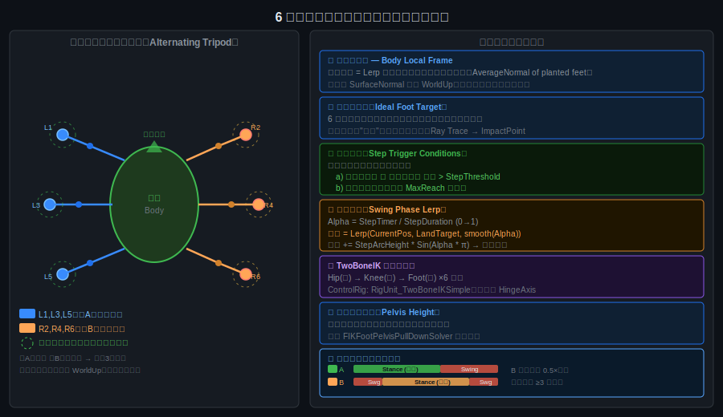

#### 系统设计

**① 身体参考系（Body Local Frame）**

将所有计算移入以地面法线为"Up"的局部坐标系中：

```cpp
// 当前"上方向" = 所有已落地脚法线的加权平均
FVector AvgNormal = FVector::ZeroVector;
for (auto& Leg : PlantedLegs)
    AvgNormal += Leg.SurfaceNormal;
AvgNormal.Normalize();  // 用于替代 WorldUp
// 旋转身体朝向 AvgNormal
FQuat BodyOrientDelta = FQuat::FindBetweenNormals(GetActorUpVector(), AvgNormal);
```

爬墙时此计算天然正确，无需特殊分支。

**② 理想落脚点（Ideal Foot Target）**

6 个固定偏移量在身体局部坐标系中定义每条腿的理想位置：

```cpp
// 例：前左腿
FVector IdealLocal = FVector(-80, -120, 0);  // 身体局部
FVector IdealWorld = BodyTransform.TransformPosition(IdealLocal);
// 沿局部"下方"方向 RayTrace 到地表
FVector TraceDir = -BodyUp;  // 地面法线的反方向
World->LineTraceSingleByChannel(HitResult, IdealWorld + BodyUp * 200,
                                 IdealWorld + TraceDir * 200, ...);
FVector FootTarget = HitResult.ImpactPoint;
```

**③ 步态控制（交替三足）**

- **组 A**：腿 1, 3, 5（左前、左中、左后）
- **组 B**：腿 2, 4, 6（右前、右中、右后）
- 组 A 迈步时组 B 支撑，相位偏移 0.5 × 步态周期
- 任意时刻至少 3 条腿着地，保持静态稳定性

**④ 迈步触发**

```cpp
// 每条腿独立判断
float DistToIdeal = FVector::Dist(CurrentFootPos, IdealFootPos);
bool bShouldStep = (DistToIdeal > StepThreshold)        // 偏离理想位过远
                || (LegStretchRatio > SoftStretchLimit); // 腿链快超出伸展极限
```

**⑤ 迈步动画（摆动弧线）**

```cpp
// 摆动相每帧更新
float Alpha = StepTimer / StepDuration;          // 0 → 1
float SmoothAlpha = FMath::SmoothStep(0, 1, Alpha);
FVector FootPos = FMath::Lerp(LiftPos, LandTarget, SmoothAlpha);
FootPos += BodyUp * (StepArcHeight * FMath::Sin(Alpha * PI)); // 抬脚弧线
```

**⑥ 每条腿 TwoBoneIK**

```
髋关节 (Hip) → 膝关节 (Knee) → 脚踝 (Foot)  × 6 条腿
使用 ControlRig: RigUnit_TwoBoneIKSimple
HingeAxis = 膝关节弯折轴（每条腿不同，需单独配置）
```

**⑦ 身体高度（Pelvis Height）**

迭代调整骨盆在局部"Up"方向上的位置，使所有腿的目标都在 `[MinReach, MaxReach]` 范围内，参考 `FIKFootPelvisPullDownSolver` 的迭代思路。

---

### 9.8 实例：双足角色上楼梯（GDC 2016 Biomechanical Approach）

**参考**：GDC 2016《Fitting the World: A Biomechanical Approach to Foot IK》—— Ubisoft，Assassin's Creed

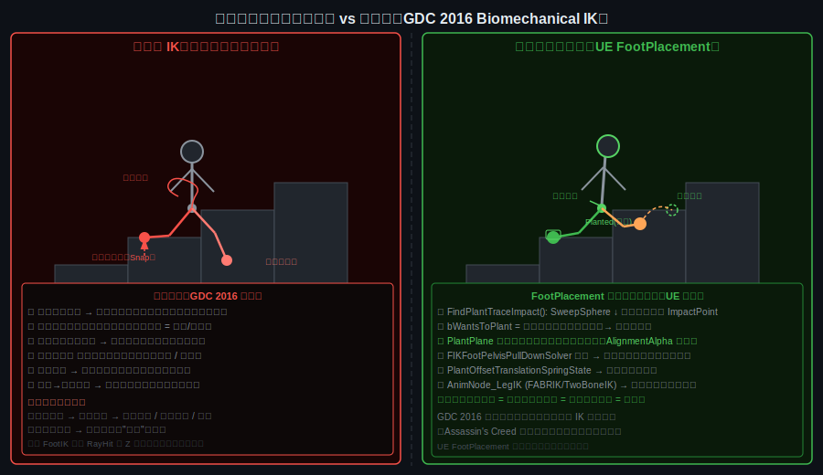

#### 六大难点

1. **台阶高度不均**：脚必须精确落在踏面，不能穿插或悬空
2. **迈步时机预测**：IK 修正必须提前启动，响应式方案总是"慢一拍"
3. **骨盆振荡**：每步骨盆随台阶高差上下波动，响应式骨盆有明显滞后感
4. **膝关节朝向**：上楼梯时膝盖需前倾，与平地步行的外旋方向不同
5. **高速适配**：跑步时无时间精确调整，需外推预测落点
6. **平地→楼梯过渡**：脚必须在触到台沿之前就开始抬起

#### 预测式仿生方案的核心思想

**响应式（传统 FootIK）**：检测到地面高差 → 立即偏移脚 Z 轴 → 视觉跳变 + 骨盆滞后

**预测式（GDC 2016）**：对齐动画相位与 IK 修正时机 → 提前将脚导向预测落点 → 全程弹簧平滑

Ubisoft 在 Assassin's Creed 中使用骨骼事件（Bone Notify）标记每条腿的"开始支撑相"时刻，从该时刻起逐帧将脚引向 IK 目标，而非在触地瞬间突然修正。

#### UE FootPlacement 上楼梯完整方案（源码对照）

**步骤 1 — 提前探测踏面**

```cpp
// AnimNode_FootPlacement.cpp — FindPlantTraceImpact()
// TraceStart = IK 脚位置 + Settings.StartOffset（向上 +50cm）
// TraceEnd   = IK 脚位置 - Settings.EndOffset（向下 -50cm）
// 对于楼梯：TraceEnd 会穿过当前台阶，ImpactPoint 落在踏面上
World->SweepSingleByChannel(HitResult, TraceStart, TraceEnd, ...
                             FCollisionShape::MakeSphere(SweepRadius));
```

**步骤 2 — 支撑相锁定踏面**

```cpp
// bWantsToPlant 由脚速曲线驱动（步态相位自动对应动画）
// 当脚进入支撑相（速度曲线低值区间）→ 立即锁定到已探测的 ImpactPoint
PlantData.PlantPlaneWS = FPlane(HitResult.ImpactPoint, HitResult.ImpactNormal);
```

这与 GDC 2016 的"对齐相位"本质相同：动画步态曲线即相位标记。

**步骤 3 — 脚踝旋转对齐台阶法线**

```cpp
// 脚旋转 = Lerp(FK旋转, 地面对齐旋转, AlignmentAlpha)
// AlignmentAlpha 随脚趾速度降低而增大（支撑相时完全对齐）
// 使脚面贴合台阶角度，防止脚悬空或穿入踏面斜面
```

**步骤 4 — 骨盆高度平滑**

```cpp
// FIKFootPelvisPullDownSolver 迭代：
// 对所有腿，若 IKTarget 距当前骨盆位置超出最大骨链长，则下移骨盆
// 台阶较高时：骨盆被下拉 → 身体整体降低 → 腿伸展到踏面
// Spring 插值防止骨盆每步跳变
```

**步骤 5 — FABRIK 腿部求解**

```cpp
// AnimNode_LegIK：FABRIK 将腿链延伸到锁定后的 IK 脚目标
// 目标 = 台阶踏面上的 AlignedFootTransformWS
// 膝关节朝向由 HingeRotationAxis 约束（朝前），避免内外翻
```

**FootPlacement 相对传统 FootIK 的优势**：

| 问题 | 传统 RayHit Z 偏移 | FootPlacement |
|------|--------------------|---------------|
| 脚滑 | ✗ 无法防止 | ✓ 支撑相锁定 |
| 穿插 | ✗ 仅偏移，无旋转 | ✓ PlantPlane 全 3D 对齐 |
| 骨盆抖动 | ✗ 无骨盆补偿 | ✓ PelvisSolver + Spring |
| 台阶过渡跳变 | ✗ 立即跳 | ✓ Spring 弹性过渡 |
| 膝关节朝向 | ✗ 不处理 | ✓ AdjustKneeTwist |

---

## 附录：关键源文件速查

| 文件 | 路径 | 内容 |
|------|------|------|
| `AnimInstance.h` | `Runtime/Engine/Classes/Animation/` | `UAnimInstance` 声明，所有事件入口 |
| `AnimInstanceProxy.cpp` | `Runtime/Engine/Private/Animation/` | `UpdateAnimation_WithRoot`, `EvaluateAnimation` |
| `AnimNode_StateMachine.h` | `Runtime/Engine/Classes/Animation/` | 状态机运行时数据结构 |
| `AnimNode_LinkedAnimLayer.h` | `Runtime/Engine/Classes/Animation/` | Layer Interface 运行时节点 |
| `AnimLayerInterface.h` | `Runtime/Engine/Classes/Animation/` | `UAnimLayerInterface` 标记接口 |
| `AnimMontage.h` | `Runtime/Engine/Classes/Animation/` | Montage 数据结构 |
| `BlendSpace.h/.cpp` | `Runtime/Engine/Classes/Animation/` | BlendSpace 所有算法 |
| `TwoBoneIK.cpp` | `Runtime/AnimationCore/Private/` | TwoBoneIK 余弦定理求解 |
| `CCDIK.cpp` | `Runtime/AnimationCore/Private/` | CCD 迭代算法 |
| `AnimationRuntime.h` | `Runtime/Engine/Public/Animation/` | `AdvanceTime`, 工具函数 |
| `AnimNode_StrideWarping.cpp` | `Plugins/Animation/AnimationWarping/Source/Runtime/Private/BoneControllers/` | StrideWarping 完整实现 |
| `BoneControllerSolvers.cpp` | `Runtime/AnimGraphRuntime/Private/BoneControllers/` | 骨盆下拉迭代求解器 |
| `FABRIK.cpp` | `Runtime/AnimationCore/Private/` | FABRIK 前向-后向迭代 IK 算法 |
| `SplineIK.cpp` | `Runtime/AnimationCore/Private/` | SplineIK 样条映射算法 |
| `AnimNode_FootPlacement.cpp` | `Plugins/Animation/AnimationWarping/Source/Runtime/Private/BoneControllers/` | FootPlacement 脚部锁定 + 弹簧系统 |
| `AnimNode_LegIK.cpp` | `Runtime/AnimGraphRuntime/Private/BoneControllers/` | 腿部 IK：OrientLeg + FABRIK + KneeTwist |
| `AnimNode_ControlRigBase.cpp` | `Plugins/Animation/ControlRig/Source/ControlRig/Private/` | ControlRig 与 AnimBP 集成桥接 |
| `RigUnit_FABRIK.cpp` | `Plugins/Animation/ControlRig/Source/ControlRig/Private/Units/Highlevel/Hierarchy/` | ControlRig FABRIK RigUnit 实现 |

---

*文档编写时间：2024 年，基于 UE 5.4.4 源码直接阅读与分析*  
*图表来源：Image/ 目录下的 SVG 图（基于源码逻辑绘制）*
