# UE 文件系统深度解析

> **目标读者**：有 C++ 基础、刚接触 UE 的开发者。本文从头讲清楚 UE 如何存储、打包、读取文件，每个步骤都对应实际源码位置，不猜测，不含糊。

---

## 目录

1. [PAK 文件](#1-pak-文件)
   - [1.1 PAK 文件二进制布局](#11-pak-文件二进制布局)
   - [1.2 PAK 文件生成流程](#12-pak-文件生成流程)
   - [1.3 PAK 文件读取/挂载流程](#13-pak-文件读取挂载流程)
2. [IoStore（.utoc + .ucas + .pak）](#2-iostoreutocucaspak)
   - [2.1 IoStore 文件布局](#21-iostore-文件布局)
   - [2.2 IoStore 生成流程](#22-iostore-生成流程)
   - [2.3 IoStore 读取流程](#23-iostore-读取流程)
3. [uasset 数据分布：以 BP_EnemyBase / BP_Enemy 为例](#3-uasset-数据分布以-bp_enemybase--bp_enemy-为例)
4. [示例文件集合的分布方式](#4-示例文件集合的分布方式)
   - [4.1 PAK 模式下的分布](#41-pak-模式下的分布)
   - [4.2 IoStore 模式下的分布](#42-iostore-模式下的分布)
5. [UE 文件系统分层框架](#5-ue-文件系统分层框架)
6. [完整资源加载管道：从路径到 UClass*](#6-完整资源加载管道从路径到-uclass)

---

## 1. PAK 文件

### 1.1 PAK 文件二进制布局

**什么是 PAK 文件？**

PAK 是 UE 最传统的打包格式（UE4 时代就存在）。本质上是把若干个 Cook 产物（.uasset、.uexp 等文件）打包进一个大文件，方便发布、防止用户直接查看资产。

**源码位置**：
- `Engine/Source/Runtime/PakFile/Public/IPlatformFilePak.h`
- `Engine/Source/Runtime/PakFile/Private/IPlatformFilePak.cpp`

**关键结构体**：

```cpp
// FPakInfo：位于文件末尾（"尾部/Trailer"），固定大小约 221 字节
struct FPakInfo
{
    uint32  Magic;                     // = 0x5A6F12E1（魔数，用来验证这确实是 PAK 文件）
    int32   Version;                   // PAK 版本（最新为 11）
    int64   IndexOffset;               // 主索引（Primary Index）在文件中的绝对偏移
    int64   IndexSize;                 // 主索引大小（字节）
    FSHAHash IndexHash;                // 主索引数据的 SHA1 校验值
    uint8   bEncryptedIndex;           // 索引是否加密
    FGuid   EncryptionKeyGuid;         // 加密密钥 GUID（若加密）
    // CompressionMethods[4]：记录本 PAK 用了哪些压缩算法名称
};

// FPakEntry：每个文件的元数据（存储在 Primary Index 中）
struct FPakEntry
{
    int64    Offset;         // 该文件数据在 PAK 中的绝对偏移
    int64    Size;           // 压缩后大小
    int64    UncompressedSize; // 原始大小
    uint8    Hash[20];       // 原始数据的 SHA1（用于完整性验证）
    // CompressionBlocks[]：每个压缩块的 [偏移, 压缩大小]
    // CompressionMethodIndex：使用 FPakInfo.CompressionMethods 中的哪个算法
    // bEncrypted：该文件是否单独加密
};
```

**文件整体布局图**：

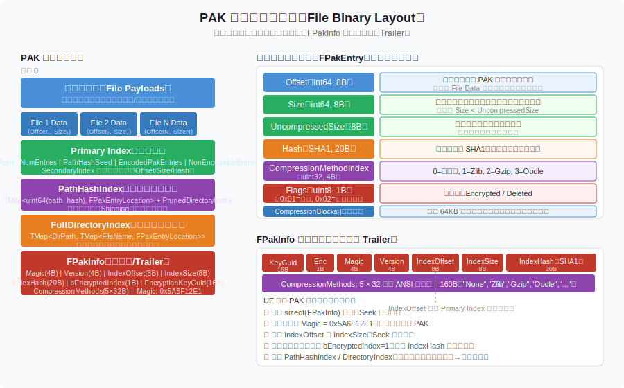

**从头理解这张图**：

- PAK 文件的数据在**头部**，索引在**尾部**——这与 ZIP 文件类似。
- `FPakInfo` 永远在文件最末尾（固定偏移 = FileSize - sizeof(FPakInfo)）。
- 读取 PAK 时，先读末尾的 FPakInfo，获得 `IndexOffset`，再跳到那里读索引，最后才能按需读数据。
- **Primary Index**：列出所有文件的 FPakEntry 元数据（含路径、偏移、大小、哈希）。
- **PathHashIndex**：把文件路径的 FNV64 哈希映射到 FPakEntry 在 EncodedPakEntries 中的位置，查找更快。
- **FullDirectoryIndex**：完整的目录树结构，用于 `FindFilesAtPath` 等遍历接口。

---

### 1.2 PAK 文件生成流程

**入口工具**：`UnrealPak`（`Engine/Source/Programs/UnrealPak/`），或在 UAT 流程中由 `PackagingCommandlet` 调用。

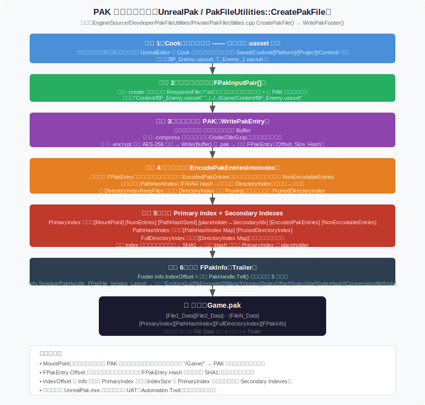

**每步说明**：

| 步骤 | 说明 |
|------|------|
| Cook 资产 | Editor/命令行 Cook，把 .uasset 转成平台相关的二进制格式，输出到 Saved/Cooked/ 目录 |
| 收集输入列表 | `FPakInputPair`：每对 = (源文件路径, PAK 内挂载路径)，例如 `(D:/Saved/Cooked/Windows/Game/Content/Blueprints/BP_Enemy.uasset, /Game/Blueprints/BP_Enemy.uasset)` |
| WritePakEntry | 对每个文件：读取内容 → 按 CompressionBlockSize(默认64KB)分块 → Oodle 压缩 → 若需要则加密 → 写入 PAK 数据区 → 记录 FPakEntry（含 Offset、Size、Hash 等） |
| EncodePakEntries | 把所有 FPakEntry 编码压缩存储（EncodedPakEntries），同时构建 PathHashIndex 和 DirectoryIndex |
| 写索引 | 先写 Primary Index，再写 PathHashIndex 和 FullDirectoryIndex |
| 写 FPakInfo | 在文件最末尾写入 FPakInfo，填入 IndexOffset（即 Primary Index 的起始位置） |

---

### 1.3 PAK 文件读取/挂载流程

**关键函数**：`FPakPlatformFile::Mount()`（`IPlatformFilePak.cpp`）

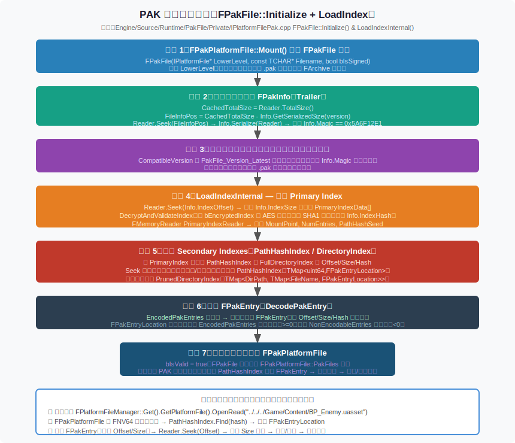

**步骤详解**：

1. **Mount(PakFilename, PakOrder, MountPoint)**：传入 PAK 文件路径，开始挂载。
2. **FPakFile 构造函数**：打开文件句柄，读取末尾固定大小的 `FPakInfo`，验证 `Magic == 0x5A6F12E1`。
3. **版本兼容检查**：若 Version 不支持，拒绝挂载（防止旧版引擎读新版 PAK）。
4. **LoadIndexInternal**：跳到 `IndexOffset`，读取 Primary Index 数据，若 `bEncryptedIndex=true` 则先解密，然后验证 `IndexHash`（SHA1）。
5. **读取二级索引**：从 Primary Index 里取出 PathHashIndex 和 FullDirectoryIndex 的偏移，继续读取。
6. **解码 FPakEntry**：把压缩的 EncodedPakEntries 解码成内存中的 FPakEntry 数组。
7. **注册到 PakFiles 列表**：`FPakPlatformFile` 把这个 FPakFile 加入 `PakFiles` 数组，`bIsValid = true`。

之后，当游戏代码调用 `OpenRead("/Game/Blueprints/BP_Enemy.uasset")` 时：
- `FPakPlatformFile::OpenRead` → FNV64 哈希路径 → 在 PathHashIndex 中查找 → 找到 FPakEntry → `FPakFileHandle::Read()` 从 PAK 的 `Offset` 处读取 `Size` 字节 → 解压/解密 → 返回。

---

## 2. IoStore（.utoc + .ucas + .pak）

### 2.1 IoStore 文件布局

**什么是 IoStore？**

IoStore 是 UE5 引入的新打包格式，专门为高性能异步 I/O 设计。它把 PAK 的"路径字符串索引"替换为"数字 ChunkId 索引"，把所有数据的访问从"串行读一个文件"变成"批量异步请求多个 Chunk"。

**源码位置**：
- `Engine/Source/Runtime/Core/Internal/IO/IoStore.h`（关键结构体定义）
- `Engine/Source/Runtime/PakFile/Private/IoDispatcherFileBackend.cpp`（运行时读取）
- `Engine/Source/Programs/UnrealPak/Private/IoStoreWriter.cpp`（生成时写入）

**三个文件的分工**：

| 文件 | 类比 | 内容 |
|------|------|------|
| `.utoc` | 目录 / 索引 | FIoStoreTocHeader + ChunkIds[] + ChunkOffsetLengths[] + 压缩块描述 + 目录索引 |
| `.ucas` | 数据仓库 | 所有 Chunk 的实际数据（压缩后），按顺序紧密排列 |
| `.pak` | 元数据 | PAK 格式，但内容是 FIoContainerHeader（PackageId↔PackageName 映射 + 依赖图），不是原始资产 |

**关键结构体**：

```cpp
// FIoChunkId：12字节，唯一标识一个 Chunk
struct FIoChunkId
{
    uint8 Id[12];
    // 实际编码：
    // [0..7]  = PackageId（uint64，即 FNV64(小写包名)）
    // [8..9]  = ChunkIndex（uint16，同包的第几个 Chunk）
    // [10]    = ChunkType（EIoChunkType）
    // [11]    = 填充 0
};

// EIoChunkType 枚举（常用值）
enum class EIoChunkType : uint8
{
    Invalid              = 0,
    ExportBundleData     = 1,  // 蓝图/对象数据（主要类型）
    BulkData             = 2,  // 纹理 Mip / 音频等 BulkData
    OptionalBulkData     = 3,  // 可选 BulkData（低优先级）
    MemoryMappedBulkData = 4,  // 内存映射 BulkData
    ContainerHeader      = 9,  // 容器描述（特殊）
};

// FIoOffsetAndLength：10字节，描述一个 Chunk 在 .ucas 中的位置和大小
struct FIoOffsetAndLength
{
    uint8 Data[10];
    // [0..4]  = Offset（40 bit，最大 1TB）
    // [5..9]  = Length（40 bit）
};

// FIoStoreTocCompressedBlockEntry：12字节，描述一个 64KB 压缩块
struct FIoStoreTocCompressedBlockEntry
{
    uint8 Data[12];
    // [0..4]  = Offset（40 bit）
    // [5..7]  = CompressedSize（24 bit）
    // [8..10] = UncompressedSize（24 bit）
    // [11]    = CompressionMethodIndex（8 bit）
};
```

**文件布局图**：

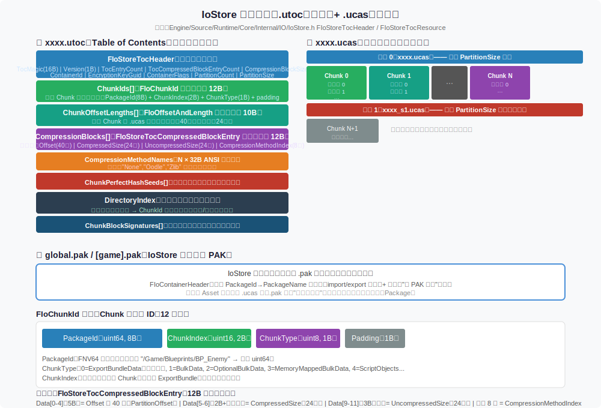

**为什么用数字 ChunkId 而不是路径字符串？**

- 路径字符串（如 `/Game/Blueprints/BP_Enemy.uasset`）需要存储在内存中做字符串比较，开销大。
- `PackageId = FNV64("/game/blueprints/bp_enemy")` 是 uint64，只占 8 字节，哈希查找 O(1)，且无需字符串。
- 运行时按包名加载时，先算 PackageId，再直接查哈希表，比字符串路径快得多。

---

### 2.2 IoStore 生成流程

**入口**：Cook 时 `-iostore` 参数，由 `IoStoreUtilities.cpp` 驱动（`Engine/Source/Programs/UnrealPak/Private/IoStoreUtilities.cpp`）

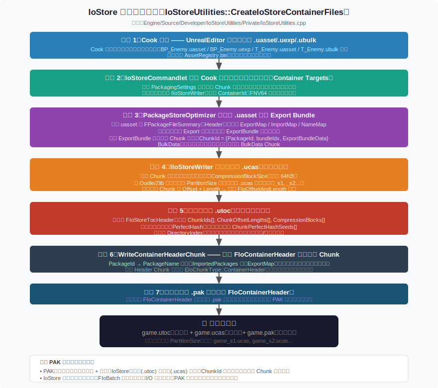

| 步骤 | 说明 |
|------|------|
| Cook | 同 PAK，先 Cook 出平台二进制文件 |
| InitializeContainerTargets | 确定哪些包进哪个容器（global.utoc、[game].utoc 等） |
| PackageStoreOptimizer | 分析包之间的依赖，生成 ExportBundle 布局（把哪些 Export 放在同一个 Chunk 里一起加载） |
| IIoStoreWriter 压缩写入 .ucas | 把每个 Chunk 数据切成 64KB 块，Oodle 压缩，按顺序追加到 .ucas |
| 写入 .utoc | 写 FIoStoreTocHeader + ChunkIds[] + ChunkOffsetLengths[] + CompressionBlocks[] + PerfectHashSeeds + DirectoryIndex |
| WriteContainerHeaderChunk | 序列化 FIoContainerHeader（PackageId↔Name 映射 + StoreEntries 依赖图），作为特殊 Chunk 写入 .ucas，对应 .utoc 中的 ContainerHeader ChunkId |
| 生成 .pak 元数据 | 以 PAK 格式写一个小 .pak，内容是上述 FIoContainerHeader 数据，用于兼容需要 PAK 格式的旧代码路径 |

---

### 2.3 IoStore 读取流程

**关键类**：`FFileIoStore`（`IoDispatcherFileBackend.cpp`），`FIoStoreTocResource`（解析 .utoc）

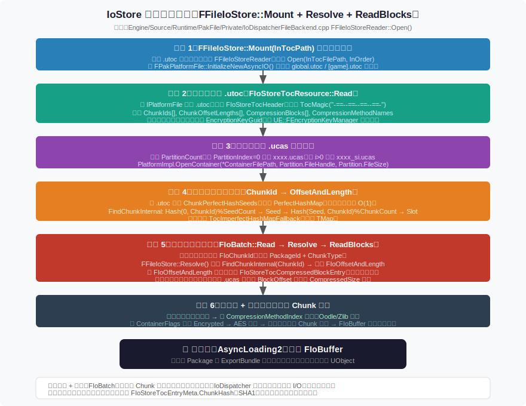

**步骤详解**：

1. **FFileIoStore::Mount(TocPath)**：传入 .utoc 路径，开始挂载。
2. **FIoStoreTocResource::Read()**：读取整个 .utoc 文件，验证 `FIoStoreTocHeader.Magic`，解析所有字段。
3. **Open .ucas partitions**：根据 PartitionCount 打开 game.ucas、game_s1.ucas 等分区文件（超过 2GB 自动分片）。
4. **Build Perfect Hash Map**：用 .utoc 中的 `PerfectHashSeeds` 构建 `ChunkId → FIoOffsetAndLength` 的完美哈希映射（O(1) 无冲突查找）。
5. **运行时 FIoBatch::Read(ChunkId)**：
   - 通过完美哈希查到 Offset + Length
   - 根据 CompressionBlocks[] 找到涉及的 64KB 块范围
   - 异步提交多个 ReadRequest 给底层 FFileIoStore I/O 线程
6. **ReadBlocks → Decompress → Return FIoBuffer**：
   - I/O 线程完成后，按需解密（若加密），Oodle/LZ4 解压，拼合返回 FIoBuffer
   - 回调触发（通知 AsyncLoading2 数据就绪）

---

## 3. uasset 数据分布：以 BP_EnemyBase / BP_Enemy 为例

**先搞清楚 .uasset 和 .uexp 的关系**：

- `.uasset`：包头（Summary）+ NameMap + ImportMap + ExportMap + AssetRegistryData 等元数据，体积通常很小。
- `.uexp`：Export Data 的实际字节流（UObject 序列化内容），通常是最大的部分。
- `.ubulk`：BulkData（纹理 Mip、音频等大块二进制），单独存储便于按需加载。

> 进入 PAK 或 IoStore 后，`.uasset` 和 `.uexp` 通常会被**合并**（`bMergeWithCooked=true`）成一个数据块一起打包，不再是独立文件。

**关键结构体**（源码：`Engine/Source/Runtime/CoreUObject/Public/UObject/PackageFileSummary.h`）：

```cpp
struct FPackageFileSummary
{
    int32   Tag;              // = PACKAGE_FILE_TAG（魔数 0x9E2A83C1）
    int32   LegacyFileVersion;
    int32   LegacyUE3Version;
    FPackageFileVersion FileVersionUE;
    FEngineVersion SavedByEngineVersion;
    int32   TotalHeaderSize;  // 所有元数据（NameMap + ImportMap + ExportMap + ...）的总大小
    FString PackageName;      // 该包的内部名称（如 /Game/Blueprints/BP_Enemy）
    uint32  PackageFlags;     // 标志位（是否地图包等）
    int32   NameCount;    int32 NameOffset;     // NameMap 的条数和起始偏移
    int32   ImportCount;  int32 ImportOffset;   // ImportMap 的条数和起始偏移
    int32   ExportCount;  int32 ExportOffset;   // ExportMap 的条数和起始偏移
    int32   DependsOffset;    // DependsMap 起始偏移
    int32   AssetRegistryDataOffset;
    int64   BulkDataStartOffset;     // BulkData 在文件中的起始偏移（超出 ExportData）
    int32   PreloadDependencyCount;  int32 PreloadDependencyOffset;
};

// FObjectImport：ImportMap 中的一条（表示"我引用了另一个包里的对象"）
struct FObjectImport
{
    FName   ClassPackage;   // 类所在的包（如 /Script/Engine）
    FName   ClassName;      // 类名（如 BlueprintGeneratedClass）
    FPackageIndex OuterIndex; // 外部对象索引（-1 表示外包，0 表示顶级）
    FName   ObjectName;     // 对象名（如 BP_EnemyBase_C）
};

// FObjectExport：ExportMap 中的一条（表示"本包导出的对象"）
struct FObjectExport
{
    FPackageIndex ClassIndex;      // 该 Export 的类（负数 → ImportMap 中）
    FPackageIndex SuperIndex;      // 父类 Index（用于 Blueprint 继承）
    FPackageIndex OuterIndex;      // 外部 Package 对象索引
    FName         ObjectName;      // 对象名（如 BP_Enemy_C）
    int32         SerialSize;      // 序列化大小（字节）
    int64         SerialOffset;    // Export Data 在文件中的偏移
    uint32        ObjectFlags;
};

// FPackageIndex 编码规则：
// 正数 i  → ExportMap[i - 1]（本包内的导出对象）
// 负数 i  → ImportMap[-i - 1]（引用的外部对象）
// 0      → null（无效引用）
```

**uasset 数据布局图**（BP_EnemyBase 与 BP_Enemy 对比）：

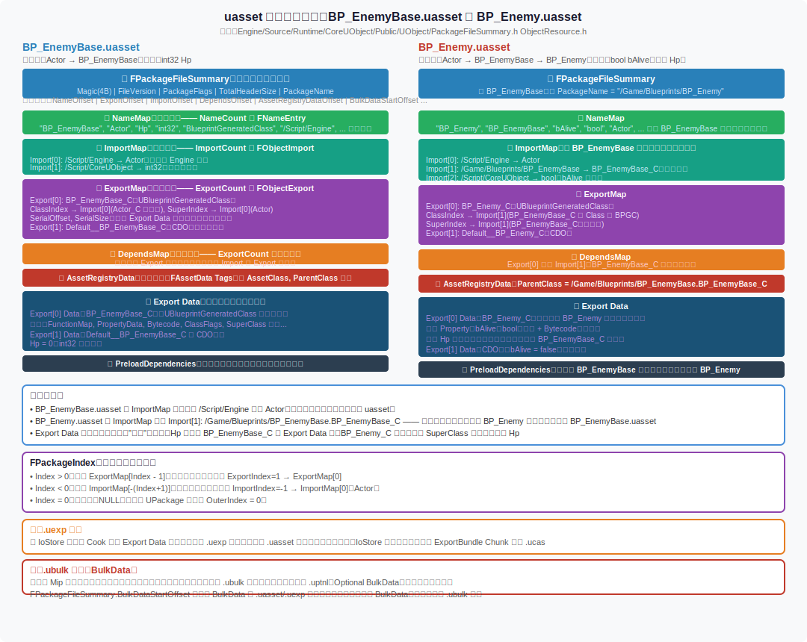

**从图中理解继承关系**：

`BP_Enemy.uasset` 的 ImportMap 中有一条：
```
Import[1]: ClassPackage=/Script/Engine, ClassName=BlueprintGeneratedClass,
           OuterIndex=-1(/Game/Blueprints/BP_EnemyBase), ObjectName=BP_EnemyBase_C
```

`BP_Enemy.uasset` 的 ExportMap 中：
```
Export[0]: ObjectName=BP_Enemy_C, SuperIndex=-2（即 ImportMap[1] = BP_EnemyBase_C）
```

这就是跨包引用：BP_Enemy_C 的父类 SuperIndex 指向 ImportMap 中 BP_EnemyBase_C。加载时必须先加载 BP_EnemyBase 包。

---

## 4. 示例文件集合的分布方式

### 4.1 PAK 模式下的分布

**示例文件集合**：
- 贴图（Textures）：T_Enemy_1、T_Enemy_2、T_Enemy_3（DXT1，原始各约 256KB）
- 蓝图（Blueprints）：BP_EnemyBase、BP_Enemy、BP_Enemy_1/2/3
- 关卡（Maps）：L_WorldMap

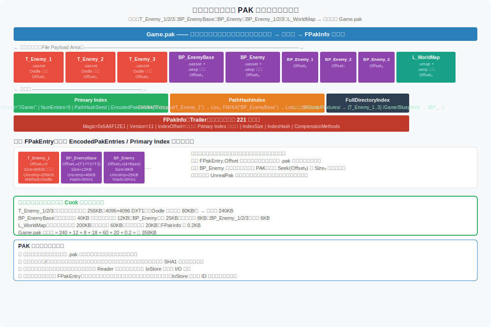

**PAK 模式的本质**：

所有文件的数据**线性拼接**在一起，形成一个大文件。索引（FPakEntry 数组）存在文件末尾的 Primary Index 中。加载任意文件只需要：
1. 在 PathHashIndex 中查到该文件的 FPakEntry
2. `Seek(FPakEntry.Offset)` 跳转到数据位置
3. 读取 `FPakEntry.Size` 字节，解压即可

不需要读取整个 PAK。

---

### 4.2 IoStore 模式下的分布

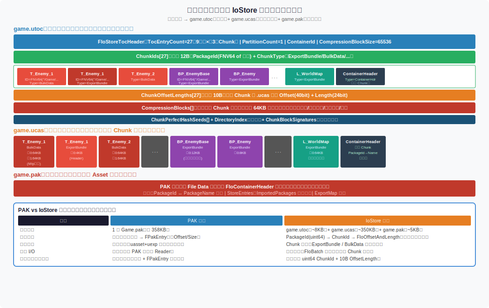

**IoStore 模式的本质**：

每个资产被分解成若干 **Chunk**（以 ChunkId 标识），存入 .ucas。纹理有独立的 BulkData Chunk（存 Mip 纹理数据）和 ExportBundle Chunk（存对象头信息）。这意味着：

- 游戏在加载蓝图时，不需要把贴图的 Mip 数据一起加载（它在独立的 BulkData Chunk 里）。
- 渲染系统可以在需要时单独请求高分辨率 Mip（Streaming Mip），不影响其他加载。
- FIoBatch 可以同时提交多个 Chunk 的 ReadRequest，OS 的异步 I/O 可以并发处理。

**与 PAK 的核心区别**：

| 维度 | PAK | IoStore |
|------|-----|---------|
| 文件粒度 | 整个 .uasset | 单个 Chunk（ExportBundle / BulkData 独立） |
| 查找方式 | FNV64(路径字符串) → FPakEntry | FIoChunkId(uint64+uint16+uint8) → FIoOffsetAndLength |
| 并发 I/O | 弱（共享 Reader） | 强（FIoBatch 原生批量异步） |
| 内存开销 | 较高（路径字符串 + FPakEntry） | 低（纯数字键值，无字符串） |
| 流式加载 | 全文件或不加载 | Chunk 粒度，BulkData 独立流式 |

---

## 5. UE 文件系统分层框架

**核心接口**：`IPlatformFile`（`Engine/Source/Runtime/Core/Public/GenericPlatform/GenericPlatformFile.h`）

UE 的文件系统是一个**链式中间件模式**：每一层都实现 `IPlatformFile` 接口，通过 `Initialize(IPlatformFile* Inner, ...)` 设置下一层。最上层的指针存在 `FPlatformFileManager::TopmostPlatformFile` 中。

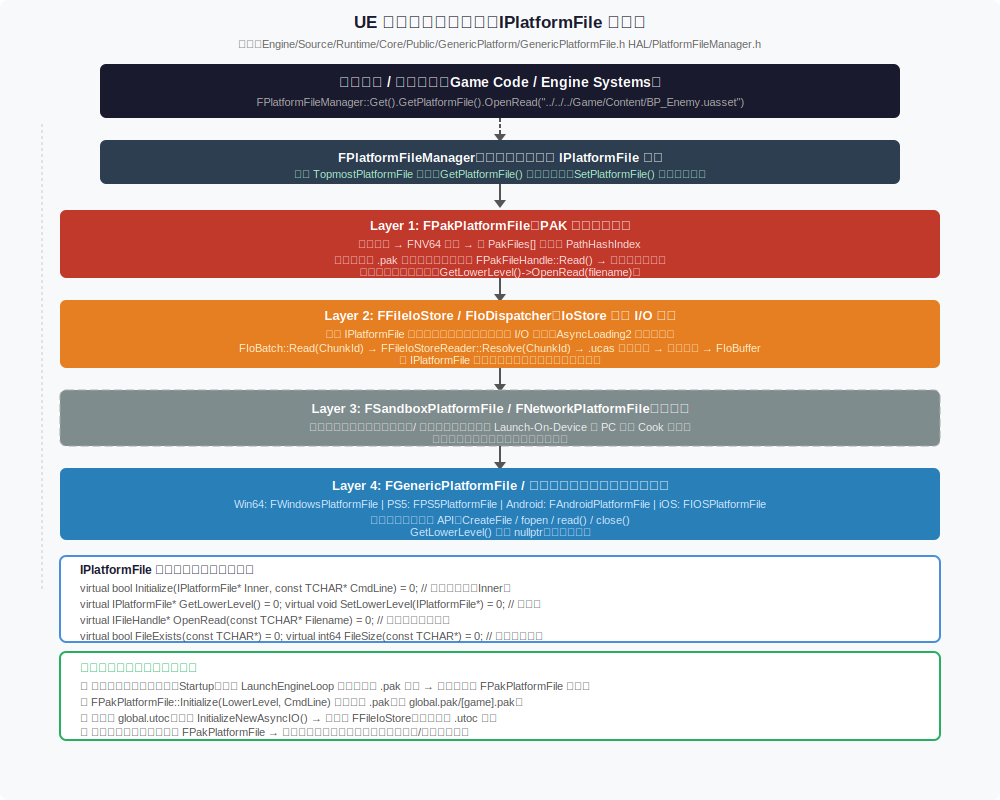

**接口关键方法**：

```cpp
class IPlatformFile
{
public:
    // 初始化并设置下一层（Inner 是比自己更底层的文件系统）
    virtual bool Initialize(IPlatformFile* Inner, const TCHAR* CmdLine) = 0;

    // 获取/设置下一层
    virtual IPlatformFile* GetLowerLevel() = 0;
    virtual void SetLowerLevel(IPlatformFile* NewLowerLevel) = 0;

    // 文件操作（若本层处理不了，应调用 GetLowerLevel()->XXX 转发）
    virtual IFileHandle* OpenRead(const TCHAR* Filename, bool bAllowWrite = false) = 0;
    virtual bool FileExists(const TCHAR* Filename) = 0;
    virtual int64 FileSize(const TCHAR* Filename) = 0;
    // ... 还有 CreateDirectory、DeleteFile、MoveFile 等
};
```

**每层的职责**：

| 层次 | 类名 | 职责 |
|------|------|------|
| 最底层 | `FWindowsPlatformFile`（Windows）等 | 直接调用 OS API（CreateFile/read/close），`GetLowerLevel()` 返回 nullptr |
| 可选层 | `FSandboxPlatformFile` | 限制写路径（Editor Sandbox 模式） |
| 可选层 | `FNetworkPlatformFile` | Launch-On-Device 时从开发机远程读取文件 |
| 核心层 | `FPakPlatformFile` | 在已挂载的 .pak 中查找文件；找到则内部处理，否则向下转发 |
| 并行系统 | `FFileIoStore` | 不在 IPlatformFile 链中；AsyncLoading2 直接调用；专门服务 .utoc/.ucas 的异步 Chunk 请求 |

**启动时初始化顺序**（`LaunchEngineLoop.cpp`）：

```
1. 物理文件系统可用（OS 级别）
2. 检测到 .pak 文件 → 创建 FPakPlatformFile → Initialize(当前TopMost)
3. FPakPlatformFile::Mount() 挂载 global.pak、[game].pak 等
4. 检测到 global.utoc → InitializeNewAsyncIO() → FFileIoStore::Mount(global.utoc)
5. 挂载所有 [game].utoc 容器
6. 此后文件请求：路径类 → FPakPlatformFile；ChunkId 类 → FFileIoStore
```

---

## 6. 完整资源加载管道：从路径到 UClass*

**示例调用**：

```cpp
// 异步加载 BP_Enemy 蓝图类，加载完成后通过 Delegate 拿到 UClass*
FStreamableManager& StreamableManager = UAssetManager::Get().GetStreamableManager();
StreamableManager.RequestAsyncLoad(
    FSoftObjectPath("/Game/Blueprints/BP_Enemy.BP_Enemy_C"),
    FStreamableDelegate::CreateLambda([](){ /* 加载完成回调 */ })
);
```

**完整管道图**：

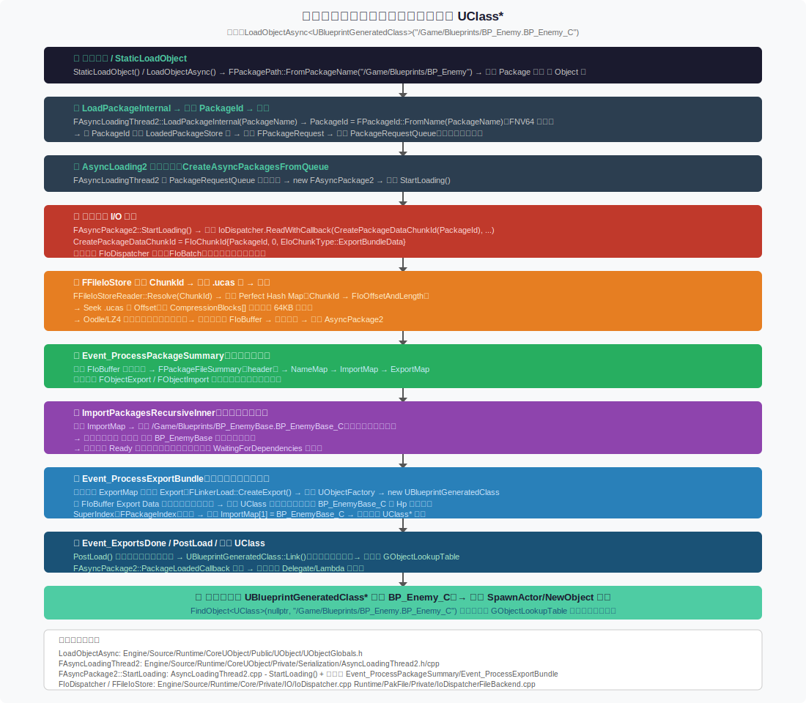

**每个步骤详解**：

### 步骤 ①：解析路径

```cpp
// UObjectGlobals.h / UObjectGlobals.cpp
FPackagePath PackagePath = FPackagePath::FromPackageName(TEXT("/Game/Blueprints/BP_Enemy"));
// PackagePath.GetLocalFullPath() → 转换为磁盘路径（或用于 PAK/IoStore 查找）
```

路径格式 `/Game/Blueprints/BP_Enemy.BP_Enemy_C` 中：
- `/Game/Blueprints/BP_Enemy` = Package 名（对应 .uasset 文件）
- `BP_Enemy_C` = Package 内的 Object 名（UBlueprintGeneratedClass 的名字）

---

### 步骤 ②：LoadPackageInternal → 计算 PackageId → 入队

```cpp
// AsyncLoadingThread2.cpp
void FAsyncLoadingThread2::LoadPackageInternal(
    const FPackagePath& InPackagePath, FName PackageNameToLoad, ...)
{
    FPackageId PackageId = FPackageId::FromName(PackageNameToLoad);
    // PackageId = FNV64Hash(ToLower("/game/blueprints/bp_enemy"))
    // 检查是否已在 LoadedPackageStore 中（缓存）
    // 若没有，创建 FPackageRequest 并推入 PackageRequestQueue
}
```

---

### 步骤 ③：CreateAsyncPackagesFromQueue

`FAsyncLoadingThread2` 有一个专用工作线程，持续从 `PackageRequestQueue` 取出请求，为每个请求创建 `FAsyncPackage2` 对象，调用 `StartLoading()`。

---

### 步骤 ④：发起异步 I/O 请求

```cpp
// AsyncLoadingThread2.cpp - FAsyncPackage2::StartLoading
FIoChunkId ChunkId = CreatePackageDataChunkId(PackageId);
// ChunkId = {PackageId, 0, EIoChunkType::ExportBundleData}
IoDispatcher.ReadWithCallback(ChunkId, IoReadOptions, IoDispatcherPriority_High,
    [this](TIoStatusOr<FIoBuffer> IoBuffer) {
        // 数据就绪后回调，触发下一个状态
    });
```

---

### 步骤 ⑤：FFileIoStore 解析 → 读取 .ucas → 解压

```
FIoDispatcher 收到请求
→ 分发给 FFileIoStore 后端
→ FFileIoStoreReader::Resolve(ChunkId)：完美哈希查 ChunkId → FIoOffsetAndLength
→ 找到 Offset 和 Length
→ 从 .utoc CompressionBlocks[] 算出需要哪些 64KB 块
→ 异步提交多个块的读取请求给 I/O 线程池
→ 所有块就绪后 Oodle 解压
→ 拼合成完整 FIoBuffer（包含整个 ExportBundle Chunk 数据）
→ 触发回调
```

---

### 步骤 ⑥：Event_ProcessPackageSummary

```
FIoBuffer 起始 = FPackageFileSummary（头信息）
→ 解析 NameMap（所有字符串名称的字典，后续 FName 都用索引引用）
→ 解析 ImportMap（FObjectImport 数组：引用了哪些外包对象）
→ 解析 ExportMap（FObjectExport 数组：本包导出哪些对象，含 SerialOffset/Size）
状态机切换为 WaitingForDependencies
```

---

### 步骤 ⑦：ImportPackagesRecursiveInner（递归加载依赖）

```
遍历 BP_Enemy 的 ImportMap：
  Import[0]: /Script/Engine → UBlueprintGeneratedClass（引擎内置类，已加载）
  Import[1]: /Game/Blueprints/BP_EnemyBase → BP_EnemyBase_C（父类，需要加载！）

→ 对 /Game/Blueprints/BP_EnemyBase 重复步骤 ②～⑥
→ BP_EnemyBase 的 Export 就绪后，才继续处理 BP_Enemy
→ 这就是为什么复杂继承链会多次等待的原因
```

---

### 步骤 ⑧：Event_ProcessExportBundle

```
遍历 ExportMap，对每个 Export：
  FLinkerLoad::CreateExport(ExportIndex)
  → 根据 ClassIndex（指向 ImportMap[0] = UBlueprintGeneratedClass）
  → 调用 StaticConstructObject_Internal() → new UBlueprintGeneratedClass（即 BP_Enemy_C）
  → 从 FIoBuffer[Export.SerialOffset, SerialSize] 区间读取字节流
  → 调用 BP_Enemy_C->Serialize(FArchive) 反序列化属性
  → SuperIndex → Import[1] = 已加载的 BP_EnemyBase_C → 链接父类
```

---

### 步骤 ⑨：PostLoad / 注册

```
所有 Export 创建完成 → 调用每个 UObject::PostLoad()
UBlueprintGeneratedClass::Link() → 计算属性偏移（含继承的 Hp、Speed 等）
注册到 GObjectLookupTable（全局对象表）
FAsyncPackage2 触发 PackageLoadedCallback
```

---

### 步骤 ⑩：调用方收到结果

```cpp
// 之后任何时候可以用：
UClass* BPClass = FindObject<UClass>(nullptr, TEXT("/Game/Blueprints/BP_Enemy.BP_Enemy_C"));
// 或通过 Delegate 回调中的参数获取
AActor* Enemy = World->SpawnActor<AActor>(BPClass, SpawnLocation, SpawnRotation);
```

---

## 附录：关键源码文件索引

| 功能 | 源码路径 |
|------|----------|
| PAK 文件结构 + 读取 | `Engine/Source/Runtime/PakFile/Public/IPlatformFilePak.h` |
| PAK 挂载/读取实现 | `Engine/Source/Runtime/PakFile/Private/IPlatformFilePak.cpp` |
| IoStore 结构体定义 | `Engine/Source/Runtime/Core/Internal/IO/IoStore.h` |
| IoStore 运行时读取 | `Engine/Source/Runtime/PakFile/Private/IoDispatcherFileBackend.cpp` |
| IoStore 写入（UnrealPak） | `Engine/Source/Programs/UnrealPak/Private/IoStoreUtilities.cpp` |
| IPlatformFile 接口 | `Engine/Source/Runtime/Core/Public/GenericPlatform/GenericPlatformFile.h` |
| 文件系统管理器 | `Engine/Source/Runtime/Core/Public/HAL/PlatformFileManager.h` |
| uasset 包头结构 | `Engine/Source/Runtime/CoreUObject/Public/UObject/PackageFileSummary.h` |
| Import/Export 结构 | `Engine/Source/Runtime/CoreUObject/Public/UObject/ObjectResource.h` |
| AsyncLoading2 主文件 | `Engine/Source/Runtime/CoreUObject/Private/Serialization/AsyncLoadingThread2.cpp` |
| FIoDispatcher | `Engine/Source/Runtime/Core/Private/IO/IoDispatcher.cpp` |
| UObjectGlobals（加载入口） | `Engine/Source/Runtime/CoreUObject/Public/UObject/UObjectGlobals.h` |
