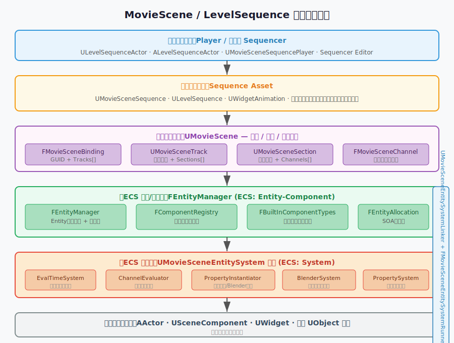
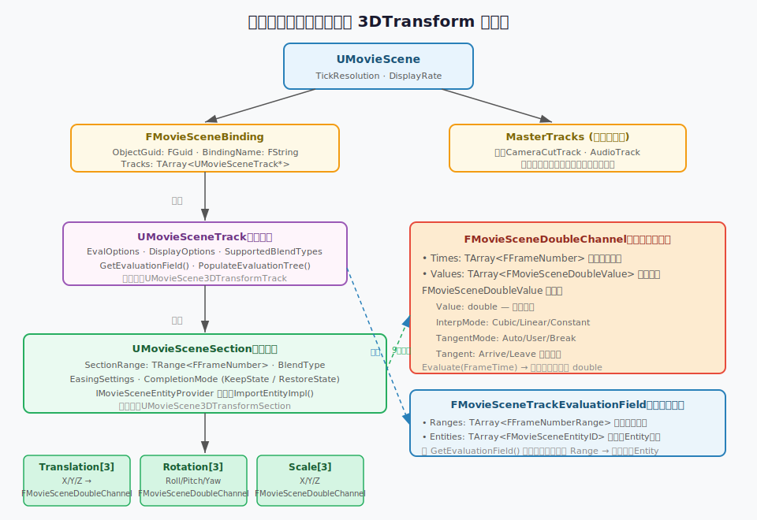
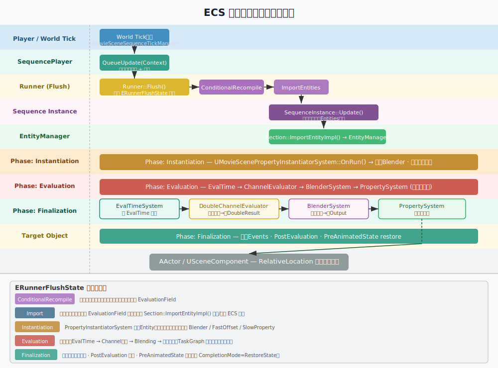
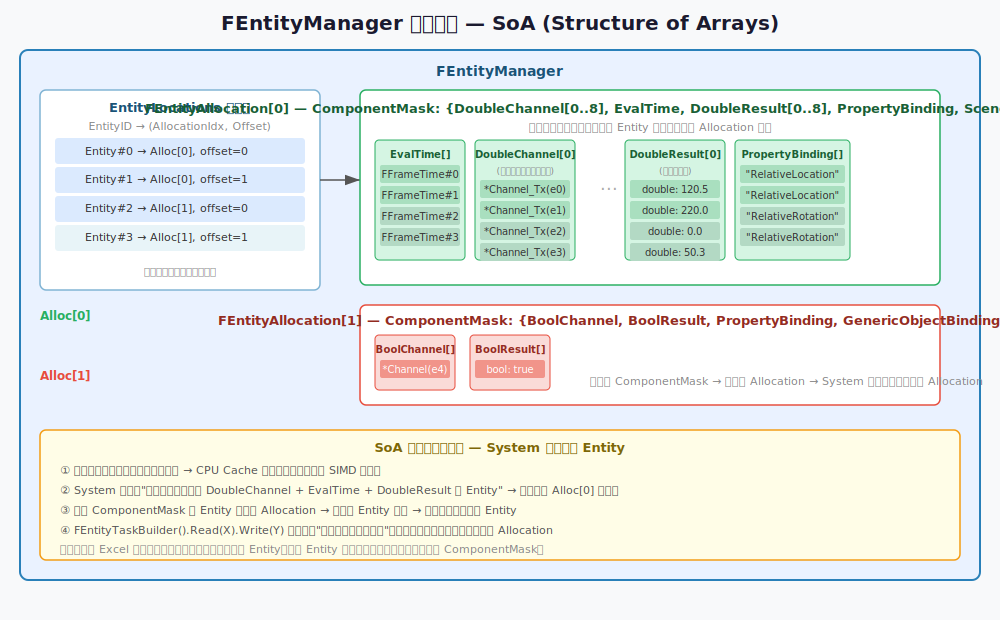
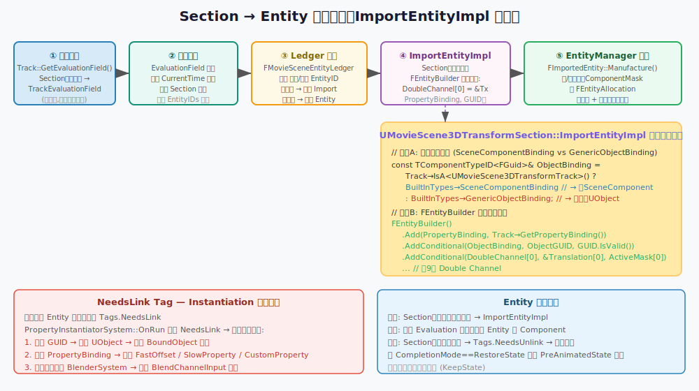
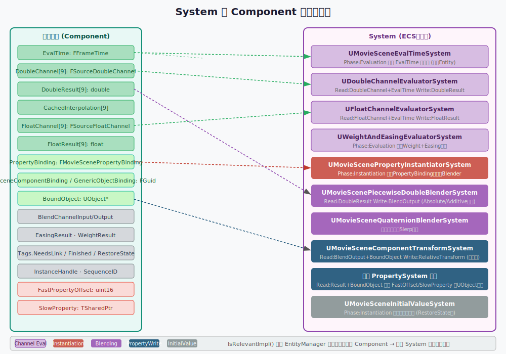
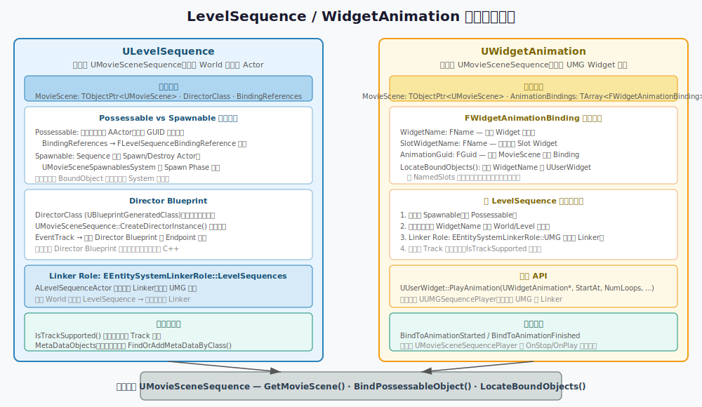
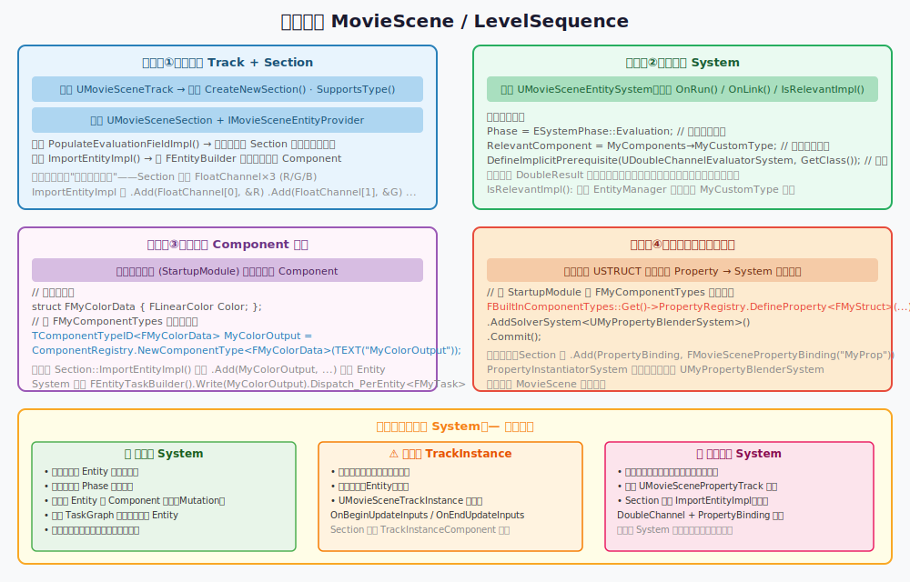

# UE5 MovieScene / LevelSequence 框架深度解析

> 本文基于 Unreal Engine 5.4.4 源码实际阅读，面向有一定 C++ 基础的 UE 新手。

---

## 目录

1. [核心概念速览](#1-核心概念速览)
2. [MovieScene 框架分层架构](#2-moviescene-框架分层架构)
3. [轨道数据结构详解](#3-轨道数据结构详解)
4. [运行时数据处理全流程](#4-运行时数据处理全流程)
5. [ECS System 系统详解](#5-ecs-system-系统详解)
6. [LevelSequence 与 WidgetAnimation](#6-levelsequence-与-widgetanimation)
7. [如何扩展：自定义轨道、System、数据类型](#7-如何扩展自定义轨道system数据类型)

---

## 1. 核心概念速览

在深入讲解之前，先把本文会频繁用到的专有名词解释清楚。

### 1.1 什么是 Sequencer？

在 UE 编辑器里，你可以打开 **Sequencer 窗口**，它看起来像一个视频剪辑软件：左边是轨道列表，右边是时间线。例如，你想让场景里的一个箱子从 A 点移动到 B 点——你只需在 Sequencer 里给这个箱子添加"位置轨道"，然后在第 0 帧和第 100 帧各打一个关键帧，UE 就会自动插值出中间的运动。

**MovieScene** 是 Sequencer 的底层框架，是真正负责存储这些数据和驱动运行时播放的部分。

### 1.2 什么是 ECS？

**ECS（Entity-Component-System）** 是一种数据驱动的编程架构，与面向对象（OOP）不同：

| 概念 | 传统 OOP 类比 | ECS 含义 |
|------|-------------|---------|
| **Entity（实体）** | 一个对象实例 | 一个纯粹的 ID 数字，没有自己的逻辑 |
| **Component（组件）** | 对象的字段/属性 | 附加在 Entity 上的一小块数据 |
| **System（系统）** | 对象的方法 | 只处理特定 Component 组合的逻辑模块 |

**举个现实例子**：想象一个仓库管理系统：
- **Entity** = 货物的标签号（纯数字，比如 #1042）
- **Component** = 货物的属性标签（"重量: 5kg"、"颜色: 红色"、"位置: A3-7"）  
- **System** = 工人按规则处理货物（"配送系统"只处理有"待发货"标签的货物）

MovieScene 5.0+ 使用了类似 ECS 的架构，其中：
- **Entity** = 一个动画通道实例（比如"Actor A 的位置 X 在第 3 个 Section 中"）
- **Component** = 附着的数据（关键帧曲线指针、当前帧时间、插值结果等）
- **System** = 各种处理器（曲线求值器、混合器、属性写入器等）

---

## 2. MovieScene 框架分层架构

整个框架从上到下分为 6 层，每层职责清晰分离：



### 2.1 各层职责说明

#### 第 1 层：外部调用层（Player / 编辑器）

这是用户或其他游戏系统与 MovieScene 交互的入口：

- **`UMovieSceneSequencePlayer`**（`Source/Runtime/MovieScene/Public/MovieSceneSequencePlayer.h`）  
  通用播放器基类，提供 `Play()` / `Stop()` / `SetPlaybackPosition()` 等蓝图可调用的接口。
  
- **`ALevelSequenceActor`**  
  关卡中放置的 Actor，持有一个 `ULevelSequence` 资产和一个 `ULevelSequencePlayer`。游戏运行时直接在关卡里触发动画。
  
- **Sequencer Editor**  
  编辑器工具，编辑时调用，最终修改保存在 `UMovieScene` 对象里的数据。

#### 第 2 层：资产数据层（Sequence Asset）

这一层存储**持久化的静态数据**——在编辑器里保存后写入磁盘，运行时只读。

- **`UMovieSceneSequence`**（`Source/Runtime/MovieScene/Public/MovieSceneSequence.h`）  
  抽象基类，定义了"一个序列资产需要实现什么接口"，例如如何把 GUID 解析成实际的 UObject。
  
- **`ULevelSequence`** 和 **`UWidgetAnimation`** 是两个最重要的子类（第 6 节详细介绍）。

#### 第 3 层：场景数据层（UMovieScene）

这是数据的核心容器，存储所有的轨道配置：

- **`UMovieScene`**（`Source/Runtime/MovieScene/Public/MovieScene.h`）  
  包含：所有轨道 (`MasterTracks`)、对象绑定列表 (`Bindings`)、帧率设置 (`TickResolution`, `DisplayRate`)。

#### 第 4 层：ECS 实体/组件层

这是运行时的动态数据存储，是 ECS 中的 **"C"（Component）部分**：

- **`FEntityManager`**（`Public/EntitySystem/MovieSceneEntityManager.h`）  
  管理所有 Entity 的生命周期和数据存储。内部使用 **SoA（Structure of Arrays）** 内存布局（第 4.1 节详解）。

- **`FBuiltInComponentTypes`**（`Public/EntitySystem/BuiltInComponentTypes.h`）  
  一个单例，定义了 MovieScene 内置的所有组件类型，例如 `EvalTime`、`DoubleChannel[9]`、`PropertyBinding` 等。

#### 第 5 层：ECS 系统层

这是 ECS 中的 **"S"（System）部分**，每个 System 是一个 `UMovieSceneEntitySystem` 子类（第 5 节详解）。

#### 第 6 层：运行时对象层

最终动画值写入的目标——普通的 `UObject`、`AActor`、`USceneComponent` 等。

---

## 3. 轨道数据结构详解



### 3.1 UMovieScene — 顶层容器

**源码位置**：`Source/Runtime/MovieScene/Public/MovieScene.h`

`UMovieScene` 是所有轨道数据的根容器，关键字段：

| 字段 | 类型 | 作用 |
|------|------|------|
| `Bindings` | `TArray<FMovieSceneBinding>` | 对象绑定列表，每个绑定包含一组轨道 |
| `MasterTracks` | `TArray<UMovieSceneTrack*>` | 不绑定到具体对象的全局轨道（如镜头切换轨道） |
| `TickResolution` | `FFrameRate` | 内部时间精度，例如 24000 Ticks/秒 |
| `DisplayRate` | `FFrameRate` | 编辑器显示帧率，例如 30fps |

> **为什么有两个帧率？** `TickResolution` 是内部精度（高），`DisplayRate` 是用户看到的帧率（低）。例如内部用 24000 ticks/秒存储关键帧，但编辑器显示时换算成 30fps。这样即使显示帧率变化，关键帧数据也不会精度损失。

### 3.2 FMovieSceneBinding — 对象绑定

**源码位置**：`Source/Runtime/MovieScene/Public/MovieSceneBinding.h`

```cpp
USTRUCT()
struct FMovieSceneBinding
{
    FGuid ObjectGuid;                         // 唯一标识符，用于在运行时找到对应的 UObject
    FString BindingName;                      // 编辑器显示名，如 "BP_Crate"
    TArray<UMovieSceneTrack*> Tracks;         // 这个对象上的所有轨道
};
```

**作用**：把一个"动画目标对象"和它的所有轨道绑定在一起。运行时通过 `UMovieSceneSequence::LocateBoundObjects(ObjectGuid, Context, OutObjects)` 把 GUID 解析成真实的 `UObject*`。

**现实例子**：关卡里有一个名为 "BP_MovingDoor" 的 Actor，你在 Sequencer 中给它添加了"位置轨道"和"可见性轨道"，这个 Actor 的 GUID 就对应一个 `FMovieSceneBinding`，`Tracks` 里有两个 `UMovieSceneTrack*`。

### 3.3 UMovieSceneTrack — 轨道基类

**源码位置**：`Source/Runtime/MovieScene/Public/MovieSceneTrack.h`

`UMovieSceneTrack` 是抽象基类，关键字段和方法：

| 成员 | 类型/签名 | 说明 |
|------|---------|------|
| `EvalOptions` | `FMovieSceneTrackEvalOptions` | 评估选项（是否评估最近的Section等） |
| `SupportedBlendTypes` | `FMovieSceneBlendTypeField` | 此轨道支持哪些混合模式（Absolute/Additive等） |
| `bIsEvalDisabled` | `bool` | 是否被 Mute（静音）禁用 |
| `GetEvaluationField()` | `const FMovieSceneTrackEvaluationField&` | 获取编译好的评估字段（懒加载） |
| `CreateNewSection()` | `virtual UMovieSceneSection*` | 子类实现：创建新的 Section |

**`FMovieSceneTrackEvalOptions` 详解**：

```cpp
struct FMovieSceneTrackEvalOptions
{
    uint32 bCanEvaluateNearestSection : 1;  // 是否允许"评估最近Section"功能
    uint32 bEvalNearestSection : 1;          // 当时间落在空白区域时，是否评估最近的Section
    uint32 bEvaluateInPreroll : 1;           // 是否在父SubSequence的PreRoll期间评估
    uint32 bEvaluateInPostroll : 1;          // 是否在父SubSequence的PostRoll期间评估
};
```

**什么是 PreRoll/PostRoll？** 想象一个子序列，它有 2 秒的 PreRoll——在子序列正式开始前 2 秒，其中设置了 `bEvaluateInPreroll` 的轨道就会提前开始评估（常用于骨骼动画提前 warmup）。

**`FMovieSceneTrackEvaluationField` 编译产物**：

```cpp
struct FMovieSceneTrackEvaluationField
{
    // 每个元素表示"在时间范围 Ranges[i] 内，EntityIDs[i] 列表中的实体处于活跃状态"
    TArray<FFrameNumberRange> Ranges;
    TArray<TArray<FMovieSceneEntityComponentFieldEntityData>> Entities;
};
```

这是 Track 的**编译产物**，把"哪个时间段哪些 Section 生效"预先计算好，运行时只需二分查找。

### 3.4 UMovieSceneSection — Section 基类

**源码位置**：`Source/Runtime/MovieScene/Public/MovieSceneSection.h`

一个 Track 可以有多个 Section（时间线上的多个片段），每个 Section 占据一段时间范围。

关键字段：

| 字段 | 类型 | 说明 |
|------|------|------|
| `SectionRange` | `TRangeBound<FFrameNumber>` | 此 Section 的时间范围（开始帧/结束帧） |
| `EvalOptions.CompletionMode` | `EMovieSceneCompletionMode` | 播放结束后如何处理：`KeepState`（保持最后状态） 或 `RestoreState`（恢复原始值） |
| `Easing.AutoEaseInDuration` | `int32` | 自动淡入帧数 |
| `Easing.AutoEaseOutDuration` | `int32` | 自动淡出帧数 |

**`IMovieSceneEntityProvider` 接口** — 连接数据层与 ECS 层的关键接口：

```cpp
class IMovieSceneEntityProvider
{
    // 向 EvaluationField 注册"此Section覆盖的时间范围内，会产生哪些EntityID"
    virtual bool PopulateEvaluationFieldImpl(
        const TRange<FFrameNumber>& EffectiveRange,
        const FMovieSceneEvaluationFieldEntityMetaData& InMetaData,
        FMovieSceneEntityComponentFieldBuilder* OutFieldBuilder) = 0;

    // 把此 Section 的数据转化为 ECS Entity（在对应时间范围内被调用）
    virtual void ImportEntityImpl(
        UMovieSceneEntitySystemLinker* EntityLinker,
        const FEntityImportParams& Params,
        FImportedEntity* OutImportedEntity) = 0;
};
```

> **通俗解释**：`PopulateEvaluationFieldImpl` 相当于告诉系统"我这段时间内存在"，而 `ImportEntityImpl` 相当于"把我的数据打包成 ECS Entity 放进去"。

### 3.5 FMovieSceneDoubleChannel — 关键帧曲线

**源码位置**：`Source/Runtime/MovieScene/Public/Channels/MovieSceneDoubleChannel.h`

这是存储关键帧数据的核心结构，以"双精度浮点通道"为例：

```cpp
struct FMovieSceneDoubleChannel
{
    TArray<FFrameNumber> Times;               // 关键帧的时间点（帧号）
    TArray<FMovieSceneDoubleValue> Values;    // 对应的值
    TOptional<double> DefaultValue;           // 没有关键帧时的默认值
    bool bHasDefaultValue;
};

struct FMovieSceneDoubleValue
{
    double Value;                             // 关键帧数值
    FMovieSceneTangentData Tangent;           // 切线（Bezier 曲线控制点）
    ERichCurveInterpMode InterpMode;          // 插值模式：Cubic/Linear/Constant/None
    ERichCurveTangentMode TangentMode;        // 切线模式：Auto/User/Break
};
```

**运行时求值**：`FMovieSceneDoubleChannel::Evaluate(FFrameTime Time, double& OutValue)` 根据两侧关键帧和 `InterpMode` 计算出当前时间的插值结果。

**以 3DTransform Section 为例**，`UMovieScene3DTransformSection` 持有：
- `Translation[3]`：X/Y/Z 三条 `FMovieSceneDoubleChannel`
- `Rotation[3]`：Roll/Pitch/Yaw 三条通道
- `Scale[3]`：X/Y/Z 三条通道

共 9 条通道，正好对应 `FBuiltInComponentTypes::DoubleChannel[9]`。

---

## 4. 运行时数据处理全流程



### 4.1 FEntityManager 内存布局（SoA）



`FEntityManager` 不使用传统的"每个对象一块内存"的 AoS（Array of Structures）布局，而是使用 **SoA（Structure of Arrays）** 布局。

**为什么使用 SoA？**

想象 10000 个 Entity 都有 `EvalTime` 和 `DoubleResult` 组件：

- **AoS 布局**：`[Entity0: {EvalTime, DoubleResult, ...}][Entity1: {EvalTime, DoubleResult, ...}]...`  
  访问所有 Entity 的 `EvalTime` 时，CPU 要跳跃式读取内存，Cache 命中率低。

- **SoA 布局**：`EvalTime[] = [e0, e1, e2, ...]` + `DoubleResult[] = [e0, e1, e2, ...]`  
  访问所有 `EvalTime` 时，数据连续，一次 Cache Line 可以加载多个 Entity，性能高 10 倍以上。

**FEntityAllocation** 是 SoA 的具体实现：

```
FEntityAllocation[0]  // ComponentMask = {EvalTime, DoubleChannel[0..8], DoubleResult[0..8], PropertyBinding, SceneComponentBinding}
│
├── EvalTime[]         = [Frame100, Frame100, Frame100, ...]  (连续double数组)
├── DoubleChannel[0][] = [*TxCurve_e0, *TxCurve_e1, ...]    (指针数组)
├── DoubleResult[0][]  = [120.5, 220.0, 0.0, ...]            (结果double数组)
├── PropertyBinding[]  = ["RelativeLocation", "RelativeLocation", ...]
└── ...
```

**关键规则**：拥有**完全相同 ComponentMask** 的 Entity 被放在同一个 Allocation 里。这样 System 查询"给我有 DoubleChannel + EvalTime 的 Entity"时，只需找所有满足条件的 Allocation，无需逐个 Entity 过滤。

### 4.2 完整求值管线（逐步解析）

**第 0 步：World Tick → 触发更新**

`UMovieSceneSequenceTickManager` 在每个 World Tick 里遍历所有活跃的 SequencePlayer，调用它们的 `QueueUpdate(Context)`：

```cpp
// 来自 MovieSceneSequencePlayer.cpp 
void UMovieSceneSequencePlayer::Update(float DeltaSeconds)
{
    // 更新当前时间位置
    // ...
    Runner->QueueUpdate(Context, InstanceHandle);
}
```

**第 1 步：Runner::Flush — 主循环**

`FMovieSceneEntitySystemRunner::Flush()` 按顺序执行以下 **`ERunnerFlushState` 阶段**：

```cpp
enum class ERunnerFlushState
{
    ConditionalRecompile,  // 检查数据是否变更，变更则重建 EvaluationField
    Import,                // 导入 Entity（调用 Section::ImportEntityImpl）
    Spawn,                 // 处理 Spawnable 对象的创建/销毁
    Instantiation,         // 分析 Entity 组件组合，建立属性绑定
    Evaluation,            // 核心求值：曲线采样 → 混合 → 属性写入
    Finalization,          // 触发事件、PostEvaluation 回调
};
```

**第 2 步：Import 阶段 — Section → Entity**



每个 Section 通过 `ImportEntityImpl()` 把自己的数据转换成 ECS Entity：

```cpp
// UMovieScene3DTransformSection::ImportEntityImpl (实际源码逻辑)
void UMovieScene3DTransformSection::ImportEntityImpl(
    UMovieSceneEntitySystemLinker* EntityLinker,
    const FEntityImportParams& Params,
    FImportedEntity* OutImportedEntity)
{
    FBuiltInComponentTypes* BuiltInComponentTypes = FBuiltInComponentTypes::Get();
    UMovieScenePropertyTrack* Track = GetTypedOuter<UMovieScenePropertyTrack>();

    // 步骤A：确定绑定类型
    // 3DTransform 轨道特殊：目标是 SceneComponent，而不是 Actor 本体
    const TComponentTypeID<FGuid>& ObjectBinding = 
        Track->IsA<UMovieScene3DTransformTrack>()
        ? BuiltInComponentTypes->SceneComponentBinding   // 找 SceneComponent
        : BuiltInComponentTypes->GenericObjectBinding;   // 找任意 UObject

    FGuid ObjectBindingID = Params.GetObjectBindingID();

    // 步骤B：FEntityBuilder 链式添加组件
    auto BaseBuilder = FEntityBuilder()
        .Add(BuiltInComponentTypes->PropertyBinding, Track->GetPropertyBinding())
        .AddConditional(ObjectBinding, ObjectBindingID, ObjectBindingID.IsValid());

    // 步骤C：根据 TransformMask 决定添加哪些通道
    // (ActiveChannelsMask[i] = true 表示该通道被启用且有数据)
    OutImportedEntity->AddBuilder(
        InBaseBuilder
        .AddConditional(DoubleChannel[0], &Translation[0], ActiveChannelsMask[0])
        .AddConditional(DoubleChannel[1], &Translation[1], ActiveChannelsMask[1])
        .AddConditional(DoubleChannel[2], &Translation[2], ActiveChannelsMask[2])
        // ... Rotation[0..2], Scale[0..2]
    );
}
```

**步骤 C 的细节**：`AddConditional(ComponentType, DataPtr, bCondition)` 表示"当 `bCondition` 为 true 时，才向 Entity 添加此组件"。这样 Entity 只携带真正被使用的通道，不浪费内存，也让 System 可以跳过不相关的 Entity。

**第 3 步：Instantiation 阶段 — 建立属性绑定**

`UMovieScenePropertyInstantiatorSystem::OnRun()` 在此阶段运行（Phase = Instantiation）。

它检测所有携带 `Tags.NeedsLink` 的新建 Entity，执行：

1. **解析 GUID → UObject**：通过 `InstanceRegistry` 找到运行时对象，写入 `BoundObject` 组件
2. **分析 PropertyBinding**：根据属性名，确定用哪种访问方式：
   - **FastOffset**（`FastPropertyOffset: uint16`）：属性是 C++ 固定偏移的内置属性（如 `RelativeLocation`），直接用指针+偏移访问，最快
   - **SlowProperty**（`TSharedPtr<FTrackInstancePropertyBindings>`）：通过反射系统按名字查找，适合蓝图属性，稍慢
3. **决定 BlenderSystem**：多个 Section 同时覆盖同一属性时，需要一个 Blender 负责混合（详见第 5.3 节）

**第 4 步：Evaluation 阶段 — 流水线**

这是最重要的阶段，由多个 System 流水线执行，每个 System 通过 `FEntityTaskBuilder` 声明读写的组件类型，TaskGraph 自动建立依赖关系并行执行：

```
EvalTimeSystem → DoubleChannelEvaluator → WeightEvaluator → BlenderSystem → PropertySystem
       ↓                    ↓                                      ↓
  写 EvalTime          读 DoubleChannel                       读 DoubleResult
                       写 DoubleResult                         混合 → 写 BlendOutput
                                                                              ↓
                                                                         读 BlendOutput + BoundObject
                                                                         写 UObject 属性
```

**以 `UDoubleChannelEvaluatorSystem` 为例**（实际源码）：

```cpp
// DoubleChannelEvaluatorSystem.cpp
void UDoubleChannelEvaluatorSystem::OnSchedulePersistentTasks(IEntitySystemScheduler* TaskScheduler)
{
    FBuiltInComponentTypes* Components = FBuiltInComponentTypes::Get();

    for (const FDoubleChannelTypeAssociation& ChannelType : GDoubleChannelTypeAssociations)
    {
        // 声明：读 DoubleChannel + EvalTime，写 CachedInterpolation + DoubleResult
        // TaskGraph 据此自动决定此任务在 EvalTimeSystem 之后执行
        FEntityTaskBuilder()
        .Read(ChannelType.ChannelType)              // 读曲线指针
        .Read(Components->EvalTime)                 // 读当前帧时间
        .Write(ChannelType.CachedInterpolationType) // 写缓存插值
        .Write(ChannelType.ResultType)              // 写结果 double
        .FilterNone({ Components->Tags.Ignored })   // 过滤掉被忽略的 Entity
        .Fork_PerEntity<FEvaluateDoubleChannels_Cached>(
            &Linker->EntityManager, TaskScheduler);
    }
}

// 实际执行的逻辑（每个 Entity 调用一次）
struct FEvaluateDoubleChannels_Cached
{
    void ForEachEntity(
        FSourceDoubleChannel DoubleChannel,   // 读：曲线指针
        FFrameTime FrameTime,                 // 读：当前帧时间
        FCachedInterpolation& Cache,          // 写：缓存
        double& OutResult) const              // 写：结果
    {
        // 1. 检查缓存是否对当前帧依然有效
        if (!Cache.IsCacheValidForTime(FrameTime.GetFrame()))
        {
            Cache = DoubleChannel.Source->GetInterpolationForTime(FrameTime);
        }
        // 2. 用缓存的插值计算结果
        if (!Cache.Evaluate(FrameTime, OutResult))
        {
            OutResult = MIN_dbl; // 曲线为空时标记为无效
        }
    }
};
```

**第 5 步：Finalization 阶段**

- 触发 EventTrack 中绑定的事件（调用 Director Blueprint 的端点函数）
- 执行 `PostEvaluation` 回调（通知外部系统本帧评估完成）
- 若 Section 的 `CompletionMode == RestoreState`，从 `PreAnimatedStateExtension` 中恢复属性原始值

---

## 5. ECS System 系统详解



### 5.1 UMovieSceneEntitySystem 基类

**源码位置**：`Source/Runtime/MovieScene/Public/EntitySystem/MovieSceneEntitySystem.h`

每个 System 都是一个 `UMovieSceneEntitySystem` 子类（也是 UObject 子类），关键成员：

```cpp
class UMovieSceneEntitySystem : public UObject
{
protected:
    // 此 System 在哪个 Phase 运行（可以是多个 Phase 的组合）
    UE::MovieScene::ESystemPhase Phase;

    // 当 EntityManager 中存在此类型的 Component 时，System 自动激活
    // 这是最简单的"自动链接"条件，复杂条件需重写 IsRelevantImpl()
    FComponentTypeID RelevantComponent;

    // 此 System 归属的类别（用于批量管理）
    UE::MovieScene::EEntitySystemCategory SystemCategories;

private:
    // 子类需要重写的核心方法
    virtual void OnLink() {}                                    // System 被添加到 Linker 时
    virtual void OnRun(FSystemTaskPrerequisites&, FSystemSubsequentTasks&) {}  // 每帧执行
    virtual void OnUnlink() {}                                  // System 从 Linker 移除时
    virtual bool IsRelevantImpl(UMovieSceneEntitySystemLinker*) const;  // 判断是否需要激活
};
```

**关键静态方法** — System 间的依赖关系声明（在构造函数 CDO 分支中调用）：

```cpp
// 声明 UpstreamType 必须在 DownstreamType 之前执行
static void DefineImplicitPrerequisite(TSubclassOf<UMovieSceneEntitySystem> UpstreamType,
                                       TSubclassOf<UMovieSceneEntitySystem> DownstreamType);

// 声明此 System 生产某种 Component（消费者将自动在其后执行）
static void DefineComponentProducer(TSubclassOf<UMovieSceneEntitySystem> ClassType,
                                    FComponentTypeID ComponentType);

// 声明此 System 消费某种 Component（生产者将自动在其前执行）
static void DefineComponentConsumer(TSubclassOf<UMovieSceneEntitySystem> ClassType,
                                    FComponentTypeID ComponentType);
```

### 5.2 ESystemPhase — 执行阶段

```cpp
enum class ESystemPhase : uint8
{
    Import        = 1 << 0,   // 导入 Entity 的辅助阶段
    Spawn         = 1 << 1,   // Spawnable 对象创建/销毁，开销较大
    Instantiation = 1 << 2,   // 建立属性绑定等，开销较大，结构变更在此阶段
    Scheduling    = 1 << 3,   // 注册 TaskGraph 任务
    Evaluation    = 1 << 4,   // 实际计算，快速分布式，Entity Manager 只读锁定
    Finalization  = 1 << 5,   // 收尾工作
};
```

**重要规则**：`Evaluation` 阶段 EntityManager 是**只读锁定**的，不能新增/删除 Entity，只能读写已有的 Component 数据。结构变更（增删 Entity 或 Component）必须在 `Instantiation` 阶段完成。

### 5.3 System 如何绑定到数据类型（自动链接机制）

**流程**：每帧 `Runner::Flush` 开始时，调用 `UMovieSceneEntitySystem::LinkRelevantSystems(Linker)`：

1. 遍历所有注册过的 System 类（通过 `GlobalDependencyGraph` 枚举）
2. 对每个 System 类调用 `IsRelevantImpl(Linker)`
3. 如果 `IsRelevantImpl` 返回 true → 调用 `Linker->LinkSystem(SystemClass)` 激活此 System
4. System 被激活后，加入 `SystemGraph`，按依赖关系排序执行

**`IsRelevantImpl` 的实现示例**（`DoubleChannelEvaluatorSystem.cpp`）：

```cpp
bool UDoubleChannelEvaluatorSystem::IsRelevantImpl(UMovieSceneEntitySystemLinker* InLinker) const
{
    // 检查 EntityManager 中是否有任何 DoubleChannel 类型的 Component
    for (const FDoubleChannelTypeAssociation& ChannelType : GDoubleChannelTypeAssociations)
    {
        if (InLinker->EntityManager.ContainsComponent(ChannelType.ChannelType))
        {
            return true; // 有 DoubleChannel 组件 → 我需要激活
        }
    }
    return false; // 没有 → 不激活，不浪费资源
}
```

这就是 System 与数据类型绑定的机制：**System 主动检查 EntityManager 是否存在它感兴趣的 Component 类型，如果存在就激活自己**。

**何时触发**：每次 `Runner::Flush()` 开始，`LinkRelevantSystems()` 都会被调用，因此 System 的激活状态是动态的——当所有 DoubleChannel Entity 都被销毁后，`UDoubleChannelEvaluatorSystem` 会在下一帧自动停用。

### 5.4 内置 System 一览

| System | Phase | 作用 |
|--------|-------|------|
| `UMovieSceneEvalTimeSystem` | Evaluation | 计算当前帧时间，写入 `EvalTime` 组件 |
| `UDoubleChannelEvaluatorSystem` | Evaluation | 读 DoubleChannel + EvalTime，采样曲线，写 DoubleResult |
| `UFloatChannelEvaluatorSystem` | Evaluation | 同上，处理 FloatChannel |
| `UBoolChannelEvaluatorSystem` | Evaluation | 处理 BoolChannel，写 BoolResult |
| `UIntegerChannelEvaluatorSystem` | Evaluation | 处理 IntegerChannel |
| `UWeightAndEasingEvaluatorSystem` | Evaluation | 计算权重和 Easing（淡入/淡出）系数 |
| `UMovieScenePropertyInstantiatorSystem` | Instantiation | 解析属性绑定，路由 Blender，建立 BoundObject |
| `UMovieScenePiecewiseDoubleBlenderSystem` | Evaluation | 多个 Section 的 DoubleResult 混合（Absolute/Additive） |
| `UMovieSceneQuaternionBlenderSystem` | Evaluation | 旋转的四元数 Slerp 混合 |
| `UMovieScenePiecewiseBoolBlenderSystem` | Evaluation | Bool 值混合（高优先级赢） |
| `UMovieSceneComponentTransformSystem` | Evaluation | 读最终混合结果，写 SceneComponent::RelativeTransform |
| `UMovieSceneVisibilitySystem` | Evaluation | 处理可见性轨道 |
| `UMovieSceneSkeletalAnimationSystem` | Evaluation | 处理骨骼动画序列 |
| `UMovieSceneInitialValueSystem` | Instantiation | 保存属性的原始值（用于 RestoreState） |
| `UMovieSceneSpawnablesSystem` | Spawn | 创建/销毁 Spawnable 对象 |
| `UMovieSceneBindingLifetimeSystem` | Instantiation | 管理绑定对象的生命周期激活状态 |
| `UMovieScenePreAnimatedStateSystem` | Finalization | 在 Section 结束时恢复属性到保存的原始值 |
| `UMovieSceneEventSystem` | Finalization | 触发 EventTrack 中的事件 |

### 5.5 UMovieSceneEntitySystemLinker — 系统协调中心

**源码位置**：`Source/Runtime/MovieScene/Public/EntitySystem/MovieSceneEntitySystemLinker.h`

`Linker` 是整个 ECS 运行环境的宿主：

```cpp
class UMovieSceneEntitySystemLinker : public UObject
{
public:
    FEntityManager EntityManager;           // Entity 和 Component 的实际存储
    FMovieSceneEntitySystemGraph SystemGraph; // 所有活跃 System 及其执行顺序图
    FPreAnimatedStateExtension PreAnimatedState; // 属性原始值的存储（RestoreState 用）

    // 实例注册表：管理所有 SequenceInstance 的生命周期
    TUniquePtr<FInstanceRegistry> InstanceRegistry;
};
```

**Linker 的 Role（角色）** — 不同场景使用不同的 Linker：

| Role | 使用场景 |
|------|---------|
| `LevelSequences` | 关卡中的 `ALevelSequenceActor` |
| `UMG` | `UWidgetAnimation`（UI 动画） |
| `CameraAnimations` | 相机动画（Cine Camera Rig） |
| `Standalone` | 独立 Sequence（带 Blocking 标志） |
| `Interrogation` | 编辑器中的非播放状态查询 |

**为什么需要多个 Linker？** 不同角色的 Sequence 之间的对象绑定上下文不同（关卡里的 Actor vs. UMG 里的 Widget），共享一个 Linker 会导致绑定解析逻辑冲突。

---

## 6. LevelSequence 与 WidgetAnimation



### 6.1 ULevelSequence

**源码位置**：`Source/Runtime/LevelSequence/Public/LevelSequence.h`

`ULevelSequence` 是针对关卡内 Actor 动画的序列实现：

**关键字段**：

| 字段 | 类型 | 说明 |
|------|------|------|
| `MovieScene` | `TObjectPtr<UMovieScene>` | 实际的轨道数据容器 |
| `BindingReferences` | `FUpgradedLevelSequenceBindingReferences` | GUID → 场景引用的映射 |
| `DirectorClass` | `TObjectPtr<UClass>` | Director Blueprint 的生成类，用于 EventTrack |

**两种对象绑定方式**：

1. **Possessable（捕获）**：绑定关卡中已存在的对象。  
   - 运行时通过 `LocateBoundObjects(GUID, Context, OutObjects)` 解析，`BindingReferences` 中存储了具体的解析逻辑（支持路径、软引用等）。  
   - 停止播放后对象依然存在（只是动画停了）。
   - **例子**：给关卡里已放好的 `BP_MovingDoor` Actor 制作开门动画。

2. **Spawnable（生成）**：Sequence 拥有 Actor 的模板，播放时动态创建，停止时销毁。  
   - `UMovieSceneSpawnablesSystem` 在 Spawn Phase 处理创建/销毁。  
   - **例子**：过场动画中临时出现的特效 Actor，播放结束后自动消失。

**Director Blueprint 的作用**：

`LevelSequence` 内嵌一个 Blueprint 子对象（`DirectorBlueprint`），当 EventTrack 触发时，EventSystem 调用 `UMovieSceneSequence::CreateDirectorInstance()` 创建 Director 实例，然后调用 Blueprint 中对应的函数端点（Endpoint）。这让非程序员也可以在 Sequencer 里通过事件触发任意游戏逻辑。

### 6.2 UWidgetAnimation

**源码位置**：`Source/Runtime/UMG/Public/Animation/WidgetAnimation.h`

`UWidgetAnimation` 是针对 UMG（UI）控件动画的序列实现：

**关键字段**：

```cpp
class UWidgetAnimation : public UMovieSceneSequence
{
    TObjectPtr<UMovieScene> MovieScene;                   // 轨道数据
    TArray<FWidgetAnimationBinding> AnimationBindings;    // Widget绑定列表
};

struct FWidgetAnimationBinding
{
    FName WidgetName;       // 目标 Widget 的名字（在 UUserWidget 中查找）
    FName SlotWidgetName;   // Slot 容器的名字（如果绑定的是 Slot 内的 Widget）
    FGuid AnimationGuid;    // 对应 MovieScene 中的 Binding GUID
};
```

**`LocateBoundObjects` 的工作原理**：调用时，遍历 `AnimationBindings`，通过 `WidgetName` 在 `UUserWidget` 的命名子控件中查找目标控件。这与 LevelSequence 完全不同——LevelSequence 是在 World/Level 中查找，WidgetAnimation 是在 Widget 的控件树中查找。

**与 LevelSequence 的主要差异**：

| 特性 | LevelSequence | WidgetAnimation |
|------|-------------|-----------------|
| 对象绑定方式 | GUID + Level/World 上下文 | WidgetName 字符串 |
| 支持 Spawnable | ✅ | ❌ |
| Director Blueprint | ✅ | ✅ |
| Linker Role | `LevelSequences` | `UMG` |
| 播放接口 | `ULevelSequencePlayer` | `UUMGSequencePlayer`（内部） |
| 事件绑定 | `OnPlay/OnStop` | `BindToAnimationStarted/Finished` |

---

## 7. 如何扩展：自定义轨道、System、数据类型



### 7.1 扩展点① — 自定义 Track + Section（最常用）

**场景**：你想添加一个"颜色渐变轨道"，让 Actor 上的材质参数随时间变化。

**步骤 1**：创建自定义 Track 类：

```cpp
// MyColorTrack.h
UCLASS()
class UMyColorTrack : public UMovieScenePropertyTrack
{
    GENERATED_BODY()

    virtual bool SupportsType(TSubclassOf<UMovieSceneSection> SectionClass) const override
    {
        return SectionClass == UMyColorSection::StaticClass();
    }

    virtual UMovieSceneSection* CreateNewSection() override
    {
        return NewObject<UMyColorSection>(this, NAME_None, RF_Transactional);
    }
};
```

**步骤 2**：创建 Section 并实现 `IMovieSceneEntityProvider`：

```cpp
// MyColorSection.h
UCLASS()
class UMyColorSection : public UMovieSceneSection, public IMovieSceneEntityProvider
{
    GENERATED_BODY()

public:
    UPROPERTY()
    FMovieSceneFloatChannel RedChannel;    // R 通道关键帧
    UPROPERTY()
    FMovieSceneFloatChannel GreenChannel;  // G 通道关键帧
    UPROPERTY()
    FMovieSceneFloatChannel BlueChannel;   // B 通道关键帧

private:
    // 告诉系统：此 Section 覆盖的时间范围内，会产生一个 EntityID
    virtual bool PopulateEvaluationFieldImpl(
        const TRange<FFrameNumber>& EffectiveRange,
        const FMovieSceneEvaluationFieldEntityMetaData& InMetaData,
        FMovieSceneEntityComponentFieldBuilder* OutFieldBuilder) override
    {
        OutFieldBuilder->AddDefaultEntity(EffectiveRange, InMetaData);
        return true;
    }

    // 把此 Section 的数据转化为 ECS Entity
    virtual void ImportEntityImpl(
        UMovieSceneEntitySystemLinker* EntityLinker,
        const FEntityImportParams& Params,
        FImportedEntity* OutImportedEntity) override
    {
        FBuiltInComponentTypes* BuiltIn = FBuiltInComponentTypes::Get();
        UMovieScenePropertyTrack* Track = GetTypedOuter<UMovieScenePropertyTrack>();

        OutImportedEntity->AddBuilder(
            FEntityBuilder()
            .Add(BuiltIn->PropertyBinding, Track->GetPropertyBinding())
            .Add(BuiltIn->GenericObjectBinding, Params.GetObjectBindingID())
            .Add(BuiltIn->FloatChannel[0], &RedChannel)    // R → FloatChannel[0]
            .Add(BuiltIn->FloatChannel[1], &GreenChannel)  // G → FloatChannel[1]
            .Add(BuiltIn->FloatChannel[2], &BlueChannel)   // B → FloatChannel[2]
        );
    }
};
```

**结果**：已有的 `UFloatChannelEvaluatorSystem` 会自动处理你的三个 `FloatChannel`，把结果写入 `FloatResult[0..2]`。你只需再写一个 PropertySystem 把这三个 float 组合成 `FLinearColor` 写入材质参数。

### 7.2 扩展点② — 自定义 System

**场景**：你的自定义颜色轨道需要在 `FloatResult` 求值后，把 R/G/B 三个 float 合并成 `FLinearColor` 并写入材质参数。

```cpp
// MyColorPropertySystem.h
UCLASS()
class UMyColorPropertySystem : public UMovieSceneEntitySystem
{
    GENERATED_BODY()

public:
    UMyColorPropertySystem(const FObjectInitializer& ObjInit) : Super(ObjInit)
    {
        Phase = ESystemPhase::Evaluation;
        
        if (HasAnyFlags(RF_ClassDefaultObject))
        {
            // 声明：必须在 FloatChannelEvaluator 之后执行（它需要 FloatResult 已经写好）
            DefineImplicitPrerequisite(UFloatChannelEvaluatorSystem::StaticClass(), GetClass());
            
            // 声明：消费 FloatResult（运行时引擎据此自动排序）
            FBuiltInComponentTypes* Components = FBuiltInComponentTypes::Get();
            DefineComponentConsumer(GetClass(), Components->FloatResult[0]);
        }
    }

private:
    // 判断是否需要激活：只要有 FloatResult[0] 组件（我们的颜色轨道会添加它），就激活
    virtual bool IsRelevantImpl(UMovieSceneEntitySystemLinker* InLinker) const override
    {
        return InLinker->EntityManager.ContainsComponent(
            FBuiltInComponentTypes::Get()->FloatResult[0]);
    }

    virtual void OnRun(FSystemTaskPrerequisites& InPrerequisites,
                       FSystemSubsequentTasks& Subsequents) override
    {
        FBuiltInComponentTypes* BuiltIn = FBuiltInComponentTypes::Get();
        
        // 声明一个任务：读 FloatResult[0/1/2] + BoundObject，然后写材质参数
        FEntityTaskBuilder()
        .Read(BuiltIn->FloatResult[0])    // R
        .Read(BuiltIn->FloatResult[1])    // G
        .Read(BuiltIn->FloatResult[2])    // B
        .Read(BuiltIn->BoundObject)        // 目标 UObject*
        .Dispatch_PerEntity<FMyColorTask>(
            &Linker->EntityManager, InPrerequisites, &Subsequents);
    }
};

// 实际的每 Entity 处理逻辑
struct FMyColorTask
{
    void ForEachEntity(float R, float G, float B, UObject* Object) const
    {
        if (UMaterialInstanceDynamic* MID = Cast<UMaterialInstanceDynamic>(Object))
        {
            MID->SetVectorParameterValue("BaseColor", FLinearColor(R, G, B, 1.0f));
        }
    }
};
```

### 7.3 扩展点③ — 自定义 Component 类型

当内置的 `DoubleChannel`/`FloatChannel` 等不能满足需求时，可以注册全新的组件类型：

```cpp
// MyComponentTypes.h
struct FMyComponentTypes
{
    // 自定义数据类型
    struct FMySplinePoint { FVector Location; float Tension; };
    
    // 组件类型 ID
    TComponentTypeID<FMySplinePoint> SplinePointData;
    
    // 单例
    static FMyComponentTypes* Get();
    
private:
    FMyComponentTypes()
    {
        // 在 ComponentRegistry 中注册
        UMovieSceneEntitySystemLinker::GetComponents()
            ->NewComponentType(&SplinePointData, TEXT("MySplinePoint"));
    }
};
```

注册后，在 `ImportEntityImpl` 中用 `.Add(MyComponents->SplinePointData, splinePoint)` 给 Entity 添加此组件，再写一个 System 处理它。

### 7.4 扩展点④ — 自定义属性系统注册

如果你有自定义 `USTRUCT` 属性，并希望整个属性系统（包括混合、插值、RestoreState）都自动工作，可以通过 `PropertyRegistry` 注册：

```cpp
void FMyModule::StartupModule()
{
    using namespace UE::MovieScene;
    
    FBuiltInComponentTypes* BuiltIn = FBuiltInComponentTypes::Get();
    
    // 将 FMyStruct 属性类型注册到属性系统
    // - 指定它需要的组件类型（DoubleChannel[0..N] 等）
    // - 指定它的 BlenderSystem
    BuiltIn->PropertyRegistry
        .DefineCompositeProperty<FMyPropertyTraits>(TEXT("MyCustomProperty"))
        .Commit();
}
```

一旦注册，`UMovieScenePropertyInstantiatorSystem` 就能自动识别和路由你的属性类型，无需修改引擎核心代码。

### 7.5 扩展决策指南

```
你想添加什么？
│
├─ 驱动已有 UObject 的某个属性（如 Actor 的一个 float 变量）
│  └─ 继承 UMovieScenePropertyTrack + Section，实现 ImportEntityImpl
│     添加 FloatChannel + PropertyBinding，已有 System 自动处理
│
├─ 需要在特定 Phase 对 Entity 做自定义计算
│  └─ 继承 UMovieSceneEntitySystem，实现 OnRun()
│     用 FEntityTaskBuilder 声明读写的组件
│
├─ 需要跨帧保持状态的轨道逻辑
│  └─ 继承 UMovieSceneTrackInstance（TrackInstance 模式）
│     OnBeginUpdateInputs / OnEndUpdateInputs 回调
│
├─ 需要触发游戏事件（而不是修改属性）
│  └─ 使用 EventTrack + Director Blueprint
│     无需写 C++，直接在 Sequencer 里设置
│
└─ 需要在 LevelSequence 中使用新的 Actor 类型
   └─ 实现 IInterface_AssetUserData 并在 LevelSequence 的
      MetaDataObjects 中存储配置数据
```

---

## 附录：关键源码文件索引

| 文件 | 路径 | 内容 |
|------|------|------|
| `MovieScene.h` | `Runtime/MovieScene/Public/` | 顶层数据容器 |
| `MovieSceneTrack.h` | `Runtime/MovieScene/Public/` | 轨道基类 |
| `MovieSceneSection.h` | `Runtime/MovieScene/Public/` | Section 基类 |
| `IMovieSceneEntityProvider.h` | `Public/EntitySystem/` | Section→Entity 接口 |
| `MovieSceneEntitySystem.h` | `Public/EntitySystem/` | System 基类 |
| `MovieSceneEntitySystemLinker.h` | `Public/EntitySystem/` | Linker（ECS宿主） |
| `MovieSceneEntitySystemRunner.h` | `Public/EntitySystem/` | Runner（每帧驱动） |
| `BuiltInComponentTypes.h` | `Public/EntitySystem/` | 内置组件类型定义 |
| `MovieSceneEntityManager.h` | `Public/EntitySystem/` | Entity/Component 存储 |
| `DoubleChannelEvaluatorSystem.h/cpp` | `MovieSceneTracks/` | Channel 求值 System 示例 |
| `MovieScenePropertyInstantiator.h` | `MovieSceneTracks/` | 属性绑定 System |
| `LevelSequence.h` | `Runtime/LevelSequence/Public/` | LevelSequence 实现 |
| `WidgetAnimation.h` | `Runtime/UMG/Public/Animation/` | WidgetAnimation 实现 |
