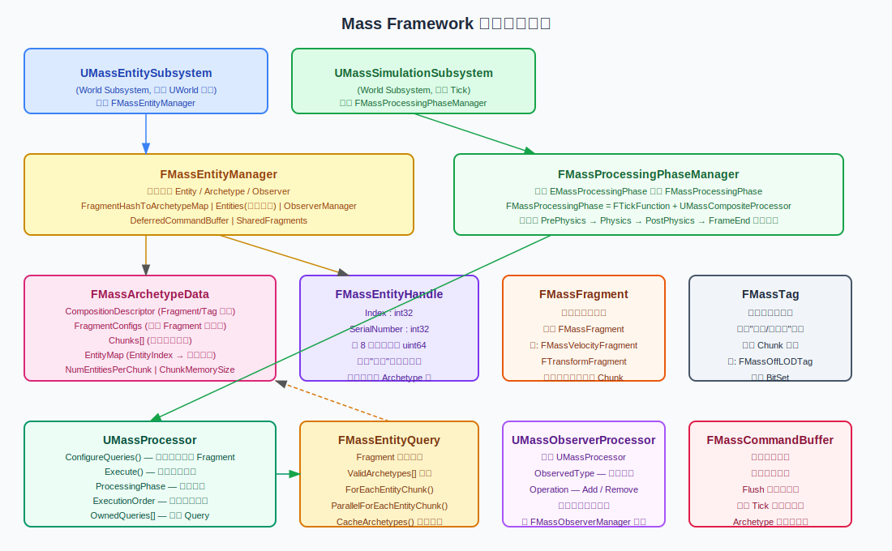
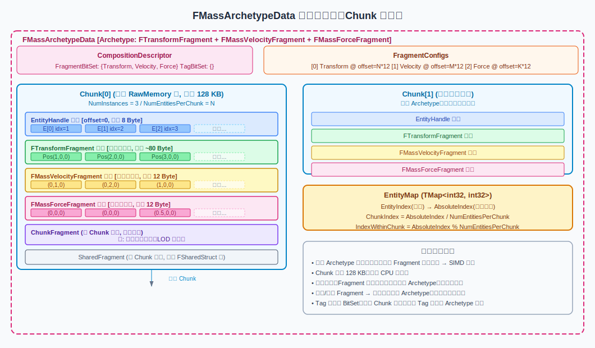
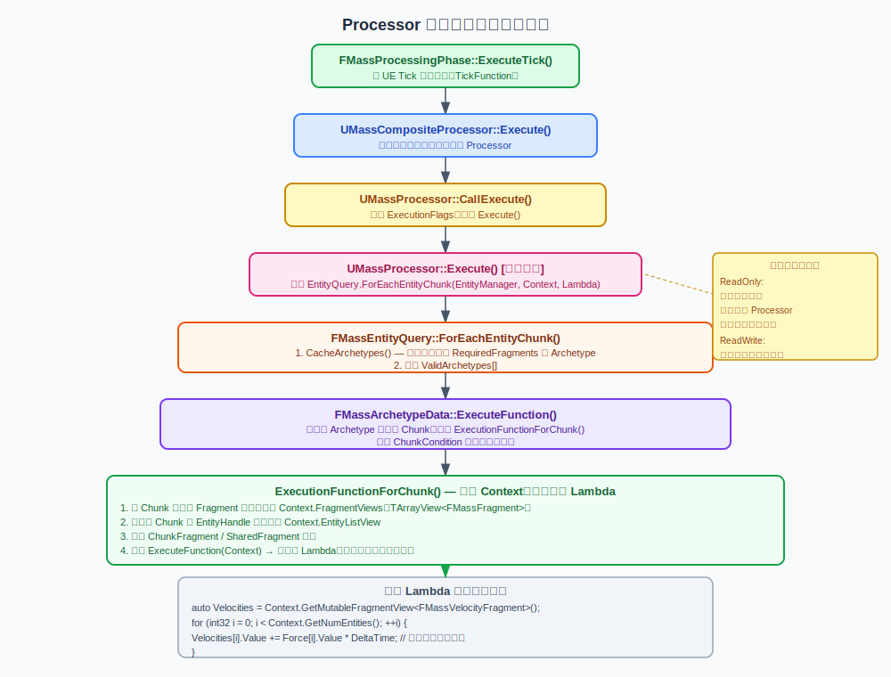
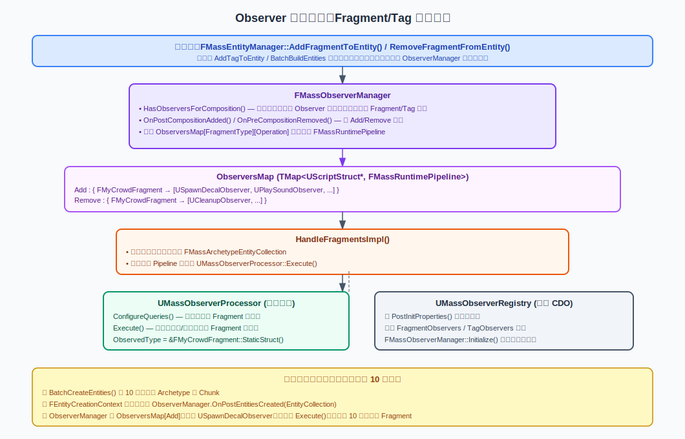
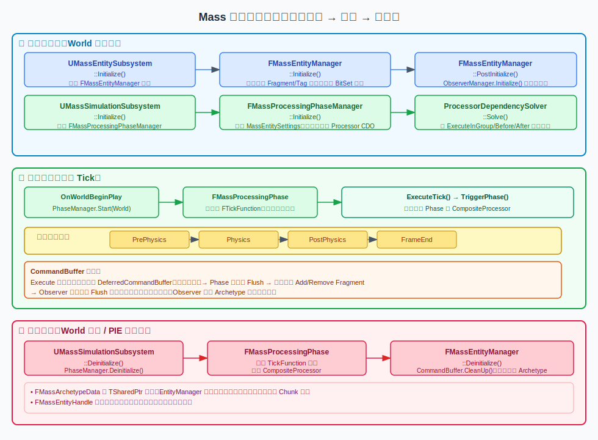
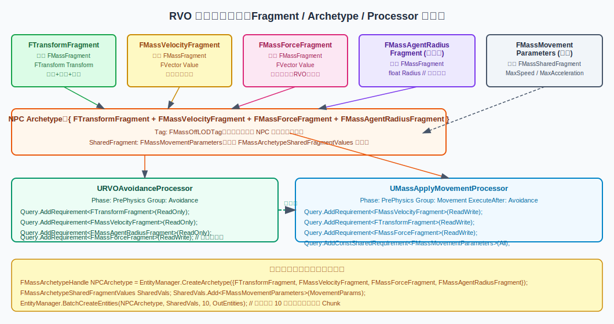
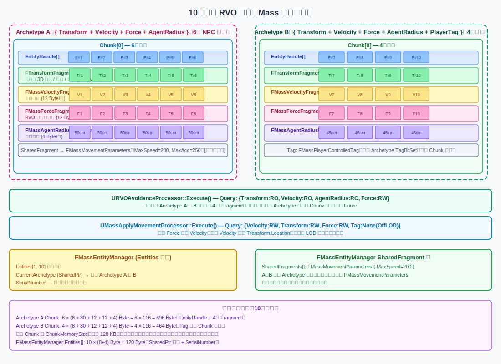

# UE5 Mass Framework 深度解析

> 源码路径：`Engine/Plugins/Runtime/MassEntity/Source/MassEntity`  
> 所属模块：`MassEntity`、`MassGameplay`（子模块 MassMovement、MassSimulation 等）  
> 引擎版本：UE 5.4.4

---

## 目录

- [UE5 Mass Framework 深度解析](#ue5-mass-framework-深度解析)
  - [目录](#目录)
  - [1. Mass 是什么？为什么需要它？](#1-mass-是什么为什么需要它)
    - [通俗理解](#通俗理解)
  - [2. 核心数据结构详解](#2-核心数据结构详解)
    - [2.1 FMassEntityHandle（实体句柄）](#21-fmassentityhandle实体句柄)
    - [2.2 FMassFragment 及其变体](#22-fmassfragment-及其变体)
    - [2.3 FMassArchetypeData（原型数据）](#23-fmassarchetypedata原型数据)
    - [2.4 FMassArchetypeCompositionDescriptor](#24-fmassarchetypecompositiondescriptor)
    - [2.5 FMassArchetypeChunk（内存块）](#25-fmassarchetypechunk内存块)
    - [2.6 FMassEntityQuery（查询）](#26-fmassentityquery查询)
    - [2.7 FMassExecutionContext（执行上下文）](#27-fmassexecutioncontext执行上下文)
  - [3. 核心概念使用方法](#3-核心概念使用方法)
    - [3.1 Fragment 的定义与使用](#31-fragment-的定义与使用)
    - [3.2 Tag 的定义与使用](#32-tag-的定义与使用)
    - [3.3 Archetype 的作用与创建](#33-archetype-的作用与创建)
    - [3.4 Processor 详解——核心执行单元](#34-processor-详解核心执行单元)
    - [3.5 Observer 详解——响应成分变化](#35-observer-详解响应成分变化)
  - [4. Manager 与 Subsystem 详解](#4-manager-与-subsystem-详解)
    - [4.1 UMassEntitySubsystem](#41-umassentitysubsystem)
    - [4.2 FMassEntityManager](#42-fmassentitymanager)
    - [4.3 UMassSimulationSubsystem](#43-umasssimulationsubsystem)
    - [4.4 FMassProcessingPhaseManager](#44-fmassprocessingphasemanager)
    - [4.5 初始化、运行、销毁全流程](#45-初始化运行销毁全流程)
      - [初始化阶段](#初始化阶段)
      - [每帧运行阶段](#每帧运行阶段)
      - [销毁阶段](#销毁阶段)
  - [5. RVO 避障完整示例](#5-rvo-避障完整示例)
    - [5.1 Fragment 定义](#51-fragment-定义)
    - [5.2 Archetype 与 Entity 创建](#52-archetype-与-entity-创建)
    - [5.3 Processor 实现](#53-processor-实现)
  - [6. 10个角色场景：内存分布图解](#6-10个角色场景内存分布图解)
    - [Archetype 分组](#archetype-分组)
    - [Chunk 内存布局（以 Archetype A 为例）](#chunk-内存布局以-archetype-a-为例)
    - [Processor 访问两个 Archetype](#processor-访问两个-archetype)
    - [SharedFragment 共享](#sharedfragment-共享)
  - [7. Observer 详细案例](#7-observer-详细案例)
    - [案例场景](#案例场景)
    - [注册流程（PostInitProperties 阶段）](#注册流程postinitproperties-阶段)
    - [触发流程（运行时）](#触发流程运行时)
    - [批量创建时的 Observer](#批量创建时的-observer)
    - [Observer 的完整使用总结](#observer-的完整使用总结)

---

## 1. Mass 是什么？为什么需要它？

### 通俗理解

想象一个游戏场景里有 **10,000 个士兵 NPC**，每个士兵都需要：
- 记录位置
- 记录速度
- 计算是否与其他士兵碰撞
- 移动到目标点

传统做法：每个士兵是一个 `AActor`，放在场景里。但是当 Actor 数量达到数千时，UE 的 Actor 系统开销会急剧增大（每个 Actor 都有 `Tick`、反射、垃圾回收……）。

**Mass** 采用了 **ECS（Entity-Component-System）** 思想：
- **Entity（实体）**：只是一个数字编号，就像学生的学号，**本身不含任何数据**
- **Fragment（片段，相当于 ECS 中的 Component）**：数据容器，只存纯数据（位置、速度等）
- **Processor（处理器，相当于 ECS 中的 System）**：逻辑代码，批量处理 Entity 的 Fragment 数据
- **Archetype（原型）**：把 Fragment 组合相同的 Entity 放在一起，实现连续内存存储

**核心优势**：同类 Fragment 在内存中连续存放 → CPU 缓存命中率高 → 大量实体处理速度快（可比传统 Actor 快 10~100 倍）

---

## 2. 核心数据结构详解



### 2.1 FMassEntityHandle（实体句柄）

**源码**：`MassEntityTypes.h`

```cpp
struct alignas(8) FMassEntityHandle
{
    int32 Index = 0;          // 在 EntityManager.Entities 数组中的下标
    int32 SerialNumber = 0;   // 序列号，用于校验句柄是否仍有效
};
```

**关键理解**：
- `FMassEntityHandle` 只是一对整数，**不含任何业务数据**，总大小 8 字节
- `Index` 是全局实体数组的下标，通过它可以找到该实体当前所属的 `Archetype`
- `SerialNumber` 是"版本号"。当某个 Index 对应的实体被销毁后，SerialNumber 会改变。旧的 Handle 拿着旧的 SerialNumber 再使用时会被识别为"无效句柄"，防止使用已释放的实体
- `IsSet()` 检查两个字段都非零（因为 Index=0 被保留为无效值）

> **现实类比**：就像超市的取号单。号码（Index）指向你在队伍中的位置，序列号是当天的日期（SerialNumber）——昨天的号今天不能用

### 2.2 FMassFragment 及其变体

**源码**：`MassEntityTypes.h`

Mass 提供四种数据类型基类，每种用途不同：

| 基类 | 继承方式 | 用途 | 每实体/每块 | 占 Chunk 内存？ |
|------|---------|------|-------------|----------------|
| `FMassFragment` | `struct MyFrag : public FMassFragment` | 实体级别数据（位置、速度…） | 每实体一份 | ✅ 是 |
| `FMassTag` | `struct MyTag : public FMassTag` | 纯标记，无数据（如"已死亡"、"在 LOD 范围外"） | 每实体一份（位标记） | ❌ 否，存在 BitSet |
| `FMassChunkFragment` | `struct MyChunk : public FMassChunkFragment` | 每个 Chunk 一份的数据（如该 Chunk 内的导航网格缓存） | 每 Chunk 一份 | ✅ 是（但每 Chunk 仅一份） |
| `FMassSharedFragment` | `struct MyShared : public FMassSharedFragment` | 多实体共享的配置（如 MaxSpeed 参数） | 跨 Chunk/Archetype 共享 | ❌ 否，存于外部池 |

> **⚠️ 关键**：`FMassTag` 子类**不应包含任何成员变量**（源码注释明确说明）。它只做"有无"判断。

**已有例子（来自 MassMovement 源码）**：
```cpp
// Fragment：速度数据
struct FMassVelocityFragment : public FMassFragment {
    FVector Value = FVector::ZeroVector;  // 速度向量
};

// Fragment：合力数据  
struct FMassForceFragment : public FMassFragment {
    FVector Value = FVector::ZeroVector;  // 本帧施加的力
};

// SharedFragment：运动参数（所有实体共享一份）
struct FMassMovementParameters : public FMassSharedFragment {
    float MaxSpeed = 200.f;          // 最大速度 cm/s
    float MaxAcceleration = 250.f;   // 最大加速度 cm/s²
    // ... 更多参数
};
```

### 2.3 FMassArchetypeData（原型数据）

**源码**：`MassArchetypeData.h`（Private）

```cpp
struct FMassArchetypeData
{
private:
    FMassArchetypeCompositionDescriptor CompositionDescriptor;  // Fragment/Tag 集合描述
    TArray<FInstancedStruct> ChunkFragmentsTemplate;            // ChunkFragment 模板
    TArray<FMassArchetypeFragmentConfig, TInlineAllocator<16>> FragmentConfigs; // 每种 Fragment 在 Chunk 中的偏移
    TArray<FMassArchetypeChunk> Chunks;                         // 实际存储数据的内存块数组
    TMap<int32, int32> EntityMap;                               // 实体全局Index → Chunk内绝对位置
    TMap<const UScriptStruct*, int32> FragmentIndexMap;         // Fragment 类型 → FragmentConfigs 下标
    int32 NumEntitiesPerChunk;                                  // 每个 Chunk 最多放几个实体
    SIZE_T TotalBytesPerEntity = 0;                             // 每个实体占用多少字节
    int32 EntityListOffsetWithinChunk;                          // EntityHandle 数组的起始偏移（固定为 0）
    const SIZE_T ChunkMemorySize = 0;                           // Chunk 总大小（默认 128 KB）
};
```

**关键字段说明**：

- **`FragmentConfigs`**：数组，每项对应一种 Fragment 类型。其中 `ArrayOffsetWithinChunk` 记录该 Fragment 数组在 Chunk 内存块中的起始偏移字节数。通过"起始偏移 + 实体在 Chunk 内的索引 × 该类型大小"即可定位任一实体的某 Fragment 数据
- **`EntityMap`**：`TMap<int32, int32>`，键是 Entity 的全局 `Index`，值是"绝对位置"（`AbsoluteIndex`）。然后：`ChunkIndex = AbsoluteIndex / NumEntitiesPerChunk`，`IndexWithinChunk = AbsoluteIndex % NumEntitiesPerChunk`
- **`NumEntitiesPerChunk`**：在 `ConfigureFragments()` 中计算：`NumEntitiesPerChunk = (ChunkMemorySize - 对齐填充) / 每实体字节数`
- **相同组成唯一化**：在 `FMassEntityManager::CreateArchetype()` 中，通过对 `CompositionDescriptor` 计算哈希后查找 `FragmentHashToArchetypeMap`，相同组成的 Archetype 只创建一次

### 2.4 FMassArchetypeCompositionDescriptor

**源码**：`MassEntityTypes.h`

```cpp
struct FMassArchetypeCompositionDescriptor
{
    FMassFragmentBitSet   Fragments;        // 该 Archetype 包含哪些 Fragment 类型
    FMassTagBitSet        Tags;             // 该 Archetype 包含哪些 Tag 类型
    FMassChunkFragmentBitSet  ChunkFragments;
    FMassSharedFragmentBitSet SharedFragments;
};
```

`FMassFragmentBitSet` 是一个固定大小的位图（BitSet），每一位对应一种 Fragment 类型（通过 `UScriptStruct` 的唯一 ID 映射）。

**用途**：
- Archetype 之间的比较（`IsEquivalent`）
- Query 进行 Archetype 筛选（`HasAll` 检查是否包含所有必需 Fragment）
- 运行时快速判断是否需要通知 Observer（`HasObserversForComposition`）

### 2.5 FMassArchetypeChunk（内存块）

**源码**：`MassArchetypeData.h`（Private）

```cpp
struct FMassArchetypeChunk
{
private:
    uint8* RawMemory = nullptr;       // 裸内存指针（malloc 分配）
    SIZE_T AllocSize = 0;             // 分配的字节数（等于 ChunkMemorySize）
    int32 NumInstances = 0;           // 当前放了多少个实体（有效实体数）
    int32 SerialModificationNumber;   // 修改计数器，用于检测 Chunk 是否在处理过程中被修改
    TArray<FInstancedStruct> ChunkFragmentData;         // 该 Chunk 的 ChunkFragment 数据
    FMassArchetypeSharedFragmentValues SharedFragmentValues; // 指向共享 Fragment 的值
};
```

**内存布局**（由 `ConfigureFragments()` 计算，从 `MassArchetypeData.cpp` 第 143 行起）：

```
[ EntityHandle[0..N-1] ]          // 偏移 0，每项 8 Byte
[ Fragment_A[0..N-1] ]            // 对齐后紧接，每项 sizeof(Fragment_A) Byte
[ Fragment_B[0..N-1] ]            // 对齐后紧接，每项 sizeof(Fragment_B) Byte
[ Fragment_C[0..N-1] ]            // ...
```

其中 Fragment 类型按类名排序后再排列（`SortedFragmentList.Sort(FScriptStructSortOperator())`），保证同一组 Fragment 的 Archetype 布局完全一致。



### 2.6 FMassEntityQuery（查询）

**源码**：`MassEntityQuery.h`

`FMassEntityQuery` 继承自 `FMassFragmentRequirements` 和 `FMassSubsystemRequirements`，是 Processor 用来"声明所需 Fragment 并批量迭代匹配实体"的核心工具。

```cpp
struct FMassEntityQuery : public FMassFragmentRequirements, public FMassSubsystemRequirements
{
    // 内部缓存：所有匹配此 Query 需求的 Archetype
    TArray<FMassArchetypeHandle> ValidArchetypes;
    TArray<FMassQueryRequirementIndicesMapping> ArchetypeFragmentMapping;
    uint32 EntitySubsystemHash = 0;
    uint32 LastUpdatedArchetypeDataVersion = 0;
    // ...
};
```

**关键方法**：
- `AddRequirement<T>(EMassFragmentAccess, EMassFragmentPresence)`：声明需要哪种 Fragment，以及是读还是写
- `CacheArchetypes(EntityManager)`：扫描 EntityManager 中所有已注册的 Archetype，找出符合条件的，缓存到 `ValidArchetypes`（只有 Archetype 增加时才会重新扫描，通过 `ArchetypeDataVersion` 版本号控制）
- `ForEachEntityChunk(EntityManager, Context, Lambda)`：迭代所有 `ValidArchetypes` 的每个 Chunk，为 Lambda 填好 `Context` 后调用

**`EMassFragmentPresence` 四种过滤模式**：

| 枚举值 | 含义 | 使用场景 |
|--------|------|---------|
| `All` | 该 Fragment 必须存在 | 必须处理某类数据 |
| `Any` | 列出的多个 Fragment 至少有一个存在 | 多类型通用处理 |
| `None` | 该 Fragment **不能**存在 | 排除特殊实体，如排除 `FMassOffLODTag` 表示只处理视野内实体 |
| `Optional` | 有则使用，无则跳过 | 某些实体可选带某 Fragment |

**`EMassFragmentAccess` 读写权限**（来自 `MassRequirements.h`）：

| 枚举值 | 含义 |
|--------|------|
| `ReadOnly` | 只读，不会获取写指针，允许多个 Processor 并行读 |
| `ReadWrite` | 读写，独占访问，不允许其他 Processor 同时写同一 Fragment |

**读写权限的作用**：Mass 的 Processor 可以并行执行（在多个线程上同时运行）。如果多个 Processor 都把某 Fragment 设置为 `ReadOnly`，它们可以安全地并行；如果任一 Processor 使用 `ReadWrite`，Mass 会通过依赖检查确保这些 Processor 不会同时访问同一 Fragment（见 `MassRequirementAccessDetector.h`），防止数据竞争。

### 2.7 FMassExecutionContext（执行上下文）

**源码**：`MassExecutionContext.h`

`FMassExecutionContext` 是 Processor 的 Execute 函数和用户 Lambda 接收到的"工具箱"，每次处理一个 Chunk 时创建/填充一次。

**关键字段**（从源码读取）：
```cpp
struct FMassExecutionContext
{
    TArray<TFragmentView<TArrayView<FMassFragment>>, TInlineAllocator<8>> FragmentViews;  // 各 Fragment 的内存视图
    TArray<TFragmentView<FStructView>, TInlineAllocator<4>> ChunkFragmentViews;
    TArray<TFragmentView<FConstStructView>, TInlineAllocator<4>> ConstSharedFragmentViews;
    TSharedPtr<FMassCommandBuffer> DeferredCommandBuffer;   // 延迟命令缓冲（线程安全）
    TArrayView<FMassEntityHandle> EntityListView;           // 当前 Chunk 的实体列表
    float DeltaTimeSeconds;                                 // 帧时间
    int32 ChunkSerialModificationNumber;                    // Chunk 修改版本号
    // ...
};
```

**用户常用方法**：
```cpp
// 获取可写的 Fragment 数组视图
TArrayView<FMassVelocityFragment> Velocities = Context.GetMutableFragmentView<FMassVelocityFragment>();

// 获取只读 Fragment 视图
TConstArrayView<FTransformFragment> Transforms = Context.GetFragmentView<FTransformFragment>();

// 获取只读共享 Fragment
const FMassMovementParameters& Params = Context.GetConstSharedFragment<FMassMovementParameters>();

// 获取当前 Chunk 内的实体数量
int32 NumEntities = Context.GetNumEntities();

// 获取延迟命令缓冲（用于在处理期间安全地添加/删除 Fragment）
FMassCommandBuffer& CmdBuffer = Context.Defer();
```

---

## 3. 核心概念使用方法

### 3.1 Fragment 的定义与使用

**定义**：继承 `FMassFragment`，添加你需要的成员，加上 `USTRUCT()` 宏：

```cpp
// MyFragments.h
#pragma once
#include "MassEntityTypes.h"
#include "MyFragments.generated.h"

// 位置 Fragment（实际使用时用 FTransformFragment，这里仅作演示）
USTRUCT()
struct FMyPositionFragment : public FMassFragment
{
    GENERATED_BODY()
    FVector Location = FVector::ZeroVector;
};

// 速度 Fragment
USTRUCT()
struct FMyVelocityFragment : public FMassFragment
{
    GENERATED_BODY()
    FVector Velocity = FVector::ZeroVector;
};
```

**使用注意事项**：
- 必须加 `GENERATED_BODY()`，否则 UE 反射系统无法识别该类型
- 不要在 Fragment 中写逻辑代码（方法），Fragment 只是纯数据容器
- Fragment 越小越好（减少每实体内存占用，提高 Chunk 容量，改善缓存效率）

### 3.2 Tag 的定义与使用

```cpp
// 表示实体处于"不可见"状态的 Tag
USTRUCT()
struct FMyInvisibleTag : public FMassTag
{
    GENERATED_BODY()
    // 不要在这里写任何成员变量！
};
```

添加/移除 Tag：
```cpp
// 添加 Tag（会触发 Archetype 迁移，并可能触发 Observer）
EntityManager.AddTagToEntity(EntityHandle, FMyInvisibleTag::StaticStruct());

// 移除 Tag
EntityManager.RemoveTagFromEntity(EntityHandle, FMyInvisibleTag::StaticStruct());
```

在 Query 中使用 Tag 过滤：
```cpp
// 只处理没有 FMyInvisibleTag 的实体
EntityQuery.AddTagRequirement<FMyInvisibleTag>(EMassFragmentPresence::None);
```

### 3.3 Archetype 的作用与创建

**Archetype（原型）** 是"Fragment 类型集合"的具体化容器。所有 Fragment 组合相同的实体，都被 Mass 自动归类到同一个 Archetype 中。

> **现实类比**：想象一个学校，所有选修了"语文+数学+体育"课程的学生在同一间教室（Archetype）；选修"语文+数学+英语"的学生在另一间教室。教室（Archetype）按课程组合（Fragment 组合）划分，同一间教室里的学生学的课程完全相同。

**创建 Archetype（通常由代码自动完成）**：
```cpp
// 方式1：直接传入 Fragment 类型列表
FMassArchetypeHandle ArchetypeHandle = EntityManager.CreateArchetype(
    { FTransformFragment::StaticStruct(), FMassVelocityFragment::StaticStruct() }
);

// 方式2：通过 CompositionDescriptor
FMassArchetypeCompositionDescriptor Desc;
Desc.Fragments.Add<FTransformFragment>();
Desc.Fragments.Add<FMassVelocityFragment>();
Desc.Tags.Add<FMyCoolTag>();
FMassArchetypeHandle ArchetypeHandle = EntityManager.CreateArchetype(Desc);
```

**重要**：同一组 Fragment 不会产生两个 Archetype。`CreateArchetype` 内部会通过哈希查表，如果已存在等价的 Archetype 则直接返回已有的 Handle。

**添加/删除 Fragment 会导致实体在 Archetype 间迁移**（`MoveEntityToAnotherArchetype`），将实体数据从旧 Archetype 的 Chunk 复制到新 Archetype 的 Chunk，**这个操作有开销**，因此不建议频繁在 Tick 中动态添加/删除 Fragment；更好的做法是通过 Tag 做状态标记，或把变化收集到 CommandBuffer 后批量执行。

### 3.4 Processor 详解——核心执行单元

**Processor** 是每帧执行逻辑的地方，相当于传统代码中的"系统"或"行为逻辑"。



**定义 Processor 的步骤**：

**步骤一**：继承 `UMassProcessor`
```cpp
// MyMovementProcessor.h
#pragma once
#include "MassProcessor.h"
#include "MyMovementProcessor.generated.h"

UCLASS()
class UMyMovementProcessor : public UMassProcessor
{
    GENERATED_BODY()
public:
    UMyMovementProcessor();

protected:
    virtual void ConfigureQueries() override;     // 声明需要哪些 Fragment
    virtual void Execute(FMassEntityManager& EntityManager, FMassExecutionContext& Context) override;

private:
    FMassEntityQuery EntityQuery;    // 成员变量，必须在构造函数中注册
};
```

**步骤二**：在构造函数中设置执行阶段和顺序
```cpp
// MyMovementProcessor.cpp
UMyMovementProcessor::UMyMovementProcessor()
    : EntityQuery(*this)    // 将 Query 注册到此 Processor
{
    // 设置在哪个阶段执行（PrePhysics / Physics / PostPhysics / FrameEnd）
    ProcessingPhase = EMassProcessingPhase::PrePhysics;
    
    // 设置执行分组（用于排序）
    ExecutionOrder.ExecuteInGroup = TEXT("Movement");
    ExecutionOrder.ExecuteAfter.Add(TEXT("Avoidance"));  // 在 Avoidance 组之后运行
    
    // 设置在哪些网络模式下运行（Server / Client / Standalone）
    ExecutionFlags = (int32)EProcessorExecutionFlags::AllNetModes;
    
    // 自动注册到全局处理管线（默认 true）
    bAutoRegisterWithProcessingPhases = true;
}
```

**步骤三**：在 `ConfigureQueries()` 中声明 Fragment 需求
```cpp
void UMyMovementProcessor::ConfigureQueries()
{
    // 声明需要 FTransformFragment，读写模式（会修改位置）
    EntityQuery.AddRequirement<FTransformFragment>(EMassFragmentAccess::ReadWrite);
    
    // 声明需要 FMassVelocityFragment，读写模式（会更新速度）
    EntityQuery.AddRequirement<FMassVelocityFragment>(EMassFragmentAccess::ReadWrite);
    
    // 声明需要 FMassForceFragment，读写模式（读取力，清零后写回）
    EntityQuery.AddRequirement<FMassForceFragment>(EMassFragmentAccess::ReadWrite);
    
    // 排除带有 FMassOffLODTag 的实体（那些实体不在视野内，跳过处理）
    EntityQuery.AddTagRequirement<FMassOffLODTag>(EMassFragmentPresence::None);
    
    // 需要只读的 SharedFragment（运动参数配置）
    EntityQuery.AddConstSharedRequirement<FMassMovementParameters>(EMassFragmentPresence::All);
    
    // 将 Query 注册到 Processor
    RegisterQuery(EntityQuery);
}
```

**步骤四**：在 `Execute()` 中实现每帧逻辑
```cpp
void UMyMovementProcessor::Execute(FMassEntityManager& EntityManager, FMassExecutionContext& Context)
{
    // 限制最大 DeltaTime，防止初始化时步长过大
    const float DeltaTime = FMath::Min(0.1f, Context.GetDeltaTimeSeconds());
    
    // ForEachEntityChunk 是核心：自动遍历所有符合条件的 Archetype 的每个 Chunk
    EntityQuery.ForEachEntityChunk(EntityManager, Context,
        [DeltaTime](FMassExecutionContext& Context)
        {
            // 获取当前 Chunk 中的 Fragment 数组（直接是连续内存的视图）
            const int32 NumEntities = Context.GetNumEntities();
            
            // 获取共享 Fragment（const，跨 Chunk 共享）
            const FMassMovementParameters& Params = Context.GetConstSharedFragment<FMassMovementParameters>();
            
            // 获取各 Fragment 的数组视图（可写）
            TArrayView<FTransformFragment>      LocationList  = Context.GetMutableFragmentView<FTransformFragment>();
            TArrayView<FMassForceFragment>      ForceList     = Context.GetMutableFragmentView<FMassForceFragment>();
            TArrayView<FMassVelocityFragment>   VelocityList  = Context.GetMutableFragmentView<FMassVelocityFragment>();
            
            // 循环处理每个实体（i 是 Chunk 内的索引）
            for (int32 i = 0; i < NumEntities; ++i)
            {
                FMassForceFragment&     Force    = ForceList[i];
                FMassVelocityFragment&  Velocity = VelocityList[i];
                FTransform& Transform = LocationList[i].GetMutableTransform();
                
                // 用力更新速度（F=ma，这里简化 m=1）
                Velocity.Value += Force.Value * DeltaTime;
                
                // 限制最大速度
                Velocity.Value = Velocity.Value.GetClampedToMaxSize(Params.MaxSpeed);
                
                // 用速度更新位置
                FVector Location = Transform.GetLocation();
                Location += Velocity.Value * DeltaTime;
                Transform.SetTranslation(Location);
                
                // 清零合力（每帧重新计算）
                Force.Value = FVector::ZeroVector;
            }
        });
}
```

**Processor 如何与 Entity/Fragment 绑定的完整链路**：

1. `ConfigureQueries()` 调用 `EntityQuery.AddRequirement<T>()` → 记录到 `FragmentRequirements` 数组
2. `ForEachEntityChunk()` 调用 `CacheArchetypes()` → 扫描 EntityManager 的 `AllArchetypes`，检查每个 Archetype 的 `CompositionDescriptor` 是否包含了 Query 声明的所有必需 Fragment → 符合的存入 `ValidArchetypes`
3. 对每个 `ValidArchetype`，调用 `FMassArchetypeData::ExecuteFunction()` → 遍历该 Archetype 的每个 Chunk
4. 对每个 Chunk，调用 `ExecutionFunctionForChunk()` → 将各 Fragment 的内存地址填入 `Context.FragmentViews` → 调用用户 Lambda
5. 用户 Lambda 通过 `Context.GetMutableFragmentView<T>()` 获取直接指向 Chunk 内存的 `TArrayView<T>` → 零拷贝直接操作数据

### 3.5 Observer 详解——响应成分变化

**Observer（观察者）** 用于在实体的 Fragment 或 Tag 被添加/删除时自动触发回调逻辑。



**定义 Observer Processor**：

```cpp
// MySpawnEffectObserver.h
UCLASS()
class UMySpawnEffectObserver : public UMassObserverProcessor
{
    GENERATED_BODY()
public:
    UMySpawnEffectObserver();

protected:
    virtual void ConfigureQueries() override;
    virtual void Execute(FMassEntityManager& EntityManager, FMassExecutionContext& Context) override;

private:
    FMassEntityQuery EntityQuery;
};
```

```cpp
// MySpawnEffectObserver.cpp
UMySpawnEffectObserver::UMySpawnEffectObserver()
    : EntityQuery(*this)
{
    // 声明监听：当 FMyHealthFragment 被添加（Add）到实体时触发
    ObservedType = FMyHealthFragment::StaticStruct();
    Operation = EMassObservedOperation::Add;
    
    bAutoRegisterWithObserverRegistry = true;  // 自动注册（默认 true）
}

void UMySpawnEffectObserver::ConfigureQueries()
{
    // 这里声明的是在 Observer 被触发时，需要从受影响的实体中读取哪些 Fragment
    EntityQuery.AddRequirement<FTransformFragment>(EMassFragmentAccess::ReadOnly);
    EntityQuery.AddRequirement<FMyHealthFragment>(EMassFragmentAccess::ReadOnly);
    RegisterQuery(EntityQuery);
}

void UMySpawnEffectObserver::Execute(FMassEntityManager& EntityManager, FMassExecutionContext& Context)
{
    EntityQuery.ForEachEntityChunk(EntityManager, Context,
        [](FMassExecutionContext& Context)
        {
            TConstArrayView<FTransformFragment> Transforms = Context.GetFragmentView<FTransformFragment>();
            TConstArrayView<FMyHealthFragment>  Healths    = Context.GetFragmentView<FMyHealthFragment>();
            
            for (int32 i = 0; i < Context.GetNumEntities(); ++i)
            {
                // 在该位置播放生成特效（通过 CommandBuffer 延迟到帧末执行）
                const FVector& SpawnPos = Transforms[i].GetTransform().GetLocation();
                // ... 播放粒子效果、音效等
            }
        });
}
```

---

## 4. Manager 与 Subsystem 详解

### 4.1 UMassEntitySubsystem

**源码**：`MassEntitySubsystem.h`

```cpp
UCLASS()
class UMassEntitySubsystem : public UMassSubsystemBase
{
    // 持有一个 FMassEntityManager 的共享指针
    TSharedPtr<FMassEntityManager> EntityManager;
public:
    const FMassEntityManager& GetEntityManager() const;
    FMassEntityManager& GetMutableEntityManager();
};
```

`UMassEntitySubsystem` 是 `UWorldSubsystem`（世界子系统）的子类，**每个 UWorld 实例自动创建一个**，生命周期随 World。

它的唯一职责：**持有并管理 `FMassEntityManager` 实例**。所有 Mass 用户代码通过此 Subsystem 拿到 EntityManager 引用：

```cpp
// 获取 EntityManager 的方式
UMassEntitySubsystem* EntitySubsystem = UWorld::GetSubsystem<UMassEntitySubsystem>(GetWorld());
FMassEntityManager& EntityManager = EntitySubsystem->GetMutableEntityManager();
```

**初始化流程**：
1. `UMassEntitySubsystem::Initialize()` → 创建 `FMassEntityManager` 实例
2. `UMassEntitySubsystem::PostInitialize()` → 调用 `EntityManager->PostInitialize()`（在所有 Subsystem 初始化完成后，确保 ObserverManager 可以访问其他 Subsystem）

### 4.2 FMassEntityManager

**源码**：`MassEntityManager.h`，`MassEntityManager.cpp`

这是 Mass 的**核心数据管理器**，存储了所有实体、Archetype 和共享数据：

```cpp
struct FMassEntityManager : public TSharedFromThis<FMassEntityManager>, public FGCObject
{
    // 实体数组（分块 TChunkedArray，支持高效插入）
    // Entities[0] 保留为无效，Entities[1] 开始存有效实体
    TChunkedArray<FEntityData> Entities;
    
    // 空闲实体索引池（被销毁的实体的 Index 放这里，下次创建时复用）
    TArray<int32> EntityFreeIndexList;
    
    // Archetype 查找表：CompositionHash → [FMassArchetypeData]
    TMap<uint32, TArray<TSharedPtr<FMassArchetypeData>>> FragmentHashToArchetypeMap;
    
    // 所有 Archetype（按创建顺序，用于版本化查询缓存）
    TArray<TSharedPtr<FMassArchetypeData>> AllArchetypes;
    uint32 ArchetypeDataVersion = 0;   // 每新增 Archetype 自增，用于触发 Query 缓存更新
    
    // Observer 管理器
    FMassObserverManager ObserverManager;
    
    // 共享 Fragment 池（唯一化存储）
    TArray<FConstSharedStruct> ConstSharedFragments;
    TArray<FSharedStruct> SharedFragments;
    
    // 全局命令缓冲（线程安全，Tick 结束后刷新）
    TSharedPtr<FMassCommandBuffer> DeferredCommandBuffer;
};
```

**`FEntityData` 内部结构**（私有）：
```cpp
struct FEntityData
{
    TSharedPtr<FMassArchetypeData> CurrentArchetype;  // 该实体当前所属 Archetype
    int32 SerialNumber = 0;                           // 序列号
};
```

**`FMassEntityManager` 管理 Fragment 的原理**：

Fragment 数据**不存在 FEntityData 里**，而是在实体所属 Archetype 的 Chunk 中。`FEntityData` 只存一个指向 Archetype 的 SharedPtr 和序列号。实际数据定位流程：
1. `FMassEntityHandle.Index` → `EntityManager.Entities[Index]` → `FEntityData.CurrentArchetype`（找到 Archetype）
2. `FMassArchetypeData.EntityMap[Index]` → `AbsoluteIndex` → `ChunkIndex` + `IndexWithinChunk`（找到 Chunk 和行号）
3. `Chunk.RawMemory + FragmentConfig.ArrayOffsetWithinChunk + IndexWithinChunk * sizeof(Fragment)` → Fragment 数据指针

**主要 API**：

| 方法 | 作用 |
|------|------|
| `CreateArchetype(...)` | 注册一个新的 Archetype（同组合只创建一次） |
| `CreateEntity(ArchetypeHandle, ...)` | 创建一个新实体，分配到对应 Archetype 的 Chunk |
| `BatchCreateEntities(...)` | 批量创建 N 个实体，性能更高 |
| `DestroyEntity(Entity)` | 销毁实体，释放 Chunk 中的槽位，Index 放回 FreeList |
| `AddFragmentToEntity(Entity, ...)` | 添加 Fragment → 迁移到新 Archetype |
| `RemoveFragmentFromEntity(Entity, ...)` | 删除 Fragment → 迁移到新 Archetype |
| `AddTagToEntity(Entity, ...)` | 添加 Tag → 迁移到新 Archetype（同样改变组合） |
| `Defer()` | 获取 DeferredCommandBuffer，用于延迟执行成分修改 |

### 4.3 UMassSimulationSubsystem

**源码**：`MassSimulationSubsystem.h`

`UMassSimulationSubsystem` 也是 `UWorldSubsystem`，它的职责是**驱动 Mass 每帧的 Processor 执行**：

```cpp
UCLASS()
class UMassSimulationSubsystem : public UMassSubsystemBase
{
    TSharedPtr<FMassEntityManager> EntityManager;    // 引用 EntitySubsystem 的 EntityManager
    FMassProcessingPhaseManager PhaseManager;        // 核心：处理阶段管理器
    FMassRuntimePipeline RuntimePipeline;            // 当前运行的 Processor 管线
    bool bSimulationStarted = false;
};
```

**初始化流程**：
1. `Initialize()` → 读取 `UMassEntitySettings` 配置 → 创建 `PhaseManager` → 收集所有 `bAutoRegisterWithProcessingPhases=true` 的 Processor CDO
2. `PostInitialize()` → `PhaseManager.Initialize()` → `ProcessorDependencySolver.Solve()` 建立依赖图 → 分配每个 Phase 的 `UMassCompositeProcessor`
3. `OnWorldBeginPlay()` → `StartSimulation()` → `PhaseManager.Start(World)` → 向 World 注册 `FMassProcessingPhase` 为 Tick 函数

### 4.4 FMassProcessingPhaseManager

**源码**：`MassProcessingPhaseManager.h`

`FMassProcessingPhaseManager` 持有 `EMassProcessingPhase` 枚举值对应的若干 `FMassProcessingPhase` 实例（源码中共有 PrePhysics / Physics / PostPhysics / FrameEnd 四个阶段）。

**`FMassProcessingPhase`** 继承自 `FTickFunction`（UE 引擎的 Tick 回调接口）：
```cpp
struct FMassProcessingPhase : public FTickFunction
{
    TObjectPtr<UMassCompositeProcessor> PhaseProcessor;   // 该阶段的组合 Processor
    EMassProcessingPhase Phase;
    // ...
protected:
    virtual void ExecuteTick(float DeltaTime, ...) override;  // 触发 PhaseProcessor->Execute()
};
```

每帧 UE 的 Tick 系统会依次调用各 `FMassProcessingPhase::ExecuteTick()`，执行该阶段的 `UMassCompositeProcessor`，而 `UMassCompositeProcessor` 按依赖图顺序调用其子 Processor。

**处理阶段排序**（从 `FMassProcessingPhase::Initialize` 注册的 TickGroup）：
- `PrePhysics`：物理模拟前（RVO 计算、输入处理）
- `Physics`：物理模拟期间
- `PostPhysics`：物理模拟后（位置同步等）
- `FrameEnd`：帧末（LOD 更新、清理等）

### 4.5 初始化、运行、销毁全流程



**详细步骤解析**：

#### 初始化阶段

```
UMassEntitySubsystem::Initialize()
  └─ new FMassEntityManager()
  └─ EntityManager->Initialize()
       ├─ Entities.Add()  // 预留 Index=0 作无效实体
       ├─ new FMassCommandBuffer()  // 创建全局命令缓冲
       └─ 遍历所有 UScriptStruct，将 Fragment/Tag 类型注册到 BitSet 的类型追踪器
  └─ EntityManager->PostInitialize()
       └─ ObserverManager.Initialize()
            └─ 从 UMassObserverRegistry CDO 读取所有注册的 ObserverProcessor 类
            └─ 为每种 Fragment/Tag 的 Add/Remove 操作实例化对应的 Processor

UMassSimulationSubsystem::Initialize()
  └─ PhaseManager = FMassProcessingPhaseManager(ExecutionFlags)

UMassSimulationSubsystem::PostInitialize()
  └─ EntityManager = 从 UMassEntitySubsystem 获取共享引用
  └─ RebuildTickPipeline()
       └─ PhaseManager.Initialize(Owner, PhasesConfig, ...)
            └─ 收集所有 bAutoRegisterWithProcessingPhases=true 的 Processor CDO
            └─ 对每个 Phase，用 FMassPhaseProcessorConfigurationHelper::Configure() 建立依赖图
            └─ ProcessorDependencySolver::Solve() 拓扑排序，生成 UMassCompositeProcessor 的子列表

UMassSimulationSubsystem::OnWorldBeginPlay()
  └─ StartSimulation(InWorld)
       └─ PhaseManager.Start(World)
            └─ 为每个 Phase 创建 FMassProcessingPhase 实例
            └─ EnableTickFunctions() → 向 World 注册 Tick
```

#### 每帧运行阶段

```
UE Tick 系统（按 TickGroup 调用）：
  FMassProcessingPhase::ExecuteTick(DeltaTime)
    └─ PhaseManager.TriggerPhase(Phase, DeltaTime, ...)
         └─ PhaseProcessor->Execute(EntityManager, Context)  [UMassCompositeProcessor]
              ├─ 按依赖图顺序：对每个子 Processor
              │    └─ Processor->CallExecute(EntityManager, Context)
              │         └─ ShouldExecute(ExecutionFlags) 检查
              │         └─ Execute(EntityManager, Context)  [用户实现]
              │              └─ EntityQuery.ForEachEntityChunk(...)
              │                   └─ CacheArchetypes() [仅 Archetype 版本变化时重新扫描]
              │                   └─ 对每个 ValidArchetype：
              │                        └─ FMassArchetypeData::ExecuteFunction()
              │                             └─ 对每个 Chunk：
              │                                  └─ ExecutionFunctionForChunk()
              │                                       └─ 填充 Context.FragmentViews
              │                                       └─ 调用用户 Lambda(Context)
              └─ Phase 执行完毕 → CommandBuffer.Flush()
                   └─ 执行所有延迟的 Add/Remove Fragment 命令
                   └─ 触发 Observer 通知（Observer 在此刻执行）
```

#### 销毁阶段

```
UMassSimulationSubsystem::Deinitialize()
  └─ StopSimulation()
       └─ PhaseManager.Stop()
            └─ 取消 FMassProcessingPhase 的 Tick 注册
  └─ PhaseManager.Deinitialize()
       └─ 释放 UMassCompositeProcessor 及所有子 Processor

UMassEntitySubsystem::Deinitialize()
  └─ EntityManager->Deinitialize()
       └─ DeferredCommandBuffer->CleanUp()  // 清理未执行的命令
       └─ EntityManager 析构 → TSharedPtr<FMassArchetypeData> 引用计数归零
            └─ FMassArchetypeData 析构 → FMassArchetypeChunk 析构 → FMemory::Free(RawMemory)
```

---

## 5. RVO 避障完整示例

> **RVO（Reciprocal Velocity Obstacles）**：一种多智能体避障算法。每个角色查看周围角色的速度和位置，计算出一个调整后的速度，使所有角色都能相互避让。

### 5.1 Fragment 定义



```cpp
// AvoidanceFragments.h
#pragma once
#include "MassEntityTypes.h"
#include "AvoidanceFragments.generated.h"

// 碰撞半径 Fragment（自定义）
USTRUCT()
struct FMassAgentRadiusFragment : public FMassFragment
{
    GENERATED_BODY()
    float Radius = 50.f;  // 单位 cm
};

// 目标点 Fragment（知道要去哪里）
USTRUCT()
struct FMassTargetLocationFragment : public FMassFragment
{
    GENERATED_BODY()
    FVector TargetLocation = FVector::ZeroVector;
};
```

使用 MassMovement 提供的现有 Fragment：
- `FTransformFragment`（位置/旋转/缩放，在 MassCommonFragments.h）
- `FMassVelocityFragment`（速度，在 MassMovementFragments.h）
- `FMassForceFragment`（合力，在 MassMovementFragments.h）
- `FMassMovementParameters`（共享参数，在 MassMovementFragments.h）

### 5.2 Archetype 与 Entity 创建

```cpp
// 通常在 MassSpawner 中或游戏逻辑中执行
void SpawnNPCAgents(UWorld* World, int32 Count)
{
    UMassEntitySubsystem* EntitySub = World->GetSubsystem<UMassEntitySubsystem>();
    FMassEntityManager& EntityManager = EntitySub->GetMutableEntityManager();
    
    // 1. 创建 Archetype（Fragment 类型集合）
    FMassArchetypeHandle NPCArchetype = EntityManager.CreateArchetype({
        FTransformFragment::StaticStruct(),
        FMassVelocityFragment::StaticStruct(),
        FMassForceFragment::StaticStruct(),
        FMassAgentRadiusFragment::StaticStruct(),
        FMassTargetLocationFragment::StaticStruct(),
    });
    
    // 2. 准备共享 Fragment（所有 NPC 共用同一份运动参数）
    FMassArchetypeSharedFragmentValues SharedValues;
    {
        FMassMovementParameters MovementParams;
        MovementParams.MaxSpeed = 200.f;
        MovementParams.MaxAcceleration = 250.f;
        // EntityManager 内部会去重，相同参数只存一份
        SharedValues.AddShared<FMassMovementParameters>(
            EntityManager.GetOrCreateSharedFragmentValue(MovementParams)
        );
    }
    
    // 3. 批量创建 Count 个实体
    TArray<FMassEntityHandle> OutHandles;
    auto CreationContext = EntityManager.BatchCreateEntities(
        NPCArchetype, SharedValues, Count, OutHandles
    );
    // CreationContext 析构时自动通知 Observer（如果有监听 Fragment 添加的 Observer）
    
    // 4. 初始化各实体的位置
    for (int32 i = 0; i < OutHandles.Num(); ++i)
    {
        // 通过 EntityView 访问单个实体的 Fragment（低效，仅用于初始化）
        FMassEntityView View(EntityManager, OutHandles[i]);
        FTransformFragment& Transform = View.GetFragmentData<FTransformFragment>();
        Transform.GetMutableTransform().SetLocation(FVector(i * 100.f, 0, 0));
        
        FMassAgentRadiusFragment& Radius = View.GetFragmentData<FMassAgentRadiusFragment>();
        Radius.Radius = 50.f;
    }
}
```

### 5.3 Processor 实现

```cpp
// ① RVO 避障处理器——计算避障力，写入 FMassForceFragment
UCLASS()
class URVOAvoidanceProcessor : public UMassProcessor
{
    GENERATED_BODY()
public:
    URVOAvoidanceProcessor() : EntityQuery(*this)
    {
        ProcessingPhase = EMassProcessingPhase::PrePhysics;
        ExecutionOrder.ExecuteInGroup = TEXT("Avoidance");
        ExecutionFlags = (int32)EProcessorExecutionFlags::AllNetModes;
    }
protected:
    virtual void ConfigureQueries() override
    {
        // 读取位置和速度（只读，不修改）
        EntityQuery.AddRequirement<FTransformFragment>(EMassFragmentAccess::ReadOnly);
        EntityQuery.AddRequirement<FMassVelocityFragment>(EMassFragmentAccess::ReadOnly);
        EntityQuery.AddRequirement<FMassAgentRadiusFragment>(EMassFragmentAccess::ReadOnly);
        EntityQuery.AddRequirement<FMassTargetLocationFragment>(EMassFragmentAccess::ReadOnly);
        // 写出避障力（ReadWrite）
        EntityQuery.AddRequirement<FMassForceFragment>(EMassFragmentAccess::ReadWrite);
        RegisterQuery(EntityQuery);
    }
    virtual void Execute(FMassEntityManager& EntityManager, FMassExecutionContext& Context) override
    {
        EntityQuery.ForEachEntityChunk(EntityManager, Context,
            [](FMassExecutionContext& Context)
            {
                TConstArrayView<FTransformFragment>         Transforms = Context.GetFragmentView<FTransformFragment>();
                TConstArrayView<FMassVelocityFragment>      Velocities = Context.GetFragmentView<FMassVelocityFragment>();
                TConstArrayView<FMassAgentRadiusFragment>   Radii      = Context.GetFragmentView<FMassAgentRadiusFragment>();
                TArrayView<FMassForceFragment>              Forces     = Context.GetMutableFragmentView<FMassForceFragment>();
                
                for (int32 i = 0; i < Context.GetNumEntities(); ++i)
                {
                    // 简化的 RVO：检查所有邻近实体，计算斥力
                    // 真实实现需要查空间加速结构（如 Octree）
                    FVector AvoidanceForce = ComputeRVOForce(i, Transforms, Velocities, Radii);
                    Forces[i].Value += AvoidanceForce;
                }
            });
    }
private:
    FMassEntityQuery EntityQuery;
    static FVector ComputeRVOForce(int32 AgentIdx, ...) { /* RVO 算法实现 */ return FVector::ZeroVector; }
};

// ② 运动应用处理器——将力应用到速度和位置（使用 MassMovement 中的 UMassApplyMovementProcessor）
// 已在引擎中实现（见 MassMovementProcessors.cpp），ExecuteAfter: Avoidance
// Query: {FMassVelocityFragment:RW, FTransformFragment:RW, FMassForceFragment:RW, Tag:None(OffLOD)}
// SharedRequirement: FMassMovementParameters
```

---

## 6. 10个角色场景：内存分布图解

假设场景中有 **6 个 NPC**（无 PlayerTag）和 **4 个玩家角色**（有 `FMassPlayerControlledTag`）：



**关键内存布局解析**：

### Archetype 分组

Mass 会自动将两类角色分到**不同的 Archetype**：

| | Archetype A | Archetype B |
|--|------------|------------|
| Fragment | Transform + Velocity + Force + AgentRadius | Transform + Velocity + Force + AgentRadius |
| Tag | 无 | `FMassPlayerControlledTag` |
| 实体数 | 6 个 NPC | 4 个玩家 |

虽然 Fragment 完全相同，但 Tag 不同，**CompositionDescriptor 的 TagBitSet 不同**，因此哈希不同，产生两个 Archetype。

### Chunk 内存布局（以 Archetype A 为例）

设 `ChunkMemorySize = 128 KB`，每实体大小约 `8 + 80 + 12 + 12 + 4 = 116 Byte`（EntityHandle + Transform + Velocity + Force + AgentRadius）：

```
NumEntitiesPerChunk = (128*1024 - 对齐填充) / 116 ≈ 1129 个实体/Chunk
```

6 个 NPC 全部放在同一个 Chunk 的前 6 个槽位，剩余 1123 个槽位空着（等待更多实体）。

**Chunk 内存示意（Archetype A Chunk[0]，按行布局）**：

```
偏移 0       : [E#1 Handle][E#2 Handle][E#3 Handle][E#4 Handle][E#5 Handle][E#6 Handle][空位...]
偏移 N*8     : [E#1 Transform][E#2 Transform]...[E#6 Transform][空位...]  // N=NumEntitiesPerChunk
偏移 N*8+N*80: [E#1 Velocity][E#2 Velocity]...[E#6 Velocity][空位...]
...
```

其中"空位"是已分配的内存空间，但未被使用（等待新实体填充）。

### Processor 访问两个 Archetype

`URVOAvoidanceProcessor` 的 Query 需要 `{Transform, Velocity, AgentRadius, Force}`，这两个 Archetype **都包含这四种 Fragment**（Tag 不影响 Fragment 匹配）。

因此 `ValidArchetypes = [Archetype A, Archetype B]`，`ForEachEntityChunk` 会**依次**处理 A 的 Chunk[0]（6 个 NPC）和 B 的 Chunk[0]（4 个玩家），总共处理 10 个实体。

### SharedFragment 共享

两个 Archetype 绑定的 `FMassMovementParameters` 若参数值相同，则指向 `EntityManager.SharedFragments` 池中**同一个实例**，节省内存，修改一次全局生效。

---

## 7. Observer 详细案例

### 案例场景

> 当一个 NPC 的 `FMyHealthFragment` 被首次添加时（表示该 NPC 正式加入战斗），自动在其位置播放一个"出生特效"。

### 注册流程（PostInitProperties 阶段）

```
UMySpawnEffectObserver::PostInitProperties()
  └─ UMassObserverProcessor::PostInitProperties()
       └─ Register()
            └─ UMassObserverRegistry::GetMutable().RegisterObserver(
                   *FMyHealthFragment::StaticStruct(),
                   EMassObservedOperation::Add,
                   UMySpawnEffectObserver::StaticClass()
               )
               // 写入 FragmentObservers[Add][FMyHealthFragment] = [UMySpawnEffectObserver]
```

### 触发流程（运行时）

当游戏代码调用：
```cpp
EntityManager.AddFragmentToEntity(SomeNPCEntity, FMyHealthFragment::StaticStruct());
```

内部执行：

```
AddFragmentToEntity()
  ├─ 1. 计算新 Archetype（旧组合 + FMyHealthFragment）
  ├─ 2. MoveEntityToAnotherArchetype(Entity, NewArchetype)
  │       └─ 将实体数据从旧 Chunk 复制到新 Chunk
  └─ 3. ObserverManager.OnPostCompositionAdded(Entity, {FMyHealthFragment})
         └─ HasObserversForBitSet({FMyHealthFragment}, Add) → true
         └─ OnCompositionChanged(Entity, Composition, Add)
              └─ 封装为 FMassArchetypeEntityCollection{SomeNPCEntity}
              └─ HandleFragmentsImpl(ProcessingContext, EntityCollection, [FMyHealthFragment], HandlersMap)
                   └─ 找到 HandlersMap[FMyHealthFragment] → FMassRuntimePipeline
                   └─ Pipeline 包含 UMySpawnEffectObserver 实例
                   └─ ObserverProcessor->Execute(EntityManager, Context)
                        └─ Query.ForEachEntityChunk(...)
                             └─ 对 SomeNPCEntity 执行 Lambda
                                  └─ 读取 FTransformFragment，在该位置播放粒子效果
```

### 批量创建时的 Observer

对于批量创建（`BatchCreateEntities`），Observer 的触发时机经过**特意延迟**：

```cpp
// BatchCreateEntities 返回 FEntityCreationContext
auto CreationContext = EntityManager.BatchCreateEntities(Archetype, SharedVals, 100, Handles);
// 此时 100 个实体已写入 Chunk，但 Observer 还没被调用

// CreationContext 在析构时（出作用域时）：
~FEntityCreationContext()
{
    if (OnSpawningFinished) 
        OnSpawningFinished(*this);  // ← 这里才触发 ObserverManager.OnPostEntitiesCreated()
}
// Observer 以整批 100 个实体为单位被调用，而不是每创建一个就调用一次
// 这大幅减少了 Observer 的调用开销
```

**为什么要延迟？**
> 现实类比：假设你雇了一批工人（NPC），每招募一个就立刻举办一次欢迎仪式，会非常低效。聪明的做法是等 100 个工人都到位了，再统一举行一次欢迎仪式。`FEntityCreationContext` 就实现了这个"等全部就位再通知"的模式。

### Observer 的完整使用总结

| 场景 | 推荐 Observer 监听的 Fragment/Tag |
|------|----------------------------------|
| NPC 生成时初始化 AI 组件 | 监听 `FAIControllerFragment` Add |
| 角色进入战斗状态时播放特效 | 监听 `FCombatFragment` Add |
| 角色死亡时清理持久数据 | 监听 `FDeadTag` Add |
| 从 LOD 区域回来时重建动画 | 监听 `FMassOffLODTag` Remove |

---

> 本文档基于 UE 5.4.4 源码分析，关键代码位于：
> - `Plugins/Runtime/MassEntity/Source/MassEntity/Public/`
> - `Plugins/Runtime/MassEntity/Source/MassEntity/Private/`
> - `Plugins/Runtime/MassGameplay/Source/MassMovement/`
