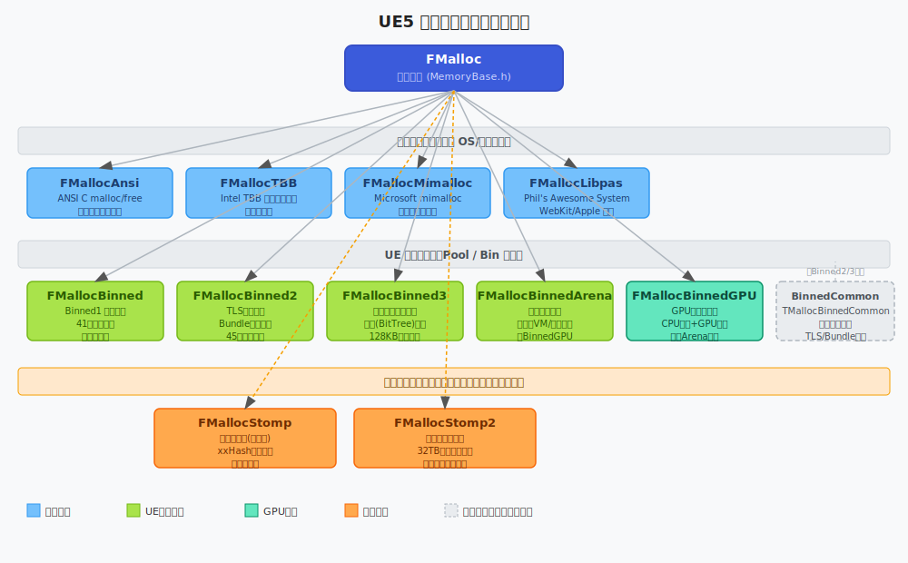
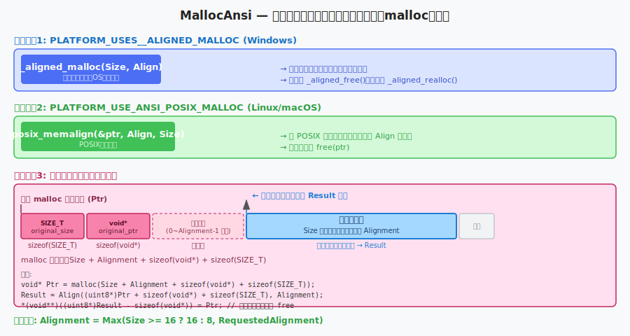
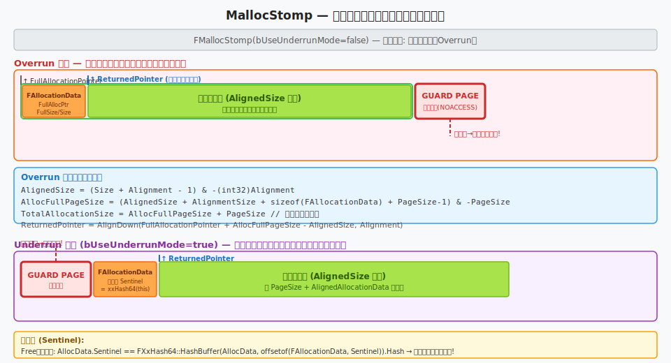
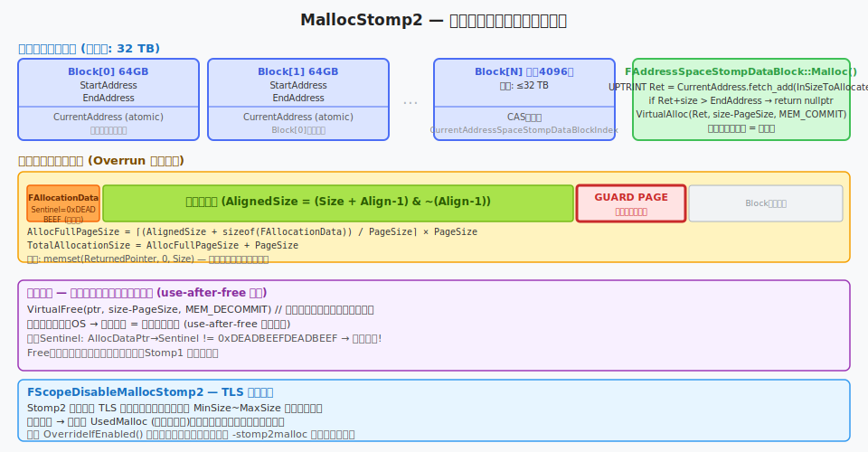
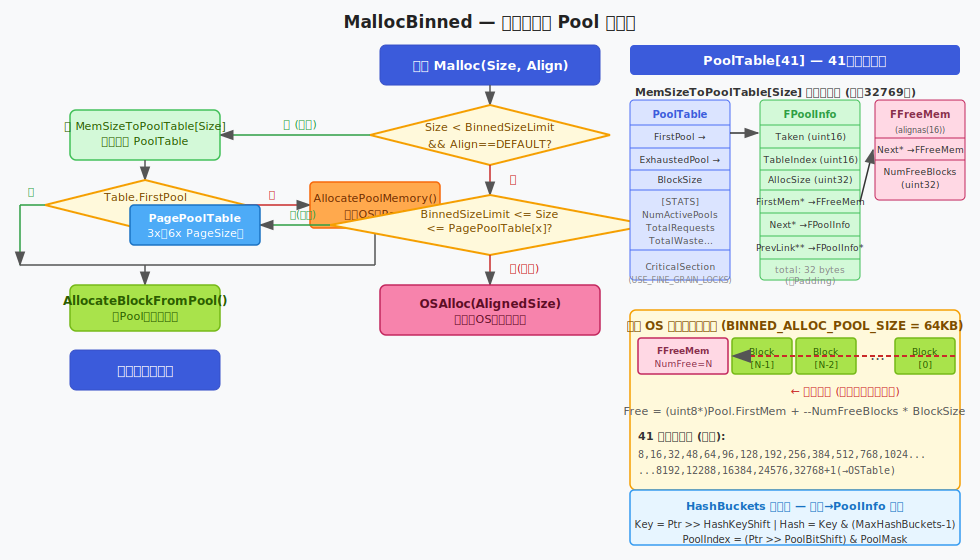
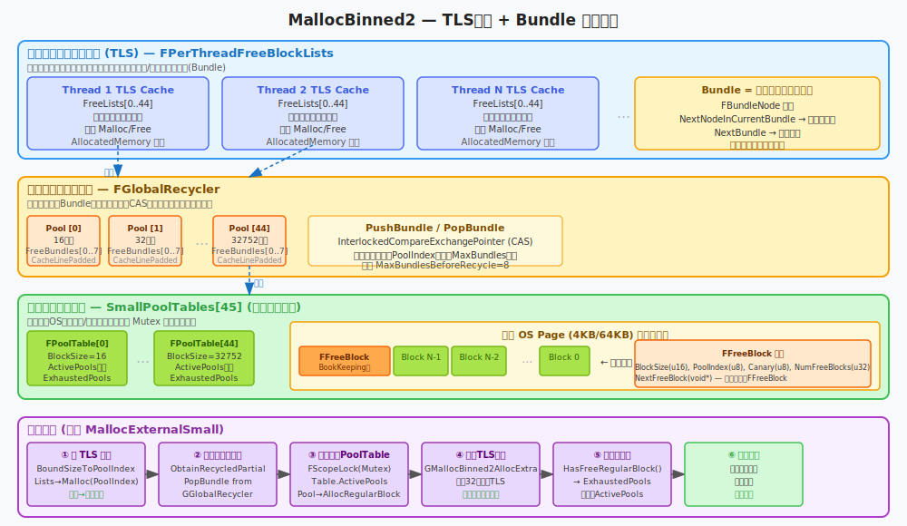
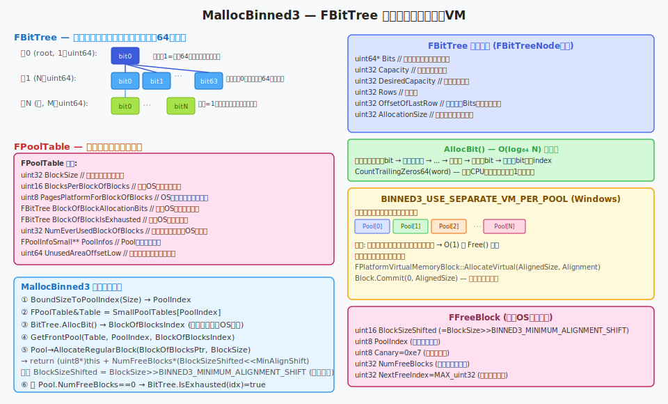
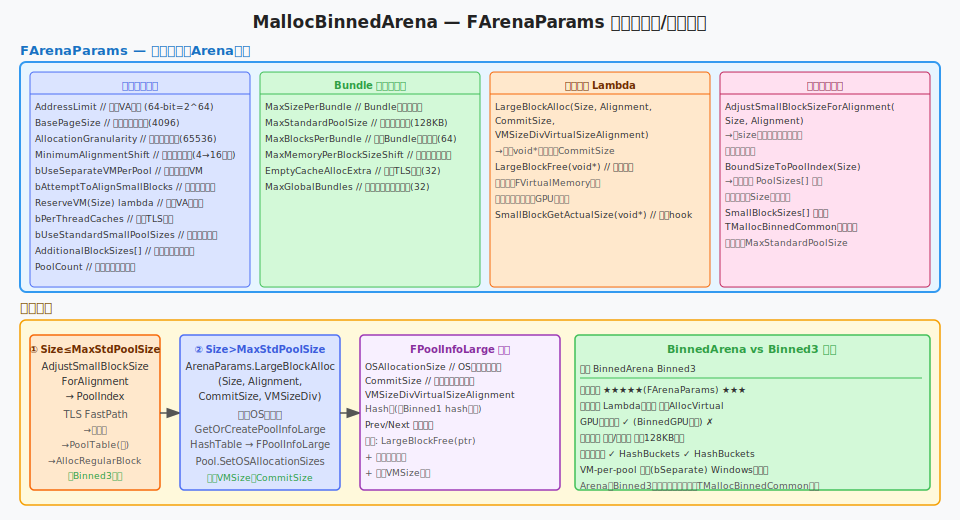
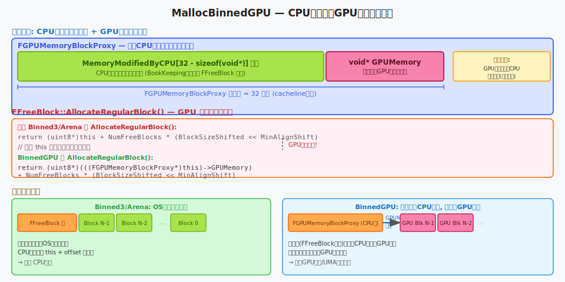

# UE5 内存分配器详解

> 作者面向对象：有一点 C++ 基础的大学生新手，正在入门 UE 开发。  
> 本文从源码出发，逐行拆解 12 个分配器的算法原理、计算步骤与优化思路。

---

## 目录

1. [前置概念：什么是内存分配器](#前置概念)
2. [分配器全家福](#分配器全家福)
3. [MallocAnsi — 系统库封装](#mallocansi)
4. [MallocTBB — Intel TBB 可伸缩分配器](#malloctbb)
5. [MallocMimalloc — 微软 mimalloc](#mallocmimalloc)
6. [MallocLibpas — Apple WebKit bmalloc](#mallocpasslibpas)
7. [MallocStomp — 越界写调试器](#mallocstomp)
8. [MallocStomp2 — 线程安全增强调试器](#mallocstomp2)
9. [MallocBinned — 第一代分箱分配器](#mallocbinned)
10. [MallocBinned2 — 第二代分箱（TLS+Bundle）](#mallocbinned2)
11. [MallocBinned3 — 第三代分箱（位图+独立VM）](#mallocbinned3)
12. [MallocBinnedArena — 参数化分箱分配器](#mallocbinnedArena)
13. [MallocBinnedGPU — GPU内存专用分配器](#mallocbinnedgpu)
14. [MallocBinnedCommon — 共享模板基础设施](#mallocbinnedcommon)
15. [总结对比](#总结对比)

---

## 前置概念

在深入了解这 12 个分配器之前，我们需要先搞清楚几个专有名词。

### 什么是内存分配器？

**内存分配器**（Memory Allocator）是程序运行时向操作系统申请内存、再分给代码用的一层"中间人"。你每次写 `new MyObject()` 或 `malloc(100)`，背后就是分配器在工作。

### 什么是虚拟内存？

操作系统给每个进程一片"虚拟地址空间"——就像一张巨大的地图，地址从 0 排到很大。但地图上的地方不一定对应真实的物理内存（RAM），只有你真正去访问时，OS 才会分配物理页面。这叫**延迟提交**（Lazy Commit）。

### 什么是内存页？

**内存页**（Page）是 OS 管理内存的最小单位，通常是 4096 字节（4 KB）。分配器向 OS 申请内存时，每次至少得申请一页。

### 什么是内存对齐？

CPU 读取数据时，如果数据地址是 N 的倍数（N 通常是数据大小），读取速度最快。这叫**内存对齐**（Alignment）。比如 `float`（4 字节）最好放在 4 的倍数地址。

### 什么是分箱？

**分箱**（Binning）是把不同大小的内存请求归入预定义的"尺寸档位"，比如：请求 20 字节 → 给 32 字节那个档位的块。这样就不用每次都向 OS 申请，可以从缓存里取出，极大提速。

### 什么是 TLS？

**TLS**（Thread Local Storage，线程本地存储）让每个线程拥有自己的私有变量。分配器用 TLS 给每个线程各自维护一个小缓存，这样线程内分配时不需要加锁，速度极快。

---

## 分配器全家福

下图展示了 UE5 中 12 个分配器的继承关系：



所有分配器都继承自 `FMalloc`（定义在 `Source/Runtime/Core/Public/HAL/MemoryBase.h`），这个基类规定了统一的接口：

```cpp
virtual void* Malloc(SIZE_T Count, uint32 Alignment = DEFAULT_ALIGNMENT) = 0;
virtual void* Realloc(void* Original, SIZE_T Count, uint32 Alignment = DEFAULT_ALIGNMENT) = 0;
virtual void  Free(void* Original) = 0;
virtual bool  GetAllocationSize(void* Original, SIZE_T& SizeOut) = 0;
```

UE 启动时，根据平台和配置选择一个具体分配器赋给全局变量 `GMalloc`，之后所有的 `FMemory::Malloc()` 调用都会路由到这里。

---

## MallocAnsi

**源码位置：**
- [Source/Runtime/Core/Public/HAL/MallocAnsi.h](../../../Source/Runtime/Core/Public/HAL/MallocAnsi.h)
- [Source/Runtime/Core/Private/HAL/MallocAnsi.cpp](../../../Source/Runtime/Core/Private/HAL/MallocAnsi.cpp)

### 算法概述

MallocAnsi 是最简单的分配器：把 C 标准库的 `malloc`/`free` 包一层。"Ansi"就是"ANSI C 标准"的意思。它的主要价值是：**跨平台可用**，用来当备用方案或测试基准。

### 三条平台路径

根据编译时的平台宏，会走完全不同的代码路径：



#### 路径 1：Windows（`PLATFORM_USES__ALIGNED_MALLOC`）

```cpp
// Windows 平台直接调用 CRT 的对齐分配函数
void* FMallocAnsi::Malloc(SIZE_T Size, uint32 Alignment)
{
    Alignment = FMath::Max(Size >= 16 ? (uint32)16 : (uint32)8, Alignment);
    void* Ptr = _aligned_malloc(Size, Alignment);  // ← 让 OS/CRT 保证对齐
    return Ptr;
}
```

Windows CRT 的 `_aligned_malloc` 直接返回满足对齐要求的指针，调用者不用操心内部细节。释放时用 `_aligned_free()`。

**构造函数还会启用 LFH（低碎片化堆）：**

```cpp
ULONG EnableLFH = 2;
HeapSetInformation(CrtHeapHandle, HeapCompatibilityInformation, &EnableLFH, sizeof(ULONG));
```

> **LFH（Low Fragmentation Heap）**：Windows 堆的一个优化模式。开启后，Windows 会把相同尺寸的分配放在一起管理，减少内存碎片，提升速度。

#### 路径 2：Linux/macOS（`PLATFORM_USE_ANSI_POSIX_MALLOC`）

```cpp
posix_memalign(&Ptr, Alignment, Size);   // POSIX 标准函数
```

`posix_memalign` 的语义：分配 `Size` 字节，保证返回指针是 `Alignment` 的整数倍。释放用普通的 `free(Ptr)`。

#### 路径 3：通用回退路径（其他平台）

既没有 `_aligned_malloc`，也没有 `posix_memalign`，就只能手动对齐。

**手动对齐的计算过程（重点）：**

```
申请总字节 = Size + Alignment + sizeof(void*) + sizeof(SIZE_T)
```

为什么多申请这么多？因为我们需要存储两个"书签"，让 `Free()` 时能找到原始指针：

| 内存布局 | 含义 |
|---------|------|
| `SIZE_T original_size` | 保存用户请求的原始大小 |
| `void* original_ptr`   | 保存 `malloc` 返回的原始未对齐指针 |
| 0~Alignment-1 字节填充 | 让下一段起始地址对齐 |
| **用户数据区（Size 字节）** | ← 这就是返回给调用者的地址 |

**对齐计算：**

```cpp
// 从 Ptr 往后跳过两个书签，再对齐
void* Result = Align((uint8*)Ptr + sizeof(void*) + sizeof(SIZE_T), Alignment);

// 在用户数据区前面写入两个书签
*(void**)((uint8*)Result - sizeof(void*)) = Ptr;         // 原始指针
*(SIZE_T*)((uint8*)Result - sizeof(void*) - sizeof(SIZE_T)) = Size;  // 原始大小
```

**释放时：**

```cpp
void FMallocAnsi::Free(void* Ptr)
{
    void* RealPtr = *(void**)((uint8*)Ptr - sizeof(void*));  // 从书签取回原始指针
    free(RealPtr);  // 释放整个大块
}
```

### 优势与适用场景

| 特性 | 描述 |
|------|------|
| 线程安全 | ✅ OS/CRT 负责，`IsInternallyThreadSafe()` 返回 `true` |
| 调试友好 | ✅ 可用 Valgrind 等工具直接分析（OS 原生 malloc） |
| 性能 | ⚠️ 中等，受限于 OS 堆实现 |
| 内存碎片 | ⚠️ 不做分箱，碎片较多 |
| 适用场景 | 开发期基准测试、平台移植初期 |

---

## MallocTBB

**源码位置：**
- [Source/Runtime/Core/Public/HAL/MallocTBB.h](../../../Source/Runtime/Core/Public/HAL/MallocTBB.h)
- [Source/Runtime/Core/Private/HAL/MallocTBB.cpp](../../../Source/Runtime/Core/Private/HAL/MallocTBB.cpp)

### 算法概述

MallocTBB 是对 **Intel Threading Building Blocks**（TBB，英特尔线程构建模块库）的可扩展内存分配器 `scalable_aligned_malloc` 的薄封装。TBB 分配器专门为多核并发设计：每个线程维护自己的内存池，最大限度减少跨线程锁竞争。

### 核心调用

```cpp
void* FMallocTBB::Malloc(SIZE_T Size, uint32 Alignment)
{
    // macOS 始终对齐到至少 16 字节
    Alignment = FMath::Max((uint32)16, Alignment);
    void* Result = scalable_aligned_malloc(Size, Alignment);
    return Result;
}
```

非 macOS 平台有额外的对齐调整逻辑：

```cpp
// 非 macOS：根据 Size 决定最小对齐
if (Alignment == DEFAULT_ALIGNMENT)
    Alignment = Size >= 16 ? 16 : 8;
```

### 调试特性

当编译时开启调试宏，TBB 分配器会在分配/释放时填充特定字节，方便检测未初始化或 use-after-free：

```cpp
// 分配后：用 0xcd 填充（方便看到"脏"数据）
Memset(NewPtr, 0xcd, scalable_msize(NewPtr));

// 释放前：用 0xdd 填充（"dead"，use-after-free 时容易发现）
Memset(Ptr, 0xdd, scalable_msize(Ptr));
```

> **约定：** `0xcd` = "Clean/Debug"（未初始化），`0xdd` = "Dead"（已释放），这是 MSVC 的传统调试惯例。

### 0 字节特殊处理

```cpp
if (Size == 0)
    Size = sizeof(size_t);  // 保证返回非空指针
```

这是符合 C++ 标准"new(0) 必须返回可释放指针"的要求。

### 优势

| 特性 | 描述 |
|------|------|
| 线程可扩展性 | ★★★★★ 专为多核设计，线程独立池 |
| 内存碎片 | ★★★★ TBB 内部使用分箱，碎片少 |
| 外部依赖 | 需要链接 Intel TBB 库 |
| 平台支持 | Windows/Linux/macOS，需要 TBB 库 |

---

## MallocMimalloc

**源码位置：**
- [Source/Runtime/Core/Public/HAL/MallocMimalloc.h](../../../Source/Runtime/Core/Public/HAL/MallocMimalloc.h)
- [Source/Runtime/Core/Private/HAL/MallocMimalloc.cpp](../../../Source/Runtime/Core/Private/HAL/MallocMimalloc.cpp)

### 算法概述

MallocMimalloc 是对 **Microsoft mimalloc**（2019 年微软开源的高性能通用分配器）的 UE 封装。mimalloc 的核心思想：每块分配的元数据都存在分配块本身附近，减少缓存缺失；同时使用"空闲页复用"而不是立刻还给 OS，避免频繁的 OS 调用。

### 构造流程

```cpp
FMallocMimalloc::FMallocMimalloc()
{
    // 1. 平台相关的初始化（Linux 上设置 mmap 标志等）
    FPlatformMemory::MiMallocInit();

    // 2. 配置内存重置延迟（重要优化！）
    mi_option_set(mi_option_reset_delay, GMiMallocMemoryResetDelay);
    // 默认 GMiMallocMemoryResetDelay = 10000 毫秒（10秒）
}
```

### 内存重置延迟（Reset Delay）

这是 mimalloc 最有特色的优化之一：

```cpp
// 控制台变量，可运行时调整
static TAutoConsoleVariable<int32> CVarMiMallocMemoryResetDelay(
    TEXT("mi.MemoryResetDelay"),
    10000,
    TEXT("延迟多久(ms)后将已释放的内存还给OS"));
```

**为什么要延迟还给 OS？**

当你 `free` 一块内存后，mimalloc 不立刻调用 `madvise(MADV_FREE)` 归还物理页，而是等 10 秒。  
原因：OS 归还后，下次再分配同样大小的内存，OS 需要重新清零该页（安全要求），这很慢。  
延迟归还后，如果 10 秒内又有分配请求，可以直接复用这页，完全不经过 OS，速度快很多。

### 核心 API 调用

```cpp
void* Ptr = mi_malloc_aligned(Size, Alignment);       // 分配
Ptr = mi_realloc_aligned(Ptr, NewSize, Alignment);    // 重新分配
mi_free(Ptr);                                          // 释放

SIZE_T ActualSize = mi_malloc_size(Ptr);               // 查询实际大小
mi_collect(true);                                      // 主动归还空闲内存给OS
```

### 调试特性

```cpp
// 分配时：0xcd 填充
Memset(NewPtr, 0xcd, mi_malloc_size(NewPtr));
// 释放时：0xdd 填充
Memset(Ptr, 0xdd, mi_malloc_size(Ptr));
```

### 优势

| 特性 | 描述 |
|------|------|
| 速度 | ★★★★★ 业界领先的通用分配器 |
| 内存重置延迟 | ✅ 显著减少频繁分配/释放的 OS 开销 |
| 碎片率 | ★★★★ mimalloc 内部使用 TLSF + 分箱管理 |
| 主动归还 | `mi_collect(true)` 可立即归还空闲内存 |
| 适用场景 | 高频分配/释放的游戏逻辑代码 |

---

## MallocLibpas

**源码位置：**
- [Source/Runtime/Core/Public/HAL/MallocLibpas.h](../../../Source/Runtime/Core/Public/HAL/MallocLibpas.h)
- [Source/Runtime/Core/Private/HAL/MallocLibpas.cpp](../../../Source/Runtime/Core/Private/HAL/MallocLibpas.cpp)

### 算法概述

MallocLibpas 是对 **Apple libpas**（正式名称：Phil's Awesome System）的 UE 封装。libpas 起源于 Apple WebKit 项目的 bmalloc，是专为 Apple 生态（macOS/iOS）高度优化的分配器。它只在 `PLATFORM_BUILDS_LIBPAS` 为真时编译（即仅限 Apple 平台）。

> **bmalloc：** Blazing-fast malloc，WebKit 团队开发的分配器。libpas 是 bmalloc 的下一代实现。

### 核心 API

```cpp
// 分配（尝试，可能返回 nullptr）
void* Ptr = bmalloc_try_allocate_with_alignment(Size, Alignment);

// 分配（必须成功，否则崩溃）
void* Ptr = bmalloc_allocate_with_alignment(Size, Alignment);

// 释放
bmalloc_deallocate(Ptr);

// 查询实际分配大小
SIZE_T ActualSize = bmalloc_get_allocation_size(Ptr);

// 重新分配（freed_if_successful：成功后自动释放旧指针）
Ptr = bmalloc_try_reallocate_with_alignment(Ptr, NewSize, Align,
        pas_reallocate_free_if_successful);
```

### 多进程（Fork）支持

libpas 内置了一个**清道夫（Scavenger）线程**，负责后台归还空闲内存给 OS。Fork（创建子进程）时，这个线程会导致问题（子进程只有一个线程，但继承了所有锁状态），所以需要特殊处理：

```cpp
void FMallocLibpas::OnPreFork()
{
    // Fork 前检查清道夫是否已暂停
    // （如果单线程模式下已经暂停，就不需要再做什么）
}

void FMallocLibpas::OnPostFork()
{
    // Fork 后，如果当前是多线程的 Fork 子进程，恢复清道夫
    if (FForkProcessHelper::IsForkedMultithreadInstance())
        pas_scavenger_resume();
}
```

### 构造函数单线程优化

```cpp
FMallocLibpas::FMallocLibpas()
{
    // 单线程模式下（如工具进程）暂停后台清道夫，节省资源
    if (!FPlatformProcess::SupportsMultithreading())
        pas_scavenger_suspend();
}
```

### 优势

| 特性 | 描述 |
|------|------|
| Apple 生态优化 | ★★★★★ 专为 macOS/iOS 调优 |
| 后台清理 | ✅ 异步 Scavenger 线程，不阻塞主线程 |
| Fork 安全 | ✅ Pre/PostFork 回调保证子进程安全 |
| 平台限制 | ❌ 仅 Apple 平台，`PLATFORM_BUILDS_LIBPAS` |

---

## MallocStomp

**源码位置：**
- [Source/Runtime/Core/Public/HAL/MallocStomp.h](../../../Source/Runtime/Core/Public/HAL/MallocStomp.h)
- [Source/Runtime/Core/Private/HAL/MallocStomp.cpp](../../../Source/Runtime/Core/Private/HAL/MallocStomp.cpp)

### 算法概述

MallocStomp 不是一个追求速度的分配器，而是一个专门为**调试内存错误**设计的工具。它的核心技术是：**保护页（Guard Page）**——在每次分配时，在用户数据区旁边故意放一个不可访问的内存页，一旦越界访问就立刻崩溃，精准定位 bug。

> **保护页**（Guard Page）：一块被 OS 标记为不可读写（`NOACCESS`）的虚拟内存页。任何对它的访问都会触发访问违例（Access Violation / Segfault），让程序立刻崩溃并生成调试信息。

### 两种工作模式



#### Overrun 模式（默认，`bUseUnderrunMode = false`）

**目的：** 检测**向后越界**（写超过缓冲区末尾）。

**布局：**
```
[FAllocationData][对齐填充][====用户数据区====][GUARD PAGE (不可访问)]
                            ↑ 返回给用户的指针
```

用户数据区紧贴保护页前面，只要多写一个字节，就撞上保护页，立即崩溃！

**关键计算步骤（以 `Size=100`, `Alignment=16`, `PageSize=4096` 为例）：**

```
步骤1: AlignedSize = (100 + 16 - 1) & -(16) = 112 字节（向上对齐到 16 的倍数）

步骤2: AlignmentSize = Alignment > PageSize ? Alignment - PageSize : 0
      = 0（16 < 4096，不需要额外对齐页）

步骤3: AllocationDataSize = sizeof(FAllocationData)（约 32 字节）

步骤4: AllocFullPageSize = (112 + 0 + 32 + 4096 - 1) & -4096
      = (4240) & -4096 = 4096 字节（1页就够）

步骤5: TotalAllocationSize = 4096 + 4096 = 8192 字节（1页有效 + 1页保护）

步骤6: ReturnedPointer = AlignDown(FullAllocationPointer + 4096 - 112, 16)
      = 用户数据区紧靠第1页末尾，第2页(下一页)是保护页
```

**内存提交（Windows）：**

```cpp
// 只提交有效范围，跳过最后一页
VirtualAlloc(CommitPointerStart, used_range_size, MEM_COMMIT, PAGE_READWRITE);
// 最后一页不提交 → 访问即崩溃
```

**内存保护（非 Windows）：**

```cpp
// 设置最后一页为不可读写
PageProtect(ReturnedPointerEnd, PageSize, /*bCanRead=*/false, /*bCanWrite=*/false);
```

#### Underrun 模式（`bUseUnderrunMode = true`）

**目的：** 检测**向前越界**（写到缓冲区开头之前）。

**布局：**
```
[GUARD PAGE][FAllocationData][对齐填充][====用户数据区====]
                                       ↑ 返回给用户的指针
```

保护页放在最前面，往前越界就撞上它。

```cpp
ReturnedPointer = Align((uint8*)FullAllocationPointer + PageSize + AllocationDataSize, Alignment);
```

### FAllocationData 结构与哨兵值

```cpp
struct FAllocationData
{
    void*   FullAllocationPointer;  // 向 OS 申请的完整内存起始地址
    SIZE_T  FullSize;               // 向 OS 申请的完整大小
    SIZE_T  Size;                   // 用户请求的大小
    SIZE_T  Sentinel;               // 哨兵值 = FXxHash64::HashBuffer(this, ...).Hash
};
```

**哨兵值**（Sentinel）：在分配时把 `FAllocationData` 结构自身做哈希，存到 `Sentinel` 字段。Free 时重新计算哈希，如果不一致，说明这块元数据被破坏了（内存下溢覆写了此处）。

### 线程安全说明

`IsInternallyThreadSafe()` 返回 `false`，**不是线程安全的**。UE 的锁层会在外部包一把互斥锁。这对调试器来说是可以接受的（速度本来就不是优先考虑的）。

### 优势

| 特性 | 描述 |
|------|------|
| 越界检测 | ★★★★★ 立即崩溃，精确定位 |
| 调试体验 | ★★★★★ 崩溃时完整调用栈 |
| 性能 | ★ 每次分配 2 页以上，内存暴增，仅供调试 |
| 线程安全 | ❌ 外部加锁 |
| 启用方式 | 命令行加 `-stompmalloc` |

---

## MallocStomp2

**源码位置：**
- [Source/Runtime/Core/Public/HAL/MallocStomp2.h](../../../Source/Runtime/Core/Public/HAL/MallocStomp2.h)
- [Source/Runtime/Core/Private/HAL/MallocStomp2.cpp](../../../Source/Runtime/Core/Private/HAL/MallocStomp2.cpp)

### 算法概述

MallocStomp2 是 Stomp1 的进化版：**线程安全**，**Use-After-Free 检测**，**32TB 专用虚拟地址池**。它仅在 `WITH_EDITOR && PLATFORM_WINDOWS`（即 Windows 编辑器模式）下编译，专为编辑器调试使用。

> **Use-After-Free**：释放一块内存后，又写入或读取那块地址。这是极危险的 bug，Stomp2 能立刻检测到。

### 虚拟地址块管理



```cpp
// 每个 FAddressSpaceStompDataBlock 管理 64GB 虚拟地址
struct FAddressSpaceStompDataBlock
{
    UPTRINT StartAddress;
    UPTRINT EndAddress;
    std::atomic<UPTRINT> CurrentAddress;  // 原子增长，线程安全

    void* Malloc(SIZE_T Size)
    {
        UPTRINT Ret = CurrentAddress.fetch_add(Size);  // 原子操作，无锁
        if (Ret + Size > EndAddress) return nullptr;   // 当前块满了

        // 只提交有效页，最后一页留作保护页
        VirtualAlloc((void*)Ret, Size - PageSize, MEM_COMMIT, PAGE_READWRITE);
        return (void*)Ret;
    }
};

// 最多 4096 个块，总计 4096 × 64GB = 256TB（实际限制到 32TB）
FAddressSpaceStompDataBlock AddressSpaceBlocks[4096];
std::atomic<uint32> CurrentBlockIndex;
```

### 分配步骤（MallocExternal）

```
步骤1: Size 和 Alignment 超出范围？→ 委托给内层 UsedMalloc
步骤2: TLS 禁用计数器 > 0？→ 委托给 UsedMalloc（引擎内部防止递归）
步骤3: AlignedSize = (Size + Alignment - 1) & ~(Alignment - 1)
步骤4: AllocFullPageSize = ⌈(AlignedSize + sizeof(FAllocationData)) / PageSize⌉ × PageSize
步骤5: TotalAllocationSize = AllocFullPageSize + PageSize（保护页）
步骤6: 从当前 Block 原子分配 TotalAllocationSize
步骤7: ReturnedPointer = AlignedPointer（数据区末尾对齐到保护页前）
步骤8: memset(ReturnedPointer, 0, Size)（零初始化，防止未初始化泄漏被检测器漏掉）
```

### 释放步骤（Use-After-Free 检测关键）

```cpp
void FMallocStomp2::FreeExternal(void* Ptr)
{
    FAllocationData* AllocData = /* 从 Ptr 反推回去 */;

    // 1. 验证哨兵值（检测下溢破坏）
    check(AllocData->Sentinel == SentinelExpectedValue);  // = 0xdeadbeefdeadbeef

    // 2. 释放物理内存，但保留虚拟地址！
    VirtualFree(AllocData, AllocData->FullSize - PageSize, MEM_DECOMMIT);
    //          ↑ 虚拟地址仍然存在，不归还，但物理内存释放了

    // 3. 以后任何对这个地址的访问 = 访问未映射的虚拟内存 = 立即访问违例！
}
```

这就是 Use-After-Free 检测的核心：**虚拟地址永不复用**，`free` 后再访问必崩溃。

### FScopeDisableMallocStomp2 — 临时禁用机制

```cpp
// 用于引擎内部分配（防止 Stomp2 破坏引擎结构）
{
    FScopeDisableMallocStomp2 Disable;  // 构造时 TLS 计数器 +1
    // 这里的分配不走 Stomp2
}
// 析构时 TLS 计数器 -1，恢复 Stomp2
```

### 优势

| 特性 | 描述 |
|------|------|
| 线程安全 | ★★★★★ 原子操作，无锁分配 |
| Use-After-Free 检测 | ★★★★★ 虚拟地址不复用，必然崩溃 |
| 越界检测 | ★★★★★ 保护页机制 |
| 内存占用 | ⚠️ 32TB 虚拟地址（但不是物理内存）|
| 平台限制 | ❌ 仅 Windows Editor |
| 启用方式 | `-stomp2malloc` 命令行参数 |

---

## MallocBinned

**源码位置：**
- [Source/Runtime/Core/Public/HAL/MallocBinned.h](../../../Source/Runtime/Core/Public/HAL/MallocBinned.h)
- [Source/Runtime/Core/Private/HAL/MallocBinned.cpp](../../../Source/Runtime/Core/Private/HAL/MallocBinned.cpp)

### 算法概述

MallocBinned 是 UE 的第一代分箱分配器。"分箱"（Binned）的意思：把大小相近的分配请求归入同一个"箱子"（Pool），这个箱子里预先分好了一堆等大的内存块，分配时直接从箱子里取一块，释放时放回箱子，无需调用 OS。

### 池表结构



有 **41 个分箱**（`POOL_COUNT = 41`），最大池分配大小为 **32769 字节**（`MAX_POOLED_ALLOCATION_SIZE`），每个 Pool 的 OS 页大小为 **65536 字节**（64KB，`BINNED_ALLOC_POOL_SIZE`）。

#### FFreeMem — 嵌入在空闲块头部的管理结构

```cpp
struct FFreeMem
{
    FFreeMem* Next;           // 指向下一个空闲块头部
    uint32    NumFreeBlocks;  // 这一段连续空闲块的数量
};
// 总共 16 字节，alignas(16)
```

#### FPoolInfo — 描述一个 OS 页组

```cpp
struct FPoolInfo
{
    uint16   Taken;       // 已分配出去的块数
    uint16   TableIndex;  // 所属 PoolTable 的索引
    uint32   AllocSize;   // 每块大小（字节）
    FFreeMem* FirstMem;   // 指向第一个空闲块链节
    FPoolInfo* Next;      // 下一个 PoolInfo（链表）
    FPoolInfo** PrevLink; // 前驱节点的指针的指针（双向链表技巧）
};
// 总共 32 字节
```

### 三条分配路径

```
请求 Malloc(Size, Alignment)
      ↓
      ├─[小块: Size < BinnedSizeLimit && Alignment==DEFAULT]
      │   → MemSizeToPoolTable[Size] → 找 PoolTable → AllocateBlockFromPool()
      │
      ├─[中块: BinnedSizeLimit ≤ Size ≤ 3x~6x PageSize, Alignment ≤ 4096]
      │   → PagePoolTable[BinType] → 按页对齐的 Pool
      │
      └─[大块: 超出中块范围]
          → OSAlloc(AlignedSize) → 直接向 OS 申请 → 创建 FPoolInfo 入哈希表
```

**小块分配的具体步骤：**

```
步骤1: Index = MemSizeToPoolTable[Size]（直接数组查找，O(1)）
步骤2: Table = PoolTable[Index]
步骤3: if Table.FirstPool == nullptr → AllocatePoolMemory(Table)（向OS申请新页）
       AllocatePoolMemory 计算：
         Blocks   = PoolSize / Table.BlockSize         // 一页能放多少块
         Bytes    = Blocks * BlockSize                  // 实际使用字节
         OsBytes  = Align(Bytes, PageSize)             // 对齐到页大小
步骤4: Pool = Table.FirstPool（取出有空闲块的 Pool）
步骤5: Free = (FFreeMem*)((uint8*)Pool.FirstMem
              + --Pool.FirstMem.NumFreeBlocks * Table.BlockSize)
       // 从末尾往前取块（递减 NumFreeBlocks）
步骤6: 返回 Free 指针
```

### 大块的哈希查找

大块分配时，需要记录"这个指针属于哪个 Pool"（释放时要找回来）：

```cpp
// Hash 计算
Key       = Ptr >> HashKeyShift;
Hash      = Key & (MaxHashBuckets - 1);   // 哈希桶索引
PoolIndex = (Ptr >> PoolBitShift) & PoolMask;  // 桶内的池索引

// PoolHashBucket 结构
struct PoolHashBucket {
    UPTRINT      Key;        // 用于碰撞检测
    FPoolInfo*   FirstPool;  // 该桶内的第一个 Pool
    PoolHashBucket* Prev;
    PoolHashBucket* Next;
};
```

### 锁机制

MallocBinned 支持三种锁配置（编译时选择）：

| 配置 | 描述 |
|------|------|
| `USE_FINE_GRAIN_LOCKS` | 每个 PoolTable 有独立锁，并发最高 |
| `USE_COARSE_GRAIN_LOCKS` | 全局一把锁，简单但竞争高 |
| `USE_LOCKFREE_DELETE` | 释放时使用无锁删除 |

### OS 分配缓存

```cpp
// 释放的 OS 大块先缓存起来（CACHE_FREED_OS_ALLOCS）
// 最多 64 块，总不超过 64MB
// 下次向 OS 申请同样大小时，先从缓存取，避免系统调用
```

### 优势

| 特性 | 描述 |
|------|------|
| 小块分配速度 | ★★★★ O(1) 数组查找 |
| 内存碎片 | ★★★★ 分箱消除大部分碎片 |
| 内存开销 | ⚠️ 每个 Pool 的尾部可能浪费（BlockSize 不整除 PoolSize）|
| 线程安全 | ✅（通过锁）|

---

## MallocBinned2

**源码位置：**
- [Source/Runtime/Core/Public/HAL/MallocBinned2.h](../../../Source/Runtime/Core/Public/HAL/MallocBinned2.h)
- [Source/Runtime/Core/Private/HAL/MallocBinned2.cpp](../../../Source/Runtime/Core/Private/HAL/MallocBinned2.cpp)

### 算法概述

MallocBinned2 是 Binned1 的全面进化版，核心改进是**三层缓存体系**：TLS 无锁缓存 → 全局回收器（CAS 原子操作）→ 有锁池表。绝大多数分配/释放操作能在第一、二层完成，大大减少锁竞争。

### 45 个分箱尺寸

```
16, 32, 48, 64, 80, 96, 128, 160, 192, 224, 256, 288, 320, 384, 448,
512, 576, 640, 704, 768, 896, 1008, 1168, 1488, 1632, 2032, 2336,
2720, 3264, 4080, 4368, 5040, 5456, 5952, 6528, 7280, 8176, 9360,
10912, 13104, 16368, 19104, 21840, 27024, 32752
```

（共 45 个，`BINNED2_LARGE_ALLOC = 65536`，超过 65536 字节走大块路径）

### 三层缓存体系



#### 第一层：TLS 缓存（无锁，极快）

每个线程有一个 `FPerThreadFreeBlockLists`，里面有 45 个 `FPerThreadFreeBlockList`（对应 45 个尺寸）。

```cpp
// 极快路径：从 TLS 取一个块
void* Block = Lists->Malloc(PoolIndex);
if (Block) return Block;  // ← 大多数时候直接返回，不需要锁
```

#### 第二层：全局回收器（CAS 无锁）

如果 TLS 没有对应尺寸的块，就去 `GGlobalRecycler` 偷一个 Bundle（束，一批同尺寸的空闲块）：

```cpp
// ObtainRecycledPartial = 从全局回收器取回一个 Bundle（CAS 原子操作，无锁）
FBundleNode* Bundle = Lists->ObtainRecycledPartial(PoolIndex, GGlobalRecycler);
if (Bundle)
{
    // 把整个 Bundle 放入 TLS，然后从 TLS 分配
    Lists->SetPartialBundle(PoolIndex, Bundle);
    return Lists->Malloc(PoolIndex);
}
```

> **Bundle（束）：** 一批同尺寸的空闲块，打包成链表传递。不用一次传一块，而是整批传递，大幅减少原子操作次数。

#### 第三层：有锁池表（慢路径）

前两层都失败时，加锁访问 `SmallPoolTables`：

```cpp
FScopeLock Lock(&Mutex);  // 加互斥锁（只有到这一步才会锁）

// 从池表里找或创建 Pool
FPoolInfo* Pool = Table.ActivePools;
if (!Pool) Pool = AllocateNewPool(Table);  // 向 OS 申请新页

// 分配一个块
void* Block = Pool->AllocateRegularBlock();

// 预填 TLS 缓存，一次取 32 块（GMallocBinned2AllocExtra = 32）
// 这样接下来 32 次分配都走第一层，不需要锁
for (int i = 0; i < GMallocBinned2AllocExtra; i++)
    Lists->Free(Pool->AllocateRegularBlock(), PoolIndex, BlockSize);
```

### FFreeBlock — OS 页头部的管理结构

```cpp
struct FFreeBlock
{
    uint16      BlockSize;         // 本页的块大小
    uint8       PoolIndex;         // 所属分箱索引
    EBlockCanary CanaryAndForkState; // 金丝雀值 + Fork 状态（用于检测内存损坏和进程 fork）
    uint32      NumFreeBlocks;     // 剩余可分配块数
    void*       NextFreeBlock;     // 下一个 FFreeBlock（OS 页链）
};
```

**OS 页内布局（从高地址到低地址分配）：**

```
[FFreeBlock 头] [Block N-1] [Block N-2] ... [Block 0]
                ← 分配方向（NumFreeBlocks 递减）
```

分配计算：
```cpp
return (uint8*)this + BINNED2_LARGE_ALLOC - (NumFreeBlocks + 1) * BlockSize;
```
（当 Pool 对齐到 64KB 时的优化写法）

### Fork 安全机制

```cpp
// Fork 前：把所有未分配块的 Canary 标记为 PreFork
// Fork 后：父进程恢复 PostFork，子进程的旧块释放时 is-no-op（防止双重释放）
enum class EBlockCanary { PreFork, PostFork };
```

### 优势

| 特性 | 描述 |
|------|------|
| 线程竞争 | ★★★★★ 三层缓存，大多数操作无锁 |
| TLS 预填 | ★★★★ 一次锁操作预取 32 块 |
| Bundle 批传 | ★★★★ 减少原子操作频率 |
| Fork 安全 | ✅ Canary 状态机保护 |
| 内存利用率 | ★★★★ 45 个分箱，浪费率低 |

---

## MallocBinned3

**源码位置：**
- [Source/Runtime/Core/Public/HAL/MallocBinned3.h](../../../Source/Runtime/Core/Public/HAL/MallocBinned3.h)
- [Source/Runtime/Core/Private/HAL/MallocBinned3.cpp](../../../Source/Runtime/Core/Private/HAL/MallocBinned3.cpp)

### 算法概述

MallocBinned3 是 Binned2 的进化，两大核心创新：

1. **FBitTree（层次位图）** — 用 64 叉树快速找到有空闲块的 OS 页组，O(log₆₄ N) 时间
2. **每池独立虚拟地址段**（Windows 默认开启）— 指针归属直接由地址计算得出，无需哈希查找

### 最大池尺寸

`BINNED3_MAX_SMALL_POOL_SIZE = 128 * 1024`（128 KB），比 Binned2 的 32752 大很多。

### FBitTree — 层次位图快速查找



**问题：** 有成千上万个 OS 页组，怎么快速找到哪一个有空闲块？

**解法：** 把所有 OS 页组的"是否有空闲块"状态存成位图，再构建层次索引——64 叉树。

```
层 0 (1 个 uint64)：  [bit0][bit1]...[bit63]
                        ↓      ↓
层 1 (N 个 uint64)：  [...]  [...]  ...  每个 bit0 对应层1中的64个bit
                        ↓
层 N (叶子层)：       实际记录每个 OS 页组是否有空闲块
```

**查找过程（AllocBit）：**

```cpp
// 从根层找第一个置 1 的 bit
uint64 Word = Bits[0];
int BitIndex = CountTrailingZeros64(Word);  // CPU 指令，找最低位的 1，O(1)

// 递推到下一层
LayerOffset = BitIndex * 64;
Word = Bits[LayerOffset + ...];
BitIndex = CountTrailingZeros64(Word);

// 重复直到叶子层，得到 OS 页组全局索引
// 清零该 bit（标记为已分配）
```

> `CountTrailingZeros64`：计算 64 位数末尾有多少个连续 0，对应 CPU 的 `BSF`/`TZCNT` 指令，一个时钟周期。

**释放时（FreeBit）：** 置 1 该 bit，并向上传播（如果父节点原来是 0，也置为 1）。

### BlockSizeShifted 节省空间

```cpp
// FFreeBlock 中用 uint16 存储 BlockSize
uint16 BlockSizeShifted;  // = BlockSize >> BINNED3_MINIMUM_ALIGNMENT_SHIFT

// 分配时还原：
BlockSize = uint32(BlockSizeShifted) << BINNED3_MINIMUM_ALIGNMENT_SHIFT;
```

`BINNED3_MINIMUM_ALIGNMENT_SHIFT = 4`（即 16 字节对齐），所以 `uint16` 可以表示最大 `65535 * 16 = 1MB` 的 BlockSize。

### 每池独立虚拟地址段（Windows）

```cpp
// Windows 下 BINNED3_USE_SEPARATE_VM_PER_POOL = 1
// 每个池尺寸的 OS 页组都在独立的 VA 段内
// Free(Ptr) 时：
PoolIndex = (Ptr - BaseAddress) / PoolVASize;  // 直接算出所属池，O(1)，无哈希表！
```

对比 Binned1 的哈希查找，这种方式**完全避免了哈希碰撞**，且缓存友好。

### 大块分配

```cpp
FPlatformVirtualMemoryBlock VMBlock = FPlatformVirtualMemoryBlock::AllocateVirtual(AlignedSize, Alignment);
VMBlock.Commit(0, AlignedSize);  // 提交物理内存
// 同样用哈希表 GetOrCreatePoolInfoLarge 记录
```

### 优势

| 特性 | 描述 |
|------|------|
| 空闲块查找 | ★★★★★ O(log₆₄ N)，极快 |
| 小块上限 | 128KB（比 Binned2 大很多） |
| Free() 路由 | ★★★★★ 地址算术，无哈希 |
| 内存利用率 | ★★★★★ 位图精确记录，无浪费 |
| 适用场景 | 需要大量小到中等大小分配的游戏逻辑 |

---

## MallocBinnedArena

**源码位置：**
- [Source/Runtime/Core/Public/HAL/MallocBinnedArena.h](../../../Source/Runtime/Core/Public/HAL/MallocBinnedArena.h)
- [Source/Runtime/Core/Private/HAL/MallocBinnedArena.cpp](../../../Source/Runtime/Core/Private/HAL/MallocBinnedArena.cpp)

### 算法概述

MallocBinnedArena 是 Binned3 的**参数化超集**，通过一个结构体 `FArenaParams` 控制几乎所有行为。最重要的：它允许用**回调函数（Lambda）**替换大块分配的底层实现，这使得 MallocBinnedGPU 可以继承它并替换为 GPU 内存分配。

### FArenaParams — 参数化配置



```cpp
struct FArenaParams
{
    // === 地址空间控制 ===
    uint64 AddressLimit;              // 可用虚拟地址上限
    uint32 BasePageSize;              // 平台最小页大小（通常 4096）
    uint32 AllocationGranularity;     // 实际分配粒度（通常 65536）
    uint8  MinimumAlignmentShift;     // 最小对齐位移（4 → 16 字节）
    bool   bUseSeparateVMPerPool;     // 每个池独立 VA 段？

    // === Bundle 控制 ===
    uint32 MaxSizePerBundle;          // Bundle 最大字节数
    uint32 MaxStandardPoolSize;       // 小块最大尺寸（默认 128KB）
    uint32 MaxBlocksPerBundle;        // 每个 Bundle 最多块数（默认 64）
    uint32 MaxGlobalBundles;          // 全局回收器最大 Bundle 数（默认 32）
    uint32 EmptyCacheAllocExtra;      // TLS 预填额外块数（默认 32）

    // === 可替换大块分配 Lambda ===
    TFunction<void*(SIZE_T, uint32, SIZE_T&, SIZE_T&)> LargeBlockAlloc;
    TFunction<void(void*)>                             LargeBlockFree;
};
```

### 小块对齐调整

```cpp
// 将 Size 向上取整到同时满足大小和对齐要求的最小池尺寸
uint32 AdjustedSize = AdjustSmallBlockSizeForAlignment(Size, Alignment);
uint32 PoolIndex    = BoundSizeToPoolIndex(AdjustedSize);
```

`BoundSizeToPoolIndex` 做二分查找（`LowerBound`）找到最小满足 `AdjustedSize` 的池尺寸。

### FPoolInfoLarge — 大块管理

```cpp
struct FPoolInfoLarge
{
    SIZE_T OSAllocationSize;           // OS 分配的总大小
    SIZE_T CommitSize;                 // 已提交的物理内存大小
    SIZE_T VMSizeDivVirtualSizeAlignment; // 反算 VM 大小用
};
```

大块释放时：
```cpp
ArenaParams.LargeBlockFree(Ptr);        // 调用 Lambda 释放
// 从哈希表 GetHashBuckets... 里移除 FPoolInfoLarge
```

### 与 Binned3 的关系

BinnedArena 和 Binned3 共享 `TMallocBinnedCommon<Derived, ...>` 模板基类（见下一节），差异只在：

| 特性 | BinnedArena | Binned3 |
|------|-------------|---------|
| 参数化 | FArenaParams | 编译时硬编码 |
| 大块 Lambda | 可替换 | 固定用 FPlatformVirtualMemoryBlock |
| GPU 支持 | ✅（BinnedGPU 子类） | ❌ |
| VM-per-pool | 可选 | Windows 默认开启 |

---

## MallocBinnedGPU

**源码位置：**
- [Source/Runtime/Core/Public/HAL/MallocBinnedGPU.h](../../../Source/Runtime/Core/Public/HAL/MallocBinnedGPU.h)

### 算法概述

MallocBinnedGPU 继承自 MallocBinnedArena，专门用于**GPU 显存**（或统一内存架构的 GPU 可访问内存）的分配。核心设计思想：**CPU 侧的元数据（BookKeeping）与 GPU 侧的实际数据分离**。

### FGPUMemoryBlockProxy — 代理结构



```cpp
struct FGPUMemoryBlockProxy
{
    // CPU 可以自由读写的元数据（占满 32 字节的前 24 字节，根据指针大小）
    uint8   MemoryModifiedByCPU[32 - sizeof(void*)];
    // GPU 内存地址
    void*   GPUMemory;
};
// sizeof(FGPUMemoryBlockProxy) = 32（cache line 友好）
```

这个结构放在普通的 CPU 内存中。其中 `MemoryModifiedByCPU` 部分对应 `FFreeBlock` 的元数据字段，CPU 可以读写；`GPUMemory` 指向真正的 GPU 显存。

### AllocateRegularBlock 的差异

```cpp
// 普通 Binned3/Arena：
void* FFreeBlock::AllocateRegularBlock(...)
{
    return (uint8*)this + NumFreeBlocks * BlockSize;
    // ↑ 返回 this 后面紧跟的 CPU 内存块
}

// BinnedGPU：
void* FFreeBlock::AllocateRegularBlock(MinimumAlignmentShift)
{
    // ↓ 返回的是 GPU 内存！不是 CPU 内存！
    return (uint8*)(((FGPUMemoryBlockProxy*)this)->GPUMemory)
           + NumFreeBlocks * (uint32(BlockSizeShifted) << MinimumAlignmentShift);
}
```

关键差异：GPU 版的 `this`（CPU 侧 `FGPUMemoryBlockProxy`）和返回的数据区（GPU 侧内存）**完全分离在不同的内存空间**。

### 使用场景

MallocBinnedGPU 的典型使用场景：

1. **统一内存架构（UMA）平台**（如 PS5、Xbox Series X）：GPU 和 CPU 共享物理内存，但 GPU 访问需要特殊对齐和属性
2. **GPU 小对象分配**：大量小 GPU 资源（如 GPU 粒子、GPU 蒙皮缓冲区）的快速分配

### 优势

| 特性 | 描述 |
|------|------|
| CPU/GPU 内存分离 | ★★★★★ 元数据不占用宝贵的 GPU 带宽 |
| 分箱效率 | ★★★★ 继承 BinnedArena 的所有优化 |
| TLS 缓存 | ✅ 同 BinnedArena |
| 适用场景 | GPU 小对象分配，UMA 平台 |

---

## MallocBinnedCommon

**源码位置：**
- [Source/Runtime/Core/Public/HAL/MallocBinnedCommon.h](../../../Source/Runtime/Core/Public/HAL/MallocBinnedCommon.h)

### 算法概述

MallocBinnedCommon 本身不是一个分配器，而是 Binned2、Binned3、BinnedArena、BinnedGPU 共享的**模板基础设施**。通过 C++ 的 CRTP（奇异递归模板模式）实现。

```cpp
template<
    class Derived,      // 派生类（如 FMallocBinned3）
    uint32 MinAlign,    // 最小对齐（字节）
    uint32 MaxAlign,    // 最大对齐
    uint32 MinAlignShift, // MinAlign 的位移
    int    PoolCount,   // 分箱数量
    uint32 MaxSmallPoolSize // 小块最大尺寸
>
class TMallocBinnedCommon : public FMalloc { ... };
```

### FBitTree 完整实现

```cpp
struct FBitTree
{
    uint64* Bits;           // 所有层的位数据（展开的数组）
    uint32  Capacity;       // 实际能管理的块数
    uint32  DesiredCapacity;// 期望管理的块数
    uint32  Rows;           // 层数
    uint32  OffsetOfLastRow;// 叶子层在 Bits 中的偏移
    uint32  AllocationSize; // 整个位图所需字节数

    // 关键方法：
    uint32  AllocBit();         // O(log₆₄ N)，找并占用一个空闲 bit
    void    FreeBit(uint32 i);  // 释放 bit i，向上更新父节点
    uint32  CountOnes(uint32 UpTo); // 统计前 UpTo 个 bit 中有多少个 1
};
```

**GetMemoryRequirements：** 编译期静态方法，计算给定容量需要多少字节：

```cpp
static constexpr uint32 GetMemoryRequirements(uint32 NumPages)
{
    // 计算每层需要的 uint64 数量，累加
    uint32 Total = 0, Level = NumPages;
    while (Level > 0) {
        Level = (Level + 63) / 64;  // 除以 64（每个 uint64 管 64 个子节点）
        Total += Level;
    }
    return Total * sizeof(uint64);
}
```

### FPtrToPoolMapping — 指针到池的映射

```cpp
struct FPtrToPoolMapping
{
    uint32  PtrToPoolPageBitShift;  // 从指针算出页内偏移需要右移的位数
    uint32  HashKeyShift;           // 计算哈希 Key 右移位数
    UPTRINT PoolMask;               // 提取 PoolIndex 的掩码
    uint32  MaxHashBuckets;         // 哈希桶数量
    UPTRINT AddressSpaceBase;       // 地址空间起始（用于 VM-per-pool 模式）
};

// 从指针获取哈希桶和池索引
void GetHashBucketAndPoolIndices(void* Ptr, uint32& BucketIndex,
                                  UPTRINT& BucketCollision, uint32& PoolIndex)
{
    UPTRINT PtrOffset = (UPTRINT)Ptr - AddressSpaceBase;
    BucketCollision = PtrOffset >> HashKeyShift;
    BucketIndex     = BucketCollision & (MaxHashBuckets - 1);
    PoolIndex       = (PtrOffset >> PtrToPoolPageBitShift) & PoolMask;
}
```

### Bundle 全局参数

```cpp
// 可被 ini 配置覆盖
extern int32 GMallocBinnedBundleSize;   // = 65536（激进省内存模式下 8192）
extern int32 GMallocBinnedBundleCount;  // = 64（一个 Bundle 最多 64 块）
```

### 优势

| 特性 | 描述 |
|------|------|
| 代码复用 | ★★★★★ 四个分配器共享一套实现 |
| 编译期优化 | ★★★★ 模板参数全部 constexpr 优化 |
| FBitTree | ★★★★★ 通用位图，可被任何分箱分配器使用 |

---

## 总结对比

| 分配器 | 线程安全 | 速度 | 内存碎片 | 适用场景 |
|--------|---------|------|---------|---------|
| **MallocAnsi** | ✅(OS) | ⭐⭐ | ⭐⭐ | 备用/测试/平台移植 |
| **MallocTBB** | ✅ | ⭐⭐⭐⭐ | ⭐⭐⭐⭐ | 多核高并发场景 |
| **MallocMimalloc** | ✅ | ⭐⭐⭐⭐⭐ | ⭐⭐⭐⭐ | 高频分配/释放 |
| **MallocLibpas** | ✅ | ⭐⭐⭐⭐⭐ | ⭐⭐⭐⭐ | Apple 平台首选 |
| **MallocStomp** | ❌(外部锁) | ⭐ | N/A | 越界写调试 |
| **MallocStomp2** | ✅ | ⭐ | N/A | Use-After-Free 调试（Win Editor）|
| **MallocBinned** | ✅ | ⭐⭐⭐ | ⭐⭐⭐⭐ | 第一代，兼容性好 |
| **MallocBinned2** | ✅(TLS) | ⭐⭐⭐⭐ | ⭐⭐⭐⭐ | 移动端/通用默认 |
| **MallocBinned3** | ✅(TLS) | ⭐⭐⭐⭐⭐ | ⭐⭐⭐⭐⭐ | PC/主机高性能 |
| **MallocBinnedArena** | ✅(TLS) | ⭐⭐⭐⭐⭐ | ⭐⭐⭐⭐⭐ | 可定制大块分配 |
| **MallocBinnedGPU** | ✅ | ⭐⭐⭐⭐ | ⭐⭐⭐⭐ | GPU 显存小对象 |
| **MallocBinnedCommon** | — | — | — | 共享模板基础设施 |

### 各分配器的核心技术速查

| 分配器 | 核心技术 |
|--------|---------|
| Ansi | 手动对齐书签（`sizeof(void*) + sizeof(SIZE_T)`） |
| TBB | Intel TBB 可伸缩分配器（线程独立池） |
| Mimalloc | 内存重置延迟（10s 不归还 OS） |
| Libpas | bmalloc 分段内存 + 后台清道夫 |
| Stomp | 保护页（Guard Page）越界立即崩溃 |
| Stomp2 | 32TB 虚拟地址线性增长 + 物理内存释放保留虚拟地址 |
| Binned | 41 个分箱 + FFreeMem 链表 + 哈希大块表 |
| Binned2 | TLS + Bundle + GlobalRecycler 三层无锁缓存 |
| Binned3 | FBitTree 层次位图 + 独立 VM 段（O(1) Free 路由） |
| BinnedArena | FArenaParams 可替换大块 Lambda（支持 GPU） |
| BinnedGPU | CPU 代理块元数据 + GPU 内存指针分离 |
| BinnedCommon | CRTP 模板 + FBitTree + FPtrToPoolMapping |

---

> **延伸阅读：**
> - 源码路径：`Source/Runtime/Core/Public/HAL/` 和 `Source/Runtime/Core/Private/HAL/`
> - UE 启动时分配器选择逻辑：`FPlatformMemory::BaseAllocator()`（各平台 `PlatformMemory.cpp`）
> - 运行时切换分配器：`GMalloc->InitializeStatsMetadata()`，或通过 `-malloc=` 命令行参数
