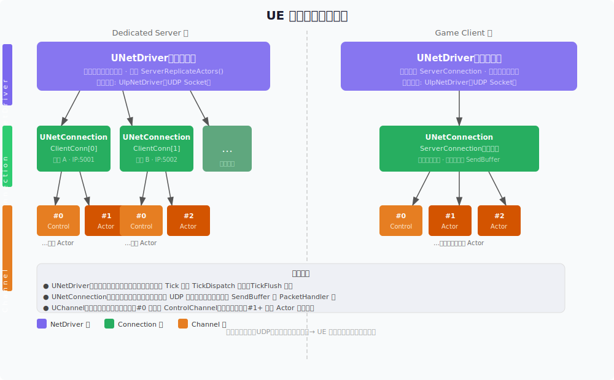
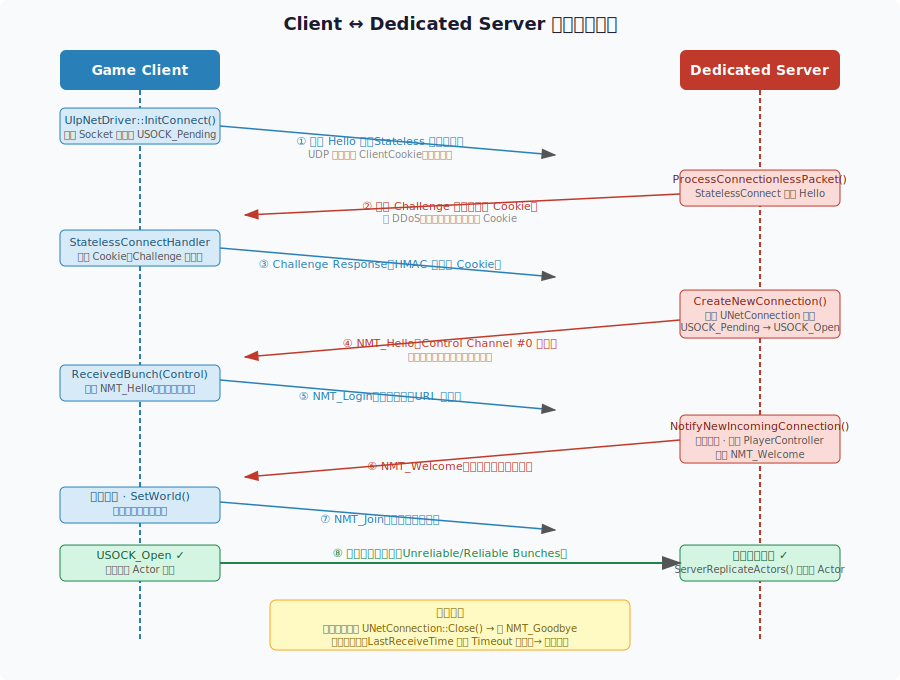
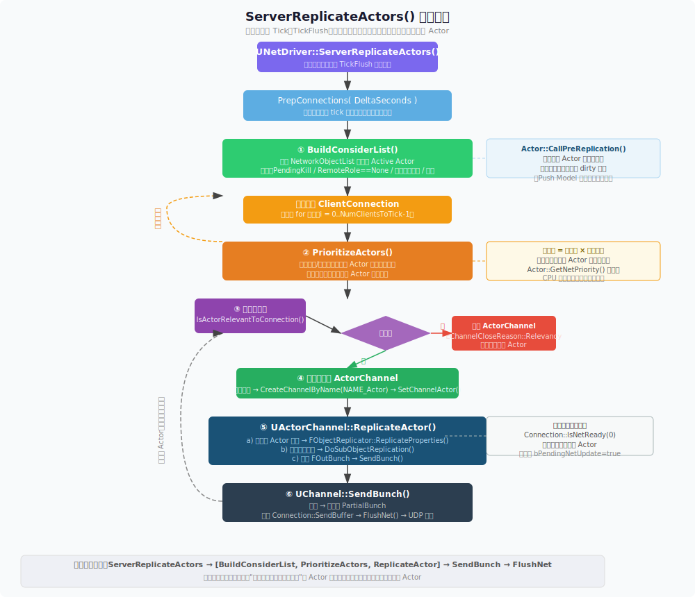
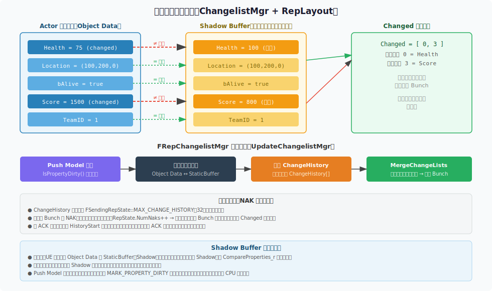
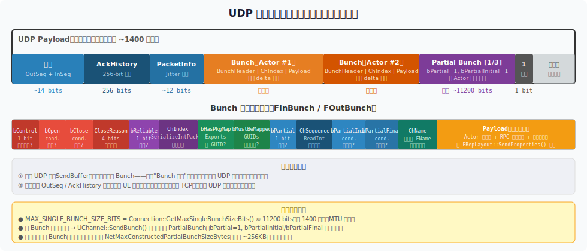
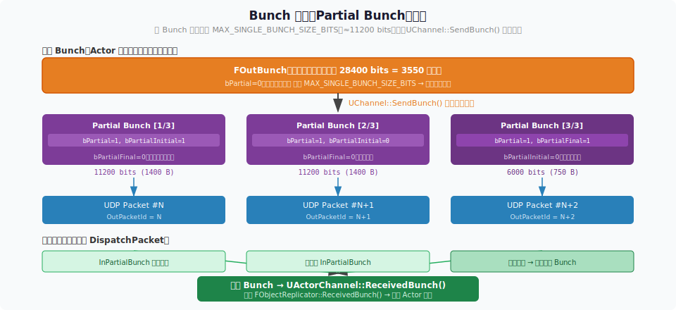
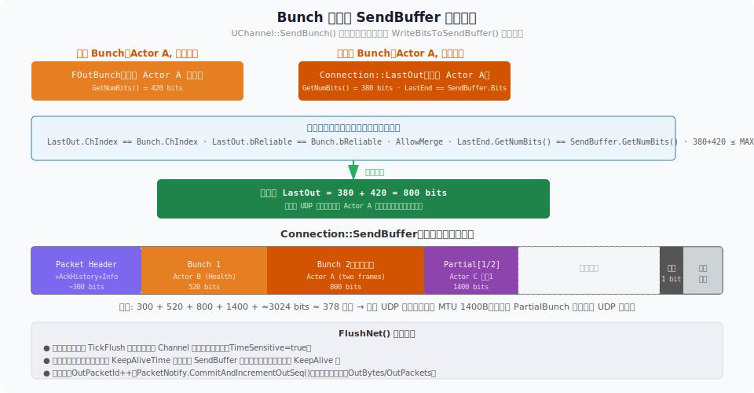
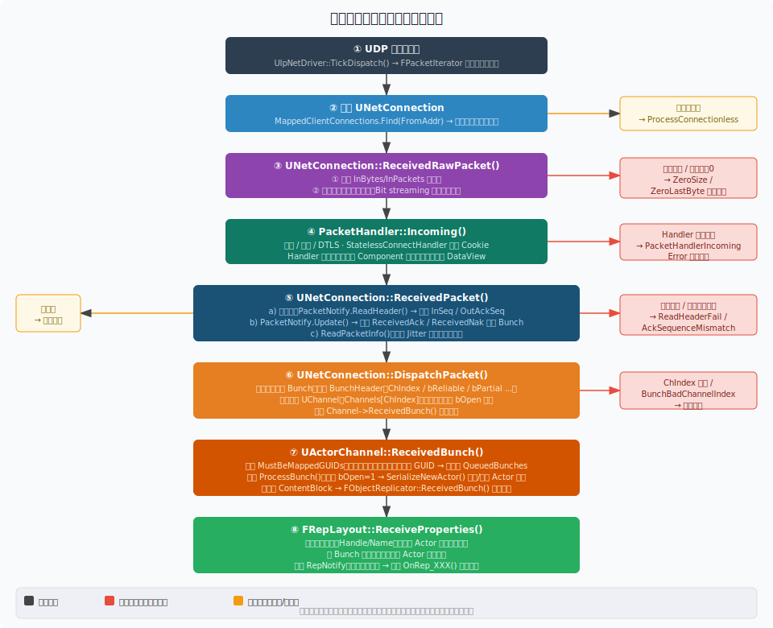
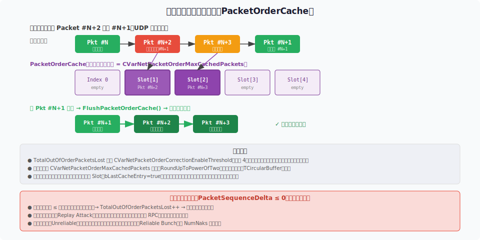

# UE 网络同步深度解析

> **版本**：Unreal Engine 5.4.4  
> **源码路径**：`Engine/Source/Runtime/Engine/Private/`（NetDriver.cpp, NetConnection.cpp, DataChannel.cpp, DataReplication.cpp, RepLayout.cpp, IpNetDriver.cpp）  
> **阅读难度**：面向初学者，用生活化比喻辅助理解；同时提供完整函数调用链供深入研究

---

## 目录

1. [基础概念先行](#一基础概念先行)
2. [连接的建立与断开](#二连接的建立与断开)
3. [服务端发送路径详解](#三服务端发送路径详解)
4. [客户端接收路径详解](#四客户端接收路径详解)
5. [异常数据包处理](#五异常数据包处理)
6. [网络同步优化模块](#六网络同步优化模块)
7. [附录：关键数据结构速查](#附录关键数据结构速查)

---

## 一、基础概念先行

### 1.1 什么是"同步（Replication）"？

假设你在玩一个多人射击游戏：你的屏幕上看到敌人在 A 点，而服务器上他实际在 B 点。这就是**不同步**。  
UE 解决这个问题的方式叫做 **Replication（属性同步）**：

- 服务器是**唯一权威**，它决定每个角色的位置、血量等状态
- 服务器周期性地把变化的数据发给每个客户端
- 客户端收到后更新本地的 Actor 状态，让玩家的屏幕和服务器保持一致

> **比喻**：服务器是一家"中央银行"，每个客户端是"分行"。中央银行定期把账本更新同步给分行，分行自己不能修改账本（只有权威服务器能修改）。

### 1.2 角色（Role）系统：谁说了算？

每个 Actor 有两个 Role 字段：

| 字段 | 含义 |
|------|------|
| `Role`（本地视角） | 本机对这个 Actor 拥有什么权限 |
| `RemoteRole`（对端视角） | 对端对这个 Actor 拥有什么权限 |

| 值 | 含义 |
|----|------|
| `ROLE_Authority` | 权威端，可以修改状态 |
| `ROLE_SimulatedProxy` | 模拟代理，只能接收同步数据 |
| `ROLE_AutonomousProxy` | 自治代理，可以预测移动（如玩家控制的角色） |

服务器上：`PlayerCharacter.Role = Authority`  
客户端上：`PlayerCharacter.Role = SimulatedProxy`（其他玩家的角色）

### 1.3 三层网络架构总览

UE 网络栈分三层，就像邮政系统：

| 层 | 对应类 | 比喻 |
|----|--------|------|
| NetDriver | `UNetDriver` | 邮政总局：管理所有连接、驱动整个复制流程 |
| Connection | `UNetConnection` | 快递员：代表一条端到端连接，负责发包、收包、ACK |
| Channel | `UChannel` | 信封：按主题分类的逻辑数据流（Actor频道、控制频道） |



**传输协议**：底层使用 **UDP**（不可靠、无连接、低延迟）。UE 在应用层自己实现了可靠性（通过 `FNetPacketNotify` 的序号 + ACK bitmap）。

---

## 二、连接的建立与断开

### 2.1 Dedicated Server 如何监听

**源码**：`UIpNetDriver::InitListen()` ≈ 第 1025 行，`UWorld::Listen()` ≈ World.cpp 第 6793 行

#### 2.1.1 谁调用了 InitListen？调用链是什么？

很多人以为是 `PlayerController` 触发了服务器监听。实际上完全不是——服务器启动监听的责任者是 **`UEngine::LoadMap()`**。完整调用链：

```
程序入口（main）
  → UGameInstance::StartGameInstance()          // GameInstance.cpp 第 655 行
      → UEngine::Browse(WorldContext, URL)       // UnrealEngine.cpp
          → URL.IsLocalInternal() == true（纯服务器首次加载）
          → UEngine::LoadMap(WorldContext, URL)  // UnrealEngine.cpp 第 14956 行
              → NewWorld->InitWorld()
              → WorldContext.World()->SetGameMode(URL)
              → if (!GIsClient || URL.HasOption("Listen"))  // 第 15435 行
                  → WorldContext.World()->Listen(URL)       // World.cpp 第 6793 行
                      → GEngine->CreateNamedNetDriver(NAME_GameNetDriver)
                      → NetDriver->SetWorld(this)
                      → NetDriver->InitListen(this, InURL, ...)  // ← 这里
```

关键条件：`if (!GIsClient || URL.HasOption(TEXT("Listen")))`

- **Dedicated Server**：`GIsClient == false`，所以无条件调用 `Listen()`
- **Listen Server**（主机也是玩家）：URL 中带有 `?Listen` 选项，同样调用
- **纯客户端**：两个条件都不满足，**不调用 Listen()**

`UWorld::Listen()` 内部：

```cpp
// World.cpp 第 6793 行
bool UWorld::Listen(FURL& InURL)
{
    // 1. 通过 GEngine 创建 NetDriver（根据 NetDriverDefinitions 配置）
    GEngine->CreateNamedNetDriver(this, NAME_GameNetDriver, NAME_GameNetDriver);
    NetDriver = GEngine->FindNamedNetDriver(this, NAME_GameNetDriver);
    NetDriver->SetWorld(this);

    // 2. 调用 InitListen 绑定 UDP 端口（默认 7777）
    NetDriver->InitListen(this, InURL, bReuseAddressAndPort, Error);

    // 3. 记录 ServerTravelPause 参数（用于 ServerTravel 前延迟）
    NextSwitchCountdown = NetDriver->ServerTravelPause;
}
```

**`UIpNetDriver::InitListen()` 内部做了什么**：

1. `InitBase(false, ...)` — 创建 UDP Socket，调用 `bind()` 绑定到指定端口（默认 7777）
2. `InitConnectionlessHandler()` — 初始化 **StatelessConnect 处理器**（DDoS 防护，见 2.3 节）
3. Socket 进入 Receive 等待状态，后续由 `TickDispatch()` 每帧轮询新数据包

**UNetDriver 属于谁？**  
`UNetDriver` 的所有者是 **`UWorld`**（通过 `UWorld::NetDriver` 指针持有），而不是 `PlayerController`。同时 `UEngine` 的 `WorldContext.ActiveNetDrivers` 列表也保留了索引。`PlayerController` 只是通过 `UNetConnection::PlayerController` 字段与某条连接关联，**PC 不控制 NetDriver 的生命周期**。

---

### 2.2 Client 如何发起连接

**源码**：`UIpNetDriver::InitConnect()` ≈ 第 985 行，`UPendingNetGame::InitNetDriver()` ≈ PendingNetGame.cpp 第 34 行

#### 2.2.1 谁调用了 InitConnect？调用链是什么？

客户端连接不是直接调用 `InitConnect`，而是通过一个中间对象 **`UPendingNetGame`** 完成。完整调用链：

```
玩家在主菜单点击"连接"或 PlayerController 调用 ClientTravel()
  → APlayerController::ClientTravel() 通知 ULocalPlayer 发起 Travel
      → UEngine::Browse(WorldContext, URL)     // UnrealEngine.cpp
          → URL.IsInternal() && GIsClient      // 是网络 URL，且我们是客户端
          → if (WorldContext.World()) ShutdownWorldNetDriver(...)  // 先关闭旧 NetDriver
          → WorldContext.PendingNetGame = NewObject<UPendingNetGame>()  // 第 14686 行
          → WorldContext.PendingNetGame->Initialize(URL)
          → WorldContext.PendingNetGame->InitNetDriver()  // PendingNetGame.cpp 第 34 行
              → GEngine->CreateNamedNetDriver(this, NAME_PendingNetDriver, ...)
              → NetDriver->InitConnect(this, URL, Error)  // ← 这里
              → LocalPlayer->PreBeginHandshake(...)
                  → BeginHandshake()
                      → ServerConn->Handler->BeginHandshaking(...)
                          → SendInitialJoin() → 发出第一个 NMT_Hello 包
```

`UPendingNetGame` 是一个临时持有对象，专门用于"正在尝试连接服务器但地图还没加载完"的阶段。它存储在 `FWorldContext::PendingNetGame` 中，连接成功后 `MovePendingLevel()` 会把它解散并把 NetDriver 迁移到新 World。

**`UIpNetDriver::InitConnect()` 内部做了什么**：

1. `InitBase(true, ...)` — 创建 UDP Socket，**不 bind** 本地端口（由 OS 随机分配）
2. `NewObject<UIpConnection>()` — 创建代表"到服务器的连接"的 `UNetConnection` 对象
3. `InitLocalConnection(USOCK_Pending)` — 连接状态设为 `USOCK_Pending`（握手未完成）
4. `CreateInitialClientChannels()` — 预创建 Control Channel（Channel #0）

---

### 2.3 握手的全过程

**完整的连接建立序列（来自源码中的注释和状态机）：**



| 步骤 | 方向 | 数据包类型 | 说明 |
|------|------|-----------|------|
| 1 | C→S | `NMT_Hello` (Stateless) | 客户端发起，携带版本信息 |
| 2 | S→C | Challenge | 服务器发送随机挑战值 |
| 3 | C→S | ChallengeResponse | 客户端用 HMAC 签名挑战值 |
| 4 | S | `HasPassedChallenge()=true` | 服务器验证签名，**此时才创建 UNetConnection** |
| 5 | C→S | `NMT_Hello` | 通过可靠控制频道发送正式 Hello |
| 6 | C→S | `NMT_Login` | 发送登录信息（玩家名、网络版本等） |
| 7 | S→C | `NMT_Welcome` | 服务器告知地图名、游戏模式 |
| 8 | C | 加载新地图（LoadMap） | 客户端接收 Welcome 后开始加载服务器指定的地图 |
| 9 | C→S | `NMT_Join` | 地图加载完成，通知服务器可以正式加入 |
| 10 | S | SpawnPlayActor() | 服务器为该连接创建 PlayerController |
| 11 | S→C | `NMT_JoinSplit` / Actor 复制 | PlayerController 被发送给客户端 |

**连接状态转变**：`USOCK_Pending` → `USOCK_Open`（步骤 4 之后握手通过）

**StatelessConnect 防 DDoS**：  
UDP 天然无状态，攻击者可以伪造大量 IP 地址发送 Hello 包让服务器为每个 IP 创建 `UNetConnection`，耗尽内存。StatelessConnect 的解决方案：服务器发 Challenge（含时间戳+HMAC密钥），客户端必须回传正确的签名才创建连接。攻击者因无法接收到 Challenge 包（IP 是伪造的），就无法伪造合法回应。

---

### 2.4 场景切换时 NetDriver 如何处理？（PlayerController 与 NetDriver 的关系）

这是一个常见的困惑点。结论：

> **PlayerController 被销毁 ≠ NetDriver 被销毁**。二者的生命周期完全独立。

#### 2.4.1 服务器 ServerTravel（服务器切换地图）

服务器调用 `UWorld::ServerTravel(NewMap)` 后的处理流程：

```
UWorld::ServerTravel(URL)
  → GameMode->ProcessServerTravel(URL)
      → 通知所有玩家准备 Travel（发送 NMT_NetGrowl / NMT_PrepareMapChange）
      → 设置 NextURL = URL，NextSwitchCountdown = 开始倒计时

下一帧 UEngine::TickWorldTravel()
  → NextSwitchCountdown <= 0 → 调用 UEngine::Browse(WorldContext, NextURL)
      → UEngine::LoadMap(WorldContext, NewURL, Pending=NULL, ...)
          ① ShutdownWorldNetDriver(OldWorld)   ← 旧 NetDriver 关闭，所有连接关闭
          ② 销毁旧 World 的所有 Actor（PlayerController、Pawn 全部 EndPlay）
          ③ 加载新地图，创建新 UWorld
          ④ if (!GIsClient || URL.HasOption("Listen"))  ← 服务器重新 Listen
              → World->Listen(URL)             ← 创建全新 NetDriver，重新绑定端口
          ⑤ 老连接的玩家通过"Travel 通知"自行发起重连（客户端收到 NMT_NetGrowl 后）
```

**Seamless Travel**（无缝切图，服务器常用）有所不同：  
NetDriver 在切换期间会**保留**，不会销毁，已有的 `UNetConnection` 对象被迁移到新 World。`APlayerController` 同样可选择"保留"跨越新旧地图（通过 `AGameMode::GetSeamlessTravelActorList()`）。

#### 2.4.2 客户端 ClientTravel（客户端切换服务器）

```
APlayerController::ClientTravel(NewURL)
  → ULocalPlayer 发起 Travel 请求
  → UEngine::Browse(WorldContext, NewURL)
      ① ShutdownWorldNetDriver(OldWorld)    ← 关闭到旧服务器的 NetDriver + 连接
      ② 销毁旧 World 的 PlayerController（LoadMap 内部，第 15127 行）
      ③ 创建新 UPendingNetGame → InitNetDriver() → InitConnect()（连接新服务器）
      ④ 握手完成 → 加载新地图 → 服务器为此连接创建新 PlayerController
```

因此客户端切换服务器时：
- **旧的 NetDriver → 销毁**（`ShutdownWorldNetDriver`）
- **旧的 PlayerController → 销毁**（`World->DestroyActor(PlayerController)`）
- 两者都是由 `LoadMap` 负责，顺序是先销毁 NetDriver，再销毁 PlayerController

#### 2.4.3 所有权关系总结

```
GEngine
  └── WorldContext.ActiveNetDrivers[]
        └── UNetDriver (NAME_GameNetDriver)
              ├── UWorld*    World         ← NetDriver 知道自己服务于哪个 World
              ├── UNetConnection* ServerConnection   ← 客户端用，指向服务器连接
              └── TArray<UNetConnection*> ClientConnections  ← 服务器用，所有客户端连接
                    └── UNetConnection
                          ├── APlayerController* PlayerController  ← 指回 PC（弱引用）
                          └── AActor* OwningActor                  ← PC 的 Actor 指针

UWorld
  └── UNetDriver* NetDriver  ← World 持有主引用
```

`PlayerController` 不持有 NetDriver，也不控制 NetDriver。NetDriver 通过 `UNetConnection::PlayerController` 指针知道是哪个 PC，但这是**单向弱引用**，PC 被销毁不会导致 NetDriver 销毁。

---

### 2.5 连接断开：谁调用 Close？何时调用？

**源码**：`UNetConnection::Close()` ≈ NetConnection.cpp 第 1035 行

`UNetConnection::Close()` 内部：

```cpp
void UNetConnection::Close(FNetResult&& CloseReason)
{
    SendCloseReason(CloseReason);          // 通知对端：我要断了，原因是 X
    Channels[0]->Close(Destroyed);        // 关闭 Control Channel（可靠传输，对端收到后触发清理）
    SetConnectionState(USOCK_Closed);     // 状态标记
    FlushNet();                            // 把队列里剩余的数据全部发出去
    // ... analytics / RPCDoS 清理
}
```

#### 2.5.1 调用场景完整列表

**场景 A：服务器主动踢出玩家**（踢人、地图切换通知断开）

```
服务端游戏代码
  → GameMode->KickPlayer(PlayerController, Reason)
  → APlayerController::ClientReturnToMainMenuWithTextReason_Implementation()
      → GameMode->Logout(PC)          // 广播 PostLogout
      → Connection->Close(ENetCloseResult::Disconnect)
```

或通过控制台命令 `DISCONNECT`：

```
UNetDriver::HandleNetDisconnectCommand()
  → ServerConnection->SendCloseReason(Disconnect)
  → FNetControlMessage<NMT_Failure>::Send()    // 告知对端
  → Connection->Close(ENetCloseResult::Disconnect)
```

---

**场景 B：客户端主动退出**

```
LocalPlayer 退出游戏 / 调用 ClientTravel 到新服务器
  → UEngine::Browse(WorldContext, NewURL)
      → ShutdownWorldNetDriver(World)
          → DestroyNamedNetDriver(World, NetDriverName)
              → UNetDriver::Shutdown()  // NetDriver.cpp 第 2040 行
                  → ServerConnection->Close()   // 客户端：关闭到服务器的连接
                  // 发送 NMT_Failure 通知服务器
```

---

**场景 C：超时断开**（网络中断，对方没有发包超过 InitialConnectTimeout/ConnectionTimeout 秒）

```
每帧 UNetDriver::TickFlush()
  → 调用所有 UNetConnection::Tick()
      → UNetConnection::Tick()  // NetConnection.cpp 第 4477 行
          → Timeout = GetTimeoutValue()   // 初次连接阶段: InitialConnectTimeout (30s)
                                          // 已建立连接阶段: ConnectionTimeout (60s)
          → if ((CurrentRealtimeSeconds - LastReceiveRealtime) > Timeout)
              → HandleConnectionTimeout(Error)
                  → GEngine->BroadcastNetworkFailure(... ConnectionTimeout ...)
                  → Close(ENetCloseResult::ConnectionTimeout)
```

---

**场景 D：协议错误/安全拦截**（Channel 异常、RPC 异常、可靠缓冲区溢出等）

遍布 `DataChannel.cpp` 中，例如：

```
DataChannel.cpp
  → Received Bunch 解析异常
  → Connection->Close(ENetCloseResult::ControlChannelMessageFail)
```

也存在于 RPC 重传缓冲区满时：

```
NetDriver.cpp 第 2693 行
  → Connection->Close(ENetCloseResult::RPCReliableBufferOverflow)
```

---

**场景 E：服务器 ServerTravel（非 Seamless）**

```
UEngine::LoadMap() 第 15098 行
  → ShutdownWorldNetDriver(OldWorld)
      → DestroyNamedNetDriver()
          → UNetDriver::Shutdown()
              → 遍历 ClientConnections
              → 发送 NMT_Failure ("Host closed the connection")
              → CurClient->FlushNet()
              → ClientConnections[i]->CleanUp()    // 最终调用 Close()
```

---

#### 2.5.2 Close 之后：PlayerController 如何被销毁？

`Close` 只关闭连接，不直接销毁 Actor。真正销毁 PC 的路径是 `CleanUp()`：

```
UNetConnection::CleanUp()           // NetConnection.cpp 第 1251 行
  ① Close(ENetCloseResult::Cleanup) // 如果还没关，先关闭
  ② 从 Driver->ClientConnections 移除自己
  ③ Kill all open Channels (UActorChannel::ConditionalCleanUp)
  ④ DestroyOwningActor()
        → OwningActor->OnNetCleanup(this)   // 通知 OwningActor（即 PlayerController）
              → APlayerController::OnNetCleanup()  // PlayerController.cpp 第 1404 行
                    → World->DestroySwappedPC(Connection)
                    → Player->PlayerController = nullptr
                    → Destroy(true)              // ← PlayerController 在这里被销毁！
  ⑤ MarkAsGarbage()                              // UNetConnection 自身等待 GC 回收
```

**GameMode::Logout 的触发时机**：  
`AGameModeBase::Logout(AController*)` 由 `AController::EndPlay()` 调用，而 `EndPlay` 发生在 `Destroy()` 过程中。即 PlayerController 销毁 → `EndPlay` → `GameMode::Logout`，这比 `OnNetCleanup` 调用稍晚一点。

---

#### 2.5.3 完整断开时序图（服务端角度）

```
[客户端断开 or 超时]
    │
    ▼
UNetConnection::Tick() 检测到超时
或 DataChannel 接收到 Close Bunch
    │
    ▼
UNetConnection::Close(reason)
  ├─ SendCloseReason() ──────────────────→ 对端收到 Close 原因
  ├─ Channels[0]->Close(Destroyed)         （Control Channel 发送 Close Bunch）
  ├─ SetConnectionState(USOCK_Closed)
  └─ FlushNet()
    │
    ▼
下一帧 UNetDriver::TickDispatch()
  → 从 ClientConnections 找到 USOCK_Closed 的连接
  → 调用 Connection->CleanUp()
      ├─ 关闭所有 ActorChannels（通知对端销毁复制 Actor）
      ├─ Driver->RemoveClientConnection(this)
      └─ DestroyOwningActor()
            └─ PlayerController->OnNetCleanup()
                  ├─ Destroy(true)       ← PC 销毁，EndPlay 触发
                  └─ GameMode::Logout()  ← 通知游戏层
    │
    ▼
UNetConnection 标记为 Garbage，等待 GC 回收
NetDriver 继续存活，等待其他客户端连接
```

---

## 三、服务端发送路径详解

### 3.1 整体流程一览

每一帧（Tick），服务器的 `UWorld::Tick()` 会调用 `UNetDriver::TickFlush()`，进而调用核心函数 `ServerReplicateActors()`：



整个流程分为**八个阶段**，接下来逐一详解。

---

### 3.2 第一阶段：收集候选 Actor — BuildConsiderList()

**源码**：`UNetDriver::ServerReplicateActors_BuildConsiderList()` ≈ 第 4895 行

把世界中**所有需要复制的 Actor** 筛选出来放入候选列表。

**哪些 Actor 会被跳过？**

| 跳过条件 | 原因 |
|---------|------|
| `bPendingNetUpdate=false && TimeSeconds <= NextUpdateTime` | 该 Actor 本帧还未到更新时间（频率控制） |
| `IsPendingKillPending()` | Actor 正在被销毁 |
| `RemoteRole == ROLE_None` | 该 Actor 不需要同步 |
| `NetDriverName != 匹配` | 属于不同的 NetDriver |
| `!IsActorInitialized()` | Actor 尚未完成初始化 |
| Level 流式加载中 | 对应的关卡还没加载到客户端 |

**对通过筛选的 Actor**：
- 调用 `Actor->CallPreReplication()` — 让 Actor 在复制前更新数据
- 计算 `NextUpdateTime = TimeSeconds + OptimalNetUpdateDelta`（根据 `NetUpdateFrequency` 动态调整）

> **比喻**：收件室把所有要发出的快递收集起来，顺便确认哪些已经超过发货时间、哪些还不需要发。

---

### 3.3 第二阶段：优先级排序 — PrioritizeActors()

**源码**：`UNetDriver::ServerReplicateActors_PrioritizeActors()` ≈ 第 5110 行

候选列表中的 Actor 按**优先级**排序，优先处理重要的 Actor。

**优先级计算**：
```cpp
Priority = Actor->GetNetPriority(ConnectionViewers, bLowBandwidth) 
         * TimeSinceLastReplicated  // 越久没同步，优先级越高
```

- 靠近玩家的 Actor 优先级更高
- 主动设置了高 `NetPriority` 的 Actor 更先处理
- 当服务器 CPU 负载高时，`MaxSortedActors` 减少，低优先级 Actor 被丢弃（本帧不复制）

**特殊情况**：`DestructionInfo` 条目（需要在客户端销毁的 Actor）也进入此列表，确保"删除"信息能被可靠发送。

---

### 3.4 第三阶段：相关性判断 — IsActorRelevantToConnection()

**源码**：`UNetDriver::ProcessPrioritizedActorsRange()` ≈ 第 5261 行

对每个候选 Actor，检查它对当前连接（玩家）是否**相关（Relevant）**。

**相关性判断逻辑**：
```
IsActorRelevantToConnection(Actor, ConnectionViewers)
  → Actor->IsNetRelevantFor(ViewTarget) 
     (距离、bAlwaysRelevant、bOnlyRelevantToOwner 等条件)
```

**bIsRecentlyRelevant**：即使当前不相关，若该 Actor 在最近 `RelevantTimeout` 秒内曾经相关过，也继续同步（避免 Actor 刚从视野离开就立刻消失）。

**结果处理**：
- 不相关且频道已存在 → `Channel->Close(Relevancy)` 通知客户端销毁该 Actor
- 相关但没有频道 → `CreateChannelByName(NAME_Actor)` + `SetChannelActor()` 建立新频道，首次同步全量数据

---

### 3.5 第四阶段：属性变化检测



**源码**：`FRepLayout::CompareProperties()` ≈ 第 1740 行，`CompareProperties_r()` ≈ 第 1611 行，`PropertiesAreIdenticalNative()` ≈ 第 659 行

---

#### 3.5.1 Shadow Buffer 存在哪里？

Shadow Buffer（代码中称为 `StaticBuffer`，类型为 `FRepStateStaticBuffer`）**根据使用场景存储在不同地方**：

| 用途 | 宿主结构 | 生命周期 |
|------|---------|---------|
| **服务端**：跨连接共享的比较基准 | `FRepChangelistState::StaticBuffer`（内含于 `FReplicationChangelistMgr`） | 随 Actor 复制生命周期 |
| **客户端**：接收方跟踪"已应用值" | `FReceivingRepState::StaticBuffer` | 随连接生命周期 |

`FRepStateStaticBuffer` 内部就是一块原始字节数组：

```cpp
// RepLayout.h 第 363 行
struct FRepStateStaticBuffer : public FNoncopyable
{
private:
    // Properties will be copied in here so memory needs aligned to largest type
    TArray<uint8, TAlignedHeapAllocator<16>> Buffer;  // 16 字节对齐的字节数组
    TSharedRef<const FRepLayout> RepLayout;
};
```

**关键**：Shadow Buffer **不是 Actor 对象内存的完整副本**，而是一块只包含"被标记为同步的属性"的紧凑内存区。它的大小由 `ShadowDataBufferSize`（编译期计算）决定，远小于整个 Actor 对象。

---

#### 3.5.2 Shadow Buffer 如何初始化？（CreateShadowBuffer）

**源码**：`FRepLayout::InitRepStateStaticBuffer()` ≈ 第 7239 行

Actor 首次参与复制时：

```
InitRepStateStaticBuffer(ShadowData, Source):
  ① Buffer.SetNumZeroed(ShadowDataBufferSize)     // 分配全零字节
  ② ConstructProperties(ShadowData)               // 在 Buffer 内原地构造每个属性
       → for each Parent: Property->InitializeValue(ShadowData + Parent.ShadowOffset)
         // FString → 构造空字符串对象
         // TArray → 构造空数组对象
         // int/float → 已由 SetNumZeroed 初始化为 0
  ③ CopyProperties(ShadowData, Source)            // 从 CDO（默认对象）深拷贝初始值
       → for each Parent: Property->CopyCompleteValue(ShadowData + Parent, Source + Parent)
```

`Source` 通常是 Actor 的 **Archetype（CDO）**，而不是对象本身。这意味着 Shadow Buffer 初始值等于"对象出厂默认值"，第一帧比较时所有与默认值不同的属性都会被标记为变化。

**Packed Shadow Buffer**：  
当 `GUsePackedShadowBuffers=1`（默认开启）时，Shadow Buffer 内属性按对齐大小排序紧密排列（`BuildShadowOffsets` 编译期计算），不留 Actor 对象本身的那些非同步字段的间隙。因此 `ShadowOffset`（属性在 Shadow Buffer 中的偏移）≠ `Offset`（属性在 Actor 对象内存中的偏移）。对外通过 `FRepShadowDataBuffer` 封装，用 `Cmd.ShadowOffset` 寻址。

---

#### 3.5.3 不同属性类型如何比较？（PropertiesAreIdenticalNative）

**源码**：`PropertiesAreIdenticalNative()` ≈ 第 659 行

比较时，UE 根据每个属性的 `ERepLayoutCmdType` 分发到不同的比较实现：

```cpp
// CompareProperties_r 中的比较（第 1639 行）：
const FConstRepObjectDataBuffer Data       = StackParams.Data       + Cmd;  // 当前 Actor 内存
FRepShadowDataBuffer             ShadowData = StackParams.ShadowData + Cmd;  // Shadow Buffer

if (!PropertiesAreIdenticalNative(Cmd, ShadowData.Data, Data.Data, ...))
{
    StoreProperty(Cmd, ShadowData.Data, Data.Data);  // 更新 Shadow → 当前值
    StackParams.Changed.Add(Handle);                  // 标记属性句柄为变化
}
```

**各类型对应的比较函数**：

| 类型 | `ERepLayoutCmdType` | 实际比较方式 | Shadow Buffer 存储内容 |
|------|--------------------|-----------|-----------------------|
| `int32` | `PropertyInt` | `*A == *B` 直接值比较 | 4 字节整数副本 |
| `float` | `PropertyFloat` | `*A == *B` 直接值比较 | 4 字节浮点数副本 |
| `double` | `Property`（generic） | `Property->Identical(A, B)` | 8 字节浮点数副本 |
| `bool`（UPROPERTY位域） | `PropertyBool` | `Property->Identical(A, B)` | 位域所在字节的完整副本 |
| `bool`（原生C++） | `PropertyNativeBool` | `*A == *B` 直接值比较 | 1 字节 |
| `FName` | `PropertyName` | `*A == *B`（FName内部是32位哈希索引，极快） | 4 字节 FName 索引副本 |
| `FString` | `PropertyString` | `*A == *B` → `FString::operator==`（逐字符比较） | **Shadow 存一个独立的 FString 对象**（含自己的堆内存） |
| `UObject*` | `PropertyObject` | `CompareObject`: `GetObjectPropertyValue(A) == GetObjectPropertyValue(B)`（**指针地址比较**） | 指针值副本（8 字节） |
| `TWeakObjectPtr<>` | `PropertyWeakObject` | `HasSameIndexAndSerialNumber`（比较 GC 内部索引） | FWeakObjectPtr 副本 |
| `TSoftObjectPtr<>` | `PropertySoftObject` | `Property->Identical(A, B)` → 比较 FSoftObjectPath 路径字符串 | FSoftObjectPtr 副本（含路径字符串堆内存） |
| `FVector` / `FRotator` | `PropertyVector` / `PropertyRotator` | `*A == *B`（逐成员比较） | 结构体整体副本 |
| `FRepMovement` | `RepMovement` | `*A == *B` | 结构体整体副本 |
| 普通 `USTRUCT` | 展开为多个子命令 | 递归比较每个叶子属性 | 各叶子属性分别在 Shadow Buffer 中占位 |
| NetSerialize struct | `Property`（generic） | `Property->Identical(A, B)` | 整个结构体二进制副本 |
| `TArray<T>` | `DynamicArray` | **特殊处理**，见下节 | Shadow 中存一个真实的 FScriptArray 对象 |

**关于 `UObject*` 的重要注意**：  
Shadow Buffer 只存指针地址。比较的是"指针是否换了"，而不是"指针指向的对象内容是否变了"。如果 `Actor->Target = OtherActor`，指向改变 → 检测到变化，会同步这个引用。但如果 `OtherActor->Health = 50` 变了，这是 `OtherActor` 自己的属性同步问题，与 `Actor->Target` 无关。

---

#### 3.5.4 TArray 的内容修改如何被检测？

这是最关键的问题：**即使 TArray 的指针（容器地址）没变，内容修改也会被检测到**。

原因在于 Shadow Buffer 对 `TArray` 做的是**深拷贝（deep copy）**，而不是指针拷贝：

```
InitRepStateStaticBuffer → CopyProperties:
  Property->CopyCompleteValue(ShadowData + Parent, Source + Parent)
  // 对 FArrayProperty 来说，CopyCompleteValue 会：
  //   1. 调用 Array->Empty()  清空 shadow 数组
  //   2. 调用 Array->AddUninitialized(n) 分配 n 个元素
  //   3. 逐元素 CopyCompleteValue 深拷贝
```

因此，Shadow Buffer 中的 `FScriptArray`（TArray 的底层结构）有自己独立的堆内存，和 Actor 对象中的数组完全独立。

**比较时（CompareProperties_Array_r，第 1655 行）**：

```cpp
FScriptArray* ShadowArray = (FScriptArray*)StackParams.ShadowData.Data;  // Shadow 中的数组
FScriptArray* Array       = (FScriptArray*)StackParams.Data.Data;        // Actor 中的数组

int32 ArrayNum       = Array->Num();
int32 ShadowArrayNum = ShadowArray->Num();

// ① 先把 Shadow 数组 resize 到与当前数组等长
FScriptArrayHelper StoredArrayHelper((FArrayProperty*)Cmd.Property, ShadowArray);
StoredArrayHelper.Resize(ArrayNum);   // 若元素增加，新元素由 InitializeValue 初始化

// ② 逐元素比较（调用 CompareProperties_r 递归比较每个 T）
for (int32 i = 0; i < ArrayNum; i++)
{
    // 对比 Array->GetData()[i] 与 ShadowArray->GetData()[i]
    LocalHandle = CompareProperties_r(SharedParams, NewStackParams, ...);
}

// ③ 结果：任何元素变化 → Changed 列表包含数组句柄 + 变化索引列表
//         仅元素数量减少（缩短）→ 发送数组句柄（通知客户端截断）
```

**示意图**：

```
Actor 内存：
  TArray<float> Scores = {100.0, 200.0, 300.0, 400.0}  ← 指针不变，内容改了

Shadow Buffer：
  FScriptArray  Scores = {100.0, 200.0,  50.0, 400.0}  ← 深拷贝，与 Actor 独立

比较结果：
  元素 [2]: 300.0 ≠ 50.0 → Changed.Add(HandleFor_Scores_[2])
```

**结构体数组（TArray<FMyStruct>）**：每个元素的每个叶子属性都会被递归比较，改变的具体子属性句柄都会被记录。

---

#### 3.5.5 Push Model 优化：实现方案

**问题背景**：  
传统方案每帧对每个 Actor 的每个可同步属性做一次内存比较。假设 1000 个 Actor 每帧都参与比较，哪怕属性没变化，CPU 也要全部扫描一遍。

**Push Model 的核心思路**：把"属性是否变化"的判断，从"被动轮询比较"变成"主动推送标记"。代码逻辑变成：
- 以前：*每帧 → 网络系统问 Actor「你的属性变了吗？」→ 逐一比较内存*
- 现在：*属性设置时 → 代码主动告诉网络系统「我的 Health 变了」→ 只比较标记为 Dirty 的属性*

**存储结构**：

```
全局 Push Model 系统
  └── FPushModelObjectManager（单例）
        └── TMap<FNetLegacyPushObjectId, FPushModelPerNetDriverState> 对象表
              └── FPushModelPerNetDriverState
                    └── TBitArray<> PropertyDirtyStates  ← 每个属性一个 bit
                        bool bHasDirtyProperties         ← 快速检查是否有 Dirty
```

```cpp
// PushModelPerNetDriverState.h
class FPushModelPerNetDriverState
{
    TBitArray<> PropertyDirtyStates;  // 长度 = 该 Actor 可同步属性数量
    uint8 bRecentlyCollectedGarbage : 1;
    uint8 bHasDirtyProperties : 1;
};
```

每个 Actor 在被注册为可复制对象时，获得一个 `FNetLegacyPushObjectId`（整数索引），存储在 `FRepChangelistState::PushModelObjectHandle` 中。

**如何标记 Dirty（开发者调用路径）**：

```cpp
// 游戏代码中：
void AMyActor::SetHealth(int32 NewHealth)
{
    Health = NewHealth;
    MARK_PROPERTY_DIRTY_FROM_NAME(AMyActor, Health, this);
    // 展开等价于：
    // UEPushModelPrivate::MarkPropertyDirty(this, GetPushModelObjectId(this), AMyActor::FRepIndex_Health)
}
```

`MarkPropertyDirty` 内部：

```
MarkPropertyDirty(Object, ObjectId, RepIndex):
  State = FPushModelObjectManager::GetState(ObjectId)
  State->PropertyDirtyStates[RepIndex] = true
  State->bHasDirtyProperties = true
```

**比较阶段如何使用 Dirty Bit（CompareParentProperties 第 1556 行）**：

```
CompareParentProperties（Push Model 路径）：
  if HasDirtyProperties():
    // 只遍历 Dirty 的属性（TConstSetBitIterator 跳过为 0 的 bit）
    for DirtyPropertyIndex in GetDirtyProperties():
      CompareParentPropertyHelper(DirtyPropertyIndex, ...)  // 正常内存比较
  // 比较完毕后清零所有 Dirty bit：
  PushModelState->ResetDirtyStates()
```

注意：**Push Model 仍然做内存比较**（`PropertiesAreIdenticalNative`），只是大幅减少了比较的属性数量。Push Model 的标记是"提示系统这个属性可能变了，需要比较"，而不是直接跳过比较发送数据。这样做的好处是：即使开发者忘记 GC 后指针类型属性需要重新检查，系统仍然有保底的内存比较兜底。

**注意事项**：

```
!! 以下情况必须手动标记 Dirty，否则修改永远不会被同步 !!

1. 修改 struct 内部字段：
   MyStruct.SomeField = NewValue;
   MARK_PROPERTY_DIRTY_FROM_NAME(AMyActor, MyStruct, this);  // 标记 struct 整体

2. 修改 TArray 内容（add/remove/change element）：
   MyArray.Add(Item);
   MARK_PROPERTY_DIRTY_FROM_NAME(AMyActor, MyArray, this);   // 标记 array 整体

3. 不要持有属性的可变引用（non-const reference/pointer）：
   FMyStruct& Ref = MyStruct;   // ← 危险！
   Ref.Field = NewValue;         // ← 修改不会触发 Dirty 标记

   安全做法：MARK before返回引用，或不用引用直接赋值
```

**Push Model 注册**（`DOREPLIFETIME_WITH_PARAMS_FAST` + `bIsPushBased = true`）：

```cpp
void AMyActor::GetLifetimeReplicatedProps(TArray<FLifetimeProperty>& OutLifetimeProps) const
{
    FDoRepLifetimeParams Params;
    Params.bIsPushBased = true;
    DOREPLIFETIME_WITH_PARAMS_FAST(AMyActor, Health, Params);
    DOREPLIFETIME_WITH_PARAMS_FAST(AMyActor, MyArray, Params);

    // 非 Push Model 属性：每帧都比较（bIsPushBased = false 默认）
    DOREPLIFETIME(AMyActor, AlwaysChangingValue);
}
```

非 Push Model 属性在 `CompareParentProperties` 中通过 `IsPropertyDirty` 判断：非 Push Model 属性的 bit 永远被视为 `true`（即永远进入比较流程），等效于没有 Push Model 优化。

---

#### 3.5.6 完整数据流小结

```
① 服务器帧开始：Actor 游戏逻辑修改属性值
   - 若使用 Push Model → MARK_PROPERTY_DIRTY → 设置 Dirty bit

② CompareProperties() 调用：
   - 无 Push Model：遍历所有属性，逐一做 PropertiesAreIdenticalNative()
   - 有 Push Model：只遍历 Dirty 属性，做 PropertiesAreIdenticalNative()

③ PropertiesAreIdenticalNative() 根据类型：
   - int/float/bool/FName：直接 == 比较
   - FString：FString::operator==（逐字符比较，shadow 有独立 FString 副本）
   - UObject*：比较指针地址
   - TArray<T>：CompareProperties_Array_r，深拷贝 shadow 数组，逐元素比较

④ 发现变化（属性不一致）：
   - StoreProperty(ShadowData, ObjectData) → 更新 Shadow Buffer = 当前值
   - Changed.Add(Handle)                  → 记录该属性句柄到 Changed 列表

⑤ Changed 列表进入 FRepChangedHistory（环形缓冲区，最多 64 项），
   供 FSendingRepState 使用（每连接独立跟踪进度）

⑥ 若某 Bunch 被 NAK：
   - 对应 Changed 列表的 Resend = true
   - 下次 ReplicateProperties 时 MergeChangeLists() 把 NAK 历史合并进本次发送
```

---

**可靠性保证**：  
`FRepChangelistMgr` 维护一个 **环形历史缓冲区**（最多 64 帧历史，`FRepChangelistState::MAX_CHANGE_HISTORY = 64`）。`FSendingRepState` 每连接独立，也有 32 项的本地历史（`FSendingRepState::MAX_CHANGE_HISTORY = 32`）。如果某次发送的 Bunch 被 NAK，对应历史的 `Resend = true`，下次发送时 `MergeChangeLists()` 合并重发，确保属性变化不会因为 UDP 丢包而永久丢失。

---

### 3.6 第五阶段：属性序列化 — ReplicateProperties()

**源码**：`FRepLayout::ReplicateProperties()` ≈ 第 1935 行

把找到的变化属性写入 `FOutBunch`（输出 Bunch）：

```
ReplicateProperties():
  1. MergeChangeLists() — 合并所有未 ACK 的历史变更（本帧 + NAK 重发）
  2. Filter by Conditions — 根据 RepFlags/bNetOwner 过滤（如：某些属性只发给 Owner）
  3. SendProperties() — 逐属性写入：
       WritePropertyHandle(Handle)    // 写属性句柄（索引，用于接收端定位）
       SerializeItem(Ar, Property)    // 写属性值（根据类型序列化）
  4. 写结束标记（EndHandle=0）
```

> **属性句柄（Handle）** 是 UE 在编译期为每个需要同步的属性分配的数字 ID，接收端用它找到内存中的偏移量并写入值。

---

### 3.7 第六阶段：数据打包与分包



一个 UDP 包包含：

| 部分 | 大小 | 说明 |
|------|------|------|
| PacketHeader | ~14 bits | `OutSeq`（本包序号）+ `InSeq`（期望ACK到的序号） |
| AckHistory | 256 bits | 最近 256 个包的 ACK/NAK 位图 |
| PacketInfo | 可变 | Jitter 时钟等附加信息 |
| Bunch[1..N] | 可变 | 一到多个 Bunch |
| Terminator | 1 bit | 固定为 0，标记包结束 |
| Padding | 0-7 bits | 字节对齐填充 |

**当 Bunch 太大时**：



**源码**：`UChannel::SendBunch()` ≈ 第 1161 行

```cpp
if (Bunch.GetNumBits() > MAX_SINGLE_BUNCH_SIZE_BITS) {   // ~11200 bits
    // 进入分片循环
    while (BitsLeft > 0) {
        bitsThisBunch = min(BitsLeft, MAX_PARTIAL_BUNCH_SIZE_BITS);
        创建新的 FOutBunch，设置 bPartial=1
        if (首片) bPartialInitial=1
        if (末片) bPartialFinal=1
    }
    // 如果分片数过多（≥ GCVarNetPartialBunchReliableThreshold），强制设为可靠包
    // bOverflowsReliable = (NumOutRec + 分片数 >= RELIABLE_BUFFER)
}
```

每个 Partial Bunch 都是独立的 UDP 包，接收端收齐所有片后重组。

---

### 3.8 第七阶段：Bunch 合并优化



**源码**：`UChannel::SendBunch()` 中的合并检查

如果相邻两个 Bunch 来自同一个 Channel、都不可靠、且合并后不超过最大大小，UE 会把它们合并成一个 Bunch，减少包头开销：

```
合并条件：
  LastOut.ChIndex == Bunch.ChIndex     // 同一个频道（同一个 Actor）
  LastOut.bReliable == Bunch.bReliable // 可靠性一致
  Connection.AllowMerge == true        // 允许合并
  LastEnd 指针 == SendBuffer 末尾      // 上一个 Bunch 是最后写入的
  合并后总大小 ≤ MAX_SINGLE_BUNCH_SIZE_BITS  // 不超限
```

满足条件时，新 Bunch 的数据位被追加到 `LastOut` 中，`PopLastStart()` 撤回上次写的起始位置，相当于原地扩展。

---

### 3.9 第八阶段：发送数据包 — FlushNet()

**源码**：`UNetConnection::FlushNet()` ≈ 第 2112 行

当 `SendBuffer` 中有数据（或需要发心跳包）时，触发真正的 UDP 发送：

```
FlushNet():
  1. Handler->OutgoingHigh(SendBuffer)    // 高优先级 PacketHandler 处理（加密等）
  2. WriteBit(1) + 字节对齐               // 终止位（末字节定位标记）
  3. WritePacketHeader()                   // 写入序号头（PacketNotify）
  4. WriteFinalPacketInfo()               // 写入 Jitter 时钟
  5. LowLevelSend(SendBuffer)             // UIpConnection → sendto() → UDP 出去
  6. PacketNotify.CommitAndIncrementOutSeq() // 序号递增
  7. OutPacketId++
```

**发送时机**：
- `TickFlush()` 每帧结束时
- Channel 判断数据时间敏感时（`TimeSensitive=true`）
- 距上次发送超过 `KeepAliveTime`（发空心跳包）

---

## 四、客户端接收路径详解

下面是完整的接收处理管线总览：



---

### 4.1 第一步：UDP 数据接收 — TickDispatch()

**源码**：`UIpNetDriver::TickDispatch()` ≈ 第 318 行

```
TickDispatch():
  FPacketIterator 循环 {
    Socket->RecvFrom(Buffer, fromAddr)         // 读一个 UDP 包
    if DataView.NumBits == 0: continue         // 空包跳过
    conn = MappedClientConnections.Find(fromAddr)  // 找到对应的连接
    if conn: conn->ReceivedRawPacket(Data)     // 已有连接
    else:    ProcessConnectionlessPacket(Data) // 新连接请求（握手）
  }
```

> **比喻**：收发室每帧扫描一遍邮箱，按寄件地址把信封分发给对应的"快递员"（NetConnection）。

---

### 4.2 第二步：PacketHandler 处理链

**源码**：`UNetConnection::ReceivedRawPacket()` 内调用 `Handler->Incoming()`

PacketHandler 是一个**插件链**，每个 Component 依次处理数据包：

```
PacketHandler::Incoming(Packet):
  for each Component (倒序):
    Component->Incoming(Packet)   // 可能解密、解压、验证签名
```

内置 Component：
- **StatelessConnectHandlerComponent** — 验证握手 Cookie（HMAC 签名）
- **DTLSHandler** — 可选的 DTLS 加密层
- **PacketEncryptionHandler** — AES 加密（可选）

**末字节定位**：UE 的位流在末字节写了一个"哨兵 bit=1"，找到这个 1 可以确定实际数据位数，避免尾部填充引起歧义。

---

### 4.3 第三步：包序号校验与 ACK — ReceivedPacket()

**源码**：`UNetConnection::ReceivedPacket()` ≈ 第 2843 行

```
ReceivedPacket():
  FNetPacketNotify::ReadHeader(Reader)   // 读 InSeq + OutAckSeq + AckHistory
  PacketSequenceDelta = InSeq - InPacketId (上次处理的序号)
  
  if PacketSequenceDelta > 1:
    → 有包丢失！尝试 PacketOrderCache 缓存（等待乱序恢复）
  if PacketSequenceDelta == 1:
    → 正常，处理 ACK/NAK 通知
  if PacketSequenceDelta <= 0:
    → 重复包或序号回退，直接丢弃（防重放攻击）
  
  处理 ACK 通知：HandlePacketNotification lambda:
    收到 ACK → 告知对应 Bunch 已到达，解除重发等待
    收到 NAK → ReceivedNak()，把对应 Bunch 标记为需要重发
  
  ReadPacketInfo() → ProcessJitter()   // 读取 Jitter 时钟，计算网络抖动
```

**序号空间**：14 bit，最大值 16383，循环使用（`MakeRelative` 用差值比较避免环绕问题）。

---

### 4.4 第四步：乱序包处理 — PacketOrderCache



**源码**：`UNetConnection::ReceivedPacket()` 中的乱序缓存逻辑

UDP 无序到达是常见情况（路由器不保证顺序）。UE 用 `TCircularBuffer` 缓存乱序包：

- 收到 **#N+2** 但缺 **#N+1** → 放入 `PacketOrderCache[1]`（`SequenceDelta-1` 索引）
- 当 **#N+1** 到达时 → `FlushPacketOrderCache()` 按序处理 `#N+1 → #N+2 → #N+3`
- 超出缓存容量的极度乱序包 → 放入最后一个 Slot，标记 `bLastCacheEntry=true`

**阈值控制**：只有 `TotalOutOfOrderPacketsLost` 累计超过 `CVarNetPacketOrderCorrectionEnableThreshold`（默认 4）才开启缓存，正常低延迟网络不会有额外开销。

---

### 4.5 第五步：Bunch 解析分发 — DispatchPacket()

**源码**：`UNetConnection::DispatchPacket()` ≈ 第 3158 行

```
DispatchPacket(Packet):
  while (!Reader.AtEnd()) {
    读 FInBunch 头部：
      bControl, bOpen, bClose, CloseReason
      bReliable
      ChIndex = SerializeIntPacked(Reader)      // 变长编码，小索引只需几个 bit
      bHasPackageMapExports, bHasMustBeMappedGUIDs
      bPartial, ChSequence
      bPartialInitial, bPartialFinal
      ChName (static channel name, e.g. "Actor")
    
    验证 ChIndex < Channels.Num()              // 越界 → BunchBadChannelIndex → 关闭连接
    
    Channel = Channels[ChIndex]
    if !Channel && bOpen: Channel = CreateChannelByName(ChName)
    
    Channel->ReceivedRawBunch(InBunch)          // 分发给频道处理
  }
```

**ChIndex 变长编码**：大多数游戏的频道数在 64 以内，变长编码只需 7 bit，节省带宽。

---

### 4.6 第六步：分片 Bunch 重组

**源码**：`UChannel::ReceivedRawBunch()` 内部处理

```
if bPartialInitial:
    InPartialBunch = new FInBunch(当前片)   // 创建重组容器
elif bPartial:
    InPartialBunch.AppendDataFromChecked(当前片)  // 追加数据位

if bPartialFinal:
    完整 Bunch = InPartialBunch             // 重组完成
    ReceivedBunch(完整 Bunch)               // 向上传递
```

**乱序分片保护**：如果分片序号不连续（`bPartialInitial` 之后收到了不属于本次分片的包），整个重组过程被丢弃，避免数据混乱。

---

### 4.7 第七步：ActorChannel 接收 Bunch

**源码**：`UActorChannel::ReceivedBunch()` ≈ 第 2928 行

```
ReceivedBunch(Bunch):
  if bHasMustBeMappedGUIDs:
    读取 NumMustBeMappedGUIDs 个 GUID
    检查每个 GUID 是否已在 PackageMap 中注册（资产是否已加载）
    if 有未加载的资产: QueuedBunches.Add(Bunch); StartTickingChannel(); return

  if PendingGuidResolves > 0 || QueuedBunches.Num() > 0:
    排队等待依赖资产加载完成

  ProcessBunch(Bunch)
```

```
ProcessBunch(Bunch):
  if bOpen（首个 Bunch）:
    SerializeNewActor(Bunch)   // 读取 Actor 类型、位置等，Spawn 或查找对应 Actor

  while (!Bunch.AtEnd()):
    ReadContentBlockPayload() → 确定这段数据属于哪个子对象（Actor 本身或 Component）
    FObjectReplicator::ReceivedBunch(SubObject)
```

---

### 4.8 第八步：属性写入 Actor — ReceiveProperties()

**源码**：`FRepLayout::ReceiveProperties()` ≈ 第 3745 行

```
ReceiveProperties():
  while (true):
    Handle = ReadPropertyHandle(Reader)  // 读属性句柄
    if Handle == 0: break               // 结束标记
    
    Property = Cmd[HandleToIndex(Handle)]
    Property.SerializeItem(Reader, ObjectData + Property.Offset)  // 读值并写入 Actor 内存
    
    if Property.bHasNotify:
        RepNotifyProperties.Add(Property)  // 记录需要回调的属性
    
    StaticBuffer[Offset] = 新值             // 更新 Shadow Buffer（接收方也维护副本）
```

**内存偏移写入**：`ObjectData + Property.Offset` 直接操作 Actor 对象的内存地址，等效于 `Actor->Health = 75`，但是通用化的二进制写入，无需硬编码。

---

### 4.9 第九步：RepNotify 回调与 PostNetInit

**源码**：`FObjectReplicator::PostReceivedBunch()` 和 `Actor::PostNetInit()`

```
PostReceivedBunch():
  CallRepNotifies()
    for each Property in RepNotifyProperties:
      Actor->CallFunctionByNameWithArguments("OnRep_" + PropertyName)
      // 例如 OnRep_Health()、OnRep_Ammo()

if bSpawnedNewActor（首次收到这个 Actor 的同步数据）:
  Actor->PostNetInit()   // 等同于 BeginPlay，但保证在属性写入后调用
```

> **RepNotify 用途**：让客户端对属性变化做出响应，例如血量变化时更新 UI、播放受伤音效。

---

## 五、异常数据包处理

UE 对各种异常情况都有明确处理，以下是主要异常类型：

### 5.1 零字节包 / 末字节全 0

**触发**：`ReceivedRawPacket()` 检测到 `Count == 0` 或 `LastByte == 0`

```
Count == 0   → ENetCloseResult::ZeroSize
LastByte == 0 → ENetCloseResult::ZeroLastByte
```

两种情况都会调用 `HandleNetResultOrClose()` 关闭连接并记录 Warning 日志。

**原因分析**：
- `ZeroSize`：底层 socket 返回了空包，通常是 OS 错误或恶意填充
- `ZeroLastByte`：末字节哨兵 bit 为 0 说明数据损坏，无法确定实际 bit 数

### 5.2 超大包（SE_EMSGSIZE）

**触发**：`sendto()` 返回 `ENOBUFS` 或 `EMSGSIZE` 错误

处理：
- `DDoS.IncBadPacketCounter()` — 计入 DDoS 计数器
- 记录 Warning 日志，但**不关闭连接**（偶发的大包是 MTU 问题，不是攻击）
- 如果是服务器连接（`MyServerConnection`），调用 `FIpConnectionHelper::HandleSocketRecvError()` 尝试降低 MTU

### 5.3 Bunch 通道索引越界

**触发**：`DispatchPacket()` 中 `ChIndex >= Channels.Num()`

```
→ Close(ENetCloseResult::BunchBadChannelIndex)
```

这通常意味着对端发送了非法数据包，直接关闭连接保护安全。

### 5.4 包序号不连续（乱序/重放攻击）

**触发**：`ReceivedPacket()` 中 `PacketSequenceDelta <= 0`

```
PacketSequenceDelta <= 0:
  TotalOutOfOrderPacketsLost++
  直接丢弃（不处理），return
```

**防重放攻击原理**：序号单调递增，已处理过的序号不会再次执行。即使攻击者截获并重发一个包含 RPC 的数据包，序号检查会直接丢弃它。

### 5.5 MustBeMappedGUID 未注册

**触发**：`UActorChannel::ReceivedBunch()` 中发现有 GUID 不在 PackageMap 中

```
→ QueuedBunches.Add(Bunch)   // 排队等待
→ StartTickingChannel()      // 启动 Channel Tick
```

当资产异步加载完成后，`TickingChannel` 会重新处理队列中的 Bunch。  
如果长时间无法加载（超时），则丢弃该 Bunch。

### 5.6 连接超时

**触发**：`UNetConnection::Tick()` 中 `FPlatformTime::Seconds() - LastReceiveTime > NetConnectionTimeout`

```
→ UNetDriver::HandleConnectionTimeout(Connection)
→ Connection->Close(ENetCloseResult::ConnectionTimeout)
→ 销毁 PlayerController，服务器广播 PlayerLeft 事件
```

默认超时时间：`NetConnectionTimeout = 30.0f`（可在 `DefaultGame.ini` 中配置）。

---

## 六、网络同步优化模块

UE 的网络同步并非"来者不拒"的全量广播，而是一套多层次的优化体系：**先决定谁需要同步（剔除）→ 再决定发多少（带宽预算）→ 再决定怎么发（压缩与合并）**。本节从源码出发，系统梳理各层优化机制。

---

### 6.1 Actor 休眠机制（Dormancy）

#### 核心思路

如果一个 Actor 长时间没有任何变化（比如地图上静止的装饰物），与其每帧都执行完整的属性比较和序列化流程，不如让它"休眠"——完全跳过复制管线。

#### 休眠状态枚举

```cpp
// 来源：Engine/Classes/GameFramework/Actor.h
enum class ENetDormancy : uint8 {
    DORM_Never,         // 永远不允许休眠
    DORM_Awake,         // 当前处于激活复制状态
    DORM_DormantAll,    // 对所有连接都休眠
    DORM_DormantPartial,// 对部分连接休眠（由 GetNetDormancy() 判断）
    DORM_Initial,       // 初始休眠，生成后即休眠（适合地图预置静态 Actor）
};
```

`DORM_Initial` 是性能最优的选项：Actor spawn 后从不进入复制流程，直到 `FlushNetDormancy()` 被调用。

#### 休眠判定流程

```
ServerReplicateActors_PrioritizeActors()         // NetDriver.cpp 第 5110 行
    └─ ShouldActorGoDormant()                    // NetDriver.cpp 第 5088 行
           ├─ 检查 NetDormancy 枚举值
           ├─ 检查当前连接是否处于低带宽状态
           └─ 调用 AActor::GetNetDormancy() 虚函数（可自定义判断逻辑）
```

当 `ShouldActorGoDormant()` 返回 `true`，该 Actor 被从 **FNetworkObjectList::ActiveObjects** 移动到 **DormantObjectsPerConnection**，后续帧的 `BuildConsiderList` 不会再遍历它（见 6.5 节）。

#### 唤醒流程

```cpp
// 任何导致 Actor 状态变化的代码都应调用：
Actor->FlushNetDormancy();
// 内部设置 bPendingNetUpdate = true
// BuildConsiderList 检测到 bPendingNetUpdate=true 时将 Actor 重新加入 ActiveObjects
```

#### 复制器复用优化

```cpp
// NetDriver.cpp 第 371 行
static TAutoConsoleVariable<bool> GbNetReuseReplicatorsForDormantObjects(
    TEXT("Net.ReuseReplicatorsForDormantObjects"),
    true,
    TEXT("If true, replicators are kept for dormant objects instead of being destroyed")
);
```

默认开启。休眠时保留 `FObjectReplicator` 而不销毁，唤醒后可直接复用已有的 ShadowBuffer 和 ChangelistMgr，避免重新构建带来的带宽峰值。

#### 验证 CVar

```cpp
// NetDriver.cpp 第 364 行
static int32 GNetDormancyValidate = 0;
// net.DormancyValidate：若设为 1，则在休眠期检测 Actor 是否意外改变了属性
// 用于调试"明明已经休眠，但客户端看到了错误状态"类问题
```

---

### 6.2 Actor 相关性剔除（Net Relevancy）

#### 三阶段漏斗模型

```
BuildConsiderList()          → 初筛：遍历所有 Active Actor，排除关闭/无效的
    └─ IsNetRelevantFor()    → 精筛：对每个 Viewer（玩家）判断 Actor 是否相关
           └─ PrioritizeActors() → 排序：按优先级降序排列待同步 Actor
```

#### BuildConsiderList（NetDriver.cpp 第 4895 行）

```cpp
void UNetDriver::ServerReplicateActors_BuildConsiderList(
    TArray<FNetworkObjectInfo*>& OutConsiderList, float ServerTickTime)
{
    // 只遍历 FNetworkObjectList 中 ActiveObjects（休眠 Actor 已被移出）
    // 判断 bPendingNetUpdate 或 NextUpdateTime 到期（见 6.4 节）
    // 过滤 bActorIsBeingDestroyed、NetLoadOnClient=false 等边界情况
}
```

#### IsNetRelevantFor（NetDriver.cpp 第 5044 行）

相关性检查的优先级：

| 条件 | 结果 |
|------|------|
| `Actor->bAlwaysRelevant == true` | 直接相关，跳过后续检查 |
| `Actor->bOnlyRelevantToOwner && !IsOwnedByConnection` | 不相关 |
| 距离 < `NetCullDistanceSquared` | 相关 |
| 距离 >= `NetCullDistanceSquared` | 不相关，本帧跳过 |

`NetCullDistanceSquared` 默认为 `225,000,000`（约半径 15000 cm，150 m）。

#### PrioritizeActors（NetDriver.cpp 第 5110 行）

```cpp
// NetDriver.cpp 第 4744 行
struct FActorPriority
{
    int32  Priority;  // = GetNetPriority() * 65536（整数精度放大）
    AActor* Actor;
    UActorChannel* Channel;
};

// 使用 Algo::SortBy + TGreater<>() 按优先级降序排列
// NetDriver.cpp 第 5243 行：
Algo::SortBy(OutPrioritizedActors, &FActorPriority::Priority, TGreater<int32>());
```

65536 的放大倍数是为了在整数运算中保留小数精度（固定点数），避免浮点排序的不确定性。

---

### 6.3 带宽饱和保护（Bandwidth Saturation）

#### 双重饱和检查

在 `ServerReplicateActors_ProcessPrioritizedActors()` 中对已排好序的 Actor 列表按优先级顺序依次处理，存在两处带宽检查：

```
// NetDriver.cpp 第 5269 行（处理前早退检查）
if (!Connection->IsNetReady(0) && !bIgnoreSaturation)
{
    GNumSaturatedConnections++;
    continue;   // 该连接本帧已无带宽，低优先级 Actor 全部跳过
}

// NetDriver.cpp 第 5440 行（发送后检查）
if (!Connection->IsNetReady(0))
{
    // 发完当前 Actor 后带宽已满，后续 Actor 下帧再处理
    break;
}
```

**效果**：带宽预算耗尽时，优先级高的 Actor 已经完成同步，优先级低的 Actor 被推迟到下一帧，保证高优先级数据（玩家角色、伤害信息）的实时性。

#### 饱和连接计数器

```cpp
// NetDriver.cpp 第 169 行
int32 GNumSaturatedConnections;
// 每帧重置为 0，统计当前帧发生饱和的连接数
// 可通过 stat net 命令观察，用于诊断服务器是否持续超载
```

---

### 6.4 自适应更新频率（Adaptive NetUpdateFrequency）

#### 控制开关

```cpp
// NetDriver.cpp 第 392 行
static TAutoConsoleVariable<int32> CVarUseAdaptiveNetUpdateFrequency(
    TEXT("net.UseAdaptiveNetUpdateFrequency"),
    1,  // 默认开启
    TEXT("If 1, NetUpdateFrequency will be calculated based on how often actors actually send something")
);
```

#### 双阈值设计

| 参数 | 含义 | 默认值 |
|------|------|--------|
| `NetUpdateFrequency` | Actor 活跃时的最高更新频率 | 10 Hz（一般 Actor）|
| `MinNetUpdateFrequency` | Actor 静止时的最低更新频率 | 2 Hz（若未设置则默认 2.0f）|

```cpp
// NetDriver.cpp 第 4985-4992 行
if (Actor->MinNetUpdateFrequency == 0.0f)
    Actor->MinNetUpdateFrequency = 2.0f;  // 保底 2 Hz，防止完全停止更新

const float MinOptimalDelta = 1.0f / Actor->NetUpdateFrequency;   // 上限：最快不超过 NetUpdateFrequency
const float MaxOptimalDelta = FMath::Max(1.0f / Actor->MinNetUpdateFrequency, MinOptimalDelta); // 下限：最慢不低于 MinNetUpdateFrequency
```

#### 动态调整逻辑

```cpp
// NetDriver.cpp 第 4975 行附近
if (actor_sent_data_this_frame)
{
    // Actor 有变化：缩短间隔，趋向 NetUpdateFrequency（最快）
    ActorInfo->OptimalNetUpdateDelta = FMath::Clamp(
        ActorInfo->OptimalNetUpdateDelta * 0.7f,  // 加速收敛到最高频率
        MinOptimalDelta, MaxOptimalDelta);
}
else
{
    // Actor 无变化：拉长间隔，趋向 MinNetUpdateFrequency（最慢）
    ActorInfo->OptimalNetUpdateDelta = FMath::Clamp(
        ActorInfo->OptimalNetUpdateDelta * 1.4f,  // 逐步降速
        MinOptimalDelta, MaxOptimalDelta);
}
```

**实际效果举例**：一个 NPC 站在远处不动——第 1 帧 10 Hz、第 5 帧已降到 4 Hz、第 10 帧接近 2 Hz；当 NPC 开始移动，几帧内恢复到 10 Hz。

#### 强制更新标志

```cpp
// NetDriver.cpp 第 916 行
return NetActor->bPendingNetUpdate || (NetActor->NextUpdateTime < World->GetTimeSeconds());
```

`bPendingNetUpdate = true` 时忽略频率限制，当帧强制更新（`FlushNetDormancy()` 和 `ForceNetUpdate()` 都会设置此标志）。

---

### 6.5 Push Model（属性脏标记推送）

#### 传统 Pull 模式的问题

默认情况下每帧都要对所有待同步属性做 `memcmp`，即使 99% 的属性根本没变。

#### Push Model 原理

属性变化时**主动标记**，复制系统跳过未标记属性的比较：

```cpp
// 属性定义时启用 Push Model
UPROPERTY(ReplicatedUsing=OnRep_Health, BlueprintReadOnly,
          Meta = (AllowPrivateAccess), Replicated)
float Health;

// 属性发生变化时调用宏：
MARK_PROPERTY_DIRTY_FROM_NAME(AMyCharacter, Health, this);
```

底层存储（来自 `Net/Core/PushModel/`）：
```
FPushModelPerNetDriverState
    └─ TBitArray<> PropertyDirtyStates  // 每个可复制属性一个 bit
         只有 dirty=1 的 bit 对应的属性才会进入 RepLayout 的比较流程
```

`RepLayout.cpp` 在 `CompareProperties()` 阶段：若整个 64bit Word 均为 0，则一次 SIMD 操作跳过 64 个属性，性能收益巨大。

#### 使用条件

需在项目的 `Build.cs` 中开启：
```csharp
// 在模块的 Build.cs 中：
bUseUnrealHeaderTool = true;
// .Target.cs 或 DefaultGame.ini 中配置：
// net.IsPushModelEnabled = 1（运行时开关）
```

---

### 6.6 FastArray 增量序列化（TArray 优化）

#### 问题背景

普通 `UPROPERTY(Replicated) TArray<FMyStruct> Items` 的同步方式是：只要数组有任何变化，就序列化**整个数组**。对于大型列表（背包、技能列表）代价极高。

#### FastArray 解决方案（`FastArraySerializer.h`）

FastArray 对每个元素分配一个单调递增的 `ReplicationID`，实现**逐元素增量同步**：

```cpp
// Step 1: 元素继承 FFastArraySerializerItem
USTRUCT()
struct FInventoryItem : public FFastArraySerializerItem
{
    GENERATED_BODY()
    UPROPERTY() int32 ItemId;
    UPROPERTY() int32 Count;

    void PostReplicatedAdd(const struct FInventoryList& InArray);
    void PostReplicatedChange(const struct FInventoryList& InArray);
    void PreReplicatedRemove(const struct FInventoryList& InArray);
};

// Step 2: 数组继承 FFastArraySerializer
USTRUCT()
struct FInventoryList : public FFastArraySerializer
{
    GENERATED_BODY()
    UPROPERTY() TArray<FInventoryItem> Items;

    bool NetDeltaSerialize(FNetDeltaSerializeInfo& DeltaParms)
    { return FFastArraySerializer::FastArrayDeltaSerialize<FInventoryItem, FInventoryList>(Items, DeltaParms, *this); }
};
```

**增量 diff 机制（`FastArraySerializer.h` 第 170 行注释）**：

```
服务端第 N 帧：记录每个元素的 ReplicationKey（版本号）
服务端第 N+1 帧：
    - 新 ReplicationKey != 旧 ReplicationKey → 发送该元素（Changed）
    - 元素消失 → 发送 Remove 命令（携带 ReplicationID）
    - 其余元素不发送（delta 为空）
```

与普通 TArray 相比：**只有发生变化的元素才占用带宽**，对于 100 个元素的背包，每次只改 1 个物品时带宽节省约 99%。

---

### 6.7 属性压缩与自定义序列化

#### 内置量化类型

UE 提供一系列精度分档的网络向量类型，用整数编码替代 4 字节 float：

| 类型 | 精度 | 实际位数 | 适用场景 |
|------|------|----------|----------|
| `FVector` (raw) | 完整 float | 3×32 = 96 bit | 极高精度要求 |
| `FVector_NetQuantize` | 整数 (1.0 精度) | ~60 bit | 世界坐标（大范围低精度）|
| `FVector_NetQuantize10` | 0.1 精度 | ~66 bit | 物理速度、加速度 |
| `FVector_NetQuantize100` | 0.01 精度 | ~72 bit | 本地坐标精确同步 |
| `FVector_NetQuantizeNormal` | 单位向量 16bit/轴 | 48 bit | 法线、方向向量 |

实际用例（来自 `Character.cpp` 第 1772 行）：

```cpp
void ACharacter::ServerMove_Implementation(
    float TimeStamp,
    FVector_NetQuantize10 InAccel,       // 加速度：0.1 精度足够
    FVector_NetQuantize100 ClientLoc,    // 位置：0.01 cm 精度
    ...
)
```

来自 `HitResult.h`（第 45–69 行）：

```cpp
UPROPERTY() FVector_NetQuantize        Location;      // 命中位置
UPROPERTY() FVector_NetQuantize        ImpactPoint;   // 着弹点
UPROPERTY() FVector_NetQuantizeNormal  Normal;        // 表面法线
UPROPERTY() FVector_NetQuantizeNormal  ImpactNormal;  // 着弹法线
```

#### FRotator 压缩

```cpp
// FRotator 默认序列化：每轴 1 byte（256 级精度，约 1.4° 精度）
// 对于需要更高精度的场景（枪口朝向），可使用：
FRotator::SerializeCompressedShort(FArchive& Ar); // 每轴 2 byte（16 bit，~0.005° 精度）
```

标准 FRotator 复制只需 3 字节（vs 原始 float 的 12 字节），节省 75% 带宽。

#### 自定义 NetSerialize

对于结构体，实现 `NetSerialize()` 接口可完全控制序列化：

```cpp
USTRUCT()
struct FMyNetStruct
{
    GENERATED_BODY()
    float X, Y, Z;

    bool NetSerialize(FArchive& Ar, UPackageMap* Map, bool& bOutSuccess)
    {
        // 手动量化：把浮点映射到 10 bit 整数
        uint32 PackedX = FMath::RoundToInt(X * 10.0f);
        Ar.SerializeBits(&PackedX, 10);
        // ... Y, Z 同理
        return true;
    }
};
// 这样整个结构体只用 30 bit，而非默认的 96 bit
```

`RepLayout.h`（第 740 行）中 `IsNetSerialize` 标志表示该属性走自定义序列化，跳过 RepLayout 的逐字段比较，直接调用 `NetSerializeItem()`。

---

### 6.8 Bunch 打包与部分 Bunch（Partial Bunch）

#### 单帧多属性合并

在一次 `UActorChannel::ReplicateActor()` 调用中，**所有变化的属性被写入同一个 `FOutBunch`**，而非为每个属性单独创建 Bunch。单个 Bunch 对应一次通道传输单元，多属性变化共享 Bunch 头部开销。

#### 大 Bunch 自动分片

当单个 Bunch 超过包体上限（`MAX_PACKET_SIZE` 默认 1024 字节）时，自动分成多个 Partial Bunch：

```cpp
// DataChannel.cpp 第 86-90 行
int32 GCVarNetPartialBunchReliableThreshold = 8;
// 若 Partial Bunch 数量 >= 8，则即使原始 Bunch 是 unreliable，也升级为 reliable
// 防止大型数据包中途丢失导致接收端拼装失败

static int32 NetMaxConstructedPartialBunchSizeBytes = 1024 * 64;  // 单个 Bunch 最大 64KB
```

接收端在 `UChannel::ReceivedRawBunch()` 中将所有 `bPartial=true` 的 Bunch 拼装回完整 Bunch 后才处理，保证数据原子性。

#### 排队 Bunch 时间限制

```cpp
// DataChannel.cpp 第 76-79 行
static TAutoConsoleVariable<int> CVarNetProcessQueuedBunchesMillisecondLimit(
    TEXT("net.ProcessQueuedBunchesMillisecondLimit"),
    30,  // 每帧最多处理 30ms 的排队 Bunch
    TEXT("...")
);
```

防止单帧因大量到达的 Bunch 导致游戏线程卡顿。

---

### 6.9 FNetworkObjectList 分组管理

#### 两组对象的意义

```cpp
// FNetworkObjectList 内部结构（RepDriver.h）
TSet<FNetworkObjectInfo*> ActiveObjects;              // 正在复制 or 等待复制的 Actor
TMap<UNetConnection*, TSet<FNetworkObjectInfo*>> DormantObjectsPerConnection; // 各连接的休眠 Actor
```

`BuildConsiderList()` **只遍历 `ActiveObjects`**，从不接触 `DormantObjectsPerConnection`。对于一张有 10000 个 Actor 的大地图，如果其中 9000 个处于休眠，每帧的遍历成本降低 90%。

#### 对象在两组之间的流转

```
Actor 变为 DORM_DormantAll
    └─ 从 ActiveObjects 移除
    └─ 加入 DormantObjectsPerConnection（对每个已有通道的连接）

Actor 调用 FlushNetDormancy()
    └─ bPendingNetUpdate = true
    └─ 从 DormantObjectsPerConnection 移回 ActiveObjects
```

---

### 6.10 优化机制全景总览

```
每帧 ServerReplicateActors()
│
├─ [6.9] FNetworkObjectList 过滤
│    只遍历 ActiveObjects（跳过 9000 休眠 Actor）
│
├─ [6.4] 自适应频率过滤
│    NextUpdateTime 未到 → 跳过（不进入考虑列表）
│
├─ [6.1] Dormancy 进一步确认
│    ShouldActorGoDormant() → 移入休眠组
│
├─ [6.2] 相关性剔除 IsNetRelevantFor()
│    距离超出 NetCullDistanceSquared → 跳过
│
├─ [6.2] 优先级排序 PrioritizeActors()
│    FActorPriority × 65536 → 降序排列
│
├─ [6.3] 带宽保护 IsNetReady()
│    饱和时高优先级 Actor 已发送 → 低优先级推迟到下帧
│
└─ 对每个通过筛选的 Actor 执行 ReplicateActor()
       ├─ [6.5] Push Model：跳过非脏属性
       ├─ [6.7] 自定义序列化 / 量化类型节省位数
       ├─ [6.6] FastArray 增量发送变化的数组元素
       └─ [6.8] 所有变化属性合入单个 Bunch，大包自动分片
```

每一层筛选都让后续层面的计算量指数级减少，这是 UE 能在单服务器上支撑数百个 Actor 同时复制的根本原因。

---

### 6.11 业界通用网络优化方案

本节跳出 UE 实现细节，梳理游戏网络领域普遍认可的优化技术。这些方案或源于学术研究，或在 Quake/Source/现代 FPS/MMO 引擎中得到长期验证，可作为在 UE 之外构建自定义网络层，或评估 UE 现有方案取舍时的参考基线。

---

#### 6.11.1 数值精度降维压缩

**核心思路**：网络传输不需要全精度，用更少的位数近似表示数值，以极小的精度损失换取大幅带宽节省。

##### Half-Float（float16）

IEEE 754 半精度浮点：1 位符号 + 5 位指数 + 10 位尾数，共 **16 bit = 2 字节**（vs float32 的 4 字节）。

| 类型 | 大小 | 精度范围 | 典型用途 |
|------|------|----------|----------|
| `double` | 8 字节 | ±1.8×10³⁰⁸，约 15 位有效数字 | 物理引擎内部计算 |
| `float32` | 4 字节 | ±3.4×10³⁸，约 7 位有效数字 | 一般游戏数值 |
| `float16` | 2 字节 | ±65504，约 3 位有效数字 | 方向、法线、动画权重、颜色 |
| `uint8` | 1 字节 | 0–255 | 枚举、百分比（÷255.0f 归一化）|

```cpp
// C++ 实现参考（GLM/Eigen/C++23 均有内建支持）
#include <Misc/Half.h>  // UE 内置半精度类型

FFloat16 PackedValue(SomeFloatValue);  // 丢失 ~0.1% 精度，节省 50% 带宽
```

> **参考**：[IEEE 754-2008 Half Precision](https://en.wikipedia.org/wiki/Half-precision_floating-point_format)

---

##### Double → Float + 浮点原点平移（Large World 场景）

**问题背景**：UE5 引入了 Large World Coordinates（LWC），内部使用 `double` 存储世界坐标以支持超大地图（数十 AU 级别的星球、宇宙场景）。但 `double` 直接走网络 = 每轴 8 字节，3 轴 24 字节，比 float3 贵一倍。

**解决方案：网络原点平移（Network Origin Rebasing）**

```
世界绝对坐标（double）：(12,345,678.91,  87,654,321.09,  100.50)
                                ↓  减去当前区块/扇区中心
局部偏移（float）：            (   78.91,         21.09,  100.50)
                                ↓  序列化为 3×float32 = 12 字节
```

客户端收到后：`绝对坐标 = 扇区中心（已知） + 局部偏移`

**精度分析**：float32 在 ~100m 范围内精度约 0.006mm，远超游戏玩法需求。带宽从 24 字节降至 12 字节，节省 **50%**；配合 FVector_NetQuantize 可进一步压缩到 ~7 字节。

> **参考**：[UE5 Large World Coordinates Overview](https://dev.epicgames.com/documentation/en-us/unreal-engine/large-world-coordinates-in-unreal-engine-5)  
> **参考**：[Networked Large Worlds — GDC 2022 Epic session](https://www.unrealengine.com/en-US/tech-blog/large-world-coordinates-in-unreal-engine-5)

---

##### 定点数（Fixed-Point Arithmetic）

将浮点值映射为整数，利用整数的精确位表示和更好的压缩性。

```
// 示例：将速度 [-2000, +2000] cm/s 映射到 int16 [-32768, +32767]
int16 PackVelocityAxis(float v) {
    return (int16)(v / 2000.0f * 32767.0f);
}
float UnpackVelocityAxis(int16 p) {
    return p / 32767.0f * 2000.0f;
}
// 精度：2000 / 32767 ≈ 0.061 cm/s，远超玩家感知阈值
// 带宽：2 字节/轴 vs float 的 4 字节/轴
```

UE 内置量化类型（`FVector_NetQuantize` 系列）本质上就是这套方案的封装。

---

#### 6.11.2 Delta 压缩（增量编码 / Snapshot Delta）

**核心思路**：只发送相对于上一个已确认基准状态的**差异（diff）**，而非每帧全量发送。

**Quake 模型（1996）**：John Carmack 在 QuakeWorld 中首次系统性地将此用于 FPS 游戏。服务端维护每个客户端最后确认的快照（baseline），只发送改变的字段。

```
基准帧（已确认）: { pos=(100,200,50), yaw=45°, hp=100 }
当前帧:           { pos=(102,200,50), yaw=47°, hp=100 }
Delta 包:         { pos_x=+2, yaw=+2° }   // hp 和 pos_y/z 未变，不发送
```

**位字段掩码（Changed Field Mask）**：发送一个 bitfield 标记哪些字段发生了变化，接收方只解析有效位对应的字段，其余保持不变。

```
// 伪码示意
uint32 changedMask = 0;
if (pos.x != baseline.pos.x) { changedMask |= BIT_POS_X; WriteFloat(pos.x); }
if (yaw   != baseline.yaw)   { changedMask |= BIT_YAW;   WriteShort(yaw);   }
// 接收方：先读 changedMask，再按 bit 按需读取字段
```

UE 的 `FRepChangedHistory` 环形缓冲区和 `FRepChangelistMgr` 是此模式的工业级实现。

> **参考**：[Quake Engine – Delta Compression（Fabien Sanglard Code Review）](https://fabiensanglard.net/quake3/network.php)  
> **参考**：[Glenn Fiedler – Snapshot Compression](https://gafferongames.com/post/snapshot_compression/)

---

#### 6.11.3 客户端预测与死亡推算（Client Prediction & Dead Reckoning）

**思路**：与其提高发送频率来降低延迟感，不如让客户端在等待服务端数据期间**自行预测**下一个状态。

**客户端预测（Client-Side Prediction）**

```
客户端按下"向前移动" → 本地立即移动（不等服务端确认）
                     → 同时发送输入到服务端
服务端处理输入       → 回复权威状态
客户端收到权威状态   → 对比本地预测，若有偏差则平滑纠正
```

适用于：玩家自身移动（Character Movement Component 即采用此方案）。

**死亡推算（Dead Reckoning）**

对**其他玩家**的位置做外推预测，在收到更新前用物理模型估算位置：

```
last_known_pos    = received_position
last_known_vel    = received_velocity
predicted_pos(t)  = last_known_pos + last_known_vel × Δt + ½a × Δt²

// 收到新数据后：在 200ms 内平滑插值到权威位置，避免瞬间跳变
```

**效果**：在 100ms 延迟下，10 Hz 更新的 Actor 仍能呈现近似 60 fps 的流畅运动，减少网络更新频率 **60–80%**。

> **参考**：[Gabriel Gambetta – Fast-Paced Multiplayer (四篇系列)](https://www.gabrielgambetta.com/client-server-game-architecture.html)  
> **参考**：[Glenn Fiedler – Networked Physics](https://gafferongames.com/post/networked_physics_in_virtual_reality/)

---

#### 6.11.4 快照插值（Snapshot Interpolation）

**思路**：以固定频率（如 20 Hz）发送完整世界快照，客户端缓存 2–3 帧快照，在其间平滑插值。相当于客户端"落后"服务端 1–2 个快照间隔（50–100ms），但运动极其流畅。

```
服务端快照：T=0  T=50ms  T=100ms  T=150ms  ...
客户端播放（落后 100ms）：在 T=0 和 T=50ms 之间插值
```

**优点**：与预测方案互补——对于不受本地控制的实体（敌人、NPC、抛射物），插值比预测更准确。  
**缺点**：增加了 1–2 个快照周期的感知延迟（~50–100ms），不适合射击判定。

> **参考**：[Valve – Source Multiplayer Networking](https://developer.valvesoftware.com/wiki/Source_Multiplayer_Networking)

---

#### 6.11.5 网络兴趣管理进阶（Spatial Interest Management）

UE 基于距离的 `NetCullDistanceSquared` 是最简单的空间剔除。业界还有更精细的方案：

##### 空间分区（Spatial Hashing / Zone-Based）

将世界划分为固定大小的 cell（如 100m×100m），每个 cell 维护订阅者列表。Actor 的状态变更只广播到**订阅了所在 cell 及相邻 cell** 的连接。

- **优势**：服务器广播代价从 O(N×M) 降至 O(N×邻域订阅数)，适合 MMO 万人场景
- **代表系统**：Improbable SpatialOS、BigWorld Technology

##### 网络 LOD（Network Level of Detail）

远处实体降低同步精度而非完全剔除：

| 距离 | 更新频率 | 精度 |
|------|----------|------|
| < 50m | 30 Hz | float32 位置 + 完整属性 |
| 50–200m | 10 Hz | float16 位置 + 仅血量/状态 |
| 200–500m | 2 Hz | 位置近似 + 仅存活状态 |
| > 500m | 不同步 | 仅维持存在感（无属性） |

> **参考**：[GDC 2015 – Scaling Multiplayer (Improbable)](https://www.youtube.com/watch?v=xJjFzxRnbcA)

---

#### 6.11.6 可靠 UDP 协议层（KCP / ENet / QUIC）

原生 UDP 无序到达、丢包不重传，原生 TCP 有队头阻塞问题。游戏网络通常需要介于两者之间的自定义协议。

##### KCP（快速可靠 UDP）

```
// GitHub: https://github.com/skywind3000/kcp
// 核心参数：
ikcp_nodelay(kcp, 1, 10, 2, 1);
// nodelay=1：禁用内部延迟（降低 RTT）
// interval=10：内部时钟 10ms
// resend=2：快速重传（2 次 ACK 未收到立即重传）
// nc=1：不启用拥塞控制（游戏场景延迟优先）
```

**KCP vs TCP 延迟对比**：在 10% 丢包环境下，KCP 平均延迟约为 TCP 的 **30–40%**。代价是带宽消耗增加约 10–15%（更激进的重传策略）。

> **参考**：[KCP 协议设计文档](https://github.com/skywind3000/kcp/blob/master/README.en.md)

##### ENet

专为游戏设计的轻量级可靠 UDP 库，支持多通道（channel）：不同重要性的数据走不同通道，重要数据丢失不阻塞次要数据。

> **参考**：[ENet 官方文档](http://enet.bespin.org/)

##### QUIC / HTTP/3

Google 开源的基于 UDP 的多路复用协议，已在 Chrome/YouTube/Cloudflare 生产验证：

- **0-RTT 握手**：重连无需完整握手（vs TLS 1.3 的 1-RTT）
- **连接迁移**：网络切换（WiFi→4G）不断线
- **独立流**：单个流丢包不阻塞其他流（解决 TCP 队头阻塞）

目前已有游戏公司（如腾讯 TQUIC）将其用于游戏服务器间通信。

> **参考**：[QUIC RFC 9000](https://datatracker.ietf.org/doc/rfc9000/)  
> **参考**：[腾讯 TQUIC](https://github.com/Tencent/tquic)

---

#### 6.11.7 前向纠错（FEC，Forward Error Correction）

**思路**：与其等待丢包重传（增加 1×RTT 延迟），不如**提前发送冗余数据**，允许接收端在没有收到所有原始包的情况下恢复数据。

```
发送 3 个数据包 P1, P2, P3
额外发送 1 个校验包 P4 = P1 XOR P2 XOR P3

若 P2 丢失，接收端可重建：P2 = P1 XOR P3 XOR P4
```

常见算法：Reed-Solomon 编码（支持任意 k/n 比例）、喷泉码（Raptor Codes，适合流媒体）。

**代价**：带宽增加 `1/k`（k 为数据包组大小）。通常用于关键的可靠 RPC 数据，而非高频的位置更新。

> **参考**：[Glenn Fiedler – Packet Loss Survival Guide](https://gafferongames.com/post/packet_loss_survival_guide/)

---

#### 6.11.8 熵编码（Huffman / ANS / 范围编码）

**思路**：对高频值使用短编码，低频值使用长编码，接近信息熵的理论下界。

**游戏网络中的应用**：

- **枚举类型**：ActorState 只有 6 个值，直接用 3 bit，而非 1 字节（8 bit）
- **动画状态机**：当前状态的 index 符合幂律分布（少数状态极高频），Huffman 编码可节省 20–40%
- **Source 引擎**：对属性 changedMask、entity index 等字段使用静态 Huffman 表

```
// 伪码：将枚举用最少 bit 数发送
enum class EAnimState : uint8 { Idle=0, Walk=1, Run=2, Jump=3, Fall=4, Land=5 };
// 6 种状态 → ceil(log2(6)) = 3 bit 足够
Ar.SerializeBits(&StateInt, 3);  // vs 默认 8 bit
```

> **参考**：[Zstandard（现代高性能熵编码实现）](https://github.com/facebook/zstd)

---

#### 6.11.9 帧同步（Lockstep / Deterministic Simulation）

与状态同步（State Sync，UE 默认方案）完全不同的同步范式：

| 对比项 | 状态同步（UE 方案）| 帧同步（Lockstep）|
|--------|-------------------|-------------------|
| 发送内容 | 游戏状态（位置、血量等）| 操作输入（按键、鼠标事件）|
| 带宽 | 高（随 Actor 数量增长）| 极低（只有输入，O(玩家数)）|
| 延迟敏感 | 较低（状态可插值）| 极高（所有客户端必须同步推进）|
| 断线重连 | 快（同步当前快照即可）| 慢（需回放所有历史帧）|
| 反外挂 | 强（服务端权威）| 弱（客户端自行模拟，易作弊）|
| 典型游戏 | FPS、MMORPG | RTS（星际争霸）、格斗游戏、MOBA（王者荣耀）|

帧同步的带宽极低（100 玩家对局，每帧仅需发送 100 个输入包），但要求所有客户端**完全确定性（Deterministic）**：相同输入在所有机器上产生完全相同的输出（含浮点计算，通常需要定点数替代浮点）。

> **参考**：[1500 Archers on a 28.8: Networked Game Engines（帧同步经典论文）](https://www.gamedeveloper.com/programming/1500-archers-on-a-28-8-network-programming-in-age-of-empires-and-beyond)

---

#### 6.11.10 方案选型速查

| 场景 | 推荐方案 |
|------|----------|
| 大世界坐标（>10km）| double→float + 原点平移（6.11.1）|
| 高频位置同步（> 20 Hz）| float16 + dead reckoning（6.11.1 + 6.11.3）|
| 大型 TArray（背包/技能）| FastArray delta（UE 6.6）或 Delta 压缩（6.11.2）|
| 自定义 UDP 协议栈 | KCP（低延迟）或 QUIC（现代多路复用）（6.11.6）|
| 弱网/高丢包环境 | FEC Reed-Solomon（6.11.7）|
| RTS / MOBA 类型游戏 | 帧同步 + 定点数（6.11.9）|
| 数百人同场景 MMO | 空间分区 + 网络 LOD（6.11.5）|
| 极致带宽压缩（离线分析）| 熵编码 Zstandard（6.11.8）|

---

## 附录：关键数据结构速查

| 结构 | 用途 |
|------|------|
| `FNetPacketNotify` | 序号管理：维护 `OutSeq`、`InSeq`、256 bit AckHistory |
| `FRepChangelistMgr` | 属性变化历史：环形缓冲区，最多 32 帧历史 |
| `FRepChangedHistory` | 单帧变化记录：Changed 属性句柄列表 |
| `FSendingRepState` | 每连接的发送状态：`LastChangelistIndex`、`HistoryStart/End`、`NumNaks` |
| `FObjectReplicator` | 单个对象（Actor/Component）的复制状态管理器 |
| `FRepLayout` | 属性布局信息（编译期生成）：属性→内存偏移映射 |
| `FOutBunch` | 待发送的 Bunch：位流 + 头部字段 |
| `FInBunch` | 收到的 Bunch：位流 + 头部字段 |
| `FPacketIterator` | UDP 收包迭代器，封装平台 socket recv 调用 |
| `TCircularBuffer` | PacketOrderCache 的底层容器，O(1) 读写 |
| `StaticBuffer` | Shadow Buffer 的存储区：每个属性上次同步值的内存副本 |

---

*文档基于 UE 5.4.4 源码阅读生成，所有函数名和行号仅供参考，以实际源码为准。*
