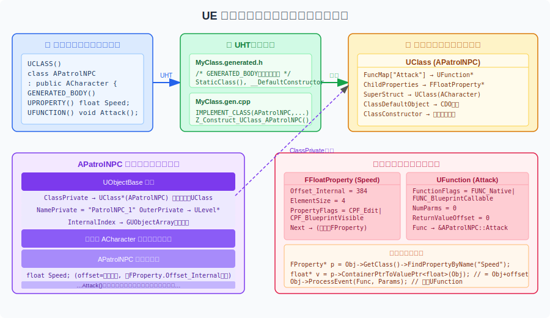
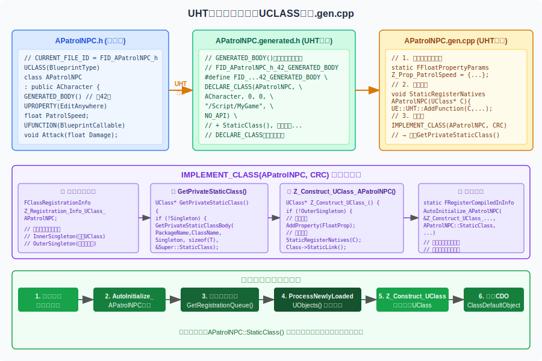
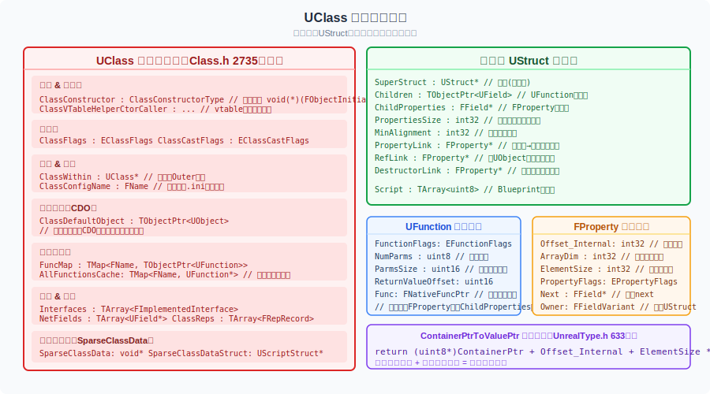
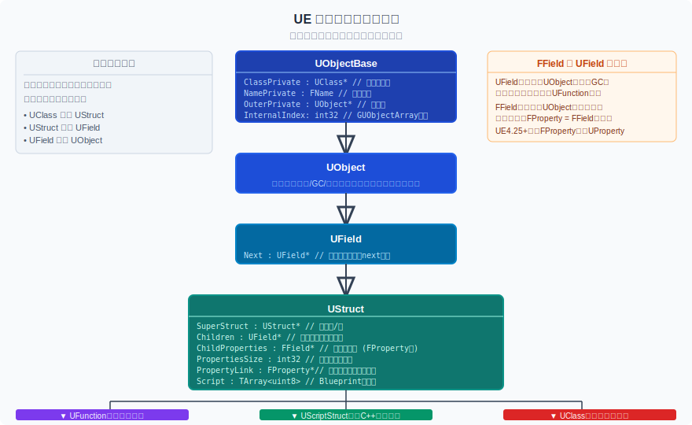
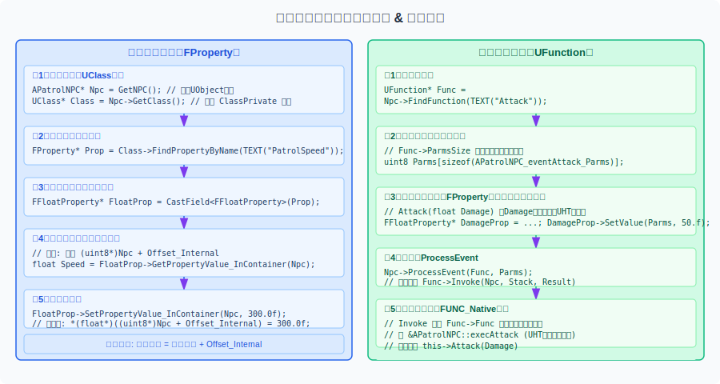

# UE5.4 反射系统深度解析

> **目标读者**：有基础 C++ 知识的大一学生。本文会在首次使用专业术语时解释其含义。
>
> **核心原则**：本文所有结论均来自对 UE5.4.4 源代码的直接阅读，主要涉及以下文件：
> - `Source/Runtime/CoreUObject/Public/UObject/Class.h`
> - `Source/Runtime/CoreUObject/Public/UObject/UObjectBase.h`
> - `Source/Runtime/CoreUObject/Public/UObject/ObjectMacros.h`
> - `Source/Runtime/CoreUObject/Public/UObject/UnrealType.h`
> - `Source/Runtime/CoreUObject/Public/UObject/Field.h`

---

## 目录

1. [什么是反射？为什么需要它？](#1-什么是反射为什么需要它)
2. [UE 反射系统总览](#2-ue-反射系统总览)
3. [第一步：你写的代码中的宏](#3-第一步你写的代码中的宏)
4. [第二步：UHT 生成了什么代码](#4-第二步uht-生成了什么代码)
5. [第三步：程序启动时如何注册](#5-第三步程序启动时如何注册)
6. [UClass 是什么，里面存了哪些数据](#6-uclass-是什么里面存了哪些数据)
7. [反射系统的类继承层次](#7-反射系统的类继承层次)
8. [FProperty 如何描述属性并读写值](#8-fproperty-如何描述属性并读写值)
9. [UFunction 如何描述并调用函数](#9-ufunction-如何描述并调用函数)
10. [运行时使用反射的完整代码示例](#10-运行时使用反射的完整代码示例)
11. [反射能做什么：六大应用场景](#11-反射能做什么六大应用场景)
12. [关键概念速查表](#12-关键概念速查表)

---

## 1. 什么是反射？为什么需要它？

**反射**（Reflection）是指程序在**运行时**能够查询、检查和操作自身结构的能力。

举个日常例子：你写了一个 `APatrolNPC` 类，它有一个 `PatrolSpeed` 属性。在普通 C++ 中，一旦程序编译好，`PatrolSpeed` 这个名字就彻底消失了——CPU 只知道某个内存偏移处有一个 `float`，不知道它叫什么名字。

但 UE 的反射系统让你可以在游戏运行时问：

- "这个对象的类是什么？" → `Obj->GetClass()` 返回一个 `UClass*`
- "这个类有哪些属性？" → 遍历 `UClass` 的 `ChildProperties` 链表
- "名叫 `PatrolSpeed` 的属性在哪里？" → `FindPropertyByName("PatrolSpeed")`
- "我想把它的值改成 300" → `FloatProp->SetPropertyValue_InContainer(Obj, 300.0f)`

这些能力支撑了 UE 中几乎所有的上层功能：编辑器的 Details 面板、Blueprint 可视化编程、网络同步、序列化存档，等等。

---

## 2. UE 反射系统总览

UE 的反射是一个**编译时生成 + 运行时读取**的系统，分为三个阶段：



| 阶段 | 发生时机 | 主要工具/文件 |
|------|----------|--------------|
| ① 你写代码 | 开发时 | `.h` 文件中的 `UCLASS`/`UPROPERTY`/`UFUNCTION` 宏 |
| ② UHT 生成代码 | 编译前（预处理步骤） | `UnrealHeaderTool` 生成 `.generated.h` 和 `.gen.cpp` |
| ③ 运行时注册 | 程序启动时 | `IMPLEMENT_CLASS` 宏触发的自动注册机制 |

**核心数据结构**（运行时的"反射数据库"）：

- **`UClass`**：描述一个 C++ 类的所有信息（属性列表、函数列表、父类、默认对象……）
- **`FProperty`**：描述一个属性（名称、类型、在内存中的偏移量、各种标志位）
- **`UFunction`**：描述一个函数（参数列表、返回值、函数指针、各种标志位）

---

## 3. 第一步：你写的代码中的宏

以下是实际源文件（`Source/Empty54/Public/TempCharacter.h`）：

```cpp
// TempCharacter.h
#pragma once

#include "GameFramework/Character.h"
#include "TempCharacter.generated.h"

// UENUM：让枚举参与反射（Blueprint 下拉可用、编辑器 Details 可显示）
UENUM(BlueprintType)
enum class ETransitLightType : uint8
{
    PointLight  UMETA(DisplayName = "Point Light"),
    SpotLight   UMETA(DisplayName = "Spot Light"),
};

UCLASS(BlueprintType, Blueprintable)
class APatrolNPC : public ACharacter
{
    GENERATED_BODY()    // 本行行号决定 generated.h 中的宏名

public:
    UPROPERTY(EditAnywhere, BlueprintReadWrite, Category = "Patrol")
    float PatrolSpeed = 200.0f;

    UFUNCTION(BlueprintCallable, Category = "Patrol")
    void Attack(float Damage);
};
```

这里每个宏的真实含义是什么？

### 3.1 `UCLASS(...)` 宏

**源码位置**：`ObjectMacros.h`，实际上在普通构建中这个宏**展开为空**！

```cpp
// ObjectMacros.h (简化)
#define UCLASS(...) /* 展开为空 */
```

它的唯一作用是**充当标记**：让 `UnrealHeaderTool`（简称 UHT）扫描 `.h` 文件时识别 "这是一个需要反射的类"。括号里的 `BlueprintType`、`Blueprintable` 等参数只供 UHT 读取，在普通 C++ 编译器看来整个宏就是个空行。

### 3.2 `GENERATED_BODY()` 宏

这是反射系统的核心入口。它的展开方式很有技巧性：

**源码位置**：`ObjectMacros.h`

```cpp
// 源码（ObjectMacros.h）
#define GENERATED_BODY(...) \
    BODY_MACRO_COMBINE(CURRENT_FILE_ID, _, __LINE__, _GENERATED_BODY)
```

`BODY_MACRO_COMBINE` 是字符串拼接宏，`CURRENT_FILE_ID` 由 UHT 根据**完整文件路径**自动生成（并非手写的短标识），`__LINE__` 是 `GENERATED_BODY()` 所在的行号。

所以 `GENERATED_BODY()` 实际上展开成一个**宏名称**，例如真实项目中：

```
FID_Project_Plugins_SPProject_SPGame_Source_SPGameFramework_System_NPCActor_PatrolNPC_PatrolNPC_h_15_GENERATED_BODY_LEGACY
```

这个宏名称在 **UHT 生成的 `.generated.h` 文件**中被定义，其内容包含 `StaticClass()`、`__DefaultConstructor` 等函数声明和定义。

### 3.3 `UPROPERTY(...)` 和 `UFUNCTION(...)` 宏

与 `UCLASS` 类似，这两个宏在普通 C++ 编译时也是**展开为空**的。它们只是给 UHT 看的标记：

```cpp
#define UPROPERTY(...) /* 展开为空 */
#define UFUNCTION(...) /* 展开为空 */
```

UHT 读取括号里的说明符（如 `EditAnywhere`、`BlueprintCallable`），将它们编码进生成代码中的标志位（`EPropertyFlags`、`EFunctionFlags`）。

### 3.4 `UENUM(...)` 宏

与 `UCLASS` 同理，`UENUM` 在普通 C++ 编译时**展开为空**，仅作 UHT 标记：

```cpp
#define UENUM(...)  /* 展开为空 */
#define UMETA(...)  /* 展开为空 */
```

`UMETA(DisplayName = "...")` 为枚举值提供显示名称等元数据，同样只供 UHT 读取。UHT 会为 UENUM 生成对应的 `Z_Construct_UEnum_XXX()` 函数（与 `Z_Construct_UClass_XXX` 平行），将枚举名和枚举值注册进 `UEnum` 对象中，使其在蓝图下拉菜单和编辑器 Details 面板中可用。

---

## 4. 第二步：UHT 生成了什么代码

UHT 会为每个有 `UCLASS/USTRUCT` 的头文件生成两个文件。



### 4.1 `PatrolNPC.generated.h` 的结构（真实生成文件）

> 文件路径：`Intermediate/Build/Win64/UnrealEditor/Inc/SPGameFramework/UHT/PatrolNPC.generated.h`

`GENERATED_BODY()` 展开出的宏，在真实文件中被拆分为两个独立宏再组合：**`_INCLASS`**（注入类声明内部的成员声明）和 **`_STANDARD_CONSTRUCTORS`**（注入构造/析构函数声明），最终由 `_GENERATED_BODY_LEGACY` 将两者合并。

```cpp
// PatrolNPC.generated.h（宏名前缀 FID_...= FID_Project_Plugins_SPProject_SPGame_Source_
//                        SPGameFramework_System_NPCActor_PatrolNPC_PatrolNPC_h）

// ── ① _INCLASS：注入到 class {} 内部 ────────────────────────────
#define FID_..._PatrolNPC_h_15_INCLASS \
private: \
    /* 原生函数注册函数（gen.cpp 中实现，无 UFUNCTION 时函数体为空）*/ \
    static void StaticRegisterNativesAPatrolNPC(); \
    /* 允许 gen.cpp 中的 Statics 结构体访问私有成员 */ \
    friend struct Z_Construct_UClass_APatrolNPC_Statics; \
public: \
    /* 声明 StaticClass()、Super/ThisClass 别名、GetPrivateStaticClass() 等 */ \
    DECLARE_CLASS(APatrolNPC, ACharacter, \
        COMPILED_IN_FLAGS(0 | CLASS_Config), CASTCLASS_None, \
        TEXT("/Script/SPGameFramework"), NO_API) \
    DECLARE_SERIALIZER(APatrolNPC) \
    /* UInterface 辅助：让接口代码能拿到 UObject* */ \
    virtual UObject* _getUObject() const override { \
        return const_cast<APatrolNPC*>(this); \
    }

// ── ② _STANDARD_CONSTRUCTORS：标准构造/析构函数声明 ─────────────
#define FID_..._PatrolNPC_h_15_STANDARD_CONSTRUCTORS \
    /* 带 FObjectInitializer 的标准构造（NewObject<T>() 的入口）*/ \
    NO_API APatrolNPC(const FObjectInitializer& ObjectInitializer \
                     = FObjectInitializer::Get()); \
    /* 为 NewObject<T>() 路径注册默认构造调用 */ \
    DEFINE_DEFAULT_OBJECT_INITIALIZER_CONSTRUCTOR_CALL(APatrolNPC) \
    /* 虚函数表辅助构造（UE 热重载机制用）*/ \
    DECLARE_VTABLE_PTR_HELPER_CTOR(NO_API, APatrolNPC); \
    DEFINE_VTABLE_PTR_HELPER_CTOR_CALLER(APatrolNPC); \
private: \
    APatrolNPC(APatrolNPC&&);           /* 禁止移动构造 */ \
    APatrolNPC(const APatrolNPC&);      /* 禁止拷贝构造 */ \
public: \
    NO_API virtual ~APatrolNPC();

// ── ③ _GENERATED_BODY_LEGACY = _INCLASS + _STANDARD_CONSTRUCTORS ─
#define FID_..._PatrolNPC_h_15_GENERATED_BODY_LEGACY \
PRAGMA_DISABLE_DEPRECATION_WARNINGS \
public: \
    FID_..._PatrolNPC_h_15_INCLASS \
    FID_..._PatrolNPC_h_15_STANDARD_CONSTRUCTORS \
public: \
PRAGMA_ENABLE_DEPRECATION_WARNINGS

// StaticClass<APatrolNPC>() 模板特化声明（gen.cpp 中提供定义）
template<> SPGAMEFRAMEWORK_API UClass* StaticClass<class APatrolNPC>();

// CURRENT_FILE_ID 由 UHT 根据完整文件路径生成，
// GENERATED_BODY() 预处理时拼出：FID_..._PatrolNPC_h_15_GENERATED_BODY_LEGACY
#undef CURRENT_FILE_ID
#define CURRENT_FILE_ID \
    FID_Project_Plugins_SPProject_SPGame_Source_SPGameFramework_System_NPCActor_PatrolNPC_PatrolNPC_h
```

> **关键理解**：`CURRENT_FILE_ID` 编码了完整文件路径，确保全局唯一——两个不同文件里的 `GENERATED_BODY()` 展开后的宏名不会冲突。`_INCLASS` 中的 `friend struct Z_Construct_UClass_APatrolNPC_Statics` 是关键桥梁，让 gen.cpp 中的静态初始化结构体能访问类的私有成员。


### 4.2 `PatrolNPC.gen.cpp` 的结构（真实生成文件）

> 文件路径：`Intermediate/Build/Win64/UnrealEditor/Inc/SPGameFramework/UHT/PatrolNPC.gen.cpp`
>
> 注意：真实项目中的 `APatrolNPC` 比 TempCharacter.h 的教学示例复杂（含多个组件属性、实现了接口）。下文展示真实结构，括号内注释说明简单版（只有 `PatrolSpeed` + `Attack`）的差异。

```cpp
// ── 交叉模块引用声明 ─────────────────────────────────────────────
// 声明本文件依赖的其他模块中的 Z_Construct 函数，由链接器解析
ENGINE_API   UClass* Z_Construct_UClass_ACharacter();
SPGAMEFRAMEWORK_API UClass* Z_Construct_UClass_APatrolNPC();
SPGAMEFRAMEWORK_API UClass* Z_Construct_UClass_APatrolNPC_NoRegister();
// ...（省略其余依赖的接口、组件类型的声明）
UPackage* Z_Construct_UPackage__Script_SPGameFramework();

// ── ① 原生函数注册（此类无 UFUNCTION，函数体为空）───────────────
// 若有 UFUNCTION，这里会调用 FNativeFunctionRegistrar::RegisterFunction
// 将 "FuncName" → execFuncName 的映射注册进 UClass
void APatrolNPC::StaticRegisterNativesAPatrolNPC() {}

// 注意：真实项目使用 IMPLEMENT_CLASS_NO_AUTO_REGISTRATION
// 与 IMPLEMENT_CLASS 的区别：不在宏内部生成自动注册代码，
// 自动注册由文件末尾的全局静态变量负责（见第五部分）
IMPLEMENT_CLASS_NO_AUTO_REGISTRATION(APatrolNPC);

// ── ② Z_Construct_UClass_APatrolNPC_NoRegister ──────────────────
// 返回已存在的 UClass 单例，不触发构建（供不需要初始化的场合使用）
UClass* Z_Construct_UClass_APatrolNPC_NoRegister()
{
    return APatrolNPC::StaticClass();
}

// ── ③ Z_Construct_UClass_APatrolNPC_Statics ─────────────────────
// 所有反射元数据以"静态常量"形式集中在这个结构体内。
// 关键优势：这些数据编译进只读段，程序启动时已就绪，ConstructUClass 直接读取。
struct Z_Construct_UClass_APatrolNPC_Statics
{
#if WITH_METADATA
    // 类本身的元数据（对应 UCLASS 说明符）
    static constexpr UECodeGen_Private::FMetaDataPairParam Class_MetaDataParams[] = {
        { "BlueprintType",    "true"                                     },
        { "HideCategories",   "Navigation"                               },
        { "IncludePath",      "System/NPCActor/PatrolNPC/PatrolNPC.h"    },
        { "ModuleRelativePath","System/NPCActor/PatrolNPC/PatrolNPC.h"   },
    };
    // 每个属性的元数据（Category、EditInline、ToolTip 等，非 Shipping 时编译）
    static constexpr UECodeGen_Private::FMetaDataPairParam NewProp_ActorInfoComponent_MetaData[] = {
        { "AllowPrivateAccess", "true"  },
        { "Category",           "NPC"   },
        { "EditInline",         "true"  },
        // ...
    };
    // ...（其他属性的元数据）
#endif // WITH_METADATA

    // 每个 UPROPERTY 对应一个或多个 Params 静态成员
    // TArray<USPGameActorComponentBase*>：数组属性需要 Inner + Array 两个描述符
    static const UECodeGen_Private::FObjectPropertyParams  NewProp_TickComponentList_Inner;
    static const UECodeGen_Private::FArrayPropertyParams   NewProp_TickComponentList;
    // TObjectPtr<USPActorInfo>（带 ObjectPtr 标志）
    static const UECodeGen_Private::FObjectPropertyParams  NewProp_ActorInfoComponent;
    // TArray<UMaterialInstanceDynamic*>
    static const UECodeGen_Private::FObjectPropertyParams  NewProp_DynamicMaterials_Inner;
    static const UECodeGen_Private::FArrayPropertyParams   NewProp_DynamicMaterials;
    // TWeakObjectPtr<...> 使用 FWeakObjectPropertyParams
    static const UECodeGen_Private::FWeakObjectPropertyParams NewProp_AnimComp;
    static const UECodeGen_Private::FWeakObjectPropertyParams NewProp_AvatarComp;
    // （TempCharacter.h 的简单版本此处为 FFloatPropertyParams NewProp_PatrolSpeed）

    // 所有属性描述符的指针数组（传给 FClassParams）
    static const UECodeGen_Private::FPropertyParamsBase* const PropPointers[];

    // 依赖的父类构造函数 + 所在包（建立继承链和模块归属）
    // = { Z_Construct_UClass_ACharacter, Z_Construct_UPackage__Script_SPGameFramework }
    static UObject* (*const DependentSingletons[])();

    // 此类实现的 UInterface 列表
    // = { Z_Construct_UClass_UNPCActorBaseInterface_NoRegister, VTABLE_OFFSET(...), false }
    static const UECodeGen_Private::FImplementedInterfaceParams InterfaceParams[];

    // C++ 抽象类标志
    static constexpr FCppClassTypeInfoStatic StaticCppClassTypeInfo = {
        TCppClassTypeTraits<APatrolNPC>::IsAbstract,
    };

    // 汇总参数：ConstructUClass() 的唯一入口
    // ConfigName = "Game"（对应 Game.ini），ClassFlags = 0x009000A4u
    static const UECodeGen_Private::FClassParams ClassParams;
};

// ── ④ Z_Construct_UClass_APatrolNPC ─────────────────────────────
// 真正构建 UClass 的函数；首次调用时执行，之后返回缓存的 OuterSingleton
UClass* Z_Construct_UClass_APatrolNPC()
{
    if (!Z_Registration_Info_UClass_APatrolNPC.OuterSingleton)
    {
        // 一次性调用：读取所有 Statics 数据，构建完整 UClass
        // 内部完成：添加 FProperty 节点、注册接口、调用 StaticLink() 等
        UECodeGen_Private::ConstructUClass(
            Z_Registration_Info_UClass_APatrolNPC.OuterSingleton,
            Z_Construct_UClass_APatrolNPC_Statics::ClassParams
        );
    }
    return Z_Registration_Info_UClass_APatrolNPC.OuterSingleton;
}

// ── ⑤ 自动注册：程序启动时执行 ─────────────────────────────────
// UE5 不再使用 "AutoInitialize_APatrolNPC"，而是以文件路径哈希命名的结构体
struct Z_CompiledInDeferFile_FID_..._PatrolNPC_h_Statics
{
    // ClassInfo 数组支持一个 .h 文件包含多个类的批量注册
    static constexpr FClassRegisterCompiledInInfo ClassInfo[] = {
        {
            Z_Construct_UClass_APatrolNPC,           // ② 构建完整 UClass
            APatrolNPC::StaticClass,                 // ① 获取/创建 UClass 单例
            TEXT("APatrolNPC"),
            &Z_Registration_Info_UClass_APatrolNPC,
            CONSTRUCT_RELOAD_VERSION_INFO(
                FClassReloadVersionInfo, sizeof(APatrolNPC), 1572554008U)
        },
    };
};

// 全局静态变量：进程启动时自动构造，将 ClassInfo[] 加入注册队列
// 变量名后缀（3157334085）是文件路径的 CRC 哈希，确保唯一性
static FRegisterCompiledInInfo Z_CompiledInDeferFile_FID_..._PatrolNPC_h_3157334085(
    TEXT("/Script/SPGameFramework"),
    Z_CompiledInDeferFile_FID_..._PatrolNPC_h_Statics::ClassInfo,
    UE_ARRAY_COUNT(Z_CompiledInDeferFile_FID_..._PatrolNPC_h_Statics::ClassInfo),
    nullptr, 0,   // 无 UStruct 注册
    nullptr, 0    // 无 UEnum 注册
);
```

> **与早期伪代码的三处关键差异**：
> 1. **`IMPLEMENT_CLASS_NO_AUTO_REGISTRATION`** 而非 `IMPLEMENT_CLASS`：自动注册逻辑移至文件末尾的全局变量，而非宏内部
> 2. **`UECodeGen_Private::ConstructUClass()` 一步到位**：不再显式调用 `AddProperty`/`StaticLink`，而是把所有静态数据通过 `FClassParams` 一次性传入，由引擎内部处理
> 3. **`Z_CompiledInDeferFile_..._Statics::ClassInfo[]` 数组**：支持同一 `.h` 中多个类的批量注册，替代了原来的 `AutoInitialize_XXX` 单类变量模式

> **关键理解**：`STRUCT_OFFSET(APatrolNPC, PatrolSpeed)` 是编译时计算出的数字，表示 `PatrolSpeed` 字段相对于对象起始地址的字节偏移量。这个数字被存入对应的 `FPropertyParams` 中，最终写入 `FProperty::Offset_Internal`，是反射系统在运行时读写属性值的根本依据。


---

## 5. 第三步：程序启动时如何注册

程序启动时，C++ 的全局静态变量初始化机制会自动触发注册流程：

```
程序启动
    ↓
全局变量 Z_CompiledInDeferFile_FID_..._PatrolNPC_h_3157334085 初始化（C++静态初始化）
    ↓
FRegisterCompiledInInfo 构造函数 → 将 ClassInfo[] 加入全局注册队列
    （ClassInfo 包含：Z_Construct_UClass_APatrolNPC、StaticClass、类名、版本CRC）
    ↓
UE 引擎初始化阶段调用 ProcessNewlyLoadedUObjects()
    ↓
消费队列 → 对每个类调用 Z_Construct_UClass_XXX()
    ↓
Z_Construct_UClass_APatrolNPC() 执行：
  检查 Z_Registration_Info_UClass_APatrolNPC.OuterSingleton
  → 若为空，调用 UECodeGen_Private::ConstructUClass(OuterSingleton, ClassParams)
    内部一次性完成：读取 PropPointers[]、DependentSingletons[]、InterfaceParams[]
    添加 FProperty 节点、注册接口、调用 StaticLink() 完成偏移量和属性链计算
    ↓
创建 ClassDefaultObject (CDO)
  → 使用 ClassConstructor 创建一个"默认实例"
  → 这个默认实例的属性值（如 PatrolSpeed=200.0f）就是所有新建对象的默认值
    ↓
反射数据准备完毕，APatrolNPC::StaticClass() 可正常使用
```

**CDO（Class Default Object，类默认对象）** 是每个 `UClass` 对应的一个特殊实例。它存储了该类所有属性的**默认值**，引擎通过与 CDO 做对比来进行增量序列化（只保存和默认值不同的属性），节省存储空间。

---

## 6. UClass 是什么，里面存了哪些数据

`UClass` 是整个反射系统的核心数据容器，用来描述一个 C++ 类的全部信息。

**每个 `APatrolNPC` 实例**持有一个 `ClassPrivate` 指针（定义在 `UObjectBase.h`），指向全局唯一的 `UClass(APatrolNPC)` 对象。



### 6.1 UClass 的关键数据成员（来自 Class.h 第2735行起）

```cpp
class UClass : public UStruct   // Class.h:2735
{
    // ── 构造 ──────────────────────────────────────────────
    ClassConstructorType ClassConstructor;
    // 函数指针：void (*)(const FObjectInitializer&)
    // 当你 NewObject<APatrolNPC>() 时，引擎通过这个指针调用构造函数

    ClassVTableHelperCtorCallerType ClassVTableHelperCtorCaller;
    // 虚函数表辅助构造指针（处理特殊构造路径）

    FUObjectCppClassStaticFunctions CppClassStaticFunctions;
    // 存储 AddReferencedObjects、DeclareCustomVersions 等静态函数指针

    // ── 标志位 ────────────────────────────────────────────
    EClassFlags ClassFlags;         // 类的属性标志（抽象、蓝图类型等）
    EClassCastFlags ClassCastFlags; // 快速类型检查用的位掩码

    // ── 身份 ──────────────────────────────────────────────
    TObjectPtr<UClass> ClassWithin;   // 要求实例必须在什么类型的Outer中
    FName ClassConfigName;            // 对应哪个.ini配置文件（如"Game"→Game.ini）

    // ── 默认对象 (CDO) ────────────────────────────────────
    TObjectPtr<UObject> ClassDefaultObject;
    // 每个类的默认实例，保存了所有属性的默认值

    // ── 函数注册表 ────────────────────────────────────────
    // (private) TMap<FName, TObjectPtr<UFunction>> FuncMap;
    // 存储 "函数名" → UFunction* 的映射
    // 通过 FindFunctionByName() / FindFunction() 访问

    // ── 接口 ──────────────────────────────────────────────
    TArray<FImplementedInterface> Interfaces;
    // 此类实现的所有 UInterface 列表

    // ── 网络复制 ──────────────────────────────────────────
    TArray<FRepRecord> ClassReps;   // 复制属性记录（网络同步用）
    TArray<UField*> NetFields;      // 网络相关字段（RPC函数等）

    // ── 来自 UStruct 的字段（见下文）────────────────────
    // SuperStruct, Children, ChildProperties, PropertyLink...
};
```

### 6.2 继承自 UStruct 的关键字段

`UClass` 继承自 `UStruct`，后者才是存放属性和函数链表的地方：

```cpp
class UStruct : public UField   // Class.h 中定义
{
    UStruct* SuperStruct;       // 父类的 UClass/UScriptStruct 指针
    TObjectPtr<UField> Children;// 子字段链表头（主要是 UFunction）
    FField* ChildProperties;    // FProperty 链表头（所有 UPROPERTY）

    int32 PropertiesSize;       // 所有属性加起来的内存大小（字节）
    int32 MinAlignment;         // 内存对齐要求

    // 特化属性链（性能优化，避免每次从头遍历）
    FProperty* PropertyLink;    // 从最派生类到基类的全属性链
    FProperty* RefLink;         // 只含有 UObject 引用的属性（GC用）
    FProperty* DestructorLink;  // 需要调用析构函数的属性
    FProperty* PostConstructLink;// 需要在后构造阶段初始化的属性

    TArray<uint8> Script;       // Blueprint 字节码（仅蓝图类有内容）
};
```

---

## 7. 反射系统的类继承层次

UE 反射体系本身也是用 UObject 继承链组织的，形成了一套自描述的元数据系统：



```
UObjectBase              ← 最底层：ClassPrivate, NamePrivate, OuterPrivate, InternalIndex
  └── UObjectBaseUtility ← 工具方法层（IsA, GetPathName 等）
        └── UObject      ← 高层功能（序列化、GC、配置加载等）
              └── UField ← 反射节点基类（链表 Next 指针）
                    └── UStruct ← 含属性/函数的结构
                          ├── UClass        ← 类的完整描述
                          ├── UScriptStruct ← 纯C++结构体的描述（FVector等）
                          └── UFunction     ← 函数的描述
```

> **重要区分**：`FProperty`（原来叫 `UProperty`，UE4.25 起改名）**不**继承自 `UObject`，而是继承自轻量级的 `FField`。这是 UE4.25 的重要架构改变，让属性描述对象不再参与 GC 扫描，减少开销。

---

## 8. FProperty 如何描述属性并读写值

`FProperty` 是描述一个 `UPROPERTY` 字段的元数据对象。每个不同的属性类型对应一个具体的子类：

| 属性类型 | FProperty 子类 |
|----------|----------------|
| `float` | `FFloatProperty` |
| `int32` | `FIntProperty` |
| `FString` | `FStrProperty` |
| `bool` | `FBoolProperty` |
| `UObject*` | `FObjectProperty` |
| `TArray<T>` | `FArrayProperty` |
| `TMap<K,V>` | `FMapProperty` |
| `FName` | `FNameProperty` |

### 8.1 FProperty 的关键数据成员（UnrealType.h）

```cpp
class FProperty : public FField  // UnrealType.h
{
    int32 ArrayDim;         // 静态数组维度（通常是1）
    int32 ElementSize;      // 单个元素的字节大小（float=4, int=4, FString=16...）
    EPropertyFlags PropertyFlags; // CPF_Edit, CPF_BlueprintVisible 等标志
    uint16 RepIndex;        // 网络复制索引
    FName  RepNotifyFunc;   // 属性变化时的通知函数名（用于网络复制回调）

    // 关键！！在内存中的偏移量
    int32 Offset_Internal;  // = STRUCT_OFFSET(SomeClass, SomeField)

    // 链表指针（运行时构建的快速遍历链）
    FProperty* PropertyLinkNext;   // 所有属性从派生到基类的链
    FProperty* NextRef;            // 含UObject引用的属性链
    FProperty* DestructorLinkNext; // 需要析构的属性链
    FProperty* PostConstructLinkNext; // 后构造初始化属性链
};
```

### 8.2 读写属性值：ContainerPtrToValuePtr

**源码位置**：`UnrealType.h` 第633行

```cpp
// UnrealType.h:633 (FProperty::ContainerPtrToValuePtr 的内部实现)
template<typename ValueType>
FORCEINLINE ValueType* ContainerPtrToValuePtr(void* ContainerPtr, int32 ArrayIndex = 0) const
{
    // 核心公式！对象的基址 + 属性的字节偏移 + 数组索引偏移
    return (ValueType*)((uint8*)ContainerPtr + Offset_Internal + ElementSize * ArrayIndex);
}
```

这个函数的名字意思是"从容器指针（对象地址）计算出值指针（属性地址）"。原理极其简单：指针加法。

**完整读写示例**：

```cpp
// 读取 APatrolNPC 实例的 PatrolSpeed 属性
APatrolNPC* Npc = /* 某个实例 */;

// 方式1：通过高层辅助函数
UClass* Class = Npc->GetClass();
FProperty* Prop = Class->FindPropertyByName(TEXT("PatrolSpeed"));
FFloatProperty* FloatProp = CastField<FFloatProperty>(Prop);

// GetPropertyValue_InContainer 内部 = *(float*)ContainerPtrToValuePtr(Npc)
float Speed = FloatProp->GetPropertyValue_InContainer(Npc);

// 写入
FloatProp->SetPropertyValue_InContainer(Npc, 350.0f);

// 方式2：直接用 ContainerPtrToValuePtr
float* SpeedPtr = FloatProp->ContainerPtrToValuePtr<float>(Npc);
*SpeedPtr = 350.0f;  // 直接写内存（等效但不经过setter）
```

> **内存模型图解**：
> ```
> Npc（指针，如0x10000000）
>   ├── [+0]    ClassPrivate
>   ├── [+8]    NamePrivate
>   ├── [+16]   OuterPrivate
>   ├── [+20]   InternalIndex
>   ├── ...     (ACharacter, APawn, AActor, UObject 的字段)
>   └── [+384]  PatrolSpeed  ← Offset_Internal = 384
>                             ← ContainerPtrToValuePtr(Npc) = 0x10000000 + 384
> ```

---

## 9. UFunction 如何描述并调用函数

`UFunction` 继承自 `UStruct`，这意味着函数的**参数**本身也是用 `FProperty` 描述的，存放在 `ChildProperties` 链表中。

### 9.1 UFunction 的关键数据成员（Class.h 第1789行）

```cpp
class UFunction : public UStruct  // Class.h:1789
{
    // 函数标志位（BlueprintCallable, Native, NetMulticast 等）
    EFunctionFlags FunctionFlags;

    uint8  NumParms;          // 参数个数（不含返回值，或含，取决于版本）
    uint16 ParmsSize;         // 所有参数合计的内存大小（字节）
    uint16 ReturnValueOffset; // 返回值在参数结构体中的偏移

    FProperty* FirstPropertyToInit; // 需要初始化的第一个参数属性

    // ── 原生函数指针（FUNC_Native 时有效）────────────────
    FNativeFuncPtr Func;
    // 即 void (*)(UObject* Context, FFrame& Stack, void* Result)
    // 实际指向 APatrolNPC::execAttack（UHT生成的包装函数）

    // ── 从 UStruct 继承 ───────────────────────────────────
    // ChildProperties: FProperty* ← 存放各参数的FProperty（Damage等）
    // SuperStruct: 父函数（如果Override了一个Blueprint事件）
};
```

### 9.2 调用 UFunction：ProcessEvent 完整机制

**源码位置**：`Object.h` 第1417行，`ScriptCore.cpp` 第1971行

```cpp
// Object.h:1417
virtual void ProcessEvent(UFunction* Function, void* Parms);
```

`ProcessEvent` 是 `UObject` 的虚函数，是所有反射函数调用的统一入口。下面以 `void Attack(float Damage, int32 Count)` 为例（两个参数）完整拆解它的内部工作方式。

---

#### ① Parms 内存块：多参数的偏移量从哪来？

调用者构建一个**连续内存块**传给 `ProcessEvent`：

```cpp
// 调用方写的结构体（顺序必须与 UFUNCTION 参数声明顺序一致）
struct {
    float Damage;   // ← 第一个参数
    int32 Count;    // ← 第二个参数
    // 若有返回值，UHT 会在此之后追加一个槽位，详见下文
} Params;
Params.Damage = 50.0f;
Params.Count  = 1;
```

**这个结构体的每个字段在哪个偏移**，由 C++ 编译器的自然布局决定（对齐规则与普通结构体完全一致）。

UHT 在 `gen.cpp` 里生成参数属性时，同样用 `STRUCT_OFFSET` 从**同一个编译器**计算偏移：

```cpp
// gen.cpp 中（由 UHT 生成）
// UHT 为函数参数生成一个隐式的 "Attack_Parms" 结构体：
//   struct Attack_Parms { float Damage; int32 Count; };
// 然后用 STRUCT_OFFSET 把编译器算出的偏移写入 FPropertyParams：
const UECodeGen_Private::FFloatPropertyParams NewProp_Damage = {
    "Damage", ..., STRUCT_OFFSET(Attack_Parms, Damage), ...  // = 0
};
const UECodeGen_Private::FIntPropertyParams NewProp_Count = {
    "Count",  ..., STRUCT_OFFSET(Attack_Parms, Count),  ...  // = 4
};
```

这样，**调用方的 struct 布局** 和 **FProperty::Offset_Internal** 永远一致——它们都是同一个编译器对同一个隐式结构体的计算结果。

---

#### ② ProcessEvent 内部做了什么？（ScriptCore.cpp:1971）

```cpp
void UObject::ProcessEvent(UFunction* Function, void* Parms)
{
    // 1. 在栈上分配一块 Function->PropertiesSize 大小的帧内存
    uint8* Frame = (uint8*)VirtualStackAllocator.Alloc(Function->PropertiesSize);

    // 2. 把调用方的 Parms 块整体拷入帧内存的参数区域
    //    这一步让 Frame[0..ParmsSize-1] == Parms[0..ParmsSize-1]
    FMemory::Memcpy(Frame, Parms, Function->ParmsSize);

    // 3. 构建执行栈帧（FFrame）
    //    关键：PropertyChainForCompiledIn = Function->ChildProperties（参数 FProperty 链表头）
    //    关键：Code = Function->Script.GetData()（原生函数此处为 nullptr）
    FFrame NewStack(this, Function, Frame, nullptr, Function->ChildProperties);

    // 4. 计算返回值写入地址（指向调用方 Parms 块内部的返回值槽）
    uint8* ReturnValueAddress = Function->ReturnValueOffset != MAX_uint16
        ? (uint8*)Parms + Function->ReturnValueOffset
        : nullptr;

    // 5. 通过函数指针调用 thunk（execAttack）
    Function->Invoke(this, NewStack, ReturnValueAddress);
    //   Invoke 内部：(*Func)(Obj, Stack, RESULT_PARAM)
    //   展开为：   execAttack(this, NewStack, ReturnValueAddress)
}
```

---

#### ③ execAttack 的真实结构（UHT 生成）

`execAttack` 是 UHT 用 `DECLARE_FUNCTION` / `DEFINE_FUNCTION` 宏生成的 **thunk 包装函数**，其签名固定为：

```cpp
// ObjectMacros.h:749
// #define DEFINE_FUNCTION(func) void func(UObject* Context, FFrame& Stack, RESULT_DECL)
// 其中 RESULT_DECL = void* const Z_Param__Result

// gen.cpp 中 UHT 生成的 execAttack（以 void Attack(float Damage, int32 Count) 为例）：
DEFINE_FUNCTION(APatrolNPC::execAttack)
{
    // ── 第一步：从 Stack.Locals 中依次读取每个参数 ──────────
    // P_GET_PROPERTY 展开为：
    //   float Z_Param_Damage = 0.0f;
    //   Stack.StepCompiledIn<FFloatProperty>(&Z_Param_Damage);
    //
    // StepCompiledIn 核心逻辑（Code 为 null → 走 PropertyChainForCompiledIn 分支）：
    //   FProperty* Prop = (FProperty*)Stack.PropertyChainForCompiledIn;
    //   Stack.PropertyChainForCompiledIn = Prop->Next;  // 链表前进
    //   // 从 Stack.Locals（即 Parms 的拷贝）中读出该参数值
    //   Prop->CopyCompleteValueToScriptVM_InContainer(&Z_Param_Damage, Stack.Locals);
    //   // 等价于：Z_Param_Damage = *(float*)(Stack.Locals + Prop->Offset_Internal)
    P_GET_PROPERTY(FFloatProperty, Z_Param_Damage);  // 读 Damage，链表移到 Count

    // 同理读取第二个参数，PropertyChainForCompiledIn 再次前进
    P_GET_PROPERTY(FIntProperty, Z_Param_Count);     // 读 Count

    // ── 第二步：标记参数读取完毕 ─────────────────────────────
    // P_FINISH = Stack.Code += !!Stack.Code（Code 为 null 时是 no-op）
    P_FINISH;

    // ── 第三步：调用真正的 C++ 函数 ──────────────────────────
    // P_THIS        = (ThisClass*)Context        ← 就是 ProcessEvent 中的 this
    // P_NATIVE_BEGIN/END 是性能统计的 scope guard，不影响逻辑
    P_NATIVE_BEGIN;
    P_THIS->Attack(Z_Param_Damage, Z_Param_Count);
    P_NATIVE_END;
}
```

**多个参数时如何区分偏移**：每次调用 `StepCompiledIn` 都消耗 `PropertyChainForCompiledIn` 链表的一个节点，每个节点的 `Offset_Internal` 各不相同，所以第一次 `StepCompiledIn` 读 `Damage`，第二次自动读到 `Count`——完全不需要硬编码任何数字。

---

#### ④ 三个参数的来源，以及返回值如何传回

| thunk 参数 | 实际值来源 | 说明 |
|-----------|-----------|------|
| `Context`（即 `P_THIS`） | `ProcessEvent` 中的 `this`（调用对象） | `P_THIS_CAST(APatrolNPC)` 把它转为具体类型后直接调用成员函数 |
| `Stack`（`FFrame&`） | `ProcessEvent` 内构建的 `FFrame NewStack` | 其 `Locals` 是 Parms 的拷贝；`PropertyChainForCompiledIn` 是参数链表头，供 `StepCompiledIn` 顺序消费 |
| `Z_Param__Result`（`RESULT_DECL`） | `(uint8*)Parms + Function->ReturnValueOffset` | 直接指向**调用方 Parms 块内的返回值槽**，execAttack 把返回值写到这里 |

**返回值的完整流程**（以 `float Attack(...) → float` 为例）：

```
调用方的 Parms 内存布局（含返回值）：
┌───────────────┬──────────────┬──────────────────┐
│  float Damage │  int32 Count │  float ReturnVal ← ReturnValueOffset 指向这里
│   offset=0    │   offset=4   │     offset=8      │
└───────────────┴──────────────┴──────────────────┘
         ↑
         调用方写入参数值
                                        ↑
                               execAttack 写入返回值：
                               *(float*)Z_Param__Result = returnValue;

ProcessEvent 返回后，调用方读 Params.ReturnVal 即得返回值。
```

---

#### ⑤ 完整调用示例（含返回值）

```cpp
// C++ 函数声明
UFUNCTION(BlueprintCallable)
float Attack(float Damage, int32 Count);

// 通过反射调用
APatrolNPC* Npc = /* 某个实例 */;
UFunction* AttackFunc = Npc->FindFunction(TEXT("Attack"));

// 参数结构体：顺序 = UFUNCTION 声明顺序；最后是返回值槽
struct {
    float Damage;       // 入参
    int32 Count;        // 入参
    float ReturnValue;  // 出参（返回值）—— UHT 会在 ReturnValueOffset 处放这个
} Params;
Params.Damage = 50.0f;
Params.Count  = 3;
// Params.ReturnValue 无需初始化，ProcessEvent 会让 execAttack 写入

Npc->ProcessEvent(AttackFunc, &Params);

// ProcessEvent 返回后，返回值已被写入 Params.ReturnValue
float Result = Params.ReturnValue;
```

> **关键总结**：`ProcessEvent` → `execAttack` 整个通路不依赖任何"魔法"——核心是两个设计：
> 1. **Parms 块的偏移由编译器自然布局决定**，UHT 用 `STRUCT_OFFSET` 把同样的偏移写入 `FProperty::Offset_Internal`，保证双方对齐
> 2. **`PropertyChainForCompiledIn` 链表**充当"参数游标"，`execAttack` 每调一次 `StepCompiledIn` 就消耗一个参数节点，从 `Stack.Locals` 中按偏移取出值，完全不需要在 thunk 里硬编码偏移数字

---

## 10. 运行时使用反射的完整代码示例



下面是一个完整的、可在 UE5 项目中使用的反射操作示例：

### 10.1 遍历一个类的所有 UPROPERTY 属性

```cpp
void PrintAllProperties(UObject* Obj)
{
    if (!Obj) return;

    UClass* Class = Obj->GetClass();
    UE_LOG(LogTemp, Log, TEXT("=== 类 %s 的所有属性 ==="), *Class->GetName());

    // TFieldIterator 是遍历 FProperty 链表的迭代器
    // EFieldIteratorFlags::IncludeSuper 表示也包含父类的属性
    for (TFieldIterator<FProperty> PropIt(Class, EFieldIteratorFlags::IncludeSuper); PropIt; ++PropIt)
    {
        FProperty* Prop = *PropIt;
        
        // 将属性值导出为字符串（用于打印）
        FString ValueStr;
        const void* ValuePtr = Prop->ContainerPtrToValuePtr<void>(Obj);
        Prop->ExportTextItem_Direct(ValueStr, ValuePtr, nullptr, Obj, PPF_None);
        
        UE_LOG(LogTemp, Log, TEXT("  [%s] %s = %s"),
            *Prop->GetClass()->GetName(), // 属性类型（FFloatProperty等）
            *Prop->GetName(),              // 属性名称
            *ValueStr                      // 当前值
        );
    }
}
```

### 10.2 按名称读写属性

```cpp
// 读取 float 属性
bool GetFloatProperty(UObject* Obj, FName PropName, float& OutValue)
{
    FFloatProperty* Prop = FindFProperty<FFloatProperty>(Obj->GetClass(), PropName);
    if (!Prop) return false;
    
    OutValue = Prop->GetPropertyValue_InContainer(Obj);
    return true;
}

// 写入 float 属性
bool SetFloatProperty(UObject* Obj, FName PropName, float NewValue)
{
    FFloatProperty* Prop = FindFProperty<FFloatProperty>(Obj->GetClass(), PropName);
    if (!Prop) return false;
    
    Prop->SetPropertyValue_InContainer(Obj, NewValue);
    return true;
}

// 使用示例
float Speed;
GetFloatProperty(Npc, TEXT("PatrolSpeed"), Speed);
UE_LOG(LogTemp, Log, TEXT("当前巡逻速度: %f"), Speed);
SetFloatProperty(Npc, TEXT("PatrolSpeed"), 350.0f);
```

### 10.3 按名称调用函数

```cpp
// 通用函数调用（无参数）
void CallFunctionByName(UObject* Obj, FName FuncName)
{
    UFunction* Func = Obj->FindFunction(FuncName);
    if (!Func) return;
    
    // 分配参数内存（这里是无参函数，ParmsSize可能是0）
    TArray<uint8> Params;
    Params.SetNumZeroed(Func->ParmsSize);
    
    Obj->ProcessEvent(Func, Params.GetData());
}

// 使用示例
CallFunctionByName(Npc, TEXT("Attack"));
```

### 10.4 类型判断（IsA）

```cpp
// IsA 内部使用 ClassCastFlags 进行快速判断
// 对于有 CASTCLASS_ 标志的常见类型，IsA 不需要遍历继承链
if (SomeObj->IsA(ACharacter::StaticClass()))
{
    ACharacter* Char = Cast<ACharacter>(SomeObj);
}

// Cast<T> 是安全类型转换，失败返回 nullptr
// StaticCast<T> 是 UE 的 static_cast，不做运行时检查
```

---

## 11. 反射能做什么：六大应用场景

### 11.1 编辑器 Details 面板（属性可视化编辑）

**原理**：编辑器选中一个 Actor 时，遍历其 `UClass` 的 `ChildProperties` 链表，对每个带 `CPF_Edit` 标志的 `FProperty`，根据其类型（`FFloatProperty`、`FStrProperty`……）创建对应的编辑控件，并通过 `ContainerPtrToValuePtr` 读写实际值。

```cpp
// Details面板内部（简化）
for (TFieldIterator<FProperty> It(Obj->GetClass()); It; ++It)
{
    FProperty* Prop = *It;
    if (Prop->HasAnyPropertyFlags(CPF_Edit)) // UPROPERTY(EditAnywhere)
    {
        // 根据属性类型创建对应的UI控件...
        CreateWidgetForProperty(Prop, Obj);
    }
}
```

### 11.2 Blueprint 可视化编程

Blueprint 函数调用的底层就是 `ProcessEvent`。当你在蓝图中连接一根线调用 `Attack`，引擎会：
1. 在蓝图编译时找到 `UFunction(Attack)` 并记录其地址
2. 运行时生成字节码：`CALL_FUNCTION + UFunction指针`
3. 蓝图虚拟机执行到该字节码时，调用 `ProcessEvent(AttackFunc, Parms)`

### 11.3 序列化（保存/读取存档）

序列化时，引擎遍历对象的属性并与 CDO 对比，只保存**有差异的属性**：

```cpp
// 序列化（简化逻辑）
for (TFieldIterator<FProperty> It(Obj->GetClass()); It; ++It)
{
    FProperty* Prop = *It;
    void* ObjValue = Prop->ContainerPtrToValuePtr<void>(Obj);
    void* CDOValue = Prop->ContainerPtrToValuePtr<void>(Class->ClassDefaultObject);
    
    if (!Prop->Identical(ObjValue, CDOValue)) // 与默认值不同
    {
        // 序列化这个属性
        Prop->SerializeItem(Archive, ObjValue);
    }
}
```

### 11.4 网络同步（属性复制）

带 `UPROPERTY(Replicated)` 的属性会被记录在 `UClass::ClassReps` 数组中。网络层通过反射按偏移量读取这些属性，比较前后帧的值，只发送变化的部分给客户端。

### 11.5 垃圾回收（GC）

GC 需要找到所有 `UObject*` 引用来防止被引用的对象被回收。`UClass::RefLink` 就是专门为此优化的链表——只包含类型为 `FObjectProperty`（或其子类）的属性，GC 扫描时只遍历这条链，效率远高于扫描全部属性。

### 11.6 UFunction::Override（蓝图函数重写）

这是反射最强大的应用之一：C++ 定义一个 `BlueprintImplementableEvent`，蓝图可以实现它。

```cpp
// C++ 中声明（头文件）
UFUNCTION(BlueprintImplementableEvent, Category="Patrol")
void OnEnemySpotted(AActor* Enemy);

// 调用时（C++）
OnEnemySpotted(TargetEnemy);
// 如果蓝图有实现 → 执行蓝图版本
// 如果蓝图无实现 → 调用空的默认实现
```

**UHT 的处理**：对 `BlueprintImplementableEvent`，UHT 生成一个 C++ 包装体：

```cpp
// UHT 自动生成（gen.cpp 中）
void APatrolNPC::OnEnemySpotted_Implementation(AActor* Enemy) {}

void APatrolNPC::OnEnemySpotted(AActor* Enemy)
{
    // 查找 UFunction（蓝图子类会覆盖这个函数）
    UFunction* Func = this->FindFunction(TEXT("OnEnemySpotted"));
    // 如果找到（蓝图中有实现），通过 ProcessEvent 调用
    ProcessEvent(Func, &Params);
}
```

**查找机制**：`FindFunction` 会从当前类的 `FuncMap` 开始查找，沿 `SuperStruct` 向上遍历，找到函数名匹配的 `UFunction`。蓝图子类的 `FuncMap` 中有自己实现的同名函数，所以蓝图版本会被优先找到。

---

## 12. 关键概念速查表

| 概念 | 所在文件 | 一句话说明 |
|------|---------|-----------|
| `UObjectBase::ClassPrivate` | `UObjectBase.h` | 每个 UObject 实例持有的"我是哪个类"指针 |
| `UClass` | `Class.h:2735` | 一个类的全部反射信息（属性表、函数表、CDO……） |
| `UStruct` | `Class.h` | 含属性/函数链表的结构体描述基类 |
| `UFunction` | `Class.h:1789` | 一个函数的描述，参数存在 ChildProperties 中 |
| `FProperty` | `UnrealType.h` | 一个属性的描述，最重要的字段是 `Offset_Internal` |
| `FField` | `Field.h:447` | FProperty 的基类，轻量，不参与 GC |
| `GENERATED_BODY()` | `ObjectMacros.h` | 展开为文件+行号组合的宏名，内容在 .generated.h |
| `IMPLEMENT_CLASS` / `IMPLEMENT_CLASS_NO_AUTO_REGISTRATION` | `ObjectMacros.h` | 生成 `GetPrivateStaticClass()` 等；后者不含自动注册，注册由文件末的全局变量负责 |
| `GetPrivateStaticClass()` | 由 IMPLEMENT_CLASS 生成 | 类的 UClass 单例的懒加载 getter |
| `Z_Construct_UClass_XXX()` | 由 UHT 生成 | 调用 `UECodeGen_Private::ConstructUClass()` 构建完整 UClass（添加属性、接口、StaticLink） |
| `Z_CompiledInDeferFile_..._Statics` | 由 UHT 生成 | 包含 `ClassInfo[]` 数组，支持同一 `.h` 中多个类的批量注册 |
| `FRegisterCompiledInInfo` | `ObjectMacros.h` | 启动时自动注册的静态对象 |
| `ProcessEvent()` | `Object.h:1417` | 通过反射调用 UFunction 的统一入口 |
| `ContainerPtrToValuePtr` | `UnrealType.h:633` | 计算属性内存地址 = 对象基址 + Offset_Internal |
| CDO | `UClass::ClassDefaultObject` | 每个类的默认值实例，用于序列化对比 |
| `FuncMap` | `UClass`（private） | TMap<FName, UFunction*>，函数查找表 |
| `ChildProperties` | `UStruct` | FProperty 的链表头，所有 UPROPERTY 在此 |

---

*本文档由源码分析生成，对应 UE5.4.4-release。文中引用的行号以该版本为准。*
