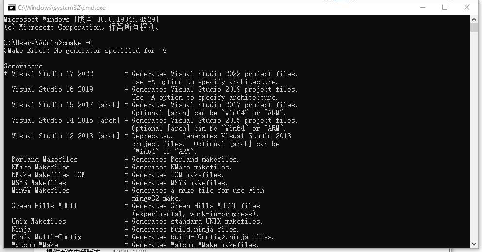
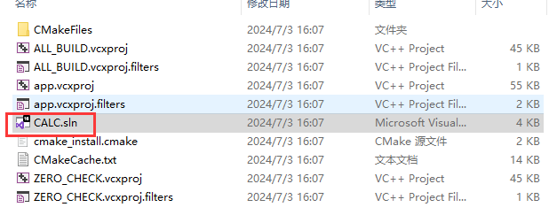
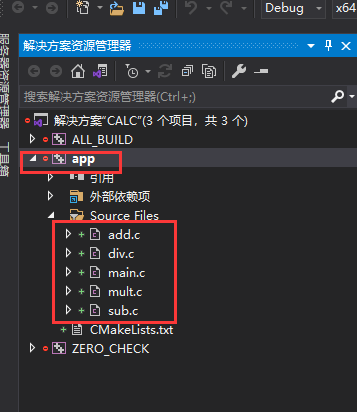
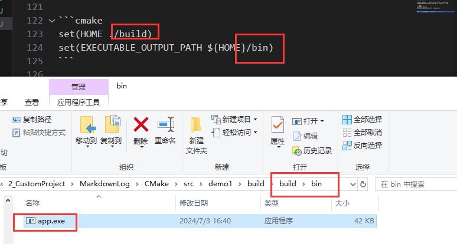
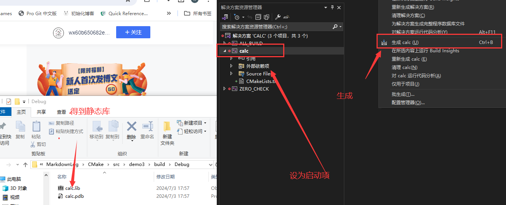
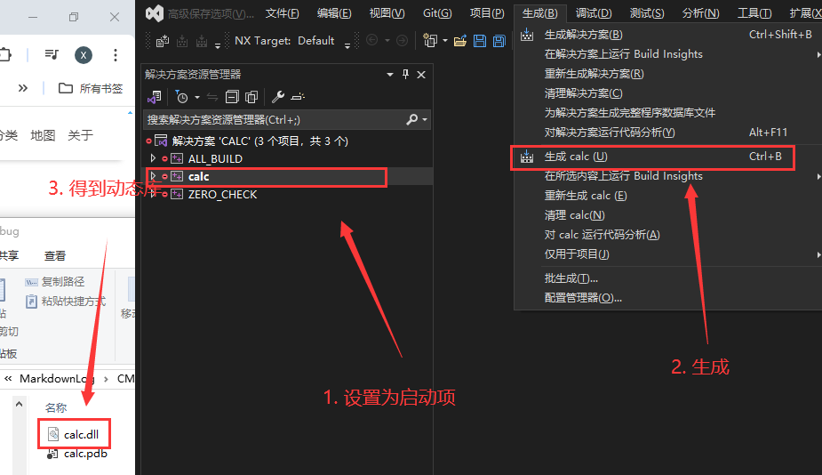
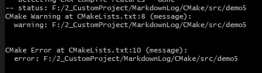

# CMake

[CMake 保姆级教程（上）](https://subingwen.cn/cmake/CMake-primer/)
[CMake 保姆级教程（下）](https://subingwen.cn/cmake/CMake-advanced/)

## 简单使用

以 `src/demo1` 为例

```bash
$ tree
.
├── add.c
├── div.c
├── head.h
├── main.c
├── mult.c
└── sub.c
```

在 `build` 文件夹中使用 `cmake ..` 生成项目

```cmake
# CMakeList.txt
cmake_minimum_required(VERSION 3.0)
project(CALC)
add_executable(app add.c div.c main.c mult.c sub.c)
# 等价于 add_executable(app add.c;div.c;main.c;mult.c;sub.c)
```

> 因为 `cmake` 生成的临时文件可能很多，所以在 build 文件夹中生成，这样不会污染根目录

使用 `cmake` 之后，会生成中间文件和 `Makefile`，再使用 `make` 来执行，最后生成 `app.exe` （Windows 平台）

| 命令 | 作用 |
| --- | --- |
| cmake_minimum_required | 指定使用的 cmake 的最低版本 |
| project | 定义工程名称，并可指定工程的版本、工程描述、web主页地址、支持的语言（默认情况支持所有语言），如果不需要这些都是可以忽略的，只需要指定出工程名字即可 |
| add_executable(可执行程序名 源文件名称) | 定义工程会生成一个可执行程序 |

如果想要使用 cmake 创建指定类型的项目，可以在命令中指定



使用 `cmake -G` 可以查看可以生成的项目

> `*` 标记的是默认生成项目类型

如果想要生成 `Unix Makefiles` 或者其他版本的 `Visual Studio` 项目 的话，可以使用

```
cmake .. -G "Unix Makefiles"
cmake .. -G "Visual Studio 16 2019"
```

> 为了方便使用 `make` 命令，所以后面一些测试使用 `Unix Makefiles`



> 这个 `visual studio` 项目的名称就是 `project` 中设置的 `CALC`



对应的命令就是 `add_executable(app add.c div.c main.c mult.c sub.c)`

- 第一个参数 `app` 就是最后生成可执行程序的名称
- 后面参数就是项目包含的文件名称

### 定义变量

如果一直使用 `add.c div.c main.c mult.c sub.c` 来表示所添加的问题，也是挺麻烦的

可以定义变量来表示整个 `add.c div.c main.c mult.c sub.c` 文件

```cmake
# SET 指令的语法是：
# [] 中的参数为可选项, 如不需要可以不写
# SET(VAR [VALUE] [CACHE TYPE DOCSTRING [FORCE]])

set(SRC_LIST add.c;div.c;main.c;mult.c;sub.c)
add_executable(app  ${SRC_LIST})
```

- `SRC_LIST`: 变量名
- `${SRC_LIST}`: 获取值

#### C++版本

编译 C++ 项目的时候需要指定 C++ 版本：C++11、C++14、C++17、C++20 等，有些项目会用到对应版本的特性

以 g++ 编译的命令为例 

```bash
g++ *.cpp -std=c++11 -o app
```

> `-std=c++11` 对应 C++ 标准有一个宏叫做 `DCMAKE_CXX_STANDARD` 

在 `cmake` 可以通过 `SET` 设置 `DCMAKE_CXX_STANDARD` 的值

```cmake
# -std=c++11
set(CMAKE_CXX_STANDARD 11)
# -std=c++14
set(CMAKE_CXX_STANDARD 14)
# -std=c++17
set(CMAKE_CXX_STANDARD 17)
```

也可以使用在 `cmake` 命令中控制

```bash
cmake CMakeLists.txt文件路径 -DCMAKE_CXX_STANDARD=11
cmake CMakeLists.txt文件路径 -DCMAKE_CXX_STANDARD=14
cmake CMakeLists.txt文件路径 -DCMAKE_CXX_STANDARD=17
```

#### 输出路径

在CMake中指定可执行程序输出的路径，也对应一个宏，叫做`EXECUTABLE_OUTPUT_PATH`，它的值还是通过 `set` 命令进行设置

```cmake
set(HOME ./build)
set(EXECUTABLE_OUTPUT_PATH ${HOME}/bin)
```

生成 `Unix Makefiles` 项目，然后使用 `make` 执行



最后 `app.exe` 就生成在 `build/bin` 目录中

> 如果路径不存在，会自动创建，无需手动生成

### 文件检索

如果项目中的源文件非常多，在编写 `CMakeLists.txt` 文件的时候不可能将项目目录的各个文件一一罗列出来，所以 `CMake` 提供了搜索文件的命令

可以使用 `aux_source_directory` 命令或者 `file` 命令

```cmake
aux_source_directory(<dir> <variable>)
```

- `dir`: 要搜索的目录
- `variable`: 将从 `dir` 目录下搜索的源文件列表存储到该变量中

```cmake
file(GLOB/GLOB_RECURSE 变量名 要搜索的文件路径和文件类型)
```

- `GLOB`: 将指定目录下搜索到的满足条件的所有文件名生成一个列表，并将其存储到变量中
- `GLOB_RECURSE`: 递归搜索指定目录，将搜索到的满足条件的文件名生成一个列表，并将其存储到变量中

```cmake
file(GLOB MAIN_SRC ${CMAKE_CURRENT_SOURCE_DIR}/*.c)
file(GLOB MAIN_HEAD ${CMAKE_CURRENT_SOURCE_DIR}/*.h)

# message(${MAIN_SRC})
# message(${MAIN_HEAD})

message(${PROJECT_SOURCE_DIR})
message(${CMAKE_CURRENT_SOURCE_DIR})

FOREACH(item ${MAIN_SRC})
    message(${item})
ENDFOREACH()
```


| 函数的变量 | 作用 |
| --- | --- | 
| CMAKE_CURRENT_SOURCE_DIR | 当前访问的 CMakeLists.txt 文件所在的路径 |
| FOREACH | CMake 中遍历的写法，这里是遍历的头 |
| ENDFOREACH | CMake 中遍历的写法，这里是遍历的尾 |
| message | 输出指定内容 |

编译项目源文件的时候，很多时候需要将源文件的**头文件**路径指定出来，这样才能保证在编译过程中编译器能找到这些文件，可以使用 `include_directories` 来包含这些头文件

```cmake
include_directories(headpath)
```

> 以 `demo2` 为例

```cmake
cmake_minimum_required(VERSION 3.0)

project(CALC)

set(CMAKE_CXX_STANDARD 11)
set(EXECUTABLE_OUTPUT_PATH ${CMAKE_CURRENT_SOURCE_DIR}/build/bin/)

include_directories(${PROJECT_SOURCE_DIR}/include)
file(GLOB SRC_LIST ${CMAKE_CURRENT_SOURCE_DIR}/src/*.c)

add_executable(app  ${SRC_LIST})
```

### 动态库或静态库

有些时候我们编写的源代码并不需要将他们编译生成可执行程序，而是生成一些静态库或动态库提供给第三方使用

#### 制作静态库

以 `demo3` 为例

直接使用 `add_library` 制作静态库

```cmake
add_library(库名称 STATIC 源文件1 [源文件2] ...) 
```

> **STATIC**

在 linux 中静态库名字分为三个部分：`lib` + 库名称 + `.a` ，但是这里只用指定出库的名字就可以了，另外两部分在生成该文件的时候会自动填充

> Windows 与 Linux 的库名虽然不同，但是也只用指定名字即可

- 在 `Linux` 平台下，可以直接通过 `make` 编译链接项目生成静态库
- 在 `Windows` 平台下，通过 `CMake` 生成 `Visual Studio` 项目，通过 `Ctrl + B` 生成静态库



> `Windows` 平台就不要生成之前的说的 `Unix Makefiles` 的项目了

#### 制作动态库

以 `demo4` 为例

制作动态库也是 `add_library` 

```cmake
add_library(库名称 SHARED 源文件1 [源文件2] ...) 
```

> **SHARED**




- `Linux` 平台下动态库的名字也是三部分：`lib` + 库名字 + `.so`
- `Windows` 平台下动态库的名字以 `dll` 结尾

#### 指定输出路径

前面使用 `EXECUTABLE_OUTPUT_PATH` 指定了可执行程序的输出路径

由于在 `Linux` 下生成的动态库默认是有执行权限的，所以可以按照生成可执行程序的方式 `EXECUTABLE_OUTPUT_PATH` 去指定它生成的目录

但是 `Linux` 下静态库默认不具备可执行权限，所以 `EXECUTABLE_OUTPUT_PATH` 并不通用

基于上面的原因，建议统一使用 `LIBRARY_OUTPUT_PATH` 来设置输出路径，该宏动态库和静态库都可以使用

```cmake
set(LIBRARY_OUTPUT_PATH ${CMAKE_CURRENT_SOURCE_DIR}/lib)
```

### 日志

> Demo5 为例

```cmake
message([STATUS|WARNING|AUTHOR_WARNING|FATAL_ERROR|SEND_ERROR] "message to display" ...)
```

| category | 作用 |
| --- | --- |
| (无)  | 重要消息 | 
| STATUS | 非重要消息 | 
| WARNING | CMake 警告, 会继续执行 | 
| AUTHOR_WARNING | CMake 警告 (dev), 会继续执行 | 
| SEND_ERROR | CMake 错误, 继续执行，但是会跳过生成的步骤 | 
| FATAL_ERROR | CMake 错误, 终止所有处理过程 | 



### 变量操作

> Demo5 为例

- 使用 `set` 进行字符串拼接

```cmake
set(变量名1 ${变量名1}${变量名2}...)
```


> `list` 不仅可以拼接，还有其他功能

- 使用 `list(APPEND)` 进行字符串拼接
- 使用 `list(INSERT)` 在指定的位置插入元素到列表
- 使用 `list(PREPEND)` 在列表的开头添加一个或多个元素
- 使用 `list(REMOVE_AT)` 移除在指定位置的元素
- 使用 `list(REMOVE_ITEM)` 移除列表中所有匹配的元素
- 使用 `list(REMOVE_DUPLICATES)` 移除列表中重复元素
- 使用 `list(REVERSE)` 将列表元素顺序颠倒
- 使用 `list(SORT)` 对列表元素进行排序
- 使用 `list(LENGTH)` 获取列表长度
- 使用 `list(GET)` 获取列表中指定位置的元素
- 使用 `list(FIND)` 查找列表中第一个匹配的元素，未找到返回-1
- 使用 `list(SUBLIST)` 获取列表中的一个子列表
- 使用 `list(TRANSFORM)` 对列表的每个元素进行转换

```cmake
cmake_minimum_required(VERSION 3.0)
project(ListExample)

# 定义一个列表
set(myList "item1" "item2" "item3")

# APPEND
list(APPEND myList "item4")
message(STATUS "After APPEND: ${myList}")

# INSERT
list(INSERT myList 1 "newItem")
message(STATUS "After INSERT: ${myList}")

# PREPEND
list(PREPEND myList "newStartItem")
message(STATUS "After PREPEND: ${myList}")

# REMOVE_AT
list(REMOVE_AT myList 2)
message(STATUS "After REMOVE_AT: ${myList}")

# REMOVE_ITEM
list(REMOVE_ITEM myList "item3")
message(STATUS "After REMOVE_ITEM: ${myList}")

# REMOVE_DUPLICATES
list(APPEND myList "item4")
list(REMOVE_DUPLICATES myList)
message(STATUS "After REMOVE_DUPLICATES: ${myList}")

# REVERSE
list(REVERSE myList)
message(STATUS "After REVERSE: ${myList}")

# SORT
list(SORT myList)
message(STATUS "After SORT: ${myList}")

# LENGTH
list(LENGTH myList myListLength)
message(STATUS "List length: ${myListLength}")

# GET
list(GET myList 0 firstElement)
message(STATUS "First element: ${firstElement}")

# FIND
list(FIND myList "item2" index)
message(STATUS "Index of item2: ${index}")

# SUBLIST
list(SUBLIST myList 1 2 subList)
message(STATUS "Sublist: ${subList}")

# TRANSFORM
list(TRANSFORM myList TOUPPER)
message(STATUS "After TRANSFORM TOUPPER: ${myList}")
```

### 宏定义

> demo6 为例

```cpp
#include <stdio.h>
#define NUMBER 3
int main()
{
#ifdef DEBUG
    printf("hello, world...\n");
#endif
    printf("hello, GCC!!!\n");
    return 0;
}
```

以上述代码为例，在 C++ 中经常会使用宏定义，可以宏定义值也可以根据宏定义执行不同的代码

用 `gcc` 为例，使用 `gcc test.c -DDEBUG -o app` 来定义宏

在 `cmake` 中可以使用 `add_definitions(-D宏名称)` 定义宏

```cpp
cmake_minimum_required(VERSION 3.0)

project(CALC)

add_definitions(-DDEBUG)

add_executable(calc ./src/main.c)
```

### cmake 预定义宏

> demo7 为例

- 路径相关

| 预定义 | 作用 |
| --- | --- |
| CMAKE_SOURCE_DIR | 表示顶层 CMakeLists.txt 文件所在的源代码目录 |
| CMAKE_BINARY_DIR | 表示顶层 CMakeLists.txt 文件所在的构建目录 |
| CMAKE_CURRENT_SOURCE_DIR | 表示当前处理的 CMakeLists.txt 文件所在的源代码目录 |
| CMAKE_CURRENT_BINARY_DIR | 表示当前处理的 CMakeLists.txt 文件所在的构建目录 |
| CMAKE_HOME_DIRECTORY | 表示项目的根目录，通常与 CMAKE_SOURCE_DIR 相同 |
| PROJECT_SOURCE_DIR | 表示项目的源代码根目录 |
| PROJECT_BINARY_DIR | 表示项目的构建根目录 |


- 项目和版本信息

| 预定义 | 作用 |
| --- | --- |
| PROJECT_NAME | 表示项目名称 |
| PROJECT_VERSION | 表示项目的版本号（如果使用 project() 命令设置了版本） |
| PROJECT_VERSION_MAJOR | 表示项目的主版本号 |
| PROJECT_VERSION_MINOR | 表示项目的次版本号 |
| PROJECT_VERSION_PATCH | 表示项目的补丁版本号 |

- 编译器和操作系统

| 预定义 | 作用 |
| --- | --- |
| CMAKE_C_COMPILER | 表示用于编译 C 程序的编译器名称 |
| CMAKE_CXX_COMPILER | 表示用于编译 C++ 程序的编译器名称 |
| CMAKE_SYSTEM_NAME | 表示操作系统的名称 |
| CMAKE_SYSTEM_VERSION | 表示操作系统的版本 |
| CMAKE_SIZEOF_VOID_P | 表示指针大小（用于判断是 32 位还是 64 位系统） |

- 构建选项

| 预定义 | 作用 |
| --- | --- |
| CMAKE_BUILD_TYPE | 表示当前的构建类型（如 Release、Debug） |
| CMAKE_VERBOSE_MAKEFILE | 如果设置为 ON，会产生更详细的 makefile 输出 |
| CMAKE_INSTALL_PREFIX | 表示安装路径的前缀 |

- 检测目标系统


| 预定义 | 作用 |
| --- | --- |
| WIN32 | 如果在 Windows 系统上为 TRUE |
| UNIX | 如果在 Unix 或类 Unix 系统（包括 Linux 和 macOS）上为 TRUE |
| APPLE | 如果在 macOS 系统上为 TRUE |
| MSVC | 如果使用 Microsoft Visual C++ 编译器为 TRUE |

```cmake
cmake_minimum_required(VERSION 3.0)

project(ExampleProject VERSION 1.2.3)

message(STATUS "------------------------------------")

message(STATUS "Project name: ${PROJECT_NAME}")
message(STATUS "Project version: ${PROJECT_VERSION} (Major: ${PROJECT_VERSION_MAJOR}, Minor: ${PROJECT_VERSION_MINOR}, Patch: ${PROJECT_VERSION_PATCH})")

message(STATUS "Source directory: ${CMAKE_SOURCE_DIR}")
message(STATUS "Binary directory: ${CMAKE_BINARY_DIR}")
message(STATUS "Current source directory: ${CMAKE_CURRENT_SOURCE_DIR}")
message(STATUS "Current binary directory: ${CMAKE_CURRENT_BINARY_DIR}")

message(STATUS "C compiler: ${CMAKE_C_COMPILER}")
message(STATUS "C++ compiler: ${CMAKE_CXX_COMPILER}")

message(STATUS "System name: ${CMAKE_SYSTEM_NAME}")
message(STATUS "System version: ${CMAKE_SYSTEM_VERSION}")
message(STATUS "Pointer size: ${CMAKE_SIZEOF_VOID_P}")

if(WIN32)
    message(STATUS "Building for Windows")
elseif(UNIX)
    message(STATUS "Building for Unix or Unix-like OS")
    if(APPLE)
        message(STATUS "Building for macOS")
    endif()
endif()

message(STATUS "Build type: ${CMAKE_BUILD_TYPE}")
message(STATUS "Install prefix: ${CMAKE_INSTALL_PREFIX}")

message(STATUS "------------------------------------")
```

```bash
-- ------------------------------------
-- Project name: ExampleProject
-- Project version: 1.2.3 (Major: 1, Minor: 2, Patch: 3)
-- Source directory: F:/2_CustomProject/MarkdownLog/CMake/src/demo7
-- Binary directory: F:/2_CustomProject/MarkdownLog/CMake/src/demo7/build
-- Current source directory: F:/2_CustomProject/MarkdownLog/CMake/src/demo7
-- Current binary directory: F:/2_CustomProject/MarkdownLog/CMake/src/demo7/build
-- C compiler: C:/MinGW/bin/gcc.exe
-- C++ compiler: C:/MinGW/bin/c++.exe
-- System name: Windows
-- System version: 10.0.19045
-- Pointer size: 4
-- Building for Windows
-- Build type:
-- Install prefix: C:/Program Files (x86)/ExampleProject
-- ------------------------------------
```

如果想要使用其他 gcc.exe 或者 c++.exe，可以通过 `set` 来修改 `CMAKE_C_COMPILER` 或者 `CMAKE_CXX_COMPILER` 的值

这些修改 `cmake` 预定义的变量需要在配置开始时设置，也就是在调用 `project` 或者 `enable_language` 之前

```cmake
cmake_minimum_required(VERSION 3.0)

# 设置自定义编译器路径
set(CMAKE_C_COMPILER "/path/to/custom/gcc")
set(CMAKE_CXX_COMPILER "/path/to/custom/g++")

project(CustomCompilerProject C CXX)

message(STATUS "C compiler: ${CMAKE_C_COMPILER}")
message(STATUS "C++ compiler: ${CMAKE_CXX_COMPILER}")

# 其他 CMake 配置
add_executable(myapp main.cpp)
```

除了在 `CMakeLists.txt` 中设置 `CMAKE_C_COMPILER` 等定义之外，还可以在命令行中设置

```shell
cmake -DCMAKE_C_COMPILER=/path/to/custom/gcc -DCMAKE_CXX_COMPILER=/path/to/custom/g++ -S . -B build
```

### 流程控制

#### 条件判断

```cmake
if(<condition>)
  <commands>
elseif(<condition>) # 可选块, 可以重复
  <commands>
else()              # 可选块
  <commands>
endif()
```

- 基本表达式
  - 如果是1, ON, YES, TRUE, Y, 非零值，非空字符串时，条件判断返回 True
  - 如果是 0, OFF, NO, FALSE, N, IGNORE, NOTFOUND，空字符串时，条件判断返回 False

- 逻辑判断
  - 取反 NOT `if(NOT <condition>)`
  - 与 AND `if(<condition1> AND <condition2>)`
  - 或 OR `if(<condition1> OR <condition2>)`

- 比较
  - 小 LESS `if(<variable|string> LESS <variable|string>)`
  - 大 GREATER `if(<variable|string> GREATER <variable|string>)`
  - 相等 EQUAL `if(<variable|string> EQUAL <variable|string>)`
  - 小于等于 LESS_EQUAL `if(<variable|string> LESS_EQUAL <variable|string>)`
  - 大于等于 GREATER_EQUAL `if(<variable|string> GREATER_EQUAL <variable|string>)`

- 字符串比较
  - 小 STRLESS
  - 大 STRGREATER
  - 等于 STRQUAL
  - 小于等于 STRLESS_EQUAL
  - 大于等于 STRGREATER_EQUAL

- 文件判断
  - 判断文件或者目录是否存在 `if(EXISTS path-to-file-or-directory)`
  - 判断是不是目录 `if(IS_DIRECTORY path)`
  - 判断是不是软链接 `if(IS_SYMLINK file-name)`
  - 判断是不是绝对路径 `if(IS_ABSOLUTE path)`

> 还有一些其他判断 [cmake if 官网](https://cmake.org/cmake/help/latest/command/if.html)

#### 循环

```cmake
foreach(<loop_var> <items>)
    <commands>
endforeach()
```

使用 `foreach` 和 `endforeach` 定义循环体

- 遍历 list 

```cmake
cmake_minimum_required(VERSION 3.0)
project(ForeachLoopExample)

set(myList "item1" "item2" "item3")

foreach(item IN LISTS myList)
    message(STATUS "List item: ${item}")
endforeach()
```

- 遍历范围 `foreach(<loop_var> RANGE <stop>)`

```cmake
cmake_minimum_required(VERSION 3.0)
project(ForeachRangeExample)

foreach(i RANGE 5)
    message(STATUS "Index: ${i}")
endforeach()
```

- 遍历范围，带步长 `foreach(<loop_var> RANGE <start> <stop> [<step>])`

```cmake
cmake_minimum_required(VERSION 3.2)
project(test)
# 创建 list
set(WORD a b c d)
set(NAME ace sabo luffy)
# 遍历 list
foreach(item IN LISTS WORD NAME)
    message(STATUS "当前遍历的值为: ${item}" )
endforeach()
```

> 同时遍历 `WORD` 和 `NAME` 两个 `list`

`while` 循环

```cmake
while(<condition>)
    <commands>
endwhile()
```

## 项目代码