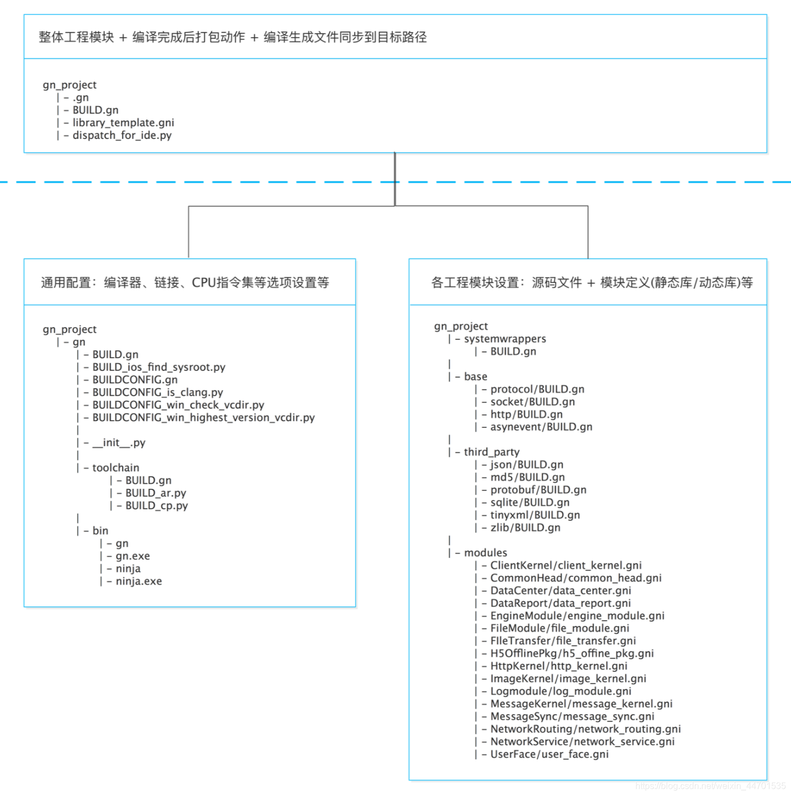
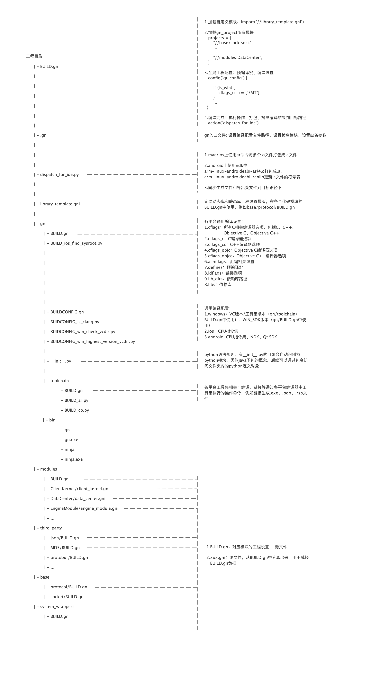

# gn

[gn快速开始](https://github.com/chinanf-boy/gn-zh/blob/master/docs/quick_start.zh.md)

> 该仓库基于 google 的 gn 仓库进行的翻译

## 语法

GN 使用非常简单、动态类型的语言

- 布尔类型 (`true`、`false`)
- 64有符号整数
- string
- 列表
- 范围(类似字典，只用于内置的东西)

### 字符串

**字符串**以双引号括起来，并使用反斜杠作为转义字符

但是反斜杠只支持 `\"`、 `\$`、 `\\`，反斜杠任何其他的用途都会被视为**字面反斜杠**

> `"C:\foo\bar.h"` 这里的 `\b` 没有被转义

**字符串**支持跟随 `$` 符号的词被变量的值替换，也可以使用 `{}` 来替换变量值

以 `a = "my_path"` 为例

| 写法 | 实际值 |
| --- | --- |
| `b = "$a/foo.cc"` | `b = "my_path/foo.cc"` |
| `c = "$foo_{a}_bar.cc"` | `c = "foo_my_path_bar.cc"` |

### 列表

**列表**支持增加、删除、索引操作，但是**不支持获取列表长度**

```gn
# 增加
a = [ "first" ]
a += [ "second" ]  # [ "first", "second" ]
a += [ "third", "fourth" ]  # [ "first", "second", "third", "fourth" ]
b = a + [ "fifth" ]  # [ "first", "second", "third", "fourth", "fifth" ]

# 删除
a = [ "first", "second", "third", "first" ]
b = a - [ "first" ]  # [ "second", "third" ]
a -= [ "second" ]  # [ "first", "third", "fourth" ]

# 索引
a = [ "first", "second", "third" ]
b = a[1]  # -> "second"
```

`[]` 运算符是只读的，不能用于对列表进行改变，这种i情况的主要用途是当外部脚本返回几个已知值时，可以提取

```gn
a = [ "one" ]
a = [ "two" ]  # Error: overwriting nonempty list with a nonempty list.
a = []         # OK
a = [ "two" ]  # OK
```

### 条件

```c
if (is_linux || (is_win && target_cpu == "x86")) {
        sources -= [ "something.cc" ]
    } else if (...) {
        ...
    } else {
    ...
}
```


### 循环

```c
foreach(i, mylist) {
    print(i)  # Note: i is a copy of each element, not a reference to it.
}
```

### 文件名

- 相对名称

```c
"foo.cc"
"src/foo.cc"
"../src/foo.cc"
```

- 源数绝对名称

```c
"//net/foo.cc"
"//base/test/foo.cc"
```

- 系统绝对名称

```c
"/usr/local/include/"
"/C:/Program Files/Windows Kits/Include"
```

### 构建配置-目标

| 命令 | 作用 |
| --- | --- |
| action | 运行脚本生成文件. |
| action_foreach | 为每个源文件运行一次脚本. |
| bundle_dat | 一个声明数据进入 MAC/iOS 包. |
| create_bundle | 创建一个 Mac/IOS 包. |
| executable | 生成一个可执行文件. |
| group | 是指一个或多个其他目标的虚拟依赖节点. |
| shared_library | 一个 . DLL 或.SO. |
| loadable_module | 一个 .DLL 或.SO ,只能在运行时加载. |
| source_set | 一个轻量级的虚拟静态库(通常比实际静态库更可取,因为它将更快地构建). |
| static_library | 是.LIB 或.file(通常你需要一个source_set取而代之) |

### 构建配置-Config

```gn
# 定义 config
config("my_config") {
  # 预处理器宏定义
  defines = [
    "USE_FEATURE_X",
    "ENABLE_LOGGING"
  ]

  # 包含目录
  include_dirs = [
    "//include",
    "//third_party/lib/include"
  ]

  # 编译选项
  cflags = [
    "-Wall",
    "-O2"
  ]

  # 链接选项
  ldflags = [
    "-lmylib"
  ]
}

```

```gn
# 将 config 应用到目标
# 引用自定义配置文件
import("//configs/my_config.gni")

executable("my_app") {
  sources = [
    "main.cc",
    "app.cc"
  ]

  # 使用定义的 config
  configs += [ ":my_config" ]
}

```

为什么上面例子应用 config 时要用 `configs += [":my_config"]` ？

这里 `+=` 表示向现有的 configs 属性追加 :my_config，保留之前的所有设置。如果直接使用 `=` 则表示直接覆盖掉之前的配置 

为什么应用 config 时要写 `:my_config` ?

- `:config_name` 表示当前文件中的配置
- `//path/to:config_name` 表示绝对路劲的配置
- `//path/to/configs:config_name` 表示绝对路径下特定目录中的配置

以下面的路劲为例子

```bash
my_project/
├── BUILD.gn
├── config/
│   └── my_config.gni
└── src/
    └── main.cc
```

在 `config/my_config.gni` 中定义

```gn
config("my_config") {
  cflags = [
    "-Wall",
    "-O2"
  ]
}
```

在 `BUILD.gn` 中

```gn
# 导入配置文件
import("//config/my_config.gni")

executable("my_app") {
  sources = [
    "src/main.cc"
  ]

  # 正确的使用方式：使用绝对路径或当前作用域
  configs = [ "//config:my_config" ]  # 绝对路径
  # 或
  configs += [ ":my_config" ]  # 当前作用域，假设 my_config 在当前文件中定义
}
```

假设模块A依赖于某个配置B，希望所有依赖于 A 模块的其他模块都依赖配置 B，这个时候应该使用 **公共配置**

```gn
# 配置B
config("my_external_library_config") {
  includes = "."
  defines = [ "DISABLE_JANK" ]
}

# 模块A
shared_library("my_external_library") {
  ...
  # 所有依赖于这个库的目标都拿到了公共配置.
  public_configs = [ ":my_external_library_config" ]
}

# 其他模块
static_library("intermediate_library") {
  ...
  # Targets that depend on this one also get the configs from "my external library".
  public_deps = [ ":my_external_library" ]
}
```

### 构建配置-模板

`template` 㻾创建自定义的符合构建目标。通过定义模板，可以将一组常用的构建配置封装起来，然后再多个地方复用，减少重复代码并提高构建文件的可维护性

```gn
# 定义 template
# my_templates.gni

template("my_executable_with_tests") {
  # 定义模板参数
  declare_args() {
    sources = []
    test_sources = []
  }

  # 创建可执行文件目标
  executable(target_name) {
    sources = sources
  }

  # 创建测试可执行文件目标
  executable(target_name + "_test") {
    sources = test_sources
    deps = [ ":$target_name" ]
  }
}
```

使用 `template`

```gn
# 引用模板文件
import("//path/to/my_templates.gni")

# 使用模板来创建构建目标
my_executable_with_tests("my_app") {
  sources = [ "main.cc", "app.cc" ]
  test_sources = [ "app_test.cc" ]
}
```

模板的第一个参数会被用作 target_name，即目标名称。所以 `template` 中定义的 `target_name` 对应的就是 `my_app`

除了定义之外，`template` 中还能定义 条件判断、循环、嵌套模板

```gn
# templates/my_templates.gni

template("my_executable_with_tests") {
  declare_args() {
    sources = []
    test_sources = []
    use_optimization = false
  }

  if (use_optimization) {
    config("optimization_config") {
      cflags = [ "-O2" ]
    }
  }

  executable(target_name) {
    sources = sources
    if (use_optimization) {
      configs += [ ":optimization_config" ]
    }
  }

  executable(target_name + "_test") {
    sources = test_sources
    deps = [ ":$target_name" ]
  }
}

```

## 交叉编译

[GN如何处理跨平台编译](https://github.com/chinanf-boy/gn-zh/blob/master/docs/cross_compiles.zh.md)

## 注意

注意路径中不要出现中文，否则可能会出现莫名其妙的错误

## 样例

### Hello-GN

[Hello-GN](https://github.com/mhf-air/hello-gn)


通常来说

- 项目中会有一个 `.gn` 文件

`.gn` 文件是项目的入口文件，该文件会依赖其他的配置文件， `gn` 会逐级加载这些被依赖的配置文件。依赖项加载完毕之后，再从项目的根目录开始逐级加载所有 `.gn` 结尾的文件

> 根目录中的 `BUILD.gn` 文件所依赖的其他的其他文件会被加载

- 项目中可能存在多个`BUILDCONFIG.gn` 文件

通常来说 `BUILDCONFIG.gn` 是一个特殊文件，通产用于定义全局构建配置、设置默认值、全局变量等，这些配置可以被项目中的其他 `BUILD.gn` 文件引用

| 作用 | 代码 |
| --- | --- |
| 定义全局变量 | `declare_args() { is_debug = false }` |
| 设置默认值 | 定义默认的编译器选项、链接器选项等 |
| 导入公共配置 | `import("//build/config/compiler.gni")` |
| 配置工具链 | `toolchain("win") {  }` | 
| 定义构建逻辑 | `if(is_win) {  }` |

常见变量

| 变量 | 含义 |
| --- | --- |
| os | 操作系统 |
| cpu | 处理器 |
| host | 编译时的主机 |
| target | 目标平台 |
| current | 当前配置 |

常见配置写法

```gn
if (target_os == "") {
  target_os = host_os
}

if (target_cpu == "") {
  if (target_os == "android") {
    target_cpu = "arm"
  } else {
    target_cpu = host_cpu
  }
}

if (current_cpu == "") {
  current_cpu = target_cpu
}
if (current_os == "") {
  current_os = target_os
}
```

- 项目中会有一个 `build\toolchain` 文件夹，里面存放着 `BUILD.gn`


构建项目的结构是项目根目录的 `BUILD.gn` 文件

```c
executable("hello") {
    ...
}

shared_library("hello_shared") {
    ...
}

static_library("hello_static") {
    ...
}
```

在 `build\toolchain\BUILD.gn` 中定义了工具链

```c
toolchain("gcc") {
    tool("cc") { ... }
    tool("alink") { ... }
    tool("solink") { ... }
    tool("link") { ... }
    tool("stamp") { ... }
    tool("copy") { ... }
}
```

在 `GN` 中，工具链（`toolchain`）和工具（`tools`）的调用是通过目标类型（如 `executable`、`static_library`、`shared_library` 等）和默认配置来自动处理的

编译 C/C++ 源文件时会自动调用 `cc` 工具，链接静态库时会调用 `alink` 工具，链接共享库时会调用 `solink` 工具，生成可执行文件时会调用 `link` 工具

| 命令 | 工具 |
| --- | --- |
| `executable` | `cc`、`link` |
| `static_library` | `alink` |
| `shared_library` | `solink` |
| `source_set` 或 `group` | `stamp` |

在 `BUILDCONFIG.gn` 中通过 `set_default_toolchain("//build/toolchain:gcc")` 设置默认工具


### 案例2

[GN实践](https://blog.csdn.net/weixin_44701535/article/details/88355958)

[GN Demo 项目](https://github.com/TechGhostForGithub/source_gn_project)

`BUILD.gn` 一般作为模块的工程入口文件，可以配合 .gni 文件来划分源码或模块

`.gn` 根文件是一个入口设置的文件，是 GN 中的固定规则文件，会自动被 GN 读取



一般 GN 组织一个跨平台工程分为**三大块**

1. 整体工程入口，一般不经常修改
2. GN 通用文件，一般不经常修改
3. GN 源代码工程文件，这部分与平常在继承开发环境中类似，源文件的组织和管理就在这部分



> 各个 GN 文件的作用

以根目录的 `BUILD.gn` 为例

```gn
if (!is_test) {
    group("ccore"){
        deps = projects
        deps += [ "//:dispatch_for_ide" ]
    }
}

action("dispatch_for_ide") {
    arg = [
        "--kernel", rebase_path("//"),
        "--outpath", rebase_path("//out"),
        "--cachepath", rebase_path("$root_out_dir"),
    ]

    if (is_debug) {
        arg += [ "--buildmode", "Debug" ]
    } else {
        arg += [ "--buildmode", "Release" ]
    }

    arg += ["--targetcpu", "${target_cpu}"]
    
    script = "dispatch_for_ide.py"
    outputs = [ "$root_out_dir/libccore_gn.a" ]
    args = arg
    deps = projects
}
```

`action` 目标是定义自定义构建步骤的一个机制。它的执行时机和调用方式依赖于它在构建图中的依赖关系

比如上述代码定义了名为 `dispatch_for_ide` 的 `action`，该 action 在 `group("ccore")` 被依赖，所以当 `ccore` 被执行时会执行该 `action`

- `script` 字段指定了要执行脚本为 `dispatch_for_ide.py`
- `outputs` 字段表明了会输出哪些文件，通过 `outputs` 和 `sources` 可以明确 `action` 之间的依赖关系，从而决定执行顺序
- `args` 定义了执行脚本时会传入的参数，可以通过 `if-else` 添加不同的命令参数
- `deps` 该 `action` 的依赖项，会先进行依赖项

```gn
if (is_win) {
    set_sources_assignment_filter([ 
        "*_posix.h", "*_posix.cc",
        "*_mac.h", "*_mac.cc", "*_mac.mm",
        "*_android.h", "*_android.cc",
        "*_jni.h", "*_jni.cc",
    ])
}
```

- `source_set`：编译后的代码集合，它与静态库的唯一区别时灭有链接的符号文件，就是一遍编译后生成的 .i 文件
- `static_library`：静态库，windows 上是 lib 库，其他平台是 .a 库
- `shared_library`：动态库，windows 上是 dll 库，Android 平台是 .so 库， mac 和 IOS 是 dylib 库

