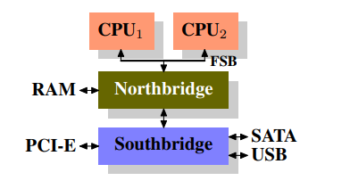
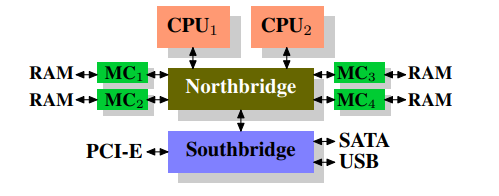
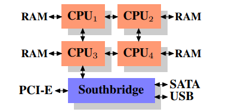
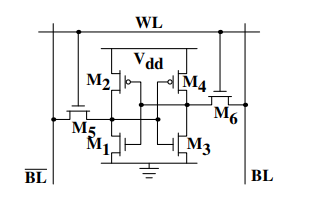
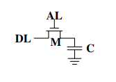
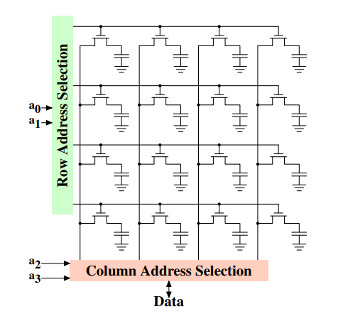
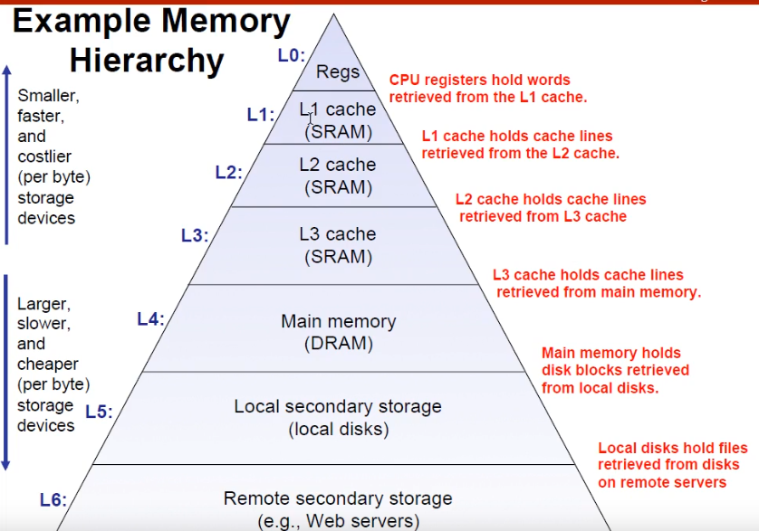
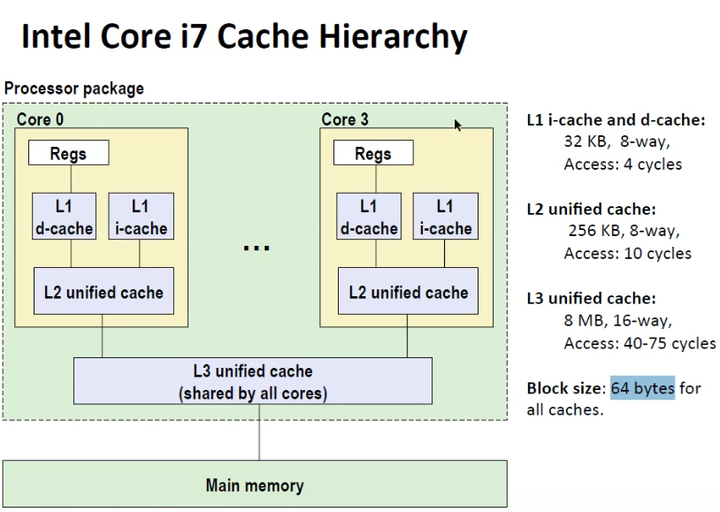

# 内存

[每个程序员都应该知道的内存知识](./What%20Every%20Programmer%20Should%20Know%20About%20Memory.pdf) 

所有内容都是从面的文件中提取

首先，改文件编写于2007年，受限于时代背景，有一些已经被淘汰的计算机结构仍然会出现在文章中，不过这些并不会影响到内存知识的学习

[B站说明视频](https://www.bilibili.com/video/BV1Xy4y1b7SK/)

## 硬件

计算机存在过一种结构，南桥北桥

北桥连接内存控制器、内存、CPU，南桥通常连接 IO 接口

由于 CPU 控制通过 USB、PCI-E 等接口连接的设备时要通过南北桥之间的接口，这里会出现性能瓶颈

> CPU 控制设备时要经过 FSB、北桥、南北桥接口、南桥、USB 

然后出现了第二种结构，将内存控制器与北桥分离

然后出现了第三种结构，被称为 `NUMA` 的非统一内存架构

这种架构有一个明显的问题，那就是如果 `CPU1` 想要访问右下角的 `RAM` 时，需要通过 `CPU2` 和 `CPU4` 才能访问

## RAM 的类型

通常来说 RAM 内存分为两种：静态内存(`Static RAM`, `SRAM`) 和 动态内存(`Dynamic RAM`, `DRAM`)

通常来说静态内存(`SRAM`)的速度快，但是**生产成本**和**使用成本**都比动态内存(`DRAM`)高

所以一般来说，结合各种特点，`CPU` 缓存会使用 `SRAM`，主存使用 `DRAM`

上图展示了 6 晶体管 SRAM **单元**的结构。该单元的核心由 4 个晶体管(M1 ~ M4) 构成，这 4 个晶体管构成两个交叉耦合的反相器。它们有两个**稳定状态**，分别表示 0 和 1。 只要 $V_{dd}$ 通带内，状态就稳定

上图展示了常用 DRAM **单元**设计的结构，就是一个电容加一个晶体管，成本很低

但是该结构存在一个问题，那就是需要不停的刷新，即需要定时写入数据让数据保持原来的样子，因为电容会漏电

为了容纳大量单元，单元内电容的容量必须尽可能的低。充满电的电容可以容纳数十或数千个电子

对于大多数 DRAM 来说，刷新的频率是 64ms，并且刷新期间不能访问存储器

上图就是一个简易的 DRAM 的示意图，每个单元代表一个 bit 的存储，通过指定行、列可以得到期望的 bit，执行多次获取操作就可以得到一组数据

## CPU 缓存

- Regs: 寄存器
- L1: 一级缓存
- L2: 二级缓存
- L3: 三级缓存
- Main Memory: 主存
- Local Secondary Storage: 硬盘
- Remote Secondary Storage: 网络存储

CPU 缓存从上到下，成本越来越低，速度越来越慢

[不同年代各个存储单元的访问速度](https://colin-scott.github.io/personal_website/research/interactive_latency.html)

CPU 缓存对用户来说是透明的，这里的用户可以是程序员、编译器等

程序和数据存在时间局部性和空间局部性，空间局部性的例子就是数组，如果频繁访问一个变量那就是时间局部性。如果没有这些局部性，缓存是没有用的

所以程序员需要帮助处理来使用缓存资源，不要浪费缓存机制

> I7 的缓存示例图

这颗 CPU 共有 4 个核(Core0 ~ Core3)，每个核心都有自己的寄存器(Regs)、一级缓存(L1, d-cache 数据缓存，i-cache 指令缓存)、二级缓存(L2)

4 个核共享三级缓存(L3)

`Block Size` 即一个缓存单元，这颗 CPU 一次缓存 64 KB 的数据。一般也不会说一个字节一个字节的缓存，这样命中率太低，依靠空间局部性会将目标附近的数据都缓存下来

| 读取数据 | 开销 |
| --- | --- |
| Register 寄存器 | <= 1 |
| L1d | ~3 |
| L2 | ~14 |
| Main Memory 主存 | ~240 |

不命中的三种情况

1. 缓存大小有限，一定会出现不命中的情况
2. 发生冲突，需要将缓存的数据踢出，使用新的数据覆盖
3. 系统刚启动、程序刚运行时，缓存为空，一定不命中

