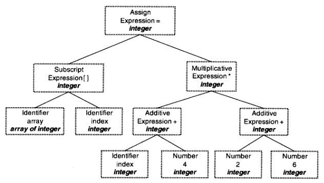
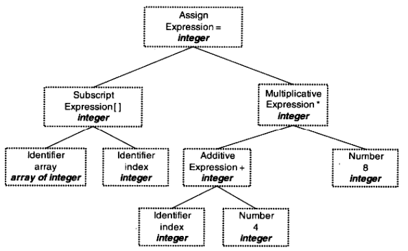

# 程序员的自我修养

## 源码执行过程

源码执行的过程可以被分成四部分

1. 预处理(Prepressing)：主要处理那些源码中以 `#` 开始的预编译指令，例如 `#include`、`#define`
2. 编译(Compilation)：把预处理完的文件进行一系列**词法分析**、**语法分析**、**语义分析**以及**优化**后生产相应的**汇编代码文件**
3. 汇编(Assembly)：汇编器是将汇编代码转变成机器可以执行的指令，每一个汇编语句几乎都对应一条机器指令。汇编器根据汇编指令和机器指令的对照表一一翻译就可以了
4. 链接(Linking)

以 `hello.c`、`hello1.c`、`hello2.c` 为例

```cpp
// hello2.c
int mul(int a, int b){
 return a * b;
}

// hello1.c
#include "hello2.c"
int add(int a, int b) {
 return a + b;
}

// hello.c
#include "hello1.c"
int main() {
 add(1, 2);
 return 0;
}
```

使用命令 `gcc -E hello.c -o hello.i`，对 `hello.c` 进行 **预处理**

```cpp
# 0 "hello.c"
# 0 "<built-in>"
# 0 "<command-line>"
# 1 "/usr/include/stdc-predef.h" 1 3 4
# 0 "<command-line>" 2
# 2 "hello.c"
# 1 "hello1.c" 1
# 1 "hello2.c" 1
int mul(int a, int b){
 return a * b;
}

# 2 "hello1.c" 2
int add(int a, int b) {
 return a + b;
}
# 2 "hello.c" 2
int main() {
 add(1, 2);
 return 0;
}
```

> `#include` 会递归执行

- 在预处理阶段删除 `#define` 并展开所有的宏定义
- 处理的条件预编译指令 `#if`、`#ifdef`、`#elif`、`#else`、`#endif`
- 处理 `#include` 将包含的文件插入到该预编译指令的位置
- 删除所有的注释
- 添加行号和文件名标识
- 保留 `#pragma` 编译器指令，编译器要用到

使用 `gcc -S hello.i -o hello.s` 将预处理后的文件编译得到汇编代代码

> 汇编文件内容较多，不贴代码

使用 `gcc -c hello.s -o hello.o` 得到机器指令的文件，但是这个文件还不可以执行

在最后执行了**链接**之后，才能够执行

## 编译器做了什么

编译器就是将高级语言翻译成机器语言的工具之一

> 使用汇编语言或机器指令编写程序效率低下，且机器语言和汇编依赖特定机器，一个专门为某种 CPU 编写的程序在另一种 CPU 下完全无法运行

使用高级语言能够使开发者尽量少的考虑计算机本身的限制：字长、内存大小、通信方式、存储方式等


| 英文 | 中文 |
| --- | --- |
| Source Code | 源码 |
| Scanner | 扫描器 |
| Tokens | 记号 |
| Parser | 语法分析 |
| Syntax Tree | 语法树 |
| Semantic Analyzer | 语义分析 |
| Commented Syntax Tree | 语法树 |
| Source Code Optimizer | 源码级优化器 |
| Intermediate Representation | 中间代码 |
| Code Generator | 目标代码生成 |
| Target Code | 目标代码 |
| Code Optimizer | 目标代码优化器 |

### 词法分析

**扫描器**：简单地进行**词法分析**，运用类似有**限状态机**的算法可以将源代码的字符序序列分割成一系列的**记号**(`Token`)

通过 `Scanner` 扫描器的词法分析产生的记号 `Token` 一般分为一下几类：关键字、标识符、字面量(数字、字符串等)和特殊符号（加号、减号等）

> 语法分析工具有 lex

```cpp
array[index] = (index + 4) * (2 + 6);
```

上面的代码通过扫描器之后会得到 16 个 Token

| Token | 类型 |
| --- | --- |
| Array | 标识符 |
| `[` | 左方括号 |
| index | 标识符 |
| `]` | 右方括号 |
| = | 赋值 |
| `(` | 左圆括号 |
| index | 标识符 |
| + | 加号 |
| 4 | 数字 |
| `)` | 右圆括号 |
| * | 乘号 |
| `(` | 左圆括号 |
| 2 | 数字 |
| + | 加号 |
| 6 | 数字 |
| `)` | 右圆括号 |

### 语法分析

语法分析器(`Grammar Parser`) 对扫描器(`Scanner`) 产生的记号进行语法分析，从而产生语法树(`Syntax Tree`)，整个过程采用上下文无关语法(`Context-Free Grammar`)

对于 `int x = (1 + 2;` 这种错误就是在语法分析阶段被检查出来

通过**语法分析器**生成的**语法树**就是以**表达式**为节点的树


> 赋值表达式、加法表达式、乘法表达式、数组表达式、括号表达式等

词法分析工具有 `yacc`(`Yet Another Compiler Compiler`)，可以根据用户给定的语法规则对输入的记号序列进行解析，从而构建出一颗语法树

> 对于不同的语言，编译器的开发者只需要改变语法规则，而无需为每个编译器编写一个语法分析器

### 语义分析

语法分析仅仅完成了对表达式的语法层面的分析，但是并不了解这个语句是否真正有意义

```cpp
int* p1 = NULL;
int* p2 = NULL;
int p3 = p1 * p2;
```

比如上述代码在语法分析阶段是通过的，但是在语义分析阶段不能通过

编译器能分析的语义是静态语义（`Static Semantic`），也就是编译器可以确定的语义。对应的还有动态语义（`dynamic Semantic`），只有在运行期才能确定的语义

- 静态语义：类型检查、变量声明检查、控制流检查等。例如，编译器会检查变量是否在使用前声明，类型转换是否合法等。这些检查在编译时就能确定，因此称为静态语义
- 动态语义：数组越界、除零错误等。这些错误只有在程序实际运行时才能被检测到，因此称为动态语义

经过语义分析之后，语法树的表达式都会被标识上类型，如果有些类型需要做隐式转换，语义分析程序会在语法树中插入相应的转换节点



### 中间语言生成

现代编译器有很多层次的优化，往往在**源代码级别**会有一个优化过程

这里定义的**源码级优化器**(`Source Code Optimizer`)在不同的编译器中可能会有不同的定义或者一些其他的差异

比如之前的例子 `array[index] = (index + 4) * (2 + 6);` 中 **(2 + 6)** 的值在编译期就可以被确定



> 上述的语法树经过优化了

但是一般不会直接优化在语法树上做优化，这比较困难，**源代码优化器** 往往将整个语法树转换成**中间代码**(`Intermediate Code`)，它是语法树的顺序表示，非常接目标代码

> 中间代码一般与目标机器和运行时环境无关，比如不包含数据的尺寸、变量地址和寄存器的名字等

中间代码有很多类型，在不同编译器中有不同的形式，比较常见的有：**三地址码**（`Three-Address Code` Or `TAC`）和 **P-代码**(`P-Code`)

**三地址码** 是常见的中间表示形式，每条三地址码指令最多包含三个地址：两个操作数和一个结果

1. 四元组表示，每条三地址码可以表示为一个四元组(`4-tuple`)：运算符、操作数1、操作数2、结果
2. 简单命令
3. 线性表示，便于编译器进行顺序处理和优化

```cpp
array[index] = (index + 4) * (2 + 6);
```

上述代码以 **三地址码** 为例，会生成如下的中间代码

```cpp
t1 = 2 + 6
t2 = index + 4
t3 = t2 * t1
array[index] = t3
```

**三地址码**的优化过程主要包括消除公共子表达式、常量折叠、赋值传播等技术

所以**优化程序**在三地址码的基础上进行优化时

- 常量折叠：会将 `2 + 6` 计算出来得到 `t1 = 8`，然后将后面代码中的 t1 替换成数字 3
- 复制传播：省去一个临时变量 t3，因为 t2 可以重复利用

最后得到优化后的三地址码如下

```cpp
t2 = index + 4
t2 = t2 * 8
array[index] = t2
```

至于什么是消除公共子表达式，例子如下

```cpp
// 原始三地址码
t1 = b + c
a = t1
t2 = b + c
d = t2
t3 = a * d
e = t3

// 因为 t1 和 t2 表达式相同
t1 = b + c
a = t1
d = t1  // 直接使用 t1 而不是重新计算 b + c
t3 = a * d
e = t3
```

### 目标代码生成与优化

**源代码级优化器**产生的中间代码标志着下面的过程都属于**编译器后端**

编译器后端负责将中间代码转换为目标机器代码，并进行各种优化以提高代码的执行效率。主要包括：**代码生成器**和**目标代码优化器**

代码生成器将中间代码转换成目标机器代码，这个过程十分依赖目标机器，因为不同的机器有着不同的字长、寄存器、整数数据类型和浮点数数据类型等

```x86asm
movl index, %ecx                ; 赋值 index 给 ecx
addl $4, %ecx                   ; ecx = ecx + 4
mull $8, %ecx                   ; ecx = ecx * 8
movl index, %eax                ; 赋值 index 给 eax
movl %ecx, array(, eax, 4)      ; array[index] = ecx
```

最后目标代码优化器对上述的目标代码进行优化，比如选择合适的寻址方式、使用位移来代替乘法运算、删除多余的指令等

```x86asm
movl index, %edx
leal 32(, %edx, 8), %eax
movl %eax, array(, %edx, 4)
```

> 乘法由一条相对复杂的 **基址比例变址寻址**（`Base Index Scale Addressing`） 的 lea 指令完成

