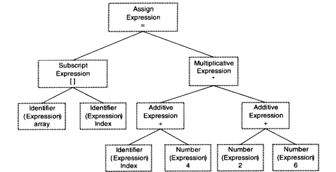

# 程序员的自我修养

## 源码执行过程

源码执行的过程可以被分成四部分

1. 预处理(Prepressing)：主要处理那些源码中以 `#` 开始的预编译指令，例如 `#include`、`#define`
2. 编译(Compilation)：把预处理完的文件进行一系列**词法分析**、**语法分析**、**语义分析**以及**优化**后生产相应的**汇编代码文件**
3. 汇编(Assembly)：汇编器是将汇编代码转变成机器可以执行的指令，每一个汇编语句几乎都对应一条机器指令。汇编器根据汇编指令和机器指令的对照表一一翻译就可以了
4. 链接(Linking)

以 `hello.c`、`hello1.c`、`hello2.c` 为例

```cpp
// hello2.c
int mul(int a, int b){
 return a * b;
}

// hello1.c
#include "hello2.c"
int add(int a, int b) {
 return a + b;
}

// hello.c
#include "hello1.c"
int main() {
 add(1, 2);
 return 0;
}
```

使用命令 `gcc -E hello.c -o hello.i`，对 `hello.c` 进行 **预处理**

```cpp
# 0 "hello.c"
# 0 "<built-in>"
# 0 "<command-line>"
# 1 "/usr/include/stdc-predef.h" 1 3 4
# 0 "<command-line>" 2
# 2 "hello.c"
# 1 "hello1.c" 1
# 1 "hello2.c" 1
int mul(int a, int b){
 return a * b;
}

# 2 "hello1.c" 2
int add(int a, int b) {
 return a + b;
}
# 2 "hello.c" 2
int main() {
 add(1, 2);
 return 0;
}
```

> `#include` 会递归执行

- 在预处理阶段删除 `#define` 并展开所有的宏定义
- 处理的条件预编译指令 `#if`、`#ifdef`、`#elif`、`#else`、`#endif`
- 处理 `#include` 将包含的文件插入到该预编译指令的位置
- 删除所有的注释
- 添加行号和文件名标识
- 保留 `#pragma` 编译器指令，编译器要用到

使用 `gcc -S hello.i -o hello.s` 将预处理后的文件编译得到汇编代代码

> 汇编文件内容较多，不贴代码

使用 `gcc -c hello.s -o hello.o` 得到机器指令的文件，但是这个文件还不可以执行

在最后执行了**链接**之后，才能够执行

## 编译器做了什么

编译器就是将高级语言翻译成机器语言的工具之一

> 使用汇编语言或机器指令编写程序效率低下，且机器语言和汇编依赖特定机器，一个专门为某种 CPU 编写的程序在另一种 CPU 下完全无法运行

使用高级语言能够使开发者尽量少的考虑计算机本身的限制：字长、内存大小、通信方式、存储方式等


| 英文 | 中文 |
| --- | --- |
| Source Code | 源码 |
| Scanner | 扫描器 |
| Tokens | 记号 |
| Parser | 语法分析 |
| Syntax Tree | 语法树 |
| Semantic Analyzer | 语义分析 |
| Commented Syntax Tree | 语法树 |
| Source Code Optimizer | 源码级优化器 |
| Intermediate Representation | 中间代码 |
| Code Generator | 目标代码生成 |
| Target Code | 目标代码 |
| Code Optimizer | 目标代码优化器 |

**扫描器**：简单地进行**词法分析**，运用类似有**限状态机**的算法可以将源代码的字符序序列分割成一系列的**记号**(`Token`)

通过 `Scanner` 扫描器的词法分析产生的记号 `Token` 一般分为一下几类：关键字、标识符、字面量(数字、字符串等)和特殊符号（加号、减号等）

> 语法分析工具有 lex

```cpp
array[index] = (index + 4) * (2 + 6);
```

上面的代码通过扫描器之后会得到 16 个 Token

| Token | 类型 |
| --- | --- |
| Array | 标识符 |
| `[` | 左方括号 |
| index | 标识符 |
| `]` | 右方括号 |
| = | 赋值 |
| `(` | 左圆括号 |
| index | 标识符 |
| + | 加号 |
| 4 | 数字 |
| `)` | 右圆括号 |
| * | 乘号 |
| `(` | 左圆括号 |
| 2 | 数字 |
| + | 加号 |
| 6 | 数字 |
| `)` | 右圆括号 |

语法分析器(`Grammar Parser`) 对扫描器(`Scanner`) 产生的记号进行语法分析，从而产生语法树(`Syntax Tree`)，整个过程采用上下文无关语法(`Context-Free Grammar`)

通过**语法分析器**生成的**语法树**就是以**表达式**为节点的树



> 赋值表达式、加法表达式、乘法表达式、数组表达式、括号表达式等

词法分析工具有 `yacc`(`Yet Another Compiler Compiler`)，可以根据用户给定的语法规则对输入的记号序列进行解析，从而构建出一颗语法树

> 对于不同的语言，编译器的开发者只需要改变语法规则，而无需为每个编译器编写一个语法分析器

