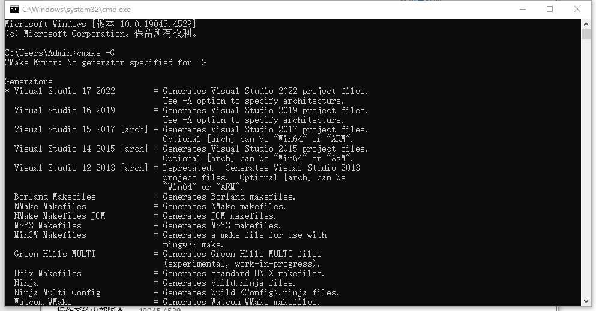
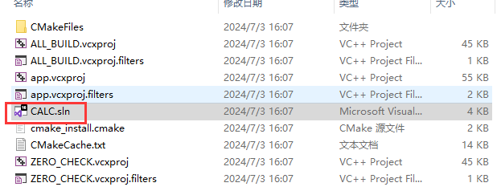
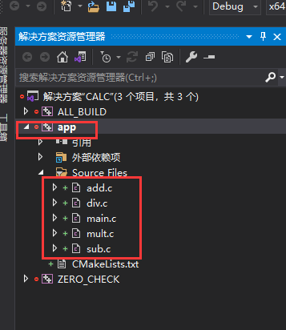
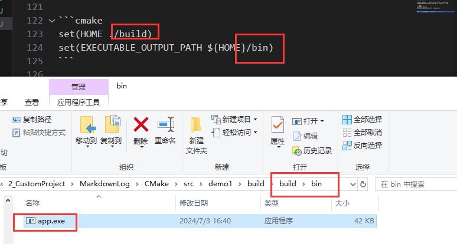
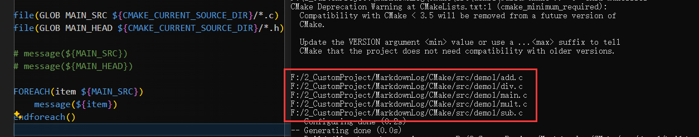
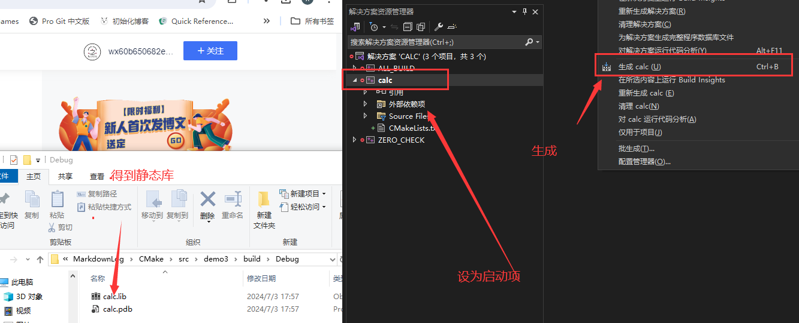
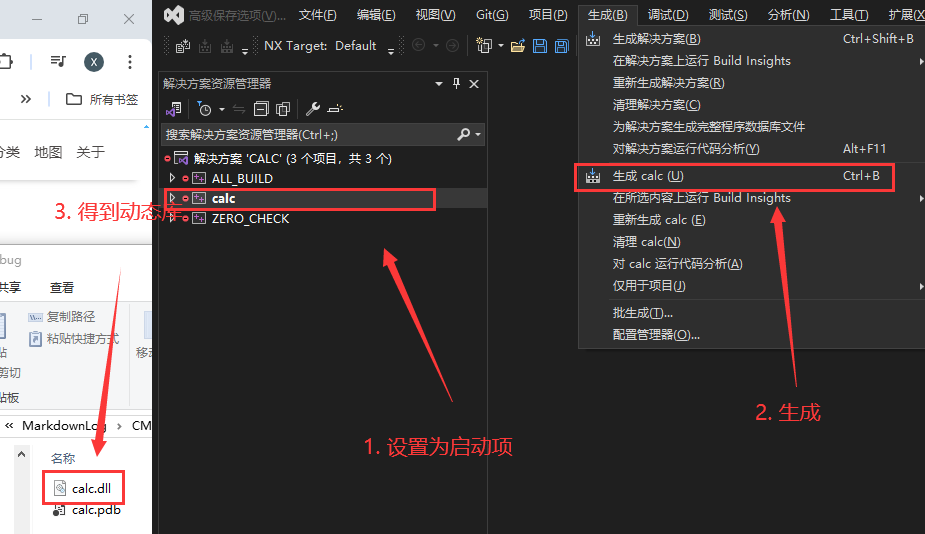
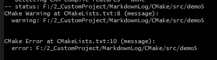

# CMake

[CMake 保姆级教程（上）](https://subingwen.cn/cmake/CMake-primer/)
[CMake 保姆级教程（下）](https://subingwen.cn/cmake/CMake-advanced/)

## 简单使用

以 `src/demo1` 为例

```bash
$ tree
.
├── add.c
├── div.c
├── head.h
├── main.c
├── mult.c
└── sub.c
```

在 `build` 文件夹中使用 `cmake ..` 生成项目

```cmake
# CMakeList.txt
cmake_minimum_required(VERSION 3.0)
project(CALC)
add_executable(app add.c div.c main.c mult.c sub.c)
# 等价于 add_executable(app add.c;div.c;main.c;mult.c;sub.c)
```

> 因为 `cmake` 生成的临时文件可能很多，所以在 build 文件夹中生成，这样不会污染根目录

使用 `cmake` 之后，会生成中间文件和 `Makefile`，再使用 `make` 来执行，最后生成 `app.exe` （Windows 平台）

| 命令 | 作用 |
| --- | --- |
| cmake_minimum_required | 指定使用的 cmake 的最低版本 |
| project | 定义工程名称，并可指定工程的版本、工程描述、web主页地址、支持的语言（默认情况支持所有语言），如果不需要这些都是可以忽略的，只需要指定出工程名字即可 |
| add_executable(可执行程序名 源文件名称) | 定义工程会生成一个可执行程序 |

如果想要使用 cmake 创建指定类型的项目，可以在命令中指定



使用 `cmake -G` 可以查看可以生成的项目

> `*` 标记的是默认生成项目类型

如果想要生成 `Unix Makefiles` 或者其他版本的 `Visual Studio` 项目 的话，可以使用

```
cmake .. -G "Unix Makefiles"
cmake .. -G "Visual Studio 16 2019"
```

> 为了方便使用 `make` 命令，所以后面一些测试使用 `Unix Makefiles`



> 这个 `visual studio` 项目的名称就是 `project` 中设置的 `CALC`



对应的命令就是 `add_executable(app add.c div.c main.c mult.c sub.c)`

- 第一个参数 `app` 就是最后生成可执行程序的名称
- 后面参数就是项目包含的文件名称

### 定义变量

如果一直使用 `add.c div.c main.c mult.c sub.c` 来表示所添加的问题，也是挺麻烦的

可以定义变量来表示整个 `add.c div.c main.c mult.c sub.c` 文件

```cmake
# SET 指令的语法是：
# [] 中的参数为可选项, 如不需要可以不写
# SET(VAR [VALUE] [CACHE TYPE DOCSTRING [FORCE]])

set(SRC_LIST add.c;div.c;main.c;mult.c;sub.c)
add_executable(app  ${SRC_LIST})
```

- `SRC_LIST`: 变量名
- `${SRC_LIST}`: 获取值

#### C++版本

编译 C++ 项目的时候需要指定 C++ 版本：C++11、C++14、C++17、C++20 等，有些项目会用到对应版本的特性

以 g++ 编译的命令为例 

```bash
g++ *.cpp -std=c++11 -o app
```

> `-std=c++11` 对应 C++ 标准有一个宏叫做 `DCMAKE_CXX_STANDARD` 

在 `cmake` 可以通过 `SET` 设置 `DCMAKE_CXX_STANDARD` 的值

```cmake
# -std=c++11
set(CMAKE_CXX_STANDARD 11)
# -std=c++14
set(CMAKE_CXX_STANDARD 14)
# -std=c++17
set(CMAKE_CXX_STANDARD 17)
```

也可以使用在 `cmake` 命令中控制

```bash
cmake CMakeLists.txt文件路径 -DCMAKE_CXX_STANDARD=11
cmake CMakeLists.txt文件路径 -DCMAKE_CXX_STANDARD=14
cmake CMakeLists.txt文件路径 -DCMAKE_CXX_STANDARD=17
```

#### 输出路径

在CMake中指定可执行程序输出的路径，也对应一个宏，叫做`EXECUTABLE_OUTPUT_PATH`，它的值还是通过 `set` 命令进行设置

```cmake
set(HOME ./build)
set(EXECUTABLE_OUTPUT_PATH ${HOME}/bin)
```

生成 `Unix Makefiles` 项目，然后使用 `make` 执行



最后 `app.exe` 就生成在 `build/bin` 目录中

> 如果路径不存在，会自动创建，无需手动生成

### 文件检索

如果项目中的源文件非常多，在编写 `CMakeLists.txt` 文件的时候不可能将项目目录的各个文件一一罗列出来，所以 `CMake` 提供了搜索文件的命令

可以使用 `aux_source_directory` 命令或者 `file` 命令

```cmake
aux_source_directory(<dir> <variable>)
```

- `dir`: 要搜索的目录
- `variable`: 将从 `dir` 目录下搜索的源文件列表存储到该变量中

```cmake
file(GLOB/GLOB_RECURSE 变量名 要搜索的文件路径和文件类型)
```

- `GLOB`: 将指定目录下搜索到的满足条件的所有文件名生成一个列表，并将其存储到变量中
- `GLOB_RECURSE`: 递归搜索指定目录，将搜索到的满足条件的文件名生成一个列表，并将其存储到变量中

```cmake
file(GLOB MAIN_SRC ${CMAKE_CURRENT_SOURCE_DIR}/*.c)
file(GLOB MAIN_HEAD ${CMAKE_CURRENT_SOURCE_DIR}/*.h)

# message(${MAIN_SRC})
# message(${MAIN_HEAD})

message(${PROJECT_SOURCE_DIR})
message(${CMAKE_CURRENT_SOURCE_DIR})

FOREACH(item ${MAIN_SRC})
    message(${item})
ENDFOREACH()
```



| 函数的变量 | 作用 |
| --- | --- | 
| CMAKE_CURRENT_SOURCE_DIR | 当前访问的 CMakeLists.txt 文件所在的路径 |
| FOREACH | CMake 中遍历的写法，这里是遍历的头 |
| ENDFOREACH | CMake 中遍历的写法，这里是遍历的尾 |
| message | 输出指定内容 |

编译项目源文件的时候，很多时候需要将源文件的**头文件**路径指定出来，这样才能保证在编译过程中编译器能找到这些文件，可以使用 `include_directories` 来包含这些头文件

```cmake
include_directories(headpath)
```

> 以 `demo2` 为例

```cmake
cmake_minimum_required(VERSION 3.0)

project(CALC)

set(CMAKE_CXX_STANDARD 11)
set(EXECUTABLE_OUTPUT_PATH ${CMAKE_CURRENT_SOURCE_DIR}/build/bin/)

include_directories(${PROJECT_SOURCE_DIR}/include)
file(GLOB SRC_LIST ${CMAKE_CURRENT_SOURCE_DIR}/src/*.c)

add_executable(app  ${SRC_LIST})
```

### 动态库或静态库

有些时候我们编写的源代码并不需要将他们编译生成可执行程序，而是生成一些静态库或动态库提供给第三方使用

#### 制作静态库

以 `demo3` 为例

直接使用 `add_library` 制作静态库

```cmake
add_library(库名称 STATIC 源文件1 [源文件2] ...) 
```

> **STATIC**

在 linux 中静态库名字分为三个部分：`lib` + 库名称 + `.a` ，但是这里只用指定出库的名字就可以了，另外两部分在生成该文件的时候会自动填充

> Windows 与 Linux 的库名虽然不同，但是也只用指定名字即可

- 在 `Linux` 平台下，可以直接通过 `make` 编译链接项目生成静态库
- 在 `Windows` 平台下，通过 `CMake` 生成 `Visual Studio` 项目，通过 `Ctrl + B` 生成静态库



> `Windows` 平台就不要生成之前的说的 `Unix Makefiles` 的项目了

#### 制作动态库

以 `demo4` 为例

制作动态库也是 `add_library` 

```cmake
add_library(库名称 SHARED 源文件1 [源文件2] ...) 
```

> **SHARED**




- `Linux` 平台下动态库的名字也是三部分：`lib` + 库名字 + `.so`
- `Windows` 平台下动态库的名字以 `dll` 结尾

#### 指定输出路径

前面使用 `EXECUTABLE_OUTPUT_PATH` 指定了可执行程序的输出路径

由于在 `Linux` 下生成的动态库默认是有执行权限的，所以可以按照生成可执行程序的方式 `EXECUTABLE_OUTPUT_PATH` 去指定它生成的目录

但是 `Linux` 下静态库默认不具备可执行权限，所以 `EXECUTABLE_OUTPUT_PATH` 并不通用

基于上面的原因，建议统一使用 `LIBRARY_OUTPUT_PATH` 来设置输出路径，该宏动态库和静态库都可以使用

```cmake
set(LIBRARY_OUTPUT_PATH ${CMAKE_CURRENT_SOURCE_DIR}/lib)
```

### 日志

> Demo5 为例

```cmake
message([STATUS|WARNING|AUTHOR_WARNING|FATAL_ERROR|SEND_ERROR] "message to display" ...)
```

| category | 作用 |
| --- | --- |
| (无)  | 重要消息 | 
| STATUS | 非重要消息 | 
| WARNING | CMake 警告, 会继续执行 | 
| AUTHOR_WARNING | CMake 警告 (dev), 会继续执行 | 
| SEND_ERROR | CMake 错误, 继续执行，但是会跳过生成的步骤 | 
| FATAL_ERROR | CMake 错误, 终止所有处理过程 | 



### 变量操作

1. 追加

> Demo5 为例

使用 `set` 进行字符串拼接

```cmake
set(变量名1 ${变量名1}${变量名2}...)
```

