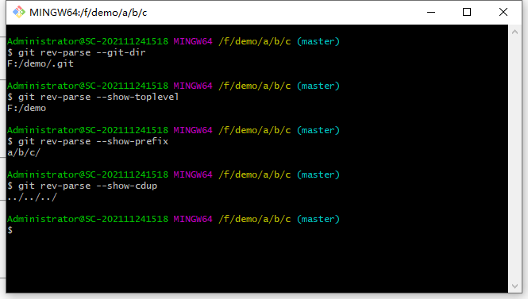
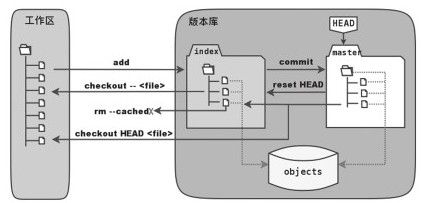
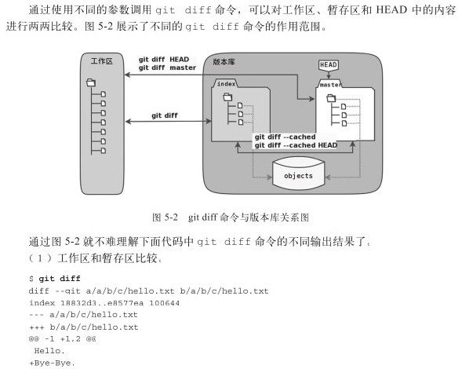

# Git

## 使用Git的理由

1. 每日工作备份(其实也不是每日，可以每小时每分钟)
2. 异地协同工作
3. 现场版本控制，产品部署线程进行源代码修改，并在修改过程中进行版本控制，以便在完成修改后能够将修改结果甚至修改过程一并带走，并能够将修改结果合并至项目对应的代码库中
4. 避免引入辅助目录，SVN会引入.svn目录，Git虽然也会引入.git目录，但是Git可以指定外部.git目录
5. 重写提交说明
6. 想吃后悔药，错误提交了1G的文件
    - 对SVN来说可能不太好解决
    - 对Git来说`git rm--cached xxx.img` 和 `git commit--amend`，然后使用变基操作`git rebast-i<comit-id>`
7. 更好的提交列表
    - 一般而言，一次提交只干一件事情，要么修改bug，要么优化代码，切不可修改bug和优化代码一起提交
    - Git的解决方案：执行`git add`命令将修改内容加入提交残存去，执行`git add-u`命令可以将所有修改过的文件加入暂存区，执行`git add -A`命令可以将本地删除文件和新增添加都提交到暂存区，执行`git add-p`命令甚至可以对一个文件内容的修改进行有选择性的添加
8. 更好的差异比价
    - 支持二进制文件的比较
    - 支持一行内逐字比较
    - 修改的文件执行`git diff`查看修改造成的差异
9. 工作进度保存

## Git初始化

```bash
$ git --version
git version 2.32.0.windows.2
```

1. 配置当前用户的姓名和邮箱，在提交版本库时会用到

设置一下Git的配置变量，这是一次性工作，这些设置会在全局文件(用户主目录下的.gitconfig)或系统文件中做永久的记录

```bash
git config --global user.name "用户名"
git config --global user.emial "邮箱"
```

2. 设置Git变量，使命令变得简洁

```bash
git config --global alias.st status      # git status    => git st
git config --global alias.ci commit      # git commit    => git ci
git config --global alias.co checkout    # git checkout  => git co
git config --global alias.br branch      # git branch    => git br
```

3. git命令输出中开启颜色 显示

```bash
git config --global colour.ui true
```

------

从零开始创建版本库

1. 创建新的工作目录，使用`git init`创建版本库

```bash
mkdir demo
cd demo
git init
```

在1.6.5版本之后，可以直接通过`git init demo`完成文件夹的创建和版本库的初始化

> 上述命令基于linux，在windows中可以使用Git Bash

在创建出来的demo文件夹中可以看到`.git`文件夹，这个.git文件夹就是Git版本库，又叫仓库,repository

2. 管理文件

在demo文件夹中添加welcome.txt，内容为"Hello World"

```bash
git add welcome.txt
```

通过上述命令，将新建立的文件添加到版本库，但是跟其他版本管理系统一样，需要执行员一次提交操作，对git来说就是`git commit`，此时git会弹出一个文件要求填写提交说明，使用`git commit -m "提交说明"`来省去弹出编辑器的操作

```bash
$ git commit -m "initliaze"
[master (root-commit) 4eb8b92] initliaze
 1 file changed, 1 insertion(+)
 create mode 100644 welcome.txt
```

- 第一行：提交到master分支，并且是该分支的第一个提交(root-commit)，提交ID4eb8b92
- 第二行：此次提交修改了一个文件，包含一行插入
- 第三行：此次提交创建了welcome.txt文件

> 提交ID一般来说是不一样的，如果你我一样建议结婚

-----

### 为什么需要一个.git目录

Git及其它分布式版本控制系统的一个共同的显著特点就是，版本库位于工作区的根目录下，对git来说版本库位于工作区根目录下的.git目录中

git将版本库(.git目录)放在工作区跟目录下，在工作区的子目录中执行Git命令时，git会**向上递归查找**.git目录，找到.git目录就是工作区对应的版本库，.git所在的目录就是工作区的根目录，文件.git/index记录了工作区文件的状态(就是**暂存区**的状态)

- 使用`git rev-parse --git-dir`查看git所在路径
- 使用`git rev-parse --show-toplevel`查看工作区根目录
- 使用`git rev-parse --show-prefix`查看当前目录相对根目录的相对路径
- 使用`git rev-parse --show-cdup`显示当前目录后退到工作区的根的深度

比如，我们通过`mkdir -p a/b/c`，在新创建的`c`文件夹中调用`git rev-parse --git-dir`命令测试一下就行



### git config命令的各参数有何区别

- `git config -e`将打开.git/config文件进行编辑
- `git config -e --global`将打开用户目录下的.gitconfig文件进行编辑
  - win:C:/Users/用户名/.gitconfig 
  - linux:/home/用户名/.gitconfig
- `git config -e --system`将打开系统级配置文件进行编辑
  - win:C:/Program Files/Git/etc/gitconfig
  - linux:/etc/gitconfig

git的三个配置文件分别是**版本库级**，**全局配置文件**(用户主目录下)，**系统级配置文件**，其中版本库级别的配置文件的优先级最高，全局配置次之，系统级配置优先级最低

这样的优先级设置可以让版本库.git目录下的config文件中的配置覆盖用户主目录下的git环境配置，而用户主目录下的配置也可以覆盖系统的

查看config文件的内容

```ini
[core]
        repositoryformatversion = 0
        filemode = false
        bare = false
        logallrefupdates = true
        symlinks = false
        ignorecase = true
```

可以从内容发现config是INI文件格式，对应的可以使用`git config <section>.<key>`命令来读取INI文件文件，比如`git config core.bare`就会输出false

相对的，使用`git config <section>.<key> <value>`来设置属性

### 是谁完成的提交

最开始执行了user.name和user.email的配置可以通过下面的代码删除

```bash
git config --unset --global user.name
git config --unset --global user.email
```

在通过上述命令删除name和email之后，再执行commit命令

```bash
git commit --allow-empty -m "commit"
```

> --allow-empty 允许没有任何修改文件的情况下提交

```bash
git commit --allow-empty -m "commit"
*** Please tell me who you are.

Run

  git config --global user.email "you@example.com"
  git config --global user.name "Your Name"

to set your account's default identity.
Omit --global to set the identity only in this repository.
```

通过`git log --pretty=fuller`来查看版本库的提交日志

### 随意设置提交者姓名是否不太安全

例如CVS和Subversion等集中式版本控制系统，登录ID就作为提交者ID出现在版本库的提交日志中

像Git这样的分布式版本控制系统，可以随心所欲地设定提交者，这似乎不太安全。当版本库属于个人的时候，很难也没有必要进行身份认证；但是团队合作时授权就成为必需了

通常团队协作时会设置一个共享版本库，再团队成员向共享版本库传送(推送)新提交时，会进行用户身份认证并检查授权。一旦用户通过身份认证，一般来说不会对提交中的包含的提交者ID做进一步检查，但Android项目是个例外

Android项目为了更好地使用Git实现对代码的集中管理，开发了一套叫做Gerrit的审核服务器来管理Git提交，对提交者的邮件地址进行审核

但是即使没有Gerrit的服务，作为提交者也不应该随意改变配置变量 user.name和user.email的设置，因为当多人写作时会给他人造成迷惑，也会给一些项目管理软件带来麻烦

### 命令别名是干什么

```bash
git config --global alias.ci "commit -s"
```

通过上述命令会自动带上-s参数，这样会在提交说明时自动添加上包含提交者姓名和邮件地址的签名标识

不过别名命令会带来一些困扰，尤其是写文档或者演示的时候

## Git暂存区

`git log --stat`

`git log` 查看提交日志，`--stat`可以看到每次提交的文件变更统计

### 不能直接提交吗

修改welcome.txt文件，随后通过`git diff`命令看到修改后的文件与版本库中文件的差异

```bash
root@cong:~/demo# git diff
diff --git a/welcome.txt b/welcome.txt
index b2dcbb2..e4311de 100644
--- a/welcome.txt
+++ b/welcome.txt
@@ -1,2 +1,2 @@
 hello wrold
-
+qwer
```

直接通过`git commit -m "appent line"`执行提交命令

```bash
root@cong:~/demo# git commit -m "append line"
On branch master
Changes not staged for commit:
        modified:   welcome.txt

no changes added to commit
```

可见未添加，直接提交文件时会提交失败，通过`git status`查看文件状态，可以看到文件处于修改且未添加的状态，也就是说对修改文件需要先`git add welcome.txt`添加到提交任务中，之后才能提交

在add之后，再次查看`git diff`，输出为空；当与HEAD(版本库的头指针)进行比较时`git diff HEAD`，可以发现差异

```bash
root@cong:~/demo# git diff HEAD
diff --git a/welcome.txt b/welcome.txt
index b2dcbb2..e4311de 100644
--- a/welcome.txt
+++ b/welcome.txt
@@ -1,2 +1,2 @@
 hello wrold
-
+qwer
```

执行`git status`，查看状态输出

```bash
root@cong:~/demo# git status
On branch master
Changes to be committed:
  (use "git reset HEAD <file>..." to unstage)

        modified:   welcome.txt
```

对比两次`git status`的输出，第一次"Changes not staged for commit:",第二次"Changes to be committed:"

- 在`git add`执行之前，`git status`的提示表示，工作区当前的文件与处于中间状态——提交任务(提交暂存区，stage)中的文件相比有改动
- 在`git add`执行之后，`git status`的提示表示，版本库中的文件与处于中间状态——提交任务(提交暂存区，stage)中的文件相比有改动

更好的理解暂存区，可以再次修改welcome.txt文件，之后再次查看`git status`

```bash
root@cong:~/demo# git status
On branch master
Changes to be committed:
  (use "git reset HEAD <file>..." to unstage)

        modified:   welcome.txt

Changes not staged for commit:
  (use "git add <file>..." to update what will be committed)
  (use "git checkout -- <file>..." to discard changes in working directory)

        modified:   welcome.txt
```

会发现welcome.txt文件处于混合状态，不但版本库中最新提交的文件与处于中间状态——提交任务（提交暂存区，stage）中的文件相比有改动，而且工作区当前的文件与处于中间状态——提交任务（提交暂存区，stage）中的文件相比也有改动

那么此时welcome.txt有三个不同的版本，一个在工作区，一个在暂存区，一个在版本库，通过`git diff`查看不同状态下的文件的差异

- `git diff`查看工作区文件和暂存区文件的差异(我这里在文件后面加了"1234")
- `git diff HEAD`查看工作区文件和版本库文件的差异(我这里是加过"qwer 1234")
- `git diff --cached`查看暂存区文件和版本库文件的差异

```bash
root@cong:~/demo# git diff
diff --git a/welcome.txt b/welcome.txt
index e4311de..88f2600 100644
--- a/welcome.txt
+++ b/welcome.txt
@@ -1,2 +1,4 @@
 hello wrold
 qwer
+1234
+
root@cong:~/demo# git diff HEAD
diff --git a/welcome.txt b/welcome.txt
index b2dcbb2..88f2600 100644
--- a/welcome.txt
+++ b/welcome.txt
@@ -1,2 +1,4 @@
 hello wrold
+qwer
+1234

root@cong:~/demo# git diff --cached
diff --git a/welcome.txt b/welcome.txt
index b2dcbb2..e4311de 100644
--- a/welcome.txt
+++ b/welcome.txt
@@ -1,2 +1,2 @@
 hello wrold
-
+qwer
```

在`git commit -m "append line qwer"`之后，再次查看`git status`

### 理解Git暂存区

执行`git checkout`命令，撤销工作区中welcome.txt文件尚未提交的修改

```bash
root@cong:~/demo# git checkout welcome.txt
root@cong:~/demo# git status
On branch master
nothing to commit, working tree clean
```

通过一下命令，查看`.git/index`文件的时间戳

```bash
root@cong:~/demo# git status -s
root@cong:~/demo# ls --full-time .git/index
-rw-r--r-- 1 root root 145 2022-02-24 10:07:18.571978495 +0800 .git/index
root@cong:~/demo# touch welcome.txt
root@cong:~/demo# git status -s
root@cong:~/demo# ls --full-time .git/index
-rw-r--r-- 1 root root 145 2022-02-24 10:07:45.931483425 +0800 .git/index
```

会发现`.git/index`文件的时间戳改变了，也就是说当执行`git status`命令扫描工作区改动的时候，先依据`.git/index`文件中记录的(用于追踪工作区文件的)时间戳、长度等信息判断工作区文件是否改变

如果工作区文件的时间戳改变了，说明文件的内容可能被改变，需要打开文件，读取文件内容，与更改之前的原始文件相比较，判断文件内容是否被更改。如果文件内容没有被改变，则将该文件新的时间戳记录到`.git/index`文件中。

因为使用时间戳、文件长度信息进行比较要比通过文件内容比较快很多，这也是git高效的原因之一



文件`.git/index`实际上就是一个包含文件索引的目录树，像是一个虚拟的工作区。在这个虚拟的工作区的目录树中，记录了文件名和文件的状态信息(时间戳和文件长度)，文件的内容并没有存储在其中，而是保存在Git对象库`.git/objects`目录中，文件索引建立了文件和对象库中对象实体之间的对应

- 当对工作区修改(或新增)的文件执行`git add`命令时，暂存区的目录树将更新，同时工作区修改(或新增)的文件内容会被写入到对象库中的一个新的对象中，而该对象的ID被记录在暂存区的文件索引中

- 执行提交操作`git commit`时，暂存区的目录树会被重写，会被master分支指向的目录树所替换，但是工作区不受影响
- 当执行`git reset HEAD`时，暂存区的目录树会被重写，会被master分支指向的目录树所替换，但是工作区不受影响
- 当执行`git rm --cached <file>`时，会直接从暂存区删除文件，工作区不做出改变
- 当执行`git checkout .`或`git checkout --<file>`时，会用暂存区全部的文件或指定的文件替换工作区的文件(会清除工作区中未添加到暂存器的改动)
- 当执行`git checkout HEAD .`或`git checkout HEAD <file>`时，会用HEAD指向的master分支中的全部或部分文件替换暂存区和工作区中的文件(不但会清除工作区中未提交的改动，也会清除暂存区中未提交的改动)

### git diff

#### 工作区、暂存区和版本库的目录树浏览

对于HEAD指向的目录树，可以使用Git底层命令 `ls-tree` 来查看

```bash
root@cong:~/demo# git ls-tree -l HEAD
100644 blob e4311de49561b359eb23fefc7badb504bb3ed680      17    welcome.txt
```

> -l 命令可以查看文件大小

- 上述命令的输出值从左往右理解
  - `100644`: 权限管理，文件属性，代表`644`->`rw-r--r--`
  - `blob`: Git对象库中是一个blob对象(文件)
  - `e4311de49561b359eb23fefc7badb504bb3ed680`: 对象库中对象的ID——一个40位的SHA1哈希值格式的ID
  - `17`: 文件大小
  - `welcome.txt`文件名

浏览暂存区目录树之前，使用`git clean -fd`命令清除当前工作区中没有加入版本库的目录和文件，使用`git checkout .`用暂存区内容刷新工作区

```bash
vim welcome.txt     # 修改welcome.txt文件
mkdir a/b/c         # 新建文件夹
cd a/b/c
vim hello.txt       # 新建a/b/c/hello.txt文件并添加内容
git add .           # 将内容添加到暂存区
```

做好一系列准备之后，通过`git ls-files -s`查看暂存区目录树

```bash
root@cong:~/demo# git ls-files -s
100644 e86bb55b3cc7cb0b5b8b5a86790a4e71d94d5b1a 0       a/b/c/hello.txt
100644 d69370cbd3a75a6d62e1e0cf7a7590377c72b070 0       welcome.txt
```

这里前面两项跟HEAD目录树一样，第三项`0`表示的是暂存区编号

```bash
root@cong:~/demo# git write-tree |xargs git ls-tree -l -r -t
040000 tree 63e054994c74908fd0f17cf77aed955a6174fd05       -    a
040000 tree bcd5aa9636b4192a14115cf029f3cd03b5ff972c       -    a/b
040000 tree b59f4c72367471830d44da6a498675b791d6a4b7       -    a/b/c
100644 blob e86bb55b3cc7cb0b5b8b5a86790a4e71d94d5b1a      11    a/b/c/hello.txt
100644 blob d69370cbd3a75a6d62e1e0cf7a7590377c72b070      16    welcome.txt
```

### git diff



通过使用不同的参数调用`git diff`命令，可以对工作区、暂存区和HEAD中的内容进行两两比较

1. 工作区和暂存区比较

```bash
root@cong:~/demo# git diff
diff --git a/welcome.txt b/welcome.txt
index d69370c..915ffc6 100644
--- a/welcome.txt
+++ b/welcome.txt
@@ -1,2 +1,2 @@
 llo wrold
-aqwer
+aasdfsafqwer
```

2. 暂存区和HEAD比较

```bash
root@cong:~/demo# git diff --cached
diff --git a/a/b/c/hello.txt b/a/b/c/hello.txt
new file mode 100644
index 0000000..e86bb55
--- /dev/null
+++ b/a/b/c/hello.txt
@@ -0,0 +1 @@
+aqwerqwre:
diff --git a/welcome.txt b/welcome.txt
index e4311de..d69370c 100644
--- a/welcome.txt
+++ b/welcome.txt
@@ -1,2 +1,2 @@
-hello wrold
-qwer
+llo wrold
+aqwer
```

3. 工作区和HEAD比较

```bash
root@cong:~/demo# git diff HEAD
diff --git a/a/b/c/hello.txt b/a/b/c/hello.txt
new file mode 100644
index 0000000..e86bb55
--- /dev/null
+++ b/a/b/c/hello.txt
@@ -0,0 +1 @@
+aqwerqwre:
diff --git a/welcome.txt b/welcome.txt
index e4311de..915ffc6 100644
--- a/welcome.txt
+++ b/welcome.txt
@@ -1,2 +1,2 @@
-hello wrold
-qwer
+llo wrold
+aasdfsafqwer
```

### 不要使用 git commit -a

`git commit -a`对本地所有变更的文件执行提交操作，包括对本地修改的文件和删除的文件，但不包括违背版本库跟踪的文件

使用该命令确实是快，但是丢失了Git暂存区带给用户最大的好处：对提交内容进行控制的能力

### 