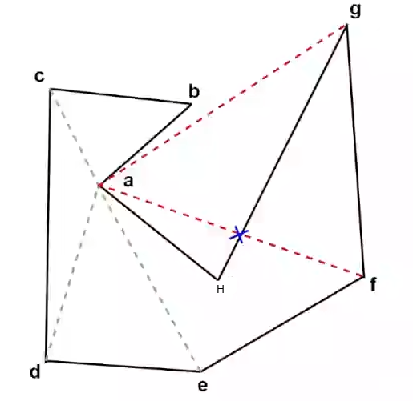

# Recast Navmesh

推荐文章

- 知乎 `Recast Navigation` 源码解析：https://zhuanlan.zhihu.com/p/484520809
- 知乎 `Recast Navigation` 基础：https://zhuanlan.zhihu.com/p/74537236
- `Recast Tutorial`：https://digestingduck.blogspot.com/2010/02/slides-from-past.html
  
重要论文

- Path Planning for a vision-based autonomous robot
- Simplified 3D Movement and Pathingfinding Using Navigation Meshes
- Volumetric cell-and-portal generation
- Crowdws In A Polygon Soup: Next-Gen Path Planning (GDC， 推荐)

[Recast Navigation 项目](https://github.com/recastnavigation/recastnavigation)

[学习教程来源](https://www.bilibili.com/video/BV19G4y187Fz)

## 导论

根据时间顺序，有这么几个重要概念被提出

| 里程碑 | 作者 | 时间 |
| --- | --- | --- |
| Meadow Mapping | Ronald C. Arkin | 1986 |
| Volumetric Cell-and-protal generation | Denis Haumont | 2003 |
| Corwds In A Polygon Soup: Next-Gen Path Planning | David Miles | 2006 |
| Recast Navigation | Mikko Mononen | 2008 |

### Meadow Mapping

Ronald C. Arkin 是一位美国计算机科学家，他在 1987 年发表了一篇论文 **《Path planning for a vision-based autonomous robot》** ，介绍了 `Meadow mapping` 的原理和实现

Meadow mapping 是一种用于生成导航网格的方法，它将自由空间分解成**凸多边形**的集合，然后以每个凸多边形的边缘中点作为寻路节点，使用 A* 算法进行寻路。它还可以根据不同的地形类型（如人行道，草地，砾石等）设置不同的代价函数，优化寻路结果。它是现代 Navmesh 系统的雏形。

[Path planning for a vision-based autonomous robot 论文](https://www.researchgate.net/publication/356666030_Path_Planning_for_Autonomous_Mobile_Robots_A_Review))

[路径导航算法示例](https://github.com/zhm-real/PathPlanning)

`Meadow Mapping` 提出一个概念：把世界**凸多边形化**

为什么是凸多边形？

1. 凸多边形内任意俩点连接不会超出多边形区域
2. 凸多边形边上的点便于做寻路最小单位

**凸多边形内部不需要寻路**

我们只需要将世界划分成多个凸多边形，那么就只需要研究凸多边形之间如何连通即可，凸多边形内部直接一根直线连接即可

于是我们将寻路问题转换为以凸多边形**边缘中心为节点**的图论搜索问题

为什么不用 `Grid` （网格） ？

对于大面积的开放区域来说，格子作为寻路基本单位则数量庞大；但是一个凸多边形可以是一个很大的区域，所以对于寻路来凸多边形的效率更高

所以一个寻路流程大概如下

1. 得到一个 3D 场景
2. 获得可行走区域 `Reachable Space`（以前是手动绘制，现在可以自动绘制）
3. 将可行走区域划分成多个凸多边形 `Convexify the Space`
4. 凸多边形为单位，继续路径查询 `Path Finding`
5. 路径改进，得到更为平滑的路径 

那么会有这么几个问题？

1. 如何自动绘制可行走区域
2. 如何区域划分凸多边形
3. 如何进行路径查询

#### 区域划分凸多边形


如果区域是凸多边形，则直接结束算法

如果区域不是凸多边形，则找到一个凹的角（>180°），尝试将其与多边形内部其他的点连接起来，这个时候会得到两个新的区域，也就是上图的 A 和 B，然后对这两个区域再进行相同的算法，如此一来整个场景就都是凸多边形

> 也就是递归的**二分法**

- 如何判断一个多边形是凸多边形？

检查是否存在大于 180° 的角

规定凸多边形节点顺序按照**逆时针**走

向量 (x-, x) 和向量 (x, x+) 进行**叉乘**，可以判断点 x+ 在向量 (x-, x) 的左边还是右边。**叉乘**的结果如果是正数那么就是在**左边**，反之在**右边**


以上图为例，点 x+ 在向量 (x-, x) 的**右边**，那么这个点的角度大于 180°


以上图为例，点 x+ 在向量 (x-, x) 的**左边**，那么这个点的角度小于180°

通过上面的发现，我们只需要遍历凸多边形所有的点，即可判断每个点的角度是否大于180°，以此判断该多边形是否是凸多边形

- 如何将大于 180° 角的点连接到多边形其他**可见**顶点上？

**检查所有多边形节点与之连线是否为对角线**

- 对角线的要求
  - 条件1：不与多边形的边相交
  - 条件2：在多边形内部



> 上图中 af 与 gh 相交，不符合条件1
> 上图中 ag 不在多边形内部，不符合条件2

以凹点 a 为例，对 a 点来说 g、f 两点就是不可见的，因为 ag 连线完全在多边形外，af 连线与 gh 连线相交

> 这里推荐一本书 《Computational Geometry in C》 

如何判断 af 和 gh 线段相交？

高中数学提供的解决方案就是点斜式求斜率，然后进行计算。但是在计算机中，直接根据 `k = (y2 - y1) / (x2 - x1)` 算出来使用 `double` 存储可能存在精度问题，或者除 0 错误

这里依然使用叉乘的思想


如果 a、b 两点在 dc 线段的两端，并且 d、c 两点在 ab 线段的两端，那么线段 ab 和 dc 相交

```cpp
bool isCross(Vector2D a, Vector2D b, Vector2D c, Vector2D d) {
    // c、d 两点在线段 ab 的两端
    bool cd_cross = isLeft(a, b, c) ^ isLeft(a, b, d);
    // a、b 两点在线段 cd 的两端
    bool ab_cross = isLeft(c, d, a) ^ isLeft(c, d, b);
    return cd_cross && ab_cross;
}
```

上述代码使用异或来判断是否满足两点在线段两端的判断，如果两点都在右边或者都在左边，那么**异或**的结果就是 `false`，如果两点一个在左边一个在右边则**异或**的结果是 `true`


但是上述解法无法处理共线问题，比如上图所示，点 c 在线段 ab 上，所以需要**额外判断共线问题**

所以判断线段是否相交的大概算法如下

```cpp
bool isCross(Vector2D a, Vector2D b, Vector2D c, Vector2D d) {
    if (c 与 ab 共线) {
        return c 是否在线段 ab 上;
    }
    if (d 与 ab 共线) {
        return d 是否在线段 ab 上;
    }
    if (a 与 cd 共线) {
        return a 是否在线段 cd 上;
    }
    if (b 与 cd 共线) {
        return b 是否在线段 cd 上;
    }
    // c、d 两点在线段 ab 的两端
    bool cd_cross = isLeft(a, b, c) ^ isLeft(a, b, d);
    // a、b 两点在线段 cd 的两端
    bool ab_cross = isLeft(c, d, a) ^ isLeft(c, d, b);
    return cd_cross && ab_cross;
}
```

> 判断 c 是否与 ab 共线，可以通过 c 到直线 ab 的距离来判断，小于一个极小值就算共线  

> 判断 c 是否在线段 ab 上则直接通过坐标计算即可

通过上面判断线段相交可以处理处理线段 af 与 gh 的情况，那么如何处理 ag 线段在多**边形外**的情况呢？

我们先定义什么是**锥形**


以上图为例，直线 (x, x-) 和 直线 (x, x+) 就可以构成一个**锥形**

我们先分类讨论，如果是凸点(小于 180° 角的点)，那么对角线在锥形范围内；如果是凹点(大于 180° 角的点)，那么对角线在锥形范围外

所以算法的重点在如何判断**直线在锥形范围内**

其实也很简单，如果点在锥形范围内，那么该点在 (x-, x) 线段左边，并且在 (x, x+) 线段左边

综合以上几种算法，我们可以检测对**角线是否与非临边相交**和**对角线是否在锥形内部**

如果多边形内部存在 hole （洞），解决方法其实也很简单，将内部洞与外围点连接，将带空洞的多边形变为简单多边形，当然这个内部洞与外围的连接点也必须是互相**可见**的


上图连接的一根线，将带空洞的多边形变成了下图这种简单多边形，下图稍微夸张了一点分割部分，主要是为了强调这根线的作用


在 `Recast Navigation` 中，划分凸多边形使用的是耳切法(`Ear Clipping`)，`Meadow Mapping` 划分凸多边形则使用的是二分法。耳切法使用更加聪明的方式，使得每个切出来的区域都是单独的三角形，避免 `Meadow Mapping` 递归调用的额外开销

`Recast Navigation` 是一种基于耳切法的划分算法，它的基本思想是从一个凸多边形的任意一个顶点开始，判断该顶点是否是一个耳朵，即该顶点的内角小于 180°，并且以该顶点为顶点的三角形不包含其他顶点。如果是耳朵，那么就将该顶点和相邻的两个顶点组成一个三角形，从多边形中切除该耳朵，否则就跳过该顶点，继续检查下一个顶点。重复上述过程，直到多边形被切割成若干个三角形为止。然后对每个三角形进行合并，使其满足最大顶点数的限制，得到最终的凸多边形集合。这种算法的优点是划分后的多边形的角度较大，有利于寻路效率，缺点是划分后的多边形数量较多，占用空间较大

