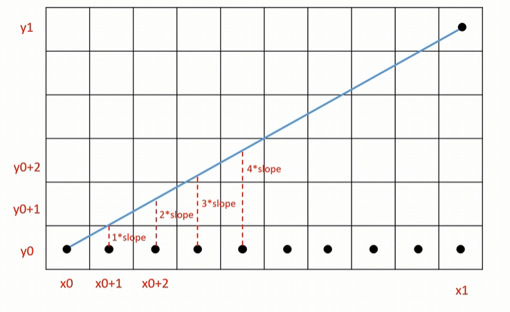

# OpenGL

## 光栅化理论及实现

### 创建窗口

`visual studio` 创建 **Windows 桌面应用程序**

```cpp
// 全局变量:
HINSTANCE hInst;                                // 当前实例
WCHAR szTitle[MAX_LOADSTRING];                  // 标题栏文本
WCHAR szWindowClass[MAX_LOADSTRING];            // 主窗口类名

// 此代码模块中包含的函数的前向声明:
ATOM                MyRegisterClass(HINSTANCE hInstance);
BOOL                InitInstance(HINSTANCE, int);
LRESULT CALLBACK    WndProc(HWND, UINT, WPARAM, LPARAM);
INT_PTR CALLBACK    About(HWND, UINT, WPARAM, LPARAM);
```

| 函数名 | 作用 |
| --- | --- |
| MyRegisterClass | 这个函数用于注册窗口类。窗口类必须在创建窗口之前注册。这个函数通常会设置窗口的样式、图标、光标以及窗口过程等 |
| InitInstance | 这个函数用于创建和显示窗口。它通常接受一个应用程序实例句柄和一个命令显示标志（如 SW_SHOW），并返回一个布尔值，指示窗口是否成功创建 |
| WndProc | 这是窗口过程函数，是一个消息处理函数，用于响应发送到窗口的各种消息，如按键、鼠标事件、绘制请求等 |
| About | 这通常是一个对话框过程，用于处理“关于”对话框的消息。这个函数类似于窗口过程，但专门用于对话框 |

为了提供一个结构化和模块化的方式来管理 Windows 应用程序的不同部分。通过将全局变量和函数声明放在一个地方，可以更容易地在整个程序中访问和管理它们。此外，前向声明允许在实际定义函数之前引用它们，这有助于解决头文件和源文件之间的依赖关系问题

```cpp
int APIENTRY wWinMain(_In_ HINSTANCE hInstance,
                     _In_opt_ HINSTANCE hPrevInstance,
                     _In_ LPWSTR    lpCmdLine,
                     _In_ int       nCmdShow)
{
    UNREFERENCED_PARAMETER(hPrevInstance);
    UNREFERENCED_PARAMETER(lpCmdLine);

    // TODO: 在此处放置代码。

    // 初始化全局字符串
    LoadStringW(hInstance, IDS_APP_TITLE, szTitle, MAX_LOADSTRING);
    LoadStringW(hInstance, IDC_WINDOWSPROJECTTEST, szWindowClass, MAX_LOADSTRING);
    MyRegisterClass(hInstance);

    // 执行应用程序初始化:
    if (!InitInstance (hInstance, nCmdShow))
    {
        return FALSE;
    }

    HACCEL hAccelTable = LoadAccelerators(hInstance, MAKEINTRESOURCE(IDC_WINDOWSPROJECTTEST));

    MSG msg;

    // 主消息循环:
    while (GetMessage(&msg, nullptr, 0, 0))
    {
        if (!TranslateAccelerator(msg.hwnd, hAccelTable, &msg))
        {
            TranslateMessage(&msg);
            DispatchMessage(&msg);
        }
    }

    return (int) msg.wParam;
}
```

这就是 **Windows窗体程序** 的入口函数

- `_In_ HINSTANCE hInstance`：当前实例的句柄
- `_In_opt_ HINSTANCE hPrevInstance`：以前实例的句柄，现在总是为 NULL
- `_In_ LPWSTR lpCmdLine`：命令行参数的字符串
- `_In_ int nCmdShow`：控制窗口如何显示的标志

```cpp
UNREFERENCED_PARAMETER(hPrevInstance);
UNREFERENCED_PARAMETER(lpCmdLine);
```

这两行代码是宏，用于避免编译器警告，因为 `hPrevInstance` 和 `lpCmdLine` 参数未被使用

```cpp
LoadStringW(hInstance, IDS_APP_TITLE, szTitle, MAX_LOADSTRING);
LoadStringW(hInstance, IDC_WINDOWSPROJECTTEST, szWindowClass, MAX_LOADSTRING);
```

这两行代码使用 `LoadStringW` 函数从资源文件加载字符串到 `szTitle` 和 `szWindowClass` 变量中

`LoadStringW` 函数用于从与指定模块关联的可执行文件中加载字符串资源。这里的 `hInstance` 句柄是必需的，因为它指定了包含所需字符串资源的模块的实例。在 `Windows` 编程中，每个运行的程序或动态链接库（DLL）都有一个 `HINSTANCE`，这是一个唯一的标识符，用于区分不同的程序和资源

在项目中存在一个后缀为 `rc` 的文件，其文件名一般是 `项目名称.rc`，作用是配置表


如上图所示，宏 `IDS_APP_TITLE` 和 `IDC_WINDOWSPROJECTTEST` 的值对应的字符串内容已经配置在表中

```cpp
MyRegisterClass(hInstance);
```

调用 MyRegisterClass 函数来注册窗口类，这是创建窗口所必需的

```cpp
if (!InitInstance (hInstance, nCmdShow))
{
    return FALSE;
}
```

调用 InitInstance 函数来创建和显示窗口。如果窗口创建失败，则函数返回 FALSE

```cpp
while (GetMessage(&msg, nullptr, 0, 0))
```

这是主消息循环。GetMessage 函数从消息队列中检索消息。如果获取到的消息不是退出消息（WM_QUIT），则循环继续

```cpp
if (!TranslateAccelerator(msg.hwnd, hAccelTable, &msg))
{
    TranslateMessage(&msg);
    DispatchMessage(&msg);
}
```

在消息循环中，首先检查是否有加速键消息。如果没有，则使用 TranslateMessage 函数翻译消息（如键盘输入），然后使用 DispatchMessage 函数将消息分发给窗口过程

至于 `WndProc` ，当一个窗口创建后，操作系统会将各种消息发送到这个窗口，如按键、鼠标移动、绘制请求等。每当这些消息发生时，操作系统会调用与窗口关联的 `WndProc` `函数来处理这些消息。WndProc` 函数的参数包括一个窗口句柄（`HWND`），一个消息代码（`UINT`），以及两个消息特定的参数（`WPARAM` 和 `LPARAM`）

在消息循环中，`GetMessage` 或 `PeekMessage` 函数从消息队列中检索消息，并将其传递给 `TranslateMessage` 和 `DispatchMessage` `函数。DispatchMessage` 函数随后会根据消息中包含的窗口句柄找到相应的窗口过程并调用它

例如，如果用户点击了窗口的关闭按钮，操作系统会发送一个 `WM_CLOSE` 消息到消息队列。`GetMessage` 会从队列中获取这个消息，然后 `DispatchMessage` 会调用窗口的 `WndProc` 函数，并将 `WM_CLOSE` 作为消息代码传递进去，由 `WndProc` 函数来决定如何响应这个消息

总的来说，`WndProc` 函数是应用程序与操作系统之间通信的桥梁，它负责处理所有针对窗口的消息和事件

1. 为了方便对窗口进行处理，设置 `HWND hWnd;` 的全局变量
2. 为了方便计算，设置窗体的宽高 `int wWidth = 800;int wHeight = 600;`
3. 为了方便去除按钮对窗体大小的影响，设置类型为 `WS_POPUP`

```cpp
HWND hWnd;                                      // 窗口句柄 经常被用到 所以设置为全局
int wWidth = 800;                               // 窗口宽度
int wHeight = 600;                              // 窗口高度

BOOL InitInstance(HINSTANCE hInstance, int nCmdShow)
{
    // Other
    hWnd = CreateWindowW(szWindowClass, szTitle, WS_POPUP,
      CW_USEDEFAULT, 0, wWidth, wHeight, nullptr, nullptr, hInstance, nullptr);

    // Other
   return TRUE;
}
```

| 窗口样式 | 值 |
| --- | --- |
| WS_BORDER | 窗口有一个薄边框 |
| WS_CAPTION | 窗口有标题栏（包括 WS_BORDER 样式） |
| WS_CHILD | 窗口是一个子窗口。具有此样式的窗口不能有菜单栏，并且不能与 WS_POPUP 样式一起使用 |
| WS_DISABLED | 窗口最初被禁用。禁用的窗口无法接收用户输入 |
| WS_DLGFRAME | 窗口有一个通常用于对话框的边框样式 |
| WS_HSCROLL | 窗口有水平滚动条 |
| WS_VSCROLL | 窗口有垂直滚动条 |
| WS_SYSMENU | 窗口有系统菜单 |
| WS_THICKFRAME | 窗口有一个可调整大小的边框 |
| WS_GROUP | 窗口是一组控件的第一个控件 |
| WS_TABSTOP | 窗口是一个制表位，用户可以使用 TAB 键在控件之间导航 |
| WS_MINIMIZE | 窗口最初被最小化 |
| WS_MAXIMIZE | 窗口最初被最大化 |
| WS_OVERLAPPEDWINDOW | 这是一个窗口样式的组合，它创建一个具有标题栏、大小调整边框、窗口菜单以及最小化和最大化按钮的重叠窗口1。这种样式通常用于应用程序的主窗口 |
| WS_POPUP | 创建一个弹出窗口。弹出窗口是顶级窗口，它们与桌面窗口的子窗口列表相连接。应用程序通常使用弹出窗口来显示对话框。弹出窗口与重叠窗口的主要区别在于，弹出窗口不需要有标题，而重叠窗口必须有标题。当弹出窗口没有标题时，它可以创建没有边框的 |

> 还有很多其他类型

### 设置画布

```cpp
int APIENTRY wWinMain(_In_ HINSTANCE hInstance,
                     _In_opt_ HINSTANCE hPrevInstance,
                     _In_ LPWSTR    lpCmdLine,
                     _In_ int       nCmdShow)
{
    // 注册、初始化、创建窗口
    // .....

    /*===========创建绘图用的位图========*/
    void* buffer = 0;

    hDC = GetDC(hWnd);                      // 获取窗口 hWnd 的设备上下文（DC），用于绘图操作
    hMem = ::CreateCompatibleDC(hDC);       // 创建一个与指定设备上下文（hDC）兼容的内存设备上下文（Memory DC）。这个内存 DC 用于离屏绘制，即在屏幕外部绘制图像

    BITMAPINFO  bmpInfo;                    // 它描述了位图的维度和颜色格式
    bmpInfo.bmiHeader.biSize = sizeof(BITMAPINFOHEADER);
    bmpInfo.bmiHeader.biWidth = wWidth;
    bmpInfo.bmiHeader.biHeight = wHeight;
    bmpInfo.bmiHeader.biPlanes = 1;             // 平面数
    bmpInfo.bmiHeader.biBitCount = 32;          // 每像素位数（32位，即每个像素4字节）
    bmpInfo.bmiHeader.biCompression = BI_RGB;   // 压缩方式，实际上存储方式为bgr
    bmpInfo.bmiHeader.biSizeImage = 0;
    bmpInfo.bmiHeader.biXPelsPerMeter = 0;
    bmpInfo.bmiHeader.biYPelsPerMeter = 0;
    bmpInfo.bmiHeader.biClrUsed = 0;
    bmpInfo.bmiHeader.biClrImportant = 0;

    HBITMAP hBmp = CreateDIBSection(hDC, &bmpInfo, DIB_RGB_COLORS, (void**)&buffer, 0, 0); //在这里创建buffer的内存，创建一个设备无关位图，并将其与一个内存块关联。这个内存块由 buffer 指向，用于存储位图的像素数据
    SelectObject(hMem, hBmp);   // 将新创建的位图（hBmp）选入之前创建的内存设备上下文（hMem）中，这样在 hMem 上的绘图操作将影响到这个位图

    memset(buffer, 0, wWidth * wHeight * 4); //清空buffer为0

    MSG msg;

    // 主消息循环:
    while (true)
    {
        if (PeekMessage(&msg, NULL, 0, 0, PM_REMOVE))
        {
            TranslateMessage(&msg);
            DispatchMessage(&msg);
        }

        BitBlt(hDC, 0, 0, wWidth, wHeight, hMem, 0, 0, SRCCOPY);
    }

    return (int) msg.wParam;
}
```

这段代码创建了一个可以用于离屏绘制的位图，并准备了相应的内存设备上下文和像素数据缓冲区。这样，您可以在位图上进行绘图操作，然后将其绘制到窗口上，或者进行其他图像处理操作

| 变量名 | 作用 |
| --- | --- |
| hDC（Device Context Handle） |  hDC 是一个设备上下文句柄，它代表了一个绘图表面的整个状态。您可以在这个设备上下文上进行绘图操作，如画线、画形状、输出文本等。在这个例子中，hDC 是通过 GetDC 函数从一个窗口获取的，因此它代表了窗口的客户区的绘图表面 |
| hMem（Memory Device Context Handle） | hMem 是一个内存设备上下文句柄，它是一个与 hDC 兼容的内存中的绘图表面。您可以在这个内存设备上下文上进行绘图操作，而不会影响实际的屏幕。这种技术通常用于复杂的绘图操作，因为它可以减少屏幕闪烁并提高绘图效率 |
| hBmp（Bitmap Handle） | hBmp 是一个位图句柄，它代表了一个设备无关位图（DIB）。这个位图是通过 CreateDIBSection 函数创建的，它可以直接访问像素数据，并且可以被选入一个设备上下文中进行绘图。
buffer（Pointer to the Bitmap’s Pixel Data） |  buffer 是一个指针，它指向 CreateDIBSection 函数创建的位图的像素数据。这个数据区域可以被直接访问和修改，以改变位图的内容 |

- `hDC` 用于获取窗口的设备上下文，它是绘图操作的起点
- `hMem` 是从 hDC 创建的，用于在内存中进行绘图操作，这样的操作不会立即反映在用户的屏幕上
- `hBmp` 是一个位图，它被创建并与 `hMem` 关联，这样在 `hMem` 上的所有绘图操作都会影响到这个位图
- `buffer` 是 `hBmp` 的像素数据的直接访问点，通过修改 `buffer`，可以改变位图的内容

总结一下就是，`hDC` 是屏幕的绘图表面，`hMem` 是内存中的绘图表面，`hBmp` 是内存中的位图，`buffer` 是位图的像素数据。在 `hMem` 和 `buffer` 上的修改最终会通过 `hDC` 显示在屏幕上

当完成了所有的绘图操作后，通常会使用 `BitBlt` 或 `StretchBlt` 等函数将 `hMem` 中的位图内容传输到 `hDC`，从而将图像显示在屏幕上。这个过程称为 **双缓冲**（`double buffering`）

如果直接修改 `hDC`，会导致图形界面更新，用户可能会看到部分重绘过程，导致闪烁。因此使用双缓冲，`hDC` 只用于给显示器读取数据用于显示，`hMem` 用于计算，再计算完毕之后一次性写入到 `hDC` 中

`BITMAPINFO` 是产生位图所需的信息，主要包含两个部分

1. `BITMAPINFOHEADER`：这是一个结构体，包含了位图的基本信息，如位图的大小、宽度、高度、颜色平面数、每像素位数、压缩类型、图像大小等
2. `bmiColors`：这是一个颜色表，可以是 `RGBQUAD` 数组，也可以是指定颜色表中颜色的索引。颜色表的具体内容取决于 `BITMAPINFOHEADER` 中的 `biBitCount` 和 `biClrUsed` 成员的值

**位图**，也称为栅格图像或点阵图像，是由像素（图片元素）的单个点组成的图像。每个像素都有自己的颜色信息，位图通常用于存储数字照片和其他类型的图像。位图的特点是可以精确地控制每个像素，但缺点是放大后会出现像素化，且文件大小通常比矢量图像

### 点的绘制

```cpp
class Canvas
{
private:
    int m_Width{ -1 };
    int m_Height{ -1 };
    RGBA* m_Buffer{ nullptr };


public: 
    Canvas(int _width, int _height, void* _buffer) {
        if (_width <= 0 || _height <= 0) {
            m_Width = -1;
            m_Height = -1;
        }
        m_Width = _width;
        m_Height = _height;
        m_Buffer = (RGBA*)_buffer;
    }

    ~Canvas() {

    }

    // 画点操作
    void drawPoint(int x, int y, RGBA _collor) {
        if (x < 0 || x >= m_Width || y < 0 || y >= m_Height) {
            return;
        }

        m_Buffer[y * m_Height + x] = _collor;
    }

    // 清理操作
    void clear() {
        if (m_Buffer != nullptr) {
            memset(m_Buffer, 0, sizeof(RGBA) * m_Width * m_Height);
        }
    }
};
```

封装 Canvas 类，用于绘制点以及对外提供接口

在 `wWinMain` 中创建并初始化全局 `Canvas` 对象

```cpp
GT::Canvas* _canvas = nullptr;

int APIENTRY wWinMain(_In_ HINSTANCE hInstance,
                     _In_opt_ HINSTANCE hPrevInstance,
                     _In_ LPWSTR    lpCmdLine,
                     _In_ int       nCmdShow)
{

	/*===========创建绘图用的位图========*/

	_canvas = new GT::Canvas(wWidth, wHeight, buffer);omFile("res/bk.jpg");

    MSG msg;

    // 主消息循环:
    while (GetMessage(&msg, nullptr, 0, 0))
    {
        if (!TranslateAccelerator(msg.hwnd, hAccelTable, &msg))
        {
            TranslateMessage(&msg);
            DispatchMessage(&msg);
        }

        Render();
    }
}
```

随后在 `Render` 的时候设置绘制点的信息

```cpp
void Render() {
    _canvas->clear();

    for (int x = 0; x < wWidth; ++x) {
        _canvas->drawPoint(x, 200, GT::RGBA(255, 0, 0, 0));
    }

	// 将 hMem 的数据一次写入到 hDC 中
	BitBlt(hDC, 0, 0, wWidth, wHeight, hMem, 0, 0, SRCCOPY);
}
```

上述代码在高度为 100 的地方绘制了一条横着的红线

因为 `Canvas` 是直接对 `buffer` 进行操作，`buffer` 关联着 `hMem`， `hMem` 又同步给 `hDC` ，所以 `Canvas` 直接对 `buffer` 进行操作就可以改变显示的内容

### 直线绘制算法： Brensenham 算法

已知点 $P_1$ 和 点 $P_2$，推到直线算法，并且不能出现浮点数


目前讨论和推导的是 `0 < k < 1` 这部分，并且 `x0 < x1`，其他部分可以通过稍作修改达到同样的效果

| 直线 | 填充 |
| --- | --- |
|  |  |

如上图所示，每个网格就表示一个像素，黑点就是像素的中心点

就一般计算公式 $y = kx + b$ 来说，一般 $y_i = y_0 + k * i$，然后通过四舍五入来得到像素的纵坐标

以 $x_{0+1}$ 为例：

- 当 $1*slope < 0.5$ 时就执行四舍，也就是 $y_{0+1} = y_{0}$
- 当 $1*slope >= 0.5$ 时就执行五入，也就是 $y_{0+1} = y_{0} + 1$

> `slope` 也就是斜率 `k`

注意：由于之前限制过斜率 0 < k < 1，所以相邻横坐标对应的纵坐标最多加一

> 绝对不可能出现 $y_{0+1} = y_0 + 2$ 的情况

所以我们实际上要做的就是判断 $1*slope < 0.5$ 是否成立

由于 $k = dy/dx$ 带入到上面的不等式

- $dy/dx < 0.5$ 
- $2*dy < dx$
- $2dy - dx < 0$

通过上面公式推算，成功将算式中的浮点数变为整数计算

再以 $x_{0+2}$ 为例

| 状况1 | 状况2 |
| --- | --- |
|  |  |

如果前一个 $x_{0+1}$ 的计算结果是 $1*slope >= 0.5$ ，那么对于 $x_{0+2}$ 来说

- 当 $2*slope < 1.5$ 时就执行四舍，也就是 $y_{0+2} = y_{0+1}$
- 当 $2*slope >= 1.5$ 时就执行五入，也就是 $y_{0+2} = y_{0+1} + 1$

所以对于 $y_{0+1}$ 来说是判断 $2*slope < 1.5$ 是否成立

- $2*dy/dx < 1.5$
- $dy/dx < 3/4$
- $4dy - 3dx < 0$
- $(2dy - dx) + 2dy - 2dx  < 0$
- $(2dy - dx) + 2(dy - dx)  < 0$

> 1.5 是因为一格像素高度为1

需要注意， $2dy - dx$ 是 $x_{0+1}$ 时计算出来的，也就是说当前一个像素点计算属于 $2dy -dx >= 0$ 时，下一个的计算公式是 $(2dy - dx) + 2dy - 2dx < 0$

如果前一个 $x_{0+1}$ 的计算结果是 $1*slope < 0.5$ ，那么对于 $x_{0+2}$ 来说

- 当 $2*slope < 0.5$ 时就执行四舍，也就是 $y_{0+2} = y_{0+1}$
- 当 $2*slope >= 0.5$ 时就执行五入，也就是 $y_{0+2} = y_{0+1} + 1$

- $2*dy/dx < 0.5$
- $4*dy - dx < 0$
- $(2dy - dx) + 2dy < 0$

需要注意， $2dy - dx$ 是 $x_{0+1}$ 计算出来的，也就是说当前一个像素点计算属于 $2dy -dx < 0$ 时，下一个的计算公式是 $(2dy - dx) + 2dy < 0$

也就是说 $y_i$ 下一格 $y_{i+1}$ 的值是 $y_{i+1} = y_{i}$ 还是 $y_{i+1} = y_{i} + 1$ 可以根据 $y{i}$ 这一格直接推理出来的

- 如果 $y_i$ 是前面所说的**状况一**，也就是 $y_i = y_{i-1} + 1$ ，那么 $y_{i+1}$ 的计算公式就是 $(2dy - dx) + 2(dy - dx)  < 0$
- 如果 $y_i$ 是前面所说的**状况二**，也就是 $y_i = y_{i-1}$ ，那么 $y_{i+1}$ 的计算公式就是 $(2dy - dx) + 2dy < 0$

同样的思路可以一直这样推理下去，直到线段的末尾

> 递推的思想

```cpp
void func(int x0, int y0, int x1, int y1) {
    int dx = x1 - x0, dy = y1 - y0;
    // incrE 就是前一个像素格计算结果是 2dy - dx < 0，先将计算结果缓存下来
    // incrNE 就是前一个像素格计算结果是 2dy - dx >= 0，先将计算结果缓存下来
    int incrE = 2*dy, incrNE = 2*(dy - dx);
    int d = 2*dy - dx;  // 第一次得计算 2dy - dx 是否大于0
    int x = x0, y = y0;

    for(x = x0 + 1; x <= x1; ++x) {
        if(d < 0) {
            d += incrE;
        } else {
            d += incrNE;
            y++;
        }
        // 那么下一格像素坐标就是 (x, y)
    }
}
```


我们前面讨论了 **区域1** 时的计算公式和算法，对于其他状况来说， Y 轴坐标的区域 3、4、5、6 只要简单的交换线段的起点和终点，都能变换 Y 轴右侧的对应区域

| 左侧状态 | 对应 | 右侧状态 | 
| --- | --- | --- |
| 3 | => | 7 |
| 4 | => | 8 |
| 5 | => | 1 |
| 6 | => | 2 |

对于 **区域2** 也就是 `slope > 1` 的区域来说，**交换横纵坐标**即可变换到**区域1**，等价于关于 $y = x$ 直线做对称变换。绘制像素时再交换每个像素的 x、y 即可变换回来

对于 **区域7、8** 也就是 `slope < 0` 的区域来说，**对 x 轴做镜像变换**即可，让 $y = -y$ 就能变换到**区域1、2**，等像素坐标计算完毕之后再变换回来

### 直线上的颜色

封装 `Point` 类，用于存储点的信息，包括 `x、y` 坐标和 `RGBA` 颜色信息

```cpp
struct Point
{
public:
    int m_x;
    int m_y;
    RGBA m_color;
    Point(int _x = 0, int _y = 0, RGBA _color = RGBA(0, 0, 0, 0))
    {
        m_x = _x;
        m_y = _y;
        m_color = _color;
    }
    ~Point()
    {

    }
};
```

简单的直线的颜色计算，只需要根据两端点的颜色信息进行线性插值即可

```cpp
inline RGBA colorLerp(const RGBA& _color1, const RGBA& _color2, float _scale) {
    RGBA result;

    result.m_r = _color1.m_r + (float)(_color2.m_r - _color1.m_r) * _scale;
    result.m_g = _color1.m_g + (float)(_color2.m_g - _color1.m_g) * _scale;
    result.m_b = _color1.m_b + (float)(_color2.m_b - _color1.m_b) * _scale;
    result.m_a = _color1.m_a + (float)(_color2.m_a - _color1.m_a) * _scale;

    return result;
}
```

然后在绘制直线的时候，只需要根据计算点的进入即可知道点的颜色插值

```cpp
for (int index = 0; index < sumStep; ++ index) {
    auto pointColor = colorLerp(pt1.m_color, pt2.m_color, (float)index / sumStep);
    drawPoint(Point(xNow, yNow, pointColor));

    // 后续 brensenham 算法计算
}
```

### 三角形绘制-扫描线算法


最简单暴力的做法就是一行一行遍历整个屏幕的像素，判断像素是否在点上

基于上面的想法进行优化，找到三角形的**最小包围盒**，然后对包围盒内的像素进行遍历

- 那么如何快速判断点是否在三角形内呢？

算法有很多：射线法、叉积法等

叉积法：按照多边形的点，**逆时针**连线构成边，只要点在**每个边**的左侧就是在多边形内

射线法：以被测点Q为端点，向任意方向作射线（一般水平向右作射线），统计该射线与多边形的交点数。如果为奇数，Q在多边形内；如果为偶数，Q在多边形外。计数的时候会有一些特殊情况


> a情况: 与点相交，相当于与两个线段相交，此时只计算一个
> b情况: 与点和线相交，此时应该忽略点
> c情况：与一条边重合，此时应该忽略边

- 如何将多边形的点按照逆时针排序呢？不能保证输入的点是有序的

这里需要引入**极角**

极角是指一个点相对于原点的线段与某个参考方向（通常是水平轴）之间的夹角。
在多边形的排序算法中，我们以多边形的重心作为原点，并将重心到多边形顶点的线段与水平轴之间的夹角作为极角。
将多边形的点按照极角从小到大进行排序后，可以得到一个有序的点集，其中顶点的连接顺序就是逆时针的。

不过这里是绘制三角形，所以不用考虑有序的问题，无论输入顺序如何都是**顺时针**或者**逆时针**

射线法在顺时针或逆时针都可以使用，所以这里最合适

> 一般算法都要求点的输入顺序必须是顺时针或者逆时针，不能是无序输入

```cpp
const double eps = 1e-6;
const double PI = acos(-1);
//三态函数，判断两个double在eps精度下的大小关系
int dcmp(double x)
{
    if(fabs(x)<eps) return 0;
    else
        return x<0?-1:1;
}
//判断点Q是否在P1和P2的线段上
bool OnSegment(Point P1,Point P2,Point Q)
{
    // 这个函数用于判断点 Q 是否在线段 P1P2 上。它先计算向量 (P1-Q)^(P2-Q) 的叉积是否为 0（判断点 Q 是否在直线 P1P2 上），然后再判断点 Q 是否在线段 P1P2 的范围内（计算 (P1-Q)*(P2-Q) 的点积是否小于等于 0）。如果满足这两个条件，则点 Q 在线段 P1P2 上
    return dcmp((P1-Q)^(P2-Q))==0&&dcmp((P1-Q)*(P2-Q))<=0;
}
//判断点P在多边形内-射线法
bool InPolygon(Point P)
{
    bool flag = false; //相当于计数
    Point P1,P2; //多边形一条边的两个顶点
    for(int i=1,j=n;i<=n;j=i++)
    {
        //polygon[]是给出多边形的顶点
        P1 = polygon[i];
        P2 = polygon[j];
        if(OnSegment(P1,P2,P)) return true; //点在多边形一条边上
        // (dcmp(P1.y-P.y)>0 != dcmp(P2.y-P.y)>0)，它判断点 P 的纵坐标是否在线段 P1P2 的纵坐标范围内
        // (P.y-P1.y)*(P1.x-P2.x)/(P1.y-P2.y) 得到交点的横坐标，再与点 P 的横坐标 P.x 进行比较，判断交点是否在点 P 的左侧
        if( (dcmp(P1.y-P.y)>0 != dcmp(P2.y-P.y)>0) && dcmp(P.x - (P.y-P1.y)*(P1.x-P2.x)/(P1.y-P2.y)-P1.x)<0)
            flag = !flag;
    }
    return flag;
}
```

> 上面的算法是从其他地方复制的，贴上了自己对算法的解释

向量叉乘（或向量积、叉积）的结果是一个向量，其方向垂直于原来两个向量所在的平面，而其大小则与两个原向量构成的平行四边形的面积成正比。在二维空间中，叉乘的结果可以被视作一个标量（即三维空间中的向量的垂直分量），并且该标量代表了向量构成的平行四边形的有向面积

当两个二维向量 A 和 B 的叉乘结果为 0，这意味着两个向量的叉乘所形成的平行四边形面积为 0。具体来说，有以下几种情况：

- **并行或共线**（Collinear）：向量 A 和 B 指向完全相同或相反的方向，即一个向量可以通过乘以一个标量来表达另一个向量。例如，如果 A = 2B 或 A = -B。
- **零向量**：如果其中一个或两个向量是零向量（即其大小为0），那么它们的叉乘结果也将为0

### 三角形效率绘制-平底平顶三角形绘制


### 三角形效率绘制-绘制任意三角形


### 三角形效率绘制-优化及剪裁提速


## 图形处理及纹理系统


## 图形学状态机接口封装


