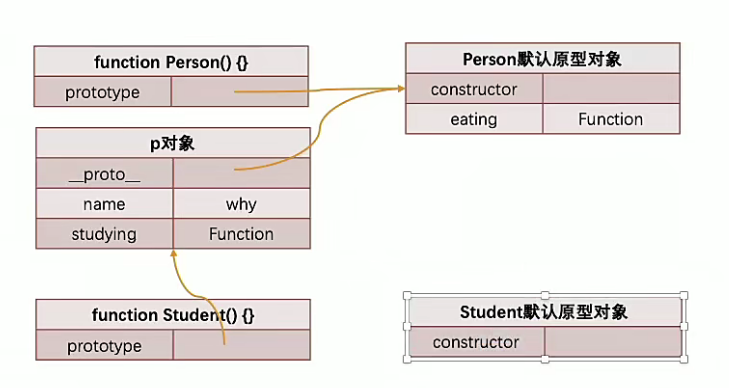

<!--
 * @Version: 
 * @Autor: LC
 * @Date: 2022-01-20 10:45:55
 * @LastEditors: LC
 * @LastEditTime: 2022-01-26 18:28:07
 * @Description: file content
-->
# JavaScipt语法

[JS教程](https://wangdoc.com/javascript/index.html)
[JS参考](http://javascript.ruanyifeng.com/)

迷惑的知识点：
1. 作用域
    - 作用域的理解
    - 作用域提升
    - 块级作用域
    - 作用域链
    - AO、GO、VO等概念

2. 函数、闭包  
    - 闭包的访问规则
    - 闭包的内存泄露
    - 函数中的this的指向

3. 面向对象
    - Javascript面向对象
    - 继承
    - 原型
    - 原型链等

4. ES的新特性
    - ES6、7、8、9、10、11、12

5. 其他知识
    - 事件循环
    - 微任务
    - 宏任务
    - 内存管理
    - Promise
    - await
    - async
    - 防抖
    - 节流等等

## 浏览器的工作原理和V8引擎


> 从图中可知 js、css文件并不是跟index.html文件一起下载下来的，而是需要时才会下载

**浏览器内核**来解析下载下来的文件

| 内存    | 使用                                                                 |
| ------- | -------------------------------------------------------------------- |
| Gecko   | 早期被Netscape和Mozilla Firefox浏览器使用                            |
| Trident | 微软开发，被IE4~IE11浏览器使用，但Edge转向使用Blink                  |
| Webkit  | 苹果给予KHTML开发、开源的，用于Sfari，Google Chrome之前也在用        |
| Blink   | Webkit的一个分支，Google开发，目前应用于Google Chrome、Edge、Opera等 |
| 。。。  | 。。。                                                               |

**浏览器内核**常指浏览器的**排版引擎**  

> 排版引擎（layout engine），也成为浏览器引擎（browser engine）、页面渲染引擎（rendering engine）或样板引擎


- 浏览器工作流程
  1. 通过`HTML Parser`把HTML文件解析成`DOM Tree`
  2. HTML解析的时候遇到JavaScript标签时，停止解析HTML转而去加载和执行Javascript代码
  3. Javascript代码可以对`Dom`进行操作从而修改`Domt Tree`，这执行Javascript代码就是**js引擎**
  4. CSS文件通过`CSS Parse`解析成`Style Rules`css规则
  5. 将`Style Rules`和`Dom Tree`结合(`Attachment`)到一起，生成渲染树(`Render Tree`)
  6. 绘制(`Painting`)到界面上显示(`Display`)出来

> JavaScript代码通过**JavaScript引擎**来执行

### 认识JavaScript引擎，V8引擎的原理

| 引擎           | 使用                                                               |
| -------------- | ------------------------------------------------------------------ |
| SpiderMonkey   | 第一款JavaScript引擎，有Brendan Eich开发                           |
| Chakra         | 微软开发，用于IE浏览器                                             |
| JavascriptCore | WebKit中的JavaScript引擎，由Apple公司开发                          |
| V8             | Google开发的强大JavaScript引擎，也帮助Chrome从众多浏览器中脱颖而出 |
| 。。。         | 。。。                                                             |

1. V8引擎是用C++编写的Goole开源高性能JavaScript和WebAssembly引擎，他用于Chrome和Node.js等
2. 它实现`ECMAScript`和`WebAssembly`，并在Windows7或更高版本，MacOS 10.12+和使用x64、IA-32、ARM或MIPS处理器的linux系统上运行
3. V8可以独立运行，也可以嵌入到任何C++应用程序中 


[抽象语法树在线生成网站](https://astexplorer.net/)

> `Parse`解析Javascript源代码（包括词法分析和语法分析）成抽象语法树(AST)  
> AST可以通过V8引擎中的`Ignition`库转换成字节码(bytecode)，不直接转换成机器码是为了根据运行环境做代码优化和环境适配等  

------

V8引擎本身的源码**非常复杂**，大概有超过100w行C++代码，通过了解它的架构，我们可以知道他是如何对Javascript执行的

- `Parse`模块会将Javascriptdiamagnetic转换成AST（抽象语法树），这是因为解释器并不直接认识JavaScript代码
  - 如果函数没有被调用，那么是不会转换成AST的
  - Parse的V8官方文档[https://v8.dev/blog/scanner](https://v8.dev/blog/scanner)

- `Ignition`是一个解释器，会将AST转换成ByteCode字节码
  - 同时会收集`TurboFan`优化所需要的信息（比如函数参数的类型信息，有了类型才能真实运算）
  - 如果函数只调用一次，`Ignition`会执行解释执行`ByteCode`
  - `Ignition`的V8官方文档[https://v8.dev/blog/ignition-interpreter](https://v8.dev/blog/ignition-interpreter)

- `TurboFan`是一个编译器，可以将字节码编译为CPU可以直接执行的机器码
  - 如果一个函数被多次调用，那么就会被标记为**热点函数**，那么会经过**TurboFan转换成优化的机器码，提高代码的执行性能**（直接执行函数机器码，比将字节码转换成机器码再执行更高效）
  - 但是，**机器码实际上也会被还原为ByteCode**，这是因为如果后续执行函数的过程中，**类型发生了变化（因为JS是弱类型语言，传入参数可以为number也可以为string）**，之前优化的机器码并不能正确的处理运算，就会逆向的转换成字节码
  - TurboFan的V8官方文档[https://v8.dev/blog/turbofan-jit](https://v8.dev/blog/turbofan-jit)


1. `Blink`是Chrome内核，在解析到JavaScript时将JS代码通过流(Stream)的方式传到V8引擎
2. 引擎中会将编码进行转换，再转换成`Scanner`（扫描器，做词法分析）
3. `Scanner`将代码转换成许多`Tokens`，再通过`Parse`解析转化成`AST`
    - `Parser`就是直接将`Tokens`转成AST树结构
    - `PreParser`称之为与解析
      - 并不是所有的JavaScript代码在一开始的时候就会被执行，所以一开始对所有JS代码进行解析会影响效率
      - V8引擎实现了**Lazy Parsing(延迟解析)**的方案，他的作用是**将不必要的函数进行预解析**，也就是只解析暂时需要的内容，而对**函数的全量解析**是在**函数被调用**才会进行
      - 比如在函数`Outer()`内部定义了`Inner()`函数，那么`Inner()`函数就会进行预解析

在`Parse`阶段时，V8引擎会自动创建`GlobalObject`对象，比如**Stirng、Date、Number、SetTimeout()、window...**等都是`GlobalObject`的成员属性，所以在JS代码中可以字节调用这些对象  

### 简易编译流程

```javascript
// 测试代码
var name = "why";
console.log(num1);
var num1 = 10;
var num2 = 20;
var result = num1 + num2;

foo(1)

function foo(num){
    var m = 10;
    var n = 20;
    console.log('foo');
}
```

1. 解析代码，v8引擎内部会创建一个`GlobalObject`对象

```javascript
var GlobalObject = {
    String : "类",
    Date : "类型",
    setTimeOut : "函数",
    name : undefined,
    num1 : undefined,
    num2 : undefined,
    result : undefined
    foo : 0xa00
}
```

> String、Date、setTimeOut是`GlobalObject`自带的对象  
> name、num1、num2、result是解析出来的变量并添加到`GlobalObject`中  
> 因为此时只是解析阶段，所以name、num1、num2、result都是**undefined**的  
> foo存储的函数地址

2. 运行代码

- 为了执行代码，v8引擎内部会有一个执行上下文栈（函数调用栈）(Execution Context Stack)  
- 因为上述例子是全局代码，v8提供全局执行上下文(Global Execution Contenxt)  
- 这些上下文中存在一个`VO(variable object)（变量对象）`，其中`VO`分为`GO`和`AO`两种，全局上下文中`VO = GO`，函数执行上下文中`VO = AO`  

- 代码从上下往下依次执行，从`VO`中取出目标对象并为其赋值  


> foo存储函数空间中存在一个父级作用域(parent scope)，可以获得父级作用域中的数据，当foo作用域中的使用的数据在foo作用域中没找到就往父级作用域(parent scope)中查找，如果一直没有最终会找到全局作用域

-----

```javascript
var message = "Hello Global";
function foo(){
    console.log(message);
}
function bar(){
    message = "Hello Bar";
    foo();
}

bar();      // 输出 Hello Global
```

1. 解析代码，v8引擎内部会创建一个`GlobalObject`对象

`foo`的父级作用域(`parent scope`)就是`GlobalObject`
`bar`的父级作用域(`parent scope`)也是`GlobalObject`

2. 执行代码

赋值。。。


------

```ts

function foo(){
    m = 100;
}
console.log(m);

function foo1(){
    var a = b = 10;
    /*
    等价于
    var a = 10;
    b = 10;
    */
}

foo1();
console.log(a);
console.log(b);

```

1. 首先，对于`foo`函数来说，如果没有用`var`或者`let`定义变量，则m会被直接定义到全局变量(GO)中，所以对于`console.log(m)`会输出100而不是报错
2. 对于`foo1`函数来说，`var a = b = 10;`会被理解为`var a = 10; b = 10;`，根据1的解释，b会被定义到全局变量中，而a还在`foo1`的AO中，所以最后`console.log(a)`会报错，而`console.log(b)`会输出10

### 环境变量和记录

每一个执行上下文会关联到一个环境变量(Variable Environment)中，在执行代码中变量和函数的声明会作为环境记录(Environment Record)添加到变量环境中  
对于函数来说，参数也会被作为环境记录添加到变量环境中  
所以对于上面的解释来说，**将不再是VO（变量环境），而是环境记录(VariableEnvironment)**，也就是说不一定是`O(object)`，只要是记录都行(map或者其他可以记录的类型)

## 内存管理

不管什么语言，在代码执行的过程中都需要分配内存，不同的是某些语言需要手动管理内存，某些编程语言可以帮助管理内存  

- 一般而言，内存管理存在如下的生命周期
  1. 分配你申请大小的内存
  2. 使用分配的内存
  3. 不需要使用时，释放内存

- JavaScript会在定义变量时为我们分配内存
  - JS对于基本数据类型内存的分配会在执行时，直接在栈空间进行分配
  - JS对于复杂数据类型内存的分配会在堆内存中开辟空间，并在将这块空间的指针返回值变量引用

因为**内存是有限**的，所以当**内存不再需要的时候**，我们需要**对其进行释放**，以便腾出**更多的内存空间**  
再手动管理内存的语言中，我们需要通过一些方式来释放不再需要的内存，比如free函数：  
    1. 手动管理的方式会**影响编写逻辑的代码的效率**
    2. 对开发者**要求较高**，不小心就会产生**内存泄漏**

1. 引用计数的垃圾回收算法
2. 标记清除的垃圾回收算法（JS使用）
   - 设置一个跟对象(Root Object)，垃圾回收器定期从这个根开始，找所有从根开始有引用到的对象，对于那些没有引用到的对象，就认为是不可用的对象
   - 可以解决引用计数的循环引用问题

JS引用使用标记清除算法，V8引擎为了更好的优化，它在算法的实现细节上也会结合一些其他的算法  

## 闭包的使用

**JS中函数是一等公民**，函数可以作为参数传递、作为返回值

```javascript
function foo(func){
    func();
}

function bar(){
    console.log("aaa");
}

function run(){
    function rush(){
        console.log("bbb");
    }
    return rush;
}

foo(bar);       
var fn = run();
fn();
```

**高阶函数**：一个函数如果接受另外一个函数作为参数，或者该会将另外一个函数作为返回值，就被称为**高阶函数**

> 比如上述 `run()` 就是高阶函数  
> 当函数属于某个对象时，称该函数为对象的方法  

- **闭包**：**词法闭包**或**函数闭包**
   - 是在支持**头等函数**的编程语言中，实现词法绑定的一种技术
   - 闭包在实现上是一个结构体，它存储了一个函数和一个关联的环境（相当于一个符号查找表）
   - 闭包跟函数最大的区别在于，当捕捉闭包的时候，它的**自由变量**会在捕捉时被确定，这样即使脱离了捕捉时的上下文，它也能照常运行

- **闭包**解释2
  - 一个函数和对其周围状态（词法环境）的引用捆绑在一起（或者说函数被引用包围），这样的组合就是**闭包**
  - 闭包能让你可以在一个内层函数中访问到其外层函数的作用域
  - 在JS中，每当创建一个函数，闭包就会在函数创建的同时被创建出来

 ```javascript
function run(){
    var name = "run";
    function rush(){
        console.log(name);
    }
    return rush;
}

var fn = run();
fn();
```


## JS函数式编程（编程范式、规范方式）

函数第一公民 可以作为形式参数和返回值


### apply、call、bind


### JS纯函数(pure funtion)

- 纯函数的定义
  - 此函数在**同样的输入值时**，需**产生相同的输出**
  - 函数的**输出和输入值与以外的其他隐藏信息或状态无关**，有和**由IO设备产生的外部输出**无关
  - 该函数不**能有语义上可观察的函数副作用**，诸如**触发事件**，**使输出设备输出**，或**更改输出值以外文件的内容**等

> **副作用**：在**执行一个函数**时，除了**返回函数值**以外，对**调函数产生了附加的影响**，比如修**改了全局变量**、**修改参数或者改变外部的存储**  
> 副作用往往是**产生BUG的温床**

```javascript
var names = ["avc", "cba", "eax", "fas"];
// 纯函数，确定输入确定输出，没有副作用（没有修改外部变量等，原来的数组name没有被修改）
var name2 = names.slice(0, 3);   
// 非纯函数，调用之后原来的数组name被改变了    


function foo1(num1, num2){  // 纯函数
    return num1 + num2;
}

var name = "log";
function foo2(num1, num2) { // 非纯函数 修改了外界的值
    name = "log1";
    return num1 + num2;
}
```

- 纯函数的优势
1. 安心的编写和安心的使用
2. 写的时候保证了函数的纯度，只是**单纯实现自己的业务逻辑**即可，不需要关系传入的内容是如何获得的或者**依赖其他的外部变量**是否已经发生了修改
3. 在用的时候，你确定的输入内容不会被任意篡改，并且自己**确定的输入**，一定会有**确定的输出**


### 柯里化

- 维基百科的解释
  - 卡瑞化或加里化
  - 把接受**多个参数的函数**，变成**接受一个单一参数**（最初函数的第一个参数）的函数，并且**返回接受余下的参数**，而且**返回结果的新函数**的技术
  - 柯里化生成**如果你固定某些参数，你将得到接受余下参数的一个函数**
  - 只**传递给函数一部分参数来调用它，让它返回一个函数去处理剩余的参数**

```javascript
function foo(m, n, x, y){
    return m + n * 2 + x * 3 + y * y;
}
foo(1, 2, 3, 4);

function bar(m){
    
    return function(n){
        n = n * 2;
        return function(x){
            x = x * 3;
            return function(y){
                y = y * y;
                return m + n + x + y;
            }
        }
    }
}

bar(1)(2)(3)(4);

// 简易柯里化写法
var bar2 = m => n => x => y => m + n * 2 + x * 3 + y * y;
var bar2 = m => n => x => y => {
    return m + n * 2 + x * 3 + y * y;
}
```

> 从 `function foo()` 变 `function bar()`的过程 称为柯里化  

- 柯里化的作用
  - 让函数职责单一
    - 在函数式编程中，我们往往希望**一个函数处理的问题尽可能的单一**，而不是将一大堆的处理过程交给一个函数来处理
    - 我们是否就可以将每次传入的参数在单一的函数中进行处理，处理完后在下一个函数中再使用处理后的结果
  - 让代码可以复用


```javascript
// 柯里化的代码复用

function MakeAddr(num){
    return function Addr(count){
        return count + num;
    }
}

var addr = MakeAddr(5);
addr(1);    // 5 + 1
addr(2);    // 5 + 2
addr(3);    // 5 + 3

// 普通写法

function Add(m , n){
    return m + n;
}
Add(5, 1);  // 5 + 1
Add(5, 2);  // 5 + 2
Add(5, 3);  // 5 + 3
```

> 如果需要频繁对一个数进行加减处理，使用柯里化的代码比普通写法的字母数更少（不用每次都写"5,"）

```javascript
// 函数的形参个数
function adddd(x, y, z){

}
console.log(adddd.length);  // 输出3，即表示该函数有三个形参

// 自动柯里化函数
function hyCurring(fn){
    function curried(...args){
        if(args.length >= fn.length){
            return fn.apply(this, args);
            // return fn.call(this, ...args);
            // return fn(...args);
        }
        else {
            function curried2(...args){
                return curried.apply(this, args.concat(args2));
            }
        }
    }
    return curried;
}

```

### 组合函数

- **组合函数**是在JS开发过程中一种对**函数的使用技巧**、**模式**
  - 比如需要对一个数据进行函数的调用，**执行两个函数fn1和fn2**,这两个函数是依次执行的，那么每次都需要进行两个函数的调用，**操作上就会显得重复**
  - 那么可以将两个函数组合起来，**自动依次调用**
  - 这个**对函数的组合过程**称之为**组合函数**

```javascript
function double(num){
    return num * 2;
}

function square(num){
    return num ** 2;
}

var count = 10;
var result = square(double(count));
var count1 = 10;
var result1 = square(double(count));
var count2 = 10;
var result2 = square(double(count));

function composeFn(m, n){
    return function(count){
        n(m(count));
    }
}

var newFn = composeFn(double, square);
count3 = 10;
result3 = newFn(count3);    // 组合了 double和square的函数


function hyCompose(...fns){
    val length = fns.length;
    for(let i = 0; i < length; i++){
        if(typeof fn[i] !== 'function'){
            throw new TypeError("");
        }
    }

    function compose(...args){
        var index = 0;
        var result = length ? fn[index].apply(this, args) : args;
        while(index < length){
            result = fns[index].call(this, result);
        }
    }
    return compose;
}
```

### JS其他函数知识

```javascript
var message = "VO : GO";
var obj = {name : "Y", message = "Obj message"};

function foo() {
    function bar() {
        with(obj){
            console.log(message);
        }
    }
    bar(); 
}

foo();  // 输出 Obj message
```

> `with() {}`语句用于定义对象查找作用域  
> 不建议使用with语句，存在兼容性问题

```javascript
var jsString = 'var message = "hello world"; console.log(message);'
eval(jsString;)
```

> 通过`eval`来将字符串翻译成js语句并执行  
> Google Chrome报错，不推荐在开发中使用`eval`  
>> 可读性差    
>> 运行中可能被篡改  
>> 不能被js引擎优化，因为是`eval`去执行的不经过引擎

## JS的面向对象

面向对象是现实的抽象方式  

对象是JavaScript中一个非常重要的概念，因为对象可以**将多个相关联的数据封装**到一起，更好的**描述一个事物**  

- JavaScript支持多种编程范式，包括**函数式编程**和**面向对象编程**
  - JS对象被设计成一组**属性的无序集合**，像是一个**哈希表**，有**K/V组成**
  - **key是一个标识符名称**，**value可以是任意类型**，也可以是**其他对象或函数类型**
  - 如果值是一个函数，我们称之为对象的方法

-------

### 创建对象

```javascript
// 创建对象 方式1 使用Object类和new关键字来创建对象
var obj2 = new Object();
obj.name = "y";
obj.age = 15;
obj.height = 180;

// 创建对象 方式2 通过 字面量 的方式
var obj = {
    name : "y",
    age : 15,
    height : 180,
    eat : function() {
        console.log("在吃饭");
    }
};
```

> `{}`是字面量，可以立即求值，而`new Object()`本质上是方法（只不过这个方法是内置的）调用，既然是方法调用，就涉及到在proto链中遍历该方法，当找到该方法后，又会生产方法调用必须的堆栈信息，方法调用结束后，还要释放该堆栈

### 操作对象属性

```javascript
var obj = {
    name : "y",
    age : 16
};

console.log(obj.name);      // 获取属性
obj.name = "j";             // 修改属性
delete obj.name;            // 删除属性

for (var key in obj){       // 遍历属性
    console.log(key);
}
```

上述对象的属性都是**直接定义在对象内部**，或者**直接添加到对象内部**的，这样做**不能对这个属性进行一些限制**：比如是否可以delete/被遍历等  

为了对属性进行比较精准的操作控制，我们可以使用**属性描述符**，通过属性描述符**可以精准的添加或修改对象的属性**，属性描述符需要使用`Object.defineProperty`来对属性进行添加或修改  

```javascript
// obj ： 对象、prop ： 属性、descriptor ： 属性描述符
Object.defineProperty(obj, prop, descriptor);
```

`Object.defineProperty()`会直接在一个对象上定义一个新属性，或者修改一个对象的现有属性，并**返回此对象**  

> 该方法会返回被修改的对象，原本的对象也会被修改，所以可以不用接收函数返回值，并且可以发现该函数并非**纯函数**

- 属性描述符
  - 数据属性描述符
  - 存取属性描述符

|            | configurable | enumerable | value  | writable | get    | set    |
| ---------- | ------------ | ---------- | ------ | -------- | ------ | ------ |
| 数据描述符 | 可以         | 可以       | 可以   | 可以     | 不可以 | 不可以 |
| 存取描述符 | 可以         | 可以       | 不可以 | 不可以   | 可以   | 可以   |

- `configurable` 属性是否可以通过delete删除属性，是否可以修改其特性或者修改为存取描述符
  - 直接在一个对象上定义某个属性时，默认为true
  - 通过属性描述符定义也给属性时，默认为false

- `enumerable` 属性是否可以通过for-in或者Object.keys()返回该属性
  - 直接在一个对象上定义某个属性时，`enumerable`为true
  - 通过属性描述符定义属性时，`enumerable`为false

- `writable` 是否可以修改属性的值
  - 直接在一个对象上定义某个属性时，`writable`为true
  - 通过属性描述符定义一个属性时，`writable`为false
- `value` 的具体值，读取属性时返回该值，修改属性时修改该值
  - 默认情况下`value`是`undefined`的
- get/get，为获得和设置使用的函数


- 存取属性描述符：只能设置`configurable`,`enumerable`,`get`,`set`
- 数据属性描述符，只能设置`configurable`,`enumerable`,`writable`,`value`

> 个人理解：  
> 对于不需要进行额外处理的数据可以使用**数据属性描述符**，比如`PI = 3.1415926`  
> 对于需要额外处理的数据，比如年龄只能是10~20就需要使用**存取属性描述符**  

```javascript
var obj = {
    name : "y",
    age : 16
};

// obj对象不存在height属性，则先添加height属性，再设置其属性描述
Object.defineProperty(obj, 'height', {
    value : 180
});  

console.log(obj);

```

> 这里obj并不会输出height属性，因为`height`是通过属性描述符添加的所以`enumerable`默认为false

```javascript
// configurable展示
// obj就是前面的obj
Object.defineProperty(obj, 'height', {
    value : 180,
    configurable : false,
});  
delete obj.name
console.log(obj.name);    // undefined

delete obj.height
console.log(obj.height);    // 180 没有被删除

Object.defineProperty(obj, 'height', {
    value : 200,
    configurable : true,
});  
console.log(obj.height);    // 180 没有被修改成200，因为configurable最开始是false
```

```javascript
// enumerable展示
Object.defineProperty(obj, 'height', {
    value : 180,
    configurable : false,
    enumerable : true
});  
console.log(obj);       // 此时可以正常打印出height属性

```

```javascript
var obj = {
    name : "y",
    age : 16 ,
    _address : "private"    // 个人习惯：前面有个下划线表示私有变量
};

Object.defineProperty(obj, 'address', {
    configurable : true,
    enumerable : true,
    get : function () {
        return this._address;  
    },
    set : function(value){
        this._address = value;
    }
});  
```

> 这里使用`address`属性作为`_address`属性的代理  
> 因为`_address`作为私有变量不希望外界随意读取，所以使用`address`代理的方法

- 定义多个属性描述符

```javascript
var obj = {
    _age : 0,
}
Object.defineProperties(obj, {
    name : {
        configurable : true,
        enumerable : true,
        writable : true,
        value : "y"
    },
    age : {
        configurable : true,
        enumerable : true,
        get : function (){
            return this._age;
        },
        set : function (value) {
            this._age = value;
        }
    }
});
console.log(obj);
```

- 另一种使用get/set的方法

```javascript
var obj = {
    _age : 10,
    set age(value){
        this._age = value;
    },
    get age() {
        return this._age;
    }
}
obj.age = 20;
console.log(obj);
```

- 获得对应属性的属性描述符

```javascript
var obj = {
    _age: 0,
}
console.log(Object.getOwnPropertyDescriptor(obj, "_age"));
```

- 获得对象的所有属性描述符

```javascript
var obj = {
    name: "y",
    age: 16,
    _address: "private"
};
console.log(Object.getOwnPropertyDescriptors(obj));
```

### 对对象的限制

- 禁止对象继续添加新的属性

```javascript
Object.preventExtensions(obj);
```

- 禁止对象配置/删除属性

```javascript
Object.seal(obj);
```

- 让对象属性变成不可修改(writable : false)

```javascript
Object.freeze(obj);
```

### 创建多个对象的方案

如果所有对象都使用前面所说的字面量方式来创建，那么会出现特别多的重复代码  

1. 工厂方法创建对象

```javascript
function createPerson(name, age){
    var person{};
    person.name = name;
    person.age = age;

    return person;
}
var p1 = createPerson("name1", 10);
var p2 = createPerson("name2", 11);
var p3 = createPerson("name3", 12);
```

2. 构造函数：创建对象时会调用的函数

```javascript
function foo(){
    console.log("hello world");    
}

var f = new foo();
var f2 = new foo;   // 如果不需要传递参数，可以不要小括号
console.log(f2);    // 返回了一个foo类型的对象
```

> 当使用`new`关键字之后，`foo`就从普通函数变成了**构造函数**

- 如果一个函数被`new`操作符调用，那么会执行如下操作
  1. 内存中创建一个新的对象(空对象)
  2. 对象内部的`[[prototpe]]`属性会被赋值为该构造函数的`prototype`属性
  3. 构造函数内部的this，会指向创建出来的新对象
  4. 执行函数的内部代码(函数体代码)
  5. 如果构造函数没有返回非空对象，则返回创建出来的新对象

```javascript
function Person(name, age, height){
    this.name = name;
    this.age = age;
    this.height = height;

    this.eating = function (){
        console.log(this.name + "正在吃饭");
    }
}

var p1 = new Person("张三", 18, 180);
var p2 = new Person("李四", 10, 180);

console.log(p1.eating === p2.eating);   // false
```

> 对比方法1的工厂方法，该方法可以明确知道p1这个变量是什么类型  
> p1和p2的函数并不是相同，可见每个函数都开辟了一个内存空间，存在浪费的问题  

### 原型

JavaScript当中每个对象都有一个特殊的内置属性`[[prototype]]`，这个特殊的对象可以指向另一个对象，一般把`[[prototype]]`称为隐式原型（一般看不到、不会改、用不到）  

> prototype是原型的意思，在浏览器中可以使用`obj.__proto__`来查看`[[prototype]]`（部分浏览器支持）


------

- 原型的作用 

```javascript
var obj = {};
obj.__proto__.age = 10;
console.log(obj.age);
```

1. 调用`[[get]]`操作
2. 在当前对象中去查找对应的属性，如果找到就直接使用
3. 如果没有找到，那么会沿着原型链去查找`[[prototype]]`(可以用来实现继承等操作)

------ 

- 函数的原型

函数是一个**对象**，所以也有隐式原型`[[prototype]]`  
函数存在一个显示原型`prototype`  

> `[[prototype]]`和`prototype`不是一个东西，前者是理论名称，后者是实际属性  
> `fun.__proto__`中的`__proto__`并不是标准支持的，而是部分浏览器为了方便程序员debug而增加的  

```javascript
function Person() {

}

// 函数也是一个对象，所以也有隐式原型[[prototype]]
console.log(Person.__proto__);                     // {}
console.log(Person.prototype);                     // {}
console.log(Object.getOwnPropertyDescriptors(Person.prototype));                     // 输出一个constructor属性，指向构造函数本身

var p1 = new Person();
var p2 = new Person();
console.log(p1.__proto__ === Person.prototype);    // true

Person.prototype.name = "y";
console.log(p1.name， " ", p2.name);
```

> 上面有对`new`的调用操作进行解释，其中第二点**对象内部的`[[prototpe]]`属性会被赋值为该构造函数的`prototype`属性**的意思就是将返回对象的`__proto__`赋值等于函数的`prototype`，所以`console.log(p1.__proto__ === foo.prototype)`返回值为true


```javascript
foo.prototype = {
    name : "y",
    age : 19,
}
Object.defineProperty(foo.prototype, "constructor", {
    enumerable : false,
    configurable : true,
    writable : true,
    value : foo
});
```

> 直接修改`prototype`对象，但是`prototype`中必须存在一个`constructor`属性指向本身  

------

- 原型与构造函数结合

```javascript
function Person(name, age){
    this.name = name;
    this.age = age;
}

Person.prototype.eating = function() {
    console.log(this.name + "吃东西");
}

var p1 = new Person("x", 10);
var p2 = new Person("y", 10);
p1.eating();
p2.eating();
```

### 原型链和继承

```javascript
function Person(name, age){
    this.name = name;
    this.age = age;
}

var p1 = new Person("x", 10);
var p2 = new Person("y", 10);
```

上述的Person应该称之为**构造函数**，但是对其他语言来说更像是一个**类**  

- 继承：可以将重复的代码和逻辑抽离到父类中，子类只需要直接继承过来使用即可
- JS通过原型链实现继承

#### 原型链

```javascript
var obj = {
    name : "y"
}

console.log(obj.address);
```

`obj`对象并没有`address`属性，所以回去`obj.__proto__`原型上查找，如果也没有就会在`obj.__proto__.__proto__`上去查找直到找到或者顶层原型为止，这种**类似链表**的查找方式就是**原型链**


> 顶层`__proto__`就是`Object.__proto__`

```javascript
var obj = {};
console.log(obj.__proto__ === Object.prototype);    // true
```


```javascript
function Person(name, age){
    this.name = name;
    this.age = age;
}
Person.prototype.running = function() {
    console.log(this.name + " is running");
}

function Student(sno){
    this.sno = sno;
    this.friends = [];
}
var p = new Person("1", "2");
Student.prototype = p;
Student.prototype.studying = function(){
    console.log(this.name + " is studying");
}

function Teacher(title){
    this.title = title;
}

Teacher.prototype.teaching = function() {
    console.log(this.name + " is teaching");
}

var s1 = new Student(1);
var s2 = new Student(2);
s1.running();
s1.studying();
```



> 上述代码的内存解释  
> 代码中能明显发现问题：s1、s2是两个对象公用同一个Person对象的引用会互相影响

#### 借用构造函数继承

为了解决原型链继承中存在的问题，开发人员提供了一种新的技术：`constructor stealing`(借用构造函数、经典继承、伪造对象)  

- 借用继承的做法非常简单：在子类构造函数的内部调用父类型构造函数
  - 因为函数可以在任意的时刻被调用
  - 因此通过`apply()`或`call()`方法也可以在新创建的对象上执行构造函数


```javascript
function Person(name, age, friends){
    this.name = name;
    this.age = age;
    this.friends = friends;
}

Person.prototype.eating = function() {
    console.log(this.name + " eating");
}

var p = new Person();
function Student(name, age, friends, sno) {
    Person.call(this, name, age, friends);
    this.sno = sno;
}
Student.prototype = p;

var s1 = new Student("y", 10, ["1", "2"], 1);
```

> 本质上是`Student`借用执行`Person`的构造函数的执行过程，本质其实是给`Student`赋值


 
- 借用构造函数的**弊端**
  - 至少会调用两次基类的构造函数(`Person`函数执行了两次)
  - 子类的原型对象上多出了一些属性(从内存图可见Student和Teacher存在部分相同的属性)


#### 原型式继承函数

一种继承方法，不是通过构造函数实现的方法

```javascript
var obj = {
    name : "y",
    age : 16
};

function createObject(protoObj){
    var newObj = {};
    Object.setPrototypeOf(newObj, protoObj);    // 设置newObj的原型为protoObj
    return newObj;
}

// 不适用Object函数库实现设置原型的方法
function createObject2(protoObj){
    function Fn() {}
    Fn.prototype = protoObj;
    var new Obj = new Fn();
    return newObj;
    // newObj.__proto__ = protoObj; // 不可这么写，因为__proto__不是所有js引擎都支持
}

// 创建info对象的原型指向obj对象
var info = {};
console.log(info);
console.log(info.__proto__);

info = Object.create(obj);  // 功能等价于 createObject 和 createObject2
```

> `Object.setPrototypeOf(newObj, protoObj);`设置newObj的原型为protoObj

#### 寄生式继承

**寄生式继承**的思路是结合**原型类继承**和**工厂模式**的一种方式  
即创建一个封装继承过程的函数，该函数在内部以某种方式来增强对象，最后再将这个对象返回  

```javascript
var personObj = {
    running = function() {
        console.log("running");
    }
}

function createStudent(person, name){       // 工厂函数
    var stu = Object.create(person);        // 原型式继承
    stu.name = name;                        
    stu.studying = function() {
        console.log("studying");
    }
}

var stu1 = createStudent(person, "x");
var stu2 = createStudent(person, "y");
```

> 每个对象的`studying()`方法都是新建的  
> `stu1`和`stu2`没有明确的类型(consolo.log一下就知道)  

#### 寄生组合式继承(最终方案)

```javascript
function CreateObject(o){
    function Fn (){}
    Fn.prototype = o;
    return new Fn;
}

function Person(name, age, friends){
    this.name = name;
    this.age = age;
    this.friends = friends;
}

Person.prototype.running = function() {
    console.log(this.name + " running");
}

function Student(name, age, friends, sno, score) {
    Person.call(this, name, age, friends);
    this.sno = sno;
    this.score = score;
}

Student.prototype = CreateObject(Person.prototype);
Student.prototype.studying = function() {
    console.log(this.name + " studying " + this.score);
}

var stu = new Student("x", 10, [], 1, 100);
console.log(stu);   //Person { name: 'x', age: 10, friends: [], sno: 1, score: 100 }
stu.running();      // x running
stu.studying();     // x studying 100
```

> 输出`stu`是`Person`类的，因为输出的是`constructor`的`name`属性，而这里的`constructor`使用的是`Person`的所以最后输出的名字是`Person`  

```javascript
function inheritPrototype(SubType, SuperType){
    SubType.prototype = CreateObject(SuperType.prototype);
    Object.defineProperty(SubType.prototype, 'constructor', {
        enumerable : false,
        configurable : true,
        writable : true,
        value : SubType
    });
}
inheritPrototype(Student, Person);
```

> 手动设置`Student`的`constructor`是`Student`自己就行了

### 原型判断方法补充

```javascript
var obj = {
    name : "w",
    age : 19
};

var info = Object.create(obj, {
    address : {
        value : "BJ",
        enumerable : true
    }
});

console.log(info);
console.log(info.hasOwnProperty('address'));    // true
console.log(info.hasOwnProperty('name'));       // false

console.log("address" in info);                 // true
console.log("name" in info);                    // true

```

> 创建对象时，为新对象添加属性描述符  
> `info.hasOwnProperty('address')`判断属性是否是自己的属性  
> `"name" in info`判断对象是否存在name属性  

------ 

`instanceof`用于检测构造函数的`prototype`是否出现在某个实例对象的原型链上  

```javascript
function CreateObject(o){
    function Fn (){}
    Fn.prototype = o;
    return new Fn;
}

function inheritPrototype(SubType, SuperType){
    SubType.prototype = CreateObject(SuperType.prototype);
    Object.defineProperty(SubType.prototype, 'constructor', {
        enumerable : false,
        configurable : true,
        writable : true,
        value : SubType
    });
}

function Person(){
}

function Student() {
}

inheritPrototype(Student, Person);

var stu = new Student()
console.log(stu instanceof Student);    // true
console.log(stu instanceof Person);     // true
console.log(stu instanceof Object);     // true
```

> `instanceof`后面的必须是构造函数

### 原型的继承关系

JavaScript当中每个对象都有一个特殊的内置属性`[[prototype]]`，这个特殊的对象可以指向另一个对象，一般把`[[prototype]]`称为隐式原型（一般看不到、不会改、用不到）  

```javascript
var obj = {};
console.log(obj.__proto__);
```

函数是一个**对象**，所以也有隐式原型`[[prototype]]`  
函数存在一个显示原型`prototype`  

当创建一个函数后，JS引擎会自动给函数对象添加属性`Foo.prototype = { constructor : Foo }`  
定义`Foo()`函数时，相当于`new Funtion()`创建函数对象，这时编译器执行`Foo.__proto__ = Function.prototype`，而`Function.prototype = { constructor : Function } `  


> `Function`是极为特殊的对象，它的`prototype`和`__proto__`相等  

```javascript
function Foo(){

}

console.log(Foo.__proto__);
console.log(Foo.prototype); 
console.log(Foo.prototype === Foo.__proto__);   // false
console.log(Foo.prototype.constructor);         // Function : Foo
console.log(Foo.__proto__.constructor);         // Function : Function
console.log(Function.prototype === Function.__proto__); // true
```


## ES6~ES12
### JS面向对象（ES6及后续版本，前面是旧版JS的创建对象，比较复杂）

> 理论上 `class` 的底层实现方式还是 **上述的旧版创建代码**  
> 使用**babel**可以将代码装成旧版本代码  

1. 每一个类都有自己的构造函数（方法），这个方法的名称固定为`constructor`
2. 通过new操作符，操作一个类的时候会调用类的`constructor`方法
3. 每个类只能有一个`constructor`方法，如果有多个会抛出异常

```javascript
// 类声明
class Person{
    constructor(name, age){
        this.name = name;
        this.age = age;
        this._address = "";
    }

    eating() {
        console.log(this.name + " eating");
    }

    running() {
        console.log(this.name + " running");
    }

    // 访问器
    get address(){
        return this._address;
    }

    set address(value){
        this._address = value;
    }

    // 静态方法
    static createPerson(){
        return new Person("", 1);
    }
};

console.log(Person.prototype);
console.log(Person.prototype.constructor);  // 指向当前Person
console.log(typeof Person);                 // function

// 类的表达式 用的比较少
var Animal = class {
};

var p1 = new Person("x", 1);
var p2 = new Person("y", 2);
```

- 类的继承

`super`关键字，一般用在三个地方：子类的构造函数、实例方法、静态方法  
在**子类的构造函数**中使用this或者返回默认对象之前，必须先通过`super`调用**父类的构造函数**

```javascript
class Person{
    constructor(name, age){
        this.name = name;
        this.age = age;
    }
    eating() {
        console.log(this.name + " eating");
    }
};

class Student extends Person {
    constructor(name, age, sno){
        super(name, age);   // 调用父类构造方法
        // super.eating();  // 调用父类的方法
        this.sno = sno;
    }

    // 方法的重写
    eating() {
        console.log("Student " + this.name + " eating");
    }
};
```

-----

- 使用`babel`转换ES6为ES5

[在线babel网站](https://babeljs.io/)


### 继承内置类

```javascript
class MyArray extends Array{
    firstItem(){
        return this[0];
    }

    lastItem(){
        return this[this.length-1];
    }
}

var arr = new MyArray(1, 2, 3);
console.log(arr.firstItem());
console.log(arr.lastItem());
```

> 扩展数组功能

### 类的混入 mixin

Javascirpt的类只支持单继承，也就是说它只能有一个父类  

```javascript
class Person{

}

class Runner {
    running(){

    }
}

class Eater {
    eating() {

    }
}

function mixinRunner(BaseClass){
    class NewClass extends BaseClass {
        running() {
            console.log("running");
        }
    }
    return NewClass;
}

class Student extends Person{

}

var NewStudent = mixinRunner(Student);
var ns = new NewStudent();
ns.running();
```

> 通过`mixinRunner`扩展类的功能

### 多态


### 字面量增强写法

1. 属性的简写（Property Shorthand）：当外界存在变量，并且字面量的key跟外界变量名相同，可以直接变量名存入KV（下面的name和age的例子）
2. 方法的简写（Method Shorthand）：字面量绑定**函数**和**箭头函数**的this作用域不同，**箭头函数**的this是父级作用域
3. 计算属性名（Computed Property Names）：可以使用`[name+123]`来设置key的名称（下面的\[name+123\]例子）

```javascript
var name = "w";
var age = 10;
var obj = {
    name,
    age,
    foo : function() {
        console.log(this);
    },
    bar() {
        console.log(this);
    },
    baz : () => {
        console.log(this);
    },
    [name + 123] : "hgggg"
}

console.log(obj);
obj.foo();
obj.bar();
obj.baz();
```

### 数组的解构

```javascript
var names = ["1", "2", "3"];

// 解构数组
var [item1, item2, item3] = names;
console.log(item1, item2, item3);   // 1 2 3

// 解构后面的元素
var [, itema, itemb] = names;
console.log(itema, itemb);          // 2 3

// 解构一个元素，后面的放到新数组
var [itemc, ...newNames] = names;
console.log(itemc);                 // 1
console.log(newNames);              // 2 3

// 结构默认值 如果没有解构出来的值
var [item11, item22, item33, item44 = "aaa"] = names;
console.log(item44);
```

### 对象的解构

```javascript
var obj = {
    name : "w",
    age : 15,
    height : 190
};

var {name, age, height} = obj;
console.log(name, age, height);

var {height, age, name} = obj;      // 读取顺序无关
console.log(name, age, height);

var {name : NewName} = obj;         // 给换个新的变量名
console.log(NewName);               // w

var {address : newAddress = "BJ"} = obj;    // 设置默认值
console.log(newAddress);
```

### let、const、var

- let 定义变量
  - **变量会被创建在包含他们的词法环境被实例化时，但是是不可以访问他们的，直到词法绑定被求值**

一般而言，我们声明的变量和环境记录是被添加到环境变量中的，但是ECMA标准并没有规定这个对象是`window`对象还是其他对象，不同的引擎会有不同的实现。V8引擎是通过`VariableMap`一个HashMap来实现存储的。而`window`对象早期是GO对象，在新的实现中其实是浏览器添加的全局对象，并且一直保持了`Windows`和`var`之间值的相等性

```javascript
console.log(foo);   // undefined 不报错
var foo = "foo";

console.log(bar);   // Error 
let bar = "bar";
```

> bar实际上是被创建了出来，但是不能访问

------

- const ：constant 常量/衡量
  - 本质上是传递的值不可以修改
  - 如果传递的是引用类型，内存地址不可更改，但是可以修改内存里面的值

```javascript
const name = "a";
name = "B";             // error

const obj = {};
obj.name = "B";         // success
```

### 块级作用域

ES5之前只有两个东西会形成作用域：
1. 全局作用域
2. 函数作用域

作用域可访问外部对象，外部对象不可访问作用域内部数据

ES6开始出现**块级作用域**，对var声明的对象无效，对let、const、class、function声明的类型有效

```javascript
{
    let x = "x";
    var y = "y";

    function demo(){
        console.log(x);
    }
}

console.log(y);     // y
console.log(x);     // Error
demo();
```

> `demo()`方法可能可以执行，部分浏览器为了兼容旧版本让function不管块级作用域，如果是**只支持**ES6的浏览器会访问不到`demo()`  

```javascript
if(true){
    // 块级作用域
}

switch(color){
    case "red":
        // 块级作用域
        break;
}

for(let i=0; i<10; i++){
    // 块级作用域
}
console.log(i); // Error
```

**暂时性死区**：在ES6中使用let、const声明的变量，在声明和初始化之前，变量都是不可以访问的(temporal dead zon)  

```javascript
var foo = 'foo';

if(true){
    console.log(foo);   // ERROR

    let foo = 'abc';
}
```

> 理论上块级作用于外存在`foo`对象，但是`console.log(foo)`报错  
> 因为该块级作用域定义了`let foo = 'abc'`，搜易`console.log(foo)`是要访问等于`abc`的`foo`，但是代码还没跑到`foo = 'abc'`这一行，所以`foo`不可访问（暂时性死区）

**强烈建议不要使用var定义变量**  

`let`和`const`更适合开发中使用
1. 优先推荐使用const，保证数据不会被随意修改，安全性
2. 明确知道一个变量后续会需要被重新赋值，再改用let

### 模板字符串

```javascript
const name = "x";
const age = 15;
const height = 190;
console.log("my name is " + name + ", age is " + age + ", height is " + height);

const message = `my name is ${name}, age is ${age}, height is ${height}`;
console.log(message);

const message1 = `my name is ${name}, age is ${age * 2}, height is ${height / 100.0}`;
console.log(message1);

```

### 标签模板字符串

- 标签模板字符串调用函数时
  - 第一个参数时模板字符串中整个字符串，被切成多块
  - 第二个参数是模板字符串中，第一个`${}`

```javascript
function foo(m, n){
    console.log(m, n);
}

// 正常调用
foo(10, 20);

// 标签模板字符串调用
foo``
foo`hello`

const name = "xyz";
const age = 19;
foo`hello${name}wo${age}rld`    // ['hello','wo','rld'] xyz
```

> 部分框架使用了这个技术，比如react的stypled-components的三方库

### 函数的默认参数

有默认值的形参最好放到最后（在C++中，有默认值的形参必须放在最后一个）

```javascript
function ES5Foo(m, n){
    m = m || "aaa"; // 如果是undefined 就设置默认值
    n = n || "bbb"; // 如果传入是0，也会被赋值，是BUG
}

function foo(m = "aaa", n = "bbb"){
    console.log(m, n);
}

foo();
foo(1);
foo(1, 2);
```

```javascript
var obj = {
    name : "xtz",
    age : 10,
    height : 180
};
var obj2 = {
    name : "qwer",
    height : 190
}
function printInfo({name, age} = {name:"", age:19}){
    console.log(name, age);
}
function printInfo1({name = "", age = 0} = {}){
    console.log(name, age);
}
printInfo();            // "" 10
printInfo(obj);         // xtz 10
printInfo(obj2);        // qwer undefined
printInfo1();            // "" 10
printInfo1(obj);         // xtz 10
printInfo1(obj2);        // qwer undefined
```

```javascript
function baz(x, y, z){

}
function baz1(x, y, z = 1){

}
function baz2(x = 2, y = 3, z = 1){

}
console.log(baz.length);    // 3
console.log(baz1.length);   // 2
console.log(baz2.length);   // 0
```

> 存在默认值的参数，不计算如length中

### 函数的剩余参数

