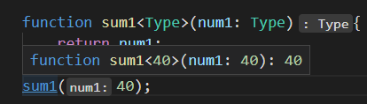

<!--
 * @Version:
 * @Autor: LC
 * @Date: 2022-02-08 13:06:14
 * @LastEditors: LC
 * @LastEditTime: 2022-02-08 18:24:20
 * @Description: Typescript
-->

# TypeScript

- TypeScript
  - 加强版的Javascript，让JS更加安全
  - JS拥有的特性，TS都支持，紧随ECMAScript标准
  - 增加了类型约束，同时扩展一些语法：枚举、元组等
  - TS在实现新特性的同时，保持和ES标准的同步
  - TS最终会被编译成JS代码，不用担心兼容性

- **错误出现的越早越好**
  - 能在**写代码的时候**发现的错误，就不要**代码编译时**发现
  - 能在**编代码编译期**发现的错误，就不要在**代码运行时**发现
  - 能在**开发阶段**发现的错误，就不要在**测试阶段**发现错误
  - 能在**测试阶段**发现的错误，就不要**上线后**才发现

## 类型

### 数据类型

| 类型   | 作用                           |
| ------ | ------------------------------ |
| string | Typescript中的字符串类型       |
| String | Javascript的字符串包装类的类型 |
| number | Typescript中的数字类型         |
| Number | JavaScript的数字包装类的类型   |

| 类型            | 作用                                                                                | -              |
| --------------- | ----------------------------------------------------------------------------------- | -------------- |
| number          | 数字类型，不区分int和double，统一为number                                           | 基本数据类型   |
| boolean         | 仅又true和false                                                                     | 基本数据类型   |
| string          | 字符串类型，可以用单引号或双引号表示                                                | 基本数据类型   |
| Array           | 数组类型(最好类型固定，不要数组中存放多种类型)                                      | 非基本数据类型 |
| null、undefined |                                                                                     |                |
| Symbol          | 符号                                                                                |                |
| any             | 无法确定变量的类型，并且可能会发生改变的时候使用any                                 | TS特有，JS没有 |
| unknown         | 用于描述类型不确定的变量，unknown只能赋值给unknown，any可以赋值给任意类型           | TS特有，JS没有 |
| void            | 通常用来指定函数没有返回值，那么返回值就是void类型，可以把null和undefined赋值给void | TS特有，JS没有 |
| never           | 永远不会发生的值，如果函数死循环或者抛出异常就不会返回任何值包括void                | TS特有，JS没有 |
| 联合类型        | `let n = string | number` 用 `|` 来表示`n`可以是`string`也可以是`number`类型        |                |
| tuple           | 元组类型                                                                            |                |

```typescript
let num : number = 123;
num = 222;

let num1 : number = 100;        // 十进制
let num2 : number = 0b111;      // 二进制
let num3 : number = 0o234;      // 八进制
let num4 : number = 0x29abc;    // 十六进制
// --------------------------------------------------------------
let flag : boolean = true;
flag = (20 > 40);
// --------------------------------------------------------------
let name = "2345";
let name1 = `name : ${name}`;   // 格式化字符串
// --------------------------------------------------------------
let names = [];                 // 默认是any类型数组
let names1 : Array<string> = [];// 不推荐，在react jsx中有冲突
let names2 : string[] = [];     // 推荐
// --------------------------------------------------------------
let info = {
    name : "w",
    age : 1
}
// --------------------------------------------------------------
let n1 : null : null;
let n2 : undefined : undefined;
// --------------------------------------------------------------
let message : any = "hello";    // any运行时不会报错，如果是string就报错了
message = 123;
let anyarray : any[] = [];
// --------------------------------------------------------------
function sum(n1 : number, n2 : number) {
    console.log("hello");
}
let resule = sum(1, 2);         // void类型

// --------------------------------------------------------------
function loopFun() : never {
    while(true){
        console.log("123");
    }
}
function loopFun1() : never{
    throw new Error();
}

// 针对类型做特殊处理，此时忘记处理boolean，所以赋值给never值，此时会报错，做提示之用
function handleMessage(message : string | number | boolean) {
    switch(typeof message){
        case 'string':
            break;
        case 'number':
            break;
        default :
            const check : never = message;
    }
}
handleMessage(true);
// --------------------------------------------------------------
const info:any[] = ["q", 1, 1.0];
let val = info[0];  // val 为any类型，不够安全
const info2 : [string, number, numer] = ["x", 10, 1.0]; // 元组可以确定各个类型
// --------------------------------------------------------------

```

### 函数的参数类型

```typescript
function sum(num1: number, num2: number) : numer{
    return num1 + num2;
}
```

和变量的类型注解一样，一般而言不需要编写返回类型注解，因为TypeScript会根据return返回值推断函数的返回类型（看个人喜好，编写了可读性更强）

```typescript
const names = ["1", "2", "3"];
names.forEach(function(item) {

});
```

一些成员函数可以不写数据类型，因为`names`是`string[]`，所以`item`肯定是`string`类型，Typescript会推导出来

```typescript
// 对象类型
function printPoint(point : {x: number, y:number, z?: number}){

}

printPoint({ x: 1, y: 2});
printPoint({ x: 1, y: 2, z: 3 });
printPoint({ x: 1, y: 2, z: 3, q : 4 });    // Error
```

> z ?: number 表示可选数据类型，如果没有`z`打印是`undefined`

`printPoint`目标是一个`Object`对象，该对象存在键`x`和`y`，并且都是`number`类型，目标对象可以存在名为`z`的key，也可以不存在`z`

### 组合类型

Typescript的类型系统允许我们使用多种运算符，从现有类型中构建新类型

- 一种组合类型：联合类型(Union Type)
   - 联合类型是由两个或者多个其他类型组成的类型
   - 表示可以是这些类型中的任何一个值
   - 联合类型中的每个类型被称之为联合成员(union's memeber)
   - 使用时必须小心类型

```typescript
// id 就是联合类型
function PrintID(id : number | string){
    console.log(id);
}
```

- 可选类型：可以理解为这个参数是 `目标类型 | undefined`的联合类型

```typescript
function foo(message ?: string){
    console.log(message);
}

function foo1(message : string | undefined){
    console.log(message);
}

foo1(undefined);
```

- 类型别名

```typescript
type UnionType = string | number | boolean;
function PrintID(id : UnionType){

}
type PointType = {
    x : number,
    y : number,
    z ?: number
}
funtion PrintPoint(point : PointType){

}
```

### 类型断言 as

有时候TypeScript无法获取具体的类型信息，这个时候需要使用**类型断言**(Type Assertions)
通过类型断言，可以把普遍的类型转变成具体类型

> `document.getElementById`TS只知道返回HTMLElement，但并不知道具体类型

```typescript
const el = document.getElementById("img");  // 其实获取到的是img标签
el.src = "图片地址";    // 直接设置img标签的报错

const el1 = document.getElementById("img") as HTMLImageElement;  // 其实获取到的是img标签
el1.src = "图片地址";    // 直接设置img标签的报错

class Person {
}

class Student extends Person {
    studying() {
        console.log("s");
    }
}

function sayHello(p: Person) {
    (p as Student).studying();
}

let s = new Student();
sayHello(s);

// as 的奇淫巧计 别瞎用
const message = "hello";
const num : number = (message as any) as number;
```

### 非空类型断言

```typescript
function printMessage(message ?: string){
    console.log(message.length);
}
printMessage("hello");
printMessage(); // Error message是undefined的

function printMessage2(message ?: string){
    console.log(message?.length);
}

```

上述代码`printMessage`不够严谨，`message`有`undefined`的可能
为了解决上述代码的不够严谨的问题，引入**可选链**(就是`printMessage2`中`.?`)

```typescript
type Person = {
    name: string,
    friend?: {
        name: string,
        age?: number,
        girlFriend?: {
            name: string
        }
    }
}

function test(p: Person) {
    console.log(p.name);
    console.log(p.friend?.name);
    console.log(p.friend?.age);
    console.log(p.friend?.girlFriend?.name);
}

let info: Person = {
    name: "x",
    friend: {
        name: "y",
        girlFriend: {
            name: "z"
        }
    }
}

test(info);
```

使用**可选链**可以省去复杂的`undefined`嵌套判断

> 是Javascript在ES11中添加的功能，非TS增加的功能

### !!和??的作用

- !!操作符
  - 将一个其他类型转换成`boolean`类型
  - 类似`Boolean(变量)`的方式
- ??操作符
  - 控制合并操作符是一个逻辑操作符
  - 当操作符的左侧是null或者undefined是，返回其右侧操作数，否则返回左侧操作数

```typescript
const message = "hello";
const flag = Boolean(message);
console.log(flag);
const flag1 = !!message;
console.log(flag1);
const flag2 = (!(!message));
console.log(flag2);
```

> `(!!message)`的操作可以理解为两部分：`(!message)`将`message`转换成`boolean`类型并取反，再通过`!`把值转换回来

```typescript
const message = "321";
const result = message ?? "123";
console.log(result);
```

### 字面量类型

TS中字面量类型的类型和值必须相同

```javascript
let message : "hello" = "hello";
let msg : 123 = 123;
```

> 通过上述代码可见，字符串也可以当作数据类型

虽然看起来不知道有什么用，但是配合联合类型就可以完成enum的功能

```typescript
type Alignment = 'left' | 'right' | 'center' | 'top';
let align : Alignment = 'left';
align = 'right';

type Method = 'Get' | 'Post';
function requests(url : string, method : Method){}

let options = {
    url : "",
    method : "Post"
}

requests(options.url, options.method);   // Error : options.method是字符串类型，不一定是"Post"/"Get"
requests(options.url, options.method as Method);

type Requested = {
    url: string,
    method: Method
};

let options2 : Requested = {
    url : "",
    method : "Post"
}
requests(options2.url, options2.method);
```

> 通过字面量类型和联合类型，可以限制变量的值的内容

### 类型缩小

- 类型缩小
  - 类型缩小的英文：Type Narrowing
  - 通过类似`typeof padding === "number"`的判断语句，来改变TypeScript的执行路径
  - 在给定的执行路径中，可以缩小比声明时更小的类型，过程称之为**缩小**
  - `typeof padding === "number"`称之为**类型保护(type guards)**

- 常见的类型保
  - typeof
  - 平等缩小(===, !==,==, !=, switch)
  - instanceof
  - in
  - ...

> 就是逐渐缩小变量的类型的范围的过程

```typescript
// typeof
function printID(id : number | string){
    if (typeof id === 'string'){
        // 从联合类型到确认为string类型
        console.log(id.toUpperCase());
    } else {
        // 从联合类型到确认为number类型
        console.log(id);
    }
}

// 平等缩小
type Alignment = 'left' | 'right' | 'center' | 'top';
function printDirection(direction : Alignment){
    switch(direction){
        case 'left':
            break;
        case 'right':
            break;
        case 'center':
            break;
        case 'top':
            break;
    }
}

// instanceof 判断对象类型
function printTime(time : string | Date){
    if (time instanceof Date){
        console.log(time.toUTCString());
    } else {
        console.log(string);
    }
}

// in
type Fish = {
    swimming: () => void;
}
type Dog = {
    running: () => void;
}
function walk(animal : Fish | Dog){
    if ('swimming' in animal){
        // 判断为Fish类型
        animal.swimming();
    } else {
        animal.running();
    }
}
```

### 函数类型

1. 函数作为参数时

```javascript
function foo(){

}

function bar(fn : ()=>void){

}

bar(foo);
```

> `·()=>void`是函数类型，不是匿名函数

2. 函数作为变量

```typescript
type AddFnType = (num1 : number, num2 : number) => number  ;
let add : AddFnType = (num1 : number, num2 : number) => {
    return num1 + num2;
}
```

3. 参数的可选类型

可选参数`name ?: type`必须写在最后，本质其实就是`name : type | undefined`，所以name其实可能为undefined，需要对name为undefined的情况做处理

```typescript
function foo(x: number, y?:number){

}
```

4. 参数默认值

```typescript
function foo(x : number, y : number = 100){
    console.log(x, y);
}
function foo1(x : number = 20, y : number){
    console.log(x, y);
}
foo(20);
foo1(undefined, 30);
```

5. 剩余参数

使用`...nums : number[]`作为剩余参数
JS部分有讲

```typescript
function sum(...nums : number[]) : number{
    if(nums.length == 1){
        return nums[0];
    }
    let val = nums[0];
    nums = nums.slice(1);
    return val + sum(...nums);
}
console.log(sum(1, 2, 3, 4, 5, 6));
```

### 函数的重载

```typescript
function add(a1 : number | string, a2 : number | string){

    return a1 + a2; // Error 因为 a1 是 number | string 类型， a2 是 number | string类型，这个(number | string)类型没有加法

    if (typeof a1 === 'number' && typeof a2 === 'number'){
        return a1 + a2;
    } else {
        // ...
    }
}

```

> 通过判断类型的方法，会导致各种类型判断的问题，突出一个复杂

- 函数的重载：函数的名称相同，但是参数不同的几个函数，就是函数的重载

```typescript
function add(num1: number, num2: number) : number;  // 定义函数
function add(num1: string, num2: string) : string;  // 定义函数

// 实现函数
function add(num1: any, num2: any){
    if(typeof num1 === 'string' && typeof num2 === 'string'){
        return num1.length + num2.length;
    }
    return num1 + num2;
}

add(1, 2);
add("23", "23");
// 在重载的函数中，实现函数是不能直接被调用的
add(true, false);   // Error
```

- TS的重载 突出一个难受
- 优先使用联合类型实现，如果联合类型可以实现的话

## 类的使用

### 类的定义

- 类定义时，属性必须初始化

```typescript
class Person{
    name: string = "";
    age: number = 0;

    eating() {
        console.log(this.name, this.age);
    }
}

class Person1 {
    name: string;
    age: number;
    constructor(name: string, age: number){
        this.name = name;
        this.age = age;
    }
    eating() {
        console.log(this.name, this.age);
    }
}
```

> 属性要么定义时初始化，要么在构造函数初始化，否则会报错

### 继承

```typescript
class Person{
    name: string = "";
    age: string = 0;

    eating() {

    }
}
class Student extends Person{
    sno: number = 0;
    constructor(name: string, age: number, sno: number){
        this.name = name;
        this.age = age;
        this.sno = sno;
    }
    studying() {

    }
}
```

> 父类没有定义构造函数

```typescript
class Person{
    name: string;
    age: string;
    constructor(name: string, age: string){
        this.name = name;
        this.age = age;
    }
    eating() {

    }
}
class Student extends Person{
    sno: number = 0;
    constructor(name: string, age: number, sno: number){
        super(name, age);   // 调用父类的构造函数 super等于父类
        this.sno = sno;
    }
    studying() {

    }
    // 重写
    eating() {
        super.eating();     // 调用父类的eating方法
        console.log("s");
    }
}
```

> 父类定义了构造函数

### 多态

```typescript
class Animal{
    action(){
        console.log("animal running");
    }
}
class Dog extends Animal{
    action(){
        console.log("Dog running");
    }
}
class Fish extends Animal{
    action(){
        console.log("Fish running");
    }
}
function runAction(animals : Animal[]){
    animals.forEach(animal => {
        animal.action();
    })
}
runAction([new Dog(), new Fish()]);
```

> 父类引用指向子类对象

### 类的成员修饰符

- 类的成员修饰符
  - public：任何地方可见，公有的属性、方法(默认public)
  - private：仅在同一类中可见，私有的属性、方法
  - protected：仅在类自身及子类中可见，受保护的属性、方法

```typescript
class Person{
    private name: string = "";

    // 封装方法访问属性
    getName(){
        return this.name;
    }
    setName(val: string){
        this.name = newName;
    }
}

```

### 只读属性 readonly

- readonly修饰属性时，该属性只能在构造函数中赋值，但是赋值之后不可修改

```typescript
class Foo{
    age: number = 10;
}
class Person{
    readonly name: string;
    readonly foo : Foo;
    constructor(name: string, foo: Foo){
        this.name = name;
        this.foo = foo;
    }
}

let p = new Person("123", new Foo());
p.name = "234";     // Error
p.foo.age = 20;     // Success
```

> 不能修改readonly指向的对象，但是可以修改readonly对象内部的属性

### 属性的get、set

- 一般而言，私有变量前面会加上下划线

```typescript
class Person{
    private _name: string;
    constructor(name: string){
        this._name = name;
    }

    // 访问器
    set name(val: string) {
        this._name = val;
    }
    get name() {
        return this._name;
    }
}

const p = new Person('x');
p.name = "y";
```

### 类的静态成员

不用new出对象，可以直接通过类名访问的属性和方法

```typescript
class Person{
    static time: string = "20:00";
    static attendClass(){
        console.log("static function");
    }
}
console.log(Person.time);
console.log(Person.attendClass());
```

### 抽象类

- 在定义很多通用的调用接口时，通常会让调用者传入父类，通过多态来实现更加灵活的调用方式，但是**父类本身可能不需要对某些方法进行具体的实现**，所以父类中定义的方法，我们可以定义为抽象方法

```typescript
abstract class Shape{
    abstract getArea(): number;
}

class Rectangle extends Shape{
    private width: number;
    private height: number;

    constructor(width: number, height: number){
        super();
        this.width = width;
        this.height = height;
    }

    getArea(){
        return this.width * this.height;
    }
}

class Circle extends Shape{
    private r: number;
    constructor(r: number){
        super();
        this.r = r;
    }

    getArea(){
        return this.r * this.r *3.1415;
    }
}

function makeArea(shape: Shape){
    return shape.getArea();
}
makeArea(new Rectangle(10, 20));
makeArea(new Circle(10));
```

- **抽象方法**(`abstract getArea`)必须定义在**抽象类**中(`abstract class Shape`)
- 如果只给函数加上`abstract`而不给类加上`abstract`是会报错的
- **抽象类**中可以实现其他方法，有实现体的方法不用加上`abstract`

继承**抽象类**时，必须实现**抽象方法**

### 类的类型

- 用类作为类型

```typescript
class Person{
    name: string = "123";

    eating() {

    }
}

function printPerson(p: Person){
    console.log(p.name);
}
let p: Person = new Person();
let p1: Person = {
    name : "x",
    eating() {

    }
}
printPerson(p);
printPerson(p1);
```

### 枚举类型

枚举就是将一组可能出现的值，一个个列举出来，定义在一个类型中，这个类型就是枚举类型  
枚举允许开发者定义一组命名常量，常量可以是数组、字符串类型  

```typescript
enum Direction {
    LEFT = 100,         // 100
    RIGHT,              // 101
    TOP,                // 102
    BOTTOM = 104        // 104
}
enum Direction2 {
    LEFT = "LEFT",      
    RIGHT = "RIGHT",      
    TOP = "TOP",        
    BOTTOM  = "BOTTOM"    
}

function turnDirection(direction: Direction){

}
turnDirection(Direction.LEFT);
turnDirection(Direction.RIGHT);
turnDirection(Direction.TOP);
turnDirection(Direction.BOTTOM);
```

> 编程习惯——枚举类型大写


## 接口

**interface**

### 声明对象类型

- 接口类型定义时，会在类型前多加一个`I`，表示该类型为interface

```typescript
// 通过type声明对象类型
type InfoType = {name: string, age: number}

// 接口interface

interface IInfoType = {name: string, age: number}

const info: IInfoType = {
    name: "x",
    age: 19
}

```

### 索引类型

- 使用**interface**来限制对象的索引类型

```typescript
interface IIndexLanguage{
    [index: number]: string
}

// 限制frontLanguage必须是number索引string
const frontLanguage: IIndexLanguage = {
    0: "HTML",
    1: "CSS",
    2: "JavaScript",
    3: "Vue",
}
```

### 函数类型

```typescript
function calc(num1 : number, num2 : number, calcFn: (n1: number, n2: number) => number){
    return calcFn(num1, num2);
}

type CalcFn = (n1: number, n2: number) => number;
function calc(num1 : number, num2 : number, calcFn: CalcFn){
    return calcFn(num1, num2);
}

interface encrypt {
  (key: string, value: string): string;
}

// 对传入的参数以及返回值进行约束
let md1: encrypt = function (key: string, value: string): string {
  return key + value;
}
console.log(md1('张三', '初一一班'));


let md2: encrypt = function (key: string, value: string): string {
  return key + value;
}
console.log(md2('李四', '初二三班'));
```

### 接口的继承

TS的class不支持多重继承，但是interface支持多重继承

```typescript
interface ISwim{
    swimming:() => void;
}

interface IFly{
    flyin: () => void;
}

interface IAction extends ISwim, IFly{

}

const action: IAction = {
    swimming() {}
}
```

### 交叉类型

```typescript
type WhyType = number | string;
type Direction = 'left' | 'right' | 'center';

// 另一种组合类型的方式：交叉类型
type WType = number & string;

interface ISwim{
    swiming:() => void;
}

interface IFly{
    flying: () => void;
}

type MyType1 = ISwim | IFly;
type MyType2 = ISwim & IFly;

const obj: MyType1 = {
    flying() {

    }
}

const obj1: MyType2 = {
    swimming() {

    },
    flying() {

    }
}
```

### 接口的实现

- 推荐使用面向接口编程，降低耦合度

```typescript
interface ISwim{
    swimming: ()=>void;
}

interface IEat{
    eating: ()=>void;
}

// 类实现接口
class Animal  {

}

class Fish extends Animal implements ISwim, IEat{
    swimming() {
        console.log("animal swiming");
    }
    eating() {
        console.log("animal eating");
    }
}

class Person implements ISwim{
    swimming() {
        console.log("Person swimming");
    }
}

function swimAction(swimer: ISwim){
     swimer.simming();
}

swimAction(new Fish());
swimAction(new Person());
```

### interface 和 type的区别


- interface和type都可以用来定义对象类型
  - 如果定义非对象类型，通常推荐使用type，比如前面代码中的：Direction、Alignment、一些Funciton
  - 如果定义对象类型，他们是有区别的（推荐使用interface）
    - interface可以重复的对某个接口来定义属性和方法
    - type定义的是别名，别名是不能重复的

```typescript
interface IFoo{
    name: string
}

interface IFoo{
    age: number
}

onst foo: IFoo = {
    name : "x",
    age : 10
}  
```

> 名称相同的interface最后会合并到一起  
> 比如上面的两个`IFoo`不会报错，最后定义的foo变量需要实现name和age属性  

```typescript
type IBar = {
    name: string;
}
type IBar = {
    age: number;
}
```

> `Duplicate identifier 'IBar'`

### 字面量赋值

```typescript
interface IPerson{
    name: string,
    age: number,
    height: number
}

const p: IPerson = {
    name: "why",
    age: 19,
    height: 198,
    address: "BJ"
};  // Error 多了address属性

let p1 = {
    name: "why",
    age: 19,
    height: 198,
    address: "BJ"
}
let p2: Person = p1;    // Success 可以赋值
console.log(p2);
```

**为什么直接赋值字面量给p变量时会报错**

typescript会对`{name: "why",age: 19,height: 198,address: "BJ"}`进行类型推导=>`{name,age,height,address}`，这个推导出来的类型就是`p`最后的类型，而这个最后的类型跟`IPerson`不相同，所以报错

而`p2: Person = p1`中，是给`p2`赋值成了`p1`的引用，在赋值的过程中会进行**freshness擦除**的操作  

**freshness擦除**操作就是给将`p1`赋值给`p2`进行类型检测的时候，将多余的属性进行**擦除**，不是将属性去除掉，而是类似不考虑多余属性的操作

> 通过**freshness擦除**的操作，让函数传参的时候更加灵活  

## 泛型

**为了让代码具有很强的可重用性**

在定义函数的时候，不决定参数的类型，而是让调用者以参数的形式决定函数参数应该是什么类型  

```typescript
function sum2<Type>(num1 : Type, num2: Type){
    return num1 + num2; // Error Type不一定是可以相加的类型 比如数组
}

function sum<Type>(num1: Type, num2: Type){
    return num1;
}
function sum1<Type>(num1: Type){
    return num1;
}
console.log(typeof sum<number>(20, 30) === 'number');

// 1. 明确传入类型
sum<number>(20, 30);
sum<{name : string}>({name: "x"}, {name: "y"});
sum<any[]>([20], [30]);

// 2. 类型推导
sum1(40);
```



> 类型推导出来`Type`是字面量类型，如果不想是字面量类型就需要`sum<number>(40)`明确指定类型  

```typescript
function foo<T, V>(arg1: T, arg2: V){
    console.log(arg1, arg2);
}
foo<number, string>(10, "qwer");
```

### 泛型接口

```typescript
interface IPerson<T1, T2>{
    name: T1,
    age: T2
}

let p: IPerson<string, number> = {
    name: "x",
    age: 10
}

interface IStu<T1 = string, T2 = number>{
    name: T1,
    age: T2
}

let p2: IStu = {
    name: "y",
    age: 10
}
```

> 泛型接口没有类型推导，所以必须写明类型，例：IPerson  
> 可以使用默认类型，例：IStu  

### 泛型类

```typescript
class Point<T>{
    x: T;
    y: T;
    z: T;

    constructor(x: T, y: T, z: T){
        this.x = x;
        this.y = y;
        this.z = z;
    }
}

let p0 = new Point<string>("1", "2", "3");
// 类型推导
const p = new Point("1", "2", "3");
```

> 泛型类可以类型推导

### 泛型的类型约束

```typescript
// 使用联合类型
function getLength(arg: string | any[]){
    return arg.length;
}

interface ILength{
    length: number
}
// 使用泛型
function getLength1<Type extends ILength>(arg: Type){
    return arg.length;
}

getLength1("abav");
getLength1([1, 2, 3, 4]);
getLength1({length: 100});
```

> 使用`extends`来限制Type的类型或者必须包含的属性等

## 模块化

```typescript
// math.ts文件
export function add(num1: number, num2: number){
    return num1 + num2;
}

export function sub(num1: number, num2: number){
    return num1 - num2;
}

// index.ts
import {add, sub} from "./math"
console.log(add(1, 2));
console.log(sub(1, 2));
```

### 命名空间

命名空间在typescript早期时，称之为内部模块，主要目的是将一个模块内部再进行作用域的划分，防止一些命名冲突的问题  

```typescript
namespace time {
    export function format(time: string){
        return "2022-1-1";
    }

    function foo(){

    }

    let name: string = "time"
}
namespace price {
    export function format(price: number){
        return "100,000,000";
    }

    function foo(){

    }
    let name: string = "price "
}

export namespace test{  // 导出命名空间
    export function Run(){

    }
}

time.format("1234");    // Success
time.foo();             // Error
time.name;              // Error

// index.ts
import {test} from './test.ts'  // 
test.Run();
```

> 如果想要函数、自变量可以在命名空间的外部进行访问，需要将其设置为`export`

### 类型的查找

之前我们所有的typescript中的类型，几乎都是我们自己编写的，但是也有用过一些其他的类型  

> `const imageEl = document.getElementById("image") as HTMLImageElement`

上述代码中的`HTMLImageElement`我们没有进行定义或者声明，那么它是从哪里来的呢？  

- Typescript对类型的**管理和查找规则**  

之前编写的代码都是.ts文件中的，这些文件最终会输出成.js文件。除此之外，还有另一种.d.ts文件，他hi是用来做类型的声明(declare)。它仅仅是用来做类型检测，告知typescript有哪些类型  

- TS会在这些地方查找类型声明
  - 内置类型声明：安装typescript时自带的，包括Array等[TS内置类型(.d.ts文件))](https://github.com/microsoft/Typescript/tree/main/lib)
  - 外部定义类型声明：安装的一些库，自带`.d.ts`文件，表示对三方库的类型声明
    - 安装的三方库中自带`.d.ts`类型声明文件
    - 安装的三方库，通过社区的公有库`DefinitelyTyped`存放类型声明文件
      - [该库的地址](https://github.com/DefinitelyTyped/DefinitelyTyped)
      - [该库查找声明安装方式的地址](https://www.typescriptlang.org/dt/search?search=)
      - 比如安装react的类型声明：`npm io @types/react --save-dev`
  - 自己定义类型声明
    - 使用的第三方库是一个纯的Javascript库，没有对应的声明文件时，需要自己定义，比如：`lodash`
    - 我们自己的代码中声明一些类型，方便在其他地方直接进行使用

```typescript
// 内置声明 HTMLImageElement 
const imageEl = document.getElementById("image") as HTMLImageElement;

// 自定义类型声明 
// MyD.d.ts 自己声明lodash库
declare module 'lodash' {
    export function join(arr: any[]): void;
}
```
# Decorators

[原文链接](https://github.com/zhongsp/TypeScript/blob/dev/zh/reference/decorators.md)

## 介绍

随着TypeScript和ES6里引入了类，在一些场景下我们需要额外的特性来支持标注或修改类及其成员。 装饰器（Decorators）为我们在类的声明及成员上通过元编程语法添加标注提供了一种方式。 Javascript里的装饰器目前处在[建议征集的第二阶段](https://github.com/tc39/proposal-decorators)，但在TypeScript里已做为一项实验性特性予以支持。

> 注意  装饰器是一项实验性特性，在未来的版本中可能会发生改变。

若要启用实验性的装饰器特性，你必须在命令行或`tsconfig.json`里启用`experimentalDecorators`编译器选项：

**命令行**:

```text
tsc --target ES5 --experimentalDecorators
```

**tsconfig.json**:

```javascript
{
    "compilerOptions": {
        "target": "ES5",
        "experimentalDecorators": true
    }
}
```

## 装饰器

_装饰器_是一种特殊类型的声明，它能够被附加到[类声明](decorators.md#class-decorators)，[方法](decorators.md#method-decorators)，[访问符](decorators.md#accessor-decorators)，[属性](decorators.md#property-decorators)或[参数](decorators.md#parameter-decorators)上。 装饰器使用`@expression`这种形式，`expression`求值后必须为一个函数，它会在运行时被调用，被装饰的声明信息做为参数传入。

例如，有一个`@sealed`装饰器，我们会这样定义`sealed`函数：

```typescript
function sealed(target) {
    // do something with "target" ...
}
```

> 注意  后面[类装饰器](decorators.md#class-decorators)小节里有一个更加详细的例子。

### 装饰器工厂

如果我们要定制一个修饰器如何应用到一个声明上，我们得写一个装饰器工厂函数。 _装饰器工厂_就是一个简单的函数，它返回一个表达式，以供装饰器在运行时调用。

我们可以通过下面的方式来写一个装饰器工厂函数：

```typescript
function color(value: string) { // 这是一个装饰器工厂
    return function (target) { //  这是装饰器
        // do something with "target" and "value"...
    }
}
```

> 注意  下面[方法装饰器](decorators.md#method-decorators)小节里有一个更加详细的例子。

### 装饰器组合

多个装饰器可以同时应用到一个声明上，就像下面的示例：

* 书写在同一行上：

```typescript
@f @g x
```

* 书写在多行上：

```typescript
@f
@g
x
```

当多个装饰器应用于一个声明上，它们求值方式与[复合函数](http://en.wikipedia.org/wiki/Function_composition)相似。在这个模型下，当复合_f_和_g_时，复合的结果\(_f_ ∘ _g_\)\(_x_\)等同于_f_\(_g_\(_x_\)\)。

同样的，在TypeScript里，当多个装饰器应用在一个声明上时会进行如下步骤的操作：

1. 由上至下依次对装饰器表达式求值。
2. 求值的结果会被当作函数，由下至上依次调用。

如果我们使用[装饰器工厂](decorators.md#decorator-factories)的话，可以通过下面的例子来观察它们求值的顺序：

```typescript
function f() {
    console.log("f(): evaluated");
    return function (target, propertyKey: string, descriptor: PropertyDescriptor) {
        console.log("f(): called");
    }
}

function g() {
    console.log("g(): evaluated");
    return function (target, propertyKey: string, descriptor: PropertyDescriptor) {
        console.log("g(): called");
    }
}

class C {
    @f()
    @g()
    method() {}
}
```

在控制台里会打印出如下结果：

```text
f(): evaluated
g(): evaluated
g(): called
f(): called
```

### 装饰器求值

类中不同声明上的装饰器将按以下规定的顺序应用：

1. _参数装饰器_，然后依次是_方法装饰器_，_访问符装饰器_，或_属性装饰器_应用到每个实例成员。
2. _参数装饰器_，然后依次是_方法装饰器_，_访问符装饰器_，或_属性装饰器_应用到每个静态成员。
3. _参数装饰器_应用到构造函数。
4. _类装饰器_应用到类。

### 类装饰器

_类装饰器_在类声明之前被声明（紧靠着类声明）。 类装饰器应用于类构造函数，可以用来监视，修改或替换类定义。 类装饰器不能用在声明文件中\(`.d.ts`\)，也不能用在任何外部上下文中（比如`declare`的类）。

类装饰器表达式会在运行时当作函数被调用，类的构造函数作为其唯一的参数。

如果类装饰器返回一个值，它会使用提供的构造函数来替换类的声明。

> 注意  如果你要返回一个新的构造函数，你必须注意处理好原来的原型链。 在运行时的装饰器调用逻辑中_不会_为你做这些。

下面是使用类装饰器\(`@sealed`\)的例子，应用在`Greeter`类：

```typescript
@sealed
class Greeter {
    greeting: string;
    constructor(message: string) {
        this.greeting = message;
    }
    greet() {
        return "Hello, " + this.greeting;
    }
}
```

我们可以这样定义`@sealed`装饰器：

```typescript
function sealed(constructor: Function) {
    Object.seal(constructor);
    Object.seal(constructor.prototype);
}
```

当`@sealed`被执行的时候，它将密封此类的构造函数和原型。\(注：参见[Object.seal](https://developer.mozilla.org/zh-CN/docs/Web/JavaScript/Reference/Global_Objects/Object/seal)\)

下面是一个重载构造函数的例子。

```typescript
function classDecorator<T extends {new(...args:any[]):{}}>(constructor:T) {
    return class extends constructor {
        newProperty = "new property";
        hello = "override";
    }
}

@classDecorator
class Greeter {
    property = "property";
    hello: string;
    constructor(m: string) {
        this.hello = m;
    }
}

console.log(new Greeter("world"));
```

### 方法装饰器

_方法装饰器_声明在一个方法的声明之前（紧靠着方法声明）。 它会被应用到方法的_属性描述符_上，可以用来监视，修改或者替换方法定义。 方法装饰器不能用在声明文件\(`.d.ts`\)，重载或者任何外部上下文（比如`declare`的类）中。

方法装饰器表达式会在运行时当作函数被调用，传入下列3个参数：

1. 对于静态成员来说是类的构造函数，对于实例成员是类的原型对象。
2. 成员的名字。
3. 成员的_属性描述符_。

> 注意  如果代码输出目标版本小于`ES5`，_属性描述符_将会是`undefined`。

如果方法装饰器返回一个值，它会被用作方法的_属性描述符_。

> 注意  如果代码输出目标版本小于`ES5`返回值会被忽略。

下面是一个方法装饰器（`@enumerable`）的例子，应用于`Greeter`类的方法上：

```typescript
class Greeter {
    greeting: string;
    constructor(message: string) {
        this.greeting = message;
    }

    @enumerable(false)
    greet() {
        return "Hello, " + this.greeting;
    }
}
```

我们可以用下面的函数声明来定义`@enumerable`装饰器：

```typescript
function enumerable(value: boolean) {
    return function (target: any, propertyKey: string, descriptor: PropertyDescriptor) {
        descriptor.enumerable = value;
    };
}
```

这里的`@enumerable(false)`是一个[装饰器工厂](decorators.md#decorator-factories)。 当装饰器`@enumerable(false)`被调用时，它会修改属性描述符的`enumerable`属性。

### 访问器装饰器

_访问器装饰器_声明在一个访问器的声明之前（紧靠着访问器声明）。 访问器装饰器应用于访问器的_属性描述符_并且可以用来监视，修改或替换一个访问器的定义。 访问器装饰器不能用在声明文件中（.d.ts），或者任何外部上下文（比如`declare`的类）里。

> 注意  TypeScript不允许同时装饰一个成员的`get`和`set`访问器。取而代之的是，一个成员的所有装饰的必须应用在文档顺序的第一个访问器上。这是因为，在装饰器应用于一个_属性描述符_时，它联合了`get`和`set`访问器，而不是分开声明的。

访问器装饰器表达式会在运行时当作函数被调用，传入下列3个参数：

1. 对于静态成员来说是类的构造函数，对于实例成员是类的原型对象。
2. 成员的名字。
3. 成员的_属性描述符_。

> 注意  如果代码输出目标版本小于`ES5`，_Property Descriptor_将会是`undefined`。

如果访问器装饰器返回一个值，它会被用作方法的_属性描述符_。

> 注意  如果代码输出目标版本小于`ES5`返回值会被忽略。

下面是使用了访问器装饰器（`@configurable`）的例子，应用于`Point`类的成员上：

```typescript
class Point {
    private _x: number;
    private _y: number;
    constructor(x: number, y: number) {
        this._x = x;
        this._y = y;
    }

    @configurable(false)
    get x() { return this._x; }

    @configurable(false)
    get y() { return this._y; }
}
```

我们可以通过如下函数声明来定义`@configurable`装饰器：

```typescript
function configurable(value: boolean) {
    return function (target: any, propertyKey: string, descriptor: PropertyDescriptor) {
        descriptor.configurable = value;
    };
}
```

### 属性装饰器

_属性装饰器_声明在一个属性声明之前（紧靠着属性声明）。 属性装饰器不能用在声明文件中（.d.ts），或者任何外部上下文（比如`declare`的类）里。

属性装饰器表达式会在运行时当作函数被调用，传入下列2个参数：

1. 对于静态成员来说是类的构造函数，对于实例成员是类的原型对象。
2. 成员的名字。

> 注意  _属性描述符_不会做为参数传入属性装饰器，这与TypeScript是如何初始化属性装饰器的有关。 因为目前没有办法在定义一个原型对象的成员时描述一个实例属性，并且没办法监视或修改一个属性的初始化方法。返回值也会被忽略。 因此，属性描述符只能用来监视类中是否声明了某个名字的属性。

如果访问符装饰器返回一个值，它会被用作方法的_属性描述符_。

我们可以用它来记录这个属性的元数据，如下例所示：

```typescript
class Greeter {
    @format("Hello, %s")
    greeting: string;

    constructor(message: string) {
        this.greeting = message;
    }
    greet() {
        let formatString = getFormat(this, "greeting");
        return formatString.replace("%s", this.greeting);
    }
}
```

然后定义`@format`装饰器和`getFormat`函数：

```typescript
import "reflect-metadata";

const formatMetadataKey = Symbol("format");

function format(formatString: string) {
    return Reflect.metadata(formatMetadataKey, formatString);
}

function getFormat(target: any, propertyKey: string) {
    return Reflect.getMetadata(formatMetadataKey, target, propertyKey);
}
```

这个`@format("Hello, %s")`装饰器是个 [装饰器工厂](decorators.md#decorator-factories)。 当`@format("Hello, %s")`被调用时，它添加一条这个属性的元数据，通过`reflect-metadata`库里的`Reflect.metadata`函数。 当`getFormat`被调用时，它读取格式的元数据。

> 注意  这个例子需要使用`reflect-metadata`库。 查看[元数据](decorators.md#metadata)了解`reflect-metadata`库更详细的信息。

### 参数装饰器

_参数装饰器_声明在一个参数声明之前（紧靠着参数声明）。 参数装饰器应用于类构造函数或方法声明。 参数装饰器不能用在声明文件（.d.ts），重载或其它外部上下文（比如`declare`的类）里。

参数装饰器表达式会在运行时当作函数被调用，传入下列3个参数：

1. 对于静态成员来说是类的构造函数，对于实例成员是类的原型对象。
2. 成员的名字。
3. 参数在函数参数列表中的索引。

> 注意  参数装饰器只能用来监视一个方法的参数是否被传入。

参数装饰器的返回值会被忽略。

下例定义了参数装饰器（`@required`）并应用于`Greeter`类方法的一个参数：

```typescript
class Greeter {
    greeting: string;

    constructor(message: string) {
        this.greeting = message;
    }

    @validate
    greet(@required name: string) {
        return "Hello " + name + ", " + this.greeting;
    }
}
```

然后我们使用下面的函数定义 `@required` 和 `@validate` 装饰器：

```typescript
import "reflect-metadata";

const requiredMetadataKey = Symbol("required");

function required(target: Object, propertyKey: string | symbol, parameterIndex: number) {
    let existingRequiredParameters: number[] = Reflect.getOwnMetadata(requiredMetadataKey, target, propertyKey) || [];
    existingRequiredParameters.push(parameterIndex);
    Reflect.defineMetadata(requiredMetadataKey, existingRequiredParameters, target, propertyKey);
}

function validate(target: any, propertyName: string, descriptor: TypedPropertyDescriptor<Function>) {
    let method = descriptor.value;
    descriptor.value = function () {
        let requiredParameters: number[] = Reflect.getOwnMetadata(requiredMetadataKey, target, propertyName);
        if (requiredParameters) {
            for (let parameterIndex of requiredParameters) {
                if (parameterIndex >= arguments.length || arguments[parameterIndex] === undefined) {
                    throw new Error("Missing required argument.");
                }
            }
        }

        return method.apply(this, arguments);
    }
}
```

`@required`装饰器添加了元数据实体把参数标记为必需的。 `@validate`装饰器把`greet`方法包裹在一个函数里在调用原先的函数前验证函数参数。

> 注意  这个例子使用了`reflect-metadata`库。 查看[元数据](decorators.md#metadata)了解`reflect-metadata`库的更多信息。

### 元数据

一些例子使用了`reflect-metadata`库来支持[实验性的metadata API](https://github.com/rbuckton/ReflectDecorators)。 这个库还不是ECMAScript \(JavaScript\)标准的一部分。 然而，当装饰器被ECMAScript官方标准采纳后，这些扩展也将被推荐给ECMAScript以采纳。

你可以通过npm安装这个库：

```text
npm i reflect-metadata --save
```

TypeScript支持为带有装饰器的声明生成元数据。 你需要在命令行或`tsconfig.json`里启用`emitDecoratorMetadata`编译器选项。

**Command Line**:

```text
tsc --target ES5 --experimentalDecorators --emitDecoratorMetadata
```

**tsconfig.json**:

```javascript
{
    "compilerOptions": {
        "target": "ES5",
        "experimentalDecorators": true,
        "emitDecoratorMetadata": true
    }
}
```

当启用后，只要`reflect-metadata`库被引入了，设计阶段添加的类型信息可以在运行时使用。

如下例所示：

```typescript
import "reflect-metadata";

class Point {
    x: number;
    y: number;
}

class Line {
    private _p0: Point;
    private _p1: Point;

    @validate
    set p0(value: Point) { this._p0 = value; }
    get p0() { return this._p0; }

    @validate
    set p1(value: Point) { this._p1 = value; }
    get p1() { return this._p1; }
}

function validate<T>(target: any, propertyKey: string, descriptor: TypedPropertyDescriptor<T>) {
    let set = descriptor.set;
    descriptor.set = function (value: T) {
        let type = Reflect.getMetadata("design:type", target, propertyKey);
        if (!(value instanceof type)) {
            throw new TypeError("Invalid type.");
        }
        set.call(target, value);
    }
}
```

TypeScript编译器可以通过`@Reflect.metadata`装饰器注入设计阶段的类型信息。 你可以认为它相当于下面的TypeScript：

```typescript
class Line {
    private _p0: Point;
    private _p1: Point;

    @validate
    @Reflect.metadata("design:type", Point)
    set p0(value: Point) { this._p0 = value; }
    get p0() { return this._p0; }

    @validate
    @Reflect.metadata("design:type", Point)
    set p1(value: Point) { this._p1 = value; }
    get p1() { return this._p1; }
}
```

> 注意  装饰器元数据是个实验性的特性并且可能在以后的版本中发生破坏性的改变（breaking changes）。
