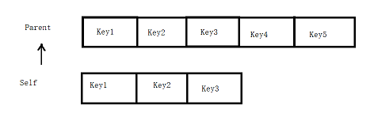
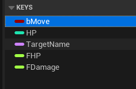
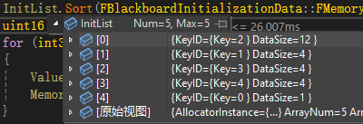
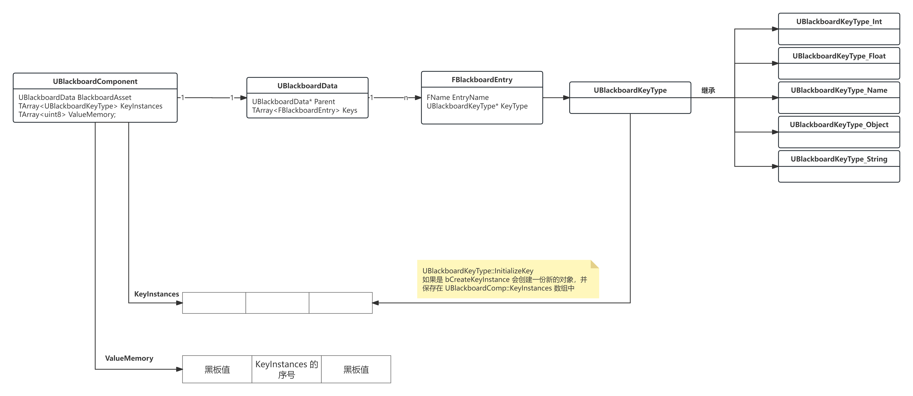

# 黑板

用于存储行为树运行时数据，方便行为树获取和设置数据


## UBlackboardData

作为 Blackboard 的资产，存储所有配置的数据的 Key，每个 Key 都是通过 `FBlackboardEntry` 来表示

```cpp
UCLASS(BlueprintType, AutoExpandCategories=(Blackboard), MinimalAPI)
class UBlackboardData : public UDataAsset
{
	GENERATED_UCLASS_BODY()
	DECLARE_MULTICAST_DELEGATE_OneParam(FKeyUpdate, UBlackboardData* /*asset*/);
    
	UPROPERTY(EditAnywhere, Category=Parent)
	TObjectPtr<UBlackboardData> Parent;

	UPROPERTY(EditAnywhere, Category=Blackboard)
	TArray<FBlackboardEntry> Keys;

private:
	UPROPERTY()
	uint32 bHasSynchronizedKeys : 1;

	FBlackboard::FKey FirstKeyID;		// 得到 BlackboardData 第一个 Key 对应的 ID / 序号

    // 其他工具函数
}
```

这里 `FirstKeyID` 的值，可以通过 `UpdateKeyIDs` 函数来窥探一二

`FirstKeyID` 赋值为 `Parent` 的 Key 的数量

```cpp
void UBlackboardData::UpdateKeyIDs()
{
	const int32 FirstKeyIDInt = Parent ? Parent->GetNumKeys() : 0;
	FirstKeyID = FBlackboard::FKey(FirstKeyIDInt);
}
```



如果 `Paren` 有 5 个 Key，那么 Self 的 FirstKeyID 值为 5

对于这种 BlackboardData，获取序号为 6 的 Key，也就是 Self 的 Key2

判断 6 是否大于 FirstKeyID，大于表示是自己的 Key，小于表示是 Parent 的 Key

```cpp
const FBlackboardEntry* UBlackboardData::GetKey(FBlackboard::FKey KeyID) const
{
	if (KeyID != FBlackboard::InvalidKey)
	{
		if ((int32)KeyID >= (int32)FirstKeyID)
		{
			return &Keys[(int32)KeyID - (int32)FirstKeyID];
		}
		else if (Parent)
		{
			return Parent->GetKey(KeyID);
		}
	}

	return NULL;
}
```

所谓的 `FKey`，其实就是一个存储 int16 表示该属性在 BlackboardData 中的序号 

```cpp
struct FKey
{
	uint16 Key = static_cast<uint16>(-1);
	// 其他工具函数
}
```

### FBlackboardEntry

`FBlackboardEntry` 存储着 `EntryName` 表示显示名称，`KeyType` 存储着数据类型

> KeyType 的类型是 UBlackboardKeyType

```cpp
USTRUCT()
struct FBlackboardEntry
{
	GENERATED_USTRUCT_BODY()

	UPROPERTY(EditAnywhere, Category=Blackboard)
	FName EntryName;

#if WITH_EDITORONLY_DATA
	UPROPERTY(EditAnywhere, Category=Blackboard, Meta=(ToolTip="Optional description to explain what this blackboard entry does."))
	FString EntryDescription;

	UPROPERTY(EditAnywhere, Category=Blackboard)
	FName EntryCategory;
#endif // WITH_EDITORONLY_DATA

	/** key type and additional properties */
	UPROPERTY(EditAnywhere, Instanced, Category=Blackboard)
	TObjectPtr<UBlackboardKeyType> KeyType;

	/** if set to true then this field will be synchronized across all instances of this blackboard */
	UPROPERTY(EditAnywhere, Category=Blackboard)
	uint32 bInstanceSynced : 1;

	FBlackboardEntry()
		: KeyType(nullptr), bInstanceSynced(0)
	{}

	AIMODULE_API bool operator==(const FBlackboardEntry& Other) const;
};
```

### UBlackboardKeyType

`UBlackboardKeyType` 用于表示黑板属性的数值类型

```cpp
class UBlackboardKeyType : public UObject
{
protected:
	uint16 ValueSize;                   // 该 KeyType 对应的数据占用内存大小
	TEnumAsByte<EBlackboardKeyOperation::Type> SupportedOp; // 该 KeyType 支持的操作类型
	uint8 bIsInstanced : 1;
	uint8 bCreateKeyInstance : 1;
public:
    // 其他工具函数
}
```


虽然这里显示的是 Bool、Int、String 等常见的数据类型，但是实际上并没有那么简单

| 类型 | 实际类型 | SupportedOp | ValueSize |
| --- | --- | --- | --- |
| Bool | UBlackboardKeyType_Bool | Basic | sizeof(uint8) |
| Class | UBlackboardKeyType_Class | Basic | sizeof(TWeakObjectPtr<UClass>) |
| Object | UBlackboardKeyType_Object | Basic | sizeof(FWeakObjectPtr) |
| Rotator | UBlackboardKeyType_Rotator | Basic | sizeof(FRotator) |
| Vector | UBlackboardKeyType_Vector | Basic | sizeof(FVector) |
| Enum | UBlackboardKeyType_Enum | Arithmetic | sizeof(FDataType) |
| Float | UBlackboardKeyType_Float | Arithmetic | sizeof(float) |
| Int | UBlackboardKeyType_Int | Arithmetic | sizeof(int32) |
| Name | UBlackboardKeyType_Name | Text | sizeof(FName) |
| String | UBlackboardKeyType_String | Text | 0 |

因为 `FString` 的大小不固定，所以不知道 `UBlackboardKeyType_String` 的 `ValueSize`

为了存储 `FString`，`UBlackboardKeyType_String` 直接定义了成员属性 `FString StringValue`，并且设置 `bCreateKeyInstance = true` 

```cpp
UBlackboardKeyType_String::UBlackboardKeyType_String(const FObjectInitializer& ObjectInitializer) : Super(ObjectInitializer)
{
	ValueSize = 0;
	bCreateKeyInstance = true;

	SupportedOp = EBlackboardKeyOperation::Text;
}
```
`bCreateKeyInstance` 的作用，参考 `UBTNode` 的 `bCreateKeyInstance`，表示是否需要实例化新的 `UBlackboardType` 对象

`UBlackboardKeyType_String` 每次都会实例化一个新的对象出来

每个类都有自己的 `GetValue` 和 `SetValue` 静态函数

```cpp
static AIMODULE_API float GetValue(const UBlackboardKeyType_Float* KeyOb, const uint8* RawData);
static AIMODULE_API bool SetValue(UBlackboardKeyType_Float* KeyOb, uint8* RawData, float Value);
```

> UBlackboardKeyType_Float 的示例

与 `UBTNode` 类型，获取 或者 设置 一个 `UBlackboardKeyType` 会传入 对应的对象 和 地址 

在 `UBlackboardComponent` 中存在一个连续的内存空间，用于存储 Balckboard 中对应项的具体数据内容

因为每个 `UBlackboardKeyType` 的 ValueSize 都是确定的，那么每个 `UBlackboardKeyType` 在连续内存中的地址偏移也是固定的，可以通过地址偏移计算得到数据的原始地址，也就是 RowData

```cpp
float UBlackboardKeyType_Float::GetValue(const UBlackboardKeyType_Float* KeyOb, const uint8* RawData)
{
	return GetValueFromMemory<float>(RawData);
}

template<typename T>
static T GetValueFromMemory(const uint8* MemoryBlock)
{
    return *((T*)MemoryBlock);
}
```

> 以 `UBlackboardKeyType_Float` 为例

如果 `bCreateKeyInstance` 为 true，那么会为每个 `UBlackboardKeyType` 都创建一个新的对象出来，无需计算地址偏移

```cpp
FString UBlackboardKeyType_String::GetValue(const UBlackboardKeyType_String* KeyOb, const uint8* RawData)
{
	return KeyOb->StringValue;
}
```

> 以 `UBlackboardKeyType_String` 为例
 
通常将 `UBlackboardKeyType` 的 `SupportOp` 分为三三种

- `Basic` 表示支持最基本的操作：相等性判断（Equal/Not Equal）和赋值操作（Set Value）
- `Arithmetic` 表示支持数学运算：加/减/乘/除等算术操作，以及大小比较（Greater/Less等）
- `Text` 表示支持字符串操作：包含/匹配/连接等文本处理

为了支持 `CompareValues` 操作，相等性判断是通过重写 `CompareValues` 来实现的

```cpp
EBlackboardCompare::Type UBlackboardKeyType_String::CompareValues(const UBlackboardComponent& OwnerComp, const uint8* MemoryBlock,
	const UBlackboardKeyType* OtherKeyOb, const uint8* OtherMemoryBlock) const
{
	const FString MyValue = GetValue(this, MemoryBlock);
	const FString OtherValue = GetValue((UBlackboardKeyType_String*)OtherKeyOb, OtherMemoryBlock);

	return MyValue.Equals(OtherValue) ? EBlackboardCompare::Equal : EBlackboardCompare::NotEqual;
}
```

为了支持 `Arithmetic` 操作，比较值的大小是通过重写 `TestArithmeticOperation` 来实现的

```cpp
bool UBlackboardKeyType_Int::TestArithmeticOperation(const UBlackboardComponent& OwnerComp, const uint8* MemoryBlock, EArithmeticKeyOperation::Type Op, int32 OtherIntValue, float OtherFloatValue) const
{
	const int32 Value = GetValue(this, MemoryBlock);
	switch (Op)
	{
	case EArithmeticKeyOperation::Equal:			return (Value == OtherIntValue);
	case EArithmeticKeyOperation::NotEqual:			return (Value != OtherIntValue);
	case EArithmeticKeyOperation::Less:				return (Value < OtherIntValue);
	case EArithmeticKeyOperation::LessOrEqual:		return (Value <= OtherIntValue);
	case EArithmeticKeyOperation::Greater:			return (Value > OtherIntValue);
	case EArithmeticKeyOperation::GreaterOrEqual:	return (Value >= OtherIntValue);
	default: break;
	}

	return false;
}
```

为了支持 `Text` 操作，字符串处理是通过重写 `TestTextOperation` 函数来实现的

```cpp
bool UBlackboardKeyType_Name::TestTextOperation(const UBlackboardComponent& OwnerComp, const uint8* MemoryBlock, ETextKeyOperation::Type Op, const FString& OtherString) const
{
	const FString Value = GetValue(this, MemoryBlock).ToString();
	switch (Op)
	{
	case ETextKeyOperation::Equal:			return (Value == OtherString);
	case ETextKeyOperation::NotEqual:		return (Value != OtherString);
	case ETextKeyOperation::Contain:		return (Value.Contains(OtherString) == true);
	case ETextKeyOperation::NotContain:		return (Value.Contains(OtherString) == false);
	default: break;
	}

	return false;
}
```

## UBlackboardComponent

### 属性

`KeyInstances` 数组存储着实例化的 `UBlackboardKeyType`

```cpp
TArray<TObjectPtr<UBlackboardKeyType>> KeyInstances;
```

`ValueOffsets` 数组序号代表着 FKey ，其对应的值为 内存偏移值

```cpp
TArray<uint16> ValueOffsets;
```

`ValueMemory` 存储一个连续内存块，所有行为树的数据都是通过该 内存块 + 内存偏移 计算得到对应的 黑板值 或者 KeyInstances 的序号

```cpp
TArray<uint8> ValueMemory;
```

### InitializeBlackboard

初始化行为树

1. 通过递归，初始化所有父节点，设置所有 BlackboardData 的 FirstKey

```cpp
void UBlackboardComponent::InitializeParentChain(UBlackboardData* NewAsset)
{
	if (NewAsset)
	{
		InitializeParentChain(NewAsset->Parent);
		NewAsset->UpdateKeyIDs();
	}
}
```

2. 调用所有 `UBlackboardKeyType` 的 `PreInitialize`

3. 计算 `ValueOffsets` 和 `ValueMemory`

```cpp
// InitList 存储着 FKey 和 其所占用内存大小的 ValueSize
InitList.Sort(FBlackboardInitializationData::FMemorySort());
uint16 MemoryOffset = 0;
for (int32 Index = 0; Index < InitList.Num(); Index++)
{
	ValueOffsets[InitList[Index].KeyID] = MemoryOffset;
	MemoryOffset += InitList[Index].DataSize;
}
ValueMemory.AddZeroed(MemoryOffset);
```

> Sort 会按照内存从大到小进行排序，用于优化 CPU 读取速度，提高 Cache 命中率

| 黑板内容 | InitList |
| --- | --- |
|  |  |

> 这里 ValueMemory 初始化大小为 25 字节

4. 调用所有 `FBlackboardEntry` 的 `InitializeKey`
   - 如果是 bCreateKeyInstance 为 true，则创建新的 UBlackboardKeyType，对其初始化，并保存在 UBlackboardComponent::KeyInstances 中
   - 如果 bCreateKeyInstance 为 false，则直接通过现有的 UBlackboardKeyType 对 RowData 进行初始化

### 基本结构



大概结构如上图

根据 `bCreateKeyInstance` 决定一个 `UBlackboardKeyType` 在 `ValueMemory` 中内存偏移的对应内存块的具体内容是什么

- 如果 bCreateKeyInstance 为 true，那么对应内存块存储着实例化的 UBlackboardKeyType 在 UBlackboardComponent::KeyInstances 数组中的序号
- 如果 bCreateKeyInstance 为 false，那么对应内存块存储着 真实数据，通过 GetValue/SetValue 来对数据进行操作


