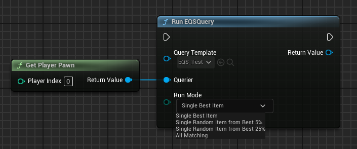
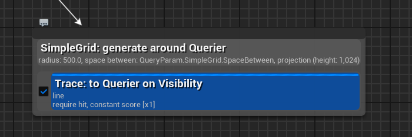

# EQS

> environment query system

场景查询系统，用于在场景中进行查询，用于找到目标对象或者目标点

前置知识，使用方法 https://zhuanlan.zhihu.com/p/608205899

## RunEQSQuery / RunEQS



以 `RunEQSQuery` 为起点，查看 UE 中做了哪些事情

在 `UEnvQueryManager::RunEQSQuery` 函数中是这么做的

```cpp
UEnvQueryManager* EQSManager = GetCurrent(WorldContextObject);
UEnvQueryInstanceBlueprintWrapper* QueryInstanceWrapper = nullptr;

QueryInstanceWrapper = NewObject<UEnvQueryInstanceBlueprintWrapper>(EQSManager, (UClass*)(WrapperClass) ? (UClass*)WrapperClass : UEnvQueryInstanceBlueprintWrapper::StaticClass());


FEnvQueryRequest QueryRequest(QueryTemplate, Querier);
QueryInstanceWrapper->SetInstigator(WorldContextObject);
QueryInstanceWrapper->RunQuery(RunMode, QueryRequest);
```

最后调用到 `FEnvQueryRequest::Execute` 函数中，通过 `EnvQueryManager::RunQuery` 开始流程

在 `UAITask_RunEQS::RunEQS` 是这么做的

```cpp
UAITask_RunEQS* MyTask = UAITask::NewAITask<UAITask_RunEQS>(*Controller, EAITaskPriority::High);
if (MyTask)
{
    MyTask->EQSRequest.QueryTemplate = QueryTemplate;
}
```

`UAITask_RunEQS` 是一个 Task，它真正执行的是在 `Active` 函数

```cpp
EQSRequest.Execute(*OwnerController->GetPawn(), OwnerController->GetBlackboardComponent(), EQSFinishedDelegate);
```

最后执行到 `FEnvQueryRequest::Execute` 函数中

```cpp
EnvQueryManager->RunQuery(*this, RunMode, FinishDelegate);
```

最后 `UAITask_RunEQS::RunEQS` 本质上还是调用 `UEnvQueryManager::RunQuery`

综上所述，两种请求方法最后都执行的是 `EnvQueryManager::RunQuery` 函数

### UEnvQueryManager::RunQuery

```cpp
int32 UEnvQueryManager::RunQuery(const FEnvQueryRequest& Request, EEnvQueryRunMode::Type RunMode, FQueryFinishedSignature const& FinishDelegate)
{
	TSharedPtr<FEnvQueryInstance> QueryInstance = PrepareQueryInstance(Request, RunMode);
	return RunQuery(QueryInstance, FinishDelegate);
}

int32 UEnvQueryManager::RunQuery(const TSharedPtr<FEnvQueryInstance>& QueryInstance, FQueryFinishedSignature const& FinishDelegate)
{
    // ... 一些前置判断
	QueryInstance->FinishDelegate = FinishDelegate;
	RunningQueries.Add(QueryInstance);
	return QueryInstance->QueryID;
}
```

可以发现 `RunQuery` 函数就是将 `FEnvQueryRequest` 转换为 `FEnvQUeryInstance` 并保存到 `RunnningQueries` 数组中

所以，本质上来说 `QueryEQS` 真的只是请求 EQS，并没有真正计算

### FEnvQUeryRequest

`FEnvQueryRequest` 结构体主要用于缓存一次请求数据

```cpp
TObjectPtr<const UEnvQuery> QueryTemplate;  // EQS 对应的资源文对象   
TObjectPtr<UObject> Owner;                  // 请求者
TObjectPtr<UWorld> World;                   // World 
TMap<FName, float> NamedParams;             // 名字及其对应的值 用于外部设置
```

### FEnvQueryInstance

通过 `UEnvQueryManager::PrepareQueryInstance` 函数将 `FEnvQueryRequest` 转换为 `FEnvQueryInstance`

`FEnvQueryInstance` 代表一个正在运行的查询实例。由于 EQS 可以在后台异步执行，每次运行查询时，都会深拷贝一份 Query 模板及其 Option/Test，确保线程安全和状态独立。它存储了当前的执行状态（如 CurrentTest 索引、生成的 Items、ItemDetails 等）。

简单来说 `FEnvQueryInstance` 存着一次请求运行时的数据

不过在介绍 `FEnvQueryInstance` 之前，先介绍 `FEnvQueryResult`

> `FEnvQueryInstance` 继承自 `FEnvQueryResult`

```cpp
struct FEnvQueryResult
{
    TArray<FEnvQueryItem> Items;    // 只存储 DataOffset（指向 RawData 的偏移量）和 Score
    TSubclassOf<UEnvQueryItemType> ItemType;
    TArray<uint8> RawData;      // 一个巨大的 TArray<uint8>，所有 Item 的具体数据（如 FVector）都紧密排列在这里
    EEnvQueryStatus::Type Status;
    int32 OptionIndex;
    int32 QueryID;
    TWeakObjectPtr<UObject> Owner;
}
```

`Status` 存储着当前请求的状态

```cpp
namespace EEnvQueryStatus
{
	enum Type : int
	{
		Processing,    // 正在运行中
		Success,       // 请求成功
		Failed,        // 请求失败
		Aborted,       // 中端
		OwnerLost,     // Owner 丢失
		MissingParam,  // 缺失参数
	};
}
```

#### ContextCache

`FEnvQueryInstance::ContextCache` 中缓存了上下文信息，每次请求时都是从 Cache 中获取，如果没有才会计算

`ContextCache` 以 UClass 为 Key， 对应的 Data 为 Value，通常来说每个 generate 只有一个 Context

> `TMap<UClass*, FEnvQueryContextData> ContextCache`

以 `UEnvQueryContext_Querier::ProvideContext` 为例，它是继承自 `UEnvQueryContext` 的，它是这么将 `AActor*` 封装成 `Data` 保存到 `ContextCache` 中的

```cpp
void UEnvQueryItemType_Actor::SetContextHelper(FEnvQueryContextData& ContextData, const AActor* SingleActor)
{
	ContextData.ValueType = UEnvQueryItemType_Actor::StaticClass();
	ContextData.NumValues = 1;
	ContextData.RawData.SetNumUninitialized(sizeof(FWeakObjectPtr));

	UEnvQueryItemType_Actor::SetValue(ContextData.RawData.GetData(), SingleActor);
}
```

通过 `ValueType` 指定 `ContextData` 所述的 `Context` 的类，将 `AAcotr*` 保存到 `RawData` 中

从 `UEnvQueryGenerator_SimpleGrid::GenerateItems` 函数中可以看到具体的实现逻辑

```cpp
TArray<FVector> ContextLocations;
QueryInstance.PrepareContext(GenerateAround, ContextLocations);
```

`GenerateAround` 就是配置的 `Context` 类，比如可以配置 `UEnvQueryContext_Querier`，那么在 `QueryInstance.PrepareContext` 的计算中就会

1. 通过 `UClass` 获取对应的 DefaultObject
2. 调用 CDO 的 `ProvideContext` 保存数到 ContextData 中
3. 后续通过 `ContextData` 的 `ValueType` 知道怎么获取坐标点，在将中心坐标点保存到 `ContextLocations` 中

通过这样一系列操作，`UEnvQueryGenerator_SimpleGrid` 就可以知道 Grid 的中心点，再通过中心点生成 Grid 的各个点坐标

#### Options

`Options` 是 `UEnvQueryOption` 数组，每个 `UEnvQueryOption` 保存着一个 Generator 和 一系列 Test

```cpp
class UEnvQueryOption : public UObject
{
	TObjectPtr<UEnvQueryGenerator> Generator;
	TArray<TObjectPtr<UEnvQueryTest>> Tests;
};
```



所以说，上图对应着一个 `UEnvQueryOption`

### UEnvQueryManager::PrepareQueryInstance

```cpp
TSharedPtr<FEnvQueryInstance> QueryInstance = CreateQueryInstance(Request.QueryTemplate, RunMode);

QueryInstance->World = GetWorldFast();              
QueryInstance->Owner = Request.Owner;
QueryInstance->StartTime = FPlatformTime::Seconds();
QueryInstance->NamedParams = Request.NamedParams;
QueryInstance->QueryID = NextQueryID++;
```

`PrepareQueryInstance` 函数主要分为两部分

1. 通过 `QueryTemplate` 来构建 `QueryInstance`，`QueryTemplate` 就是期待运行的 EQS 对应的 `UObject`
2. 根据 `FEnvQueryRequest` 来设置 `QueryInstance` 中的属性

在 `CreateQueryInstance` 函数中，有这么一段代码

```cpp
FEnvQueryInstance* InstanceTemplate = NULL;
for (int32 InstanceIndex = 0; InstanceIndex < InstanceCache.Num(); InstanceIndex++)
{
	if (InstanceCache[InstanceIndex].AssetName == TemplateFullName &&
		InstanceCache[InstanceIndex].Instance.Mode == RunMode)
	{
		InstanceTemplate = &InstanceCache[InstanceIndex].Instance;
		break;
	}
}
```

也就是说每个 EnvQueryTemplate 都会缓存其对应的 EnvQueryInstance，当下一次请求创建 EnvQueryInstance 的时候会先从缓存中获取，跳过创建初始化的步骤

> 这个 `InstanceCache` 保存在 `Manager` 中

针对创建逻辑，会先从 Template 复制一个 LocalTemplate，并将其封装成 Cache 并保存到 `InstanceCache` 中

剔除 `LocalTemplate` 中 **无效** 的 Options

1. 为 nullptr 的 Option
2. Generator 为空 的 Option
3. Generator 无效的 Option

对于 `Options` 中的 `Tests`

1. 剔除不支持 Generator 的 ItemType 的 Test 
2. 根据 `Test` 的 `TestOrder` 值进行排序

> `LocalOption->Tests.StableSort(EnvQueryTestSort::FAllMatching())` 排序逻辑

### Final

通过上面一系列操作，已经创建了一个 EnvQueryInstance，并将其添加到 Manager 的 RunningQueries 队列中，等待执行

## Tick

在 `UEnvQueryManager::Tick` 函数中

- 定义 Index，用于记录待处理的 `RunningQueries` 的数组序号
- 定义 TimeLeft，用于分帧处理，防止处理时间过长，导致游戏卡顿

1. 记录开始处理 `QueryInstance` 的 `StepStartTime`，用来更新 `TimeLeft` 的值
2. 判断 `QueryInstancePtr` 是否有效，无效直接跳过
3. 执行 `QueryInstance` 的 `ExecuteOneStep` 函数，用于真正计算一个 `EnvQuery`
4. 如果在 `ExecuteOneStep` 之后，`QueryInstance` 结束了，那么就可以执行 `FinishDelegate` 通知结束了


## StepStartTime

这是 EQS 的核心计算区域

这里的 `Step` 可能是

1. 生成候选项（generator 阶段）
2. 执行当前 Test （Test 阶段）
3. 在 step 结束后决定
   - 进入下一个 Test
   - 切到下一个 Option
   - 结束整个 Query

如果 `Owner` 失效了，该 EQS 也没有执行的必要，将该 `Instance` 标记为 `OwnerLost`

```cpp
if (!Owner.IsValid())
{
	MarkAsOwnerLost();
	return;
}
```

如果 `OptionIndex` 无效，说明 **配置走完** 或 **状态异常**，统一走 `FinalizeQuery` 结束

```cpp
if (!Options.IsValidIndex(OptionIndex))
{
    NumValidItems = 0;
    FinalizeQuery();
    return;
}
```

### generator 阶段

当 `CurrentTest` 值为 -1 时，表示该 Option 的 generator 还没有跑

> `CurrentTest` 对应从 0 到 N-1 个 Test

```cpp
FScopeCycleCounterUObject GeneratorScope(OptionItem.Generator);
OptionItem.Generator->GenerateItems(*this);
```

通过 `UEnvQueryGenerator::GenerateItems` 将候选项保存到 QueryInstance 中

以 `UEnvQueryGenerator_CurrentLocation` 为例，会将候选项通过 `AddItemData` 接口保存数据到 `Instance` 的 `Items` 和 `RawData` 中

```cpp
void UEnvQueryGenerator_CurrentLocation::GenerateItems(FEnvQueryInstance& QueryInstance) const
{
	TArray<FVector> ContextLocations;
	QueryInstance.PrepareContext(QueryContext, ContextLocations);

	for (const FVector& Location : ContextLocations)
	{
		FNavLocation NavLoc(Location);
		QueryInstance.AddItemData<UEnvQueryItemType_Point>(NavLoc);
	}
}
```

当候选项计算完毕之后，通过 `FinalizeGeneration` 初始化 `Test` 状态

### Test 阶段

通过 `CurrentTest` 知道当前正在运行第几个 `Test`

```cpp
bPassOnSingleResult = (bDoingLastTest && Mode == EEnvQueryRunMode::SingleResult && TestObject->CanRunAsFinalCondition());
```

如果当前 Test 是最后一个 Test，并且这个 Test 符合 `CanRunAsFinalCondition`，并且 Query 模式是 `SingleResult`，那么会进入 `bPassOnSingleResult` 状态

> `CanRunAsFinalCondition` 判断该 Test 是一个 Filter 过滤型 的 Test

`bPassOnSingleResult` 状态会先对 Items 根据 Score 进行排序，因为 `SingleResult` 说明只选择最优的；又最后一个 Test 是 Filter 型的，不用打分。所以可以先 排序，然后对每个 Item 进行 Test，第一个通过 Test 的 Item 就是最好的 Item

> 这是 UE 的一个优化策略

再就是执行 Test 逻辑

```cpp
{
	FScopeCycleCounterUObject TestScope(TestObject);
	TestObject->RunTest(*this);
}
```

以 `UEnvQueryTest_GameplayTags` 为例

```cpp
void UEnvQueryTest_GameplayTags::RunTest(FEnvQueryInstance& QueryInstance) const
{
	UObject* QueryOwner = QueryInstance.Owner.Get();
	if (QueryOwner == nullptr)
	{
		return;
	}

	BoolValue.BindData(QueryOwner, QueryInstance.QueryID);
	bool bWantsValid = BoolValue.GetValue();

	// If no GameplayTagAssetInterface is found then defer to the user preferred behavior
	const EEnvItemStatus::Type IncompatibleStatus = bRejectIncompatibleItems ? EEnvItemStatus::Failed : EEnvItemStatus::Passed;

	// loop through all items
	for (FEnvQueryInstance::ItemIterator It(this, QueryInstance); It; ++It)
	{
		const AActor* ItemActor = GetItemActor(QueryInstance, It.GetIndex());
		if (const IGameplayTagAssetInterface* GameplayTagAssetInterface = Cast<const IGameplayTagAssetInterface>(ItemActor))
		{
			bool bSatisfiesTest = SatisfiesTest(GameplayTagAssetInterface);

			// bWantsValid is the basically the opposite of bInverseCondition in BTDecorator.  Possibly we should
			// rename to make these more consistent.
			It.SetScore(TestPurpose, FilterType, bSatisfiesTest, bWantsValid);
		}
		else 
		{
			It.ForceItemState(IncompatibleStatus);
		}
	}
}
```

通过 `ItemIterator` 迭代器来遍历所有的 Item 待选项，通过自定义的计算方式来计算每个 Item 是否通过、对应的分数

当 Test 执行结束之后，执行 `FinalizeTest` 函数，通过 Test 对 Item 的分数进行归一化处理

```cpp
UEnvQueryTest* TestOb = OptionInstance.Tests[CurrentTest];
TestOb->NormalizeItemScores(*this);
```

推动到下一步

```cpp
if (bStepDone)
{
	CurrentTest++;
	CurrentTestStartingItem = 0;
#if USE_EQS_DEBUGGER
	NumProcessedItems = 0;
#endif // USE_EQS_DEBUGGER
}
```

接下来判断下一步的参数是否有效

1. 如果当前这个 `Option` 的 Test 全部执行完毕，判断 `NumValidItems` 是否存在有效的 Item，如果存在 说明该 Option 执行完毕，可以 `FinalizeQuery` 来结束 Query 了
2. 如果 NumValidItems <= 0，说明该 Options 不存在有效的 Item，可以提前结束后续的 Test 判断
   - 如果 `OptionIndex` 超过有效值，说明这个 Query 完全失败，直接 `FinalizeQuery` 
   - 如果 `OptionIndex` 仍然是有效值，则对下一个 `Option` 进行判断

```cpp
if (IsFinished() == false && (OptionItem.Tests.Num() == CurrentTest || NumValidItems <= 0))
{
	if (NumValidItems > 0)
	{
		// found items, sort and finish
		FinalizeQuery();
	}
	else
	{
		// no items here, go to next option or finish			
		if (OptionIndex + 1 >= Options.Num())
		{
			// out of options, finish processing without errors
			FinalizeQuery();
		}
		else
		{
			OptionIndex++;
			CurrentTest = -1;
		}
	}
}
```