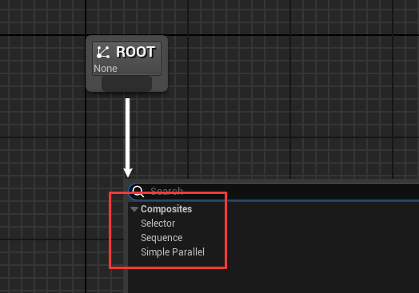
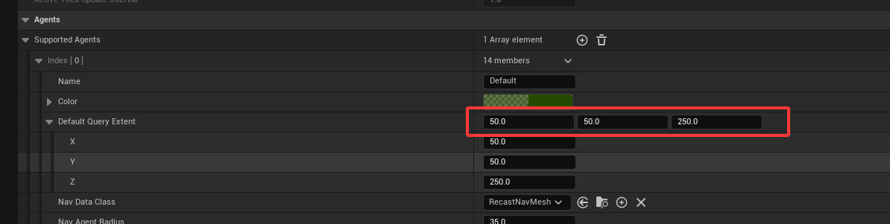
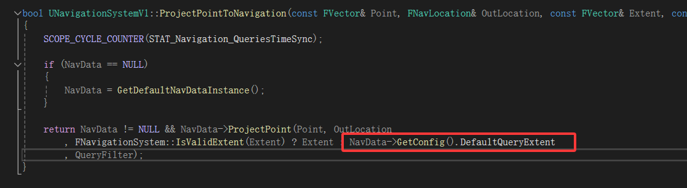
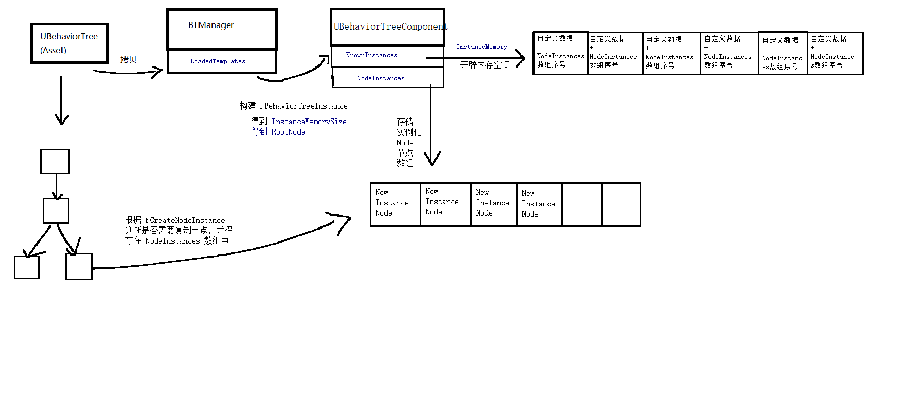

# AI

## 行为树

https://zhuanlan.zhihu.com/p/608864183

### 运行行为树之前

#### LoadTree

获取当前的 `BehaviorTreeManager`，每个 `UWorld` 中都有一个 `AISystem` 属性，用于 AI 管理，而 `AISystem` 中存储着 `BehaviorTreeManager` 

```cpp
UBehaviorTreeManager* UBehaviorTreeManager::GetCurrent(UWorld* World)
{
	UAISystem* AISys = UAISystem::GetCurrentSafe(World);
	return AISys ? AISys->GetBehaviorTreeManager() : nullptr;
}
```

在 `UBehaviorTreeComponent::PushInstance` 中会通过 `BTManager` 来加载行为树

```cpp
const bool bLoaded = BTManager->LoadTree(TreeAsset, RootNode, InstanceMemorySize);
```

通过 `LoadTree` 函数或者该行为树实例所占内存大小 `InstanceMemorySize` 和根节点 `Root`

通过 `UBehaviorTreeManager::LoadedTemplates` 缓存加载过的 `UBehaviorTree` 资产信息，如果加载过直接从缓存中获取 `InstanceMemorySize` 和 `Root`

如果没有加载过该 `UBehaviorTree` 资产，则开始加载

> 由于一个 `World` 的 `UBehaviorTreeManager` 是唯一的，所以理论上来说每个资产只会被加载一次

首先通过 `InitializeNodeHelper` 来缓存所有节点信息

```cpp
TArray<FBehaviorTreeNodeInitializationData> InitList;
uint16 ExecutionIndex = 0;
InitializeNodeHelper(NULL, TemplateInfo.Template, 0, ExecutionIndex, InitList, Asset, this);
```

> `TemplateInfo.Template` 就是 **根节点** 的复制体

然后计算每个节点占用的内存大小，计算并设置数据内存偏移

```cpp
for (int32 Index = 0; Index < InitList.Num(); Index++)
{
	InitList[Index].Node->InitializeNode(InitList[Index].ParentNode, InitList[Index].ExecutionIndex, InitList[Index].SpecialDataSize + MemoryOffset, InitList[Index].TreeDepth);
	MemoryOffset += InitList[Index].DataSize;
}
```

在运行时，会将每个节点的数据都保存在一个连续内存中，通过各自节点的 `MemoryOffset` 直接从连续内存中获取对应的数据

#### InitializeNodeHelper

虽然函数名字是 `InitializeNode`，其实是 复制 + 初始化，因为函数中充斥着 `StaticDuplicateObject`



首先，根节点一定是 `UBTCompositeNode`，从上图就可以看到 `Root` 下只能连接且只能连接一个 `UBTCompositeNode`

> `Composite`: 组合,混合

作为 `UBTCompositeNode` 自然保存着 **子节点** 和挂载在自己身上的 `Serve` 节点

```cpp
UCLASS(Abstract, MinimalAPI)
class UBTCompositeNode : public UBTNode
{
	TArray<FBTCompositeChild> Children;
	TArray<TObjectPtr<UBTService>> Services;
	// some function else ...
}

struct FBTCompositeChild
{
	TObjectPtr<UBTCompositeNode> ChildComposite = nullptr;
	TObjectPtr<UBTTaskNode> ChildTask = nullptr;
	TArray<TObjectPtr<UBTDecorator>> Decorators;
	TArray<FBTDecoratorLogic> DecoratorOps;
};
```

> `FBTCompositeChild` 代表子节点，根据 `ChildComposite` 和 `ChildTask` 的属性是否有效来判断是 `CompositeNode` 还是 `TaskNode`



由于根节点是 `UBTCompositeNode`，它不能也不应该存在 `UBTDecorator`，所以在上图中，根节点的 `UBTDecorator` 是深蓝色的，表示无效

回到 `InitializeNodeHelper` 函数中



#### 创建 FBehaviorTreeInstance

`FBehaviorTreeInstance` 用于管理一个行为树实例

通过 `BTManager->LoadTree` 得到 `RootNode` 和 `InstanceMemorySize`，既行为树的根节点和数据所占内存大小

```cpp
FBehaviorTreeInstance& NewInstance = InstanceStack.AddDefaulted_GetRef();
NewInstance.InstanceIdIndex = UpdateInstanceId(&TreeAsset, ActiveNode, InstanceStack.Num() - 1);
NewInstance.RootNode = RootNode;
NewInstance.ActiveNode = NULL;
NewInstance.ActiveNodeType = EBTActiveNode::Composite;

// initialize memory and node instances
FBehaviorTreeInstanceId& InstanceInfo = KnownInstances[NewInstance.InstanceIdIndex];
int32 NodeInstanceIndex = InstanceInfo.FirstNodeInstance;
const bool bFirstTime = (InstanceInfo.InstanceMemory.Num() != InstanceMemorySize);
if (bFirstTime)
{
	InstanceInfo.InstanceMemory.AddZeroed(InstanceMemorySize);
	InstanceInfo.RootNode = RootNode;
}

NewInstance.SetInstanceMemory(InstanceInfo.InstanceMemory);
NewInstance.Initialize(*this, *RootNode, NodeInstanceIndex, bFirstTime ? EBTMemoryInit::Initialize : EBTMemoryInit::RestoreSubtree);
```

> `InstanceIdIndex` 是为了解决嵌套行为树执行时，方便实例识别

| 参数类型 | 属性 | 作用 |
| --- | --- | --- |
| UBTCompositeNode* | RootNode | 行为树根节点 |
| UBTNode* | ActiveNode | 当前正在执行的节点 |
| TArray<UBTAuxiliaryNode*> | ActiveAuxNodes | 存储当前激活的辅助节点（） |
| TArray<FBehaviorTreeParallelTask> | ParallelTasks | 并行节点的多个任务 |
| TArray<uint8> | InstanceMemory | 节点运行实例的数据 |
| uint8 | InstanceIdIndex | 行为树实例的ID，对应 KnowInstances 数组的唯一实例 |
| FBTInstanceDeactivation | DeactivationNotify | 当前活动节点的类型 |
| FBTInstanceDeactivation | DeactivationNotify | 子树停用时的回调委托 |

节点类型如下

```cpp
namespace EBTActiveNode
{
	enum Type
	{
		Composite,		// 组合节点
		ActiveTask,		// 正在执行的任务
		AbortingTask,	// 正在停止的任务
		InactiveTask,	// 无活动节点
	};
}
```

注意这里的 `NewInstance.Initialize` 函数，对遍历根节点及其下的全部子节点，并调用 `UBTNode::InitializeInSubtree` 函数

```cpp
void FBehaviorTreeInstance::Initialize(UBehaviorTreeComponent& OwnerComp, UBTCompositeNode& Node, int32& InstancedIndex, EBTMemoryInit::Type InitType)
{
	for (int32 ServiceIndex = 0; ServiceIndex < Node.Services.Num(); ServiceIndex++)
	{
		// 对 Services 进行 InitializeInSubtree 操作
	}

	uint8* NodeMemory = Node.GetNodeMemory<uint8>(*this);
	Node.InitializeInSubtree(OwnerComp, NodeMemory, InstancedIndex, InitType);

	// 对子节点 Node 的子节点进行递归操作
}
```

在 `UBTNode::InitializeInSubtree` 函数中，对 `bCreateNodeInstance` 进行判断，如果是 `bCreateNodeInstance` 则创建一个新的 `UBTNode` 并添加到 `UBehaviorTreeComponent` 中

```cpp
if (bCreateNodeInstance)
{
	// some thing else ...
	if (NodeInstance == NULL)
	{
		NodeInstance = (UBTNode*)StaticDuplicateObject(this, &OwnerComp);
		NodeInstance->InitializeNode(GetParentNode(), GetExecutionIndex(), GetMemoryOffset(), GetTreeDepth());
		NodeInstance->bIsInstanced = true;

		OwnerComp.NodeInstances.Add(NodeInstance);
	}
	// NodeInstance 的 其他初始化操作 
}
```

当一切准备就绪，就可以开始准备运行行为树了

由于 根节点 中存在 Service，当行为树激活的时候，根节点顺便也把 Service 激活了

```cpp
for (int32 ServiceIndex = 0; ServiceIndex < RootNode->Services.Num(); ServiceIndex++)
{
	UBTService* ServiceNode = RootNode->Services[ServiceIndex];
	uint8* NodeMemory = (uint8*)ServiceNode->GetNodeMemory<uint8>(InstanceStack[ActiveInstanceIdx]);

	// send initial on search start events in case someone is using them for init logic
	ServiceNode->NotifyParentActivation(SearchData);

	InstanceStack[ActiveInstanceIdx].AddToActiveAuxNodes(ServiceNode);
	ServiceNode->WrappedOnBecomeRelevant(*this, NodeMemory);
}
```

> 注意 `WrappedOnBecomeRelevant` 函数，里面会判断是否需要创建实例，如果是创建出来的则使用 `UBehaviorTreeComponent` 中缓存的通过 `InitializeInSubtree` 添加的 `UBTNode`

综合来说

#### GetNodeInstance

在 `InitializeNodeHelper` 中遍历从 Asset 中复制节点，顺便记录节点信息并保存在 `InitList` 数组中

```cpp
FBehaviorTreeNodeInitializationData(UBTNode* InNode, UBTCompositeNode* InParentNode,
	uint16 InExecutionIndex, uint8 InTreeDepth, uint16 NodeMemory, uint16 SpecialNodeMemory = 0)
	: Node(InNode), ParentNode(InParentNode), ExecutionIndex(InExecutionIndex), TreeDepth(InTreeDepth)
{
	SpecialDataSize = UBehaviorTreeManager::GetAlignedDataSize(SpecialNodeMemory);

	const uint16 NodeMemorySize = NodeMemory + SpecialDataSize;
	DataSize = (NodeMemorySize <= 2) ? NodeMemorySize : UBehaviorTreeManager::GetAlignedDataSize(NodeMemorySize);
}

InitList.Add(FBehaviorTreeNodeInitializationData(NodeOb, ParentNode, ExecutionIndex, TreeDepth, NodeOb->GetInstanceMemorySize(), NodeOb->GetSpecialMemorySize()));
```

从 `FBehaviorTreeNodeInitializationData` 的构造函数中可以看到存在 `NodeMemory` 和 `SpecialNodeMemory`

- `NodeMemory` 对应数值是 `NodeOb->GetInstanceMemorySize()`
- `SpecialNodeMemory` 对应数值是 `NodeOb->GetSpecialMemorySize()`

- `DataSize` 是 `NodeMemory + SpecialDataSize` 并内存对齐的大小

`DataSize` 表示一个 `UBTNode` 运行时数据所占的内存大小，这块内存中存储着 `NodeMemory` 和 `SpecialNodeMemory`

`SpecialNodeMemory` 的大小根据 `bCreateNodeInstance` 而决定

`NodeMemory` 的大小根据每个节点自身的需求来决定

```cpp
struct FBTInstancedNodeMemory
{
	int32 NodeIdx;
};

uint16 UBTNode::GetSpecialMemorySize() const
{
	return bCreateNodeInstance ? sizeof(FBTInstancedNodeMemory) : 0;
}
```

所以，综上所述，每个 `DataSize` 的内存中分为两个部分：FBTInstancedNodeMemory 和 自定义存储数据结构体

如何使用 `FBTInstancedNodeMemory` 就是下面这段代码

```cpp
UBTNode* UBTNode::GetNodeInstance(const UBehaviorTreeComponent& OwnerComp, uint8* NodeMemory) const
{
	FBTInstancedNodeMemory* MyMemory = GetSpecialNodeMemory<FBTInstancedNodeMemory>(NodeMemory);
	return MyMemory && OwnerComp.NodeInstances.IsValidIndex(MyMemory->NodeIdx) ?
		OwnerComp.NodeInstances[MyMemory->NodeIdx] : NULL;
}
```

如果 `bCreateNodeInstance` 为 true，则表示创建一个新的实例，获取这个实例的方法就是上面这段代码

#### 综上所述



综上所述，代码的执行顺序大致如下


1. 通过 `BTManager->LoadTree` 将 `UBehaviorTree` 从 Asset 拷贝到 `LoadedTemplateds` 数组中
   - 从根节点递归 
   - 使用 `StaticDuplicateObject` 拷贝对象
   - 得到 `RootNode` 和 `InstanceMemorySize`
2. 通过 `RootNode` 和 `InstanceMemorySize` 构建 `FBehaviorTreeInstance` 行为树的运行实例
   - 遍历每个节点，根据 `bCreateNodeInstance` 判断是否需要创建，如果需要创建则使用 `StaticDuplicateObject` 并保存在实例运行的 `UBehaviorTreeComponent` 中
   - 存储正在运行的节点
   - 存储根节点
   - 存储其他信息
3. 在 `FBehaviorTreeInstance` 中初始化 `InstanceMemory` 连续内存
   - 根据 `bCreateNodeInstance` 的值，内存块中存储着自定义数据 和 对应 `NodeInstances` 数组的索引序号

实际上每次运行的行为树，仍然是 `BTManager::LoadedTemplated` 中复制的 Asset 的行为树

但是在执行节点逻辑的时候，根据 `bCreateNodeInstance` 的值来决定执行节点

- 如果实例化 Node，通过从 `FBehaviorTreeInstances` 的连续内存中获取 `UBehaviorTreeComponent::NodeInstances` 的数组序号，进而数组中获取实例化的节点
- 如果不实例化 Node，则直接行为 `LoadedTemplated` 中的行为树节点

注意 `GetNodeInstance` 函数，由于运行时会将 BTComponent 和 数据内存 都传入，又由于每个行为树是固定的，所以每个 BTNode 的内存数据偏移也都是固定的

通过 数据内存 和 内存偏移 可以得到当前 BTNode 存放数据的内存块的地址，就可以获取 bCrateNodeInstance 创建的实例化 BTNode 在 BTComponent::NodeInstances 数组的序号，进而获取到真正执行的 BTNode

> 遍历行为树的节点，并不一定就是执行的节点，这个需要区分
