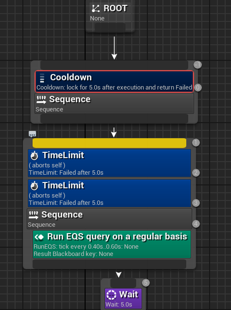
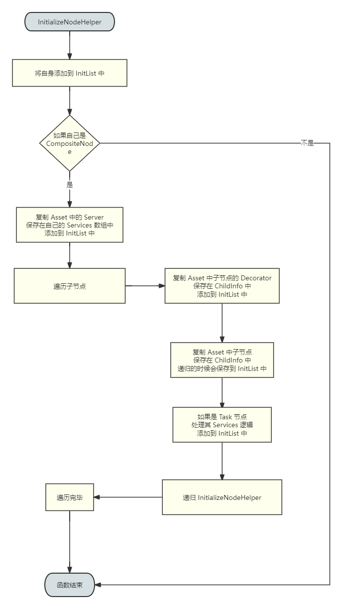

# AI

## 行为树

https://zhuanlan.zhihu.com/p/608864183

### 加载行为树

获取当前的 `BehaviorTreeManager`，每个 `UWorld` 中都有一个 `AISystem` 属性，用于 AI 管理，而 `AISystem` 中存储着 `BehaviorTreeManager` 

```cpp
UBehaviorTreeManager* UBehaviorTreeManager::GetCurrent(UWorld* World)
{
	UAISystem* AISys = UAISystem::GetCurrentSafe(World);
	return AISys ? AISys->GetBehaviorTreeManager() : nullptr;
}
```

在 `UBehaviorTreeComponent::PushInstance` 中会通过 `BTManager` 来加载行为树

```cpp
const bool bLoaded = BTManager->LoadTree(TreeAsset, RootNode, InstanceMemorySize);
```

通过 `LoadTree` 函数或者该行为树实例所占内存大小 `InstanceMemorySize` 和根节点 `Root`

通过 `UBehaviorTreeComponent::LoadedTemplates` 缓存加载过的 `UBehaviorTree` 资产信息，如果加载过直接从缓存中获取 `InstanceMemorySize` 和 `Root`

如果没有加载过该 `UBehaviorTree` 资产，则开始加载

首先通过 `InitializeNodeHelper` 来缓存所有节点信息

```cpp
TArray<FBehaviorTreeNodeInitializationData> InitList;
uint16 ExecutionIndex = 0;
InitializeNodeHelper(NULL, TemplateInfo.Template, 0, ExecutionIndex, InitList, Asset, this);
```

> `TemplateInfo.Template` 就是 **根节点** 的复制体

然后计算每个节点占用的内存大小，计算并设置数据内存偏移

```cpp
for (int32 Index = 0; Index < InitList.Num(); Index++)
{
	InitList[Index].Node->InitializeNode(InitList[Index].ParentNode, InitList[Index].ExecutionIndex, InitList[Index].SpecialDataSize + MemoryOffset, InitList[Index].TreeDepth);
	MemoryOffset += InitList[Index].DataSize;
}
```

在运行时，会将每个节点的数据都保存在一个连续内存中，通过各自节点的 `MemoryOffset` 直接从连续内存中获取对应的数据

#### InitializeNodeHelper

虽然函数名字是 `InitializeNode`，其实是 复制 + 初始化，因为函数中充斥着 `StaticDuplicateObject`


首先，根节点一定是 `UBTCompositeNode`，从上图就可以看到 `Root` 下只能连接且只能连接一个 `UBTCompositeNode`

> `Composite`: 组合,混合

作为 `UBTCompositeNode` 自然保存着 **子节点** 和挂载在自己身上的 `Serve` 节点

```cpp
UCLASS(Abstract, MinimalAPI)
class UBTCompositeNode : public UBTNode
{
	TArray<FBTCompositeChild> Children;
	TArray<TObjectPtr<UBTService>> Services;
	// some function else ...
}

struct FBTCompositeChild
{
	TObjectPtr<UBTCompositeNode> ChildComposite = nullptr;
	TObjectPtr<UBTTaskNode> ChildTask = nullptr;
	TArray<TObjectPtr<UBTDecorator>> Decorators;
	TArray<FBTDecoratorLogic> DecoratorOps;
};
```

> `FBTCompositeChild` 代表子节点，根据 `ChildComposite` 和 `ChildTask` 的属性是否有效来判断是 `CompositeNode` 还是 `TaskNode`



由于根节点是 `UBTCompositeNode`，它不能也不应该存在 `UBTDecorator`，所以在上图中，根节点的 `UBTDecorator` 是深蓝色的，表示无效

回到 `InitializeNodeHelper` 函数中




