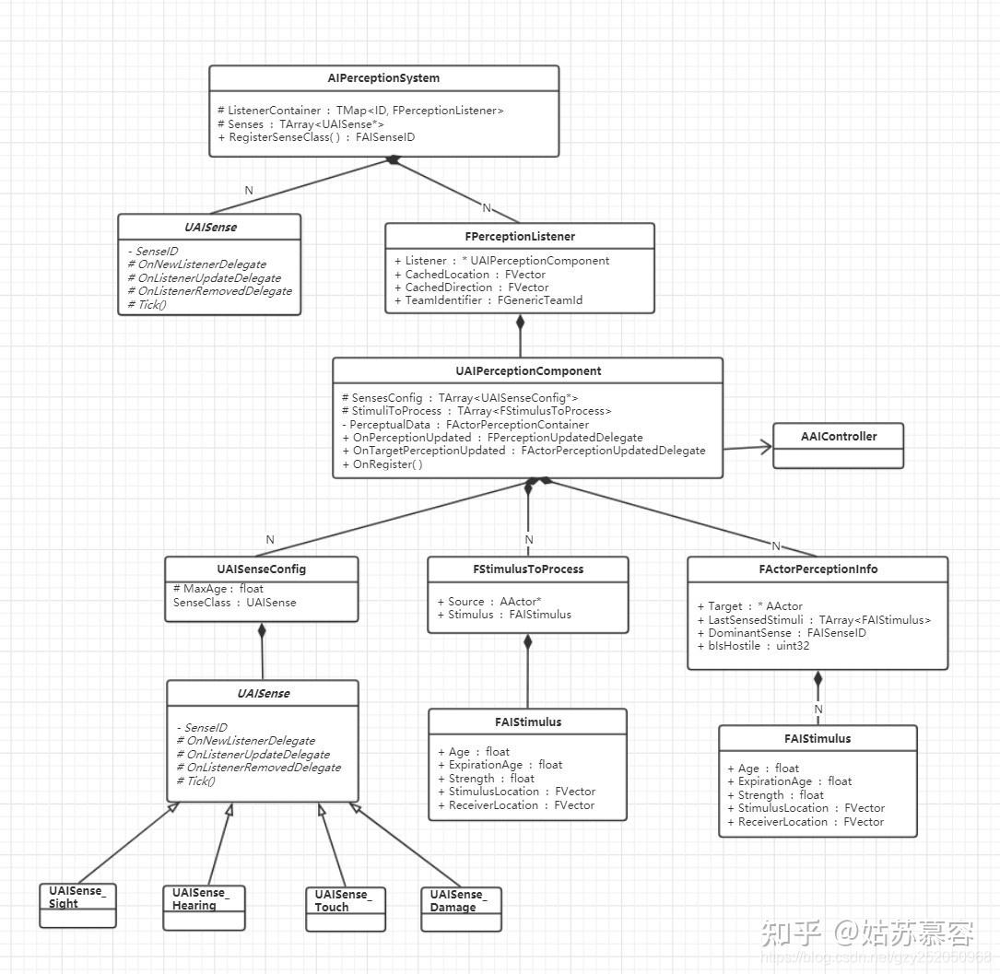
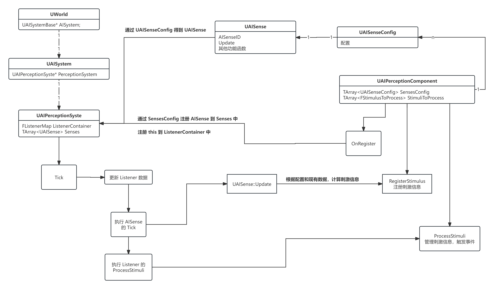
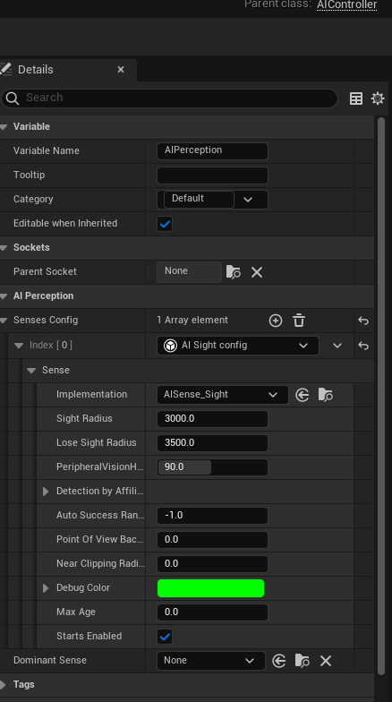
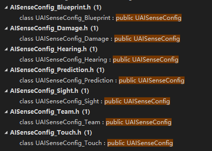
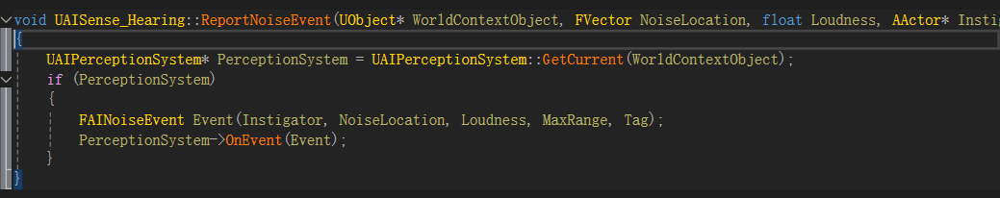
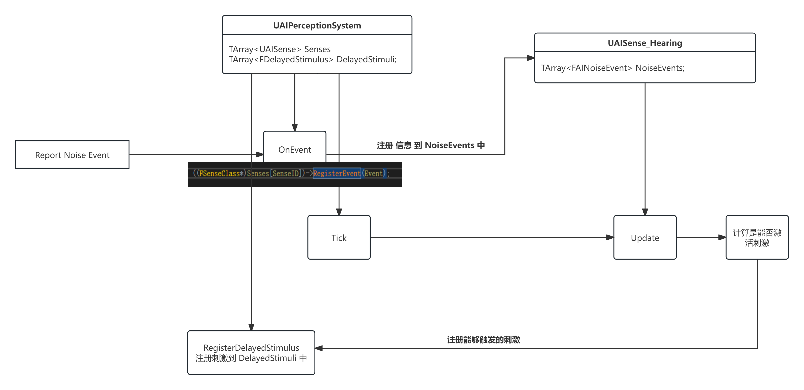

# 感知 AIPerception

通常来说 `AIPerceptionComponent` 应该放在 `AIController` 上。Pawn 提供接口用于控制行为，至于何时调用接口由 AIController 来决定

AI 感知系统分为五个部分

1. AIPerceptionSystem: AI感知系统 核心数据处理 信息传递
2. AISense: 提供具体 AI 感知的执行逻辑
3. AISenseConfig: 配置 AISense 所需数据
4. AIStimulus: 感知系统中的刺激
5. AIPerceptionComponent: 配置 AISenseConfig





大概内容如上图所展示

在场景中存在一个唯一的 `AIPerceptionSystem` 作为 感知系统 的管理器

每个 `Actor` 上都可以绑定一个 `AIPerceptionComponent` 用于配置 **感知** 数据

在 `AIPerceptionComponent` 的 `OnRegister` 的时候，会将 **自己** 和配置的 `AISenseConfig` 注册给 `AIPerceptionSystem`

> `AISenseConfig` 与 `AISense` 对应，通过 `AISenseConfig` 可以获取对应的 `AISense` 的 `Class`

相同类型的 `AISense` 不会重复创建，这是通过 `AISense` 中 `AISenseId` 属性来判断的

在 `AIPerceptionSystem` 的 `Tick` 中

1. 更新 Listener 的信息，也就是 `AIPerceptionComponent` 的位置信息
2. 执行每个 AISense 的 Tick 函数，会在里面根据收集到的各种信息，来判读是否触发 **刺激**，触发刺激时调用 Listener.RegisterStimulus 将信息注册保存起来
3. 判断 Listener 是否需要触发刺激，调用 Listener.ProcessStimuli

## 通用结构体

### UAISenseID

```cpp
struct FAISenseCounter : FAIBasicCounter<uint8>
{};
typedef FAINamedID<FAISenseCounter> FAISenseID;
```

这里出现两个结构体 `FAINamedID` 和 `FAIBasicCounter`

```cpp
template<typename TCounterType>
struct FAIBasicCounter
{
	typedef TCounterType Type;
protected:
	Type NextAvailableID;
public:
	FAIBasicCounter() : NextAvailableID(Type(0)) {}
	Type GetNextAvailableID() { return NextAvailableID++; }
	uint32 GetSize() const { return uint32(NextAvailableID); }
    // 其他工具函数
}
```

`FAIBasicCounter` 就是维护一个 TCounterType 类型的属性

> TCounterType 可能是 uint8、uint32 等，这里使用的是 uint8

```cpp
template<typename TCounter>
struct FAINamedID
{
	const typename TCounter::Type Index;
	const FName Name;
private:
	static AIMODULE_API TCounter Counter;
public:
	FAINamedID(const FName& InName)
		: Index(GetCounter().GetNextAvailableID()), Name(InName)
	{}

    // 其他函数
}
```

`FAINamedID` 的内容，总共有三个属性

1. Index 用于表示 ID
2. Name 用于表示对应的 AISense 的名称
3. `Counter` 就是 `FAIBasicCounter`

注意，`Counter` 属性是 `static` 的，也就是所有的 `AISenseID` 通用的

每次调用 `GetCounter().GetNextAvailableID()` 给 `FAISenseID` 的 `Index` 赋值的时候都会让 `NextAvailableID` 的值 +1

综上所述，简单来说

`FAIBasicCounter`，就是一个 uint8 的整数，每次创建一个全新的 `FAISenseID` 的时候都会让这个值 +1 

但是，不是每次都会创建 `FAISenseID` 

在 `UAIPerceptionSystem::RegisterSenseClass` 函数中可以看到如何获取 AISense 的 AISenseID 的

```cpp
FAISenseID SenseID = UAISense::GetSenseID(SenseClass);

static FAISenseID GetSenseID(const TSubclassOf<UAISense> SenseClass) { return SenseClass ? ((const UAISense*)SenseClass->GetDefaultObject())->SenseID : FAISenseID::InvalidID(); }
```

没错，是从 CDO 中获取 AISenseID 的

这也就意味着，每种类型的 FAISence 对应的 FAISenseID 是相同的

如果是一个全新类型的 FAISense，它没有有效的 SenseID，那么会通过来创建一个新的 FAISenseID

```cpp
FAISenseID UAISense::UpdateSenseID()
{
	if (SenseID.IsValid() == false)
	{
		SenseID = FAISenseID(GetFName());
	}
	return SenseID;
}
```
 
> 注意，这里的构造函数，使得 Counter.NextAvailableID 的数值 +1

所以说，总共有多少个 FAISense，那么其对应的 AISenseID 最大值就是多少

这也是为什么 `PerceptionFilter` 可以只用一个 int32 来过滤 FAISense，毕竟一个项目一般不会超过 32 中类型的 FAISense

> 注意 Counter.NextAvailableID 是 uint8 类型的，也就是 2^8 = 32

### FPerceptionChannelAllowList


```cpp
struct FPerceptionChannelAllowList
{
	typedef int32 FFlagsContainer;
	FFlagsContainer AcceptedChannelsMask;

	FORCEINLINE_DEBUGGABLE FPerceptionChannelAllowList& AcceptChannel(FAISenseID Channel)
	{
		AcceptedChannelsMask |= (1 << Channel);
		return *this;
	}

	FORCEINLINE bool ShouldRespondToChannel(FAISenseID Channel) const
	{
		return (AcceptedChannelsMask & (1 << Channel)) != 0;
	}
    // 其他功能函数
}
```

结构非常简单， `FPerceptionChannelAllowList` 用于维护一个 int32 的属性，该属性用于做位运算

参考 `AcceptChannel` 函数实现，每个 `AISenseID` 都对应 `AcceptedChannelsMask` 32 位中的一个位

那么，使用位运算就可以很方便的对 AISense 进行过滤，或者判断是否需要对该 AISense 做出反应

> `ShouldRespondToChannel` 函数的作用就是过滤

### FPerceptionListener

用于存储一个 Listener 的相关信息

```cpp
struct FPerceptionListener
{
	TWeakObjectPtr<UAIPerceptionComponent> Listener;	// Listener 的感知组件
	FPerceptionChannelAllowList Filter;					// Listener 的过滤器
	FVector CachedLocation;					// 缓存 Listener 的坐标
	FVector CachedDirection;				// 缓存 Listener 的朝向
	FGenericTeamId TeamIdentifier;			// Listener 的队伍信息
private:
	uint32 bHasStimulusToProcess : 1;		// 是否由新的刺激
	FPerceptionListenerID ListenerID;		// 
	// 其他函数
}
```

## 感知配置 UAISenseConfig





```cpp
class UAISenseConfig : public UObject
{
	GENERATED_BODY()

protected:
	UPROPERTY(EditAnywhere, BlueprintReadOnly, Category = Sense, AdvancedDisplay)
	FColor DebugColor;

	UPROPERTY(EditDefaultsOnly, BlueprintReadOnly, Category = Sense, meta = (ClampMin = "0.0", UIMin = "0.0"))
	float MaxAge;

	UPROPERTY(EditDefaultsOnly, BlueprintReadOnly, Category = Sense)
	uint32 bStartsEnabled : 1;

	mutable FString CachedSenseName;

	AIMODULE_API virtual TSubclassOf<UAISense> GetSenseImplementation() const;

    // other functions ...
}
```

`MaxAge` 表示当该 `AISense` 被触发之后，多长时间遗忘，如果值为 0 表示从不遗忘

`UAISenseConfig` 只是用于配置，真正的功能实现是在 `GetSenseImplementation` 返回的实例对象

```cpp
TSubclassOf<UAISense> UAISenseConfig_Damage::GetSenseImplementation() const
{
    // TSubclassOf<UAISense_Damage> Implementation;
	return Implementation;
}

TSubclassOf<UAISense> UAISenseConfig_Sight::GetSenseImplementation() const 
{ 
    // TSubclassOf<UAISense_Sight> Implementation;
	return *Implementation; 
}

TSubclassOf<UAISense> UAISenseConfig_Touch::GetSenseImplementation() const
{
	return UAISense_Touch::StaticClass();
}
```

> `UAISenseConfig_Sight` 的 `GetSenseImplementation` 返回的是 `*Implementation` 就是 `UClass`，然后再构造新的 `TSubclassOf<UAISense>` 作为返回值

在 `UAIPerceptionComponent` 就存储着这些配置的数组

```cpp
UPROPERTY(EditDefaultsOnly, Instanced, Category = "AI Perception")
TArray<TObjectPtr<UAISenseConfig>> SensesConfig;
```

## AIPerceptionComponent

Actor 的生命周期

1. UObject::PostLoad，当 Actor 被拖到场景中
2. UActorComponent:OnComponentCreated 当 Actor 被创建出来时调用
3. AActor::PreRegisterAllComponents
   1. UActorComponent::RegisterComponent
4. AActor::PostRegisterAllComponents
5. AActor::PostActorCreated
6. AActor::UserConstructionScript
7. AActor::OnConstruction
8. AActor::PostActorConstruction
9.  AActor::PreInitializeComponents
10. AActor::InitializeComponents
    1. AActorComponent::Activate
    2. AActorComponent::InitializeComponent
11. AActor::PostInitializeComponents
12. AActor::OnActorSpawned
13. AActor::BeginPlay

在 `UAIPerceptionComponent::OnRegister` 中会将自己注册到 `UAIPerceptionSystem` 中

```cpp
void UAIPerceptionComponent::OnRegister()
{
    // 注册 EndPlay
    Owner->OnEndPlay.AddUniqueDynamic(this, &UAIPerceptionComponent::OnOwnerEndPlay);
    // 其他设置

	UAIPerceptionSystem* AIPerceptionSys = UAIPerceptionSystem::GetCurrent(GetWorld());

    for (auto SenseConfig : SensesConfig)
    {
        if (SenseConfig)
        {
            RegisterSenseConfig(*SenseConfig, *AIPerceptionSys);
        }
    }

    AIPerceptionSys->UpdateListener(*this);
    
    // 其他设置
}
```

当 `OnOwnerEndPlay` 或者 `OnUnregister` 的时候会执行 `CleanUp`

```cpp
void UAIPerceptionComponent::CleanUp()
{
    // 其他操作

    // UnregisterListener
    UAIPerceptionSystem* AIPerceptionSys = UAIPerceptionSystem::GetCurrent(GetWorld());
    if (AIPerceptionSys != nullptr)
    {
        AIPerceptionSys->UnregisterListener(*this);
        AActor* MutableBodyActor = GetMutableBodyActor();
        if (MutableBodyActor)
        {
            AIPerceptionSys->UnregisterSource(*MutableBodyActor);
        }
    }

    // 取消事件监听
    Owner->OnEndPlay.RemoveDynamic(this, &UAIPerceptionComponent::OnOwnerEndPlay);
}
```

### RegisterSenseConfig

`UAIPerceptionComponent::RegisterSenseConfig` 核心逻辑就下面这三步

1. 获取 UAISenseConfig 对应的 UAISense 实际运行类
2. 将 UAISense 注册到  AIPercetionSystem 中
3. 将 UAISense 对应的 SenseID 添加到 PerceptionFilter 中
4. 缓存 UAISense 对应的 MaxAge

```cpp
const TSubclassOf<UAISense> SenseImplementation = SenseConfig.GetSenseImplementation();
const FAISenseID SenseID = AIPerceptionSys.RegisterSenseClass(SenseImplementation);
PerceptionFilter.AcceptChannel(SenseID);
SetMaxStimulusAge(SenseID, SenseConfig.GetMaxAge());
```

`PerceptionFilter` 是什么？

`PerceptionFilter` 就是 `FPerceptionChannelAllowList`，一个用于判断是否需要对指定 `AISenseID` 做出反应的结构体

### 事件

所有感知事件的触发都是通过事件的方式，传递出去的

| 事件 | 作用 |
| --- | --- |
| OnPerceptionUpdated | 全局感知更新事件，所有在本批处理中状态变化的Actor |
| OnTargetPerceptionForgotten | 特定目标被完全遗忘时触发。表示系统不再跟踪该目标的任何感知信息 |
| OnTargetPerceptionUpdated | 特定目标的感知状态变化通知。提供源Actor和具体刺激数据，但要求源Actor必须有效 |
| OnTargetPerceptionInfoUpdated | 更可靠的目标感知状态变化通知。使用FActorPerceptionUpdateInfo结构传递数据，即使源Actor已销毁仍会触发 |

### RegisterStimulus

对外接口，用于注册一个 刺激 信息

```cpp
void UAIPerceptionComponent::RegisterStimulus(AActor* Source, const FAIStimulus& Stimulus)
{
	FStimulusToProcess& StimulusToProcess = StimuliToProcess.Add_GetRef(FStimulusToProcess(Source, Stimulus));
	StimulusToProcess.Stimulus.SetExpirationAge(MaxActiveAge[int32(Stimulus.Type)]);
}
```

### ProcessStimuli

当有 Stimuli 刺激的时候，会由 `AIPerceptionSystem` 调用该函数

用于处理在 `RegisterStimulus` 中添加到 `StimuliToProcess` 的数据


## AIPerceptionSystem

### 成员属性

- SourcesToRegister 

`FPerceptionSourceRegistration` 结构体中， `SenseID` 表示是哪个 `AISense` 在监听， `Source` 表示被监听的对象

如果一个 `AISense` 的 `bAutoRegisterAllPawnsAsSources` 为 true，那么会在 `OnNewPawn` 的时候将 `NewPawn` 和该 `AISense` 注册到 `SourceToRegister` 中

```cpp
struct FPerceptionSourceRegistration
{
	FAISenseID SenseID;
	TWeakObjectPtr<AActor> Source;
	// 其他函数
}
TArray<FPerceptionSourceRegistration> SourcesToRegister;
```

- RegisteredStimuliSources

`FPerceptionStimuliSource` 结构体中存储这被监听的对象，以及该对象会触发哪些 `AISense`

> `FPerceptionChannelAllowList` 维护着一个 uint32，每一位代表着一种 AISense

`RegisteredStimuliSources` 存储着一个 `Actor` 和所有关心这个 `Actor` 的 `AISense`

```cpp
struct FPerceptionStimuliSource
{
	TWeakObjectPtr<AActor> SourceActor;
	FPerceptionChannelAllowList RelevantSenses;
};

TMap<const AActor*, FPerceptionStimuliSource> RegisteredStimuliSources;
```

- DelayedStimuli

```cpp
struct FDelayedStimulus
{
	double DeliveryTimestamp;				// 交付时间戳 并不是立刻触发刺激
	FPerceptionListenerID ListenerId;		// Linsener 的 ID
	TWeakObjectPtr<AActor> Instigator;		// 刺激源 Actor
	FAIStimulus Stimulus;					// 刺激信息
};

TArray<FDelayedStimulus> DelayedStimuli;
```

以 `UAISense_Hearing::Update` 为例，`DistToSoundSquared` 表示生源与接收者之间距离的平方，`SpeedOfSoundSqScalar` 表示声音速度平方的倒数

通过 `DistToSoundSquared * SpeedOfSoundSqScalar` 计算得到从声音发出到目标听到声音所需要的时间间隔

> `SpeedOfSoundSqScalar` 默认值为 0，表示无时间间隔

```cpp
const float Delay = FloatCastChecked<float>(FMath::Sqrt(DistToSoundSquared * SpeedOfSoundSqScalar), UE::LWC::DefaultFloatPrecision);
```

> `SpeedOfSoundSqScalar` 通过 `SpeedOfSoundSq` 初始化， `SpeedOfSoundSq` 在 `BaseGame.ini` 文件中配置，默认值为 0


### RegisterSenseClass

由 `AIPerceptionComponent` 在 `OnRegister` 的时候调用

```cpp
if (Senses[SenseID] == nullptr)
{
	Senses[SenseID] = NewObject<UAISense>(this, SenseClass);
	
	if (Senses[SenseID]->ShouldAutoRegisterAllPawnsAsSources())
	{
		UWorld* World = GetWorld();
		if (World->HasBegunPlay())
		{
			World->GetTimerManager().SetTimerForNextTick(FTimerDelegate::CreateUObject(this, &UAIPerceptionSystem::RegisterAllPawnsAsSourcesForSense, SenseID));
		}
	}
}
```

`RegisterAllPawnsAsSourcesForSense` 在做的事情，就是遍历场景中所有的 Pawn 并将其添加到 `SourcesToRegister` 中

```cpp
UWorld* World = GetWorld();
for (TActorIterator<APawn> PawnIt(World); PawnIt; ++PawnIt)
{
	SourcesToRegister.AddUnique(FPerceptionSourceRegistration(SenseID, &SourceActor));
}
```

### UpdateListener

当传入一个新的 Listener 时，如果这 Listener 没有 ListenerID，需要生成一个 ListenerID 并设置给 Linstener

> `Lisnter` 是 `UAIPerceptionComponent`

```cpp
const FPerceptionListenerID NewListenerId = FPerceptionListenerID::GetNextID();
Listener.StoreListenerId(NewListenerId);
FPerceptionListener& ListenerEntry = ListenerContainer.Add(NewListenerId, FPerceptionListener(Listener));
ListenerEntry.CacheLocation();

// 通知现有的 Sense 有新的 Listerner
OnNewListener(ListenerContainer[NewListenerId]);
```

> `FPerceptionListenerID::GetNextID()` 可以直接理解为一个 static 的全局 int32 变量执行 +1 操作

缓存 `ListenerID` 和 `Listener` 缓存到 `ListenerContainer` 容器中

然后通知所有现有的 `AISense` 有新的 `Listener` 了

### OnNewPawn

在 `UAISystem` 的 `PostInitProperties` 的时候，监听了 `Pawn` 的 BeginPlay 事件

```cpp
PawnBeginPlayDelegateHandle = APawn::OnPawnBeginPlay.AddUObject(this, &UAISystem::OnPawnBeginPlay);
```

在 `OnPawnBeginPlay` 的时候调用 `AIPerceptionSystem` 的 `OnNewPawn`

```cpp
if (PawnWorld == GetWorld())
{
	PerceptionSystem->OnNewPawn(*Pawn);
}
```

在 `AIPerceptionSystem` 的 `OnNewPawn` 主要是为了通知 `AISense`，顺便增量更新 `SourcesToRegister` 的内容

```cpp
for (UAISense* Sense : Senses)
{
	if (Sense->WantsNewPawnNotification())
	{
		Sense->OnNewPawn(Pawn);
	}

	if (Sense->ShouldAutoRegisterAllPawnsAsSources())
	{
		FAISenseID SenseID = Sense->GetSenseID();
		SourcesToRegister.AddUnique(FPerceptionSourceRegistration(SenseID, &SourceActor));
	}
}
```

> 毕竟不可能总是遍历 World 内所有的 Pawn 来更新 SourcesToRegister 的值

### Tick

整体流程大概如下

1. 更新 `RegisteredStimuliSources` 数据
2. 更新所有 Listener 的数据
3. 调用每个 AISense 的 Tick
4. 处理所有 DelayedStimulus 刺激，注册给 Listener
5. 通知 Listener 处理刺激


- 执行 `PerformSourceRegistration`

将 `SourcesToRegister` 中存储的 Source Actor 注册到对应的 AISense 中

将 `SourcesToRegister` 中的数据转换到 `RegisteredStimuliSources` 中，并清空 `SourcesToRegister`

```cpp
// 注册 Source Actor 到 AISense 中
Senses[PercSource.SenseID]->RegisterSource(*SourceActor);

// 将 Source Actor 转存到 RegisteredStimuliSources 中
FPerceptionStimuliSource& StimuliSource = RegisteredStimuliSources.FindOrAdd(SourceActor);
StimuliSource.SourceActor = SourceActor;
StimuliSource.RelevantSenses.AcceptChannel(PercSource.SenseID);
```

- 更新 Listener 的缓存信息，清理无效 Listener

```cpp
for (AIPerception::FListenerMap::TIterator ListenerIt(ListenerContainer); ListenerIt; ++ListenerIt)
{
	if (ListenerIt->Value.Listener.IsValid())
	{
		ListenerIt->Value.CacheLocation();
	}
	else
	{
		OnListenerRemoved(ListenerIt->Value);
		ListenerIt.RemoveCurrent();
	}
}
```

- 执行每个 AISense 的 Tick 

```cpp
for (UAISense* const SenseInstance : Senses)
{
	if (SenseInstance != nullptr)
	{
		SenseInstance->Tick();
	}
}
```

> `UAISense::Tick` 去调用 `UAISense::Update` 函数，积累都是重写 `Update` 函数

- 执行 `DeliverDelayedStimuli`

将 `DelayedStimuli` 按 刺激 触发时间进行排序，将所有在 `CurrentTime` 之前的 刺激 全部注册给 `Listener`

```cpp
ListenerEntry.RegisterStimulus(DelayedStimulus.Instigator.Get(), DelayedStimulus.Stimulus);
```

> 触发 `AIPerceptionComponent` 的 `RegisterStimulus`

- 遍历所有的 Listener，如果存在新的刺激(Stimuli)，通知其执行

```cpp
for (AIPerception::FListenerMap::TIterator ListenerIt(ListenerContainer); ListenerIt; ++ListenerIt)
{
	if (ListenerIt->Value.HasAnyNewStimuli())
	{
		ListenerIt->Value.ProcessStimuli();
	}
}
```

`ProcessStimuli` 的内容就是设置 `bHasStimulusToProcess` 标记为为 false，清除刺激状态，调用 `Listener->ProcessStimuli()` 通知 `AIPerceptionComponent` 执行逻辑


## 感知行为实现 UAISense

以 `AISense_Hearing` 为例

如果想要触发一次 Hearing 的刺激，在蓝图中调用 `Report Noise Event`



```cpp
template<typename FEventClass, typename FSenseClass = typename FEventClass::FSenseClass>
void OnEvent(const FEventClass& Event)
{
	const FAISenseID SenseID = UAISense::GetSenseID<FSenseClass>();
	if (Senses.IsValidIndex(SenseID) && Senses[SenseID] != nullptr)
	{
		((FSenseClass*)Senses[SenseID])->RegisterEvent(Event);
	}
}
```



在 `UAISense_Hearing::Update` 函数中，处理注册到 `NoiseEvents` 中的事件

获取 `AIPerceptionSystem` 中所有的 Listeners

双重遍历，首先遍历 Listeners，然后对每个 Listener 遍历 NoiseEvents 判断该 Noise 能否激活

对于能够激活的 刺激，收集其信息，并通过 `RegisterDelayedStimulus` 注册到 `AIPerceptionSystem` 中 

```cpp
auto ListenersMap = PerceptionSystemInstance->GetListenersMap();
for (AIPerception::FListenerMap::TIterator ListenerIt(ListenersMap); ListenerIt; ++ListenerIt)
{
	for (const FAINoiseEvent& Event : NoiseEvents)
	{
		// 距离 时间 判断
		
		// 符合条件的
		const float Delay = FloatCastChecked<float>(FMath::Sqrt(DistToSoundSquared * SpeedOfSoundSqScalar), UE::LWC::DefaultFloatPrecision);
		PerseptionSys->RegisterDelayedStimulus(Listener.GetListenerID(), Delay, Event.Instigator
			, FAIStimulus(*this, ClampedLoudness, Event.NoiseLocation, Listener.CachedLocation, FAIStimulus::SensingSucceeded, Event.Tag) );

	}
}
```

除了类似 `UAISense_Hearing` 通过 `RegisterDelayedStimulus` 注册刺激信息之外

还可以参考 `UAISense_Sight`，直接通过 `Listener.RegisterStimulus` 向 `AIPerceptionComponent` 注册刺激信息
