# AI

## 行为树

https://zhuanlan.zhihu.com/p/608864183

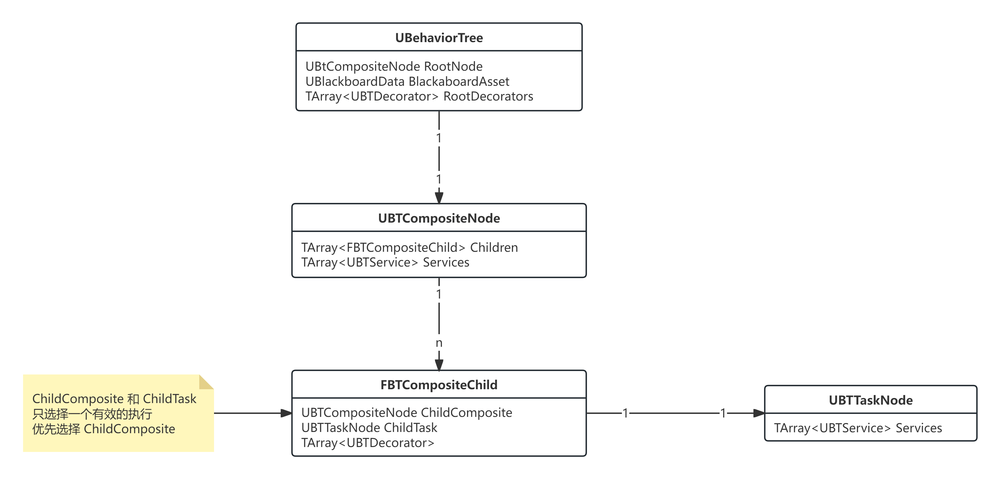

### 运行行为树之前

#### LoadTree

获取当前的 `BehaviorTreeManager`，每个 `UWorld` 中都有一个 `AISystem` 属性，用于 AI 管理，而 `AISystem` 中存储着 `BehaviorTreeManager` 

```cpp
UBehaviorTreeManager* UBehaviorTreeManager::GetCurrent(UWorld* World)
{
	UAISystem* AISys = UAISystem::GetCurrentSafe(World);
	return AISys ? AISys->GetBehaviorTreeManager() : nullptr;
}
```

在 `UBehaviorTreeComponent::PushInstance` 中会通过 `BTManager` 来加载行为树

```cpp
const bool bLoaded = BTManager->LoadTree(TreeAsset, RootNode, InstanceMemorySize);
```

通过 `LoadTree` 函数或者该行为树实例所占内存大小 `InstanceMemorySize` 和根节点 `Root`

通过 `UBehaviorTreeManager::LoadedTemplates` 缓存加载过的 `UBehaviorTree` 资产信息，如果加载过直接从缓存中获取 `InstanceMemorySize` 和 `Root`

如果没有加载过该 `UBehaviorTree` 资产，则开始加载

> 由于一个 `World` 的 `UBehaviorTreeManager` 是唯一的，所以理论上来说每个资产只会被加载一次

首先通过 `InitializeNodeHelper` 来缓存所有节点信息

```cpp
TArray<FBehaviorTreeNodeInitializationData> InitList;
uint16 ExecutionIndex = 0;
InitializeNodeHelper(NULL, TemplateInfo.Template, 0, ExecutionIndex, InitList, Asset, this);
```

> `TemplateInfo.Template` 就是 **根节点** 的复制体

然后计算每个节点占用的内存大小，计算并设置数据内存偏移

```cpp
for (int32 Index = 0; Index < InitList.Num(); Index++)
{
	InitList[Index].Node->InitializeNode(InitList[Index].ParentNode, InitList[Index].ExecutionIndex, InitList[Index].SpecialDataSize + MemoryOffset, InitList[Index].TreeDepth);
	MemoryOffset += InitList[Index].DataSize;
}
```

在运行时，会将每个节点的数据都保存在一个连续内存中，通过各自节点的 `MemoryOffset` 直接从连续内存中获取对应的数据

#### InitializeNodeHelper

虽然函数名字是 `InitializeNode`，其实是 复制 + 初始化，因为函数中充斥着 `StaticDuplicateObject`

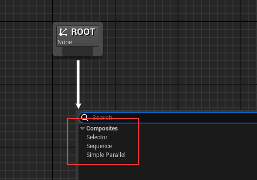

首先，根节点一定是 `UBTCompositeNode`，从上图就可以看到 `Root` 下只能连接且只能连接一个 `UBTCompositeNode`

> `Composite`: 组合,混合

作为 `UBTCompositeNode` 自然保存着 **子节点** 和挂载在自己身上的 `Serve` 节点

```cpp
UCLASS(Abstract, MinimalAPI)
class UBTCompositeNode : public UBTNode
{
	TArray<FBTCompositeChild> Children;
	TArray<TObjectPtr<UBTService>> Services;
	// some function else ...
}

struct FBTCompositeChild
{
	TObjectPtr<UBTCompositeNode> ChildComposite = nullptr;
	TObjectPtr<UBTTaskNode> ChildTask = nullptr;
	TArray<TObjectPtr<UBTDecorator>> Decorators;
	TArray<FBTDecoratorLogic> DecoratorOps;
};
```

> `FBTCompositeChild` 代表子节点，根据 `ChildComposite` 和 `ChildTask` 的属性是否有效来判断是 `CompositeNode` 还是 `TaskNode`

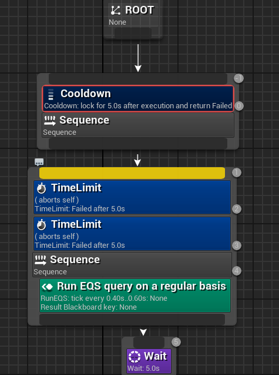

由于根节点是 `UBTCompositeNode`，它不能也不应该存在 `UBTDecorator`，所以在上图中，根节点的 `UBTDecorator` 是深蓝色的，表示无效

回到 `InitializeNodeHelper` 函数中

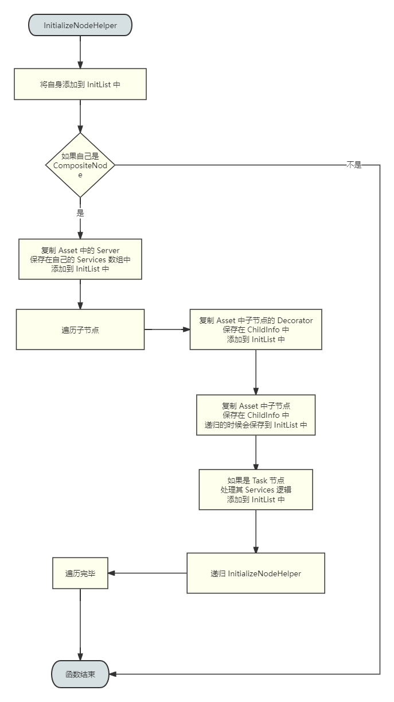

#### 创建 FBehaviorTreeInstance

`FBehaviorTreeInstance` 用于管理一个行为树实例

通过 `BTManager->LoadTree` 得到 `RootNode` 和 `InstanceMemorySize`，既行为树的根节点和数据所占内存大小

```cpp
FBehaviorTreeInstance& NewInstance = InstanceStack.AddDefaulted_GetRef();
NewInstance.InstanceIdIndex = UpdateInstanceId(&TreeAsset, ActiveNode, InstanceStack.Num() - 1);
NewInstance.RootNode = RootNode;
NewInstance.ActiveNode = NULL;
NewInstance.ActiveNodeType = EBTActiveNode::Composite;

// initialize memory and node instances
FBehaviorTreeInstanceId& InstanceInfo = KnownInstances[NewInstance.InstanceIdIndex];
int32 NodeInstanceIndex = InstanceInfo.FirstNodeInstance;
const bool bFirstTime = (InstanceInfo.InstanceMemory.Num() != InstanceMemorySize);
if (bFirstTime)
{
	InstanceInfo.InstanceMemory.AddZeroed(InstanceMemorySize);
	InstanceInfo.RootNode = RootNode;
}

NewInstance.SetInstanceMemory(InstanceInfo.InstanceMemory);
NewInstance.Initialize(*this, *RootNode, NodeInstanceIndex, bFirstTime ? EBTMemoryInit::Initialize : EBTMemoryInit::RestoreSubtree);
```

> `InstanceIdIndex` 是为了解决嵌套行为树执行时，方便实例识别

| 参数类型 | 属性 | 作用 |
| --- | --- | --- |
| UBTCompositeNode* | RootNode | 行为树根节点 |
| UBTNode* | ActiveNode | 当前正在执行的节点 |
| TArray<UBTAuxiliaryNode*> | ActiveAuxNodes | 存储当前激活的辅助节点（） |
| TArray<FBehaviorTreeParallelTask> | ParallelTasks | 并行节点的多个任务 |
| TArray<uint8> | InstanceMemory | 节点运行实例的数据 |
| uint8 | InstanceIdIndex | 行为树实例的ID，对应 KnowInstances 数组的唯一实例 |
| FBTInstanceDeactivation | DeactivationNotify | 当前活动节点的类型 |
| FBTInstanceDeactivation | DeactivationNotify | 子树停用时的回调委托 |

节点类型如下

```cpp
namespace EBTActiveNode
{
	enum Type
	{
		Composite,		// 组合节点
		ActiveTask,		// 正在执行的任务
		AbortingTask,	// 正在停止的任务
		InactiveTask,	// 无活动节点
	};
}
```

注意这里的 `NewInstance.Initialize` 函数，对遍历根节点及其下的全部子节点，并调用 `UBTNode::InitializeInSubtree` 函数

```cpp
void FBehaviorTreeInstance::Initialize(UBehaviorTreeComponent& OwnerComp, UBTCompositeNode& Node, int32& InstancedIndex, EBTMemoryInit::Type InitType)
{
	for (int32 ServiceIndex = 0; ServiceIndex < Node.Services.Num(); ServiceIndex++)
	{
		// 对 Services 进行 InitializeInSubtree 操作
	}

	uint8* NodeMemory = Node.GetNodeMemory<uint8>(*this);
	Node.InitializeInSubtree(OwnerComp, NodeMemory, InstancedIndex, InitType);

	// 对子节点 Node 的子节点进行递归操作
}
```

在 `UBTNode::InitializeInSubtree` 函数中，对 `bCreateNodeInstance` 进行判断，如果是 `bCreateNodeInstance` 则创建一个新的 `UBTNode` 并添加到 `UBehaviorTreeComponent` 中

```cpp
if (bCreateNodeInstance)
{
	// some thing else ...
	if (NodeInstance == NULL)
	{
		NodeInstance = (UBTNode*)StaticDuplicateObject(this, &OwnerComp);
		NodeInstance->InitializeNode(GetParentNode(), GetExecutionIndex(), GetMemoryOffset(), GetTreeDepth());
		NodeInstance->bIsInstanced = true;

		OwnerComp.NodeInstances.Add(NodeInstance);
	}
	// NodeInstance 的 其他初始化操作 
}
```

当一切准备就绪，就可以开始准备运行行为树了

由于 根节点 中存在 Service，当行为树激活的时候，根节点顺便也把 Service 激活了

```cpp
for (int32 ServiceIndex = 0; ServiceIndex < RootNode->Services.Num(); ServiceIndex++)
{
	UBTService* ServiceNode = RootNode->Services[ServiceIndex];
	uint8* NodeMemory = (uint8*)ServiceNode->GetNodeMemory<uint8>(InstanceStack[ActiveInstanceIdx]);

	// send initial on search start events in case someone is using them for init logic
	ServiceNode->NotifyParentActivation(SearchData);

	InstanceStack[ActiveInstanceIdx].AddToActiveAuxNodes(ServiceNode);
	ServiceNode->WrappedOnBecomeRelevant(*this, NodeMemory);
}
```

> 注意 `WrappedOnBecomeRelevant` 函数，里面会判断是否需要创建实例，如果是创建出来的则使用 `UBehaviorTreeComponent` 中缓存的通过 `InitializeInSubtree` 添加的 `UBTNode`

综合来说

#### GetNodeInstance

在 `InitializeNodeHelper` 中遍历从 Asset 中复制节点，顺便记录节点信息并保存在 `InitList` 数组中

```cpp
FBehaviorTreeNodeInitializationData(UBTNode* InNode, UBTCompositeNode* InParentNode,
	uint16 InExecutionIndex, uint8 InTreeDepth, uint16 NodeMemory, uint16 SpecialNodeMemory = 0)
	: Node(InNode), ParentNode(InParentNode), ExecutionIndex(InExecutionIndex), TreeDepth(InTreeDepth)
{
	SpecialDataSize = UBehaviorTreeManager::GetAlignedDataSize(SpecialNodeMemory);

	const uint16 NodeMemorySize = NodeMemory + SpecialDataSize;
	DataSize = (NodeMemorySize <= 2) ? NodeMemorySize : UBehaviorTreeManager::GetAlignedDataSize(NodeMemorySize);
}

InitList.Add(FBehaviorTreeNodeInitializationData(NodeOb, ParentNode, ExecutionIndex, TreeDepth, NodeOb->GetInstanceMemorySize(), NodeOb->GetSpecialMemorySize()));
```

从 `FBehaviorTreeNodeInitializationData` 的构造函数中可以看到存在 `NodeMemory` 和 `SpecialNodeMemory`

- `NodeMemory` 对应数值是 `NodeOb->GetInstanceMemorySize()`
- `SpecialNodeMemory` 对应数值是 `NodeOb->GetSpecialMemorySize()`

- `DataSize` 是 `NodeMemory + SpecialDataSize` 并内存对齐的大小

`DataSize` 表示一个 `UBTNode` 运行时数据所占的内存大小，这块内存中存储着 `NodeMemory` 和 `SpecialNodeMemory`

`SpecialNodeMemory` 的大小根据 `bCreateNodeInstance` 而决定

`NodeMemory` 的大小根据每个节点自身的需求来决定

```cpp
struct FBTInstancedNodeMemory
{
	int32 NodeIdx;
};

uint16 UBTNode::GetSpecialMemorySize() const
{
	return bCreateNodeInstance ? sizeof(FBTInstancedNodeMemory) : 0;
}
```

所以，综上所述，每个 `DataSize` 的内存中分为两个部分：FBTInstancedNodeMemory 和 自定义存储数据结构体

如何使用 `FBTInstancedNodeMemory` 就是下面这段代码

```cpp
UBTNode* UBTNode::GetNodeInstance(const UBehaviorTreeComponent& OwnerComp, uint8* NodeMemory) const
{
	FBTInstancedNodeMemory* MyMemory = GetSpecialNodeMemory<FBTInstancedNodeMemory>(NodeMemory);
	return MyMemory && OwnerComp.NodeInstances.IsValidIndex(MyMemory->NodeIdx) ?
		OwnerComp.NodeInstances[MyMemory->NodeIdx] : NULL;
}
```

如果 `bCreateNodeInstance` 为 true，则表示创建一个新的实例，获取这个实例的方法就是上面这段代码

#### 综上所述

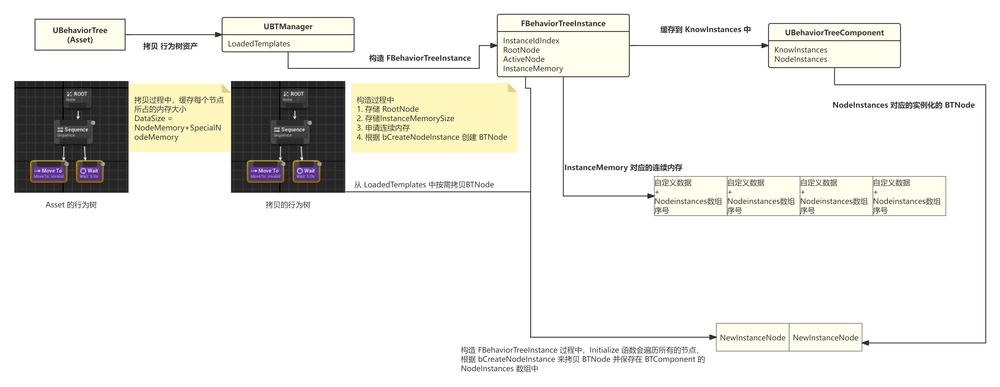

综上所述，代码的执行顺序大致如下

1. 通过 `BTManager->LoadTree` 将 `UBehaviorTree` 从 Asset 拷贝到 `LoadedTemplateds` 数组中
   - 从根节点递归 
   - 使用 `StaticDuplicateObject` 拷贝对象
   - 得到 `RootNode` 和 `InstanceMemorySize`
2. 通过 `RootNode` 和 `InstanceMemorySize` 构建 `FBehaviorTreeInstance` 行为树的运行实例
   - 遍历每个节点，根据 `bCreateNodeInstance` 判断是否需要创建，如果需要创建则使用 `StaticDuplicateObject` 并保存在实例运行的 `UBehaviorTreeComponent` 中
   - 存储正在运行的节点
   - 存储根节点
   - 存储其他信息
3. 在 `FBehaviorTreeInstance` 中初始化 `InstanceMemory` 连续内存
   - 根据 `bCreateNodeInstance` 的值，内存块中存储着自定义数据 和 对应 `NodeInstances` 数组的索引序号

实际上每次运行的行为树，仍然是 `BTManager::LoadedTemplated` 中复制的 Asset 的行为树

但是在执行节点逻辑的时候，根据 `bCreateNodeInstance` 的值来决定执行节点

- 如果实例化 Node，通过从 `FBehaviorTreeInstances` 的连续内存中获取 `UBehaviorTreeComponent::NodeInstances` 的数组序号，进而数组中获取实例化的节点
- 如果不实例化 Node，则直接行为 `LoadedTemplated` 中的行为树节点

注意 `GetNodeInstance` 函数，由于运行时会将 BTComponent 和 数据内存 都传入，又由于每个行为树是固定的，所以每个 BTNode 的内存数据偏移也都是固定的

通过 数据内存 和 内存偏移 可以得到当前 BTNode 存放数据的内存块的地址，就可以获取 bCrateNodeInstance 创建的实例化 BTNode 在 BTComponent::NodeInstances 数组的序号，进而获取到真正执行的 BTNode

> 遍历行为树的节点，并不一定就是执行的节点，这个需要区分

### 一个 Task 的执行

想要行为树能够驱动角色运动起来，还得是通过 `UBTTaskNode` 来实现

当搜索到可以执行的 UBTTaskNode 的时候，通过 `ExecuteTask` 来执行节点

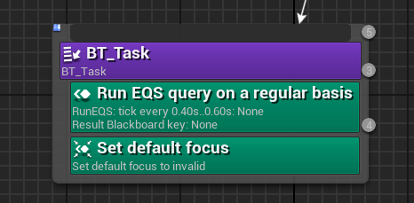

#### ExecuteTask

首先将关联的 `UBTService` 激活，遍历 `UBTTaskNode` 下所有的 Service

```cpp
ServiceNode->WrappedOnBecomeRelevant(*this, NodeMemory);
```

然后执行 `UBTServie` 的 `Tick`，遍历当前 UBTTaskNode 绑定的所有的 Service

```cpp
ServiceNode->WrappedTickNode(*this, NodeMemory);
```

接下来就是执行 `UBTTaskNode` 本体，得到运行的结果 `TaskResult`

```cpp
EBTNodeResult::Type TaskResult;
{
	SCOPE_CYCLE_UOBJECT(TaskNode, TaskNode);
	uint8* NodeMemory = (uint8*)(TaskNode->GetNodeMemory<uint8>(ActiveInstance));
	TaskResult = TaskNode->WrappedExecuteTask(*this, NodeMemory);
}
```

`TaskResult` 是一个枚举，有四个值

| 枚举值 | 含义 |
| --- | --- |
| Succeeded | 运行成功 |
| Failed | 运行失败 |
| Aborted | 被打断 |
| InProgress | 正在运行中 |

`UBTTask_BlueprintBase` 是最经常使用的行为树 Task 节点，用于蓝图中实现任务节点功能

在 `UBTTask_BlueprintBase::ExecuteTask` 函数中，会判断是否存在 `AIOwner`，以此判断执行 `ReceiveExecuteAI` 还是 `ReceiveExecute`

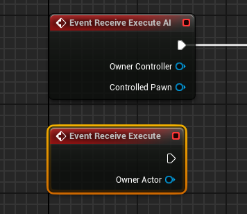

```cpp
EBTNodeResult::Type UBTTask_BlueprintBase::ExecuteTask(UBehaviorTreeComponent& OwnerComp, uint8* NodeMemory)
{
	CurrentCallResult = (ReceiveExecuteImplementations != 0 || ReceiveTickImplementations != 0) ? EBTNodeResult::InProgress : EBTNodeResult::Failed;
	bIsAborting = false;

	bStoreFinishResult = true;
	// 执行 ReceiveExecuteAI 或者 ReceiveExecute
	bStoreFinishResult = false;

	return CurrentCallResult;
}
```

`ExecutTask` 返回的是 `CurrentCallResult`，这个值通常来说默认是 `InProgress`

如果在 `ReceiveExecuteAI` 接口中调用了 `FinishExecute` 接口，则会根据输入的 `bSuccess` 来重新设置 `CurrentCallResult` 为 `Succeeded` 或者 `Failed`

在执行节点逻辑之前，会设置 `bStoreFinishResult` 为 true，这样如果 Task 是同步执行结束的，就直接修改 `CurrentCallResult` 的值即可，直接返回运行结果

如果 Task 的执行内容是异步的，那么 `ExecutTask` 默认返回 `InProgress`，等 `FinishExecute` 的时候再通过 `FinishLatentTask` 通知 UBTComonent

```cpp
void UBTTask_BlueprintBase::FinishExecute(bool bSuccess)
{
	UBehaviorTreeComponent* OwnerComp = Cast<UBehaviorTreeComponent>(GetOuter());
	const EBTNodeResult::Type NodeResult(bSuccess ? EBTNodeResult::Succeeded : EBTNodeResult::Failed);

	if (bStoreFinishResult)
	{
		CurrentCallResult = NodeResult;
	}
	else if (OwnerComp && !bIsAborting)
	{
		FinishLatentTask(*OwnerComp, NodeResult);
	}
}
```

> 在执行 ReceiveExecuteAI 之前 bStoreFinishResult 值为 true，也就是说如果 ReceiveExecuteAI 函数中调用了 FinishExecute 会修改 CurrentCallResult 的值，并直接作为 ExecuteTask 函数返回值返回回去

当 `UBTTaskNode` 执行完毕之后，通常会调用 `FinishLatentTask`，通知 UBTComponent 该节点运行完毕，该去查找下一个可用节点了

```cpp
void UBTTaskNode::FinishLatentTask(UBehaviorTreeComponent& OwnerComp, EBTNodeResult::Type TaskResult) const
{
	UBTTaskNode* TemplateNode = (UBTTaskNode*)OwnerComp.FindTemplateNode(this);
	OwnerComp.OnTaskFinished(TemplateNode, TaskResult);
}
```

### 一个 Decorator 的执行

`UBTDecorator` 作为装饰器，表示当前节点及其子节点能否运行

#### FlowAbortMode 类型

`UBTDecorator` 可以打断自身节点、低优先级节点的运行

| 打断类型 | 作用 |
| --- | --- |
| None | 不打断 |				
| LowerPriority | 打断低优先级 |		
| Self | 打断自身 |				
| Both | 打断自身并且打断低优先级 |				

> 行为树节点从左到右，优先级从高到低

`CompositeNode` 常用的是两种：`Sequence` 和 `Selector`，还有一个 `SimpleParallel` 

| Sequence 中的 Observer aborts | Selector 中的 Observer aborts |
| --- | --- |
| 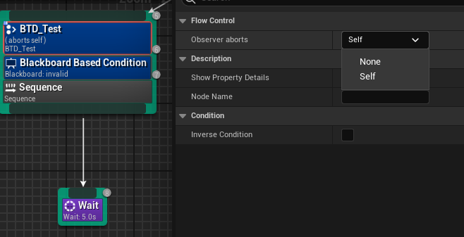 | 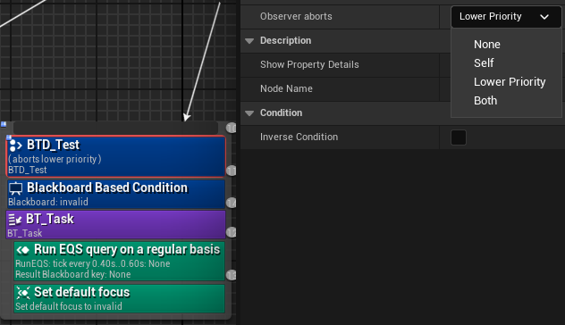 |

- `Sequence` 中不能使用 `LowerPriority` 和 `Both`，因为 `Sequence` 是顺序执行所有节点，必须完成当前任务才能继续下一个，中断会破坏的连续性
- `Selector` 没有 `LowerPriority` 和 `Both` 的限制

那么如何实现 `UBTDecorator` 在不同的 CompositeNode 中，显示不同的 `Observer aborts` 选项

答案是通过 `FBehaviorDecoratorDetails` 自定义细节面板和 `CompositeNode` 的成员函数 `CanAbortLowerPriority`、 `CanAbortSelf`

```cpp
UBTCompositeNode* MyParentNode = MyDecorator ? MyDecorator->GetParentNode() : NULL;

const bool bAllowAbortNone = MyDecorator == NULL || MyDecorator->bAllowAbortNone;
const bool bAllowAbortSelf = (MyDecorator == NULL || MyDecorator->bAllowAbortChildNodes) && (MyParentNode == NULL || MyParentNode->CanAbortSelf());
const bool bAllowAbortLowerPriority = (MyDecorator == NULL || MyDecorator->bAllowAbortLowerPri) && (MyParentNode == NULL || MyParentNode->CanAbortLowerPriority());
```

`UBTDecorator` 并没有 `Observer aborts` 属性，属性数值的绑定当然也是通过自定义细节面板实现的

```cpp
// 显示名称
FText AbortModeDesc = LOCTEXT("ObserverTitle","Observer aborts");
// 获取属性
ModeProperty = DetailLayout.GetProperty(GET_MEMBER_NAME_CHECKED(UBTDecorator, FlowAbortMode));
// 设置属性显示名称
ModeProperty->CreatePropertyNameWidget(AbortModeDesc)
```

> `Observer aborts` 本质上还是修改 `FlowAbortMode` 属性

| Sequence | Selector | Simple_Parallel|
| --- | --- | --- |
| 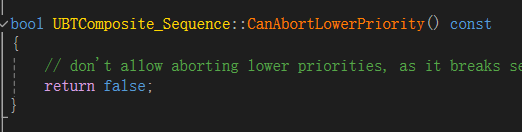 | 没有重写，都可以 | 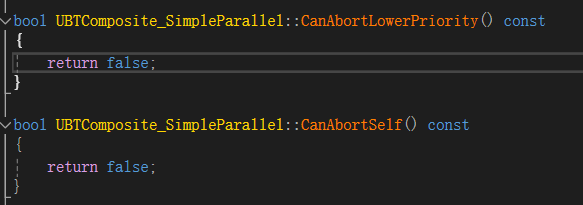 |

除了 `CompositeNode` 限制了 `FlowAbortMode` 之外，每个 `UBTDecorator` 也可以自行通过设置属性参数来限制 `FlowAbortMode`

| 属性 | 作用 |
| --- | --- |
| bAllowAbortNone | 是否允许 Abort None |
| bAllowAbortLowerPri | 是否允许 Abort Low Priority |
| bAllowAbortChildNodes | 是否允许 打断子节点 也就是 Self |

> 这些属性默认都是 true，即全部允许

比如 `UBTDecorator_TimeLimit` 的构造函数中设置了 `bAllowAbortLowerPri` 和 `bAllowAbortNone` 为 false

因为 `UBTDecorator_TimeLimit` 设计的目的就是为了限制自身的运行时间，所以它的 `FlowAbortMode` 只能是 `Self`

#### CalculateRawConditionValue

判断能否执行的核心逻辑

以 `UBTDecorator_Cooldown` 为例，获取当前时间和上次执行时间，判断时间差值是否符合CD需求

```cpp
bool UBTDecorator_Cooldown::CalculateRawConditionValue(UBehaviorTreeComponent& OwnerComp, uint8* NodeMemory) const
{
	FBTCooldownDecoratorMemory* DecoratorMemory = CastInstanceNodeMemory<FBTCooldownDecoratorMemory>(NodeMemory);
	const double TimePassed = (OwnerComp.GetWorld()->GetTimeSeconds() - DecoratorMemory->LastUseTimestamp);
	return TimePassed >= CoolDownTime;
}
```

也不是所有的 `Decorator` 都是通过 `CalculateRawConditionValue` 来中断行为树运行的，比如 `UBTDecorator_TimeLimit`

`UBTDecorator_TimeLimit` 直接没有重写 `CalculateRawConditionValue` 让其返回默认的 true，设置自己的 `FlowAbortMode` 为 Self，在倒计时结束之后直接调用 `OwnerComp.RequestExecution` 来中断节点的执行

```cpp
void UBTDecorator_TimeLimit::TickNode(UBehaviorTreeComponent& OwnerComp, uint8* NodeMemory, float DeltaSeconds)
{
	OwnerComp.RequestExecution(this);
}
```

不过，通常来说 蓝图 通过继承 `UBTDecorator_BlueprintBase` 实现功能

```cpp
bool UBTDecorator_BlueprintBase::CalculateRawConditionValue(UBehaviorTreeComponent& OwnerComp, uint8* NodeMemory) const
{
	bool CurrentCallResult = false;
	// 根据是否是 AIOwner 执行 PerformConditionCheckAI 或者 PerformConditionCheck
	return CurrentCallResult;
}
```

如果 `UBTDecorator` 的 `FlowAbortMode` 不是 `None`，表示该节点存在打断行为

`FlowAbortMode` 值为 `None`，表示只在判断是否激活节点的时候进行一次判断。如果 `FlowAbortMode` 为其他值，会在 `TickNode` 中再次触发 `CalculateRawConditionValue` 判断当前运行的节点能否继续运行

> 注意：这里 **当前运行的节点** 并不一定是该 `UBTDecorator` 的子节点，也可能是低优先级节点

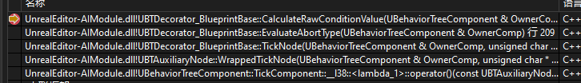

```cpp
if (FlowAbortMode == EBTFlowAbortMode::None)
{
	return EAbortType::NoAbort;
}

EAbortType AbortType = EAbortType::NoAbort;
if (bIsOnActiveBranch)
{
	if ((FlowAbortMode == EBTFlowAbortMode::Self || FlowAbortMode == EBTFlowAbortMode::Both) && CalculateRawConditionValue(OwnerComp, /*NodeMemory*/nullptr) == IsInversed())
	{
		AbortType = EAbortType::DeactivateBranch;
	}
}
else 
{
	if ((FlowAbortMode == EBTFlowAbortMode::LowerPriority || FlowAbortMode == EBTFlowAbortMode::Both) && CalculateRawConditionValue(OwnerComp, /*NodeMemory*/nullptr) != IsInversed())
	{
		AbortType = EAbortType::ActivateBranch;
	}
}
```
- 如果 `UBTDecorator` 的 `FlowAbortMode` 是 `None` 直接 `return` 掉
- 如果 `UBTDecorator` 在当前正在运行的节点上，通过 `CalculateRawConditionValue` 判断当前节点能否继续运行
- 如果 `UBTDecorator` 不在正在运行的节点上，通过 `CalculateRawConditionValue` 判断是否中断正在运行的节点并切换到自己的节点

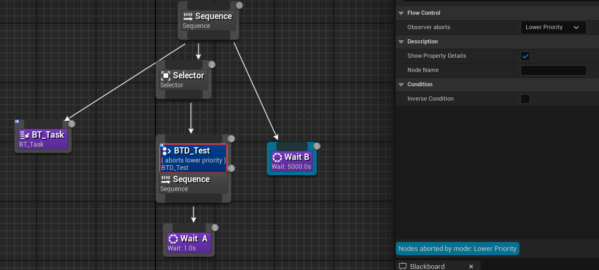

> `BTD_Test` 的 `Check` 永远返回 true

上面这种情况的执行情况是怎样的呢？

1. 运行 `BT_Task` 
2. 通过 `BTD_Test` 的 `Check`，执行 `Wait A`
3. 执行 `Wait B`
4. 触发 `BTD_Test` 的 `TickNode`，进而触发 `Check`，打断 `Wait B` 执行 `Wait A`
5. 重复执行 3 ~ 4 

#### 生命周期函数

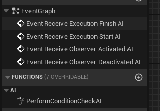

执行顺序是

1. Activated
2. Start
3. Deactivated
4. Finish

`Start` 和 `Finish` 是一定会调用的， 但是 `Activated` 和 `Deactivated` 不是每次激活都会调用

### 查找可执行的 Task

查找并执行可执行的节点，分为两部分 `RequestExecution` 和  `ProcessExecutionRequest`

通过 `RequestExecution` 节点的查找范围，并发起请求。只是发起请求，不是真正的开始执行

真正执行是在 `TickComponent` 中调用 `ProcessExecutionRequest` 来执行的

#### RequestExecution

```cpp
AIMODULE_API void RequestExecution(const UBTCompositeNode* RequestedOn, const int32 InstanceIdx, 
	const UBTNode* RequestedBy, const int32 RequestedByChildIndex,
	const EBTNodeResult::Type ContinueWithResult, bool bStoreForDebugger = true);

void RequestExecution(const UBTDecorator* RequestedBy) { check(RequestedBy); RequestBranchEvaluation(*RequestedBy); }

void RequestExecution(EBTNodeResult::Type ContinueWithResult) { RequestBranchEvaluation(ContinueWithResult); }
```

> 后两个重载的方法，最后还是会调到第一个 RequestExecution

| 形式参数 | 作用 |
| --- | --- | 
| RequestedOn | 发起请求节点父节点 |
| InstanceIdx | FBehaviorTreeInstance 在 UBTComponent::InstanceStack 中的序号 |
| RequestedBy | 发起请求的节点，可能是 Task、Decorator、CompositeNode |
| RequestedByChildIndex | 发起请求节点的序号 |
| ContinueWithResult | 发起请求的原因 |

> 常规调用方法，例如： RequestExecution(RequestedBy.GetParentNode(), InstanceIdx, &RequestedBy, RequestedBy.GetChildIndex(), EBTNodeResult::Aborted);

`RequestExecution` 函数主要的作用为了填充 `ExecutionRequest` 的成员属性

```cpp
struct FBTNodeExecutionInfo
{
	FBTNodeIndex SearchStart;
	FBTNodeIndex SearchEnd;
	const UBTCompositeNode* ExecuteNode;
	uint16 ExecuteInstanceIdx;
	TEnumAsByte<EBTNodeResult::Type> ContinueWithResult;
	uint8 bTryNextChild : 1;
	uint8 bIsRestart : 1;
};
```

它本质上是一个执行指令包，告诉行为树组件

1. 从哪里开始搜索（SearchStart）
2. 到哪里结束搜索（SearchEnd）
3. 从哪个节点开始执行（ExecuteNode）
4. 如何继续执行（ContinueWithResult + 标志位）

通过 `SearchStart` 和 `SearchEnd` 来限定行为树的搜索范围，避免全树扫描，实现局部搜索优化，只检查特定分支

- 在中断场景中，限定只搜索高优先级分支
- 在组合节点中，限定只搜索当前子分支

----------------------------

由于同一帧可能存在多次 `RequestExecution` 会与上次计算缓存的 ExecutionRequest 进行优先级对比

> 根据 InstanceIdnex 大小 和 ExecutionIndex 大小 进行比较，值越小优先级越高

```cpp
const bool bSwitchToHigherPriority = (ContinueWithResult == EBTNodeResult::Aborted);
const bool bAlreadyHasRequest = (ExecutionRequest.ExecuteNode != NULL);
```

根据 `ContinueWithResult` 是否是 `Aborted` 来判断是否应该切换到更高优先级节点

```cpp
if(bSwitchToHigherPriority)
{
	// 找到 RequestOn 和 ActiveInstance.ActiveNode 的共同父节点
	// ExecutionRequest.ExecuteNode = 共同父节点
}
else {
	// 如果 RequestedOn 能正常执行
	// ExecutionRequest.ExecuteNode = RequestedOn
}
```

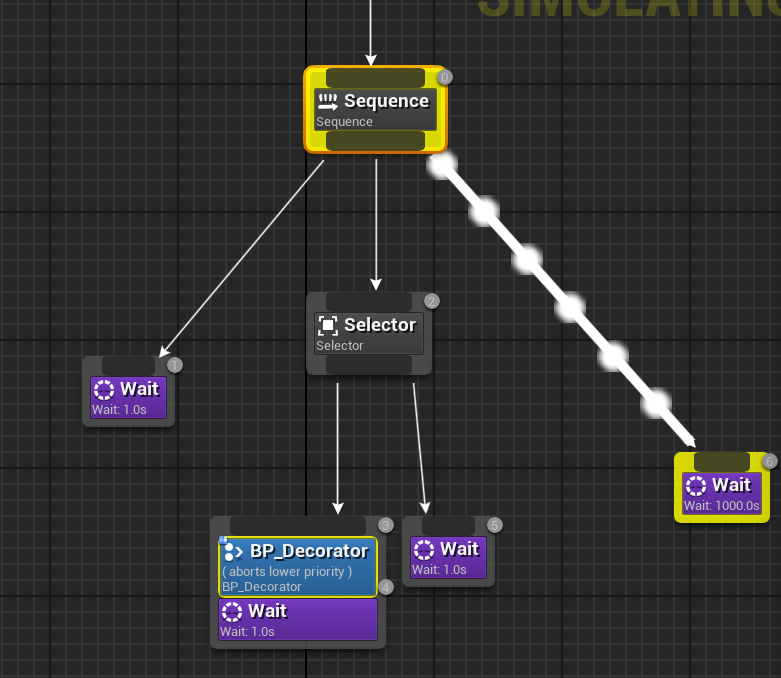

比如上面这种情况，ExecutionRequest.ExecuteNode 的值为 Sequence 这个 CompositeNode

#### ProcessExecutionRequest

在 `TickComponent` 中进行判断是否执行

如果当前 当前执行的节点 和 ExecutionRequest.ExecuteNode 请求执行节点不同，那么先将当前执行节点 `Deactive` 掉，通过 `DeactivateUpTo` 函数

> 当前执行节点是 InstanceStack[ActiveInstanceIdx].ActiveNode

将 `ExecutionRequest` 信息同步更新到 `SearchData` 中

```cpp
UBTTaskNode* NextTask = NULL;
const UBTCompositeNode* TestNode = ExecutionRequest.ExecuteNode;
```

接下来通过 while 循环，不停更新 NextTask 和 TestNode 的值，直到找到能够执行的那个

```cpp
while (TestNode && NextTask == NULL)
{
	const int32 ChildBranchIdx = TestNode->FindChildToExecute(SearchData, NodeResult);
	const UBTNode* StoreNode = TestNode;

	if (SearchData.bPostponeSearch)
	{
		// break out of current search loop
		TestNode = NULL;
		bIsSearchValid = false;
	}
	else if(ChildBranchIdx == BTSpecialChild::ReturnToParent)
	{

	}
	else if (TestNode->Children.IsValidIndex(ChildBranchIdx))
	{
		NextTask = TestNode->Children[ChildBranchIdx].ChildTask;
		TestNode = TestNode->Children[ChildBranchIdx].ChildComposite;
	}
}
```

> 还记得吗 ChildTask 和 ChildComposite 只有一个是有效的

通过 `TestNode->FindChildToExecute` 找到可以执行的节点

最后调用 `ProcessPendingExecution` 去执行 `ExecuteTask`
