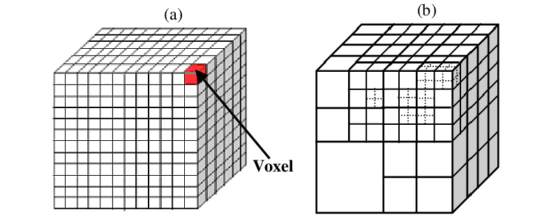

# 飞行 AI

使用 稀疏八叉树 帮助空中空间寻路

## 稀疏体素八叉树



- 八叉树结构: 八叉树是一种树形数据结构，每个节点最多有八个子节点。它将3D空间递归地划分为八个相等的立方体（子体素），直到达到某个最小的细分级别或满足某个条件
- 稀疏性: 在许多场景中，只有一小部分体素是被占用的（例如，建筑物、地形等），而大部分空间是空的。稀疏八叉树只存储那些实际存在的体素，避免了存储大量空体素的浪费
- 体素表示: 每个体素可以用一个简单的标志（如一个字节或位）来表示是否被占用。对于被占用的体素，可以存储更多的信息，例如材质、颜色等

### 基本概念

稀疏体素八叉树是一种层次化的3D空间索引结构，核心思想是通过递归细分空间实现：
- 空间划分：将3D空间递归划分为8个等大子立方体（八分体）
- 稀疏存储：仅存储包含有效数据的节点，大幅减少内存占用
- 分层表示：高层节点表示大空间区域，底层节点表示精细体素
- 莫顿编码：使用空间填充曲线（Z-order）将3D坐标线性化，加速空间查询

---------------------------

**分层**

假设将 空间 划分成 N 层


那么第 N 层就是 **根节点层**，也就是整个空间；第 1 层是**叶节点父层**，直接管理叶节点；第 0 层是 **叶节点层**

会将叶节点分成 4 * 4 * 4 的体素网格


---------------------------

**莫顿编码**

莫顿码是将多维数据转化为一维数据的编码

比如下面这个例子，将 X、Y、Z 三维信息保存到一个 `unsigned int` 中，是一种数据压缩的方式

```cpp
unsigned int code = slibmorton::morton3D_32_encode(X, Y, Z)
```


### 代码预定义

预定义 X、Y、Z 轴移动的操作

```cpp
// Neighbour directions
static constexpr int32 DeltaX[6] = {1,-1, 0, 0, 0, 0};
static constexpr int32 DeltaY[6] = {0, 0, 1,-1, 0, 0};
static constexpr int32 DeltaZ[6] = {0, 0, 0, 0, 1,-1};
```

预定义 `SubNodeMortonsForDirection` 快速查找叶子节点 6 个面上的体素网格

`SubNodeMortonsForDirection` 是一个 二维数组，第一维 6 表示 6 个面，第二位 16 表示一个面上的 16 个体素网格

> 叶节点是 4 * 4 * 4 的体素网格，所以每个面上有 16 个

```cpp
static constexpr small_morton_t SubNodeMortonsForDirection[6][16] =
{
    { 0x00, 0x04, 0x20, 0x24, 0x02, 0x06, 0x22, 0x26, 0x10, 0x14, 0x30, 0x34, 0x12, 0x16, 0x32, 0x36 },
    { 0x09, 0x0d, 0x29, 0x2d, 0x0b, 0x0f, 0x2b, 0x2f, 0x19, 0x1d, 0x39, 0x3d, 0x1b, 0x1f, 0x3b, 0x3f },
    { 0x00, 0x04, 0x20, 0x24, 0x01, 0x05, 0x21, 0x25, 0x08, 0x0c, 0x28, 0x2c, 0x09, 0x0d, 0x29, 0x2d },
    { 0x12, 0x16, 0x32, 0x36, 0x13, 0x17, 0x33, 0x37, 0x1a, 0x1e, 0x3a, 0x3e, 0x1b, 0x1f, 0x3b, 0x3f },
    { 0x00, 0x02, 0x10, 0x12, 0x01, 0x03, 0x11, 0x13, 0x08, 0x0a, 0x18, 0x1a, 0x09, 0x0b, 0x19, 0x1b },
    { 0x24, 0x26, 0x34, 0x36, 0x25, 0x27, 0x35, 0x37, 0x2c, 0x2e, 0x3c, 0x3e, 0x2d, 0x2f, 0x3d, 0x3f }
};
```

`NeighbourMortonOffset` 表示节点在指定方向上的相邻节点

> 注意 这里是节点而不是叶节点，它是 2 * 2 * 2

```cpp
static constexpr int32 NeighbourMortonOffset[6][4] = {
    { 0, 2, 4, 6 },
    { 1, 3, 5, 7 },
    { 0, 1, 4, 5 },
    { 2, 3, 6, 7 },
    { 0, 1, 2, 3 },
    { 4, 5, 6, 7 }
};
```

注意，这里的值都是编码过

比如 {0, 2, 4, 6} 对应的二进制是 

- 0 -> x = 0, y = 0, z = 0
- 2 -> x = 0, y = 1, z = 0
- 4 -> x = 1, y = 0, z = 0
- 6 -> x = 1, y = 1, x = 0

```
俯视图 (Z轴方向)：
当前父节点      相邻父节点
┌───┬───┐     ┌───┬───┐
│   │   │     │ A │ B │  ← 固定Z轴位置
├───┼───┤     ├───┼───┤
│   │   │     │ C │ D │
└───┴───┘     └───┴───┘
    ↑
沿+X方向移动
```

### 结构体

#### FSVOLink

```cpp
struct FLYINGNAVSYSTEM_API FSVOLink
{
private:
	uint32 Link;

    // 其他工具函数
public:
	FSVOLink(const uint32 InLayerIndex, const uint32 InNodeIndex, const uint32 InSubNodeIndex = 0)
	{
		Link = InLayerIndex << 28;
		Link |= InNodeIndex << 6;
		Link |= InSubNodeIndex;
	}
    uint32 GetLayerIndex() const
	{
		return Link >> 28;
	}
    uint32 GetNodeIndex() const
	{
		return (Link & 0x0fffffc0) >> 6;
	}
    uint32 GetSubNodeIndex() const
	{
		return (Link & 0x0000003f);
	}
}
```

使用 `FSVOLink` 来表示节点之间的关系

`Link` 总共 32 位

- `Link` 的高位 4 位 表示 Layer Index
- `Link` 的高位 4 ~ 26 位 表示 Node Index
- `Link` 的低位 6 位 表示 叶节点序号

#### FSVONode

表示 八叉树中的 Node 节点

```cpp
struct FLYINGNAVSYSTEM_API FSVONode
{
	morton_t MortonCode;
	FSVOLink FirstChild;
	FSVOLink Parent = FSVOLink::NULL_LINK;
	FSVOLink Neighbours[6];
	bool bHasChildren;
	bool bBlocked = false;
	uint16 NodeGroup = 0; // For future use
};
```

| 属性 | 作用 |
| --- | --- |
| MortonCode | 空间位置编码 | 
| FirstChild | 指向节点的第一个子节点的引用 | 
| Parent | 指向节点的父节点的引用 | 
| Neighbours[6] | 与存储 6 个方向的直接邻居节点的引用 | 
| bHasChildren | 该节点是否被细分 | 
| bBlocked | 该节点是否被障碍物占据 | 

#### FSVOLeafNode

```cpp
struct FLYINGNAVSYSTEM_API FSVOLeafNode
{
	// 4x4x4 voxel grid packed into a 64bit integer
	uint64 VoxelGrid;

	FSVOLink Parent;

	FSVOLeafNode(): VoxelGrid(0) {}

	void SetIndexBlocked(const int Index)
	{
		VoxelGrid |= (1ULL << Index);
	}
	bool IsIndexBlocked(const int Index) const
	{
		return (VoxelGrid >> Index) & 1ULL;
	}

    // 其他工具函数
}
```

叶节点会被划分成 4 *4 * 4 共 64 个体素，刚好对应 uint64 的 64 位

参考 `SetIndexBlocked`，如果 VoxelGrid 第 index 位值为 1，那么 index 对应的体素被占据

如果 `VoxelGrid` 值为 `UINT64_MAX`，也就是所有位都是 1，表示该叶子节点被占据 

#### FSVOLayer

一层直接使用一个 `TArray<FSVONode>` 来表示

```cpp
struct FLYINGNAVSYSTEM_API FSVOLayer
{
	TArray<FSVONode> Nodes;
    // 其他工具函数
}
```

#### FSVONodeGroup

存储着路径权重

```cpp
struct FLYINGNAVSYSTEM_API FSVONodeGroup
{
	// For future use
	float PathWeight = 0.f;
};
```

#### FSVOData

```cpp
struct FLYINGNAVSYSTEM_API FSVOData : TSharedFromThis<FSVOData, ESPMode::ThreadSafe>
{
	// 叶子节点从层
	FSVOLeafLayer LeafLayer;

	// 节点层数组 可能存在多个节点层
	TArray<FSVOLayer> Layers;

	// 节点 → 连通分量ID的映射，用于加速路径搜索（同分量=连通区域）
	TMap<FSVOLink, int32> NodeComponent;

	// 节点组配置数据（如地形代价乘数）
	TArray<FSVONodeGroup> NodeGroups;
	
	// 下面是空间元数据
	
	// 八叉树世界包围盒
	FBox Bounds;
	// 八叉树几何中心
	FVector Centre;
	// 八叉树立方体边长
	FCoord SideLength;
	// 体素基本单位长度
	FCoord SubNodeSideLength;
	// 节点层数（不含叶节点层）
	int32 NumNodeLayers;
	// 连通区域数
	int32 NumConnectedComponents;
	// 导航代理半径
	float AgentRadius;

	// 数据有效性标志
	bool bValid;

	FSVOData():
		SideLength(0),
		SubNodeSideLength(0),
		NumNodeLayers(MIN_NODE_LAYERS),
		NumConnectedComponents(0),
		AgentRadius(0),
		bValid(false)
	{}

    // 其他工具函数
}
```

### 构建

通过 `FSVOGenerator` 管理构建过程，来维护一个 `SVOData` 对象

通过传入 `FFlyingNavigationDataGenerator` 获取一些配置信息 和 `AFlyingNavigationData` 中的配置信息

> `FFlyingNavigationDataGenerator` 存储着 `AFlyingNavigationData` 的指针

```cpp
void FFlyingNavigationDataGenerator::SyncBuild()
{
	FSVOGenerator Gen(*this);
	Gen.RasteriseTick(true);
	Gen.DoWork();
}
```

#### 数据初始化

`FFlyingNavigationDataGenerator` 会从 `UNavigationSystemV1` 获取所有的 `AFlyingNavigationData` 的配置信息 和 区域

将所有区域整合成一个大的 `TotalBounds`

```cpp
TArray<FBox> SupportedBounds;
NavSys->GetNavigationBoundsForNavData(*DestFlyingNavData, SupportedBounds);
InclusionBounds.Reset(SupportedBounds.Num());

for (const FBox& Box : SupportedBounds)
{
	InclusionBounds.Add(Box);
	BoundsSum += Box;
}
TotalBounds = BoundsSum;
```

在 `AFlyingNavigationData` 中可以配置 `MaxDetailSize` 也就是叶节点的最大长度

```cpp
SVOData->SetBounds(TotalBounds);

const FCoord MaxSubNodeSize = DestFlyingNavData->MaxDetailSize;
const int32 NumLayers = FlyingNavSystem::GetNumLayers(SVOData->SideLength, MaxSubNodeSize, NumThreadSubdivisions);

SVOData->NumNodeLayers = NumLayers - 2; 

const int32 SubNodesPerSide = 1 << NumLayers;
SVOData->SubNodeSideLength = SVOData->SideLength / SubNodesPerSide;

SVOData->AgentRadius = bUseAgentRadius ? DestFlyingNavData->GetConfig().AgentRadius : 0.f;
```

通过 `TotalBounds` 可以得到 八叉树区域 的最长边，也就是 `SideLength`

通过 `log2(SideLength / MaxSubNodeSize)` 可以知道倒推得到层数

> 比如单边叶节点最多 15 个，那么该 八叉树 最多 5 层，2^5 > 15

那么 `SVOData` 的 `NodeLayer` 的数量就是 倒推得到的层数 - 2，因为不包括 `RootLayer` 和 `LeafLayer`

`SubNodeSideLength` 表示叶节点的尺寸， `SubNodesPerSide` 表示叶节点个数，`SideLength` 表示长度

> NumLayers 表示层数，那么 `1 << NumLayers` 表示最后一层节点个数

`AgentRadius` 表示代理半径，也就是智能体的半径，有些路径比较宅，智能体不能通过

#### FSVOGenerator::RasteriseTick

该函数通过设置多线程，将导航空间分割成多个子区域，每个线程负责一个子区域的数据生成

真正执行的逻辑在 `FRasteriseWorkerTask` 中

```cpp
WorkerTasks.Add(
	MakeShared<FRasteriseWorkerTask, ESPMode::ThreadSafe>(
		*this,
		GenerationBounds,
		i,
		Divisions
	)
);
```

其实 `FRasteriseWorkerTask` 也就是在执行 `FRasteriseWorker::DoWork`

##### 初始化

在 `FRasteriseWorker` 构造函数中初始化

```cpp
FRasteriseWorker::FRasteriseWorker(FSVOGenerator& ParentGenerator,
                                   const FBox& InGenerationBounds,
                                   const int32 InWorkerIdx,
                                   const int32 InDivisions):
```

在`PrepareGeometrySources` 中 NavigationOctree 缓存与 NavBound 相关的 NavElement

```cpp
FRasteriseWorker::PrepareGeometrySources
const FNavigationOctree* NavigationOctree = NavSys.IsValid() ? NavSys->GetMutableNavOctree() : nullptr;

for (const FBoxCenterAndExtent& Bounds : InclusionBounds)
{
	// 通过 NavigationOctree 获取所有相关的 导航元素
	if (bShouldUse)
	{
		NavigationRelevantData.Add(Element.Data);
	}
}
```

##### GatherGeometryFromSources

遍历 NavigationRelevantData 数据，进行收集几何信息

如果 `FNavigationRelevantData` 是地形数据，通过 `INavRelevantInterface::GatherGeometrySlice` 接口得到地形的几何数据，交给 `AppendCollisionData` 进行处理

如果 `FNavigationRelevantData` 不是地形数据，则判断是否是 实例化静态网格(Instanced Static Meshes)

> 比如植被等，大量相同的模型共用几何信息，节省内存

如果是共用几何内存，则将他们的包围盒合并起来，最后将这些数据交给 `AppendCollisionData` 处理

```cpp
const bool bUsesPerInstanceTransforms = ElementData.NavDataPerInstanceTransformDelegate.IsBound();
if (bUsesPerInstanceTransforms)
{
	ElementData.NavDataPerInstanceTransformDelegate.Execute(GenerationBounds, PerInstanceTransforms);
	for (const FTransform& Transform : PerInstanceTransforms)
	{
		ElementBounds += ElementData.Bounds.TransformBy(Transform);
	}
} else
{
	ElementBounds = ElementData.Bounds;
}

AppendCollisionData(RawCollisionData, ElementBounds, true, PerInstanceTransforms);
```

在 `AppendCollisionData` 函数中，会筛除无关几何，通过 `UETriBoxOverlap` 只保留与工作区域相关的三角形

最后会封装成 `FSVORawGeometryElement` 数组，保存在 `RawGeometry` 中

- `GeomCoords` 存储顶点数据 `[x0, y0, z0, x1, y1, z1, x2...]`
- `GeomIndices` 存储顶点索引 `[0, 1, 2, 3, 4, 5....]`
- `Bounds` 该几何的包围盒

```cpp
struct FLYINGNAVSYSTEM_API FSVORawGeometryElement
{
	TArray<FCoord>		GeomCoords;
	TArray<int32>		GeomIndices;
	FBox Bounds;
}
```

##### RasteriseLayerOne

用于八叉树（Octree）第一层节点的光栅化（Rasterise）过程，主要功能是生成并筛选八叉树第一层中与特定几何体相交的节点

只保留与几何体（如导航网格）相交的节点，并将它们的Morton码（空间位置编码）存入SortedMortonCodes


