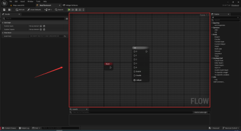

# FlowGraph

## 全新的资产类型

> 前置内容：https://zhuanlan.zhihu.com/p/639752004

蓝图编辑器的作用主要就是为了帮助使用者方便的进行数据配置

> 我觉得蓝图本身就是一种配置

虚幻提供了为自定义类型扩展编辑界面的方法

本质上来说，这一套流程分为三个部分

1. UObject，也就是资源对象本体所代表的数据
2. 编辑器类，UObject 对应的编辑器类，可能存储一些额外的数据
3. UI类，编辑器类对应的显示类，用于方便用户使用

### 定于原始数据类型 

对 `FlowGraph` 插件来说，`UFlowAsset` 就是那个用于存储资源对象原始数据的类，所有的操作都是基于这个类来运行的

```cpp
UCLASS(BlueprintType, hideCategories = Object)
class FLOW_API UFlowAsset : public UObject
```

#### 关联 Asset

如何基于这个 `UObject` 创建资产(`Asset`) 呢？】

根据 **前置内容** 来看，继承 `IAssetTypeActions` 来定义 Asset 的效果

在 `FlowGraph` 的插件中，使用 `IAssetTypeActions` 是下面这样的

```cpp
class FLOWEDITOR_API FAssetTypeActions_FlowAsset : public FAssetTypeActions_Base
{
public:
	virtual FText GetName() const override;
	virtual uint32 GetCategories() override;
	virtual FColor GetTypeColor() const override { return FColor(255, 196, 128); }

	virtual UClass* GetSupportedClass() const override;
	virtual void OpenAssetEditor(const TArray<UObject*>& InObjects, TSharedPtr<class IToolkitHost> EditWithinLevelEditor = TSharedPtr<IToolkitHost>()) override;

	virtual void PerformAssetDiff(UObject* OldAsset, UObject* NewAsset, const FRevisionInfo& OldRevision, const FRevisionInfo& NewRevision) const override;
};
```

| 函数名称 | 作用 | 示例 |
| --- | --- | --- |
| GetName | 显示名称 | "Flow Asset" |
| GetCategories | 所属类型 | static_cast<EAssetTypeCategories::Type>(0) |
| GetTypeColor | 资产下面的颜色条  | FColor(255, 196, 128) |
| GetSupportedClass | 该资产关联的 Class | UFlowAsset::StaticClass() |
| OpenAssetEditor | 打开资产编辑面板 |  |

> `FAssetTypeActions_Base` 是继承自 `IAssetTypeActions` 的，预先定义好很多默认内容

与此同时，UE5 也提供了新的方法，来定义 `Asset`，其名为 `UAssetDefinition`

```cpp
class FLOWEDITOR_API UAssetDefinition_FlowAsset : public UAssetDefinition
{
	GENERATED_BODY()

public:
	virtual FText GetAssetDisplayName() const override;
	virtual FLinearColor GetAssetColor() const override;
	virtual TSoftClassPtr<UObject> GetAssetClass() const override;
	virtual TConstArrayView<FAssetCategoryPath> GetAssetCategories() const override;
	virtual FAssetSupportResponse CanLocalize(const FAssetData& InAsset) const override;

	virtual EAssetCommandResult OpenAssets(const FAssetOpenArgs& OpenArgs) const override;
	virtual EAssetCommandResult PerformAssetDiff(const FAssetDiffArgs& DiffArgs) const override;
};
```

| 函数名称 | 作用 | 示例 |
| --- | --- | --- |
| GetAssetDisplayName | 显示名称 | "Flow Asset" |
| GetAssetColor | 资产下面的颜色条 | FColor(255, 196, 128) |
| GetAssetClass | 资产关联的 Class | UFlowAsset::StaticClass() |
| GetAssetCategories | 所属类型 | { FFLowAssetCategoryPaths::Flow } |
| OpenAssets | 打开资产对应的编辑面板 |  |

在 `FlowGraph` 中，无论是 `OpenAssets` 还是 `OpenAssetEditor`，统一调用的接口都是

```cpp
const FFlowEditorModule* FlowModule = &FModuleManager::LoadModuleChecked<FFlowEditorModule>("FlowEditor");
FlowModule->CreateFlowAssetEditor(OpenArgs.GetToolkitMode(), OpenArgs.ToolkitHost, FlowAsset);
```

#### 创建 Asset

这里倒是与 **前置知识** 相同，通过继承 `UFactory` 来 Asset 对象

```cpp
UCLASS(HideCategories = Object)
class FLOWEDITOR_API UFlowAssetFactory : public UFactory
{
	GENERATED_UCLASS_BODY()

	UPROPERTY(EditAnywhere, Category = Asset)
	TSubclassOf<class UFlowAsset> AssetClass;

	virtual bool ConfigureProperties() override;
	virtual UObject* FactoryCreateNew(UClass* Class, UObject* InParent, FName Name, EObjectFlags Flags, UObject* Context, FFeedbackContext* Warn) override;

protected:
	// Parameterized guts of ConfigureProperties()
	bool ConfigurePropertiesInternal(const FText& TitleText);
};
```

当你在资源管理器中右键，会先触发 `ConfigureProperties`，根据返回的 bool 值判断能否创建

此时会创建一个虚拟的 Asset，当你确定文件名称之后，才会执行 `FactoryCreateNew` 用于表示一个 Asset 真正创建了

> 其实也很正常，毕竟在 **确定名称** 之后才能真正创建。当你右键创建资产，但是不按回车或者鼠标来设定名称，而是一直按 ESC，资产不会被创建

### 定义图表编辑器

> https://blog.csdn.net/u013412391/article/details/107945507

与蓝图编辑器类似，定义类似的编辑器需要

1. UEdGraph 代表图表对象，存储所有的节点
2. UEdGraphNode 代表图标对象中的一个节点
3. UEdGraphSchema 定义图表的规则，比如 **鼠标右键点击** 或者 **拖拽一个引脚并释放**
4. SFlowGraphNode 图表编辑器中具体的 UI 界面
5. SGraphEditor 封装了图表编辑器的界面
6. FEdGraphSchemaAction 定义资产编辑器的操作，比如复制、新建节点，添加注释等

### FFlowAssetEditor

当想要打开一个 `Asset` 的时候，会触发下面这个 `CreateFlowAssetEditor` 函数，创建一个 `FFlowAssetEditor` 资产编辑器

```cpp
TSharedRef<FFlowAssetEditor> FFlowEditorModule::CreateFlowAssetEditor(const EToolkitMode::Type Mode, const TSharedPtr<IToolkitHost>& InitToolkitHost, UFlowAsset* FlowAsset)
{
	TSharedRef<FFlowAssetEditor> NewFlowAssetEditor(new FFlowAssetEditor());
	NewFlowAssetEditor->InitFlowAssetEditor(Mode, InitToolkitHost, FlowAsset);
	return NewFlowAssetEditor;
}
```

`FFlowAssetEditor` 的定义如下

```cpp
class FLOWEDITOR_API FFlowAssetEditor : public FAssetEditorToolkit, public FEditorUndoClient, public FGCObject, public FNotifyHook
```

提供了一套完整的框架来处理编辑器的生命周期、UI布局、菜单系统、撤销重做等功能

#### Undo Redo

使用 `FEditorUndoClient` 来实现 Undo 功能

```cpp
void FFlowAssetEditor::PostUndo(bool bSuccess)
{
	HandleUndoTransaction();
}

void FFlowAssetEditor::PostRedo(bool bSuccess)
{
	HandleUndoTransaction();
}

void FFlowAssetEditor::HandleUndoTransaction()
{
	SetUISelectionState(NAME_None);
	GraphEditor->NotifyGraphChanged();
	FSlateApplication::Get().DismissAllMenus();
}
```

> `PostUndo` 和 `PostRedo` 都是 `FEditorUndoClient` 提供的接口

`HandleUndoTransaction` 本质是声明："状态已变，请更新显示"

#### 变化事件

使用 `FNotifyHook` 提供 **属性变化** 接口，也就是 `NotifyPostChange` 和 `NotifyPreChange` 函数

```cpp
void FFlowAssetEditor::NotifyPostChange(const FPropertyChangedEvent& PropertyChangedEvent, FProperty* PropertyThatChanged)
{
	if (PropertyChangedEvent.ChangeType != EPropertyChangeType::Interactive)
	{
		GraphEditor->NotifyGraphChanged();
	}
}
```

> 这个属性可能是成员属性，也可能是 Graph 中某个 Node 的配置属性

#### 窗口控件

当然，最重要的应该是基于 `FAssetEditorToolkit` 而实现的接口

使用 `FAssetEditorToolkit`，它是构建自定义资产编辑器的核心基类，用于创建类似蓝图编辑器、材质编辑器等专业编辑环境

```cpp
virtual void RegisterTabSpawners(const TSharedRef<class FTabManager>& TabManager) override;
virtual void UnregisterTabSpawners(const TSharedRef<class FTabManager>& TabManager) override;

virtual void InitToolMenuContext(FToolMenuContext& MenuContext) override;
virtual void PostRegenerateMenusAndToolbars() override;
virtual void SaveAsset_Execute() override;
virtual void SaveAssetAs_Execute() override;
```

| 函数名称 | 作用 |
| --- | --- |
| RegisterTabSpawners | 义编辑器布局结构 |
| UnregisterTabSpawners | 编辑器关闭时反注册标签页 |
| InitToolMenuContext | 扩展编辑器菜单/工具栏 |
| PostRegenerateMenusAndToolbars | 菜单/工具栏刷新后执行额外操作 |
| SaveAsset_Execute | 执行"保存"命令的核心逻辑 |
| SaveAssetAs_Execute | 执行"另存为"命令 |

当打开了 `Standalone` 的编辑窗口，有哪些窗口？这个实现的地方就是 `RegisterTabSpawners` 中

```cpp
void FFlowAssetEditor::RegisterTabSpawners(const TSharedRef<class FTabManager>& InTabManager)
{
	WorkspaceMenuCategory = InTabManager->AddLocalWorkspaceMenuCategory(LOCTEXT("WorkspaceMenu_FlowAssetEditor", "Flow Editor"));
	const auto WorkspaceMenuCategoryRef = WorkspaceMenuCategory.ToSharedRef();

	FAssetEditorToolkit::RegisterTabSpawners(InTabManager);

	InTabManager->RegisterTabSpawner(DetailsTab, FOnSpawnTab::CreateSP(this, &FFlowAssetEditor::SpawnTab_Details))
				.SetDisplayName(LOCTEXT("DetailsTab", "Details"))
				.SetGroup(WorkspaceMenuCategoryRef)
				.SetIcon(FSlateIcon(FAppStyle::GetAppStyleSetName(), "LevelEditor.Tabs.Details"));

	InTabManager->RegisterTabSpawner(GraphTab, FOnSpawnTab::CreateSP(this, &FFlowAssetEditor::SpawnTab_Graph))
				.SetDisplayName(LOCTEXT("GraphTab", "Graph"))
				.SetGroup(WorkspaceMenuCategoryRef)
				.SetIcon(FSlateIcon(FAppStyle::GetAppStyleSetName(), "GraphEditor.EventGraph_16x"));

    // 其他 Tab 的创建
}
```

注册和绑定资产事件，刷新 `UFlowGraph`

```cpp
FlowAsset = CastChecked<UFlowAsset>(ObjectToEdit);

UFlowGraph* FlowGraph = Cast<UFlowGraph>(FlowAsset->GetGraph());
if (IsValid(FlowGraph))
{
    // Call the OnLoaded event for the flowgraph that is being edited
    FlowGraph->OnLoaded();
}

// 支持撤销和还原
FlowAsset->SetFlags(RF_Transactional);
GEditor->RegisterForUndo(this);

UFlowGraphSchema::SubscribeToAssetChanges();
FlowAsset->OnDetailsRefreshRequested.BindThreadSafeSP(this, &FFlowAssetEditor::RefreshDetails);
```

#### InitFlowAssetEditor

打开 `Asset` 创建了 `FFlowAssetEditor` 之后，执行的第一个函数就是 `InitFlowAssetEditor` 

这是在 `RegisterTabSpawners` 之前执行的，毕竟 `RegisterTabSpawners` 只是注册了有哪些 Tab 窗口

Tab 窗口如何布局是在 `InitFlowAssetEditor` 中定义的

```cpp
CreateWidgets();

// 定于布局
const TSharedRef<FTabManager::FLayout> StandaloneDefaultLayout = FTabManager::NewLayout("FlowAssetEditor_Layout_v5.1")
    ->AddArea
    (
        FTabManager::NewPrimaryArea()
        ->SetOrientation(Orient_Horizontal)
        ->Split
        (
            // 其他窗口的布局设置
        )
        ->Split
        (
            FTabManager::NewStack()
            ->SetSizeCoefficient(0.125f)
            ->AddTab(PaletteTab, ETabState::OpenedTab)
        )
    );
```

> 注意：`CreateWidgets` 并没有创建 Tab 控件，而是自定义控件，Tab 控件在 `RegisterTabSpawners` 注册之后由系统调用创建


#### Palette


正如前面所说，`PaletteTab` 在 `RegisterTabSpawners` 函数中注册

```cpp
InTabManager->RegisterTabSpawner(PaletteTab, FOnSpawnTab::CreateSP(this, &FFlowAssetEditor::SpawnTab_Palette))
			.SetDisplayName(LOCTEXT("PaletteTab", "Palette"))
			.SetGroup(WorkspaceMenuCategoryRef)
			.SetIcon(FSlateIcon(FAppStyle::GetAppStyleSetName(), "Kismet.Tabs.Palette"));
```

这里注册了 `PaletteTab` 对应的创建函数是 `FFlowAssetEditor::SpawnTab_Palette`，不过从函数内容来看，其实就是 `SDockTab` 包了个 `Palette` 对象

```cpp
TSharedRef<SDockTab> FFlowAssetEditor::SpawnTab_Palette(const FSpawnTabArgs& Args) const
{
	check(Args.GetTabId() == PaletteTab);

	return SNew(SDockTab)
		.Label(LOCTEXT("FlowPaletteTitle", "Palette"))
		[
			Palette.ToSharedRef()
		];
}
```

`Palette` 对象也很简单

```cpp
Palette = SNew(SFlowPalette, SharedThis(this));
```

`SFlowPalette` 的内容很简单

- 使用 `SGraphActionMenu` 作为列表容器，显示 Item，提供 Item 拖拽功能
- 使用 `STextComboBox` 提供文本输入功能，作为列表筛选

```cpp
this->ChildSlot
[
	SNew(SBorder)
	.Padding(2.0f)
	.BorderImage(FAppStyle::GetBrush("ToolPanel.GroupBorder"))
	[
		SNew(SVerticalBox)
		+ SVerticalBox::Slot() // Filter UI
			.AutoHeight()
			[
				SNew(SHorizontalBox)
				+ SHorizontalBox::Slot()
					.VAlign(VAlign_Center)
					[
						SAssignNew(CategoryComboBox, STextComboBox)
							.OptionsSource(&CategoryNames)
							.OnSelectionChanged(this, &SFlowPalette::CategorySelectionChanged)
							.InitiallySelectedItem(CategoryNames[0])
					]
			]
		+ SVerticalBox::Slot() // Content list
			.HAlign(HAlign_Fill)
			.VAlign(VAlign_Fill)
			[
				SAssignNew(GraphActionMenu, SGraphActionMenu)
					.OnActionDragged(this, &SFlowPalette::OnActionDragged)
					.OnActionSelected(this, &SFlowPalette::OnActionSelected)
					.OnCreateWidgetForAction(this, &SFlowPalette::OnCreateWidgetForAction)
					.OnCollectAllActions(this, &SFlowPalette::CollectAllActions)
					.OnCreateCustomRowExpander_Static(&LocalUtils::CreateCustomExpanderStatic, false)
					.AutoExpandActionMenu(true)
			]
	]
];
```

| SGraphActionMenu | 回调接口 |
| --- | --- |
| OnActionDragged | 设置动作拖拽事件的处理函数 |
| OnActionSelected | 选中处理函数 |
| OnCreateWidgetForAction | 自定义每个 Item 的显示控件 |
| OnCollectAllActions | 设置菜单数据源收集函数 |

通过 `SFlowPalette::CollectAllActions` 收集到了数据源，核心内容在 `UFlowGraphSchema::GetFlowNodeActions` 中，收集到的数据源是基于 `UFlowNodeBase` 的类，包括 C++ 和 蓝图的

```cpp
TArray<UClass*> UFlowGraphSchema::NativeFlowNodes;				// 基于 UFlowNodeBase 的 C++ 类
TMap<FName, FAssetData> UFlowGraphSchema::BlueprintFlowNodes;	// 基于 UFlowNodeBase 的 蓝图类
```

好奇 `NativeFlowNodes` 和 `BlueprintFlowNodes` 是怎么得到的，核心就是 `GetDerivedClasses`

```cpp
GetDerivedClasses(FlowNodeBaseClass, FlowNodesOrAddOns);
```

通过 `GetDerivedClasses` 得到基于 `FlowNodeBaseClass` 的 `TArray<UClass*>`，核心代码大概如下

```cpp
FUObjectHashTables& ThreadHash = FUObjectHashTables::Get();
TSet<UClass*>* DerivedClasses = ThreadHash.ClassToChildListMap.Find(ClassToLookFor);
Results.Append( DerivedClasses->Array() );
```

#### Graph



```cpp
TSharedRef<SDockTab> FFlowAssetEditor::SpawnTab_Graph(const FSpawnTabArgs& Args) const
{
	check(Args.GetTabId() == GraphTab);

	TSharedRef<SDockTab> SpawnedTab = SNew(SDockTab)
		.Label(LOCTEXT("FlowGraphTitle", "Graph"));

	if (GraphEditor.IsValid())
	{
		SpawnedTab->SetContent(GraphEditor.ToSharedRef());
	}

	return SpawnedTab;
}
```

通过上述代码创建 Graph 对应的 Tab，具体的控件对象是 `GraphEditor`

```cpp
void FFlowAssetEditor::CreateGraphWidget()
{
	SAssignNew(GraphEditor, SFlowGraphEditor, SharedThis(this))
		.DetailsView(DetailsView);
}
```

> 功能实现是 `SFlowGraphEditor` 完成的

### UEdGraph

在 `InitFlowAssetEditor` 对 `UEdGraph` 进行过一些操作

```cpp
UFlowGraph* FlowGraph = Cast<UFlowGraph>(FlowAsset->GetGraph());
if (IsValid(FlowGraph))
{
    // Call the OnLoaded event for the flowgraph that is being edited
    FlowGraph->OnLoaded();
}
```

在创建 `SFlowGraphEditor` 也就是 `SGraphEditor`  时，顺便将 `FlowGraph` 也传递进去了

```cpp
// 创建 SFlowGraphEditor 对象
SAssignNew(GraphEditor, SFlowGraphEditor, SharedThis(this))
		.DetailsView(DetailsView);

// 触发 SFlowGraphEditor 构造函数
void SFlowGraphEditor::Construct(const FArguments& InArgs, const TSharedPtr<FFlowAssetEditor> InAssetEditor)
{
	FlowAssetEditor = InAssetEditor;                        // 得到 FFlowAssetEditor
	FlowAsset = FlowAssetEditor.Pin()->GetFlowAsset();      // 得到 UFlowAsset
	SGraphEditor::FArguments Arguments;
	Arguments._GraphToEdit = FlowAsset->GetGraph();         // 得到 UEdGraph

    // 其他参数设置
	SGraphEditor::Construct(Arguments);
}
```

从上面代码可以发现， `FlowAsset` 中存储了 `UEdGraph` 对象

```cpp
#if WITH_EDITORONLY_DATA

private:
	UPROPERTY()
	TObjectPtr<UEdGraph> FlowGraph;
```

`UEdGraph` 存储着所有的节点

```cpp
UCLASS(MinimalAPI)
class UEdGraph : public UObject
{
// ... 其他属性函数定义
	UPROPERTY()
	TSubclassOf<class UEdGraphSchema>  Schema;

	UPROPERTY()
	TArray<TObjectPtr<class UEdGraphNode>> Nodes;
}
```

### FEdGraphSchemaAction

下图中每一项都是一个 `FEdGraphSchemaAction`


> 函数调用堆栈如上

通过 `UFlowGraphSchema` 来创建 `FEdGraphSchemaAction` 

在 `UFlowGraphSchema` 得到使用 C++ 或者 蓝图 创建的基类是 `UFlowNodeBase` 的 `UClass` 的 `CDO`，并将其全部存储到 `FilteredNodes` 容器中

```cpp
TArray<UFlowNodeBase*> FilteredNodes = GetFilteredPlaceableNodes(EditedFlowAsset, NativeFlowNodes, BlueprintFlowNodes);

for (const UFlowNodeBase* FlowNodeBase : FilteredNodes)
{
	if ((CategoryName.IsEmpty() || CategoryName.Equals(FlowNodeBase->GetNodeCategory())) && !UFlowGraphSettings::Get()->NodesHiddenFromPalette.Contains(FlowNodeBase->GetClass()))
	{
		const UFlowNode* FlowNode = CastChecked<UFlowNode>(FlowNodeBase);
		TSharedPtr<FFlowGraphSchemaAction_NewNode> NewNodeAction(new FFlowGraphSchemaAction_NewNode(FlowNode));
		ActionMenuBuilder.AddAction(NewNodeAction);
	}
}
```

`FFlowGraphSchemaAction_NewNode` 构造函数如下，是用于创建 Node 节点的，显示某个基类是 `UFlowNodeBase` 的对象

```cpp
FFlowGraphSchemaAction_NewNode(const UFlowNode* Node)
	: FEdGraphSchemaAction(FText::FromString(Node->GetNodeCategory()), Node->GetNodeTitle(), Node->GetNodeToolTip(), 0, FText::FromString(Node->GetClass()->GetMetaData("Keywords")))
	, NodeClass(Node->GetClass())
{}
```

它的内容非常简单，通常只有一个 `PerformAction` 函数，在该 Action 被触发时调用

```cpp
virtual UEdGraphNode* PerformAction(class UEdGraph* ParentGraph, UEdGraphPin* FromPin, const FVector2D Location, bool bSelectNewNode = true) override;
```

比如，在蓝图中，左键选中节点。正如前面所说，右键显示的列表，每个列表都是一个 `FEdGraphSchemaAction`，当你选中列表中一个 项 的时候，就会触发 `PerformAction`

以 `FFlowGraphSchemaAction_NewNode` 为例，它的 `PerformAction` 就是用于创建节点，由于节点对应的 `UClass` 已经通过构造函数传递进去了，所以知道如何创建

```cpp
UEdGraphNode* FFlowGraphSchemaAction_NewNode::PerformAction(class UEdGraph* ParentGraph, UEdGraphPin* FromPin, const FVector2D Location, bool bSelectNewNode /* = true*/)
{
	// prevent adding new nodes while playing
	if (GEditor->PlayWorld != nullptr)
	{
		return nullptr;
	}

	if (NodeClass)
	{
		return CreateNode(ParentGraph, FromPin, NodeClass, Location, bSelectNewNode);
	}

	return nullptr;
}
```


> 函数调用堆栈如下

通过 `PerformAction`，可以得到 节点 应该创建在哪的编辑器中、与哪个节点相连、坐标在哪

浅浅看一下 `AddNode` 做了什么

1. 创建 `UFlowGraphNode`，它的基类是 `UEdGraphNode`，用于在编辑器显示 Node 节点
2. 创建 `UFlowNode`，它是自定义的，用于存储真正的运行时数据
3. 将 `UFlowGraphNode` 和 `UFlowNode` 关联起来

```cpp
UFlowGraphNode* NewGraphNode = NewObject<UFlowGraphNode>(ParentGraph, GraphNodeClass, NAME_None, RF_Transactional);
NewGraphNode->CreateNewGuid();
ParentGraph->AddNode(NewGraphNode, false, bSelectNewNode);

UFlowNode* FlowNode = FlowAsset->CreateNode(NodeClass, NewGraphNode);
NewGraphNode->SetNodeTemplate(FlowNode);

// 后续其他设置，比如 节点坐标 等属性
```


