# GAS

## 思考

关于 GE (Gameplay Effect) 有一些想法

一个 Effect 需要考虑哪些功能呢？

- 配置项
  - 周期触发配置项
  - 叠层配置项
  - 冲突、免疫配置项
    - 冲突：该 Effect 生效时，哪些已有的 Buff 会失去效果
    - 免疫：该 Effect 生效时，哪些还未添加的 Buff 无法添加或不能生效
  - 上下文信息
    - Caster：施加者。可以为空，比如场地效果
    - Parent：被施加者。不可为空
    - Ability：通过 技能 施加。可以为空，比如场地效果，以 技能 形式添加
  - 当前 Effect 的 Tag
  - 当前 Effect 所处的状态
    - BeforeInit
    - Init
    - Exeution
    - Finished
    - Destroy
  - Caster 被销毁时，是否保持该 Effect
  - Parent 被销毁时，是否保持该 Effect
  - 对属性进行的操作
  - 是否在 UI 上显示
  - 阶段触发事件
    - 通知 Parent/Caster/Ability 当前 Buff 所处阶段
- 操作配置
  - 优先级
  - 目标属性
  - 操作配置：加、乘、除、覆盖
  - 数值配置
- 触发周期配置
  - 触发类型
    - 直接触发
    - 周期性触发，持续一段时间
    - 周期性触发，永久存在
  - 触发周期间隔时间
  - 持续时间
  - 是否立刻触发：如果是周期性触发，是否在生效时立刻触发一次
- 叠层机制配置
  - 能否叠层
  - 最大叠层数限制
  - 叠层方案
    - 不叠层，刷新当前 buff 的持续时间
    - 叠层，不刷新当前 buff 的持续时间，一层一层减少
    - 叠层，刷新当前 buff的持续时间，并且更改数值，一层一层减少
    - 叠层，刷新当前 buff 的持续时间，并且更改数值，一次性扣完所有层数
- 数值配置
  - 配置固定值
  - 基于属性百分比
    - 数值来源
      - Caster
      - Parent
    - 是否限制取值范围
    - 最大值
    - 最小值
  - 自定义计算流程
  - 是否动态计算，也就是运行时计算，还是一直使用添加时的数值
    - 简单来说就是，是否锁面板

## Attribute

### 关于属性的思考

- 效果 A：是 `Duration` 类型，持续时间是 3s，`Period` 为 0，作用是 Add HP 50%
- 效果 B：是 `Instant` 类型，作用是 Add HP -5

先执行 A，再执行 B

```bash
Current Value = 40.0 Base Value = 40.0
Current Value = 60.0 Base Value = 40.0
Current Value = 52.5 Base Value = 35.0
Current Value = 35.0 Base Value = 35.0    // 3s 之后
```

很明显，由于 `Instant` 是直接修改 `BaseValue`，导致效果 A 基于 `BaseValue` 增加 50% 后计算得到值是 52.5

从玩家体验来看，理论上来说应该扣除 5 点血量，剩余 55 血量，结果实际上是 52.5。对用户来说这就是明显的 Bug

> 这里关于 `Instant` 属性修改，可以先看下面 **GE 的时间周期分类**

于是乎，我们想到一种解决方案
以血量为例，除开 `HP`、`MaxHP` 之外，再额外加上 `ExtraHP` 和 `Damage`
对血量的操作并不直接作用于 `HP`，而是作用于 `ExtraHP`

1. 假设初始血量为 40
2. 使用效果 A，增加血量 50%，此时 ExtraHP 值为 20
3. 使用效果 B，减少血量 5点，此时 Damage 值为 5
4. 计算得到 HP 的 `CurrentValue` 为 55，即 `HP + ExtraHP - Damage`
5. 效果 A 时间结束，结束时根据 `ExtraHP` 的值动态修改 `Damage` 值，此时 `ExtraHP` 为 0，`Damage` 值为 0（因为 20 > 5，如果 `Damage` 值为 30，那么效果 A 结束时 Damage 更新为 10）
6. 计算得到 HP 的 `CurrentValue` 为 `HP + ExtraHP - Damage` = 4

> 临时性 HP 修改全部作用于 ExtraHP，比如 效果A，或者其他 Buff、Debuff  
> 直接扣除 HP 的全部作用于 Damage  
> 增加当前 HP 的全部作用于 HP  

## GE

### GE 的时间周期分类

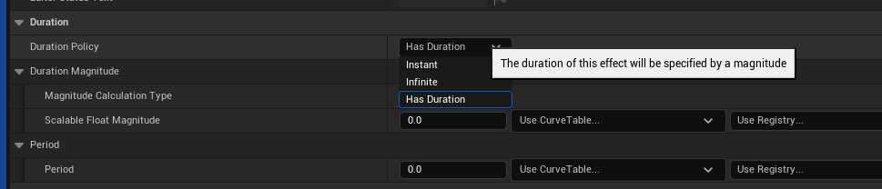

GE 的时间配置如上图所示，分为三种类型

| 周期类型 | 作用 |
| --- | --- |
| Instant | 立即执行一次 |
| Infinite | 永久持续 |
| Has Duration | 持续一段时间 |

`Period` 用于配置执行周期

根据周期类型的不同，`Period` 数值的不同，会出现几种不同的情况

| Duration 配置 | 效果 | 解释 |
| --- | --- | --- |
| DurationPolicy: Instant  | 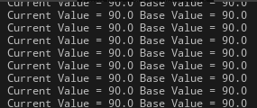 | 修改 BaseValue（current也跟着变） |
| DurationPolicy: Infinite <br> Period: 0.0 | 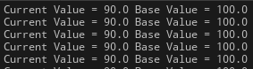 | 只修改 CurrentValue，BaseValue 不变 |
| DurationPolicy: Infinite <br> Period: 1.0 | 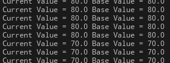 | 修改 BaseValue（current也跟着变） |
| DurationPolicy: HasDuration <br> ScalableFloatMagnitude: 2.0 <br> Period: 0.0 | 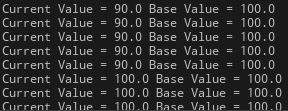 | 修改了CurrentValue，BaseValue不变，2s 后GE消除，CurrentValue 恢复到 100 |
| DurationPolicy: HasDuration <br> ScalableFloatMagnitude: 2.0 <br> Period: 1.0 | 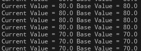 | 直接修改了 BaseValue （current也跟着变） |

分析来看，这是合理的

- 如果一个 `Effect` 是周期性的，但是 `Period` 为 0，表示这是一个增益性的 Buff，在持续时间结束后需要清除，所以修改 `CurrentValue` 更为合适
- 如果一个 `Effect` 是周期性的，并且 `Period` 不为 0 或者这个 GE 是 `Instant` 的，那么生效时应该修改 `BaseValue`

但是这是一个隐式的计算过程，对外并不可见，可能会导致使用者的使用错误，所以需要添加额外说明

通过查看源码，可以发现对属性的所有修改操作，会封装成一个 `Mod` 的数组，基于 `BaseValue` 和 `Mod` 数组，最终计算得到 `CurrentValue`

> `Mod` 是 `Modifier` 的缩写

### GE 的添加流程

以 `BlueprintCallable` 的 `BP_ApplyGameplayEffectToSelf` 作为入口

1. 通过传入的 `TSubclassOf<UGameplayEffect>` 创建 GE 对象
2. 调用 `ApplyGameplayEffectToTarget`

```cpp
UGameplayEffect* GameplayEffect = GameplayEffectClass->GetDefaultObject<UGameplayEffect>();
return ApplyGameplayEffectToTarget(GameplayEffect, Target, Level, Context);	注意这里是通过 GetDefaultObject 获取目标的 CDO 对象，也就是说所有 
```

GE 在这里得到的 `GameplayEffect` 都是同一个对象，这为后面判断堆叠提供了帮助
在 `ApplyGameplayEffectToTarget` 中

1. 通过传入参数创建 `FGameplayEffectSpec`
2. 调用 `ApplyGameplayEffectSpecToTarget`

```cpp
FGameplayEffectSpec	Spec(GameplayEffect, Context, Level);
return ApplyGameplayEffectSpecToTarget(Spec, Target, PredictionKey);在 ApplyGameplayEffectSpecToTarget 中
```

1. 判断是否需要预测，以此来清空预测键 `PredictionKey`
2. 调用 `Target->ApplyGameplayEffectSpecToSelf` 获得 GE 的 `Handle`
接下来所有代码都不考虑网络同步和预测的问题
在 `Target->ApplyGameplayEffectSpecToSelf` 中
3. 检查
   - 通过 `GameplayEffectApplicationQueries` 检查当前要添加的 GE 是否有效
   - 通过 `ActiveGameplayEffects` 和当前要添加的 GE 检查能否添加
     - 通过 `GEComponent` 来判断的
     - 例如：`AssetTagsGameplayEffectComponent`、`AbilitiesGameplayEffectComponent` 等 `GEComponent` 配置
   - 检查当前准备添加的 GE 是否配置了有效的 `Attribute`
4. 判断是否是立即执行的 GE
   - 如果是立即执行的 GE：`ExecuteGameplayEffect(*OurCopyOfSpec, PredictionKey)` 直接执行 GE
   - 如果是持续时间的 GE：`ActiveGameplayEffects.ApplyGameplayEffectSpec` 添加 GE 到容器中

在 `ActiveGameplayEffects.ApplyGameplayEffectSpec` 中

1. 判断堆叠
   - 如果堆叠：更新叠层计数，根据条件刷新持续时间、重置计数器等操作，使用现有的 `FActiveGameplayEffect` 实例
   - 如果不堆叠：创建 `FActiveGameplayEffect` 实例
2. 重新计算 `FActiveGameplayEffect` 数值，收集其绑定的属性
3. 计算持续时间和周期，绑定 Timer 到 `FActiveGameplayEffect` 实例上
4. 根据是否堆叠触发不同的事件
   - 如果堆叠：触发 `OnStackCountChange`
   - 如果不堆叠：触发 `InternalOnActiveGameplayEffectAdded`

在代码中有两个地方使用了 `TimeManager`

- 第一个 Timer 是在持续时间结束后触发，用于标记效果过期（可以移除效果），只触发一次所以 `bLoop` 设置为 false
- 第二个 Timer 是固定时间执行周期性效果（每秒造成1点伤害），需要循环触发所以设置为 true
  - 如果 GE 的 `bExecutePeriodicEffectOnApplication` 为 true，表示 GE 添加时立刻执行一次，所以会额外注册一个 TimerManager.SetTimerForNextTick

```cpp
// Calculate Duration mods if we have a real duration
if (DurationBaseValue > 0.f)
{
    float FinalDuration = AppliedEffectSpec.CalculateModifiedDuration();
    // 一些判断和特殊数据处理
    if (Owner && bSetDuration)
    {
        FTimerManager& TimerManager = Owner->GetWorld()->GetTimerManager();
        FTimerDelegate Delegate = FTimerDelegate::CreateUObject(Owner, &UAbilitySystemComponent::CheckDurationExpired, AppliedActiveGE->Handle);
        TimerManager.SetTimer(AppliedActiveGE->DurationHandle, Delegate, FinalDuration, false);
        if (!ensureMsgf(AppliedActiveGE->DurationHandle.IsValid(), TEXT("Invalid Duration Handle after attempting to set duration for GE %s @ %.2f"), 
            *AppliedActiveGE->GetDebugString(), FinalDuration))
        {
            // Force this off next frame
            TimerManager.SetTimerForNextTick(Delegate);
        }
    }
}

// Register period callbacks with the timer manager
if (bSetPeriod && Owner && (AppliedEffectSpec.GetPeriod() > UGameplayEffect::NO_PERIOD))
{
    FTimerManager& TimerManager = Owner->GetWorld()->GetTimerManager();
    FTimerDelegate Delegate = FTimerDelegate::CreateUObject(Owner, &UAbilitySystemComponent::ExecutePeriodicEffect, AppliedActiveGE->Handle);
        
    // The timer manager moves things from the pending list to the active list after checking the active list on the first tick so we need to execute here
    if (AppliedEffectSpec.Def->bExecutePeriodicEffectOnApplication)
    {
        TimerManager.SetTimerForNextTick(Delegate);
    }

    TimerManager.SetTimer(AppliedActiveGE->PeriodHandle, Delegate, AppliedEffectSpec.GetPeriod(), true);
}
```

在 `InternalOnActiveGameplayEffectAdded` 函数中

1. 会根据 GEComponent 来判断当前 GE 能否被激活或者说是否被抑制(`bIsInhibited`)
2. 调用 `UAbilitySystemComponent::InhibitActiveGameplayEffect`

在 `UAbilitySystemComponent::InhibitActiveGameplayEffect` 函数中

1. 根据 GE 是否被 抑制
   - 被抑制：执行 `RemoveActiveGameplayEffectGrantedTagsAndModifiers`
   - 不被抑制：执行 `AddActiveGameplayEffectGrantedTagsAndModifiers`
2. 触发 `OnInhibitionChanged` 事件
3. 在 `FScopedAggregatorOnDirtyBatch` 对象析构的时候触发
   - `ActiveGameplayEffects.OnMagnitudeDependencyChange` 属性变化事件
   - `OnDirty` 脏数据事件触发

#### 流程图

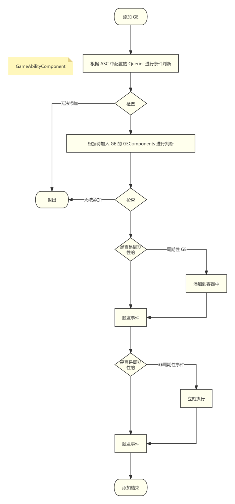

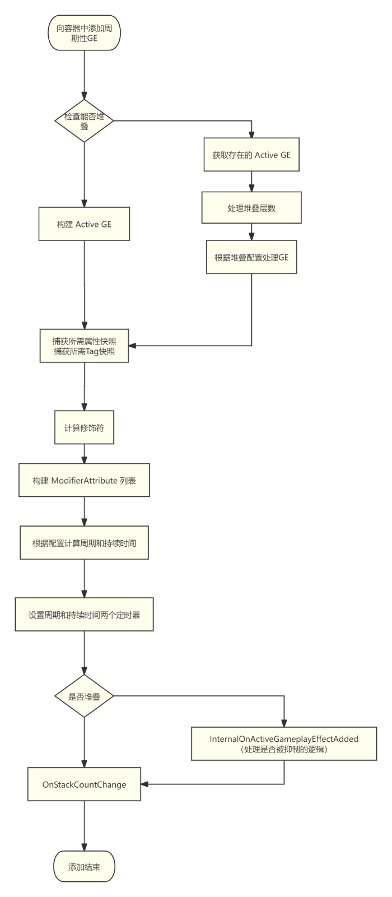

#### 代码执行过程

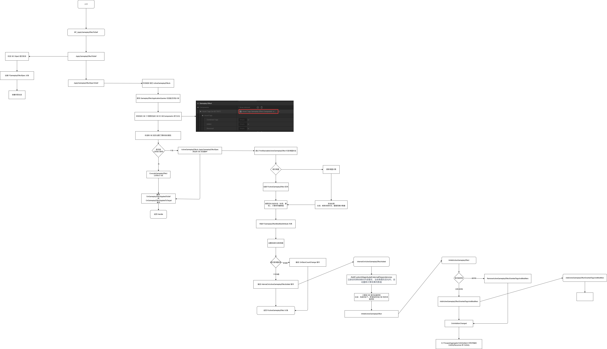

### GE 的执行流程

```cpp
FTimerDelegate Delegate = FTimerDelegate::CreateUObject(Owner, &UAbilitySystemComponent::ExecutePeriodicEffect, AppliedActiveGE->Handle);
```

根据上面的代码，直接定位执行位置是 `UAbilitySystemComponent::ExecutePeriodicEffect`

通过函数调用，真正执行的代码在 `FActiveGameplayEffectsContainer::ExecuteActiveEffectsFrom` 函数中

1. 设置 `TargetTags` 即 `Owner` 标记上的 `GameplayTags`
2. 计算 `GE` 的 `Modifiers`
3. 通过循环调用 `InternalExecuteMod` 应用 `Modifier`
4. 遍历 `Executions` 数组，计算得到 `ConditionalEffectSpecs` 将要附加的 GE
5. 触发 GC
6. 应用 `ConditionalEffectSpecs`
7. 最后触发事件

重点在于两个函数 `CalculateModifierMagnitudes` 和 `InternalExecuteMod`

在 `CalculateModifierMagnitudes` 中

```cpp
const FGameplayModifierInfo& ModDef = Def->Modifiers[ModIdx];
FModifierSpec& ModSpec = Modifiers[ModIdx];

if (ModDef.ModifierMagnitude.AttemptCalculateMagnitude(*this, ModSpec.EvaluatedMagnitude) == false)
{
    ModSpec.EvaluatedMagnitude = 0.f;
    ABILITY_LOG(Warning, TEXT("Modifier on spec: %s was asked to CalculateMagnitude and failed, falling back to 0."), *ToSimpleString());
}
```

很清晰，通过在 GE 中配置的 `Def->Modifiers` 计算出 `ModSpec.EvaluatedMagnitude` 的值

```cpp
switch (MagnitudeCalculationType)
{
case EGameplayEffectMagnitudeCalculation::ScalableFloat:break;
case EGameplayEffectMagnitudeCalculation::AttributeBased:break;
case EGameplayEffectMagnitudeCalculation::CustomCalculationClass:break;
case EGameplayEffectMagnitudeCalculation::SetByCaller:break;
// ...
}
```

在 `AttemptCalculateMagnitude` 中通过枚举，来计算具体的值内容

在 `InternalExecuteMod` 函数中，核心代码如下

```cpp
if (AttributeSet->PreGameplayEffectExecute(ExecuteData))
{
    float OldValueOfProperty = Owner->GetNumericAttribute(ModEvalData.Attribute);
    ApplyModToAttribute(ModEvalData.Attribute, ModEvalData.ModifierOp, ModEvalData.Magnitude, &ExecuteData);

    FGameplayEffectModifiedAttribute* ModifiedAttribute = Spec.GetModifiedAttribute(ModEvalData.Attribute);
    if (!ModifiedAttribute)
    {
        // If we haven't already created a modified attribute holder, create it
        ModifiedAttribute = Spec.AddModifiedAttribute(ModEvalData.Attribute);
    }
    ModifiedAttribute->TotalMagnitude += ModEvalData.Magnitude;

    {
        SCOPE_CYCLE_COUNTER(STAT_PostGameplayEffectExecute);
        /** This should apply 'gamewide' rules. Such as clamping Health to MaxHealth or granting +3 health for every point of strength, etc */
        AttributeSet->PostGameplayEffectExecute(ExecuteData);
    }
}
```

基本流程也很简单

1. 调用 `PreGameplayEffectExecute` 判断能否触发
2. 添加对应属性修改 `ApplyModToAttribute`
3. 添加属性的修改记录
4. 设置累加值
5. 触发事件 `PostGameplayEffectExecute`

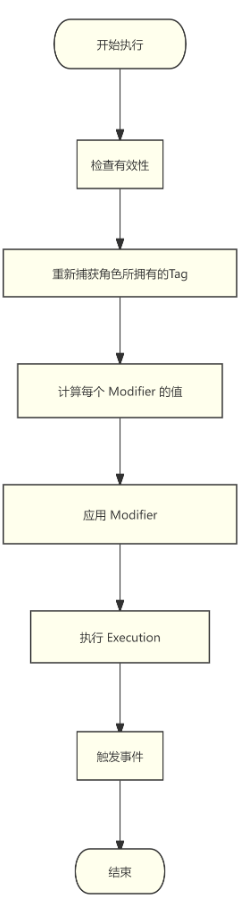

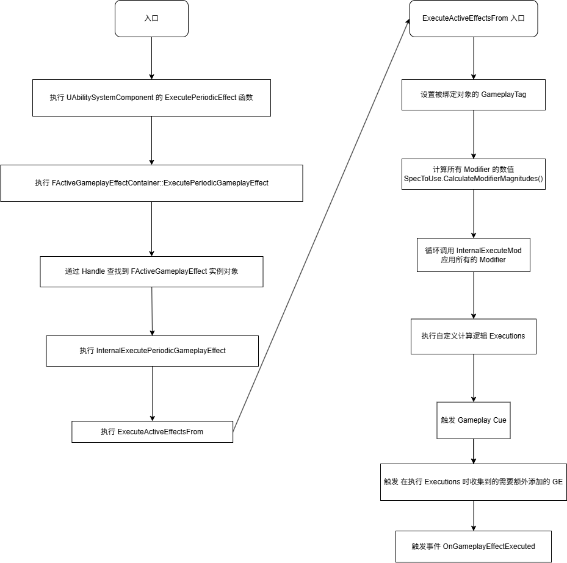

### UGameplayEffectCalculation

`UGameplayEffectCalculation` 与 `UGameplayModMagnitudeCalculation` 类似，都是可以自定义属性的计算过程，不同的是 `UGameplayEffectCalculation` 可以对多个属性进行操作

以 `Lyra` 项目中的 `ULyraDamageExecution` 为例

```cpp
Execute_Implementation(const FGameplayEffectCustomExecutionParameters& ExecutionParams, FGameplayEffectCustomExecutionOutput& OutExecutionOutput)
```

首先观察参数

- `ExecutionParams` 是 `const &`，表示作为输入
- `OutExecutionOutput` 是 `&`，表示作为输出

通过 `ExecutionParams` 可以得到 `FGameplayEffectSpec` 这个 GE 的运行时实例

```cpp
const FGameplayTagContainer* SourceTags = Spec.CapturedSourceTags.GetAggregatedTags();
const FGameplayTagContainer* TargetTags = Spec.CapturedTargetTags.GetAggregatedTags();

FAggregatorEvaluateParameters EvaluateParameters;
EvaluateParameters.SourceTags = SourceTags;
EvaluateParameters.TargetTags = TargetTags;

float BaseDamage = 0.0f;
ExecutionParams.AttemptCalculateCapturedAttributeMagnitude(DamageStatics().BaseDamageDef, EvaluateParameters, BaseDamage);
```

收集 `Source` 和 `Target` 身上的 `Tag`，通过 `AttemptCalculateCapturedAttributeMagnitude` 将捕获的**属性** 以及 收集的信息 进行计算得到 `BaseDamage`

> 捕获的属性是 `ULyraCombatSet::GetBaseDamageAttribute()`

> 这一步进行计算，得到属性值

接下来就是进行**一系列**计算：距离衰减、友伤判定、护甲衰减等，得到最终的数值 `DamageDone`

最后将 `DamageDown` 应用到属性上

```cpp
OutExecutionOutput.AddOutputModifier(FGameplayModifierEvaluatedData(ULyraHealthSet::GetDamageAttribute(), EGameplayModOp::Additive, DamageDone));
```

注意，最开始获取伤害是通过 `ULyraCombatSet::GetBaseDamageAttribute` 属性，最后应用伤害是在 `ULyraHealthSet::GetDamageAttribute`

这也是 `UGameplayEffectCalculation` 的优势点

### UGameplayEffectComponent

为了方便配置、提升可扩展性，将 GE 执行的各个流程封装成成 `UGameplayEffectComponent`，根据各自的需求实现各自的共嫩

从源码来看，`UGameplayEffectComponent` 内容非常简单

| 函数 | 作用 |
| --- | --- |
| CanGameplayEffectApply | 检查 GE 是否可以应用到目标，必须所有的 `GEComponent` 都返回 True ，该 GE 才可以被应用 |
| OnActiveGameplayEffectAdded | 带持续时间的效果激活时，如果返回 False，表示该 GE 不能激活 |
| OnGameplayEffectExecuted | 在瞬时效果或周期效果的执行时触发 |
| OnGameplayEffectApplied | 效果首次应用或堆叠时的通用入口 |
| OnGameplayEffectChanged | 编辑器中对 GameplayEffect 的修改保存后 |

> `OnGameplayEffectChanged` 通常执行在 Editor 模式下

通过拆分 GE 的生命周期，根据各自的需求封装 `GEComponent`

-------

以 `UAdditionalEffectsGameplayEffectComponent` 为例

`UAdditionalEffectsGameplayEffectComponent` 的作用是当 GE 被 `Applied` 的时候，添加新的 GE 到 `Target` 上

- 在 `OnActiveGameplayEffectAdded` 激活时绑定了 GE 的 Removed 事件，方便在 Removed 的时候删除本次添加的 GE
- 在 `OnGameplayEffectApplied` 通过 `ConditionalEffect` 将能够添加的 GE 添加到 Target 上

-------

以 `UAssetTagsGameplayEffectComponent` 为例

`UAssetTagsGameplayEffectComponent` 的作用是为 GE 添加 Tags

- 在 `OnGameplayEffectChanged` 的时候，将 `InheritableAssetTags` 存储的内容添加到 GE 的 `CachedAssetTags` 属性中
- 在 `PostEditChangeProperty` 的时候，同步更新 GE 中的 `CachedAssetTags` 属性

> `PostEditChangeProperty` 是 UObject 的函数，当资产更新的时候触发，这里就是修改 `AssetTag` 的时候触发

--------

还有一个 `UGameplayEffectUIData` 

`UGameplayEffectUIData` 本身没有 任何属性，也没有重写 任何函数

它的作用就是作为一个标记类，所有继承 `UGameplayEffectUIData` 的类都是用于 UI 显示的**配置**

比如 `Lyra` 项目中 `UTopDownArenaPickupUIData`，在项目中可以通过 `GetGameplayEffectUIData` 获取对应的继承 `UGameplayEffectUIData` 的配置项

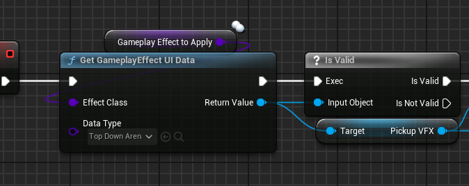

> 上述中，获取到对应的 `UGameplayEffectUIData` 后，获取配置中的特效、贴图等配置，进行后续操作 

--------

由于 `UGameplayEffectComponent` 的存在，现在 GE 的配置更加方便、简单、易读
