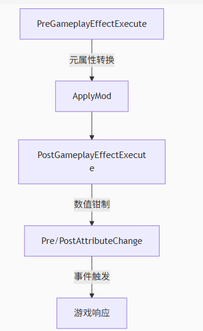

# GAS

## 思考

关于 GE (Gameplay Effect) 有一些想法

一个 Effect 需要考虑哪些功能呢？

- 配置项
  - 周期触发配置项
  - 叠层配置项
  - 冲突、免疫配置项
    - 冲突：该 Effect 生效时，哪些已有的 Buff 会失去效果
    - 免疫：该 Effect 生效时，哪些还未添加的 Buff 无法添加或不能生效
  - 上下文信息
    - Caster：施加者。可以为空，比如场地效果
    - Parent：被施加者。不可为空
    - Ability：通过 技能 施加。可以为空，比如场地效果，以 技能 形式添加
  - 当前 Effect 的 Tag
  - 当前 Effect 所处的状态
    - BeforeInit
    - Init
    - Exeution
    - Finished
    - Destroy
  - Caster 被销毁时，是否保持该 Effect
  - Parent 被销毁时，是否保持该 Effect
  - 对属性进行的操作
  - 是否在 UI 上显示
  - 阶段触发事件
    - 通知 Parent/Caster/Ability 当前 Buff 所处阶段
- 操作配置
  - 优先级
  - 目标属性
  - 操作配置：加、乘、除、覆盖
  - 数值配置
- 触发周期配置
  - 触发类型
    - 直接触发
    - 周期性触发，持续一段时间
    - 周期性触发，永久存在
  - 触发周期间隔时间
  - 持续时间
  - 是否立刻触发：如果是周期性触发，是否在生效时立刻触发一次
- 叠层机制配置
  - 能否叠层
  - 最大叠层数限制
  - 叠层方案
    - 不叠层，刷新当前 buff 的持续时间
    - 叠层，不刷新当前 buff 的持续时间，一层一层减少
    - 叠层，刷新当前 buff的持续时间，并且更改数值，一层一层减少
    - 叠层，刷新当前 buff 的持续时间，并且更改数值，一次性扣完所有层数
- 数值配置
  - 配置固定值
  - 基于属性百分比
    - 数值来源
      - Caster
      - Parent
    - 是否限制取值范围
    - 最大值
    - 最小值
  - 自定义计算流程
  - 是否动态计算，也就是运行时计算，还是一直使用添加时的数值
    - 简单来说就是，是否锁面板

## Attribute

### AttributeSet

- 作为**属性容器**，存储游戏实体的所有属性
- 作为**行为控制器**，通过生命周期钩子函数控制属性修改逻辑
- 实现网络同步基础
- 执行数值钳制、伤害计算等游戏规则

| 虚函数 | 作用 | 返回值 |
| --- | --- | --- |
| PreGameplayEffectExecute | 效果执行执行前触发 | 返回 false 可阻止效果应用 |
| PostGameplayEffectExecute | 处理效果后的状态更新 |  |
| PreAttributeChange | 任何属性修改前调用（包括直接修改） |  |
| PostAttributeChange | 属性修改后调用 |  |
| PreAttributeBaseChange | 属性基础值修改前调用（Aggregator存在时） |  |
| PostAttributeBaseChange | 属性基础值修改后调用 |  |
| OnAttributeAggregatorCreated | 自定义属性聚合规则 |  |



在 `UAbilitySystemComponent::InitializeComponent` 的时候，会获取绑定对象上所有的 `UAttributeSet` 并将其保存在 `SpawnedAttributes` 属性中

```cpp
void UAbilitySystemComponent::InitializeComponent()
{
	Super::InitializeComponent();
  // Do Something ...

	TArray<UObject*> ChildObjects;
	GetObjectsWithOuter(Owner, ChildObjects, false, RF_NoFlags, EInternalObjectFlags::Garbage);

	for (UObject* Obj : ChildObjects)
	{
		UAttributeSet* Set = Cast<UAttributeSet>(Obj);
		if (Set)  
		{
			SpawnedAttributes.AddUnique(Set);
		}
	}

	SetSpawnedAttributesListDirty();
}
```

所以在角色中需要定义 `UAttributeSet` 属性

```cpp
class LYRAGAME_API ALyraCharacterWithAbilities : public ALyraCharacter
{
private:
	UPROPERTY(VisibleAnywhere, Category = "Lyra|PlayerState")
	TObjectPtr<ULyraAbilitySystemComponent> AbilitySystemComponent;
	
	UPROPERTY()
	TObjectPtr<const class ULyraHealthSet> HealthSet;
	UPROPERTY()
	TObjectPtr<const class ULyraCombatSet> CombatSet;
}
```

然后在构造函数中初始化 `UAttributeSet` 属性 和 技能系统组件 (`ULyraAbilitySystemComponent`)

```cpp
ALyraCharacterWithAbilities::ALyraCharacterWithAbilities(const FObjectInitializer& ObjectInitializer)
	: Super(ObjectInitializer)
{
	AbilitySystemComponent = ObjectInitializer.CreateDefaultSubobject<ULyraAbilitySystemComponent>(this, TEXT("AbilitySystemComponent"));
	AbilitySystemComponent->SetIsReplicated(true);
	AbilitySystemComponent->SetReplicationMode(EGameplayEffectReplicationMode::Mixed);

	HealthSet = CreateDefaultSubobject<ULyraHealthSet>(TEXT("HealthSet"));
	CombatSet = CreateDefaultSubobject<ULyraCombatSet>(TEXT("CombatSet"));
}
```

> Lyra 继承 `UAbilitySystemComponent` 实现了自己的 `ULyraAbilitySystemComponent`

通过上面的代码，可以发现一个角色可以存在多个 `UAttributeSet`

### 关于属性的思考

- 效果 A：是 `Duration` 类型，持续时间是 3s，`Period` 为 0，作用是 Add HP 50%
- 效果 B：是 `Instant` 类型，作用是 Add HP -5

先执行 A，再执行 B

```bash
Current Value = 40.0 Base Value = 40.0
Current Value = 60.0 Base Value = 40.0
Current Value = 52.5 Base Value = 35.0
Current Value = 35.0 Base Value = 35.0    // 3s 之后
```

很明显，由于 `Instant` 是直接修改 `BaseValue`，导致效果 A 基于 `BaseValue` 增加 50% 后计算得到值是 52.5

从玩家体验来看，理论上来说应该扣除 5 点血量，剩余 55 血量，结果实际上是 52.5。对用户来说这就是明显的 Bug

> 这里关于 `Instant` 属性修改，可以先看下面 **GE 的时间周期分类**

于是乎，我们想到一种解决方案
以血量为例，除开 `HP`、`MaxHP` 之外，再额外加上 `ExtraHP` 和 `Damage`
对血量的操作并不直接作用于 `HP`，而是作用于 `ExtraHP`

1. 假设初始血量为 40
2. 使用效果 A，增加血量 50%，此时 ExtraHP 值为 20
3. 使用效果 B，减少血量 5点，此时 Damage 值为 5
4. 计算得到 HP 的 `CurrentValue` 为 55，即 `HP + ExtraHP - Damage`
5. 效果 A 时间结束，结束时根据 `ExtraHP` 的值动态修改 `Damage` 值，此时 `ExtraHP` 为 0，`Damage` 值为 0（因为 20 > 5，如果 `Damage` 值为 30，那么效果 A 结束时 Damage 更新为 10）
6. 计算得到 HP 的 `CurrentValue` 为 `HP + ExtraHP - Damage` = 4

> 临时性 HP 修改全部作用于 ExtraHP，比如 效果A，或者其他 Buff、Debuff  
> 直接扣除 HP 的全部作用于 Damage  
> 增加当前 HP 的全部作用于 HP  

### 关于属性的最大最小值

1. 限制一个属性的取值范围，需要自己处理
2. 一个属性的最大值可能是另一个属性的值，比如**血量**和**最大血量**，最大血量会随着角色等级增加

以 `Lyra` 为例

首先对**生命值**和**最大生命值**设置取值范围

```cpp
void ULyraHealthSet::ClampAttribute(const FGameplayAttribute& Attribute, float& NewValue) const
{
	if (Attribute == GetHealthAttribute())
	{
		NewValue = FMath::Clamp(NewValue, 0.0f, GetMaxHealth());
	}
	else if (Attribute == GetMaxHealthAttribute())
	{
		NewValue = FMath::Max(NewValue, 1.0f);
	}
}
```

剩下的就是在合适调用 `ClampAttribute`

通常在什么时候会对属性进行修改？ GE 执行的时候

于是在 GE 执行之后，将属性值限制在范围内即可

```cpp
void ULyraHealthSet::PostGameplayEffectExecute(const FGameplayEffectModCallbackData& Data)
{
  // ... do something

  else if (Data.EvaluatedData.Attribute == GetHealthAttribute())
	{
		SetHealth(FMath::Clamp(GetHealth(), MinimumHealth, GetMaxHealth()));
	}
	else if (Data.EvaluatedData.Attribute == GetMaxHealthAttribute())
	{
		OnMaxHealthChanged.Broadcast(Instigator, Causer, &Data.EffectSpec, Data.EvaluatedData.Magnitude, MaxHealthBeforeAttributeChange, GetMaxHealth());
	}
}
```

当然还有一些其他情况，比如说在 C++ 中拿到 `AttributeSet` 然后强行修改对应属性，应对这种状态也有对应函数接口

在 `PreAttributeBaseChange` 和 `PreAttributeChange` 中，将将要设置的属性值进行修改，保证值在允许的区间范围内

在 `PostAttributeChange` 函数中判断是否修改了最大血量，如果当前血量大于最大血量，限制当前血量的值

```cpp
void ULyraHealthSet::PreAttributeBaseChange(const FGameplayAttribute& Attribute, float& NewValue) const
{
	Super::PreAttributeBaseChange(Attribute, NewValue);

	ClampAttribute(Attribute, NewValue);
}

void ULyraHealthSet::PreAttributeChange(const FGameplayAttribute& Attribute, float& NewValue)
{
	Super::PreAttributeChange(Attribute, NewValue);

	ClampAttribute(Attribute, NewValue);
}

void ULyraHealthSet::PostAttributeChange(const FGameplayAttribute& Attribute, float OldValue, float NewValue)
{
	Super::PostAttributeChange(Attribute, OldValue, NewValue);

	if (Attribute == GetMaxHealthAttribute())
	{
		// Make sure current health is not greater than the new max health.
		if (GetHealth() > NewValue)
		{
			ULyraAbilitySystemComponent* LyraASC = GetLyraAbilitySystemComponent();
			check(LyraASC);

			LyraASC->ApplyModToAttribute(GetHealthAttribute(), EGameplayModOp::Override, NewValue);
		}
	}

	if (bOutOfHealth && (GetHealth() > 0.0f))
	{
		bOutOfHealth = false;
	}
}
```

## Aggregator

聚合器，用于存储对一个属性的所有操作

由于一些 GE 是临时对属性进行修改，在 GE 到期或者因为其他 GE 而被抑制的时候，需要撤销对属性的修改

如果单独使用一个 `float` 来记录属性是不合适的，因为在 GE 撤销的时候无法对属性进行准确的还原

通常的做法是，记录一个 `BaseValue`，记录基于 `BaseValue` 进行一系列的操作 `Mod`，最后通过 `BaseValue` 和 `Mod` 可以得到 `CurrentValue` 也就是最终值

> 最终显示给玩家的，可能是多个属性集合起来的效果

```cpp
USTRUCT(BlueprintType)
struct GAMEPLAYABILITIES_API FGameplayAttributeData
{
  // Some Functions ...
protected:
	UPROPERTY(BlueprintReadOnly, Category = "Attribute")
	float BaseValue;

	UPROPERTY(BlueprintReadOnly, Category = "Attribute")
	float CurrentValue;
}
```

### FAggregatorModInfo

`FAggregatorModInfo` 用于存储对属性的**一次**操作的信息

```cpp
struct GAMEPLAYABILITIES_API FAggregatorModInfo
{
	EGameplayModEvaluationChannel Channel;
	EGameplayModOp::Type Op;
	const FAggregatorMod* Mod;
};
```

`Op` 就是 `Operator`，就是操作

UE 提供 四种 操作：加、乘、除、覆盖

| 类型 | 含义 |
| --- | --- |
| EGameplayModOp::Additive | 加 |
| EGameplayModOp::Multiplicitive | 乘 |
| EGameplayModOp::Division | 除 |
| EGameplayModOp::Override | 覆盖 |
| EGameplayModOp::Max | 无效操作 |

> 没有减法，因为加一个负数，就是减法

`FAggregatorMod` 存储的是具体操作的数值

```cpp
struct GAMEPLAYABILITIES_API FAggregatorMod
{
  // Some Functions ...

	const FGameplayTagRequirements*	SourceTagReqs;  // 施加效果者的标签
	const FGameplayTagRequirements*	TargetTagReqs;  // 被施加效果者的标签

	float EvaluatedMagnitude;	    // 计算后的最终修改值
	float StackCount;             // 效果堆叠机制

	FActiveGameplayEffectHandle ActiveHandle;	
	bool IsPredicted;             // 是否是预测生成的

private:
	mutable bool IsQualified;     // 该 Mod 是否有效
}
```

不过这个结构体，通常是用于记录一些数据传递给外界，运行时本质存储并非如此

### FAggregatorModChannel

`FAggregatorModChannel` 用于存储一个 `Channel` 中的所有 `Mod`

> `Channel` 不知道怎么翻译，一般可以说是 **通道**

```cpp
UENUM()
enum class EGameplayModEvaluationChannel : uint8
{
	Channel0 UMETA(Hidden),
	Channel1 UMETA(Hidden),
	Channel2 UMETA(Hidden),
	Channel3 UMETA(Hidden),
	Channel4 UMETA(Hidden),
	Channel5 UMETA(Hidden),
	Channel6 UMETA(Hidden),
	Channel7 UMETA(Hidden),
	Channel8 UMETA(Hidden),
	Channel9 UMETA(Hidden),

	// Always keep last
	Channel_MAX UMETA(Hidden)
};
```

虚幻给出了 10 个 `Channel`

至于 `Channel` 的作用就是将 `Channel0` 计算的值，作为基础值给 `Channel1`，再将 `Channel1` 的值作为基础值给 `Channel2` 

```cpp
for (auto& ChannelEntry : ModChannelsMap)
{
  const FAggregatorModChannel& CurChannel = ChannelEntry.Value;
  ComputedValue = CurChannel.EvaluateWithBase(ComputedValue, Parameters);
}
```

用于对不同权重 `Mod` 进行操作

比如，游戏中 **伤害** 通常是 `(基础攻击力 + 装备攻击力) * 攻击倍率 * 伤害倍率 * 增伤倍率`

可以将 `基础攻击力 + 装备攻击力` 记录在 `Channel0` 通道中，计算得到值

将 **攻击倍率** 记录在 `Channel1` 通道中，将 **伤害倍率** 记录在 `Channel2` 中

> 实际情况可能更加复杂，这里只是为了说明 `Channel` 的使用，而举例

`FAggregatorModChannel` 结构体本身比较简单

```cpp
struct GAMEPLAYABILITIES_API FAggregatorModChannel
{
public:
  // 一些其他的函数（Some Function Else） ... 

  static float SumMods(const TArray<FAggregatorMod>& InMods, float Bias, const FAggregatorEvaluateParameters& Parameters);

private:
	TArray<FAggregatorMod> Mods[EGameplayModOp::Max];
}
```

核心属性仅有一个 `Mods`，其本质是一个 **二维数组**，一维数组长度是 4，数组中各个元素对应的就是具体操作的数值

比如 `EGameplayModOp::Additive` 值为 0，那么 `Mods[0]` 存储的就是 **加法** 对应的所有操作数值

> `EGameplayModOp::Max` 值等于 4

#### EvaluateWithBase

以 `EvaluateWithBase` 函数为例，说明计算一个 `Channel` 的计算过程

```cpp
float FAggregatorModChannel::EvaluateWithBase(float InlineBaseValue, const FAggregatorEvaluateParameters& Parameters) const
{
	for (const FAggregatorMod& Mod : Mods[EGameplayModOp::Override])
	{
		if (Mod.Qualifies())
		{
			return Mod.EvaluatedMagnitude;
		}
	}

	float Additive = SumMods(Mods[EGameplayModOp::Additive], GameplayEffectUtilities::GetModifierBiasByModifierOp(EGameplayModOp::Additive), Parameters);
	float Multiplicitive = SumMods(Mods[EGameplayModOp::Multiplicitive], GameplayEffectUtilities::GetModifierBiasByModifierOp(EGameplayModOp::Multiplicitive), Parameters);
	float Division = SumMods(Mods[EGameplayModOp::Division], GameplayEffectUtilities::GetModifierBiasByModifierOp(EGameplayModOp::Division), Parameters);

	if (FMath::IsNearlyZero(Division))
	{
		ABILITY_LOG(Warning, TEXT("Division summation was 0.0f in FAggregatorModChannel."));
		Division = 1.f;
	}

	return ((InlineBaseValue + Additive) * Multiplicitive) / Division;
}
```

首先获取 `EGameplayModOp::Override` 类型为 **覆盖** 操作的所有 `Mod`，找到第一个有效的 `Mod`，将其值作为返回值

> 很合理，**覆盖** 就是要覆盖其他操作计算的结果

接下来分别获取 加、乘、除 计算对应的值，并存储到对应的变量中 `Additive`、`Multiplicitive`、`Division`

> 这里顺便检查了一下 `Division` 是否趋近于 0，预防除 0 错误

最后计算的值是 `((InlineBaseValue + Additive) * Multiplicitive) / Division`

可以知道，GAS 默认的计算公式是 `(Value + Add) * Multi / Division`

#### SumMods

`SumMods` 函数比较简单，用于计算一个 **加**、**乘**、**除** 各自操作的最终值

```cpp
float FAggregatorModChannel::SumMods(const TArray<FAggregatorMod>& InMods, float Bias, const FAggregatorEvaluateParameters& Parameters)
{
	float Sum = Bias;

	for (const FAggregatorMod& Mod : InMods)
	{
		if (Mod.Qualifies())
		{
			Sum += (Mod.EvaluatedMagnitude - Bias);
		}
	}

	return Sum;
}
```

虽然看着简单，但是 `Bias` 是什么？

`Bias` 具体的作用需要看到调用 `SumMods` 时的参数

```cpp
float Additive = SumMods(Mods[EGameplayModOp::Additive], GameplayEffectUtilities::GetModifierBiasByModifierOp(EGameplayModOp::Additive), Parameters);

float GameplayEffectUtilities::GetModifierBiasByModifierOp(EGameplayModOp::Type ModOp)
{
	static const float ModifierOpBiases[EGameplayModOp::Max] = {0.f, 1.f, 1.f, 0.f};
	check(ModOp >= 0 && ModOp < EGameplayModOp::Max);

	return ModifierOpBiases[ModOp];
}
```

`GetModifierBiasByModifierOp` 函数也很简单，对 **加法** 和 **覆盖** 操作返回 0；对 **乘法** 和 **除法** 返回 0

其实理解 `Bias` 的作用很简单，比如我希望血量增加 50%，那么 **乘法** 操作最后得到的值是 `0.5`，`BaseValue * 0.5` 很明显不符合我们的需求

对于乘法来说，期望增加 50% 其实是希望 `BaseValue * 1.5`，所以这里的 `Bias` 就是根据具体的操作，对基础计算值做一个修改

从另一个角度来说，如果没有乘法操作，如果得到的操作值是 0，最终值也是 0，也是个错

### FAggregatorModChannelContainer

`FAggregatorModChannelContainer` 就是一个 通道容器，存储所有通道对应的 `FAggregatorModChannel`

```cpp
struct GAMEPLAYABILITIES_API FAggregatorModChannelContainer
{
  // 其他的一些计算函数(Some Functions Else)...

  float EvaluateWithBase(float InlineBaseValue, const FAggregatorEvaluateParameters& Parameters) const;

private:
	TMap<EGameplayModEvaluationChannel, FAggregatorModChannel> ModChannelsMap;
}
```

基于给定的基础值，通过 `EvaluateWithBase` 可以得到最终的值

```cpp
float FAggregatorModChannelContainer::EvaluateWithBase(float InlineBaseValue, const FAggregatorEvaluateParameters& Parameters) const
{
	float ComputedValue = InlineBaseValue;

	for (auto& ChannelEntry : ModChannelsMap)
	{
		const FAggregatorModChannel& CurChannel = ChannelEntry.Value;
		ComputedValue = CurChannel.EvaluateWithBase(ComputedValue, Parameters);
	}

	return ComputedValue;
}
```

## GE

### GE 的时间周期分类


GE 的时间配置如上图所示，分为三种类型

| 周期类型 | 作用 |
| --- | --- |
| Instant | 立即执行一次 |
| Infinite | 永久持续 |
| Has Duration | 持续一段时间 |

`Period` 用于配置执行周期

根据周期类型的不同，`Period` 数值的不同，会出现几种不同的情况

| Duration 配置 | 效果 | 解释 |
| --- | --- | --- |
| DurationPolicy: Instant  |  | 修改 BaseValue（current也跟着变） |
| DurationPolicy: Infinite <br> Period: 0.0 |  | 只修改 CurrentValue，BaseValue 不变 |
| DurationPolicy: Infinite <br> Period: 1.0 |  | 修改 BaseValue（current也跟着变） |
| DurationPolicy: HasDuration <br> ScalableFloatMagnitude: 2.0 <br> Period: 0.0 |  | 修改了CurrentValue，BaseValue不变，2s 后GE消除，CurrentValue 恢复到 100 |
| DurationPolicy: HasDuration <br> ScalableFloatMagnitude: 2.0 <br> Period: 1.0 |  | 直接修改了 BaseValue （current也跟着变） |

分析来看，这是合理的

- 如果一个 `Effect` 是周期性的，但是 `Period` 为 0，表示这是一个增益性的 Buff，在持续时间结束后需要清除，所以修改 `CurrentValue` 更为合适
- 如果一个 `Effect` 是周期性的，并且 `Period` 不为 0 或者这个 GE 是 `Instant` 的，那么生效时应该修改 `BaseValue`

但是这是一个隐式的计算过程，对外并不可见，可能会导致使用者的使用错误，所以需要添加额外说明

通过查看源码，可以发现对属性的所有修改操作，会封装成一个 `Mod` 的数组，基于 `BaseValue` 和 `Mod` 数组，最终计算得到 `CurrentValue`

> `Mod` 是 `Modifier` 的缩写

### 关于 UGameplayEffect、FGameplayEffectSpec 和 FActiveGameplayEffect

`UGameplayEffect` 用于配置，新建的 GE 的资产就是这个

`FGameplayEffectSpec` 包含 `UGameplayEffect` 和 对应的运行时信息，比如运行时计算得到的 `Duration`、`Period` 等

`FActiveGameplayEffect` 包含 `UGameplayEffect`，当一个 GE 是周期性时，会加入到 `FActiveGameplayEffectsContainer` 容器中，需要记录 GE 执行的 开始时间、下一次执行时间 等信息

综上，不同的配置用于的不同的情况，但是无论如何，一个 GE 只要被应用了，就会创建对应的 `FGameplayEffectSpec` 实例

### GE 的添加流程

以 `BlueprintCallable` 的 `BP_ApplyGameplayEffectToSelf` 作为入口

1. 通过传入的 `TSubclassOf<UGameplayEffect>` 创建 GE 对象
2. 调用 `ApplyGameplayEffectToTarget`

```cpp
UGameplayEffect* GameplayEffect = GameplayEffectClass->GetDefaultObject<UGameplayEffect>();
return ApplyGameplayEffectToTarget(GameplayEffect, Target, Level, Context);	注意这里是通过 GetDefaultObject 获取目标的 CDO 对象，也就是说所有 
```

GE 在这里得到的 `GameplayEffect` 都是同一个对象，这为后面判断堆叠提供了帮助
在 `ApplyGameplayEffectToTarget` 中

1. 通过传入参数创建 `FGameplayEffectSpec`
2. 调用 `ApplyGameplayEffectSpecToTarget`

```cpp
FGameplayEffectSpec	Spec(GameplayEffect, Context, Level);
return ApplyGameplayEffectSpecToTarget(Spec, Target, PredictionKey);在 ApplyGameplayEffectSpecToTarget 中
```

1. 判断是否需要预测，以此来清空预测键 `PredictionKey`
2. 调用 `Target->ApplyGameplayEffectSpecToSelf` 获得 GE 的 `Handle`
接下来所有代码都不考虑网络同步和预测的问题
在 `Target->ApplyGameplayEffectSpecToSelf` 中
3. 检查
   - 通过 `GameplayEffectApplicationQueries` 检查当前要添加的 GE 是否有效
   - 通过 `ActiveGameplayEffects` 和当前要添加的 GE 检查能否添加
     - 通过 `GEComponent` 来判断的
     - 例如：`AssetTagsGameplayEffectComponent`、`AbilitiesGameplayEffectComponent` 等 `GEComponent` 配置
   - 检查当前准备添加的 GE 是否配置了有效的 `Attribute`
4. 判断是否是立即执行的 GE
   - 如果是立即执行的 GE：`ExecuteGameplayEffect(*OurCopyOfSpec, PredictionKey)` 直接执行 GE
   - 如果是持续时间的 GE：`ActiveGameplayEffects.ApplyGameplayEffectSpec` 添加 GE 到容器中

在 `ActiveGameplayEffects.ApplyGameplayEffectSpec` 中

1. 判断堆叠
   - 如果堆叠：更新叠层计数，根据条件刷新持续时间、重置计数器等操作，使用现有的 `FActiveGameplayEffect` 实例
   - 如果不堆叠：创建 `FActiveGameplayEffect` 实例
2. 重新计算 `FActiveGameplayEffect` 数值，收集其绑定的属性
3. 计算持续时间和周期，绑定 Timer 到 `FActiveGameplayEffect` 实例上
4. 根据是否堆叠触发不同的事件
   - 如果堆叠：触发 `OnStackCountChange`
   - 如果不堆叠：触发 `InternalOnActiveGameplayEffectAdded`

在代码中有两个地方使用了 `TimeManager`

- 第一个 Timer 是在持续时间结束后触发，用于标记效果过期（可以移除效果），只触发一次所以 `bLoop` 设置为 false
- 第二个 Timer 是固定时间执行周期性效果（每秒造成1点伤害），需要循环触发所以设置为 true
  - 如果 GE 的 `bExecutePeriodicEffectOnApplication` 为 true，表示 GE 添加时立刻执行一次，所以会额外注册一个 TimerManager.SetTimerForNextTick

```cpp
// Calculate Duration mods if we have a real duration
if (DurationBaseValue > 0.f)
{
    float FinalDuration = AppliedEffectSpec.CalculateModifiedDuration();
    // 一些判断和特殊数据处理
    if (Owner && bSetDuration)
    {
        FTimerManager& TimerManager = Owner->GetWorld()->GetTimerManager();
        FTimerDelegate Delegate = FTimerDelegate::CreateUObject(Owner, &UAbilitySystemComponent::CheckDurationExpired, AppliedActiveGE->Handle);
        TimerManager.SetTimer(AppliedActiveGE->DurationHandle, Delegate, FinalDuration, false);
        if (!ensureMsgf(AppliedActiveGE->DurationHandle.IsValid(), TEXT("Invalid Duration Handle after attempting to set duration for GE %s @ %.2f"), 
            *AppliedActiveGE->GetDebugString(), FinalDuration))
        {
            // Force this off next frame
            TimerManager.SetTimerForNextTick(Delegate);
        }
    }
}

// Register period callbacks with the timer manager
if (bSetPeriod && Owner && (AppliedEffectSpec.GetPeriod() > UGameplayEffect::NO_PERIOD))
{
    FTimerManager& TimerManager = Owner->GetWorld()->GetTimerManager();
    FTimerDelegate Delegate = FTimerDelegate::CreateUObject(Owner, &UAbilitySystemComponent::ExecutePeriodicEffect, AppliedActiveGE->Handle);
        
    // The timer manager moves things from the pending list to the active list after checking the active list on the first tick so we need to execute here
    if (AppliedEffectSpec.Def->bExecutePeriodicEffectOnApplication)
    {
        TimerManager.SetTimerForNextTick(Delegate);
    }

    TimerManager.SetTimer(AppliedActiveGE->PeriodHandle, Delegate, AppliedEffectSpec.GetPeriod(), true);
}
```

在 `InternalOnActiveGameplayEffectAdded` 函数中

1. 会根据 GEComponent 来判断当前 GE 能否被激活或者说是否被抑制(`bIsInhibited`)
2. 调用 `UAbilitySystemComponent::InhibitActiveGameplayEffect`

在 `UAbilitySystemComponent::InhibitActiveGameplayEffect` 函数中

1. 根据 GE 是否被 抑制
   - 被抑制：执行 `RemoveActiveGameplayEffectGrantedTagsAndModifiers`
   - 不被抑制：执行 `AddActiveGameplayEffectGrantedTagsAndModifiers`
2. 触发 `OnInhibitionChanged` 事件
3. 在 `FScopedAggregatorOnDirtyBatch` 对象析构的时候触发
   - `ActiveGameplayEffects.OnMagnitudeDependencyChange` 属性变化事件
   - `OnDirty` 脏数据事件触发

#### 流程图


#### 代码执行过程


### GE 的执行流程

```cpp
FTimerDelegate Delegate = FTimerDelegate::CreateUObject(Owner, &UAbilitySystemComponent::ExecutePeriodicEffect, AppliedActiveGE->Handle);
```

根据上面的代码，直接定位执行位置是 `UAbilitySystemComponent::ExecutePeriodicEffect`

通过函数调用，真正执行的代码在 `FActiveGameplayEffectsContainer::ExecuteActiveEffectsFrom` 函数中

1. 设置 `TargetTags` 即 `Owner` 标记上的 `GameplayTags`
2. 计算 `GE` 的 `Modifiers`
3. 通过循环调用 `InternalExecuteMod` 应用 `Modifier`
4. 遍历 `Executions` 数组，计算得到 `ConditionalEffectSpecs` 将要附加的 GE
5. 触发 GC
6. 应用 `ConditionalEffectSpecs`
7. 最后触发事件

重点在于两个函数 `CalculateModifierMagnitudes` 和 `InternalExecuteMod`

在 `CalculateModifierMagnitudes` 中

```cpp
const FGameplayModifierInfo& ModDef = Def->Modifiers[ModIdx];
FModifierSpec& ModSpec = Modifiers[ModIdx];

if (ModDef.ModifierMagnitude.AttemptCalculateMagnitude(*this, ModSpec.EvaluatedMagnitude) == false)
{
    ModSpec.EvaluatedMagnitude = 0.f;
    ABILITY_LOG(Warning, TEXT("Modifier on spec: %s was asked to CalculateMagnitude and failed, falling back to 0."), *ToSimpleString());
}
```

很清晰，通过在 GE 中配置的 `Def->Modifiers` 计算出 `ModSpec.EvaluatedMagnitude` 的值

```cpp
switch (MagnitudeCalculationType)
{
case EGameplayEffectMagnitudeCalculation::ScalableFloat:break;
case EGameplayEffectMagnitudeCalculation::AttributeBased:break;
case EGameplayEffectMagnitudeCalculation::CustomCalculationClass:break;
case EGameplayEffectMagnitudeCalculation::SetByCaller:break;
// ...
}
```

在 `AttemptCalculateMagnitude` 中通过枚举，来计算具体的值内容

在 `InternalExecuteMod` 函数中，核心代码如下

```cpp
if (AttributeSet->PreGameplayEffectExecute(ExecuteData))
{
    float OldValueOfProperty = Owner->GetNumericAttribute(ModEvalData.Attribute);
    ApplyModToAttribute(ModEvalData.Attribute, ModEvalData.ModifierOp, ModEvalData.Magnitude, &ExecuteData);

    FGameplayEffectModifiedAttribute* ModifiedAttribute = Spec.GetModifiedAttribute(ModEvalData.Attribute);
    if (!ModifiedAttribute)
    {
        // If we haven't already created a modified attribute holder, create it
        ModifiedAttribute = Spec.AddModifiedAttribute(ModEvalData.Attribute);
    }
    ModifiedAttribute->TotalMagnitude += ModEvalData.Magnitude;

    {
        SCOPE_CYCLE_COUNTER(STAT_PostGameplayEffectExecute);
        /** This should apply 'gamewide' rules. Such as clamping Health to MaxHealth or granting +3 health for every point of strength, etc */
        AttributeSet->PostGameplayEffectExecute(ExecuteData);
    }
}
```

基本流程也很简单

1. 调用 `PreGameplayEffectExecute` 判断能否触发
2. 添加对应属性修改 `ApplyModToAttribute`
3. 添加属性的修改记录
4. 设置累加值
5. 触发事件 `PostGameplayEffectExecute`


### UGameplayEffectExecutionCalculation

`UGameplayEffectExecutionCalculation` 与 `UGameplayModMagnitudeCalculation` 类似，都是可以自定义属性的计算过程，不同的是 `UGameplayEffectExecutionCalculation` 可以对多个属性进行操作

以 `Lyra` 项目中的 `ULyraDamageExecution` 为例

```cpp
Execute_Implementation(const FGameplayEffectCustomExecutionParameters& ExecutionParams, FGameplayEffectCustomExecutionOutput& OutExecutionOutput)
```

首先观察参数

- `ExecutionParams` 是 `const &`，表示作为输入
- `OutExecutionOutput` 是 `&`，表示作为输出

通过 `ExecutionParams` 可以得到 `FGameplayEffectSpec` 这个 GE 的运行时实例

```cpp
const FGameplayTagContainer* SourceTags = Spec.CapturedSourceTags.GetAggregatedTags();
const FGameplayTagContainer* TargetTags = Spec.CapturedTargetTags.GetAggregatedTags();

FAggregatorEvaluateParameters EvaluateParameters;
EvaluateParameters.SourceTags = SourceTags;
EvaluateParameters.TargetTags = TargetTags;

float BaseDamage = 0.0f;
ExecutionParams.AttemptCalculateCapturedAttributeMagnitude(DamageStatics().BaseDamageDef, EvaluateParameters, BaseDamage);
```

收集 `Source` 和 `Target` 身上的 `Tag`，通过 `AttemptCalculateCapturedAttributeMagnitude` 将捕获的**属性** 以及 收集的信息 进行计算得到 `BaseDamage`

> 捕获的属性是 `ULyraCombatSet::GetBaseDamageAttribute()`

> 这一步进行计算，得到属性值

接下来就是进行**一系列**计算：距离衰减、友伤判定、护甲衰减等，得到最终的数值 `DamageDone`

最后将 `DamageDown` 应用到属性上

```cpp
OutExecutionOutput.AddOutputModifier(FGameplayModifierEvaluatedData(ULyraHealthSet::GetDamageAttribute(), EGameplayModOp::Additive, DamageDone));
```

注意，最开始获取伤害是通过 `ULyraCombatSet::GetBaseDamageAttribute` 属性，最后应用伤害是在 `ULyraHealthSet::GetDamageAttribute`

这也是 `UGameplayEffectCalculation` 的优势点

### UGameplayEffectComponent

为了方便配置、提升可扩展性，将 GE 执行的各个流程封装成成 `UGameplayEffectComponent`，根据各自的需求实现各自的功能

从源码来看，`UGameplayEffectComponent` 内容非常简单

| 函数 | 作用 |
| --- | --- |
| CanGameplayEffectApply | 检查 GE 是否可以应用到目标，必须所有的 `GEComponent` 都返回 True ，该 GE 才可以被应用 |
| OnActiveGameplayEffectAdded | 带持续时间的效果激活时，如果返回 False，表示该 GE 不能激活 |
| OnGameplayEffectExecuted | 在瞬时效果或周期效果的执行时触发 |
| OnGameplayEffectApplied | 效果首次应用或堆叠时的通用入口 |
| OnGameplayEffectChanged | 编辑器中对 GameplayEffect 的修改保存后 |

> `OnGameplayEffectChanged` 通常执行在 Editor 模式下

通过拆分 GE 的生命周期，根据各自的需求封装 `GEComponent`

-------

以 `UAdditionalEffectsGameplayEffectComponent` 为例

`UAdditionalEffectsGameplayEffectComponent` 的作用是当 GE 被 `Applied` 的时候，添加新的 GE 到 `Target` 上

- 在 `OnActiveGameplayEffectAdded` 激活时绑定了 GE 的 Removed 事件，方便在 Removed 的时候删除本次添加的 GE
- 在 `OnGameplayEffectApplied` 通过 `ConditionalEffect` 将能够添加的 GE 添加到 Target 上

-------

以 `UAssetTagsGameplayEffectComponent` 为例

`UAssetTagsGameplayEffectComponent` 的作用是为 GE 添加 Tags

- 在 `OnGameplayEffectChanged` 的时候，将 `InheritableAssetTags` 存储的内容添加到 GE 的 `CachedAssetTags` 属性中
- 在 `PostEditChangeProperty` 的时候，同步更新 GE 中的 `CachedAssetTags` 属性

> `PostEditChangeProperty` 是 UObject 的函数，当资产更新的时候触发，这里就是修改 `AssetTag` 的时候触发

--------

还有一个 `UGameplayEffectUIData` 

`UGameplayEffectUIData` 本身没有 任何属性，也没有重写 任何函数

它的作用就是作为一个标记类，所有继承 `UGameplayEffectUIData` 的类都是用于 UI 显示的**配置**

比如 `Lyra` 项目中 `UTopDownArenaPickupUIData`，在项目中可以通过 `GetGameplayEffectUIData` 获取对应的继承 `UGameplayEffectUIData` 的配置项


> 上述中，获取到对应的 `UGameplayEffectUIData` 后，获取配置中的特效、贴图等配置，进行后续操作 

--------

由于 `UGameplayEffectComponent` 的存在，现在 GE 的配置更加方便、简单、易读

## FActiveGameplayEffectsContainer

这是什么？

这是一个存储激活的 GE (`FActiveGameplayEffect`) 的**容器**(`Container`)

当一个 GE 被实例化的时候会封装成 `FGameplayEffectSpec`，当 GE 有持续时间时会通过 `ApplyGameplayEffectSpec` 添加到容器中，并封装成 `FActiveGameplayEffect`

```cpp
struct GAMEPLAYABILITIES_API FActiveGameplayEffectsContainer : public FFastArraySerializer
```

它继承自 `FFastArraySerializer`，是一种专为复制大型数组而设计的序列化方式

- 适用于 `TArray` 类型。
- 高效处理数组内任意位置的元素删除与新增，复制时仅发送变化的内容（Delta 序列化）。
- 支持在客户端触发新增、删除事件回调

> `MarkItemDirty` 对修改的 Entity 标脏

`FActiveGameplayEffectsContainer` 维护一个数组 `GameplayEffects_Internal` 用于存储 Active GE 的实体

```cpp
UPROPERTY()
TArray<FActiveGameplayEffect>	GameplayEffects_Internal;
```

| 类型 | 属性 | 作用 |
| --- | --- | --- |
| TMap<FGameplayAttribute, FAggregatorRef> | AttributeAggregatorMap | 每个被任何 Active GE 修改过的 FGameplayAttribute 维护一个 FAggregator |
| TMap<FGameplayAttribute, FOnGameplayAttributeChange> | AttributeChangeDelegates | 注册当某个 FGameplayAttribute 的值发生变化时触发的回调委托 |
| TMap<FGameplayAttribute, FOnGameplayAttributeValueChange> | AttributeValueChangeDelegates | 为每个 FGameplayAttribute 维护一个当该属性值发生有意义的变化（超出容差范围）时触发的回调委托 |
| TMap<FObjectKey, FCustomModifierDependencyHandle> | CustomMagnitudeClassDependencies | 管理动态数值计算器 (UGameplayModMagnitudeCalculation 类) 的依赖关系 |
| TMap<TWeakObjectPtr<UGameplayEffect>, TArray<FActiveGameplayEffectHandle> > | SourceStackingMap | 用于管理当这个 ASC 是 GE 的 Instigator (来源) 时，该 GE 在其他目标身上的堆叠情况 |
| mutable int32 | ScopedLockCount | 作用域锁 (Scoped Lock) 的计数器 |
| int32 | PendingRemoves | 一个简单的计数器，记录当前有多少个 FActiveGameplayEffect 被标记为待移除 |

### HandleActiveGameplayEffectStackOverflow

处理堆叠逻辑

将堆叠超过 `Limit` 时配置的 `OverflowEffects` 应用到 `Owner` 上

```cpp
for (TSubclassOf<UGameplayEffect> OverflowEffect : StackedGE->OverflowEffects)
{
  if (const UGameplayEffect* CDO = OverflowEffect.GetDefaultObject())
  {
    FGameplayEffectSpec NewGESpec;
    NewGESpec.InitializeFromLinkedSpec(CDO, OverflowingSpec);
    Owner->ApplyGameplayEffectSpecToSelf(NewGESpec);
  }
}
```

根据 `bClearStackOnOverflow` 配置，清理掉当前的 GE

```cpp
if (!bAllowOverflowApplication && StackedGE->bClearStackOnOverflow)
{
  Owner->RemoveActiveGameplayEffect(ActiveStackableGE.Handle);
}
```

### ApplyGameplayEffectSpec

首先找到 `Stack` 堆叠的 `ActiveGE`

如果存在堆叠的 GE 则触发堆叠逻辑，否则创建新的 `ActiveGE`

#### 处理堆叠逻辑

- 如果 `ExistingStackableGE` 不为空，则表示找到能够堆叠的 GE

如果当前 `ExistingStackableGE` 的堆叠层数已经等于 `StackLimitCount`，那么新添加的 GE 肯定会导致堆叠溢出

需要执行 `HandleActiveGameplayEffectStackOverflow` 来处理堆叠溢出逻辑

```cpp
if (ExistingSpec.GetStackCount() == ExistingSpec.Def->StackLimitCount)
{
  if (!HandleActiveGameplayEffectStackOverflow(*ExistingStackableGE, ExistingSpec, Spec))
  {
    return nullptr;
  }
}
```

接下来处理堆叠层数，让 `ExistingStackableGE` 的堆叠层数是

```cpp
NewStackCount = ExistingSpec.GetStackCount() + Spec.GetStackCount();
if (ExistingSpec.Def->StackLimitCount > 0)
{
  NewStackCount = FMath::Min(NewStackCount, ExistingSpec.Def->StackLimitCount);
}

// ... do something else

ExistingStackableGE->Spec.SetStackCount(NewStackCount);
```

> 注意这里通过 `FMath::Min` 限制了堆叠层数不超过 `StackLimitCount`

最后根据配置来处理时间周期相关的逻辑，比如重新计时等

```cpp
// Make sure the GE actually wants to refresh its duration
if (GEDef->StackDurationRefreshPolicy == EGameplayEffectStackingDurationPolicy::NeverRefresh)
{
  bSetDuration = false;
}
else
{
  RestartActiveGameplayEffectDuration(*ExistingStackableGE);
}
```

根据上面的代码，不难发现一个问题，那就是对堆叠层数的处理

试想一种情况，当前有 4 层，新添加的 GE 是 2 层，`StackLimitCount` 的限制是 5 层

根据上面的代码逻辑

1. 由于当前层数 4 层不等于 `StackLimitCount`，所以不处理堆叠溢出逻辑
2. 计算 `NewStackCount` 堆叠层数，由于 `FMath::Min` 所以最后 `NewStackCount` 等于 5
3. 后续其他逻辑

这里对**堆叠层数**的处理和**堆叠层数溢出**的处理有点违反习惯

通常来说 `4 + 2 = 6 > 5` 应该触发堆叠溢出，但是没有，再下一次添加的时候才会触发，这里的逻辑需要特别记住

#### 不堆叠 创建新的 ActiveGE

- 如果 `ExistingStackableGE` 为空，则需要创建新的 `ActiveGE`

这里需要关注一个成员属性 `ScopeLockCount`

```cpp
mutable int32 ScopedLockCount;
```

`ScopedLockCount` 用于表示当前的这个**容器**(`Container`)是否正在被使用，如果当前容器正在被使用

`GameplayEffects_Internal.GetSlack()` 可以得到数组预分配内存中可容纳的额外元素数量。如果该值 `<= 0` 表示数组已满（或接近满），此时添加新元素会触发**内存重新分配**

如果当前容器正在被使用，并且容器已满，那么就不能直接添加到容器中，需要添加到 `PendingGameplayEffectHead` 链表中

```cpp
if (ScopedLockCount > 0 && GameplayEffects_Internal.GetSlack() <= 0)
```

如果 `PendingGameplayEffectNext` 为空，则在堆上创建新的对象；如果不为空，则直接在现有内存上构建对象

```cpp
if (*PendingGameplayEffectNext == nullptr)
{
  // 堆分配新对象
  AppliedActiveGE = new FActiveGameplayEffect(NewHandle, Spec, GetWorldTime(), GetServerWorldTime(), InPredictionKey);
  *PendingGameplayEffectNext = AppliedActiveGE;
}
else
{
  // 重用内存
  **PendingGameplayEffectNext = FActiveGameplayEffect(NewHandle, Spec, GetWorldTime(), GetServerWorldTime(), InPredictionKey);
  AppliedActiveGE = *PendingGameplayEffectNext;
}
// 更新链表指针
PendingGameplayEffectNext = &AppliedActiveGE->PendingNext;
```

如果可以直接添加到 `GameplayEffects_Internal` 数组中，则调用下面这个代码逻辑

```cpp
AppliedActiveGE = new(GameplayEffects_Internal) FActiveGameplayEffect(NewHandle, Spec, GetWorldTime(), GetServerWorldTime(), InPredictionKey);
```

上述代码使用了 `placement new`，关于其解释在[另一篇文章](../../cpp/内存机制.md#placement-new)中 

简单来说 `placement new` 用于在一块已经创建了内存的地方调用构造函数

由于 `TArray` 重载了 `operator new`，所以这里会对数组中一个合适的位置进行 `placement new` 操作

```cpp
template <typename T,typename AllocatorType> void* operator new(size_t Size, TArray<T, AllocatorType>& Array)
{
	check(Size == sizeof(T));
	const auto Index = Array.AddUninitialized();
	return &Array[Index];
}
```

通过上面这些条件判断，最终创建出 `ActiveGE` 并添加到合适的地方

`ScopedLockCount` 用于表示当前的 `Container` 是否正在被使用，使用 `FScopedActiveGameplayEffectLock` 的构造和析构函数来 **增加** 或 **减少** `ScopedLockCount` 的值

> `mutable` 关键字表示该变量可以在 `count` 函数中修改 

```cpp
void FActiveGameplayEffectsContainer::IncrementLock()
{
	ScopedLockCount++;
}

void FActiveGameplayEffectsContainer::DecrementLock()
{
	if (--ScopedLockCount == 0)
  {
    // 处理 PendingGameplayEffectHead 逻辑
  }
}

FScopedActiveGameplayEffectLock::FScopedActiveGameplayEffectLock(FActiveGameplayEffectsContainer& InContainer)
	: Container(InContainer)
{
	Container.IncrementLock();
}

FScopedActiveGameplayEffectLock::~FScopedActiveGameplayEffectLock()
{
	Container.DecrementLock();
}
```

当 `FScopedActiveGameplayEffectLock` 析构的时候，去判断 `ScopedLockCount` 是否归零，如果归零了就可以去处理 `PendingGameplayEffectHead` 相关逻辑，将其真正添加到 `GameplayEffects_Internal` 数组中

#### 后续处理

1. 收集和初始化数据，绑定关联关系

```cpp
AppliedEffectSpec.CaptureAttributeDataFromTarget(Owner);
AppliedEffectSpec.CalculateModifierMagnitudes();

AppliedEffectSpec.CapturedRelevantAttributes.RegisterLinkedAggregatorCallbacks(AppliedActiveGE->Handle);
```

2. 计算持续时间，并绑定 `Timer`，在持续时间结束后调用 `UAbilitySystemComponent::CheckDurationExpired`

```cpp
float FinalDuration = AppliedEffectSpec.CalculateModifiedDuration();

AppliedEffectSpec.SetDuration(FinalDuration, true);

if (Owner && bSetDuration)
{
  FTimerManager& TimerManager = Owner->GetWorld()->GetTimerManager();
  FTimerDelegate Delegate = FTimerDelegate::CreateUObject(Owner, &UAbilitySystemComponent::CheckDurationExpired, AppliedActiveGE->Handle);
  TimerManager.SetTimer(AppliedActiveGE->DurationHandle, Delegate, FinalDuration, false);
  if (!ensureMsgf(AppliedActiveGE->DurationHandle.IsValid(), TEXT("Invalid Duration Handle after attempting to set duration for GE %s @ %.2f"), 
    *AppliedActiveGE->GetDebugString(), FinalDuration))
  {
    TimerManager.SetTimerForNextTick(Delegate);
  }
}
```

3. 计算执行周期，并绑定 `Timer`，在执行时调用 `UAbilitySystemComponent::ExecutePeriodicEffect`

```cpp
FTimerManager& TimerManager = Owner->GetWorld()->GetTimerManager();
FTimerDelegate Delegate = FTimerDelegate::CreateUObject(Owner, &UAbilitySystemComponent::ExecutePeriodicEffect, AppliedActiveGE->Handle);

if (AppliedEffectSpec.Def->bExecutePeriodicEffectOnApplication)
{
  TimerManager.SetTimerForNextTick(Delegate);
}

TimerManager.SetTimer(AppliedActiveGE->PeriodHandle, Delegate, AppliedEffectSpec.GetPeriod(), true);
```

4. 标记脏数据
5. 后续处理，并抛出事件

```cpp
if (ExistingStackableGE)
{
  OnStackCountChange(*ExistingStackableGE, StartingStackCount, NewStackCount);
}
else
{
  InternalOnActiveGameplayEffectAdded(*AppliedActiveGE);
}
```

### FActiveGameplayEffectHandle

`FActiveGameplayEffectHandle` 用于表示 `FActiveGameplayEffect` 唯一 ID

```cpp
FActiveGameplayEffectHandle NewHandle = FActiveGameplayEffectHandle::GenerateNewHandle(Owner);
```

在 `FActiveGameplayEffect` 构造函数中存储在 `Handle` 属性中

`Handle` 的创建逻辑也很简单

```cpp
static int32 GHandleID=0;
FActiveGameplayEffectHandle NewHandle(GHandleID++);

TWeakObjectPtr<UAbilitySystemComponent> WeakPtr(OwningComponent);

GlobalActiveGameplayEffectHandles::Map.Add(NewHandle, WeakPtr);

return NewHandle;
```

根据上面的代码，不难发现，就是定义了一个全局变量 `GHandleID`，每次都创建的时候都直接 ++ 即可

主要是在全局作用域中存储 `Handle` 和 `Owner` 的关系

```cpp
namespace GlobalActiveGameplayEffectHandles
{
	static TMap<FActiveGameplayEffectHandle, TWeakObjectPtr<UAbilitySystemComponent>>	Map;
}
```

### CheckDuration

记得 `ActiveGE` 的持续时间绑定的 `Delegate` 吗

```cpp
FTimerDelegate Delegate = FTimerDelegate::CreateUObject(Owner, &UAbilitySystemComponent::CheckDurationExpired, AppliedActiveGE->Handle);
```

当持续时间结束之后，执行 `Owner` 的 `UAbilitySystemComponent::CheckDurationExpired`

```cpp
void UAbilitySystemComponent::CheckDurationExpired(FActiveGameplayEffectHandle Handle)
{
	ActiveGameplayEffects.CheckDuration(Handle);
}
```

本质上还是执行 `Container` 的 `CheckDuration` 函数

逻辑也比较简单，根据 `Handle` 找到对应的 `ActiveGE`

记录**当前时间** 和 GE 的**持续时间**

```cpp
float Duration = Effect.GetDuration();
float CurrentTime = GetWorldTime();
```

判断时间是否超时

```cpp
if (Duration > 0.f && (((Effect.StartWorldTime + Duration) < CurrentTime) ||
    FMath::IsNearlyZero(CurrentTime - Duration - Effect.StartWorldTime, KINDA_SMALL_NUMBER)))
```

如果没有超时，鉴定为有问题，强制刷新持续时间

```cpp
else
{
  // Effect isn't finished, just refresh its duration timer
  RefreshDurationTimer = true;
}
```

如果超时，根据所属 `Stack` 堆叠策略，执行不同的计算逻辑

```cpp
// Figure out what to do based on the expiration policy
switch(Effect.Spec.Def->GetStackExpirationPolicy())
{
case EGameplayEffectStackingExpirationPolicy::ClearEntireStack:
  StacksToRemove = -1; // Remove all stacks
  CheckForFinalPeriodicExec = true;					
  break;
case EGameplayEffectStackingExpirationPolicy::RemoveSingleStackAndRefreshDuration:
  StacksToRemove = 1;
  CheckForFinalPeriodicExec = (Effect.Spec.GetStackCount() == 1);
  RefreshStartTime = true;
  RefreshDurationTimer = true;
  break;
case EGameplayEffectStackingExpirationPolicy::RefreshDuration:
  RefreshStartTime = true;
  RefreshDurationTimer = true;
  break;
};	
```

| 堆叠策略 | 作用 | 执行操作 |
| --- | --- | --- |
| ClearEntireStack | 清除整个堆叠 | 完全移除整个效果堆叠 |
| RemoveSingleStackAndRefreshDuration | 移除单个堆叠并刷新持续时间 |  |
| RefreshDuration | 刷新持续时间 | 不减少堆叠数，只刷新效果的持续时间 |


根据前面策略，设置 `StacksToRemove`、`RefreshStartTime`、`RefreshDurationTimer` 的值，再根据值执行不同的逻辑

`StacksToRemove` 默认值为 -2 表示不做事，该值为 -1 时表示全部清除，为正数时清除指定层数

`RefreshStartTime` 为真，执行 `RestartActiveGameplayEffectDuration`，但是这一步只是修改 `ActiveGE` 的 `StartTime` 为当前时间，并触发 `OnGameplayEffectDurationChange` 事件

本质上，并没有真的改变持续时间本身

`RefreshDurationTimer` 为真，会真正的重新创建并绑定定时器委托


```cpp
if (StacksToRemove >= -1)
{
  InternalRemoveActiveGameplayEffect(ActiveGEIdx, StacksToRemove, false);
}

if (RefreshStartTime)
{
  RestartActiveGameplayEffectDuration(Effect);
}

if (RefreshDurationTimer)
{
  // ... 重新设置 Timer
}
```

### ExecutePeriodicGameplayEffect

记得 `ActiveGE` 的周期执行绑定的 `Delegate` 吗

```cpp
FTimerDelegate Delegate = FTimerDelegate::CreateUObject(Owner, &UAbilitySystemComponent::ExecutePeriodicEffect, AppliedActiveGE->Handle);

void UAbilitySystemComponent::ExecutePeriodicEffect(FActiveGameplayEffectHandle	Handle)
{
	ActiveGameplayEffects.ExecutePeriodicGameplayEffect(Handle);
}
```

所以本质上，还是执行 `FActiveGameplayEffectsContainer` 容器的 `ExecutePeriodicGameplayEffect` 函数

```cpp
void FActiveGameplayEffectsContainer::ExecutePeriodicGameplayEffect(FActiveGameplayEffectHandle Handle)
{
	GAMEPLAYEFFECT_SCOPE_LOCK();

	FActiveGameplayEffect* ActiveEffect = GetActiveGameplayEffect(Handle);

	if (ActiveEffect != nullptr)
	{
		InternalExecutePeriodicGameplayEffect(*ActiveEffect);
	}
}
```

根据下面的代码，可以分为两个部分

1. 执行部分 `ExecuteActiveEffectsFrom`
2. 对 `Owner` 和 `Source` 的 **事件广播**

```cpp
void FActiveGameplayEffectsContainer::InternalExecutePeriodicGameplayEffect(FActiveGameplayEffect& ActiveEffect)
{
	GAMEPLAYEFFECT_SCOPE_LOCK();	
	if (!ActiveEffect.bIsInhibited)
	{
		FScopeCurrentGameplayEffectBeingApplied ScopedGEApplication(&ActiveEffect.Spec, Owner);

    // do something else ...
		
		ActiveEffect.Spec.ModifiedAttributes.Empty();

		ExecuteActiveEffectsFrom(ActiveEffect.Spec);

		UAbilitySystemComponent* SourceASC = ActiveEffect.Spec.GetContext().GetInstigatorAbilitySystemComponent();
		Owner->OnPeriodicGameplayEffectExecuteOnSelf(SourceASC, ActiveEffect.Spec, ActiveEffect.Handle);
		if (SourceASC)
		{
			SourceASC->OnPeriodicGameplayEffectExecuteOnTarget(Owner, ActiveEffect.Spec, ActiveEffect.Handle);
		}
	}
}
```

### ExecuteActiveEffectsFrom

周期性 GE 真正执行逻辑的地方

1. 捕获数据，计算 `Modifier` 具体数值

```cpp
SpecToUse.CapturedTargetTags.GetActorTags().Reset();
Owner->GetOwnedGameplayTags(SpecToUse.CapturedTargetTags.GetActorTags());

SpecToUse.CalculateModifierMagnitudes();
```

2. 通过 `InternalExecuteMod` 修改属性的 `BaseValue`

```cpp
for (int32 ModIdx = 0; ModIdx < SpecToUse.Modifiers.Num(); ++ModIdx)
{
  const FGameplayModifierInfo& ModDef = SpecToUse.Def->Modifiers[ModIdx];
  
  FGameplayModifierEvaluatedData EvalData(ModDef.Attribute, ModDef.ModifierOp, SpecToUse.GetModifierMagnitude(ModIdx, true));
  ModifierSuccessfullyExecuted |= InternalExecuteMod(SpecToUse, EvalData);
}
```

3. 执行 GE 中配置的 `UGameplayEffectExecutionCalculation`

```cpp
for (const FGameplayEffectExecutionDefinition& CurExecDef : SpecToUse.Def->Executions)
{
  // 得到 Execution 的 CDO
  const UGameplayEffectExecutionCalculation* ExecCDO = CurExecDef.CalculationClass->GetDefaultObject<UGameplayEffectExecutionCalculation>();

  // 执行 Execute 
  FGameplayEffectCustomExecutionParameters ExecutionParams(SpecToUse, CurExecDef.CalculationModifiers, Owner, CurExecDef.PassedInTags, PredictionKey);
  FGameplayEffectCustomExecutionOutput ExecutionOutput;
  ExecCDO->Execute(ExecutionParams, ExecutionOutput);
  
  // 对 ExecutionOutput 进行操作，对属性进行修改
  TArray<FGameplayModifierEvaluatedData>& OutModifiers = ExecutionOutput.GetOutputModifiersRef();
  
  for (FGameplayModifierEvaluatedData& CurExecMod : OutModifiers)
  {
    if (bApplyStackCountToEmittedMods && SpecStackCount > 1)
    {
      CurExecMod.Magnitude = GameplayEffectUtilities::ComputeStackedModifierMagnitude(CurExecMod.Magnitude, SpecStackCount, CurExecMod.ModifierOp);
    }
    ModifierSuccessfullyExecuted |= InternalExecuteMod(SpecToUse, CurExecMod);
  }

  // 添加 Execution 中配置的根据条件添加的 GE
  if (bRunConditionalEffects)
  {
    for (const FConditionalGameplayEffect& ConditionalEffect : CurExecDef.ConditionalGameplayEffects)
    {
      if (ConditionalEffect.CanApply(SpecToUse.CapturedSourceTags.GetActorTags(), SpecToUse.GetLevel()))
      {
        FGameplayEffectSpecHandle SpecHandle = ConditionalEffect.CreateSpec(SpecToUse.GetEffectContext(), SpecToUse.GetLevel());
        if (SpecHandle.IsValid())
        {
          ConditionalEffectSpecs.Add(SpecHandle);
        }
      }
    }
  }
}
```

4. 抛出事件

```cpp
if (InvokeGameplayCueExecute && SpecToUse.Def->GameplayCues.Num())
{
  UAbilitySystemGlobals::Get().GetGameplayCueManager()->InvokeGameplayCueExecuted_FromSpec(Owner, SpecToUse, PredictionKey);
}

for (const FGameplayEffectSpecHandle& TargetSpec : ConditionalEffectSpecs)
{
  if (TargetSpec.IsValid())
  {
    Owner->ApplyGameplayEffectSpecToSelf(*TargetSpec.Data.Get(), PredictionKey);
  }
}

Spec.Def->OnExecuted(*this, Spec, PredictionKey);
```
