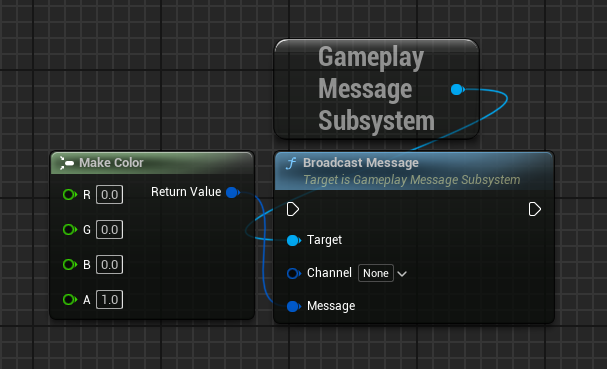
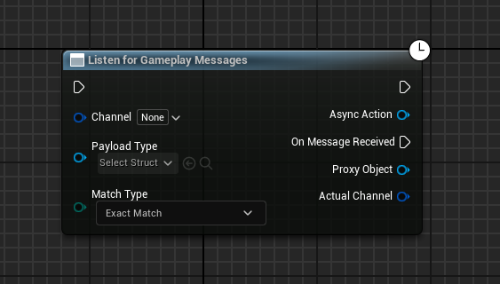
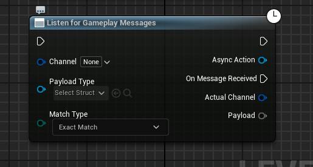

# GameplayMessageRouter

> https://zhuanlan.zhihu.com/p/494820956

## GameplayMessageSubsystem

一个通过 `GameplayTag` **触发** 或者 **监听** 事件的系统

```cpp
USTRUCT()
struct FGameplayMessageListenerData
{
	GENERATED_BODY()

	// Callback for when a message has been received
	TFunction<void(FGameplayTag, const UScriptStruct*, const void*)> ReceivedCallback;

	int32 HandleID;
	EGameplayMessageMatch MatchType;

	// Adding some logging and extra variables around some potential problems with this
	TWeakObjectPtr<const UScriptStruct> ListenerStructType = nullptr;
	bool bHadValidType = false;
};
```

定义 `FGameplayMessageListenerData` 来存储一个事件回调

| 属性名称 | 作用 |
| --- | --- |
| HandleID | 唯一ID |
| MatchType | Tag 的匹配方式 |
| ListenerStructType | 记录事件的 UScriptStruct 类型，当触发时判断触发传入的 UScriptStruct 与 基于的 UScriptStruct 是否相同或者继承 |
| ReceivedCallback | 回调函数 |

这些数据都会存在 `GameplayMessageSubsystem` 中

```cpp
private:
	// List of all entries for a given channel
	struct FChannelListenerList
	{
		TArray<FGameplayMessageListenerData> Listeners;
		int32 HandleID = 0;
	};

private:
	TMap<FGameplayTag, FChannelListenerList> ListenerMap;
```

相同 Tag 可能会触发多个回调函数，所以需要用 `TArray` 来存储回调数据

在 `BroadcastMessageInternal` 函数中，可以看到如何触发回调函数

1. 通过 `Tag`，从 `ListenerMap` 中找到匹配的回调记录

```cpp
for (FGameplayTag Tag = Channel; Tag.IsValid(); Tag = Tag.RequestDirectParent())
{
    if (const FChannelListenerList* pList = ListenerMap.Find(Tag))
```

2. 判断是否设置了有效的结构体信息，传入的 `StructType` 与记录的 `ListenerStructType` 能否匹配上

```cpp
if (!Listener.bHadValidType || StructType->IsChildOf(Listener.ListenerStructType.Get()))
{
    Listener.ReceivedCallback(Channel, StructType, MessageBytes);
}
```

当 `Tag` 和 **缓存信息** 都匹配上的时候，触发回调函数

## K2_BroadcastMessage



关于 `K2_BroadcastMessage`

```cpp
// 定义
UFUNCTION(BlueprintCallable, CustomThunk, Category=Messaging, meta=(CustomStructureParam="Message", AllowAbstract="false", DisplayName="Broadcast Message"))
void K2_BroadcastMessage(FGameplayTag Channel, const int32& Message);

// 实现
void UGameplayMessageSubsystem::K2_BroadcastMessage(FGameplayTag Channel, const int32& Message)
{
	// This will never be called, the exec version below will be hit instead
	checkNoEntry();
}
```

虽然 `K2_BroadcastMessage` 函数没有实现，但是该函数的 `UFUNCTION` 中标记了 `CustomThunk`，表示这是一个自定义函数

> CustomThunk 的记录在 [蓝图模板函数](../引擎开发记录/蓝图模板函数.md) 中有记载

`K2_BroadcastMessage` 真正的实现是在 `execK2_BroadcastMessage` 中

```cpp
DEFINE_FUNCTION(UGameplayMessageSubsystem::execK2_BroadcastMessage)
{
	P_GET_STRUCT(FGameplayTag, Channel);

	Stack.MostRecentPropertyAddress = nullptr;
	Stack.StepCompiledIn<FStructProperty>(nullptr);
	void* MessagePtr = Stack.MostRecentPropertyAddress;
	FStructProperty* StructProp = CastField<FStructProperty>(Stack.MostRecentProperty);

	P_FINISH;

	if (ensure((StructProp != nullptr) && (StructProp->Struct != nullptr) && (MessagePtr != nullptr)))
	{
		P_THIS->BroadcastMessageInternal(Channel, StructProp->Struct, MessagePtr);
	}
}
```

`K2_BroadcastMessage` 函数由两个参数 `Channel` 和 `Message`

`Channel` 是 FGameplayTag 类型，类型明确，可以直接使用 `P_GET_STRUCT` 将属性获得

`Message` 是 `const int32&` 表示一个地址，是为了让任意类型的结构体数据都可以传入到 `Message` 中而设计的

明确第二个参数是结构体，所以使用 `Stack.StepCompiledIn<FStructProperty>(nullptr)` 对 Frame 进行处理，是的当前堆栈指向第二个参数的地址

使用 `Stack.MostRecentPropertyAddress` 得到值地址，使用 `Stack.MostRecentProperty` 得到类型信息

## UAsyncAction_ListenForGameplayMessage

```cpp
DECLARE_DYNAMIC_MULTICAST_DELEGATE_TwoParams(FAsyncGameplayMessageDelegate, UAsyncAction_ListenForGameplayMessage*, ProxyObject, FGameplayTag, ActualChannel);

UCLASS(BlueprintType, meta=(HasDedicatedAsyncNode))
class GAMEPLAYMESSAGERUNTIME_API UAsyncAction_ListenForGameplayMessage : public UCancellableAsyncAction
{
    UFUNCTION(BlueprintCallable, Category = Messaging, meta = (WorldContext = "WorldContextObject", BlueprintInternalUseOnly = "true"))
	static UAsyncAction_ListenForGameplayMessage* ListenForGameplayMessages(UObject* WorldContextObject, FGameplayTag Channel, UScriptStruct* PayloadType, EGameplayMessageMatch MatchType = EGameplayMessageMatch::ExactMatch);

    // 其他函数定义

    UPROPERTY(BlueprintAssignable)
	FAsyncGameplayMessageDelegate OnMessageReceived;

    // 其他属性定义
}
```

> `UCancellableAsyncAction` 是继承自 `UBlueprintAsyncActionBase` 的

熟悉自定义蓝图异步节点对 `UBlueprintAsyncActionBase` 肯定不陌生

通过 `ListenForGameplayMessages` 创建异步节点，并以 `OnMessageReceived` 新建执行针脚



> 不过可能找不到这个异步节点，因为 `UCLASS` 中配置了 `HasDedicatedAsyncNode`

根据代码，可以发现 `ProxyObject` 是通过事件传递出来的，`AsyncAction` 是基类 `UCancellableAsyncAction` 配置的，其实本质是同一个对象

根据节点的表现情况，可以发现当事件触发时，并没有事件对应的数据信息，也就是 `BroadcastMessage` 节点的 `Message` 

所以，对节点有两个修改需求

1. 隐藏 `ProxyObject` 针脚
2. 显示 `Payload` 针脚，也就是事件触发时发送的数据(`Message`)

为此，需要使用 `K2Node` 来修改节点的表现效果

```cpp
class UK2Node_AsyncAction_ListenForGameplayMessages : public UK2Node_AsyncAction
```

核心接口是 `GetMenuActions` 和 `AllocateDefaultPins`

### GetMenuActions

首先将 `UK2Node_AsyncAction_ListenForGameplayMessages` 与 `UAsyncAction_ListenForGameplayMessage` 进行关联

使用 `NodeSpawner->NodeClass = NodeClass` 盖默认生成器类型

```cpp
UClass* NodeClass = GetClass();
ActionRegistrar.RegisterClassFactoryActions<UAsyncAction_ListenForGameplayMessage>(FBlueprintActionDatabaseRegistrar::FMakeFuncSpawnerDelegate::CreateLambda([NodeClass](const UFunction* FactoryFunc)->UBlueprintNodeSpawner*
{
    UBlueprintNodeSpawner* NodeSpawner = UBlueprintFunctionNodeSpawner::Create(FactoryFunc);
    check(NodeSpawner != nullptr);
    NodeSpawner->NodeClass = NodeClass;

    TWeakObjectPtr<UFunction> FunctionPtr = MakeWeakObjectPtr(const_cast<UFunction*>(FactoryFunc));
    NodeSpawner->CustomizeNodeDelegate = UBlueprintNodeSpawner::FCustomizeNodeDelegate::CreateStatic(GetMenuActions_Utils::SetNodeFunc, FunctionPtr);

    return NodeSpawner;
}) );
```

当创建结点的时候，激活 `CreateStatic` 函数，将类型、名称都设置回去

> 毕竟本质上只是想隐藏、添加 针脚，并不是真的要修改节点所属的类

```cpp
struct GetMenuActions_Utils
{
    static void SetNodeFunc(UEdGraphNode* NewNode, bool /*bIsTemplateNode*/, TWeakObjectPtr<UFunction> FunctionPtr)
    {
        UK2Node_AsyncAction_ListenForGameplayMessages* AsyncTaskNode = CastChecked<UK2Node_AsyncAction_ListenForGameplayMessages>(NewNode);
        if (FunctionPtr.IsValid())
        {
            UFunction* Func = FunctionPtr.Get();
            FObjectProperty* ReturnProp = CastFieldChecked<FObjectProperty>(Func->GetReturnProperty());
                    
            AsyncTaskNode->ProxyFactoryFunctionName = Func->GetFName();
            AsyncTaskNode->ProxyFactoryClass        = Func->GetOuterUClass();
            AsyncTaskNode->ProxyClass               = ReturnProp->PropertyClass;
        }
    }
};
```

### AllocateDefaultPins

调用 `Super::AllocateDefaultPins` 保持节点不变，只是要隐藏 `ProxyObject` 并添加 `Payload` 节点

```cpp
void UK2Node_AsyncAction_ListenForGameplayMessages::AllocateDefaultPins()
{
	Super::AllocateDefaultPins();

	// The output of the UAsyncAction_ListenForGameplayMessage delegates is a proxy object which is used in the follow up call of GetPayload when triggered
	// This is only needed in the internals of this node so hide the pin from the editor.
	UEdGraphPin* DelegateProxyPin = FindPin(UK2Node_AsyncAction_ListenForGameplayMessagesHelper::DelegateProxyPinName);
	if (ensure(DelegateProxyPin))
	{
		DelegateProxyPin->bHidden = true;
	}

	CreatePin(EGPD_Output, UEdGraphSchema_K2::PC_Wildcard, UK2Node_AsyncAction_ListenForGameplayMessagesHelper::PayloadPinName);
}
```

> `UEdGraphSchema_K2::PC_Wildcard` 表示通配符，什么都能设置进去



### 根据 PayloadType 动态设置 Payload 类型

如果 `PayloadType` 值存在并有效，根据 `PayloadType` 修改 `Payload` 的针脚信息

```cpp
if (PayloadTypePin->DefaultObject != PayloadPin->PinType.PinSubCategoryObject)
{
    if (PayloadPin->SubPins.Num() > 0)
    {
        GetSchema()->RecombinePin(PayloadPin);
    }

    PayloadPin->PinType.PinSubCategoryObject = PayloadTypePin->DefaultObject;
    PayloadPin->PinType.PinCategory = (PayloadTypePin->DefaultObject == nullptr) ? UEdGraphSchema_K2::PC_Wildcard : UEdGraphSchema_K2::PC_Struct;
}
```

当 `PayloadType` 针脚的值有修改的时候，触发上面代码，更新 `Payload` 针脚信息

```cpp
void UK2Node_AsyncAction_ListenForGameplayMessages::PinDefaultValueChanged(UEdGraphPin* ChangedPin)
{
	if (ChangedPin == GetPayloadTypePin())
	{
		if (ChangedPin->LinkedTo.Num() == 0)
		{
			RefreshOutputPayloadType();
		}
	}
}
```


