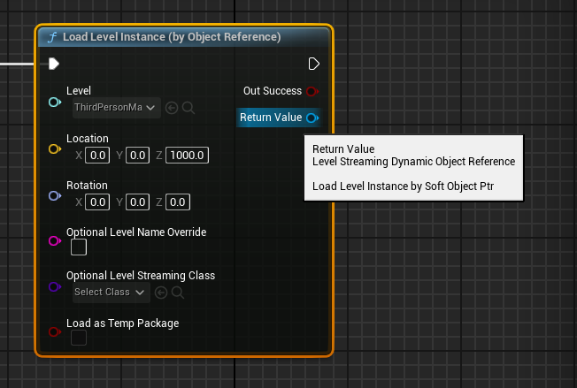
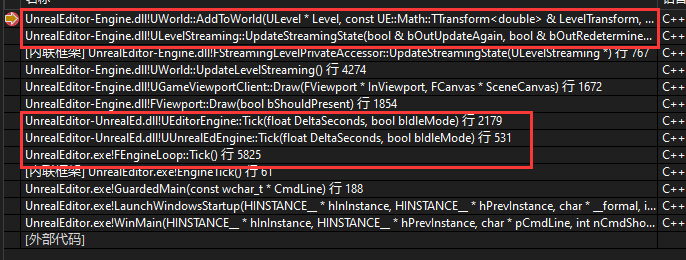

# LevelStreaming

UE 中 Level 是 Actor 的一种组织形式

一个 World 可以包含多个 Level，一个 Level 可以包含多个 Actor

为了创造更大的世界，资源加载和占用是巨大的，如果一开始就直接加载全部的场景，卡顿和资源消耗是不可接受的

`LevelStreaming` 就是用于动态加载和卸载游戏世界中的不同部分，可以保证在玩家移动时能动态加载和卸载 Level 

## 加载 LevelStreaming



| 参数 | 作用 |
| --- | --- |
| Level | 期望加载的关卡 |
| Location | 关卡原点所在的世界坐标写 |
| Rotation | 关卡旋转 |
| OptionalLevelNameOverride | 如果存在同名关卡，则本次不加载 |
| OptionalLevelStreamingClass | 继承自 `ULevelStreamingDynamic` 类，如果配置加载地图时 UClass 选择配置的类，默认使用 `ULevelStreamingDynamic` |

最后会执行 `ULevelStreamingDynamic::LoadLevelInstance_Internal`

```cpp
// 收集信息
// 处理数据

// 存在名称 OptionalLevelNameOverride 同名 ULevelStreaming 则不加载
if (Params.World->GetStreamingLevels().ContainsByPredicate([&ModifiedLevelPackageName](ULevelStreaming* LS) { return LS && LS->GetWorldAssetPackageFName() == ModifiedLevelPackageName; }))
{
    return nullptr;
}

// 创建 ULevelStreamingDynamic
UClass* LevelStreamingClass = Params.OptionalLevelStreamingClass != nullptr ? Params.OptionalLevelStreamingClass.Get() : ULevelStreamingDynamic::StaticClass();
ULevelStreamingDynamic* StreamingLevel = NewObject<ULevelStreamingDynamic>(Params.World, LevelStreamingClass, NAME_None, RF_Transient, NULL);

// 设置 StreamingLevel 参数

Params.World->AddStreamingLevel(StreamingLevel);
```

在 `UWorld::AddStreamingLevel` 中对应操作就是添加到 `StreamingLevels` 和 `StreamingLevelsToConsider` 数组中

```cpp
void UWorld::AddStreamingLevel(ULevelStreaming* StreamingLevelToAdd)
{
	if (StreamingLevelToAdd)
	{
        // 一些条件判断
        StreamingLevels.Add(StreamingLevelToAdd);
        FStreamingLevelPrivateAccessor::OnLevelAdded(StreamingLevelToAdd);
        if (FStreamingLevelPrivateAccessor::UpdateTargetState(StreamingLevelToAdd))
        {
            StreamingLevelsToConsider.Add(StreamingLevelToAdd);
        }
    }
}
```

### UWorld::UpdateLevelStreaming

前面一顿操作也只是将 `FStreamingLevelDynamic` 添加到 `UWorld` 的容器中，并没有真正的加载到场景中

为了防止 Level 内容过多影响游戏运行帧率，UE 的解决方案还是经典 **分帧**



每帧 `UWorld::UpdateLevelStreaming` 都会遍历 `StreamingLevelsToConsider` 数组，从中取出待加载的 `LevelStreaming`，执行加载逻辑

- 如果本次加载完毕，那么 `bShouldContinueToConsider` 值为 false，该 `LevelStreaming` 会从 `StreamingLevelsToConsider` 数组中删除
- 如果没有加载完毕，根据 `bUpdateAgain` 值判断，是否需要跳出 `while` 循环，执行下一个 `LevelStreaming` 的加载操作

> 因为涉及删除操作，所以遍历需要后序遍历

一个 `LevelStreaming` 加载涉及多个阶段，每个阶段结束都会去判断一下所用时间是否超过限制时间，如果超过那么 `bUpdateAgain` 为 false，等待下一帧再执行后续加载阶段

```cpp
for (int32 Index = StreamingLevelsToConsider.GetStreamingLevels().Num() - 1; Index >= 0; --Index)
{
    // do something ...
    if (ULevelStreaming* StreamingLevel = StreamingLevelsToConsider.GetStreamingLevels()[Index])
    {
        bool bUpdateAgain = true;
        bool bShouldContinueToConsider = true;
        while (bUpdateAgain && bShouldContinueToConsider)
        {
            bool bRedetermineTarget = false;
            FStreamingLevelPrivateAccessor::UpdateStreamingState(StreamingLevel, bUpdateAgain, bRedetermineTarget);

            if (bRedetermineTarget)
            {
                bShouldContinueToConsider = FStreamingLevelPrivateAccessor::UpdateTargetState(StreamingLevel);
            }
        }

        if (!bShouldContinueToConsider)
        {
            StreamingLevelsToConsider.RemoveAt(Index);
        }
    }
```

### LevelStreaming 的阶段

前面 `UWorld::UpdateLevelStreaming` 在处理 `StreamingLevelsToConsider` 调用的是 `FStreamingLevelPrivateAccessor::UpdateStreamingState` 来更新 `LevelStreaming` 的状态

`LevelStreaming` 总共包含下面八个状态

```cpp
enum class ELevelStreamingState : uint8
{
	Removed,
	Unloaded,
	FailedToLoad,
	Loading,
	LoadedNotVisible,
	MakingVisible,
	LoadedVisible,
	MakingInvisible
};
```

| 状态 | 作用 |
| --- | --- |
| Removed | 已经被删除 |
| Unloaded | 未加载 |
| FailedToLoad | 加载失败 |
| Loading | 正在被加载 |
| LoadedNotVisible | 加载完毕，但是还没显示 |
| MakingVisible | 标记想要显示 |
| LoadedVisible | 加载完毕，并且显示 |
| MakingInvisible | 标记不显示 |

从 `ULevelStreaming::UpdateStreamingState` 可见一斑

从 `Unloaded` -> `Loading` -> `LoadedNotVisible` -> `MakingVisible` -> `LoadedVisible` -> `MakingInvisible` -> `LoadedNotVisible` -> `Unloaded`

除了上述这些当前状态之外，还需要一个目标状态 `TargetState`

- 比如当前都是 `LoadedNotVisible`
  - 如果当前是加载流程，那么 `TargetState` 应该是 `LoadedVisible`
  - 如果当前时卸载流程，那么 `TargetState` 应该是 `Unloaded`

```cpp
enum class ELevelStreamingTargetState : uint8
{
	Unloaded,
	UnloadedAndRemoved,
	LoadedNotVisible,
	LoadedVisible,
};
```

代码其实写的很简单粗暴，两个 `switch` 通过 `CurrentState` 和 `TargetState` 决定执行哪些函数

```cpp
case ELevelStreamingState::LoadedNotVisible:
    switch (TargetState)
    {
    case ELevelStreamingTargetState::LoadedVisible:
        // Do Something ...
        break;
    case ELevelStreamingTargetState::Unloaded:
        // Do Something ...
        break;
    case ELevelStreamingTargetState::LoadedNotVisible:
        // Do Something ...
        break;
    default:
        ensure(false);
    }
```

| 当前 | 目标 | 操作 | 作用 | 下一个状态 |
| --- | --- | --- | --- | --- |
| Unloaded | LoadedNotVisible | UpdateStreamingState_RequestLevel | 异步加载资源 | Loading |
| Loading | 无操作 | 无操作 | 等待资源加载完毕 | LoadedNotVisible 或者 LoadedVisible |
| LoadedNotVisible | LoadedVisible | BeginClientNetVisibilityRequest |  | MakingVisible |
| MakingVisible | LoadedVisible | World->AddToWorld | 加载场景对象 | LoadedVisible |

当 `LevelStreaming` 时 `LoadedVisible` 的时候，就表示加载完毕并且显示内容

### AddToWorld

当 Level 资产加载完毕之后，需要将其显示到场景中

先记录两个数据：`TimeLimit` 时间限制 和 `StartTime` 开始时间

```cpp
const double StartTime = FPlatformTime::Seconds();
double TimeLimit = 0.0;
```

总共有六步操作

每次操作完之后都通过 `IsTimeLimitExceeded` 根据 `StartTime` 和 `TimeLimit` 来判断操作时间超过时间限制

- 没超过时间，继续向后进行
- 超过时间，就先跳过后续操作

1. 移动 `Actor` 的坐标，毕竟 加载时有设置 `LevelStreaming` 的 `Location`

```cpp
FLevelUtils::FApplyLevelTransformParams TransformParams(Level, LevelTransform);
TransformParams.bSetRelativeTransformDirectly = true;
FLevelUtils::ApplyLevelTransform(TransformParams);
```

2. 修正所有 `Actor` 中的位置，确保新 `Level` 在世界原点(World Origin)下的正确位置

```cpp
if (WorldComposition)
{
    WorldComposition->OnLevelAddedToWorld(Level);
}
```

3. 更新 Actor 身上的组件

```cpp
do
{
    Level->IncrementalUpdateComponents( NumComponentsToUpdate, bRerunConstructionScript, ContextPtr);
    // Process AddPrimitives if threshold is reached
    if (Context.Count() > GLevelStreamingAddPrimitiveGranularity)
    {
        Context.Process();
    }
}
while (!Level->bAreComponentsCurrentlyRegistered && !IsTimeLimitExceeded(TEXT("updating components"), StartTime, Level, TimeLimit));
```

4. 初始化Actor网络相关的设置

```cpp
if (!Level->bAlreadyInitializedNetworkActors)
{
    Level->InitializeNetworkActors();
}
else
{
    Level->ClearActorsSeamlessTraveledFlag();
}
```

5. 完成所有 Actor 的初始化操作，其中包括各种初始化逻辑，最终会调用到 Actor 的 BeginPlay

```cpp
do 
{
    Level->RouteActorInitialize(NumActorsToProcess);
} while (!Level->IsFinishedRouteActorInitialization() && !IsTimeLimitExceeded(TEXT("routing Initialize on actors"), StartTime, Level, TimeLimit));
```

6. 对 `Actor` 排序，将 `WorldSettings` 放在第一个，将需要联网的 `Actor` 放在前面，不联网的 `Actor` 放在后面

```cpp
Level->SortActorList();
Level->bAlreadySortedActorList = true;
```

7. 完成处理，设置可见性，广播事件

```cpp
Level->bIsVisible = true;
IStreamingManager::Get().AddLevel(Level);
FWorldDelegates::LevelAddedToWorld.Broadcast(Level, this);
BroadcastLevelsChanged();
ULevelStreaming::BroadcastLevelVisibleStatus(this, Level->GetOutermost()->GetFName(), true);
```
