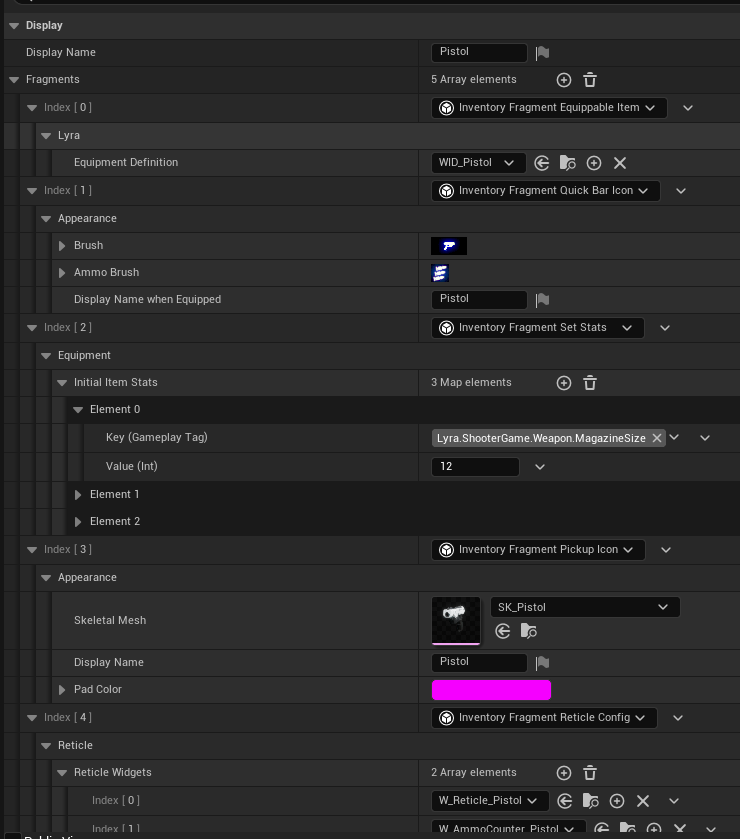
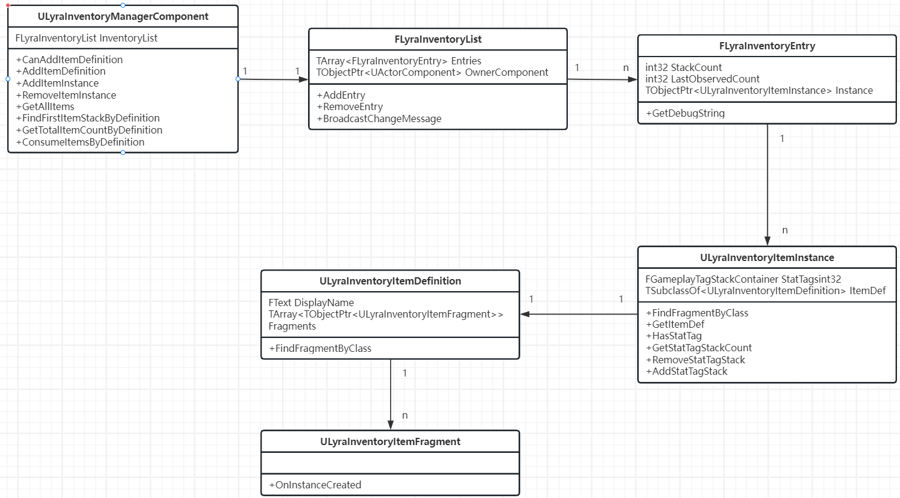
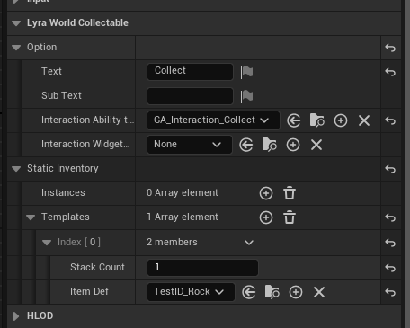
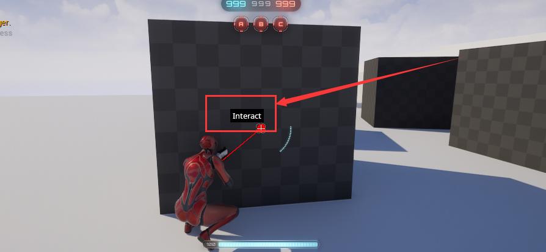
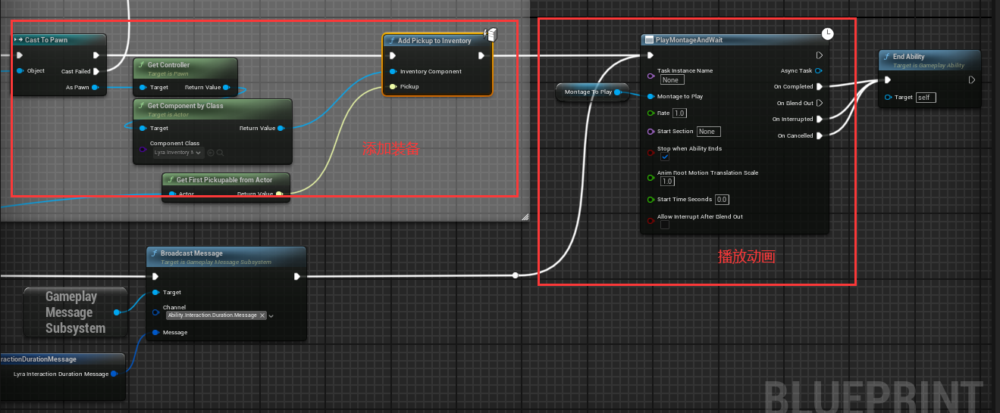

# 背包系统 Inventory

## 定义单个装备信息

首先定义 `ULyraInventoryItemFragment` 和 `ULyraInventoryItemDefinition` 用于配置装备信息

定义 `ULyraInventoryItemFragment`，用于定义装备 `Item` 具备的一个片段（信息），并提供实例创建的接口

```cpp
UCLASS(DefaultToInstanced, EditInlineNew, Abstract)
class LYRAGAME_API ULyraInventoryItemFragment : public UObject
{
	GENERATED_BODY()

public:
	virtual void OnInstanceCreated(ULyraInventoryItemInstance* Instance) const {}
};
```

定义 `ULyraInventoryItemDefinition` 用于定义装备 `Item` 的配置信息，包括最基本的**显示名称**和**片段信息数组**，一个装备 `item` 可以具备多种**片段信息** 

```cpp
UCLASS(Blueprintable, Const, Abstract)
class ULyraInventoryItemDefinition : public UObject
{
	GENERATED_BODY()

public:
    // ... do something 

	UPROPERTY(EditDefaultsOnly, BlueprintReadOnly, Category=Display)
	FText DisplayName;

	UPROPERTY(EditDefaultsOnly, BlueprintReadOnly, Category=Display, Instanced)
	TArray<TObjectPtr<ULyraInventoryItemFragment>> Fragments;

    // ... do something 
};
```

Lyra 提供多种片段信息

| 片段信息类型 | 作用 | 详细说明 |
| --- | --- | --- |
| UInventoryFragment_EquippableItem | 可装备物品 | 将物品标记为"可装备"并关联装备定义 |
| UInventoryFragment_PickupIcon | 拾取物外观 | 控制物品作为地面可拾取物时的外观 |
| UInventoryFragment_QuickBarIcon | 快捷栏图标 | 管理物品在玩家快捷栏中的视觉表现 |
| UInventoryFragment_SetStats | 属性设置 | 定义物品的基础属性（如攻击力、防御值等），使用 GameplayTag 作为属性键，支持灵活扩展 |
| UInventoryFragment_ReticleConfig | 准星配置 | 配置武器瞄准时的准星UI，允许多种准星类型（如：基础瞄准镜、高级狙击镜等） |

具体使用时，表现效果如下图所示，这就是一个 `ULyraInventoryItemDefinition` 的定义，并且配置了多种片段信息，这里定义的是一个 手枪(`Pistol`) 的装备信息



扩展性很强，各自模块基于 `ULyraInventoryItemFragment` 定义自己模块需要的配置就可以适配任何系统

一个装备需要至少一个配置文件，对于成百上千种装备的游戏来说，配置的工作量是不太好接受的，毕竟策划最喜欢的还是拉配置表

## 运行时添加状态

前面说明了如何配置一个装备的各种信息，那么在运行时如何利用这些信息呢？

每个人的装备都是自己管理的，所以需要在角色身上绑定相关信息，于是直接定义 `ULyraInventoryManagerComponent` 挂载在角色身上，用于存储、管理装备信息

> 无需坐标等信息，所以直接继承 `UActorComponent` 即可

由于装备是一个列表，所以需要维护一个容器，用于存储装备信息，所以定义了给一个 `FLyraInventoryList` 类作为容器，定义 `FLyraInventoryEntry` 类作为容器中的一项

那么函数的调用顺序就很明显了，对外通过 `ULyraInventoryManagerComponent` 调用接口，再通过一系列的判断之后，调用 `FLyraInventoryList` 对容器种的 `FLyraInventoryEntry` 进行增、删、改、查的操作

下面提供 `FLyraInventoryList` 和 `FLyraInventoryEntry` 的定义

```cpp
struct FLyraInventoryEntry : public FFastArraySerializerItem
{
	GENERATED_BODY()

	FLyraInventoryEntry()
	{}

	FString GetDebugString() const;

private:
	friend FLyraInventoryList;
	friend ULyraInventoryManagerComponent;

	UPROPERTY()
	TObjectPtr<ULyraInventoryItemInstance> Instance = nullptr;

	UPROPERTY()
	int32 StackCount = 0;

	UPROPERTY(NotReplicated)
	int32 LastObservedCount = INDEX_NONE;
};

struct FLyraInventoryList : public FFastArraySerializer
{
	GENERATED_BODY()

    // do something .....

private:
	friend ULyraInventoryManagerComponent;

private:
	// Replicated list of items
	UPROPERTY()
	TArray<FLyraInventoryEntry> Entries;

	UPROPERTY(NotReplicated)
	TObjectPtr<UActorComponent> OwnerComponent;
};
```

不过通过 `FLyraInventoryEntry` 可以发现，其存储装备信息的是一个名为 `ULyraInventoryItemInstance` 的对象

`ULyraInventoryItemInstance` 的实现比较简单，存储着 `ULyraInventoryItemDefinition` 信息和 `GameplayTag` 的相关信息

```cpp
class ULyraInventoryItemInstance : public UObject
{
	GENERATED_BODY()

    // do something ...

	friend struct FLyraInventoryList;

private:
	UPROPERTY(Replicated)
	FGameplayTagStackContainer StatTags;

	// The item definition
	UPROPERTY(Replicated)
	TSubclassOf<ULyraInventoryItemDefinition> ItemDef;
};
```

`ItemDef` 存储着配置信息，用于其他对象查询配置内容，因此会对外提供 `FindFragmentByClass` 的方法，通过类名进行查询对应的 `ULyraInventoryItemFragment` 配置信息

`StatTags` 则记录着 `GameplayTag` 和对应的值信息，看上面关于配置的图片，在 `UInventoryFragment_SetStats` 中可以配置 `InitialItemStats`，这些值会在实例化的时候设置到 `StatTags` 中，给可能会要用的模块使用

正因为存在 `StatTags` 等运行时信息，所以需要专门定义 `ULyraInventoryItemInstance` 来存储运行时信息和配置信息，并对外提供方便使用的接口



> 类之间的基本关联关系如上图所示

## 可拾取物品

在各种游戏都会出现可拾取物品，当玩家出现在其周围时会触发自动拾取或者通过交互拾取

这对这种可交互拾取的物体， `Lyra` 也有相关的实现

首先 `Lyra` 将这种拾取物分为两种

1. 通过 `ULyraInventoryItemDefinition` 和 **数量** 定义拾取物体的配置
2. 通过 `ULyraInventoryItemInstance` 定义拾取物体的配置，用于已经实例化的物体，比如 CS 游戏中丢掉枪械，要保存枪械的子弹数量信息

针对上述两种类型的拾取物，分别定义了两种结构体用于存储对应的信息 `FPickupTemplate` 和 `FPickupInstance`

```cpp
USTRUCT(BlueprintType)
struct FPickupTemplate
{
	GENERATED_BODY()

public:
	UPROPERTY(EditAnywhere)
	int32 StackCount = 1;

	UPROPERTY(EditAnywhere)
	TSubclassOf<ULyraInventoryItemDefinition> ItemDef;
};

USTRUCT(BlueprintType)
struct FPickupInstance
{
	GENERATED_BODY()

public:
	UPROPERTY(EditAnywhere, BlueprintReadOnly)
	TObjectPtr<ULyraInventoryItemInstance> Item = nullptr;
};
```

又因为，有的时候一个拾取物可能包含多个拾取物，比如一个包裹中包括多个拾取物，所以需要一个 `FInventoryPickup` 来表示这些信息

```cpp
USTRUCT(BlueprintType)
struct FInventoryPickup
{
	GENERATED_BODY()

public:
	UPROPERTY(EditAnywhere, BlueprintReadOnly)
	TArray<FPickupInstance> Instances;

	UPROPERTY(EditAnywhere, BlueprintReadOnly)
	TArray<FPickupTemplate> Templates;
};
```

未来，所有的拾取物只需要通过一个 `FInventoryPickup` 就可以表示其中包含的所有物体

不过为了标识场景中的一个物体是可以被拾取的，需要在它身上打上一些标记，比如 **接口** `IPickupable`

```cpp
class IPickupable
{
	GENERATED_BODY()

public:
	UFUNCTION(BlueprintCallable)
	virtual FInventoryPickup GetPickupInventory() const = 0;
};
```

通过上述的定义，对应场景中可拾取物体的定义实现就是下面这样

```cpp
UCLASS(Abstract, Blueprintable)
class ALyraWorldCollectable : public AActor, public IInteractableTarget, public IPickupable
{
	GENERATED_BODY()

public:

	ALyraWorldCollectable();

	virtual void GatherInteractionOptions(const FInteractionQuery& InteractQuery, FInteractionOptionBuilder& InteractionBuilder) override;
	virtual FInventoryPickup GetPickupInventory() const override;

protected:
	UPROPERTY(EditAnywhere)
	FInteractionOption Option;

	UPROPERTY(EditAnywhere)
	FInventoryPickup StaticInventory;
};
```

`Option` 中存储着一系列交互相关的信息，比如显示的 `UI`、文本信息、赋予玩家的 GA 等

> 这里赋予玩家的 GA 是在玩家触发交互之后，进行的一系列操作，比如播放动画、添加物品到背包等



上图是 `B_InteractableRock` 示例对象的配置

- 当触发交互时会激活 `InteractionAbilityToGrant` 配置的 GA
- 当可以交互时会显示 `InteractionWidget` 到 UI 界面



> 按 G 键进行交互

在触发交互，执行 GA 的时候，流程如下，从 `GameplayEventData` 中获取**玩家**和**拾取物**，为避免耦合这里获取的是 `IPickupable` 接口

先将装备添加到 `Controller` 中存储的背包中，再播放对应的动画

> 需要注意，这里的 `Controller` 是 `ALyraPlayerController`，原生是没有 `ULyraInventoryManagerComponent` 组件的，通过 `GameFeature` 配置在其激活时创建 `ULyraInventoryManagerComponent` 并 `Add` 到 `ALyraPlayerController` 上



为了在蓝图中完成接口调用，使用了 `TScriptInterface`。`TScriptInterface` 是 `Unreal` 对 C++ 接口的增强封装，解决了原生 C++ 接口在反射系统和蓝图集成中的局限性，同时保持了运行时高效性

```cpp
TScriptInterface<IPickupable> UPickupableStatics::GetFirstPickupableFromActor(AActor* Actor)
{
	// If the actor is directly pickupable, return that.
	TScriptInterface<IPickupable> PickupableActor(Actor);
	if (PickupableActor)
	{
		return PickupableActor;
	}

	// If the actor isn't pickupable, it might have a component that has a pickupable interface.
	TArray<UActorComponent*> PickupableComponents = Actor ? Actor->GetComponentsByInterface(UPickupable::StaticClass()) : TArray<UActorComponent*>();
	if (PickupableComponents.Num() > 0)
	{
		// Get first pickupable, if the user needs more sophisticated pickup distinction, will need to be solved elsewhere.
		return TScriptInterface<IPickupable>(PickupableComponents[0]);
	}

	return TScriptInterface<IPickupable>();
}
```
