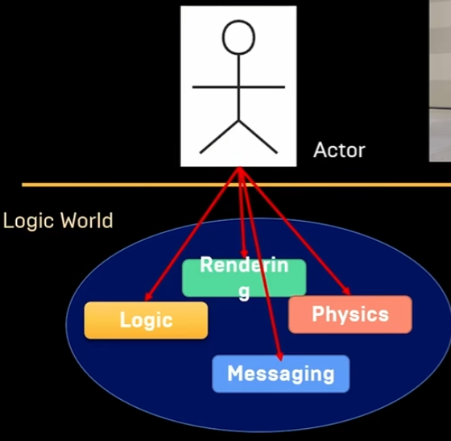
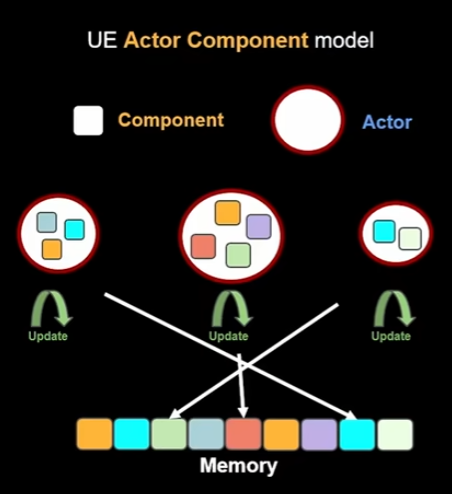
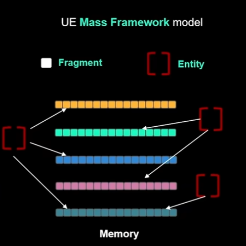
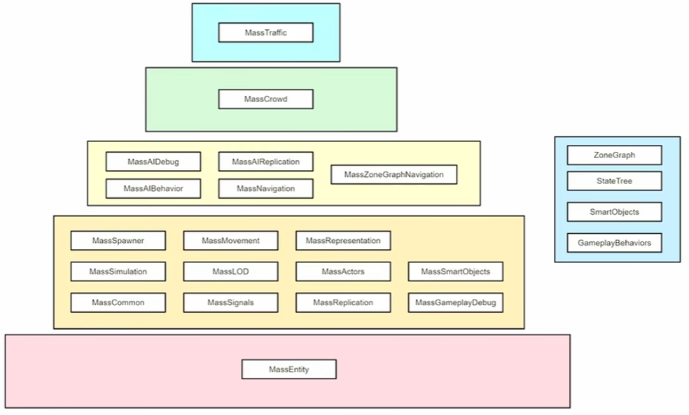
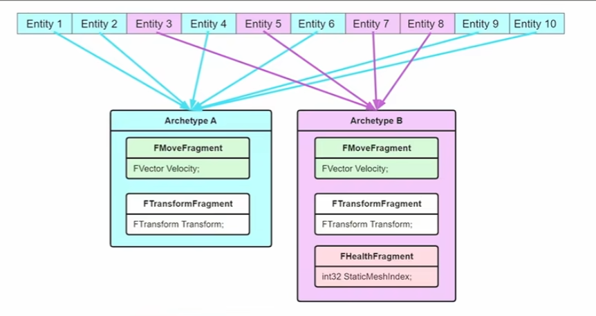
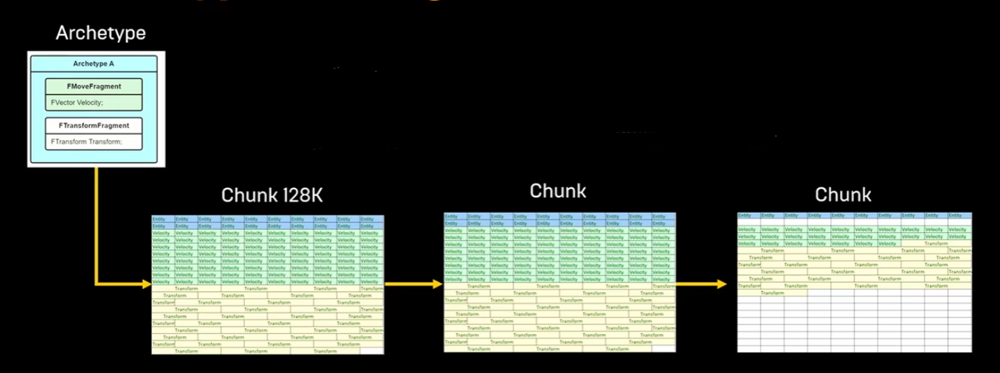
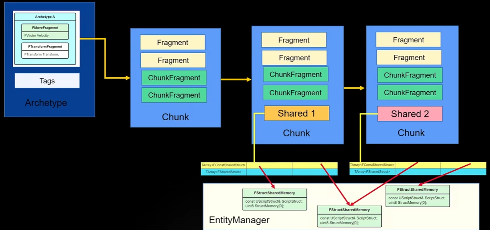
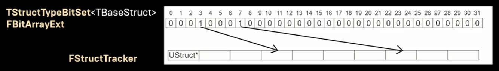
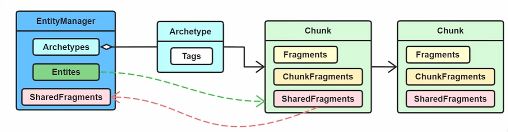
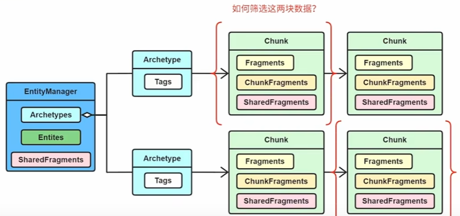

# Mass

## 大钊的分享

链接：[不Mass怎么Meta](https://www.bilibili.com/video/BV13D4y1v7xx)

元宇宙应该是广阔且生机勃勃的世界，所以世界中应该包括多种多样的丰富的生物，同理开放世界也需要大量的物体在场景中

为了实现这个功能，UE 提供 `Mass AI` 来模拟这样丰富的场景，那么 `Mass` 如何支持如此多量的AI实体并且达到流畅的**实时性能**

Mass 基于 DOD(面向数据) 的设计的，更加关注数据，把逻辑与数据分离，对计算机好，但是违背人的常识。真正在编程中应用的面向数据的设计模式就是 ECS 模式，Mass 正是采用 ECS 框架用于支持巨量的 AI 实体

以普通项目的 Actor 为例，一个 Actor 通常包括逻辑(`Logic`)、物理(`Physics`)、渲染(`Rendering`)、网络通信(`Messaging`)





> 上图说明的就是经典 Actor 的处理方式，通过 update 更新每个 Actor 及其对应的组，这种更新访问的是零碎的内存空间

当场景中 Actor 达到一定数量级之后，一个个驱动独立的 Actor 的 Logic 模块，对其进行 Update 是比较低效的

Mass 框架的作用就是将 Actor 的 Logic 模块抽离出来，用 Entity 来表示数据，再加上处理器 System 处理，之后根据对应关系更新 Actor 的表现部分

> Mass 只是处理 Actor 的逻辑部分 

如果场景中存在很多 Actor，但是其本身没有太多逻辑，性能瓶颈在 GPU 上而不是 GPU 上，这种情况 Mass 无法提供帮助



在 Mass 框架中，数据会被规整成整齐的 Fragment 片段，每个 Enitty 可以包括多个 Fragment，对 Fragment 的运算处理其实就是对 Entity 的逻辑处理。这种数据连续的内存，对 CPU 的 Cache 是非常友好的



> Mass 框架的各个模块

### 数据组织

在 Mass 中数据如何组织?

在 Mass 中把数据的结构叫做 Fragment, 对应 ECS 中的 Component

> 因为 UE 中已经存在 Component 了，所以不能再为 ECS 创建名为 Component 的类

Fragment 就是一个非常简单的结构的类，只包含**最纯粹的数据**，**不包含任何函数**

```cpp
USTRUCT()
struct FMassFragment
{
	GENERATED_BODY()

	FMassFragment() {}
};

USTRUCT(BlueprintType)
struct MASSCOMMUNITYSAMPLE_API FSampleColorFragment : public FMassFragment
{
	GENERATED_BODY()

	FSampleColorFragment() = default;
	
	FSampleColorFragment(FColor Color) : Color(Color){};

	UPROPERTY(BlueprintReadWrite, EditAnywhere)
	FColor Color = FColor::Red;
};

USTRUCT(BlueprintType)
struct FMyVectorFragmaent : FMassFragment {
	GENERATED_BODY()

    UPROPERTY(BlueprintReadWrite, EditAnyWhere)
    FVector Position;
}
```

> 需要注意内存对齐
> 为了方便使用可以添加一些函数，但是不可以使用 virtual 关键字

实体是 `Mass` 框架中的基本单元，它们可以包含不同类型的片段（`Fragment`），片段是用于描述实体属性和行为的数据结构

`Archetype` 就是根据片段的组合来定义实体的原型，可以理解为实体的类或模板。例如，如果有一个 `Archetype` 的片段组合是 `[Transform, Velocity, Health]`，那么这个 `Archetype` 关联的所有实体都拥有这三种片段，也就是说都有位置、速度和生命值这三个属性

Archetype 的作用是为了提高 Mass 框架的性能和效率，它可以将相同结构的实体存储在一起，方便进行批量操作和查询



由于系统中 Fragment 的数量是固定的，所以排列组合形成 Archetype 的数量也是固定的，也就是是说可以为每个 Archetype 定义一个 ID，并且可以通过 ID 唯一的活得到一个 Archetype

一个 Archetype 可能有多份数据(一个 Actor 一份)，所以对一个实体来说通过还需要一个数据 ID 来确定是 Archetype 这么多份数据的哪一份

```cpp
Entity 
{
    int32 Id;
    int32 ArchetypeId;
}
```

如何存储对应的 `Entity` 数据呢？

单纯使用 `TArray` 存储是不合适的，因为依然可能跨越巨大的内存位置，而且不好扩容

UE 将 `Archetype` 的存储分为一个个 `Chunk`, 每个 `Chunk` 分为 64kb 或者 128kb (对 CPU 的 Cache 比较友好)。`Chunk` 的大小确定、 `Archetpe` 的大小确定，可以算出一个 `Chunk` 可以容纳多少个 `Entity` 数据



如上，知道一个 `Chunk` 容纳多少个 `Entity` 个数据之后，就可以将 Fragment 依次排开，每次取数据的时候只要指针定位到开头，就可以正确访问指定数据

每个 `Chunk` 的开头还有一个 `FMassEntityHandle` 的数据，用来记录当前 `Chunk` 里有哪些 `Entity`，因此获得 `Chunk` 之后，就可以知道 `Chunk` 关联了哪些 `Entity`

```cpp
struct FMassArchetypeData
{
private:
    FMassArchetypeCompositionDescriptor CompositionDescriptor;

    TArray<FInstancedStruct> ChunkFragmentsTemplate;

    TArray<FMassArchetypeChunk> Chunks;

    // ... something else
}

struct FMassArchetypeChunk
{
private:
    uint8* RawMemory = nullptr;
    int32 AllocSize = 0;
    int32 NumInstances = 0;
    int32 SerialModificationNumber = 0;

    TArray<FInstancedStruct> ChunkFragmentData;
    
    FMassArchetypeSharedFragmentValues SharedFragmentValues;

    // ... something else
}
```

从 `FMassArchetypeChunk` 结构体可见，我们的 Chunk 其实就是一块内存 `RawMemory`

`ChunkFragmentData` 就是独属于这块 Chunk 的附加数据，比如 第1个Chunk 的 Entity 离玩家比较远，需要 1s 一次进行计算；第2个 Chunk 的 Entity 离玩家比较近，需要 0.1s 一次进行计算

`SharedFragmentValues` 在运算时常常需要一些更高维度的参数，比如重力、摩擦力系数等，这些数据全局只需要一份，可以作为共享片段值添加进 Chunk。允许不同的 Chunk 携带不同的共享参数，当然也可以没有

UE 中将 Mass 分为四种粒度

| 粒度 | 作用 |
| --- | --- |
| FMassFragment | 数据, 最小粒度 |
| FMassChunkFragment | 独属于 Chunk 的数据 |
| FMassTag | Archetype标签，无数据，分类 |
| FMassSharedFragment | Entities 之间共享的数据，全局数据。跨 Archetype |

Fragment 的粒度最小，一个 Entity 包含多个 Fragment，多个 Entity 的数据组合成 Chunk

一个 Chunk 可以带多个 ChunkFragment (常常用来表示一些 LOD 相关的数据，比如可见性)

在数据相同时候为了区分 Archetype 可以给其加上不同的 FMassTag

FMassSharedFragment 是跨 Archetype 的，常常用来表示全局数据

```cpp
struct MASSENTITY_API FMassEntityManager : public TSharedFromThis<FMassEntityManager>, public FGCObject{
    // ... something else

    TArray<FConstSharedStruct> ConstSharedFragments;

    TArray<FSharedStruct> SharedFragments;
    // ... something else
}
```

> UE 引擎中进一步将 `SharedFragment` 细分成 **Const** 和 **非Const**



```cpp
struct FMassArchetypeCompositionDescriptor{
    // ... some function
    FMassFragmentBitSet Fragments;              // 具体属性
    FMassTagBitSet Tags;                        // Tag 数据
    FMassChunkFragmentBitSet ChunkFragments;    // Chunk 数据
    FMassSharedFragmentBitSet SharedFragments;  // 共享数据
}
```

通过前面解释的四种数据类型，可以共同组合成一种 Archetype 的类型，因此 UE 提供 `FMassArchetypeCompositionDescriptor` 用来组合信息

可以看到上面代码中使用了很多了 `BitSet`，对应的机理就是将各个结构的 `UStruct` 类型信息存在一个数组里，然后把数组的下标当作 `BitSet` 的下标



也就是 BitSet 对应 Index 的值为 1，则表示具有这个结构，值为 0 则表示没有这个结构。比如总共有 32 个 Fragment，那么一个 `FMassArchetypeCompositionDescriptor` 的 `FMassFragmentBitSett` 有 32位，可以表示这个 Archetype 可以具有 32个 Fragment 的哪几个，具有的 Fragment 对应需要序号(index)的值为 true

使用 `BitSet` 可以快速的进行位运算，更方便做类型筛选；同时可以节省内存消耗，使用一个 int32(占32位) 的大小就可以代表32种 Fragment

```cpp
struct FMassArchetypeChunk
{
private:
    // FMassEntityHandle[N] + Frag1[N] + Frag2[N]
    uint8* RawMemory = nullptr;
    TArray<FInstancedStruct> ChunkFragmentData;
    FMassArchetypeSharedFragmentValues SharedFragmentValues;
    // 其他属性和函数
}

struct FMassArchetypeData
{
private:
    FMassArchetypeCompositionDescriptor CompositionDescriptor;

    TArray<FMassArchetypeChunk> Chunks;

    TMap<int32, int32> EntityMap;
    // 其他属性和函数
}

USTRUCT()
struct alignas(8) FMassEntityHandle
{
    UPROPERTY(VisibleAnywhere, Category = "Mass|Debug", Transient)
    int32 Index = 0;    

    UPROPERTY(VisibleAnywhere, Category = "Mass|Debug", Transient)
    int32 SerialNumber = 0;

    // 其他属性和函数
}

struct MASSENTITY_API FMassEntityManager : public TSharedFromThis<FMassEntityManager>, public FGCObject
{
    struct FEntityData
    {
        TSharedPtr<FMassArchetypeData> CurrentArchetype;
        int32 SerialNumber = 0;
    };    

    TChunkedArray<FEntityData> Entities;

    TMap<uint32, TArray<TSharedPtr<FMassArchetypeData>>> FragmentHashToArchetypeMap;

    // Shared fragments
    TArray<FConstSharedStruct> ConstSharedFragments;
    // Hash/Index in array pair
    TMap<uint32, int32> ConstSharedFragmentsMap;

    TArray<FSharedStruct> SharedFragments;
    // Hash/Index in array pair
    TMap<uint32, int32> SharedFragmentsMap; 
    // 其他属性和函数
}
```

| FMassArchetypeData 属性 | 作用 |
| --- | --- |
| EntityMap | 作为全局 Index 到 内部 Index 的转换，可以知道 Entity 位于该 Archetype 里面第几个 Chunk 的第几号位置 |

| FEntityData 属性 | 作用 |
| --- | --- |
| CurrentArchetype | |
| SerialNumber | 序列号做数据校验 |

| FMassEntityHandle 属性 | 作用 |
| --- | --- |
| Index | 全局 Entity 的索引下标，可以定位到具体 EntityData 数据 |
| SerialNumber | 序列号做数据校验 | 

| FMassEntityManager 的属性 | 作用 |
| --- | --- |
| FragmentHashToArchetypeMap | 所有的 Archetype 数据 |
| Entities | 所有的 Entity 数据 |
| ConstSharedFragments | 所有的共享参数 |
| SharedFragments | 所有的共享参数 |

```cpp
UCLASS()
class MASSENTITY_API UMassEntitySubsystem : public UWorldSubsystem
{
	GENERATED_BODY()
    // ... 
protected:
	TSharedPtr<FMassEntityManager> EntityManager;
};
```

`UMassEntitySubsystem` 持有全局唯一的 `EntityManager` 实例



Entityies 的列表存储在 EntityManager，但实际的数据存储在 ArcheType 的 Chunk 中

随着项目的运行，可能会有些 Entity 被删除，从而导致 Chunk 的空洞，这些空洞将在下次创建 Entity 时被填补(内部做了内存效率性优化)

另一点是不要动态的修改一个 Archetype 的 Fragment 的组成，这会导致创建新的 Archetype 然后把旧的 Entity 数据全部拷贝过去，这个过程消耗较大

### 运行机制

如何高效的调度和处理数据？

Mass 框架的运行机制分为两个步骤

1. 筛选关心的数据
2. 处理这些数据

那么 Mass 是如何筛选数据的呢？



所有的 Entity 的数据存储在 Chunk 中，所以我们的目标是筛选出合适的 Chunk 并返回出来，筛选 Chunk 的前提是筛选出合适的 Archetype

由于 `FMassArchetypeCompositionDescriptor` 由四种数据 `Fragments`、`Tags`、`ChunkFragments`、`SharedFragments` 组成

### Editor 背后

### 实践总结

