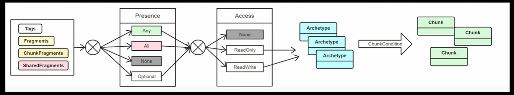
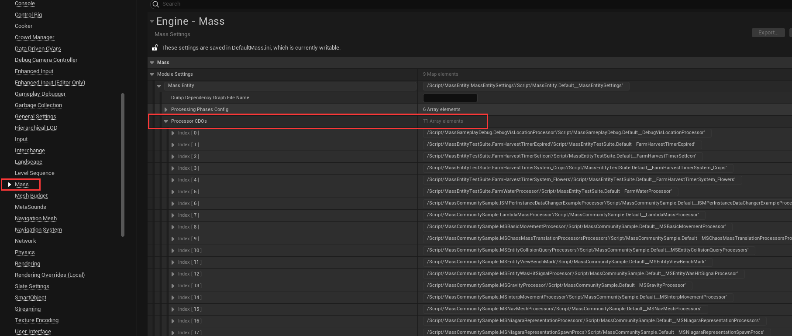
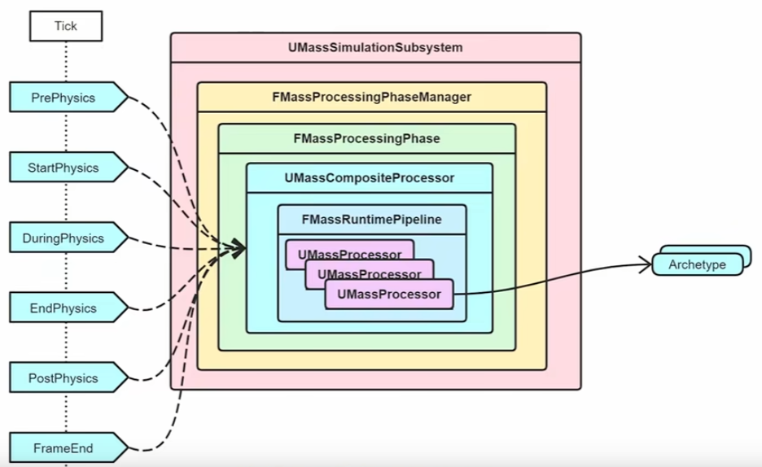

# Mass

## 大钊的分享

链接：[不Mass怎么Meta](https://www.bilibili.com/video/BV13D4y1v7xx)

元宇宙应该是广阔且生机勃勃的世界，所以世界中应该包括多种多样的丰富的生物，同理开放世界也需要大量的物体在场景中

为了实现这个功能，UE 提供 `Mass AI` 来模拟这样丰富的场景，那么 `Mass` 如何支持如此多量的AI实体并且达到流畅的**实时性能**

Mass 基于 DOD(面向数据) 的设计的，更加关注数据，把逻辑与数据分离，对计算机好，但是违背人的常识。真正在编程中应用的面向数据的设计模式就是 ECS 模式，Mass 正是采用 ECS 框架用于支持巨量的 AI 实体

以普通项目的 Actor 为例，一个 Actor 通常包括逻辑(`Logic`)、物理(`Physics`)、渲染(`Rendering`)、网络通信(`Messaging`)


> 上图说明的就是经典 Actor 的处理方式，通过 update 更新每个 Actor 及其对应的组，这种更新访问的是零碎的内存空间

当场景中 Actor 达到一定数量级之后，一个个驱动独立的 Actor 的 Logic 模块，对其进行 Update 是比较低效的

Mass 框架的作用就是将 Actor 的 Logic 模块抽离出来，用 Entity 来表示数据，再加上处理器 System 处理，之后根据对应关系更新 Actor 的表现部分

> Mass 只是处理 Actor 的逻辑部分 

如果场景中存在很多 Actor，但是其本身没有太多逻辑，性能瓶颈在 GPU 上而不是 GPU 上，这种情况 Mass 无法提供帮助


在 Mass 框架中，数据会被规整成整齐的 Fragment 片段，每个 Enitty 可以包括多个 Fragment，对 Fragment 的运算处理其实就是对 Entity 的逻辑处理。这种数据连续的内存，对 CPU 的 Cache 是非常友好的


> Mass 框架的各个模块

### 数据组织

在 Mass 中数据如何组织?

在 Mass 中把数据的结构叫做 Fragment, 对应 ECS 中的 Component

> 因为 UE 中已经存在 Component 了，所以不能再为 ECS 创建名为 Component 的类

Fragment 就是一个非常简单的结构的类，只包含**最纯粹的数据**，**不包含任何函数**

```cpp
USTRUCT()
struct FMassFragment
{
	GENERATED_BODY()

	FMassFragment() {}
};

USTRUCT(BlueprintType)
struct MASSCOMMUNITYSAMPLE_API FSampleColorFragment : public FMassFragment
{
	GENERATED_BODY()

	FSampleColorFragment() = default;
	
	FSampleColorFragment(FColor Color) : Color(Color){};

	UPROPERTY(BlueprintReadWrite, EditAnywhere)
	FColor Color = FColor::Red;
};

USTRUCT(BlueprintType)
struct FMyVectorFragmaent : FMassFragment {
	GENERATED_BODY()

    UPROPERTY(BlueprintReadWrite, EditAnyWhere)
    FVector Position;
}
```

> 需要注意内存对齐
> 为了方便使用可以添加一些函数，但是不可以使用 virtual 关键字

实体是 `Mass` 框架中的基本单元，它们可以包含不同类型的片段（`Fragment`），片段是用于描述实体属性和行为的数据结构

`Archetype` 就是根据片段的组合来定义实体的原型，可以理解为实体的类或模板。例如，如果有一个 `Archetype` 的片段组合是 `[Transform, Velocity, Health]`，那么这个 `Archetype` 关联的所有实体都拥有这三种片段，也就是说都有位置、速度和生命值这三个属性

Archetype 的作用是为了提高 Mass 框架的性能和效率，它可以将相同结构的实体存储在一起，方便进行批量操作和查询


由于系统中 Fragment 的数量是固定的，所以排列组合形成 Archetype 的数量也是固定的，也就是是说可以为每个 Archetype 定义一个 ID，并且可以通过 ID 唯一的活得到一个 Archetype

一个 Archetype 可能有多份数据(一个 Actor 一份)，所以对一个实体来说通过还需要一个数据 ID 来确定是 Archetype 这么多份数据的哪一份

```cpp
Entity 
{
    int32 Id;
    int32 ArchetypeId;
}
```

如何存储对应的 `Entity` 数据呢？

单纯使用 `TArray` 存储是不合适的，因为依然可能跨越巨大的内存位置，而且不好扩容

UE 将 `Archetype` 的存储分为一个个 `Chunk`, 每个 `Chunk` 分为 64kb 或者 128kb (对 CPU 的 Cache 比较友好)。`Chunk` 的大小确定、 `Archetpe` 的大小确定，可以算出一个 `Chunk` 可以容纳多少个 `Entity` 数据


如上，知道一个 `Chunk` 容纳多少个 `Entity` 个数据之后，就可以将 Fragment 依次排开，每次取数据的时候只要指针定位到开头，就可以正确访问指定数据

每个 `Chunk` 的开头还有一个 `FMassEntityHandle` 的数据，用来记录当前 `Chunk` 里有哪些 `Entity`，因此获得 `Chunk` 之后，就可以知道 `Chunk` 关联了哪些 `Entity`

```cpp
struct FMassArchetypeData
{
private:
    FMassArchetypeCompositionDescriptor CompositionDescriptor;

    TArray<FInstancedStruct> ChunkFragmentsTemplate;

    TArray<FMassArchetypeChunk> Chunks;

    // ... something else
}

struct FMassArchetypeChunk
{
private:
    uint8* RawMemory = nullptr;
    int32 AllocSize = 0;
    int32 NumInstances = 0;
    int32 SerialModificationNumber = 0;

    TArray<FInstancedStruct> ChunkFragmentData;
    
    FMassArchetypeSharedFragmentValues SharedFragmentValues;

    // ... something else
}
```

从 `FMassArchetypeChunk` 结构体可见，我们的 Chunk 其实就是一块内存 `RawMemory`

`ChunkFragmentData` 就是独属于这块 Chunk 的附加数据，比如 第1个Chunk 的 Entity 离玩家比较远，需要 1s 一次进行计算；第2个 Chunk 的 Entity 离玩家比较近，需要 0.1s 一次进行计算

`SharedFragmentValues` 在运算时常常需要一些更高维度的参数，比如重力、摩擦力系数等，这些数据全局只需要一份，可以作为共享片段值添加进 Chunk。允许不同的 Chunk 携带不同的共享参数，当然也可以没有

UE 中将 Mass 分为四种粒度

| 粒度 | 作用 |
| --- | --- |
| FMassFragment | 数据, 最小粒度 |
| FMassChunkFragment | 独属于 Chunk 的数据 |
| FMassTag | Archetype标签，无数据，分类 |
| FMassSharedFragment | Entities 之间共享的数据，全局数据。跨 Archetype |

Fragment 的粒度最小，一个 Entity 包含多个 Fragment，多个 Entity 的数据组合成 Chunk

一个 Chunk 可以带多个 ChunkFragment (常常用来表示一些 LOD 相关的数据，比如可见性)

在数据相同时候为了区分 Archetype 可以给其加上不同的 FMassTag

FMassSharedFragment 是跨 Archetype 的，常常用来表示全局数据

```cpp
struct MASSENTITY_API FMassEntityManager : public TSharedFromThis<FMassEntityManager>, public FGCObject{
    // ... something else

    TArray<FConstSharedStruct> ConstSharedFragments;

    TArray<FSharedStruct> SharedFragments;
    // ... something else
}
```

> UE 引擎中进一步将 `SharedFragment` 细分成 **Const** 和 **非Const**


```cpp
struct FMassArchetypeCompositionDescriptor{
    // ... some function
    FMassFragmentBitSet Fragments;              // 具体属性
    FMassTagBitSet Tags;                        // Tag 数据
    FMassChunkFragmentBitSet ChunkFragments;    // Chunk 数据
    FMassSharedFragmentBitSet SharedFragments;  // 共享数据
}
```

通过前面解释的四种数据类型，可以共同组合成一种 Archetype 的类型，因此 UE 提供 `FMassArchetypeCompositionDescriptor` 用来组合信息

可以看到上面代码中使用了很多了 `BitSet`，对应的机理就是将各个结构的 `UStruct` 类型信息存在一个数组里，然后把数组的下标当作 `BitSet` 的下标


也就是 BitSet 对应 Index 的值为 1，则表示具有这个结构，值为 0 则表示没有这个结构。比如总共有 32 个 Fragment，那么一个 `FMassArchetypeCompositionDescriptor` 的 `FMassFragmentBitSett` 有 32位，可以表示这个 Archetype 可以具有 32个 Fragment 的哪几个，具有的 Fragment 对应需要序号(index)的值为 true

使用 `BitSet` 可以快速的进行位运算，更方便做类型筛选；同时可以节省内存消耗，使用一个 int32(占32位) 的大小就可以代表32种 Fragment

```cpp
struct FMassArchetypeChunk
{
private:
    // FMassEntityHandle[N] + Frag1[N] + Frag2[N]
    uint8* RawMemory = nullptr;
    TArray<FInstancedStruct> ChunkFragmentData;
    FMassArchetypeSharedFragmentValues SharedFragmentValues;
    // 其他属性和函数
}

struct FMassArchetypeData
{
private:
    FMassArchetypeCompositionDescriptor CompositionDescriptor;

    TArray<FMassArchetypeChunk> Chunks;

    TMap<int32, int32> EntityMap;
    // 其他属性和函数
}

USTRUCT()
struct alignas(8) FMassEntityHandle
{
    UPROPERTY(VisibleAnywhere, Category = "Mass|Debug", Transient)
    int32 Index = 0;    

    UPROPERTY(VisibleAnywhere, Category = "Mass|Debug", Transient)
    int32 SerialNumber = 0;

    // 其他属性和函数
}

struct MASSENTITY_API FMassEntityManager : public TSharedFromThis<FMassEntityManager>, public FGCObject
{
    struct FEntityData
    {
        TSharedPtr<FMassArchetypeData> CurrentArchetype;
        int32 SerialNumber = 0;
    };    

    TChunkedArray<FEntityData> Entities;

    TMap<uint32, TArray<TSharedPtr<FMassArchetypeData>>> FragmentHashToArchetypeMap;

    // Shared fragments
    TArray<FConstSharedStruct> ConstSharedFragments;
    // Hash/Index in array pair
    TMap<uint32, int32> ConstSharedFragmentsMap;

    TArray<FSharedStruct> SharedFragments;
    // Hash/Index in array pair
    TMap<uint32, int32> SharedFragmentsMap; 
    // 其他属性和函数
}
```

| FMassArchetypeData 属性 | 作用 |
| --- | --- |
| EntityMap | 作为全局 Index 到 内部 Index 的转换，可以知道 Entity 位于该 Archetype 里面第几个 Chunk 的第几号位置 |

| FEntityData 属性 | 作用 |
| --- | --- |
| CurrentArchetype | |
| SerialNumber | 序列号做数据校验 |

| FMassEntityHandle 属性 | 作用 |
| --- | --- |
| Index | 全局 Entity 的索引下标，可以定位到具体 EntityData 数据 |
| SerialNumber | 序列号做数据校验 | 

| FMassEntityManager 的属性 | 作用 |
| --- | --- |
| FragmentHashToArchetypeMap | 所有的 Archetype 数据 |
| Entities | 所有的 Entity 数据 |
| ConstSharedFragments | 所有的共享参数 |
| SharedFragments | 所有的共享参数 |

```cpp
UCLASS()
class MASSENTITY_API UMassEntitySubsystem : public UWorldSubsystem
{
	GENERATED_BODY()
    // ... 
protected:
	TSharedPtr<FMassEntityManager> EntityManager;
};
```

`UMassEntitySubsystem` 持有全局唯一的 `EntityManager` 实例


Entityies 的列表存储在 EntityManager，但实际的数据存储在 ArcheType 的 Chunk 中

随着项目的运行，可能会有些 Entity 被删除，从而导致 Chunk 的空洞，这些空洞将在下次创建 Entity 时被填补(内部做了内存效率性优化)

另一点是不要动态的修改一个 Archetype 的 Fragment 的组成，这会导致创建新的 Archetype 然后把旧的 Entity 数据全部拷贝过去，这个过程消耗较大

### 运行机制

如何高效的调度和处理数据？

Mass 框架的运行机制分为两个步骤

1. 筛选关心的数据
2. 处理这些数据

那么 Mass 是如何筛选数据的呢？


所有的 Entity 的数据存储在 Chunk 中，所以我们的目标是筛选出合适的 Chunk 并返回出来，筛选 Chunk 的前提是筛选出合适的 Archetype

由于 `FMassArchetypeCompositionDescriptor` 由四种数据 `Fragments`、`Tags`、`ChunkFragments`、`SharedFragments` 组成



1. 对所有的的Archetypes 进行 4 项 Fragments 的逻辑类型过滤
2. 判断存在性
    - All，所有的都必须存在
    - Any，有一个存在即可
    - None，都不存在，用于排除
    - Optional，如果存在就处理，否则忽略
3. 判断访问模式
    - None，不访问
    - ReadOnly，只读不改变Frag
    - ReadWrite，读写该Frag
4. 获得多个 ValidArchetypes
5. 对每一个 Valid Archetype 的所有 Chunk 进行  ChunkCondition 的过滤
6. 最终获得目标 Chunk 集合，并对每个 Chunk 进行逻辑处理

```cpp
/** 
 *  FMassEntityQuery is a structure that is used to trigger calculations on cached set of valid archetypes as described 
 *  by requirements. See the parent classes FMassFragmentRequirements and FMassSubsystemRequirements for setting up the 
 *	required fragments and subsystems.
 * 
 *  A query to be considered valid needs declared at least one EMassFragmentPresence::All, EMassFragmentPresence::Any 
 *  EMassFragmentPresence::Optional fragment requirement.
 */
USTRUCT()
struct MASSENTITY_API FMassEntityQuery : public FMassFragmentRequirements, public FMassSubsystemRequirements
{
    // ... some thing
}
/** 
 *  FMassFragmentRequirements is a structure that describes properties required of an archetype that's a subject of calculations.
 */
USTRUCT()
struct MASSENTITY_API FMassFragmentRequirements
{
    GENERATED_BODY()

    TArray<FMassFragmentRequirementDescription> FragmentRequirements;
    TArray<FMassFragmentRequirementDescription> ChunkFragmentRequirements;
    TArray<FMassFragmentRequirementDescription> ConstSharedFragmentRequirements;
    TArray<FMassFragmentRequirementDescription> SharedFragmentRequirements;

    FMassTagBitSet RequiredAllTags;
    FMassTagBitSet RequiredAnyTags;
    FMassTagBitSet RequiredNoneTags;

    FMassFragmentBitSet RequiredAllFragments;
    FMassFragmentBitSet RequiredAnyFragments;
    FMassFragmentBitSet RequiredOptionalFragments;
    FMassFragmentBitSet RequiredNoneFragments;

    FMassChunkFragmentBitSet RequiredAllChunkFragments;
    FMassChunkFragmentBitSet RequiredOptionalChunkFragments;
    FMassChunkFragmentBitSet RequiredNoneChunkFragments;

    FMassSharedFragmentBitSet RequiredAllSharedFragments;
    FMassSharedFragmentBitSet RequiredOptionalSharedFragments;
    FMassSharedFragmentBitSet RequiredNoneSharedFragments;
}

struct MASSENTITY_API FMassFragmentRequirementDescription
{
    const UScriptStruct* StructType = nullptr;
    EMassFragmentAccess AccessMode = EMassFragmentAccess::None;
    EMassFragmentPresence Presence = EMassFragmentPresence::Optional;
}
```

使用方法有两种：**初始化列表** 或者 **一个个定义**，然后使用 `ForEachEntityChunk` 方法来遍历所有 Chunk，这个**遍历是阻塞式**的，等所有遍历完毕之后代码才会继续运行，但是**遍历时依旧会去并行优化**，所以不可操作其他线程的数据，并且时刻提醒自己不要访问其他内存区域的数据
System
```cpp
FMassEntityQuery quer1 { FMyIntFragment::StaticStruct(), FMyVectorFragment::StaticStruct() };

FMassEntityQuery query2;
query2.AddRequirement<FMyIntFragment>(EMassFragmentAccess::ReadWrite);
query2.AddRequirement<FMyVectorFragment>(EMassFragmentAccess::ReadOnly);


query2.ForEachEntityChunk(EntityManager,Context, [&,this](FMassExecutionContext& Context) {
    // do something ...
});
```

每次处理数据都定义一个 `FMassEntityQuery` 然后遍历所有的 Chunk 处理数据是非常零碎的，所以根据 ECS 思想抽象出一个 System 用于专门处理数据，这个 System 在虚幻 Mass 中被称为 `Processor`

> 命名为 `Processor` 而不是 `System` 原因是 UE 中已经有很多命名为 `System` 的类了

```cpp
UCLASS(abstract, EditInlineNew, CollapseCategories, config = Mass, defaultconfig, ConfigDoNotCheckDefaults)
class MASSENTITY_API UMassProcessor : public UObject
{
    GENERATED_BODY()

    // something ...

protected:
    virtual void Execute(FMassEntityManager& EntityManager, FMassExecutionContext& Context) PURE_VIRTUAL(UMassProcessor::Execute);

    // something ...

private:

    /** Whether this processor should be executed on StandAlone or Server or Client */
    UPROPERTY(EditAnywhere, Category = "Pipeline", meta = (Bitmask, BitmaskEnum = "/Script/MassEntity.EProcessorExecutionFlags"), config)
    int32 ExecutionFlags;

    /** Processing phase this processor will be automatically run as part of. */
    UPROPERTY(EditDefaultsOnly, Category = Processor, config)
    EMassProcessingPhase ProcessingPhase = EMassProcessingPhase::PrePhysics;

    /** Configures when this given processor can be executed in relation to other processors and processing groups, within its processing phase. */
    UPROPERTY(EditDefaultsOnly, Category = Processor, config)
    FMassProcessorExecutionOrder ExecutionOrder;

    /** Stores processor's queries registered via RegisterQuery. 
        *  @note that it's safe to store pointers here since RegisterQuery does verify that a given registered query is 
        *  a member variable of a given processor */
    TArray<FMassEntityQuery*> OwnedQueries;

    // something ...
}
```

> 可以配置 实例化 运行或者直接用 CDO 对象运行

| 属性 | 作用 |
| --- | --- |
| ExecutionFlags | 标记联机游戏中是否需要运行在客户端 |
| ProcessingPhase | 指明 Processor 运行在引擎的哪个阶段 |
| ExecutionOrder | 指明所在组的名称，以及必须运行在哪些 Porcessor 之后或之后 |
| OwnedQueries | 查找 |

```cpp
USTRUCT()
struct FMassProcessorExecutionOrder
{
    GENERATED_BODY()

    /** Determines which processing group this processor will be placed in. Leaving it empty ("None") means "top-most group for my ProcessingPhase" */
    UPROPERTY(EditAnywhere, Category = Processor, config)
    FName ExecuteInGroup = FName();

    UPROPERTY(EditAnywhere, Category = Processor, config)
    TArray<FName> ExecuteBefore;

    UPROPERTY(EditAnywhere, Category = Processor, config)
    TArray<FName> ExecuteAfter;
};
```

`Processor` 建议不要保存任何状态，它是一个专门用于处理数据逻辑的类，本身不需要任何状态

真正开发的时候只需要继承 `UMassProcessor`，注册Query、配置自定义Query、编写逻辑三步即可

```cpp
UCLASS()
class UCustomProcessor : public UMassProcessor
{
    GENERATED_BODY()

    UMassLookAtProcessor();

    protected:

    virtual void ConfigureQueries() override;
    virtual void Execute(FMassEntityManager& EntityManager, FMassExecutionContext& Context) override;

    FMassEntityQuery EntityQuery_Conditional;
}

UCustomProcessor::UCustomProcessor() 
    : EntityQuery_Conditional(*this)    // 注册Query
{
	ProcessingPhase = EMassProcessingPhase::FrameEnd;
}

void UCustomProcessor::ConfigureQueries()
{
    // 配置自定义Query
    EntityQuery_Conditional.AddRequirement<FMassLookAtFragment>(EMassFragmentAccess::ReadWrite);
    EntityQuery_Conditional.AddRequirement<FTransformFragment>(EMassFragmentAccess::ReadOnly);

    
    // 或者手动注册 EntityQuery.RegisterWithProcessor(*this);
}

void UCustomProcessor::Execute(FMassEntityManager& EntityManager, FMassExecutionContext& Context)
{
    // 编写执行逻辑
    const double CurrentTime = GetWorld()->GetTimeSeconds();

    EntityQuery_Conditional.ForEachEntityChunk(EntityManager, Context, [this, &EntityManager, CurrentTime](FMassExecutionContext& Context) {
        // do something ...
    }
}
```

一般情况下，`Processor` 类编写完毕后不需要手动调用，引擎的 Mass 框架会通过反射找到所有的 `Processor` 类，在引擎的 Mass 设置中可以看到所有的 `Processor` 的 CDO 对象

通过注册的 `EntityQuery` 可以判断当前 `Processor` 关心哪些 Archetype，如果当前不存在这些 `Archetype`，就可以先将该 `Processor` 剔除，因为没有它所关心的数据，也就没有运行的必要，这样优化运行效率



很多时候，一个任务依赖另一个任务的计算结果，一个任务可能等到所有子任务完成之后才算能完成 (**参考行为树的 Task**)，所以 Mass 中定义 `UMassCompositeProcessor` 派生自 `UMassProcessor` 用于组合任务

```cpp
UCLASS()
class MASSENTITY_API UMassCompositeProcessor : public UMassProcessor
{
    GENERATED_BODY()
        
protected:
    UPROPERTY(VisibleAnywhere, Category=Mass)
    FMassRuntimePipeline ChildPipeline;
}


USTRUCT()
struct MASSENTITY_API FMassRuntimePipeline
{
    GENERATED_BODY()

private:
    UPROPERTY()
    TArray<TObjectPtr<UMassProcessor>> Processors;
}
```

通过前面的 `ExecutionOrder` 可以确定 `Processor` 的运行顺序，通过 `Processor` 的 `QueryEntity` 可以筛选需要被执行的 `Processor` ，接下来就是根据 `ProcessingPhase` 在指定的引擎阶段运行

```cpp
UENUM()
enum class EMassProcessingPhase : uint8
{
    PrePhysics,    
    StartPhysics,  
    DuringPhysics, 
    EndPhysics,    
    PostPhysics,   
    FrameEnd,      
    MAX,
};
```

| 阶段 | 适用 |
| --- | --- |
| PrePhysics | 这个阶段在物理模拟之前执行，可以用于更新实体的位置、速度等属性，或者进行一些预处理的操作，如碰撞检测、射线检测等 |
| StartPhysics | 这个阶段在物理模拟开始时执行，可以用于设置实体的物理参数，如质量、摩擦力、弹力等，或者给实体施加一些外力，如重力、风力等 |
| DuringPhysics | 这个阶段在物理模拟进行时执行，可以用于监控实体的物理状态，如是否发生碰撞、是否静止等，或者进行一些动态的调整，如改变实体的形状、大小等 |
| EndPhysics | 这个阶段在物理模拟结束时执行，可以用于获取实体的最终位置、速度等属性，或者进行一些后处理的操作，如销毁实体、创建特效等 |
| PostPhysics | 这个阶段在物理模拟之后执行，可以用于更新实体的逻辑状态，如生命值、状态机等，或者进行一些游戏逻辑的判断，如是否完成任务、是否触发事件等 |
| FrameEnd | 这个阶段在帧结束时执行，可以用于清理一些临时数据，或者准备一些下一帧需要的数据 |



**如何在遍历 Entity 时进行操作?**

在前面 `FMassQUery` 运行的时候需要提供一个 `Context`，这个 `Context` 是 `FMassExecutionContext` 类型，该类型中有一个属性 `TSharedPtr<FMassCommandBuffer> DeferredCommandBuffer`，该属性用于存储一些操作

众所周知，在数组遍历的时候不能修改增删改变数据集合，否则容易导致循环混乱。在遍历 Entity 时也是这样，不能够杀掉 Entity 或者 变更Entity的Tag。所以此时引入 `FMassCommandBuffer` 来记录操作，等到循环结束之后再一并把这些操作命令都处理掉。通过 `Context.Defer()` 可以看到很多操作接口。

**如何对 Entity 的值进行初始化？**

在每次创建 Entity 时手动初始化并不合适，可能别的参数还没有创建或者初始化；这么写也很麻烦，需要自己筛选 Fragment 并运算；也破坏了 Entyiity 只存属性的规则，数据计算和设置应该交给 Processor 处理

于是 Mass 框架中提供 `UMassObserverProcessor` 的子类，用于检测某一种 Fragment 、Data、Tag 的添加或删除事件从而触发

> EntityManager 会根据是否有观察者而把有改变的 Entity 都记录下来，然后再每帧同一的触发各种 `UMassObserverProcessor`

**Processor 之间如何通信？**

采用信号的订阅处理系统来协调 Entity 之间的通信，需要继承 `UMassSignalProcessorBase` 来处理特定信号，这个信号的注册需要依赖 `UMassSignalSubsystem`

具体信号传递的案例可以查看 `UMassStateTreeProcessor` 类，该类并没有重写 `Execute` 函数，而是重写了 `SignalEntities` 函数，因为 `UMassSignalProcessorBase` 基类中处理了本帧收到的信号，并将影响到的 Entity 都通过调用 `SignalEntities` 传递给子类
