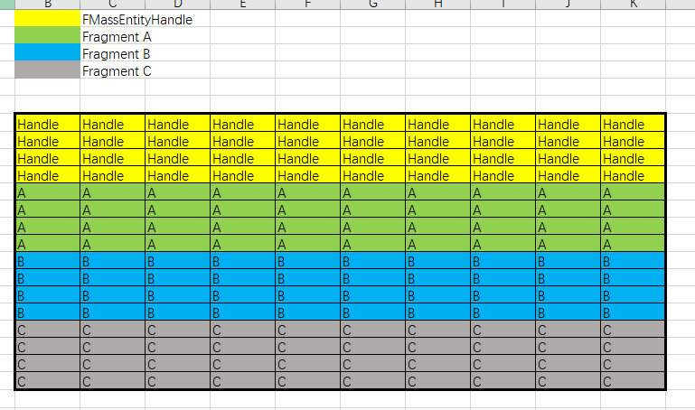

# 源码阅读

> 防止 README 过大，不想看

## ASpawnActor

### 配置项


#### UMassEntityConfigAsset

上图中配置的就是 `UMassEntityConfigAsset` 类型的资产

其中有且只有 **一个属性** 那就是 `FMassEntityConfig` 类型的 `Config`

```cpp
UCLASS(BlueprintType)
class MASSSPAWNER_API UMassEntityConfigAsset : public UDataAsset
{
protected:
	/** The config described in this asset. */
	UPROPERTY(Category = "Entity Config", EditAnywhere)
	FMassEntityConfig Config;
}
```

#### FMassEntityConfig

```cpp
USTRUCT()
struct MASSSPAWNER_API FMassEntityConfig
{
public:
    // 其他函数 Some Functions 

	TObjectPtr<const UMassEntityConfigAsset> Parent = nullptr;

	TArray<TObjectPtr<UMassEntityTraitBase>> Traits;
    
	TObjectPtr<UObject> ConfigOwner = nullptr;
private:
	FGuid ConfigGuid;
}
```

`FMassEntityConfig` 主要就是用来配置 `UMassEntityTraitBase`

通过设置 `Parent` 来实现继承关系，对于多种类型对象存在相同的 `UMassEntityTraitBase` 可以封装通用 `UMassEntityConfigAsset` 作为 `Parent` 实现资产复用

#### UMassEntityTraitBase

`UMassEntityTraitBase` 用于在生成模板时一次性把需要的片段、标签和默认值配置好，供成千上万实体复用

> `FMassFragment` 是数据本体，表示纯数据

```cpp
class MASSSPAWNER_API UMassEntityTraitBase : public UObject
{
	GENERATED_BODY()

public:
	virtual void BuildTemplate(FMassEntityTemplateBuildContext& BuildContext, const UWorld& World) const PURE_VIRTUAL(UMassEntityTraitBase::BuildTemplate, return; );
	virtual void DestroyTemplate() const {}
	virtual void ValidateTemplate(FMassEntityTemplateBuildContext& BuildContext, const UWorld& World) const {};
};
```

`UMassEntityTraitBase` 只有三个函数

- `BuildTemplate` 会在构建一个 `FMassEntityTemplateData` 的时候调用，在此处配置所需的 FMassTag 和 FMassFragment
- `DestroyTemplate` 删除时调用
- `ValidateTemplate` 当 `FMassEntityTemplate` 构建完毕之后调用，用于检查是否有效

`BuildTemplate` 的例子如下

```cpp
void UMSMoverMassTrait::BuildTemplate(FMassEntityTemplateBuildContext& BuildContext, const UWorld& World) const
{
	BuildContext.RequireFragment<FTransformFragment>();
	BuildContext.RequireFragment<FMassVelocityFragment>();
	BuildContext.AddFragment_GetRef<FMassForceFragment>().Value = StartingForce;
	BuildContext.AddTag<FMSBasicMovement>();
}
```

`ValidateTemplate` 的例子如下

```cpp
void UMassStateTreeTrait::ValidateTemplate(FMassEntityTemplateBuildContext& BuildContext, const UWorld& World) const
{
    // 其他判断、循环流程
    // 判断是否存在指定的 Fragment 没有就打日志
    else if (ItemDesc.Struct->IsChildOf(FMassFragment::StaticStruct()))
    {
        const bool bContainsFragment = BuildContext.HasFragment(*CastChecked<UScriptStruct>(ItemDesc.Struct));
        UE_CVLOG(!bContainsFragment, MassStateTreeSubsystem, LogMassBehavior, Error, TEXT("StateTree %s: Could not find required fragment %s"), *GetNameSafe(StateTree), *GetNameSafe(ItemDesc.Struct));
    }
}
```

### 构建并注册 FMassEntityTemplateData

`PostRegisterAllComponents` 是 `Actor` 创建流程的一个阶段，执行顺序大致是

- UObject::PostLoad
- UActorComponent::OnComponentCreated
- AActor::PreRegisterAllComponents
- UActorComponent::RegisterComponent
- AActor::PostRegisterAllComponents
- AActor::PostActorCreated
- AActor::UserConstructionScript
- AActor::OnConstruction
- AActor::PreInitializeComponents
- UActorComponent::Activate
- UActorComponent::InitializeComponent
- AActor::PostInitializeComponents
- AActor::BeginPlay

在 `AMassSpawner::PostRegisterAllComponents` 函数中调用 `RegisterEntityTemplates` 注册 `FMassEntityTemplateData`，不过这只有在 `NM_Client` 的时候才会执行，一般单机模式是 `NM_Standalone`

```cpp
void AMassSpawner::PostRegisterAllComponents()
{
	Super::PostRegisterAllComponents();
    if (GEngine->GetNetMode(GetWorld()) == NM_Client) {
        UMassSpawnerSubsystem* MassSpawnerSubsystem = UWorld::GetSubsystem<UMassSpawnerSubsystem>(World);
        if (MassSpawnerSubsystem) {
            RegisterEntityTemplates();
        }
    }
}
```

单机模式下，会在 `SpawnGeneratedEntities` 的时候，在 `EntityConfig->GetOrCreateEntityTemplate` 构建

无论如何，最终都会调用到 `FMassEntityConfig::GetOrCreateEntityTemplate` 函数

```cpp
UMassSpawnerSubsystem* SpawnerSystem = UWorld::GetSubsystem<UMassSpawnerSubsystem>(&World);
FMassEntityTemplateData TemplateData;
FMassEntityTemplateBuildContext BuildContext(TemplateData, TemplateID);

TArray<UMassEntityTraitBase*> CombinedTraits;
GetCombinedTraits(CombinedTraits);

BuildContext.BuildFromTraits(CombinedTraits, World);
BuildContext.SetTemplateName(GetNameSafe(ConfigOwner));

return TemplateRegistry.FindOrAddTemplate(TemplateID, MoveTemp(TemplateData)).Get();
```

通过 `CombinedTraits` 和 `BuildContext` 构建 `TemplateData`

| FMassEntityTemplateBuildContext 函数 | 作用 |
| --- | --- | 
| AddFragment_GetRef | 向 TemplateData 中添加 Fragment，并返回可写引用，便于立刻设置默认值 |
| AddFragment | 向 TemplateData 中添加 Fragment，默认构造 |
| AddTag | 向 TemplateData 中添加 Tag。Tag 可被多个 Trait 重复添加，不会当作冲突；但仍记录“谁添加过”，便于追踪 |
| AddChunkFragment | 添加 Chunk 级别 Fragment |
| AddConstSharedFragment | 添加 const 的 Shared 级别的 Fragment |
| AddSharedFragment | 添加 Shared 级别的 Fragment |
| AddTranslator | 将当前的 TemplateData 注册到 UMassTranslator 中 |
| RequireFragment | 向 TraitsDependencies 添加，用于 ValidateBuildContext 来检测有效性 |
| RequireTag | 向 TraitsDependencies 添加，用于 ValidateBuildContext 来检测有效性 |
| TypeAdded | 记录 Trait 添加了哪些 Fragment 和 Tag |
| ValidateBuildContext | 检查 Tag 和 Fragment 的有效性 |

> UMassTranslator 用于 ECS 世界的数据与 UE 世界的数据进行同步

最后通过 `FMassEntityTemplateData` 来构建 `FMassEntityTemplate` 

```cpp
FMassEntityTemplate::MakeFinalTemplate(*EntityManager, MoveTemp(TemplateData), TemplateID)
```

至于 `TemplateID` 则是通过 `FMassEntityConfig::ConfigGuid` 构建的

```cpp
OutTemplateID = FMassEntityTemplateIDFactory::Make(ConfigGuid);
```

通过上述方法，构建出了 `UMassEntityConfigAsset` 对应的 `FMassEntityTemplateID` 和 `FMassEntityTemplate`

并将 ID 和 Data 注册到 `UMassSpawnerSubsystem::TemplateRegistryInstance` 防止重复构建

#### FMassEntityTemplate 中的 FMassArchetypeData

`FMassEntityTemplateData` 保存着对应 Entity 运行时所需的 `Tag` 、 `Fragment` 、 `SharedFragment`

通过这些来构建 `FMassEntityTemplate`

```cpp
struct MASSSPAWNER_API FMassEntityTemplate final : public TSharedFromThis<FMassEntityTemplate> 
{
private:
	FMassEntityTemplateData TemplateData;
	FMassArchetypeHandle Archetype;
	FMassEntityTemplateID TemplateID;
}
```

`TemplateData` 和 `TemplateID` 都是在构建的时候就知道的，主要是构建出 `Archetype`

```cpp
const FMassArchetypeHandle ArchetypeHandle = EntityManager.CreateArchetype(GetCompositionDescriptor(), FName(GetTemplateName()));
```

> `GetCompositionDescriptor` 得到的是 `TemplateData` 中存储的所有 `Fragment` 和 `Tag` 信息，不包括 `SharedFragment`

`Archetype` 意为原型、原型布局，基于该 `Archetype` 创建出来的 `Entity` 具有相同的内存布局

通过 `TemplateData` 得到的 `Fragment` 和 `Tag` 只要集合一致 （不看顺序、不允许重复），那么其对应的内存布局应该也是一致的，那么他们就应该使用同一种 Archetype，并共享相同的按 Chunk 划分的内存组织方式

`Archetype` 的职责就是

1. 定义实体的内存布局（每个片段的偏移/对齐/构造/析构规则、每块可容纳多少实体）
2. 维护 chunk 列表、实体在 chunk 内的位置索引
3. 支持增删实体、移动实体到别的 Archetype
4. 支持查询执行：把查询的 **需求** 映射到本 Archetype 的片段索引，并分块执行

```cpp
struct FMassArchetypeData
{
private:
	FMassArchetypeCompositionDescriptor CompositionDescriptor;                  // 描述该 Archetype 拥有哪些 fragment/tag 类型
	TArray<FInstancedStruct> ChunkFragmentsTemplate;                            // 当新建 chunk 时，用它们初始化 chunk-level 的片段数据

	TArray<FMassArchetypeFragmentConfig, TInlineAllocator<16>> FragmentConfigs; // 每个 fragment 类型在本 Archetype 中的布局描述
	
	TArray<FMassArchetypeChunk> Chunks;                     // 该 Archetype 拥有的所有 chunk
	TMap<int32, int32> EntityMap;                           // 将实体的 全局索引 映射到本 Archetype 内的 绝对索引 
	
	TMap<const UScriptStruct*, int32> FragmentIndexMap;     // 把 fragment 的脚本结构类型映射到 FragmentConfigs 的下标，便于 O(1) 定位布局信息

	int32 NumEntitiesPerChunk;                              // 一个 chunk 最多容纳多少实体
	int32 TotalBytesPerEntity;                              // 一个 Entity 占用内存大小，也就是所有 Fragment 大小 + 内存对齐
	int32 EntityListOffsetWithinChunk;                      // 在 chunk 原始内存中，存放实体列表（比如实体句柄/索引数组）的起始偏移
public:
    // 其他工具函数
}
```

通过 `Initialize` 来初始化一个 `Archetype`，通过 `ConfigureFragments` 来计算 NumEntitiesPerChunk、TotalBytesPerEntity

通过 `SortedFragmentList` 存储按照 **字节大小** 排序后的 `Fragments`，遍历所有的 `Fragment` 得到 `TotalBytesPerEntity` 表示一个 `Entity` 数据所占内存大小

> 排序是为了保证布局顺序的确定性，用于生成稳定的 Archetype

```cpp
int32 FragmentSizeTallyBytes = 0;
FragmentSizeTallyBytes += sizeof(FMassEntityHandle);            // 初始值为 sizeof(FMassEntityHandle)
for (int32 FragmentIndex = 0; FragmentIndex < SortedFragmentList.Num(); ++FragmentIndex)
{
    // 其他处理
    FragmentConfigs[FragmentIndex].FragmentType = FragmentType; // 保存 Fragment 数据到 FragmentConfigs 中
    AlignmentPadding += FragmentType->GetMinAlignment();        // 空白内存占用字节
    FragmentSizeTallyBytes += FragmentType->GetStructureSize(); // Fragment 内存占用字节
}

// 计算得到 TotalBytesPerEntity
TotalBytesPerEntity = FragmentSizeTallyBytes;
int32 ChunkAvailableSize = GetChunkAllocSize() - AlignmentPadding;
NumEntitiesPerChunk = ChunkAvailableSize / TotalBytesPerEntity;
```

**注意** `FragmentSizeTallyBytes` 大小是 **所有Fragment的大小和** + `sizeof(FMassEntityHandle)`

> FMassEntityHandle 用于存储一个 Index 和一个 SerialNumber，Index 表示全局大数组的序号， SerialNumber 用于校验，类似 WeakObjectPtr 的实现原理

`ChunkAvailableSize` 表示一个 Chunk 中实际有效的空间大小，其值是 `GetChunkAllocSize` 减去对齐填充的空白内存

`NumEntitiesPerChunk` 表示一个 Chunk 中有多少个 Entity 的数据，就是 `ChunkAvailableSize` 除以一个 Entity 占用的大小 `TotalBytesPerEntity`

```cpp
int32 CurrentOffset = NumEntitiesPerChunk * sizeof(FMassEntityHandle);
for (FMassArchetypeFragmentConfig& FragmentData : FragmentConfigs)
{
    CurrentOffset = Align(CurrentOffset, FragmentData.FragmentType->GetMinAlignment());
    FragmentData.ArrayOffsetWithinChunk = CurrentOffset;
    const int32 SizeOfThisFragmentArray = NumEntitiesPerChunk * FragmentData.FragmentType->GetStructureSize();
    CurrentOffset += SizeOfThisFragmentArray;
}
```

从上面的代码就可以看到一个 Chunk 的实际内存布局是怎样的

`CurrentOffset` 初始化为 `NumEntitiesPerChunk * sizeof(FMassEntityHandle)`

可见，一个 Chunk 前面有 `NumEntitiesPerChunk` 个 `FMassEntityHandle` 来 Handle 数据

每计算一个 `FragmentData` 都会让 `CurrentOffset += SizeOfThisFragmentArray` 

可见，一个 Chunk 中 `NumEntitiesPerChunk` 个相同的 `Fragment` 是连续的 



一个 Chunk 的内存结构大致如上，前面有 `NumEntitiesPerChunk` 个 Handle，然后是 `NumEntitiesPerChunk` 个连续的相同的 `Fragment` 

> 没有画出空白内存


