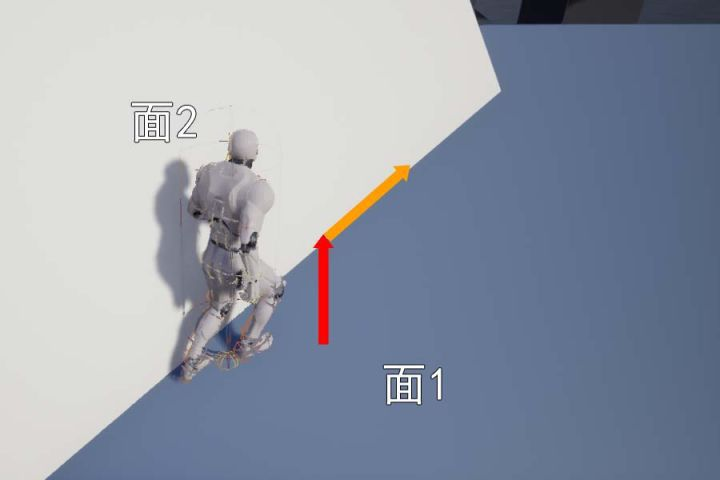
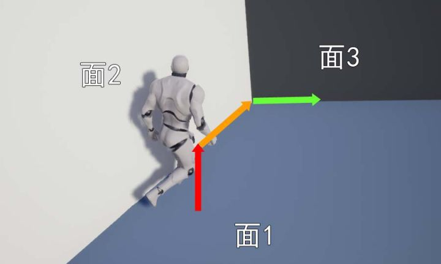

# 移动组件

## 碰撞查询

> https://zhuanlan.zhihu.com/p/685714685

> https://news.16p.com/842025.html

> https://www.cnblogs.com/walterwhiteJNU/p/15720810.html

> https://docs.nvidia.com/gameworks/content/gameworkslibrary/physx/guide/Manual/CharacterControllers.html#moving-a-character-controller

角色移动是一个复杂的计算过程，为了让游戏操作更加顺畅，往往需要非常多的细节处理，这些特殊的移动处理逻辑叫做 `collide and slide`

正如 `Phys-x` 物理引擎的 SDK 文档中所说，如果使用物理引擎来控制角色移动存在很多问题

- 缺乏连续碰撞检测，经典物理引擎使用离散碰撞检测，因此会出现`tunneling effect`
  - `tunneling effect` 当角色移动过快的时候，可能会穿过墙壁，因此需要限制角色最大速度
  - 即使没有 `tunneling`，当角色在角落向前推时，会出现角色抖动的情况，因为物理引擎不断将其前后移动到略有不同的位置
- 无法直接控制，**刚体**通常由**脉冲**或**力**控制，无法直接将角色移动到最终位置
- 摩擦问题，当角色在斜坡上时，通常不应该滑动，因此会设置无限大的摩擦力，当这也导致角色无法向前移动
- 不受控制的跳跃，当角色快速移动并于物体碰撞时，角色不应该被弹开，比如角色从高空落下时，落地双腿完全，并且不会弹跳。但是由于 `restitution` 的存在，会产生回弹效果

由于以上这些问题的存在，角色移动不能直接使用 **物理引擎** 来控制

### collide and slide 算法

虚幻引擎将碰撞检测的信息封装成 `FHitResult`，虽然下面这些理论知识与虚幻引擎无关，为了方便参数解释，还是提前说明 

| FHitResult 的属性 | 解释 |
| --- | --- |
| bBlockingHit |  是否发生碰撞 |
| Time |  碰撞后实际移动距离除以检测移动距离 |
| Distance |  碰撞后实际移动距离 |
| Location |  碰撞后最终位置 |
| ImpactPoint |  碰撞接触点 |
| Normal |  碰撞切面法向量 |
| ImpactNormal |  碰撞切面法向量（非胶囊体和球体检测与Normal不同） |
| TraceStart |  检测开始位置 |
| TraceEnd |  检测结束位置 |
| bStartPenetrating |  是否在检测开始就有渗透情况 |
| PenetrationDepth |  渗透深度 |

`Sweep` 检测

> `Sweep` 扫过、掠过、大范围伸展

> https://docs.nvidia.com/gameworks/content/gameworkslibrary/physx/guide/3.3.4/Manual/GeometryQueries.html#sweeps


以当前坐标为起点，以当前 **速度** 和 `Delta` 计算下一帧的理论坐标为终点，进行检测

如果中间检测到碰撞，则无法移动到终点坐标，从碰撞点计算角色下一帧真实坐标

- `TraceStart` 表示 检测起点，值为当前坐标
- `TraceEnd` 表示 检测终点，值为理论下一帧坐标
- `ImpactPoint` 表示 碰撞接触点
- `Location` 表示 下一帧的实际坐标
- `Distance` 表示 下一帧的实际坐标与当前坐标之间的距离
- `Time` 表示 $\frac{Distance}{TraceEnd-TraceStart}$，是一个 0~1 之间的值

--------

`InitialOverlaps` 检测


也就是在**开始位置**就检测到了重叠

这个时候 `bStartPenetrating` 值为 true，表示检测到了 `InitialOverlaps` 

`Penetrating` 表示重叠深度

> `Penetrating`： 渗透、贯穿、穿过

--------

### MoveAlongFloor

| 可以移动的坡度 | 不可移动的坡度 |
| --- | --- |
|  |  |

通过 速度、加速都、摩擦力、BrakingDeceleration 等，计算出最后的速度向量 `Velocity * DeltaTime`

根据地面坡度调整移动向量方向，例如可移动坡度的红色箭头

如果碰撞检测返回 `Hit` 的结果是 `Block`，表示检测到斜坡比较陡，那么可以将剩下的移动向量改为沿着面2移动

引擎通过 `Hit.Normal` 获取 **面2** 的法线方向，通过**坡度检测**，若夹角小于 `WalkableFloorAngle` 则判定为缓坡，可以行走；若夹角大于 `WalkableFloorAngle` 判定为陡坡，不可行走

随后第一次响应 **沿面移动** `SlideVector = OriginalDelta - (OriginalDelta • Hit.Normal) * Hit.Normal`，之后再次调用 `SafeMoveUpdatedComponent`

此时再次射线检测，如果返回的 Hit 的结果还是 Blokc，表示面2 非常陡，可能需要 StepUp 上楼逻辑

### StepUp


上楼逻辑分成 3 次移动构成

1. 首先向上移动 `MaxStepHeight` 高度
2. 然后向前移动(如果前移过程中检测到 Block，那么需要执行 SlideAlongSurface)
3. 最后向下移动，移动到面 2 上面

不过很多情况会导致 StepUp 失败

比如：移动过程中检测到**穿透** `Penetration`，最终无法落到一个合适的落脚点

如果 `StepUp` 失败，需要调用 `SlideAlongSurface` 贴着面走

### SlideAlongSurface



大概就是下面这个情况，会触发 `SlideAlongSurface`，红色向量是加速度方向

在计算 `MoveAlongFloor` 之后，由于 `StepUp` 失败，尝试 `SlideAlongSurface`

得到橙色向量为实际速度方向

### TwoWallAdjust

| 沿着 面3 向右移动 | 沿着 面3 向上移动 |
| --- | --- |
|  |  |


当我们通过 `SlideAlongSurface` 移动的时候，前面又出现一堵墙，此时需要计算 **墙2** 和 **墙3** 之间的角度，如果夹角大于 90°，那么可以沿着**面3**的方向继续移动

### FindFloor

通过 `FindFloor` 可以计算得到脚下的地面信息，并包含在 `FFindFloorResult` 结构体中

| FFindFloorResult 属性 | 作用 |
| --- | --- |
| bBlockHit | 是否跟地面有碰撞 | 
| bWalkableFloor | 可以行走的地面 | 
| bLineTrace | 是否是通过line trace检测出来的结果 | 
| FloorDist | Sweep查询到地面的距离 | 
| LineDist | LineTrace查询到地面的距离 | 
| HitResult | 跟地面的FHitResult | 

#### ComputeFloorDist

一般情况下，只需要一次垂直向下 `Sweep` 检测就可以计算出 `FloorDist`


不过还会出现一种情况，那就是角色有一部分在地面里面


此时检测的 `bStartPenetration` 是 true

需要缩小叫能提，重新向下 `Sweep` 计算出来的 `FloorDist - ShrinkHeight` 就是原胶囊体跟地面的距离

所有缩小的胶囊体 `Sweep` 让然出现了穿透的情况，需要修改使用 `Line Trace` 并且从胶囊体中心向下检测胶囊体的半高，如何检测到了 `Hit`，则可以计算陷入地面以下的高度

无论是 `Sweep` 还是 `LineTrace`，单次调整的高度 `MaxPenetrationAdjust` 最大只能是胶囊体的半径，如果陷入地面的深度大于高度，无法一次调整到地面上，需要多帧处理

## UE 的移动组件

> https://zhuanlan.zhihu.com/p/650314172


角色移动组件分层设计，各自负责不同的职责

| 组件 | 作用 |
| --- | --- |
| UMovementComponent | 基础移动 |
| UNavMovementComponent | 导航集成 |
| UPawnMovementComponent | 输入响应 |
| UCharacterMovementComponent | 角色物理 |

- `MovementComponent` 为基类，提供基本的更新坐标逻辑。通常用于 **可推动的物理道具**
  - 设置需要更新的组件(`UpdateComponent`)，通常是根组件，比如 `ACharacter` 的根**胶囊体组件**
  - 设置需要更新的组件(`UpdatedPrimitive`)，用于物理交互，如果 `UpdateComponent` 能转换成 `UPrimitiveComponent` 会直接使用 `UpdateComponent`
  - 设置 `MoveComponentFlags`，用于控制更新行为的精细开关
  - `Velocity` 存储实时移动速度向量，是驱动组件运动的核心数据
  - `PlaneConstraintNormal` 定义移动约束平面的法线方向(`(0,1,1) 限制 Y 轴移动`)
  - `PlaneConstraintOrigin` 定义移动约束平面的原点坐标，用于计算组件与平面的空间关系

```cpp
UpdatedComponent = IsValid(NewUpdatedComponent) ? NewUpdatedComponent : NULL;
UpdatedPrimitive = Cast<UPrimitiveComponent>(UpdatedComponent);
```

- `NavMovementComponent` 提供了AI寻路用的一些接口。通常用于 AI 控制的非人形物体
    - `NavAgentProps` 定义导航代理的物理特性和移动能力(如：半径、高度、最大速度、加速度等)，用于路径计算和碰撞检测
    - `FixedPathBrakingDistance` 定义减速到停止的距离，由 `bUseFixedBrakingDistanceForPaths` 控制是否启用
    - `PathFollowingComp` 处理路径跟随逻辑，通常是 `UPathFollowingComponent`

- `PawnMovementComponent` 定义了接受输入的接口。其Owner必须为APawn子类。通常用于自定义载具等

### MoveUpdateComponent

`UMovementComponent::MoveUpdateComponent` 是真正执行物体移动逻辑的函数接口，并且该函数不是虚函数，子类无法重写

```cpp
FORCEINLINE_DEBUGGABLE bool UMovementComponent::MoveUpdatedComponent(const FVector& Delta, const FRotator& NewRotation, bool bSweep, FHitResult* OutHit, ETeleportType Teleport)
{
	return MoveUpdatedComponentImpl(Delta, NewRotation.Quaternion(), bSweep, OutHit, Teleport);
}

bool UMovementComponent::MoveUpdatedComponentImpl( const FVector& Delta, const FQuat& NewRotation, bool bSweep, FHitResult* OutHit, ETeleportType Teleport)
{
	if (UpdatedComponent)
	{
		const FVector NewDelta = ConstrainDirectionToPlane(Delta);
		return UpdatedComponent->MoveComponent(NewDelta, NewRotation, bSweep, OutHit, MoveComponentFlags, Teleport);
	}

	return false;
}
```

对的，该函数直接调用 `UpdatedComponent` 的 `MoveComponent`，让组件自己更新自己

不过 `USceneComponent::MoveComponentImpl` 是虚函数，可以被子类重写，所以说根据设置的 `UpdatedComponent` 的不同，最后执行的移动逻辑也不相同

#### USceneComponent::MoveComponentImpl

对于 `USceneComponent::MoveComponentImpl` 的实现逻辑是比较简单的

1. 检查能否移动，组件的 `Mobility` 必须是 `Movable`
2. 调用 `ConditionalUpdateComponentToWorld` 确保组件的 `Transform` 已经更新
3. 检测是否是零位移 `Delta.IsZero()`，零位移表示不用移动，也就无需后续计算
4. 更新坐标和旋转 `InternalSetWorldLocationAndRotation`
5. 如果更新成功，则进行重叠检测 `UpdateOverlaps`，主要是递归更新 `AttachedChild`，并且更新自己的 `PhysicsVolume` 信息

`InternalSetWorldLocationAndRotation` 逻辑相对简单

1. 传入新的坐标、旋转参数
2. 如果存在父节点，基于父节点的坐标信息，更新传入的坐标和旋转信息
3. 判断是否存在坐标修改、旋转修改
4. 如果存在 坐标 或者 旋转 修改，更新 `RelativeLocation` 和 `RelativeRotation` 的值
5. 根据 `bCanEverAffectNavigation` 更新导航网格的信息

#### UPrimitiveComponent::MoveComponentImpl

前面说过 `MoveComponentImpl` 是一个虚函数

在 `UMovementComponent` 中的 `UpdatedComponent` 通常被设置为对象的根组件，而 `ACharacter` 的根组件是 `UCapsuleComponent`

`UCapsuleComponent` -> `UShapeComponent` -> `UPrimitiveComponent`

所以对于 `ACharacter` 来说，更新坐标执行的是 `UPrimitiveComponent::MoveComponentImpl`

接下来逐步对代码 `MoveComponentImpl` 进行解释

1. 初始化并计算像移动方向进行 `Sweep` 所需要的数据

```cpp
// Set up
const FVector TraceStart = GetComponentLocation();  // 当前坐标
const FVector TraceEnd = TraceStart + Delta;        // 理论终点坐标
float DeltaSizeSq = (TraceEnd - TraceStart).SizeSquared();  // 移动距离的平方
const FQuat InitialRotationQuat = GetComponentTransform().GetRotation();  // 当前角度
```

注意这里 `DeltaSizeSq` 使用的是 `SizeSquared`，也就是**长度的平方**

节省了 `sqrt` 计算的性能，因为与 `MinMovementDistSq` 比较大小，不需要精确值，大概那个范围就行

-------

2. 当移动和旋转都是极小值时，跳过后续计算流程。如果只是移动距离值极小，那么将 `DeltaSizeSq` 设置为 0

```cpp
// ComponentSweepMulti does nothing if moving < KINDA_SMALL_NUMBER in distance, so it's important to not try to sweep distances smaller than that. 
const float MinMovementDistSq = (bSweep ? FMath::Square(4.f* UE_KINDA_SMALL_NUMBER) : 0.f);
if (DeltaSizeSq <= MinMovementDistSq)
{
  // Skip if no vector or rotation.
  if (NewRotationQuat.Equals(InitialRotationQuat, SCENECOMPONENT_QUAT_TOLERANCE))
  {
    // copy to optional output param
    if (OutHit)
    {
      OutHit->Init(TraceStart, TraceEnd);
    }
    return true;
  }
  DeltaSizeSq = 0.f;
}
```

> `NewRotationQuat` **新角度**与 `InitialRotationQuat` **当前角度**

-------

3. 调用 `MyWorld->ComponentSweepMulti` 进行 `Sweep` 检测

```cpp
// static void PullBackHit(FHitResult& Hit, const FVector& Start, const FVector& End, const float Dist)
// {
// 	const float DesiredTimeBack = FMath::Clamp(0.1f, 0.1f/Dist, 1.f/Dist) + 0.001f;
// 	Hit.Time = FMath::Clamp( Hit.Time - DesiredTimeBack, 0.f, 1.f );
// }

TArray<FHitResult> Hits;

bool const bHadBlockingHit = MyWorld->ComponentSweepMulti(Hits, this, TraceStart, TraceEnd, InitialRotationQuat, Params);

if (Hits.Num() > 0)
{
  const float DeltaSize = FMath::Sqrt(DeltaSizeSq);
  for(int32 HitIdx=0; HitIdx<Hits.Num(); HitIdx++)
  {
    PullBackHit(Hits[HitIdx], TraceStart, TraceEnd, DeltaSize);
  }
}
```

> `PullBackHit` 函数实现以注释的形式在上面代码块中

还记得 `DeltaSizeSq` 是距离的平方吗？得到真正的距离 `DeltaSize`

由于物理引擎返回的碰撞点可能非常接近物体表面，由于浮点计算误差实际碰撞点可能略微**嵌入**碰撞体内部，可能会导致后续处理出现**卡在表面**或者**抖动**问题

使用 `PullBackHit` 将碰撞点拉回一点

`FMath::Clamp(0.1f, 0.1f/Dist, 1.f/Dist) + 0.001f` 保证最少有 0.001 的拉回，并且拉回的长度与距离反比

- 短距离移动，拉回更大的比例，因为精度问题更加突出，激进修正，确保稳定性
- 长距离移动，拉回较小的比例，精度问题相对较小，保守修正，保持准确性

-------

4. 筛选有效的碰撞结果，并准备后续事件处理

根据 **阻挡碰撞** 和 **重叠事件** 进行不同处理


这里主要做了三个判断

- 如果出现了 `bStartPenetrating`，则表示一开始角色就与其他物体重叠了，遍历得到 **方向** 与 **碰撞面法线** 进行 **点乘**值最小的面
- 如果没有出现 `bStartPenetrating`，则保存第一个 `bBlockingHit` 的碰撞信息
- 如果出现了 `Overlap`，则记录其信息

如果先出现了 `bStartPenetrating`，表示角色与其他物体重合，需要首先解决重叠问题，其他的都不重要

并且，对于所有 `bStartPenetrating` 的 Hit，要找到 **移动方向** 和 **接触面法向量** 点乘最小的 Hit，这是因为最小的点乘意味着最直接相反的方向，能够高效的脱离穿透

> **移动方向** 和 **接触面法向量** 点乘 的物理意义是 **法线与移动方向几乎完全相反**

如果先出现了普通的 `bBlockingHit`，表示角色没有与其他物体重合，那么其他的 `bStartPenetrating` 理论上就不会出现，也不重要

比阻挡碰撞点远的 `Overlap` 全部忽略，因为不会移动到那些 `Overlap` 的点

| 普通的 `bBlockingHit` | 出现 `bStartPenetrating` |
| --- | --- |
|  |  |

> 别忘了前面解释过的 `collide and slide`

-------------

5. 根据筛选得到的 Hit 预处理数据

如果 `bBlockingHit == false`，则没有碰撞，移动的终点就是 `TraceEnd` 点
如果 `bBlockingHit == true`，则出现了碰撞，根据根据碰撞点的信息更新 `NewLocation`

如果 `NewLocation` 与 **当前坐标** 的距离极小，那么 `NewLocation` 就等于 **当前坐标**

6. 计算对称旋转

```cpp
bIncludesOverlapsAtEnd = AreSymmetricRotations(InitialRotationQuat, NewRotationQuat, GetComponentScale());
```

主要服务于**碰撞检测**的优化处理，对于胶囊体来说，绕 Z 轴旋转不影响碰撞

7. 更新坐标和旋转朝向

```cpp
bMoved = InternalSetWorldLocationAndRotation(NewLocation, NewRotationQuat, bSkipPhysicsMove, Teleport);
```

8. 更新重叠事件

如果出现了**移动** 即 `bMoved == true`，则需要更新 `Overlap` 的信息

根据 `IsDeferringMovementUpdates` 判断是否需要**延迟更新**，如果延迟更新则将数据存储在 `FScopedMovementUpdate` 中，否则立刻调用 `UpdateOverlaps`

9. 更新碰撞事件

如果出现了 `bBlockingHit`，并且需要发送碰撞事件，同样根据是否需要**延迟更新**来决定立刻发送事件，还是交给 `FScopedMovementUpdate` 来延迟发送

```cpp
if (IsDeferringMovementUpdates())
{
  FScopedMovementUpdate* ScopedUpdate = GetCurrentScopedMovement();
  ScopedUpdate->AppendBlockingHitAfterMove(BlockingHit);
}
else
{
  DispatchBlockingHit(*Actor, BlockingHit);
}
```

### CharacterMovementComponent

需要注意的是有一个 `AsyncCharacterMovement` 的全局变量，默认值为 false

默认情况下，`UCharacterMovementComponent` 的移动逻辑是在游戏线程（`Game Thread`）的同步 `Tick` 中执行的。如果启用 `AsyncCharacterMovement`，引擎会将部分移动计算（如物理模拟、速度更新等）分配到其他线程（如工作线程池）异步执行，从而减轻主线程的压力

不过这又涉及到 **线程安全**、**同步延迟**、**调试复杂**等问题

#### TickComponent

想要知道一个类做了哪些事情，最重要的就是看它在 `Tick` 中做了什么

1. 是否开启物理模拟，物理模拟不做处理

防止**物理引擎**和移**动组件**同时修改 `UpdatedComponent` 的 `Transform`，导致不可预测的行为

```cpp
const bool bIsSimulatingPhysics = UpdatedComponent->IsSimulatingPhysics();
```

2. 更新 `AvoidanceLockTimer` 的值

```cpp
AvoidanceLockTimer -= DeltaTime;
```

`AvoidanceLockTimer` 是避障系统 `Avoidance System` 的核心计时器

- **防止避障抖动**，当角色正在进行避障操作时，锁定一段时间避免频繁调整方向
- **解决避障冲突**，多个角色互相避让时协调决策优先级
- **优化性能**，避免不必要的避障计算频率
- **确保移动流畅性**，避免角色在密集区域出现**犹豫不决**的摇摆现象

3. 鉴定权限，走不同的执行逻辑

| ENetRol 类型 | 权限归属 | 含义 |
| --- | --- | --- |
| ROLE_None | 无效角色 | 刚创建未初始化的 Actor 或即将销毁的对象 |
| ROLE_SimulatedProxy | 客户端模拟代理 | 客户端上非玩家控制的角色（如其他玩家/NPC） |
| ROLE_AutonomousProxy | 客户端自主代理	 | 客户端上玩家自己控制的角色（本地玩家角色） | 
| ROLE_Authority | 服务器权威 | 服务器端拥有最终控制权的对象（如游戏状态、NPC逻辑）	 |

如果是 `ROLE_SimulatedProxy` 是 其他玩家 或者 NPC，那么只需要同步位置和选择

```cpp
else if (CharacterOwner->GetLocalRole() == ROLE_SimulatedProxy)
{
  if (bShrinkProxyCapsule)
  {
    AdjustProxyCapsuleSize();
  }
  SimulatedTick(DeltaTime);
}
```

如果是 **受控角色**

```cpp
if (bShouldPerformControlledCharMove)
{
  ControlledCharacterMove(InputVector, DeltaTime);

  const bool bIsaListenServerAutonomousProxy = CharacterOwner->IsLocallyControlled()
                          && (CharacterOwner->GetRemoteRole() == ROLE_AutonomousProxy);

  if (bIsaListenServerAutonomousProxy)
  {
    ServerAutonomousProxyTick(DeltaTime);
  }
}
```


一般来说，单机本地角色只会执行 `ControlledCharacterMove`，后面也只对该函数进行讨论

4. 判断是否需要处理 RVO 避障逻辑

```cpp
if (bUseRVOAvoidance)
{
  UpdateDefaultAvoidance();
}
```

5. 判断是否需要与物理交互

```cpp
if (bEnablePhysicsInteraction)
{
  SCOPE_CYCLE_COUNTER(STAT_CharPhysicsInteraction);
  ApplyDownwardForce(DeltaTime);
  ApplyRepulsionForce(DeltaTime);
}
```

#### ControlledCharacterMove

```cpp
{
  SCOPE_CYCLE_COUNTER(STAT_CharUpdateAcceleration);

  // We need to check the jump state before adjusting input acceleration, to minimize latency
  // and to make sure acceleration respects our potentially new falling state.
  CharacterOwner->CheckJumpInput(DeltaSeconds);

  // apply input to acceleration
  Acceleration = ScaleInputAcceleration(ConstrainInputAcceleration(InputVector));
  AnalogInputModifier = ComputeAnalogInputModifier();
}

if (CharacterOwner->GetLocalRole() == ROLE_Authority)
{
  PerformMovement(DeltaSeconds);
}
else if (CharacterOwner->GetLocalRole() == ROLE_AutonomousProxy && IsNetMode(NM_Client))
{
  ReplicateMoveToServer(DeltaSeconds, Acceleration);
}
```

代码逻辑也比较简单，就是根据权限进行不同的逻辑判断

| 角色类型 | 移动处理 | 同步方向 |
| --- | --- | --- |
| 权威角色(Authority) | 直接执行PerformMovement | 向客户端广播状态 |
| 客户端自主代理(AutonomousProxy) | 本地预测+发送ReplicateMove | 向服务器发送输入 |
| 客户端模拟代理(SimulatedProxy) | 不在此处理 | 接收服务器状态 |

因为我们是本地运行，我们自己就是 `Authority` ，所以直接执行 `PerformMovement` 即可

> 通常来说，联机游戏的 `Authority` 就是服务器；不过单机游戏的主角也是 `Authority`

#### PerformMovement

1. 记录是否发生了**传送**

当前帧与上一帧的坐标的不相同，表示发生了非连续性移动

```cpp
bTeleportedSinceLastUpdate = UpdatedComponent->GetComponentLocation() != LastUpdateLocation;
```

2. 如果 **没有移动状态**、**根组件不可移动**、**开启物理模拟** 提前退出移动计算

```cpp
MovementMode == MOVE_None || UpdatedComponent->Mobility != EComponentMobility::Movable || UpdatedComponent->IsSimulatingPhysics()
```

3. 记录是否需要强制在下一帧进行地面检测

如果当前 **处于地面移动** 或者 **发生了传送**

```cpp
bForceNextFloorCheck |= (IsMovingOnGround() && bTeleportedSinceLastUpdate);
```

> 使用 `|=` 是为了确保如果已经为 true，则保持 true。**确保不覆盖其他代码路径设置的强制检测标志**

4. 根据 `RootMotion` 添加移动速度

```cpp
if( CurrentRootMotion.HasAdditiveVelocity() )
{
  const FVector Adjustment = (Velocity - LastUpdateVelocity);
  CurrentRootMotion.LastPreAdditiveVelocity += Adjustment;
}
```

5. 定义 `FScopedMovementUpdate`

`FScopedMovementUpdate` 作用比较简单

- 在**构造函数**中根据条件判断执行 `BeginScopedMovementUpdate`
- 在**析构函数**中根据条件判断执行 `EndScopedMovementUpdate`

```cpp
{
		FScopedMovementUpdate ScopedMovementUpdate(UpdatedComponent, bEnableScopedMovementUpdates ? EScopedUpdate::DeferredUpdates : EScopedUpdate::ImmediateUpdates);
    
    // .... 很多很多移动计算
}
```

上述代码中，使用 `{}` 定义了一个作用域，当作用域结束之后会执行 `ScopedMovementUpdate` 的**析构函数**

6. 缓存当前的速度和坐标

```cpp
OldVelocity = Velocity;
OldLocation = UpdatedComponent->GetComponentLocation();
```

7. 添加 `Impulse`(冲量) 和 `Force`(力) 到速度上

```cpp
Velocity += PendingImpulseToApply + (PendingForceToApply * DeltaSeconds);

PendingImpulseToApply = FVector::ZeroVector;
PendingForceToApply = FVector::ZeroVector;
```

这一步顺便判断了力的方向，如果存在 **竖直方向** 的 **向上力** 修改当前状态为 `Move_Falling`

```cpp
if ( IsMovingOnGround() && (GravityRelativePendingImpulseToApply.Z + (GravityRelativePendingForceToApply.Z * DeltaSeconds) + (GetGravityZ() * DeltaSeconds) > UE_SMALL_NUMBER))
{
  SetMovementMode(MOVE_Falling);
}
```

8. 更新角色状态

```cpp
UpdateCharacterStateBeforeMovement(DeltaSeconds);
```

函数内容其实很简单，就是判断是否需要进入 **蹲** 的状态

根据 `bWantsToCrouch`、`bIsCrouching` 和 `CanCrouchInCurrentState()` 判断当前是否**需要** 以及 **能够** 进入或者退出 **蹲** 的状态 

9. 检查 `Launch`(跳跃)

如果调用了 `Launch` 想要跳跃，则直接用 跳跃 向量覆盖 `Velocity`，并设置当前状态为 `MOVE_Failing`，并设置 `bForceNextFloorCheck` 强制检查地面

```cpp
if (!PendingLaunchVelocity.IsZero() && HasValidData())
{
  Velocity = PendingLaunchVelocity;
  SetMovementMode(MOVE_Falling);
  PendingLaunchVelocity = FVector::ZeroVector;
  bForceNextFloorCheck = true;
  return true;
}
```

10. 清除旧的速度

```cpp
PendingImpulseToApply = FVector::ZeroVector;    // 清空 冲量
PendingForceToApply = FVector::ZeroVector;      // 清空 力
PendingLaunchVelocity = FVector::ZeroVector;    // 清空 Launch速度

// 清除跳跃的输入 允许下一帧更新
CharacterOwner->ClearJumpInput(DeltaSeconds);
NumJumpApexAttempts = 0;
```

11. 处理 `RootMotion` 对 `Velocity` 的影响 
12. 调用 `StartNewPhysics` 根据当前状态执行不同的更新函数

| 状态 | 调用函数 |
| --- | --- |
| MOVE_None |  |
| MOVE_Walking | PhysWalking |
| MOVE_NavWalking | PhysNavWalking |
| MOVE_Falling | PhysFalling |
| MOVE_Flying | PhysFlying |
| MOVE_Swimming | PhysSwimming |
| MOVE_Custom | PhysCustom |
| 其他 | SetMovementMode(MOVE_None) | 

13. 再次调用 `UpdateCharacterStateBeforeMovement` 

因为可能更新角色状态，此时可能不能再 **蹲** 了

14. 更新角色朝向

如果当前存在 `RootMotion` 并且 **不允许存在RootMotion时物理旋转**，则跳过 `PhysicsRotation`

```cpp
if (bAllowPhysicsRotationDuringAnimRootMotion || !HasAnimRootMotion())
{
  PhysicsRotation(DeltaSeconds);
}
```

> 很明显，如果存在 `RootMotion` 优先使用 `RootMotion` 来计算旋转

15. 根据 `RootMotion` 更新朝向

#### PhysicsRotation

负责处理角色朝向的自动更新


当 不需要朝向移动方向 也 不需要使用控制器朝向 的时候，不需要更新角色的 `Rotation`

- `bOrientRotationToMovement`: 朝向移动方向
- `bUseControllerDesiredRotation`: 使用控制器朝向

获取角色当前朝向 `CurrentRotation`，获取本帧最大允许旋转 `DeltaRot`

> 有一个 `RotationRate` 的配置属性，通过 `DeltaTime` 计算得到 `DeltaRot`

最重要的其实是获取 `DesiredRotation` 也就是期望旋转朝向

如果朝向移动方向，则通过**加速度** `Acceleration` 计算

```cpp
DesiredRotation = Acceleration.GetSafeNormal().Rotation();
```

如果通过 Controller 计算，则需要拿到 Controller

```cpp
DesiredRotation = CharacterOwner->Controller->GetDesiredRotation();
```

判断是否需要**保持竖直** `bWantsToBeVertical`，防止角色倾斜（如RPG游戏）

如果 **自定义重力**

1. 将期望旋转从世界空间转换到以重力方向为自定义重力的局部空间
2. 将 `Pitch` 和 `Yaw` 设置为 0
3. 将期望旋转从局部空间转到世界空间

```cpp
FRotator GravityRelativeDesiredRotation = (GravityToWorldTransform * DesiredRotation.Quaternion()).Rotator();
GravityRelativeDesiredRotation.Pitch = 0.f;
GravityRelativeDesiredRotation.Yaw = FRotator::NormalizeAxis(GravityRelativeDesiredRotation.Yaw);
GravityRelativeDesiredRotation.Roll = 0.f;
DesiredRotation = (WorldToGravityTransform * GravityRelativeDesiredRotation.Quaternion()).Rotator();
```

如果没有自定义旋转，那么很简单

```cpp
DesiredRotation.Pitch = 0.f;
DesiredRotation.Yaw = FRotator::NormalizeAxis(DesiredRotation.Yaw);
DesiredRotation.Roll = 0.f;
```

接下来对得到的 `DesiredRotation` 进行插值处理

```cpp
// YAW
if (!FMath::IsNearlyEqual(CurrentRotation.Yaw, DesiredRotation.Yaw, AngleTolerance))
{
  DesiredRotation.Yaw = FMath::FixedTurn(CurrentRotation.Yaw, DesiredRotation.Yaw, DeltaRot.Yaw);
}
```

> `ROLL`、`PITCH`、`YAW` 的处理相同，分别对三轴进行插值处理

最后调用 `MoveUpdateComponent` 来更新角色朝向

```cpp
MoveUpdatedComponent( FVector::ZeroVector, DesiredRotation, /*bSweep*/ false );
```
