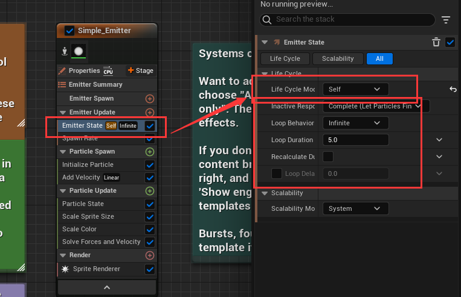

# Niagara

## 官方示例

从 epic 虚幻商城中下载官方示例项目，这个项目里面有很多 UE 提供的功能示例，其中就包括 Niagra 的示例

找到 `Simple_System` 文件，这个就是最简单的 Niagara 

Niagara 运作需要一系列脚本，包括蓝色、绿色、橙色三种

| 颜色 | 作用 |
| --- | --- |
| 蓝部分 | 它控制粒子系统的整个生命周期。系统生成控制系统生成的第一帧上发生的事情，系统更新是此后每一帧运行的逻辑。当数据从 system -> emitters -> particles 时，系统中的其他发射器和粒子都可以访问此处创建的属性 | 
| 橙色部分 | 橙色部分将对系统中的每个发射器执行。每个发射器都有一个类似的生成和更新脚本。这就是我们控制系统中每个单独发射器的生命周期的地方。我在循环吗？我只玩一次吗？我可以产生粒子吗？如果是，有多少？这些是发射器脚本试图回答的问题类型 |
| 绿色部分 | 绿色粒子脚本将为发射器中的每个单独粒子独立运行。粒子生命的第一帧为粒子繁殖，此后每帧都会更新粒子。在粒子生成和粒子更新中都有许多内置行为（称为模块），可以通过每个脚本标题旁边的彩色“+”框访问，也可以右键单击模块并选择 "insert above" 或 "insert below"|

### 尝试修改 Life Cycle Mode

以 `Emitter` 的 `Life Cycle Mode` 为例，在 `Simple_Emitter` 粒子发射器中，有一个 `Emitter State` 粒子状态，可以通过这个设置 `Life Cycle Mode` 粒子的生命循环模式：`System` 或者 `Self`

| Mode | 作用 | 样例 |
| --- | --- | --- |
| System | 跟随蓝色系统的 `System State` 中的 `Loop Behavior` 走 |  |
| Self | 自行设置生命周期，选择之后会多出一些设置选项 |  |

如果我们将 `Simple_System` 中 `System State` 的 `Loop Behavior` 设置为 `Once`， `Loop Duration` 设置为 1，可以得到如下效果

| 设置后 | 设置前 |
| --- | --- |
|  |  |

可以观察到，设置后的发射器跟着 System 的设置，在 1s 之后便不再发射例子

若此时，将 `Emitter State` 的 `Life Cycle Mode` 设置为 `Self`，并将 `Loop Behavior` 设置为 `Infinite` 就又能得到之前无限发射的效果了

为什么需要设置粒子发射器的 `Life Cycel Mode` 跟随 System 走呢？

`Emitter State` 的 `Life Cycle Mode` 是用来确定发射器的生命周期是由自身还是由所属的系统管理的

- 如果选择 `System`，那么发射器的循环、存在时间和消亡都会跟随系统的设置。这样做的好处是可以提高优化程度，避免不必要的计算和资源浪费

- 如果选择 `Self`，那么发射器可以独立控制自己的生命周期，可以设置不同的循环模式、循环时长、循环延迟和非活动响应。这样做的好处是可以增加灵活性和创造性，可以实现不同的效果

如果存在多个粒子发射器，并且生命周期相同，可以直接设置与 System 相同即可

那么如何创建粒子发射器呢？

直接在蓝图中**右键**即可创建粒子发射器

UE 提供一些粒子发射器的模板，可以自己尝试；同时也可以创建空的粒子发射器，自行设置

### 简单的 Sprite 粒子发射器（Sprite Emitter）

首先就是基于 Empty 模板创建一个发射器

分析表现效果，从起点发射粒子，粒子向上移动，并且粒子的大小会周期性变化(从大到小，再到大，最后变小)，粒子的透明度也会周期性变化

1. 发射粒子

在 `Emitter Update` 中添加 `Spawn Rate`

`SpawnRate` 可以配置每秒生成的粒子数目

Niagara 系统中 `Emitter Update` 是发射器组的一个阶段，它会在发射器被激活的每一帧中触发。`Emitter Update` 的触发频率取决于游戏的帧率，也就是每秒的帧数 (FPS)。一般来说，FPS 越高，`Emitter Update` 触发的频率就越高，反之亦然

`Emitter Update` 阶段的作用是更新发射器的状态和属性，比如位置、旋转、缩放、速度、加速度等。`Emitter Update` 阶段中的模块可以读取和写入发射器命名空间中的参数，也可以读取系统、引擎和用户命名空间中的参数。`Emitter Update` 阶段还可以创建和使用数据接口，从外部数据源中提供数据

2. 给粒子添加速度

在粒子生成(`Particle Spawn`)的时候添加速度，此时会出现上图右边的报错，这需要添加一个解算器，直接点击第一个 `Fix Issue` 即可

3. 设置粒子初始化信息

| 属性名 | 作用 |
| --- | --- | 
| Lifetime Mode | 粒子生命时间类型，随机或者指定 |
| Lifetime | 粒子生命时间 |
| Color Mode | 粒子颜色模式，不设置、指定颜色，随机颜色区间 |
| Position Mode | 粒子位置模式，可以不设置、指定绝对世界坐标、指定相对偏移 |
| Mass Mode | 粒子质量模式，可以不设置(默认值1)、指定质量、随机质量 |
| Sprite Size Mode | 粒子初始大小 |

> 这里例子中 `Sprite Size Mode` 需要设置一下，否则粒子太小了看不到

4. 设置粒子的大小周期性变化

因为粒子的渲染是 `Sprite`，所以设置 `Scale Sprite Size`

通过设置变化曲线，可以定义粒子的大小变化

5. 设置粒子的透明度周期性变化

通过添加 `Scale Color` 可以设置透明通道

 

通过上图的设置，可以将粒子的透明通道值变化通过曲线的方式来设置

### 简单的多边形发射器（Mesh Emitter）

> 5.2 的示例项目中表现效果并不相同

重点：**自定义属性**

初始化粒子不仅可以初始化简单的点属性（如 `lice cycle` 或 `color`），还可以初始化渲染器特定的属性（如 `mesh scale` 或 `sprite scale`）

在这个粒子中，我们初始化网格比例，以及该网格的初始方向，然后随着时间的推移更新这些初始值

1. 首先渲染部分需要设置成 `Mesh Render`

2. 初始化属性

设置初始大小和生命周期

3. 基本设置：`Spawn Rate`、`Add Velocity`

> 别忘了添加解算器

4. 设置 Mesh 的旋转

需要添加两个操作：`Initial Mesh Orientation` 和 `Update Mesh Orientation`，也就是初始化旋转和每帧更新旋转

在初始化 Mesh 的旋转角度时，设置朝向类型为 `Orient to Vector` 值为 `Velocity`，也就是朝向的方向

在每帧更新 Mesh 的旋转角度时，由于设置朝向为速度方向，所以 X 轴指向速度方向，因此如果想要 Mesh 自旋每帧修改 X 轴旋转即可

5. 修改 Mesh 的初始移动速度

当旋转角度设置完毕之后，我们可以得到一个类似 DNA 旋转的粒子特效

但是这个与我们目标的有些许差距，我们目标的粒子效果是粒子会摆动，就是如下图所示的效果

因此，粒子的初速度就不能是固定的 `(0, 0, 100)`，这个初速度需要叠加一个旋转方向

但是如何将计算的方向缓存下来呢？参考类会将一些数据做成**属性**，粒子系统也有**属性**

从上图可以看到粒子系统的属性，如果没看到需要点击 `System` 或者 `Emitter` 蓝图节点

属性中有一些带锁的属性用红框框出，这表示这些属性是系统提供的无需也无法设置

- `System Attributes` 就是系统属性，跟着 `System` 节点走 
- `Emitter Attributes` 就是粒子发射器属性，跟着 `Emitter` 节点走
- `Particle Attributes` 就是粒子互行，跟着 `Particle` 节点走

根据 `System`、`Emitter` 和 `Particle` 三者的关系，`System Attributes` 作用域最大，其次是`Emitter Attributes`，最后是`Particle Attributes`

回归到当前的目标，我们期望粒子的初速度能够随时间进行 `sin` 的变化，所以应该是在 `Emitter Attributes` 中创建变量存储一个根据时间变化的值，并且在粒子初始化的时候设置给速度

根据上面两步操作，在 `Emitter Attributes` 中创建了 `SineWave` 变量，并且在发射器的 `Update` 中设置其值随着 `Emitter` 的 `Age` 进行 `Sine` 计算变化，得到一个周期性变化的数值

最后就是在 `Particle Spawn` 的时候，设置其速度为 `Rotate Vector`

> `Rotate Vector`：Rotate a vector using Euler AnglesCompiled Name: Rotate Vector

给 `(0, 0, 100)` 的速度添加一个旋转

最后得到目标效果

