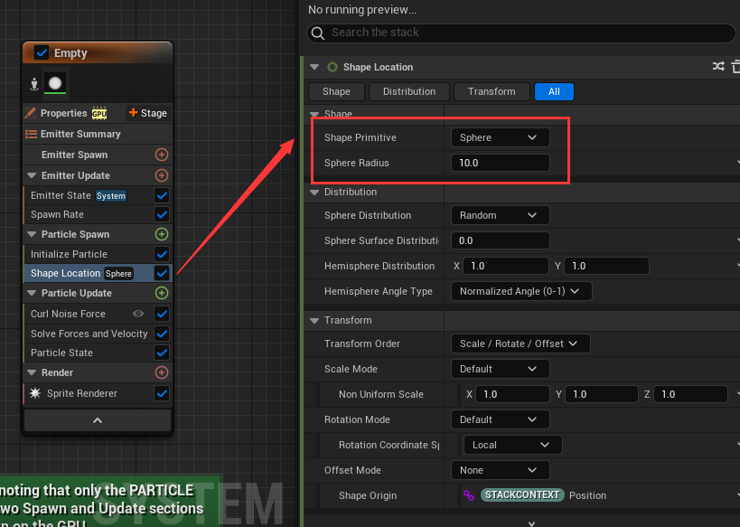

# Niagara

## 官方示例

从 epic 虚幻商城中下载官方示例项目，这个项目里面有很多 UE 提供的功能示例，其中就包括 Niagra 的示例

找到 `Simple_System` 文件，这个就是最简单的 Niagara 

Niagara 运作需要一系列脚本，包括蓝色、绿色、橙色三种

| 颜色 | 作用 |
| --- | --- |
| 蓝部分 | 它控制粒子系统的整个生命周期。系统生成控制系统生成的第一帧上发生的事情，系统更新是此后每一帧运行的逻辑。当数据从 system -> emitters -> particles 时，系统中的其他发射器和粒子都可以访问此处创建的属性 | 
| 橙色部分 | 橙色部分将对系统中的每个发射器执行。每个发射器都有一个类似的生成和更新脚本。这就是我们控制系统中每个单独发射器的生命周期的地方。我在循环吗？我只玩一次吗？我可以产生粒子吗？如果是，有多少？这些是发射器脚本试图回答的问题类型 |
| 绿色部分 | 绿色粒子脚本将为发射器中的每个单独粒子独立运行。粒子生命的第一帧为粒子繁殖，此后每帧都会更新粒子。在粒子生成和粒子更新中都有许多内置行为（称为模块），可以通过每个脚本标题旁边的彩色“+”框访问，也可以右键单击模块并选择 "insert above" 或 "insert below"|

### 尝试修改 Life Cycle Mode

以 `Emitter` 的 `Life Cycle Mode` 为例，在 `Simple_Emitter` 粒子发射器中，有一个 `Emitter State` 粒子状态，可以通过这个设置 `Life Cycle Mode` 粒子的生命循环模式：`System` 或者 `Self`

| Mode | 作用 | 样例 |
| --- | --- | --- |
| System | 跟随蓝色系统的 `System State` 中的 `Loop Behavior` 走 |  |
| Self | 自行设置生命周期，选择之后会多出一些设置选项 |  |

如果我们将 `Simple_System` 中 `System State` 的 `Loop Behavior` 设置为 `Once`， `Loop Duration` 设置为 1，可以得到如下效果

| 设置后 | 设置前 |
| --- | --- |
|  |  |

可以观察到，设置后的发射器跟着 System 的设置，在 1s 之后便不再发射例子

若此时，将 `Emitter State` 的 `Life Cycle Mode` 设置为 `Self`，并将 `Loop Behavior` 设置为 `Infinite` 就又能得到之前无限发射的效果了

为什么需要设置粒子发射器的 `Life Cycel Mode` 跟随 System 走呢？

`Emitter State` 的 `Life Cycle Mode` 是用来确定发射器的生命周期是由自身还是由所属的系统管理的

- 如果选择 `System`，那么发射器的循环、存在时间和消亡都会跟随系统的设置。这样做的好处是可以提高优化程度，避免不必要的计算和资源浪费

- 如果选择 `Self`，那么发射器可以独立控制自己的生命周期，可以设置不同的循环模式、循环时长、循环延迟和非活动响应。这样做的好处是可以增加灵活性和创造性，可以实现不同的效果

如果存在多个粒子发射器，并且生命周期相同，可以直接设置与 System 相同即可

那么如何创建粒子发射器呢？

直接在蓝图中**右键**即可创建粒子发射器

UE 提供一些粒子发射器的模板，可以自己尝试；同时也可以创建空的粒子发射器，自行设置

### 简单的 Sprite 粒子发射器（Sprite Emitter）

首先就是基于 Empty 模板创建一个发射器

分析表现效果，从起点发射粒子，粒子向上移动，并且粒子的大小会周期性变化(从大到小，再到大，最后变小)，粒子的透明度也会周期性变化

1. 发射粒子

在 `Emitter Update` 中添加 `Spawn Rate`

`SpawnRate` 可以配置每秒生成的粒子数目

Niagara 系统中 `Emitter Update` 是发射器组的一个阶段，它会在发射器被激活的每一帧中触发。`Emitter Update` 的触发频率取决于游戏的帧率，也就是每秒的帧数 (FPS)。一般来说，FPS 越高，`Emitter Update` 触发的频率就越高，反之亦然

`Emitter Update` 阶段的作用是更新发射器的状态和属性，比如位置、旋转、缩放、速度、加速度等。`Emitter Update` 阶段中的模块可以读取和写入发射器命名空间中的参数，也可以读取系统、引擎和用户命名空间中的参数。`Emitter Update` 阶段还可以创建和使用数据接口，从外部数据源中提供数据

2. 给粒子添加速度

在粒子生成(`Particle Spawn`)的时候添加速度，此时会出现上图右边的报错，这需要添加一个解算器，直接点击第一个 `Fix Issue` 即可

3. 设置粒子初始化信息

| 属性名 | 作用 |
| --- | --- | 
| Lifetime Mode | 粒子生命时间类型，随机或者指定 |
| Lifetime | 粒子生命时间 |
| Color Mode | 粒子颜色模式，不设置、指定颜色，随机颜色区间 |
| Position Mode | 粒子位置模式，可以不设置、指定绝对世界坐标、指定相对偏移 |
| Mass Mode | 粒子质量模式，可以不设置(默认值1)、指定质量、随机质量 |
| Sprite Size Mode | 粒子初始大小 |

> 这里例子中 `Sprite Size Mode` 需要设置一下，否则粒子太小了看不到

4. 设置粒子的大小周期性变化

因为粒子的渲染是 `Sprite`，所以设置 `Scale Sprite Size`

通过设置变化曲线，可以定义粒子的大小变化

5. 设置粒子的透明度周期性变化

通过添加 `Scale Color` 可以设置透明通道

 

通过上图的设置，可以将粒子的透明通道值变化通过曲线的方式来设置

### 简单的多边形发射器（Mesh Emitter）

> 5.2 的示例项目中表现效果并不相同

重点：**自定义属性**

初始化粒子不仅可以初始化简单的点属性（如 `lice cycle` 或 `color`），还可以初始化渲染器特定的属性（如 `mesh scale` 或 `sprite scale`）

在这个粒子中，我们初始化网格比例，以及该网格的初始方向，然后随着时间的推移更新这些初始值

1. 首先渲染部分需要设置成 `Mesh Render`

2. 初始化属性

设置初始大小和生命周期

3. 基本设置：`Spawn Rate`、`Add Velocity`

> 别忘了添加解算器

4. 设置 Mesh 的旋转

需要添加两个操作：`Initial Mesh Orientation` 和 `Update Mesh Orientation`，也就是初始化旋转和每帧更新旋转

在初始化 Mesh 的旋转角度时，设置朝向类型为 `Orient to Vector` 值为 `Velocity`，也就是朝向的方向

在每帧更新 Mesh 的旋转角度时，由于设置朝向为速度方向，所以 X 轴指向速度方向，因此如果想要 Mesh 自旋每帧修改 X 轴旋转即可

5. 修改 Mesh 的初始移动速度

当旋转角度设置完毕之后，我们可以得到一个类似 DNA 旋转的粒子特效

但是这个与我们目标的有些许差距，我们目标的粒子效果是粒子会摆动，就是如下图所示的效果

因此，粒子的初速度就不能是固定的 `(0, 0, 100)`，这个初速度需要叠加一个旋转方向

但是如何将计算的方向缓存下来呢？参考类会将一些数据做成**属性**，粒子系统也有**属性**

从上图可以看到粒子系统的属性，如果没看到需要点击 `System` 或者 `Emitter` 蓝图节点

属性中有一些带锁的属性用红框框出，这表示这些属性是系统提供的无需也无法设置

- `System Attributes` 就是系统属性，跟着 `System` 节点走 
- `Emitter Attributes` 就是粒子发射器属性，跟着 `Emitter` 节点走
- `Particle Attributes` 就是粒子互行，跟着 `Particle` 节点走

根据 `System`、`Emitter` 和 `Particle` 三者的关系，`System Attributes` 作用域最大，其次是`Emitter Attributes`，最后是`Particle Attributes`

回归到当前的目标，我们期望粒子的初速度能够随时间进行 `sin` 的变化，所以应该是在 `Emitter Attributes` 中创建变量存储一个根据时间变化的值，并且在粒子初始化的时候设置给速度

根据上面两步操作，在 `Emitter Attributes` 中创建了 `SineWave` 变量，并且在发射器的 `Update` 中设置其值随着 `Emitter` 的 `Age` 进行 `Sine` 计算变化，得到一个周期性变化的数值

最后就是在 `Particle Spawn` 的时候，设置其速度为 `Rotate Vector`

> `Rotate Vector`：Rotate a vector using Euler AnglesCompiled Name: Rotate Vector

给 `(0, 0, 100)` 的速度添加一个旋转

最后得到目标效果

### GPU 发射器

| 模拟方式 | 作用 | 优点 | 缺点 |
| --- | --- | --- | --- |
| CPU | CPU 模拟是指在 CPU 上执行粒子模拟的计算，然后将结果传递给 GPU 进行渲染 | CPU 模拟的优势是可以访问更多的数据源，比如角色的骨骼信息、碰撞检测、物理系统等 | CPU 模拟的缺点是性能较低，因为 CPU 的**并行能力**有限，而且 CPU 和 GPU 之间的数据传输会造成额外的开销 | 
| GPU | GPU 模拟是指在 GPU 上执行粒子模拟的计算和渲染，几乎不需要 CPU 的参与 | GPU 模拟的优势是性能较高，因为 GPU 的**并行能力**强，而且减少了 CPU 和 GPU 之间的数据传输 | GPU 模拟的缺点是数据访问受限，比如无法直接获取角色的骨骼信息、碰撞检测、物理系统等 |

大多数 Niagara 功能在 CPU 和 GPU 下都可以工作，但是有些功能的行为不同，比如 GPU 计算碰撞有更高的性能但是不太精准；某些渲染器，例如 `light renderer` 和 `ribbon renderer` 目前只能在 CPU 上处理

需要注意的是只有 `Particle` 脚本，也就是绿色部分在 GPU 上运行。 `System` 和 `Emitter` 脚本仅在 CPU 上执行，所以 `System` 和 `Emitter` 无法采样纹理或者查询场景距离场

使用 GPU 模拟的时候需要考虑设置 `Emitter` 的 `Fixed bounds`

`Fixed Bounds` 是一个用来限定粒子效果范围的矩形框，它由最小值和最大值两个三维向量定义。`Fixed Bounds` 的作用是告诉虚幻引擎，粒子效果不会超出这个矩形框，从而优化渲染性能和避免剔除错误

> 通过 `Bounds` 可以查看边界

GPU 模拟需要设置 `Fixed Bounds` 的原因是，由于粒子模拟是在 GPU 上完成的，系统无法获知效果的范围有多大。如果不设置 `Fixed Bounds`，系统会使用默认的边界，可能会导致粒子效果被错误地剔除或者不可见。因此，设置 `Fixed Bounds` 是 GPU 模拟的一个重要步骤，它可以保证粒子效果的正确显示和性能优化

除了 Niagara 之外，`Mesh` 也存在这样的包围盒，需要通过包围盒是否在视界中来判断是否需要渲染

通过设置可以显示出 Mesh 的边界，通过设置 `Mesh` 的 `Bounds Scale` 可以设置边界大小。如果角色移动速度过快，导致 Mesh 的包围盒与视口来不及计算会导致物体突然出现的 Bug，此时设置 `Bounds Scale` 更大即可

-----------

**如何切换 GPU 模拟 和 CPU 模拟**

需要关注一个配置那就是: `Determinism`，这个参数可以配置**真随机**和**伪随机**，值为 `False` 表示真随机

| 随机 | 作用 | 效果 |
| --- | --- | --- |
| 真随机 | 无法预测的随机事件或数值，它们不受任何规律或算法的影响 |  |
| 伪随机 | 看似随机实质固定的周期性序列，它们是由算法或函数根据一个初始值（种子）来生成的,伪随机的优点是可以快速、高效、**可重复地**产生随机数 |  |

从上面的表现来过，伪随机每次得到的表现效果相同，真随机每次表现都不相同

接下来要实现入上图所示的粒子效果

这里要用到一个重要的节点 `Curl Noise Force`

`Curl Noise Force` 是一个用来给粒子添加随机扰动力的模块，它可以模拟流体、烟雾、火焰等效果。`Curl Noise Force` 的原理是使用卷曲噪声场（`Curl Noise Field`）来计算粒子的加速度，卷曲噪声场是一种具有无散性和无旋性的噪声场，它可以避免粒子聚集或分散，保持流体的连续性

| 参数 | 作用 |
| --- | --- |
| Noise Frequency | 此参数决定卷曲噪声场的频率，值越大，噪声场的频率越高，粒子的扰动力越强 | 
| Noise Strength | 此参数决定卷曲噪声场的强度，值越大，粒子的加速度越大，运动越快 | 
| Pan Noise Field | 此参数决定卷曲噪声场是否随时间变化，值越大，噪声场的变化速度越快，粒子的运动越不规则 | 
| Randomization Vector | 此参数决定卷曲噪声场的随机向量，它会与随机种子相乘，影响噪声场的方向和形状 | 
| Random Seed | 此参数决定卷曲噪声场的随机种子，它会与随机向量相乘，影响噪声场的方向和形状 | 

`Curl Noise Force` 是一个向量场，就是所有的粒子都有一个特定的力的方向，只要在这个场的区域内

> 具体概念只能自行了解，解释不清…

因为生成粒子要在一个球形范围内，所以需要添加 `Shape Location`，表示在一个 `Shape` 的范围内生成

通过上图设置，粒子会在一个半径为 10 的球形范围内生成

| 添加前 | 添加后 |
| --- | --- |
|  |  |

由于单纯应用向量场导致最后粒子飘的过于散开，可以添加 `Drag` 节点来给粒子添加一个阻力

> 将**阻力**直接应用于粒子速度和/或旋转速度，而与**质量**无关

| 添加前 | 添加后 |
| --- | --- |
|  |  |

**生成粒子** 除了使用 `Spawn Rate` 之外还可以使用 `Spawn Burst Instantaneous` 来瞬间爆发性产生指定数量的粒子

上图表示在一开始第 0 秒的时候直接生成 3600 个粒子

最后给粒子添加上一个随时间变化的颜色曲线

此时得到的效果与目标效果还是存在一定差距，因为此时粒子最后会四散分开，而目标效果的粒子似乎被**某个点吸引**会有一个返回的效果

所以此时需要添加一个 `Point Attraction Force` 

`Point Attraction Force` 是一个用来给粒子添加一个指向某个点的吸引力的模块，它可以模拟重力、磁力、吸引或排斥等效果

| 属性 | 作用 |
| --- | --- | 
| Attraction Strength |  此参数决定吸引力的强度，值越大，粒子受到的吸引力越大，运动越快| 
| Attraction Radius |  此参数决定吸引力的有效半径，只有在这个半径内的粒子才会受到吸引力的影响| 
| Falloff Exponent |  可以调节粒子受到的吸引力的大小和分布，影响粒子的运动轨迹和形态。值越大，吸引力随着距离的增加而下降得越快，粒子越容易聚集在吸引点附近；值越小，吸引力随着距离的增加而下降得越慢，粒子越容易分散在吸引点周围| 
| Kill Radius |  用来限制粒子生存范围的属性，它表示粒子距离吸引点的最小距离，如果粒子进入这个距离内，就会被杀死，可以控制粒子的数量和分布，避免粒子过多或过密地聚集在吸引点附近，造成性能下降或视觉效果不佳 | 
| Attractor Position | 吸引的点的坐标 |
| Attractor Position Offset |  吸引的位置偏移 | 

最后就可以得到目标效果了

| 使用 CPU 模拟 | 使用 GPU 模拟 |
| --- | --- |
|  |  |
| 更新平均耗时 1.04ms | 更新平均耗时 0.04ms |

### 粒子贴图基础方向设置

使用 `Shape Location` 设置创建的 `Sprite` 在一个球形范围

生成的 `Sprite` 其实是一个面片，`Sprite` 会让自己始终面向玩家，所以上图的 `Sprite` 看起来像一个球，其实本质上是一个始终朝向相机的圆

从 `Sprite Render` 中 `Facing Mode` 的设置可见一斑，默认为 `Face Camera`

当我们将 `Facing Mode` 设置为 `Custom Facing Vector`，在 5.2 版本设置后 Sprite 仍会朝向相机，但是之前的版本不会

可以使用 `set new or exising parameter directly` 对粒子、发射器、系统的值进行设置修改

> 粒子系统的 `set new or exising parameter directly` 只能修改粒子相关的属性

在 `Particle Update` 中设置 `Sprite Facing` 为 `(1.0, 0, 0)`

通过设置 `Sprite` 的 `Facing Mode` 和 `Sprite Facing` 可以设置 `Sprite` 的朝向

