# Sequencer

## 简单使用

1. 创建 Level Sequencer

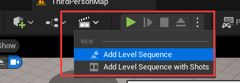

2. 添加 Camera Cuts

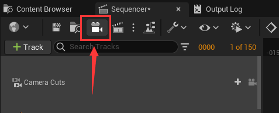

> 重复点击可以创建多个相机

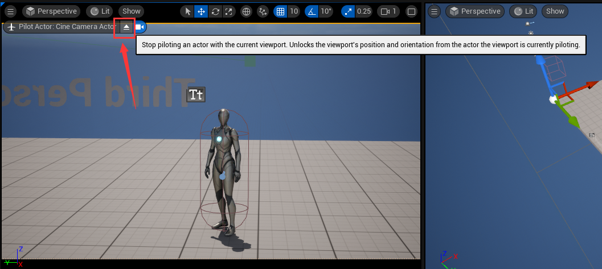

> 可以点击这个弹出按钮将当前窗口退回到场景浏览界面，取消相机绑定显示

3. 设置 Layout

| layout 设置 | 表现效果 |
| --- | --- |
| 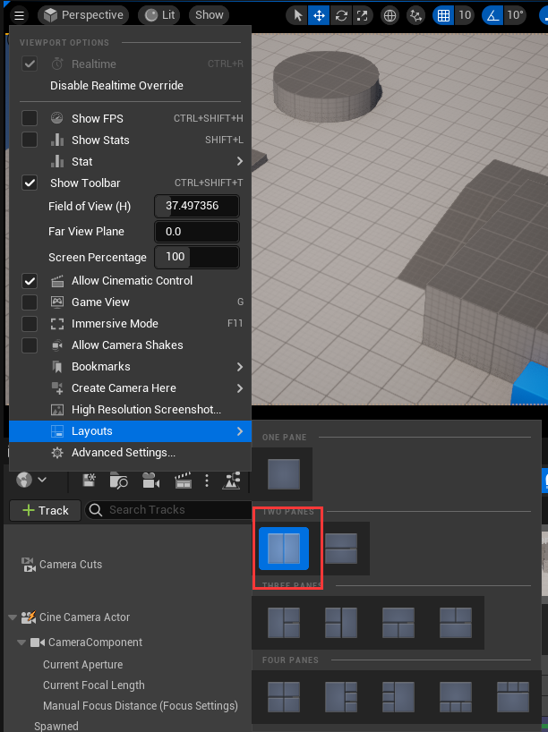 | 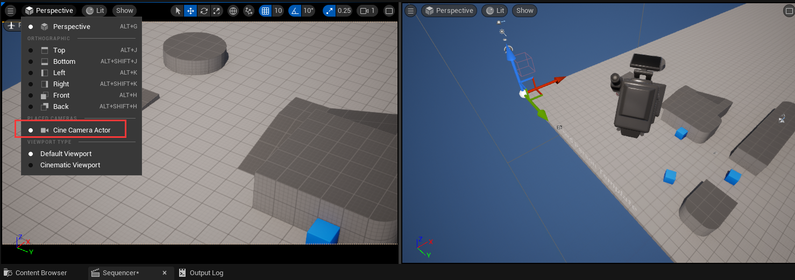 |

> 修改 layout 可以左边看相机表现效果 右边设置相机坐标场景物体等

4. key 帧

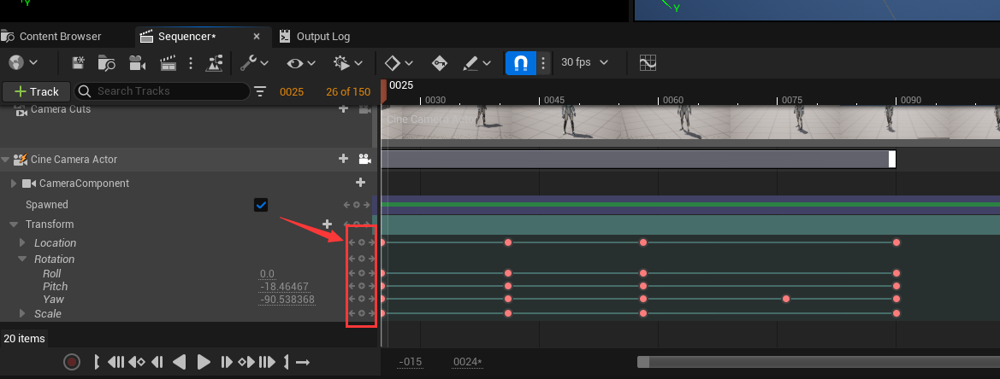

> 点击中间源泉可以添加关键帧

在目标帧设置当前状态后点击 key 帧

5. 时间轴上的一些东西

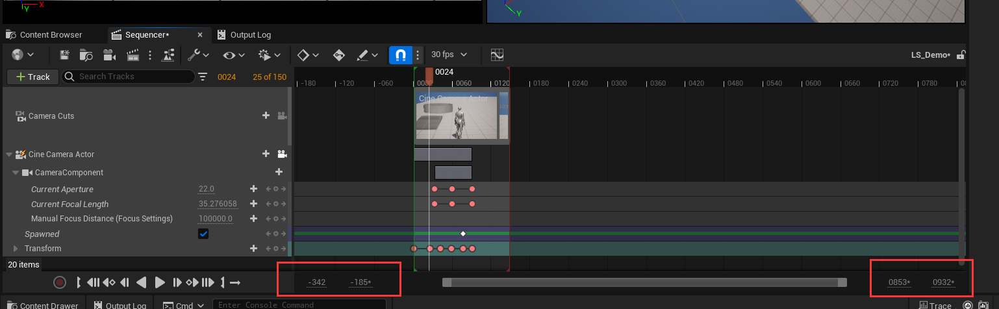

> 当前时间轴上显示的帧数范围  
> 双击具体数值之后可以直接设置值

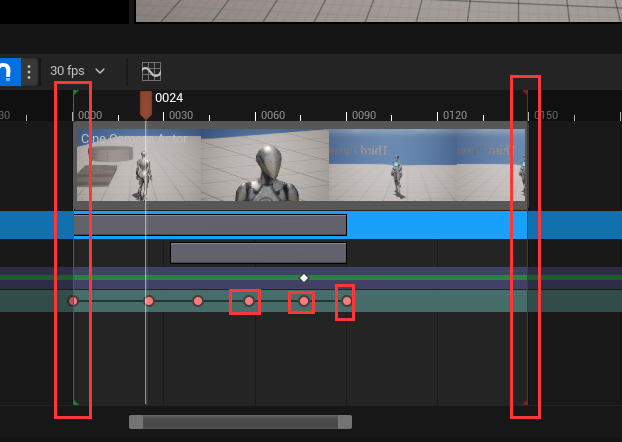

> 左边绿色的竖线表示开始帧
> 右边红色的数先表示结束帧
> 中间红色的点表示关键帧，指定对象在这一帧记录数据

6. 相机切换

在第1帧设置 `Camera Cuts` 相机切换 绑定的相机

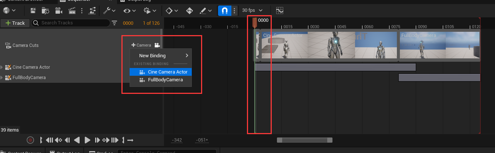

在第80帧设置 `Camera Cuts` 相机切换 绑定的相机

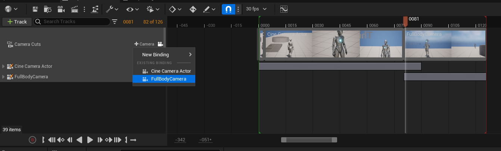

最后点击按钮将 `Camera Cuts` 锁定到视口中预览相机的表现效果

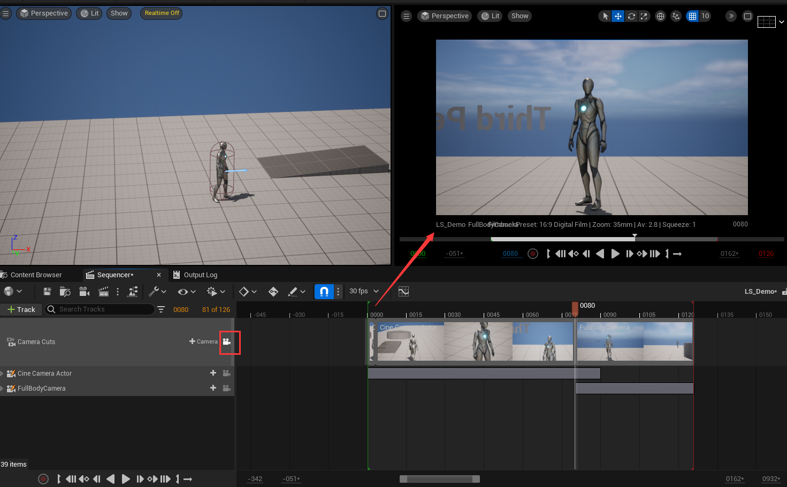

7. 渐变轨迹

添加渐变轨道到相机轨道中

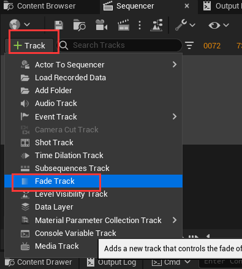

简单的黑幕过渡效果，通过设置渐变值显示黑幕的透明度

在合适的位置设置黑幕透明度并打上关键帧

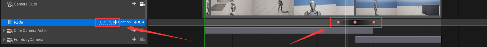

8. 玩家相机以相对坐标移动

很多时候我们想做的其实让相机以相对坐标移动，而不是绝对坐标移动

此时只需要给相机的 Transform 添加一个 Additive 的轨道即可

暂不清楚**Relative**与**Additive**的区别，尝试可行的解决方案是使用 **Additive**

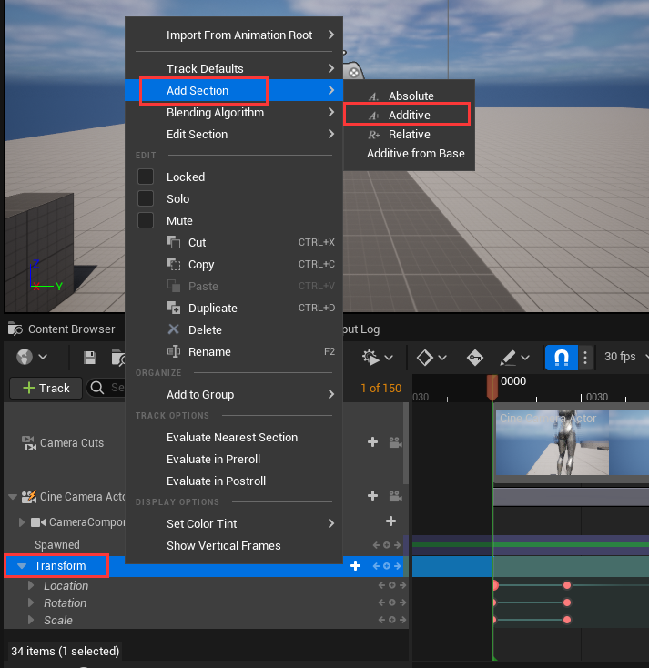

> 记得**删除**原绝对坐标的 Transform 的轨道，否则优先采用绝对坐标+相对坐标的位置

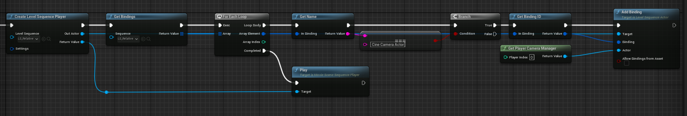

在创建 `Level Sequencer Player` 之后，通过资产和轨道的名称获得相机的轨道，然后将相机与玩家的相机进行绑定，从而达成玩家相机相对移动的功能

