## 打包源码

### 命令参数和命令执行

在 `UE 5.3.2` 中，通过搜索字符串 `Package this project` 这个 `Button Tip` 可以在 `TurnkeySupportModule.cpp` 的 1157 行看到按钮的绑定

```cpp
Section.AddMenuEntry(
NAME_None,
  LOCTEXT("Turnkey_PackageProject","Package Project"),
  LOCTEXT("TurnkeyTooltip_PackageProject","Package this project and archive it to a user-selected directory. This can then be used to install and run."),
  FSlateIcon(),
  FUIAction(
    FExecuteAction::CreateStatic(&FTurnkeySupportCallbacks::CookOrPackage, IniPlatformName, EPrepareContentMode::Package),
    FCanExecuteAction::CreateStatic(&FTurnkeySupportCallbacks::CanCookOrPackage, IniPlatformName, EPrepareContentMode::Package)
  )
);
```

得到 `Package` 的执行函数为 `FTurnkeySupportCallbacks::CookOrPackage` 传入当前平台的名字 和 打包枚举，在函数中通过一系列的判断添加多种参数到 `CommandLine` 字符串中

> 虽然大多数时间都是在拼 `TurnkeyParams`  和 `BuildCookRunParams`

```cpp
FString TurnkeyParams =FString::Printf(TEXT("-command=VerifySdk -platform=%s -UpdateIfNeeded %s"),*UBTPlatformString,*ITurnkeyIOModule::Get().GetUATParams());
if(!ProjectPath.IsEmpty())
{
	TurnkeyParams.Appendf(TEXT(" -project=\"%s\""),*ProjectPath);
}

FString CommandLine;
if(!ProjectPath.IsEmpty())
{
	CommandLine.Appendf(TEXT(" -ScriptsForProject=\"%s\" "),*ProjectPath);
}
CommandLine.Appendf(TEXT("Turnkey %s BuildCookRun %s"),*TurnkeyParams,*BuildCookRunParams);

FTurnkeyEditorSupport::RunUAT(CommandLine, PlatformInfo->DisplayName, ContentPrepDescription, ContentPrepTaskName, ContentPrepIcon,&AnalyticsParamArray);
```

当拼凑出 `CommandLine` 之后送到 `RunUAT` 中执行，打包安卓时 `CommandLine` 内容如下

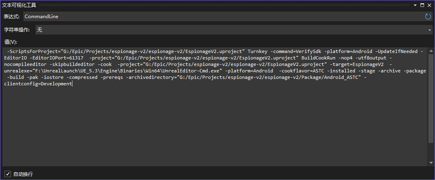

```cpp
void FTurnkeyEditorSupport::RunUAT(const FString& CommandLine,const FText& PlatformDisplayName,const FText& TaskName,const FText& TaskShortName,const FSlateBrush* TaskIcon,const TArray<FAnalyticsEventAttribute>* OptionalAnalyticsParamArray, TFunction<void(FString,double)> ResultCallback)
{
#ifWITH_EDITOR
	IUATHelperModule::Get().CreateUatTask(CommandLine, PlatformDisplayName, TaskName, TaskShortName, TaskIcon, OptionalAnalyticsParamArray, ResultCallback);
#else
	unimplemented();
#endif
}
```


通过 `CreateUatTask` 创建任务

```cpp
FString FSerializedUATProcess::GetUATPath()
{
#ifPLATFORM_WINDOWS
	FString RunUATScriptName =TEXT("RunUAT.bat");
#elifPLATFORM_LINUX
	FString RunUATScriptName =TEXT("RunUAT.sh");
#else
	FString RunUATScriptName =TEXT("RunUAT.command");
#endif

	returnFPaths::ConvertRelativePathToFull(FPaths::EngineDir()/TEXT("Build/BatchFiles")/ RunUATScriptName);
}
```

首先通过 `FileExists` 来检查是否存在 `RunUAT.bat` 这个文件(以 `Windows` 平台为例) 如果存在 `RunUAT.bat` 文件，则创建一个 `FSerializedUATProcess` 对象

```cpp
TSharedPtr<FSerializedUATProcess> UatProcess =MakeShareable(newFSerializedUATProcess(CommandLine));
```

`FSerializedUATProcess` 的构造函数如下，该对象存储着 `URL` 和 `Params`

```cpp
FSerializedUATProcess::FSerializedUATProcess(const FString& RunUATCommandline)
	// we will modify URL and Params in this constructor, so there's no need to pass anything up to base
	:FMonitoredProcess("","",true,true)
{
	// replace the URL and Params freom base with the shelled version

#ifPLATFORM_WINDOWS
	URL =TEXT("cmd.exe");
	Params = FString::Printf(TEXT("/c \"\"%s\" %s\""),*GetUATPath(),*RunUATCommandline);
#elif PLATFORM_MAC || PLATFORM_LINUX
	URL =TEXT("/usr/bin/env");
	Params = FString::Printf(TEXT(" -- \"%s\" %s"),*GetUATPath(),*RunUATCommandline);
#endif

	static bool bHasSetupDelegate =false;
	if(!bHasSetupDelegate)
	{
		bHasSetupDelegate =true;
		FCoreDelegates::OnShutdownAfterError.AddStatic(&CancelQueue);
		FCoreDelegates::OnExit.AddStatic(&CancelQueue);
	}
}
```

`FSerializedUATProcess` 除了绑定命令和参数之外，还提供各种事件

```cpp
// Holds a delegate that is executed when the process has been canceled. */
FSimpleDelegate CanceledDelegate;

// Holds a delegate that is executed when a monitored process completed. */
FOnMonitoredProcessCompleted CompletedDelegate;

// Holds a delegate that is executed when a monitored process produces output. */
FOnMonitoredProcessOutput OutputDelegate;

// Holds a delegate that is executed when the process fails to launch (delayed, in a thread). Used in place of the return value
// of Launch in the parent class, since it's async
FSimpleDelegate LaunchFailedDelegate;
```

所以在 `CreateUatTask` 方法中，创建了 `FSerializedUATProcess` 对象之后立刻绑定了这些方法，用于对外显示信息

然后就是直接运行

```cpp
UatProcess->Launch();
```

由于 `FSerializedUAProcess` 继承自 `FMonitoredProcess`，而 `FMonitoredProcess` 继承自 `FRunnable`, `FSingleThreadRunnable`，所以 `FSerializedUAProcess` 对象是可以通过 `FRunnableThread::create` 创建出一个线程出来的

继承结构说明完毕，查看 `FSerializedUATProcess::Launch` 方法可以发现，在做完条件判断之后还是执行的`FSerializedUATProcess::LaunchInternal`

而在 `FSerializedUATProcess::LaunchInternal` 方法中绑定完各种事件之后，执行了 `FMonitoredProcess::Launch`，也就是父类的 `Launch` 方法

```cpp
// 执行父类的 Launch，如果失败发送 LaunchFailedDeletate 事件
if(FMonitoredProcess::Launch()==false)
{
	LaunchFailedDelegate.ExecuteIfBound();
	LaunchNext();
}
```

在 `FMonitoredProcess::Launch` 中

1. 执行命令 `cmd RunUAt.bat .....`

```cpp
ProcessHandle =FPlatformProcess::CreateProc(*URL,*Params,false, Hidden, Hidden,nullptr,0,*WorkingDir, WritePipe, ReadPipe);
```

2. 创建线程，监听 `ProcessHandle` 的状态，在 `Tick` 方法中根据情况触发不同的方法，在 `Tick` 中判断条件后会执行 `TickInternal`

```cpp
voidFMonitoredProcess::TickInternal()
{
	// 获取命令行输出，触发 OutputDelegate 事件，传递输出内容
	ProcessOutput(FPlatformProcess::ReadPipe(ReadPipe));

	if(Canceling)
	{
		// 通过关闭按钮主动关闭
		FPlatformProcess::TerminateProc(ProcessHandle, KillTree);
		CanceledDelegate.ExecuteIfBound();
		bIsRunning =false;
	}
	else if(!FPlatformProcess::IsProcRunning(ProcessHandle))
	{
		// 命令行执行完毕
		EndTime =FDateTime::UtcNow();

		// close output pipes
		FPlatformProcess::ClosePipe(ReadPipe, WritePipe);
		ReadPipe = WritePipe = nullptr;

		// get completion status
		if(!FPlatformProcess::GetProcReturnCode(ProcessHandle,&ReturnCode))
		{
			ReturnCode =-1;
		}

		CompletedDelegate.ExecuteIfBound(ReturnCode);
		bIsRunning =false;
	}
}
```


### CookOrPackage 执行流程

上面大致讲解了一下点击 `Package` 按钮之后的到真正执行脚本之前的代码执行流程

关于执行脚本的参数大多是在 `CookOrPackage` 函数中设置的

首先通过 `Package` 点击按钮会传入目标打包平台 `IniPlatformName` ，以安卓为例 `IniPlatformName = Android` , 通过 `FindPlatformInfo` 查找平台相关信息 ，这里的 `AllPlatformInfoArray` 中包含所有的注册进来的平台信息

```cpp
const FTargetPlatformInfo*FindPlatformInfo(const FName& InPlatformName)
{
	checkf(AllPlatformInfoArray.Num()>0,TEXT("Querying for TargetPlatformInfo objects before they are ready!"));

	for(const FTargetPlatformInfo* PlatformInfo : AllPlatformInfoArray)
	{
		if(PlatformInfo->Name == InPlatformName)
		{
			return PlatformInfo;
		}
	}

	return nullptr;
}
```

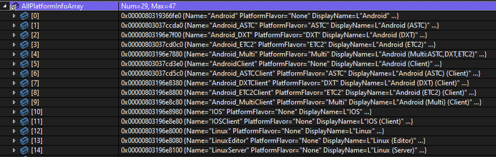


顺便一提， `Android` 中有 `Android_ASTC`、`Android_DXT`、`Android_ETC2`，不同的 `Android` 设备支持不同的纹理压缩标准，因此 `Unreal Engine` 提供了多种平台风味（`PlatformFlavor`），以确保开发者可以为目标设备提供最优化的资源

| 格式，或者称为 PlatformFlavor | 含义                                                                                                                                                               |
| ----------------------------- | ------------------------------------------------------------------------------------------------------------------------------------------------------------------ |
| ASTC                          | 这是一种更高级的纹理压缩格式，提供了更高的压缩比和更好的图像质量。ASTC 支持多种维度和位率，使得开发者可以更灵活地选择平衡图像质量和性能。                          |
| DXT                           | DXT（也被称为 S3TC，即 S3 Texture Compression）是一种主要用于 DirectX 技术（因此得名 "DX"）的纹理压缩格式。这种格式主要用于 NVIDIA 和其他支持 DirectX 的图形硬件。 |
| ETC2                          | 是 ETC1 的升级版，支持完全向后兼容 ETC1，并且新增了对透明纹理的支持。它成为了 OpenGL ES 3.0 和更高版本的标准。                                                     |
| ETC1                          | 是一个早期的开放标准纹理格式，广泛支持在旧的 Android 设备上。它只支持不透明的纹理压缩，不支持透明通道。                                                            |

得到 `PlatformInfo` 之后，通过会检查平台支持，也就是环境是否配置成功

如果指定平台检查检查完毕，首先就是 `FTurnkeyEditorSupport::SaveAll` 保存所有的资产

```cpp
FString BuildCookRunParams =FString::Printf(TEXT("-nop4 -utf8output %s -cook "),GetUATCompilationFlags());
```

> `GetUATCompilationFlags` 返回的字符串是固定的 `"-nocompileeditor -skipbuildeditor"` 表示不要编辑 `Editor` 模块

* `-nop4` 不使用 `Perforce` 版本控制
* `-utf8output` 输出采用 UTF-8 编码
* `-cook` UAT 要执行 `cook` 操作

```cpp
BuildCookRunParams +=FString::Printf(TEXT(" -project=\"%s\""),*ProjectPath);
```

* -project 设置项目路径，例如 E:/UEProj/Empty53/Empty53.uproject

```cpp
bool bIsProjectBuildTarget =false;
const FTargetInfo* BuildTargetInfo = PlatformsSettings->GetBuildTargetInfoForPlatform(IniPlatformName, bIsProjectBuildTarget);

// Only add the -Target=... argument for code projects. Content projects will return UnrealGame/UnrealClient/UnrealServer here, but
// may need a temporary target generated to enable/disable plugins. Specifying -Target in these cases will cause packaging to fail,
// since it'll have a different name.
if(BuildTargetInfo && bIsProjectBuildTarget)
{
	BuildCookRunParams +=FString::Printf(TEXT(" -target=%s"),*BuildTargetInfo->Name);
}
```

* `-target` 设置打包目标

这里解释一下 target 如何获取的， 通过 PlatformsSettings->GetBuildTargetInfoForPlatform  跟入 FindBestTargetInfo函数，会发现 TargetsRef就是当前项目所包含的模块，从中找到 Type 为 Game 或者 Client 的模块并返回

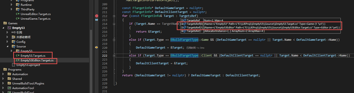


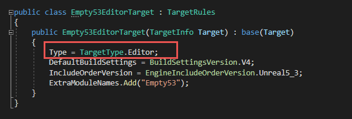


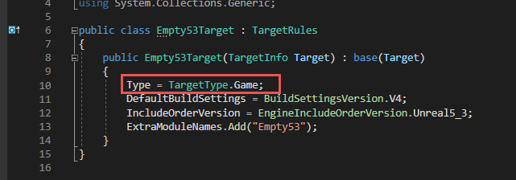


所以，这里 `-target=Empty53`，`Empty53` 就是我们的打包目标

```cpp
BuildCookRunParams +=FString::Printf(TEXT(" %s"),*FTurnkeyEditorSupport::GetUATOptions());

FString FTurnkeyEditorSupport::GetUATOptions()
{
#ifWITH_EDITOR
	FString Options;
	Options +=FString::Printf(TEXT(" -unrealexe=\"%s\""),*FUnrealEdMisc::Get().GetExecutableForCommandlets());

	return Options;
#else
	return TEXT("");
#endif
}
```

* `-unrealexe` 指定 `Unreal` 的执行程序路径，例如 `E:\UEEngine\UE_5.3\Engine\Binaries\Win64\UnrealEditor-Cmd.exe`

需要注意，在编辑器模式下才会这段参数，非编辑器模式下没有，可能是编辑器模式下要做一些特殊的事情

```cpp
BuildCookRunParams +=FString::Printf(TEXT(" -platform=%s"),*UBTPlatformString);
```

* `-platform` 指定平台，例如 `Android`、`Mac`、`Linux`、`Win64` 等

```cpp
if(!PlatformInfo->UATCommandLine.IsEmpty())
{
	BuildCookRunParams +=FString::Printf(TEXT(" %s"),*PlatformInfo->UATCommandLine);
}
```

根据是 `PlatformFlavor` (平台风味) 添加额外的参数命令，比如 `-cookflavor=ASTC`

> 还记得前面提到过 `ASTC` 是什么吗？在这里指定了


```cpp
if(FDerivedDataCacheInterface* DDC =TryGetDerivedDataCache())
{
	const TCHAR* GraphName = DDC->GetGraphName();
	if(FCString::Strcmp(GraphName, DDC->GetDefaultGraphName()))
	{
		BuildCookRunParams +=FString::Printf(TEXT(" -DDC=%s"), DDC->GetGraphName());
	}
}
```

`DDC` 是 `FDerivedDataCacheInterface` 的简称，用于存储和检索从资产或源数据派生的各种类型的缓存数据。这包括纹理压缩、着色器编译和其他可能需要大量计算的处理结果。`DDC` 可以显著提高项目的加载和构建速度，因为它允许系统重用先前计算的结果，而不是在每次构建时重新计算

> `FCString::Strcmp(GraphName, DDC->GetDefaultGraphName())` 如果 DDC 的 Graph 名称和默认名称相同，表示没有 Graph，也就不用设置

```cpp
if(FApp::IsEngineInstalled())
{
	BuildCookRunParams +=TEXT(" -installed");
}
```

* `-installed` 表示引擎的安装方式，是源码版还是非源码版

安装版的引擎中 `Engine/Build/InstalledBuild.txt` 文件存在，而源码版引擎中的是 `Engine/Build/SourceDistribution.txt`

> 通过文件是否存在判断是安装包还是源码版引擎

```cpp
if(PackagingSettings->bUseZenStore)
{
#ifWITH_EDITOR && UE_WITH_ZEN
	static UE::Zen::FScopeZenService TurnkeyStaticZenService;
#endif
	BuildCookRunParams +=TEXT(" -zenstore");
}
```

`ZenStore` 是一个较新的特性，它是 `Epic Games` 开发的数据存储和缓存解决方案，主要目标是提高大型游戏项目的数据处理和资源管理效率

随后会根据 `Package` 还是 `CookOnly` 进入不同的条件判断，后续以 `Package` 为例

```cpp
if(!FDesktopPlatformModule::Get()->OpenDirectoryDialog(FSlateApplication::Get().FindBestParentWindowHandleForDialogs(nullptr),LOCTEXT("PackageDirectoryDialogTitle","Package project...").ToString(), PlatformsSettings->StagingDirectory.Path, OutFolderName))
{
	return;
}

PlatformsSettings->StagingDirectory.Path = OutFolderName;
```

> 保存打包路径

```cpp
BuildCookRunParams +=TEXT(" -stage -archive -package");

if(ShouldBuildProject(PackagingSettings, TargetPlatform))
{
	BuildCookRunParams +=TEXT(" -build");
}

if(PackagingSettings->FullRebuild)
{
	BuildCookRunParams +=TEXT(" -clean");
}
```

根据预设的打包配置 `PackagingSettings` 添加不同的参数

```cpp
// Pak file(s) must be used when using container file(s)
if(PackagingSettings->UsePakFile || PackagingSettings->bUseIoStore)
{
	BuildCookRunParams +=TEXT(" -pak");
	if(PackagingSettings->bUseIoStore)
	{
		BuildCookRunParams +=TEXT(" -iostore");
	}

	if(PackagingSettings->bCompressed)
	{
		BuildCookRunParams +=TEXT(" -compressed");
	}
}
```

`Pak` 文件是一种封装游戏数据的容器，用于内容的优化加载

* `-compressed` 表示在打包过程中使用压缩来减少 `Pak` 文件的大小
* `-iostore` 是一个高性能的资产存储解决方案，用于改进大规模项目的数据包管理

关于 `ZenStore` 和 `IoStore`

| 目的不同     | ZenStore 更侧重于资产的存储和版本管理，而 IoStore 关注的是优化游戏内容的打包和快速加载。                                               |
| ------------ | -------------------------------------------------------------------------------------------------------------------------------------- |
| 使用阶段不同 | ZenStore 在游戏开发过程中被广泛使用，尤其是在资产创建和管理阶段；而 IoStore 主要在游戏打包和发布阶段发挥作用，优化最终用户的加载体验。 |
| 功能焦点不同 | ZenStore 提供了复杂的版本控制和团队协作工具；IoStore 则提供了高效的数据存储格式和加载机制，用于实现快速的数据访问。                    |

```cpp
if(PackagingSettings->IncludePrerequisites)
{
	BuildCookRunParams +=TEXT(" -prereqs");
}
```

* `-prereqs` 用于包含运行游戏所必需的预先安装的软件或组件

> 如果存在本地预先安装的软件或组件，可以通过 -applocaldirectory 添加

```cpp
BuildCookRunParams +=FString::Printf(TEXT(" -archivedirectory=\"%s\""),*PlatformsSettings->StagingDirectory.Path);
```

* `-archivedirectory` 打包输出路径，就是点击打包按钮弹出的文件夹选择的路径


```cpp
if(PackagingSettings->bGenerateChunks)
{
	BuildCookRunParams +=TEXT(" -manifests");
}
```

* `-manifests` 用于生成描述文件，些文件通常用于描述包含在各个分块中的内容，支持按需加载等功能

```cpp
if(BuildTargetInfo)
{
	if(BuildTargetInfo->Type == EBuildTargetType::Client)
	{
		BuildCookRunParams +=FString::Printf(TEXT(" -client -clientconfig=%s"),LexToString(ConfigurationInfo.Configuration));
	}
	elseif(BuildTargetInfo->Type == EBuildTargetType::Server)
	{
		BuildCookRunParams +=FString::Printf(TEXT(" -server -noclient -serverconfig=%s"),LexToString(ConfigurationInfo.Configuration));
	}
	else
	{
		BuildCookRunParams +=FString::Printf(TEXT(" -clientconfig=%s"),LexToString(ConfigurationInfo.Configuration));
	}
}

if(ConfigurationInfo.Configuration == EBuildConfiguration::Shipping &&!PackagingSettings->IncludeDebugFiles)
{
	BuildCookRunParams +=TEXT(" -nodebuginfo");
}
```

根据 `BuildTargetInfo` 选择性添加 `-client`、`-server`

根据 `EBuildConfiguration` 打包设定，设置 `-clientconfig` 或者 `-serverconfig`， 例如 `Development`、`Shipping` 、`DebugGame` 等

如果是 `Shipping` 或者没有 `Debug` 文件，则添加  `-nodebuginfo`

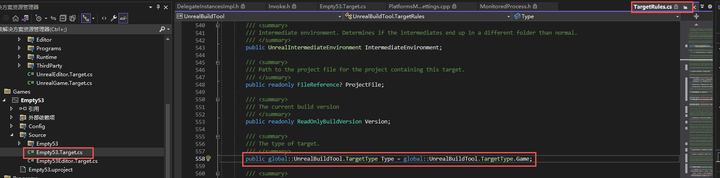


> BuildTargetInfo 中的 Type 在模块的 .build.cs 文件中设置，在基类 TargetRoles中默认配置为 Game

```cpp
FString TurnkeyParams =FString::Printf(TEXT("-command=VerifySdk -platform=%s -UpdateIfNeeded %s"),*UBTPlatformString,*ITurnkeyIOModule::Get().GetUATParams());
if(!ProjectPath.IsEmpty())
{
	TurnkeyParams.Appendf(TEXT(" -project=\"%s\""),*ProjectPath);
}

FString CommandLine;
if(!ProjectPath.IsEmpty())
{
	CommandLine.Appendf(TEXT(" -ScriptsForProject=\"%s\" "),*ProjectPath);
}
CommandLine.Appendf(TEXT("Turnkey %s BuildCookRun %s"),*TurnkeyParams,*BuildCookRunParams);
```

最终将 `TunKeyParams` 和 `BuildCookRunParams` 组合成要执行的命令行参数

> `Turnkey` 是 `Epic Games` 提供的一个用于简化游戏开发和分发流程的工具。它旨在为游戏开发者提供一个一站式的解决方案，以便更便捷地管理多平台部署、SDK 验证、外部设备交互和其他常见的开发任务

## 关于 RunUAT

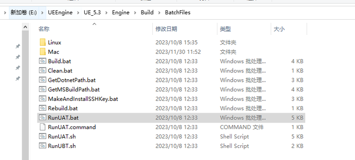


脚本内容大致可以分成几个部分

1. 初始化和环境设置

```bash
set DRIVE_LETTER=%~d0
FOR%%Z IN (A B C D E F G H I J K L M N O P Q R S T U V W X Y Z)DO(
	IF/I %DRIVE_LETTER%==%%Z: SET DRIVE_LETTER=%%Z:
)

set SCRIPT_DIR=%DRIVE_LETTER%%~p0
set UATExecutable=AutomationTool.dll
set UATDirectory=Binaries\DotNET\AutomationTool
```

设置 `DRIV_LETER` 为当前磁盘盘符的字母大写，设置执行路径

2. 清除 Visual Studio 和其他可能影响 AutomationTool 执行的环境变量

```bash
rem Unset some env vars that are set when running from VisualStudio that can cause it to look outside of the bundled .net
set VisualStudioDir=
set VSSKUEDITION=
rem Unset some others that don't cause errors, but could cause subtle differences between in-VS runs vs out-of-VS runs
set PkgDefApplicationConfigFile=
set VSAPPIDDIR=
set VisualStudioEdition=
set VisualStudioVersion=
```

3. 解析部分参数

```bash
set MSBUILD_LOGLEVEL=quiet
set FORCECOMPILE_UAT=
set NOCOMPILE_UAT=0
set SET_TURNKEY_VARIABLES=1

rem ## Check for any arguments handled by this script, being sensitive to any characters that are treated as delimiters by cmd.exe.
:ParseArguments
set ARGUMENT=%1
if not defined ARGUMENT goto ParseArguments_Done
set ARGUMENT=%ARGUMENT:"=%
if /I "%ARGUMENT%" == "-msbuild-verbose" set MSBUILD_LOGLEVEL=normal
if /I "%ARGUMENT%" == "-compile" set FORCECOMPILE_UAT=FORCE
if /I "%ARGUMENT%" == "-nocompileuat" set NOCOMPILE_UAT=1
if /I "%ARGUMENT%" == "-noturnkeyvariables" set SET_TURNKEY_VARIABLES=0
shift
```

4. 通过执行 `GetDotnetPath.bat` 检查 Dotnet 环境

```bash
rem ## Verify that dotnet is present
call "%SCRIPT_DIR%GetDotnetPath.bat"
if errorlevel 1 goto Error_NoDotnetSDK
```

5. 编译和运行条件判断

* 根据条件判断是否需要编译 `AutomationTool`，或直接使用预编译版本。
* 如果源代码存在，则调用 `BuildUAT.bat` 进行编译；如果编译失败，则报错退出。


```bash
rem ## Use the pre-compiled UAT scripts if -nocompile is specified in the command line
if%NOCOMPILE_UAT%==1 goto RunPrecompiled

rem ## If we're running in an installed build, default to precompiled
if exist Build\InstalledBuild.txt goto RunPrecompiled

rem ## check for force precompiled
if not "%ForcePrecompiledUAT%"=="" goto RunPrecompiled

rem ## check if the UAT projects are present. if not, we'll just use the precompiled ones.
if not exist Source\Programs\AutomationTool\AutomationTool.csproj goto RunPrecompiled
if not exist Source\Programs\AutomationToolLauncher\AutomationToolLauncher.csproj goto RunPrecompiled

call "%SCRIPT_DIR%BuildUAT.bat"%MSBUILD_LOGLEVEL% %FORCECOMPILE_UAT%
if errorlevel 1 goto Error_UATCompileFailed
```

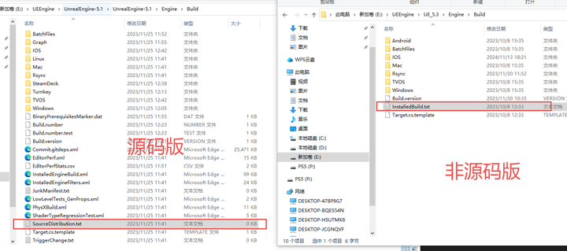


> 关于 `Build\InstalledBuild.txt` 文件，源码版和非源码版的对比 ，非源码版中存在 `InstalledBuild.txt`，但是源码版中没有，反而多了一个 `SourceDistribution.txt` 的空文件

> `InstalledBuild.txt` 的内容是当前引擎版本，比如 `UE_5.3`

6. 通过 `dotnet` 运行 `AutomationTool`

* 使用 `dotnet` 命令执行 `AutomationTool.dll`
* 检查 `AutomationTool` 执行后的返回值，如果执行失败，则处理错误

```bash
:DoRunUAT
pushd%UATDirectory%
dotnet %UATExecutable% %*
popd
```

> `%*` 代表了命令行上的所有参数。通常用于将接收到的所有参数传递给另一个命令或程序

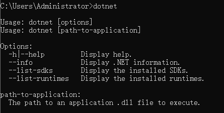


7. 环境变量更新

如果 `Turnkey` 相关的脚本存在，则更新环境变量

```bash
if%SET_TURNKEY_VARIABLES% == 0 goto SkipTurnkey

rem ## Turnkey needs to update env vars in the calling process so that if it is run multiple times the Sdk env var changes are in effect
if EXIST "%SCRIPT_DIR%..\..\Intermediate\Turnkey\PostTurnkeyVariables.bat"(
	rem ## We need to endlocal so that the vars in the batch file work. NOTE: Working directory from pushd will be UNDONE here, but since we are about to quit, it's okay. UAT errorlevel is preserved beyond the endlocal
	endlocal & set RUNUAT_ERRORLEVEL=%RUNUAT_ERRORLEVEL%
	echo Updating environment variables set by a Turnkey sub-process
	call "%SCRIPT_DIR%..\..\Intermediate\Turnkey\PostTurnkeyVariables.bat"
	del"%SCRIPT_DIR%..\..\Intermediate\Turnkey\PostTurnkeyVariables.bat"
	rem ## setlocal again so that any popd's etc don't have an effect on calling process
	setlocal
)
```

通过上述步骤分析，可以发现这个 `RunUAT.bat` 脚本本质上起到的作用就是设置环境变量、选择 `AutomationTool`、参数转发给 `AutomationTool`

> 在 `RunUAT.bat` 中并不包含真正的执行过程

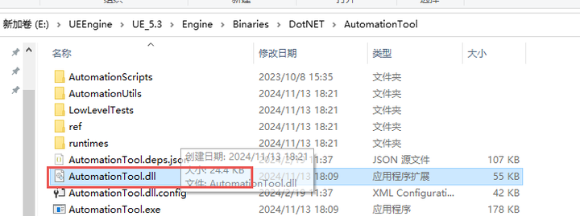


## 关于 AutomationTool

### 调试 AutomationTool

在源码版引擎中选择 `AutomationTool` 项目作为启动项，设置之前打包时找到的命令行参数，因为 `RunUAT.bat` 的参数被直接转发到 `AutomationTool` 中了，所以可以直接使用

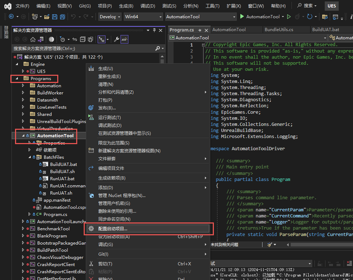

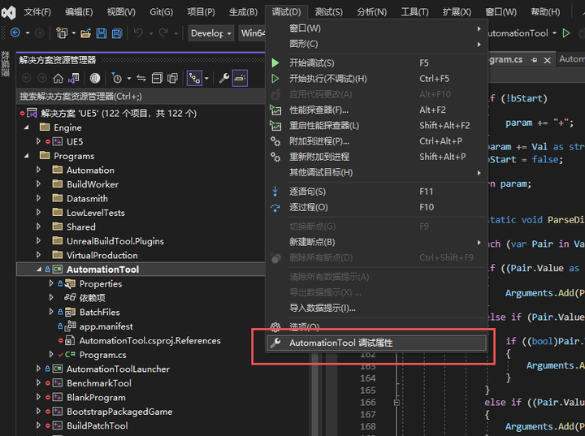

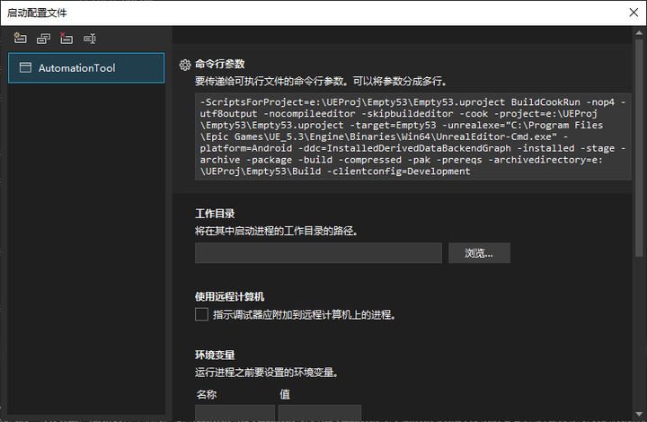

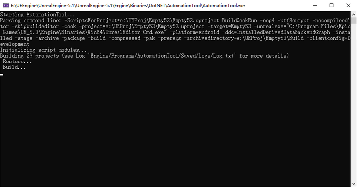

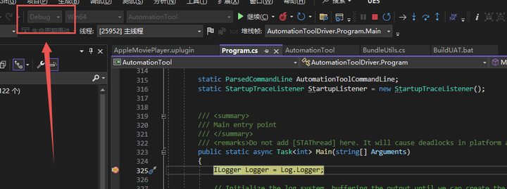

> 设置为 `Debug` 模式，可以断点调试

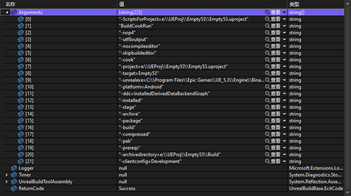

### 解析 AutomationTool

在 `Program.cs` 文件的 `Main` 函数中

1. 对参数进行了解析 `ParseCommandLine`
2. 创建 `Log` 对象，并对其进行设置
3. 根据解析后的参数 `AutomationToolCommandLine` 进行一些处理：日志编码、日志等级
4. `MainProc`

```cs
try
{
	// Find and execute commands.
	ExitCode Result =awaitExecuteAsync(AutomationToolCommandLine.CommandsToExecute, ScriptManager.Commands);
	if(TelemetryFile !=null)
	{
		Directory.CreateDirectory(Path.GetDirectoryName(TelemetryFile));
		CommandUtils.Telemetry.Write(TelemetryFile);
	}

	return Result;
}
```

* 使用 `ProcessSingleton.RunSingleInstanceAsync` 是为了保证 `MainProc` 方法在任何给定时间只有一个实例在运行
* 使用 `await` 可以异步等待 `MainProc` 方法执行完毕

所以 `AutomationTool` 的核心代码逻辑在 `Mainproc` 方法中

通过单步断点调试的方法，最后在 `Automation_Process.Invoke` 调用中调试到了 `Automatin.cs` 的 `ProcessAsync` 方法中

```cs
try
{
	// Find and execute commands.
	ExitCode Result =awaitExecuteAsync(AutomationToolCommandLine.CommandsToExecute, ScriptManager.Commands);
	if(TelemetryFile !=null)
	{
		Directory.CreateDirectory(Path.GetDirectoryName(TelemetryFile));
		CommandUtils.Telemetry.Write(TelemetryFile);
	}

	return Result;
}
```

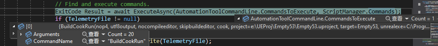

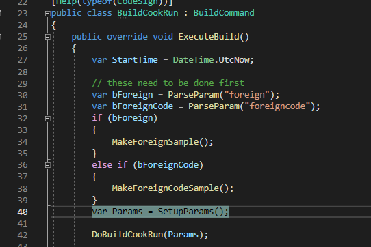

再一系列检查通过之后，会执行 `DoBuildCookRun` 函数，这里才是真正开始打包流程

```cs
protected void DoBuildCookRun(ProjectParams Params)
{
	int WorkingCL =-1;
	if(P4Enabled && GlobalCommandLine.Submit && AllowSubmit)
	{
		WorkingCL = P4.CreateChange(P4Env.Client, String.Format("{0} build from changelist {1}", Params.ShortProjectName, P4Env.Changelist));
	}

    Project.Build(this, Params, WorkingCL, ProjectBuildTargets.All);
	Project.Cook(Params);
	Project.CopyBuildToStagingDirectory(Params);
	Project.Package(Params, WorkingCL);
	Project.Archive(Params);
	Project.Deploy(Params);
	PrintRunTime();
	Project.Run(Params);
	Project.GetFile(Params);
	// Check everything in!
	if(WorkingCL !=-1)
	{
		int SubmittedCL;
		P4.Submit(WorkingCL,out SubmittedCL,true,true);
	}
}
```

每个函数对应的就是打包流程中的一环

* `Build`-编译
* `Cook`
* `CopyBuildToStagingDirectory`-复制文件到 Staging 目录，这里还在处理 `pak`、 `IoStore`、`exe`、`dll`、`so` 等
* `Package`-封包
* `Archieve`-序列化需要打包的文件及exe
* `Deploy`-部署
* `Run`-运行

### 关于 Build

代码执行位置是 `Engine\Source\Programs\AutomationTool\Scripts\BuildProjectCommand.Automation.cs ` 的 `Build` 函数中

如果参数中没有 `-build`，当前是安装版引擎并且是纯蓝图项目没有代码，无需 `Build` 流程，直接下一步 `Cook`

```cs
Params.ValidateAndLog();
if(!Params.Build)
{
	return;
}
if(Unreal.IsEngineInstalled()&&!Params.IsCodeBasedProject)
{
	return;
}
```

根据命令行参数创建 `UnrealBuild` 对象

```cs
var UnrealBuild =newUnrealBuild(Command);
var Agenda =newUnrealBuild.BuildAgenda();
```

 根据各种条件设置 Agenda对象，最后由 UnrealBuild 来执行

```cs
UnrealBuild.Build(Agenda,InDeleteBuildProducts: Params.Clean,InUpdateVersionFiles: WorkingCL >0);
```

 又经过了一系列根据参数的处理后，得到要编译的 `Target`

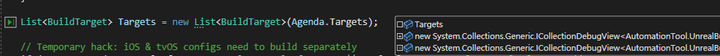


在 `UnrealBuild::Build` 函数中可以发现，对 `IOS` 和 `TVOS` 有特殊的 `Build` 处理，但是无论什么平台，最后总归是执行 `BuildWithUBT`

```cs
// Temporary hack: iOS & tvOS configs need to build separately
if(Targets.Any(x => x.Platform == UnrealTargetPlatform.IOS || x.Platform == UnrealTargetPlatform.TVOS))
{
    List<string> TargetNames = Targets.Select(x => x.TargetName).Distinct().ToList();
    List<UnrealTargetConfiguration> Configs = Targets.Select(x => x.Config).Distinct().ToList();
    foreach(string TargetName in TargetNames)
    {
        foreach(UnrealTargetConfiguration Config in Configs)
        {
            List<BuildTarget> ConfigTargets = Targets.Where(x =>(x.Platform == UnrealTargetPlatform.IOS || x.Platform == UnrealTargetPlatform.TVOS)&& x.TargetName == TargetName && x.Config == Config).ToList();
            if(ConfigTargets.Count >0)
            {
                // Build all the targets
                BuildWithUBT(ConfigTargets, InTargetToManifest, bDisableXGE, InAllCores);
            }
        }
    }
    Targets.RemoveAll(x => x.Platform == UnrealTargetPlatform.IOS || x.Platform == UnrealTargetPlatform.TVOS);
}
// End hack

if(Targets.Count ==0)
{
    return;
}

// Build all the targets
BuildWithUBT(Targets, InTargetToManifest, bDisableXGE, InAllCores);
```

在 `BuildWithUBT` 的时候，依然是构建 `FullCommandLine` 命令参数，最后传递给 `CommandUtils.RunUBT`  方法

这个函数在 `UBTUtils.cs` 文件中

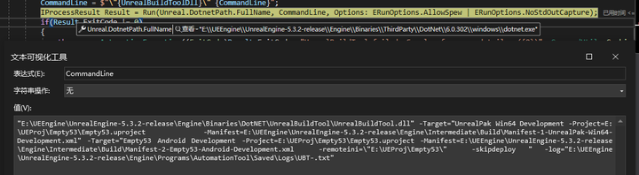

最后依然是让 dotnet 运行 `UnrealBuildTool.dll` ，这里一次性把要 `Build` 的两个 `Target` 都传入进去了

### 关于 Cook

核心逻辑在 `CookCommandlet` 中

```cs
// run a blocking cook
CookCommandlet(Params.RawProjectPath, Params.UnrealExe, MapsToCook, DirectoriesToCook, InternationalizationPreset, CulturesToCook, PlatformsToCook, CommandletParams);
```

最后执行的是

```cs
RunCommandlet(ProjectName, UnrealExe,"Cook", String.Format("{0} -TargetPlatform={1} {2}",  CommandletArguments, TargetPlatform, Parameters));
```

那么对应的逻辑就在 `UCookCommandlet` 这个模块里面了，路径是 `Engine\Source\Editor\UnrealEd\Classes\Commandlets\CookCommandlet.h`

### 关于 CopyBuildToStagingDirectory

除了收集文件之外，还要打包 `PAK` 和 `IoStore`

#### CreateStagingManifest

在 `CopyBuildToStagingDirectory` 函数中

通过 `CreateStagingManifest`  创建一个分发清单（`Staging Manifest`），它详细记录了为了将游戏或应用从开发环境部署到测试或生产环境所需要的所有资源和文件，这些数据都存储在 `DeploymentContext` 对象的 `FilesToStage` 属性中

```cs
publicFilesToStage FilesToStage =newFilesToStage();

publicclassFilesToStage
{
	// 会被写入到 Pak 中
	publicDictionary<StagedFileReference, FileReference> UFSFiles =newDictionary<StagedFileReference, FileReference>();

	// 不会被写入到 Pak 中，主要是一些 二进制 文件
	publicDictionary<StagedFileReference, FileReference> NonUFSFiles =newDictionary<StagedFileReference, FileReference>();

	// 不应该写入到 Pak 中 主要是一些 Debug 文件
	publicDictionary<StagedFileReference, FileReference> NonUFSDebugFiles =newDictionary<StagedFileReference, FileReference>();

	// 系统文件 不应被重命名
	publicDictionary<StagedFileReference, FileReference> NonUFSSystemFiles =newDictionary<StagedFileReference, FileReference>();
}
```

比如，在 `CreateStagingManifest` 函数中，有这么一段代码，它显式的将引擎目录下 `Conetent/Movies` 和 项目路径下 `Conetent/Movies` 两个路径添加到 `DeplymenetContext` 中

```cs
DirectoryReference EngineMoviesDir = DirectoryReference.Combine(SC.EngineRoot,"Content","Movies");
if(DirectoryReference.Exists(EngineMoviesDir))
{
    List<FileReference> MovieFiles = SC.FindFilesToStage(EngineMoviesDir, StageFilesSearch.AllDirectories);
    SC.StageFiles(MovieFileType, MovieFiles.Where(x =>!x.HasExtension(".uasset")&&!x.HasExtension(".umap")&&!MovieDenyList.Contains(x.GetFileNameWithoutAnyExtensions())));
}

DirectoryReference ProjectMoviesDir = DirectoryReference.Combine(SC.ProjectRoot,"Content","Movies");
if(DirectoryReference.Exists(ProjectMoviesDir))
{
    List<FileReference> MovieFiles = SC.FindFilesToStage(ProjectMoviesDir, StageFilesSearch.AllDirectories);
    SC.StageFiles(MovieFileType, MovieFiles.Where(x =>!x.HasExtension(".uasset")&&!x.HasExtension(".umap")&&!MovieDenyList.Contains(x.GetFileNameWithoutAnyExtensions())));
}
```

> 所以 `Movie` 可以直接放在 `Content/Movies` 中

在 `CreateStagingManifest` 还有一个方法是 `CreatePluginManifest` 将插件的内容也添加到 `DeplymenetContext` 中

```cs
// Create plugin manifests after the directory mappings
if(bCreatePluginManifest && Params.UsePak(SC.StageTargetPlatform))
{
    // Generate a plugin manifest if we're using a pak file and not creating a mod. Mods can be enumerated independently by users copying them into the Mods directory.
    if(Params.HasDLCName)
    {
        CreatePluginManifest(SC, SC.FilesToStage.UFSFiles, StagedFileType.UFS, Params.DLCFile.GetFileNameWithoutAnyExtensions());
    }
    else
    {
        CreatePluginManifest(SC, SC.FilesToStage.UFSFiles, StagedFileType.UFS, Params.ShortProjectName);
    }
}
```

在 `CreatePluginManifest` 中，通过遍历 `FileMapping` 得到所有以 `.plugin` 作为后缀的文件，将这些文件写入到 `项目/Intermedia/Staging/{PlatformType}/项目名.upluginmanifest` 文件中

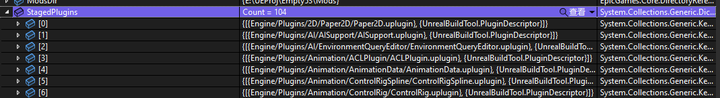

```cs
if(StagedPlugins.Count >0)
{
    string PluginManifestName = String.Format("{0}.upluginmanifest", ManifestName);

    FileReference PluginManifestFile = FileReference.Combine(SC.ProjectRoot,"Intermediate","Staging", SC.StageTargetPlatform.PlatformType.ToString(), PluginManifestName);
    DirectoryReference.CreateDirectory(PluginManifestFile.Directory);

    using(JsonWriter Writer =newJsonWriter(PluginManifestFile.FullName))
    {
        Writer.WriteObjectStart();
        Writer.WriteArrayStart("Contents");
        foreach(KeyValuePair<StagedFileReference, PluginDescriptor> StagedPlugin in StagedPlugins)
        {
            Writer.WriteObjectStart();
            Writer.WriteValue("File", String.Format("../../../{0}", StagedPlugin.Key.Name));
            Writer.WriteObjectStart("Descriptor");
            StagedPlugin.Value.Write(Writer);
            Writer.WriteObjectEnd();
            Writer.WriteObjectEnd();
        }
        Writer.WriteArrayEnd();
        Writer.WriteObjectEnd();
    }

    SC.StageFile(FileType, PluginManifestFile, StagedFileReference.Combine(SC.RelativeProjectRootForStage,"Plugins", PluginManifestName));
}
```

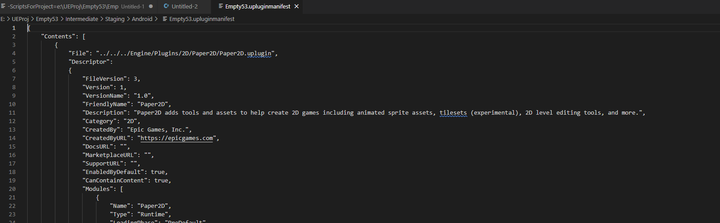


#### CleanStagingDirectory

用于清理之前的缓存文件

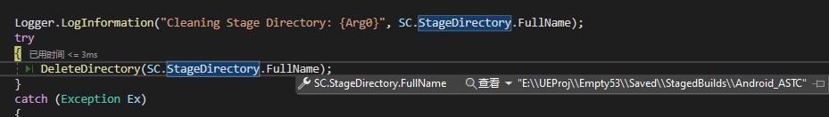

#### ApplyStagingManifest

通过前面的 `CreateStagingManifest` 收集所需信息到 `DeploymentContext` 对象中之后，根据 `ProjectParams` 和 `DeploymentContext` 对游戏文件进行管理、打包和复制

```cs
if (ShouldCreatePak(Params, SC))
{
	if (!ShouldCreateIoStoreContainerFiles(Params, SC))
	{
		// 如果不需要创建IoStore容器文件且Zen文件清单存在，则抛出异常，说明在不使用IoStore的情况下不应存在Zen文件清单
		FileReference ZenFileManifest = FileReference.Combine(SC.MetadataDir, "zenfs.manifest");
		if (FileReference.Exists(ZenFileManifest))
		{
			throw new AutomationException(String.Format("A Zen file manifest must not exist when staging without IoStore. Did not expected to find {0}. Ensure that legacy cooking with ZenStore disabled (bUseZenStore=false) was successful.", ZenFileManifest.FullName));
		}
	}
	if (SC.CrashReporterUFSFiles.Count > 0)
	{
		// 为崩溃报告器创建Pak文件:
		CreatePakForCrashReporter(Params, SC);
	}

	if (Params.PrePak)
	{
		// 从网络复制Pak文件:
		CopyPaksFromNetwork(Params, SC);
	}
	else if (SC.PlatformUsesChunkManifests && DoesChunkPakManifestExist(Params, SC))
	{
		// 使用块清单创建Pak文件:
		CreatePaksUsingChunkManifests(Params, SC);
	}
	else
	{
		// 使用分发清单创建Pak文件:
		CreatePakUsingStagingManifest(Params, SC);
	}
}
```

没有特殊设置，一般会执行 `CreatePakUsingStagingManifest` 函数来创建 `Pak` 文件

```cs
private static void CreatePakUsingStagingManifest(ProjectParams Params, DeploymentContext SC)
{
	// 清理无需处理的文件

	// 生成 Pak 加密配置文件
	EncryptionAndSigning.CryptoSettings PakCryptoSettings = EncryptionAndSigning.ParseCryptoSettings(DirectoryReference.FromFile(Params.RawProjectPath), SC.StageTargetPlatform.IniPlatformType, Log.Logger);
	FileReference CryptoKeysCacheFilename = FileReference.Combine(SC.MetadataDir, "Crypto.json");
	PakCryptoSettings.Save(CryptoKeysCacheFilename);

	// 创建 Pak
	List<CreatePakParams> PakInputs = new List<CreatePakParams>();
	PakInputs.Add(new CreatePakParams(SC.ShortProjectName, UnrealPakResponseFile, Params.Compressed, Params.RehydrateAssets, null));
	CreatePaks(Params, SC, PakInputs, PakCryptoSettings, CryptoKeysCacheFilename);
}
```

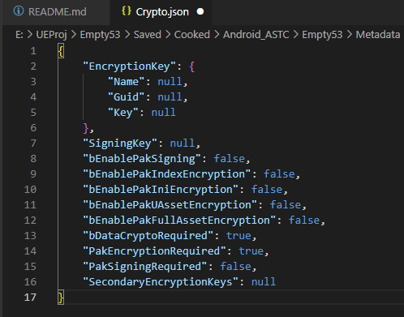

> `Crypto.json` 文件内容如上

