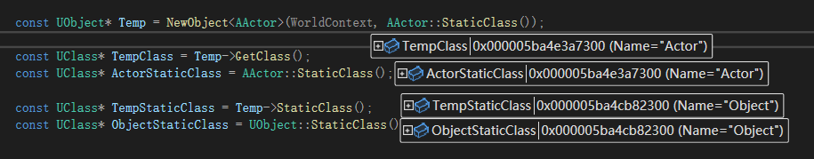
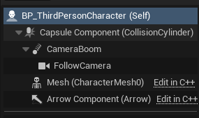
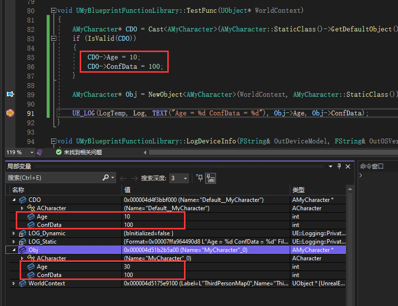
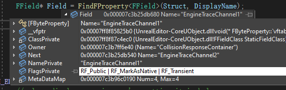
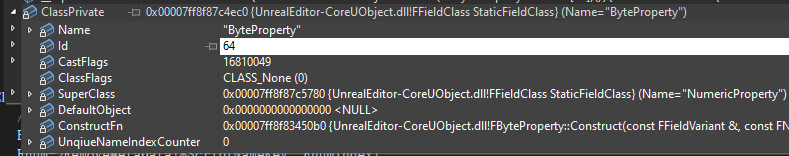
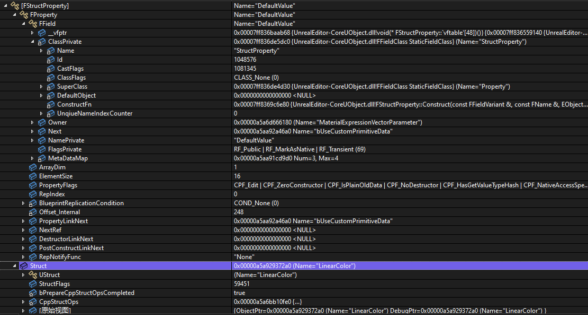
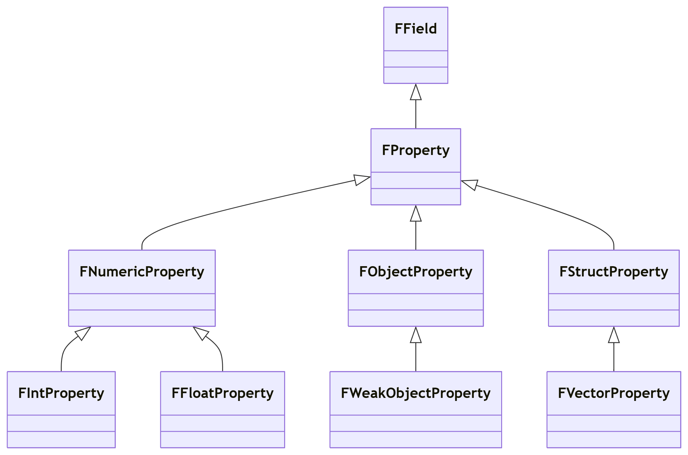

# UObject & UClass

## generated.h 和 GENERATED_BODY

在解释 `UClass` 之前，需要先说明 `GENERATED_BODY` 

```cpp
UCLASS()
class LYRAGAME_API ALyraPawn : public APawn
{
	GENERATED_BODY()
private:
    UFUNCTION()
    void OnControllerChangedTeam(UObject* TeamAgent, int32 OldTeam, int32 NewTeam);

private:
	UPROPERTY(ReplicatedUsing = OnRep_MyTeamID)
	FGenericTeamId MyTeamID;

	UPROPERTY()
	FOnLyraTeamIndexChangedDelegate OnTeamChangedDelegate;

private:
	UFUNCTION()
	void OnRep_MyTeamID(FGenericTeamId OldTeamID);
}
```

以上述代码为例，在类中使用了 `GENERATED_BODY`，至于 `GENERATED_BODY` 宏定义代码如下

```cpp
#define BODY_MACRO_COMBINE_INNER(A,B,C,D) A##B##C##D
#define BODY_MACRO_COMBINE(A,B,C,D) BODY_MACRO_COMBINE_INNER(A,B,C,D)

#define GENERATED_BODY_LEGACY(...) BODY_MACRO_COMBINE(CURRENT_FILE_ID,_,__LINE__,_GENERATED_BODY_LEGACY);
#define GENERATED_BODY(...) BODY_MACRO_COMBINE(CURRENT_FILE_ID,_,__LINE__,_GENERATED_BODY);
```

根据上面宏定义代码，可以得到 `GENERATED_BODY()` 本质就是拼接 `CURRENT_FILE_ID` + `_` + `__LINE__` + `_GENERATED_BODY`

什么是 `CURRENT_FILE_ID` ？

这段代码需要到对应的 `generate.h` 文件中去看

```cpp
#undef CURRENT_FILE_ID
#define CURRENT_FILE_ID FID_Lyra_Source_LyraGame_Character_LyraPawn_h
```

刚好每个类对应的 `generated.h` 文件中都定义了各自的 `CURRENT_FILE_ID`  

假设当前 `GENERATED_BODY()` 被定义在地 20 行，也就是说 `__LINE__` 对应的值是 20

最后 `GENERATED_BODY()` 得到的内容就是 `FID_Lyra_Source_LyraGame_Character_LyraPawn_h_20_GENERATED_BODY`

拿着最后得到的这个字符串，可以在 `generated.h` 文件中找到对应的宏定义

```cpp
#define FID_Lyra_Source_LyraGame_Character_LyraPawn_h_17_PROLOG
#define FID_Lyra_Source_LyraGame_Character_LyraPawn_h_20_GENERATED_BODY \
PRAGMA_DISABLE_DEPRECATION_WARNINGS \
public: \
	FID_Lyra_Source_LyraGame_Character_LyraPawn_h_20_SPARSE_DATA \
	FID_Lyra_Source_LyraGame_Character_LyraPawn_h_20_SPARSE_DATA_PROPERTY_ACCESSORS \
	FID_Lyra_Source_LyraGame_Character_LyraPawn_h_20_EDITOR_ONLY_SPARSE_DATA_PROPERTY_ACCESSORS \
	FID_Lyra_Source_LyraGame_Character_LyraPawn_h_20_RPC_WRAPPERS_NO_PURE_DECLS \
	FID_Lyra_Source_LyraGame_Character_LyraPawn_h_20_ACCESSORS \
	FID_Lyra_Source_LyraGame_Character_LyraPawn_h_20_INCLASS_NO_PURE_DECLS \
	FID_Lyra_Source_LyraGame_Character_LyraPawn_h_20_ENHANCED_CONSTRUCTORS \
private: \
PRAGMA_ENABLE_DEPRECATION_WARNINGS
```

查找 `FID_Lyra_Source_LyraGame_Character_LyraPawn_h_20_GENERATED_BODY` 所包含的全部宏定义

比如 `FID_Lyra_Source_LyraGame_Character_LyraPawn_h_20_ENHANCED_CONSTRUCTORS` 宏

该宏定义了，`ALyraPawn` 的 **移动构造** 、**拷贝构造**、**析构虚函数**，以及从 `FVTableHelper` 构造的函数

比如 `FID_Lyra_Source_LyraGame_Character_LyraPawn_h_20_INCLASS_NO_PURE_DECLS` 宏

该宏 使用 `DECLARE_SERIALIZER` 定义序列化函数，使用了 `DECLARE_CLASS` 定义了各种工具函数

这里详细看下 `DECLARE_CLASS` 宏，它定义了许多函数，收集了一些信息

```cpp
#define DECLARE_CLASS( TClass, TSuperClass, TStaticFlags, TStaticCastFlags, TPackage, TRequiredAPI  )
```

| `DECLARE_CLASS` 传入参数 | 作用 |
| --- | --- |
| TClass | 当前类名 |
| TSuperClass | 父类名称 |
| TStaticFlags |  |
| TStaticCastFlags |  |
| TPackage | 所属 Package 名称 |
| TRequiredAPI | 编译宏 |

`DECLARE_CLASS` 定义了一些函数

| `DECLARE_CLASS` 定义的函数 | 作用 |
| --- | --- |
| TClass& operator=(TClass&&) | 移动赋值 |
| TClass& operator=(const TClass&); | 拷贝赋值 |
| typedef TSuperClass Super | 定义父类为 Super，这也是为什么可以直接用 `Super` 调用父类函数的原因 |
| typedef TClass ThisClass; | 定义 `ThisClass` |
| inline static UClass* StaticClass() | 定义 `StaticClass` 获取静态数据信息 |
| inline static const TCHAR* StaticPackage() | 获取 `Package` 信息 |
| inline void* operator new | 创建该类对象的方法，用虚幻提供方式来创建对象，方便内存管理 |
| inline void operator delete | 销毁对象 |

由于 `GENERATED_BODY()` 定义在类中，宏扩展之后，`FID_Lyra_Source_LyraGame_Character_LyraPawn_h_20_GENERATED_BODY` 扩展出来的所有**函数**、**属性**、**类中类**都会被定义在 `ALyraPawn` 中

所以可以在编写代码的时候，可以很方便的使用 `Super::xxx()` 来调用父类函数，也可以使用 `T::StaticClass` 来获取静态类信息

`FID_Lyra_Source_LyraGame_Character_LyraPawn_h_20_INCLASS_NO_PURE_DECLS` 宏除了定义了 `DECLARE_CLASS` 和 `DECLARE_SERIALIZER` 之外，还定义了友元结构体 `Z_Construct_UClass_ALyraPawn_Statics`

`Z_Construct_UClass_ALyraPawn_Statics` 的具体实现在对应的 `gen.cpp` 文件中

以 `ALyraPawn::MyTeamID` 属性为例

在 `Z_Construct_UClass_ALyraPawn_Statics` 结构体中定义了与 `MyTeamID` 关联的属性

```cpp
#if WITH_METADATA
static const UECodeGen_Private::FMetaDataPairParam NewProp_MyTeamID_MetaData[];
#endif
static const UECodeGen_Private::FStructPropertyParams NewProp_MyTeamID;
```

它们的初始化也直接定义在 `gen.cpp` 文件中

```cpp
#if WITH_METADATA
const UECodeGen_Private::FMetaDataPairParam Z_Construct_UClass_ALyraPawn_Statics::NewProp_MyTeamID_MetaData[] = {
    { "ModuleRelativePath", "Character/LyraPawn.h" },
};
#endif
const UECodeGen_Private::FStructPropertyParams Z_Construct_UClass_ALyraPawn_Statics::NewProp_MyTeamID = { "MyTeamID", "OnRep_MyTeamID", (EPropertyFlags)0x0040000100000020, UECodeGen_Private::EPropertyGenFlags::Struct, RF_Public|RF_Transient|RF_MarkAsNative, nullptr, nullptr, 1, STRUCT_OFFSET(ALyraPawn, MyTeamID), Z_Construct_UScriptStruct_FGenericTeamId, METADATA_PARAMS(UE_ARRAY_COUNT(Z_Construct_UClass_ALyraPawn_Statics::NewProp_MyTeamID_MetaData), Z_Construct_UClass_ALyraPawn_Statics::NewProp_MyTeamID_MetaData) }; // 3104706936
```

以 `NewProp_MyTeamID` 为例，它的类型是 `FStructPropertyParams` ，收集了各种信息

```cpp
struct FStructPropertyParams // : FPropertyParamsBaseWithOffset
{
    const char*      NameUTF8;
    const char*         RepNotifyFuncUTF8;
    EPropertyFlags      PropertyFlags;
    EPropertyGenFlags   Flags;
    EObjectFlags     ObjectFlags;
    SetterFuncPtr  SetterFunc;
    GetterFuncPtr  GetterFunc;
    uint16           ArrayDim;
    uint16           Offset;
    UScriptStruct* (*ScriptStructFunc)();
#if WITH_METADATA
    uint16                              NumMetaData;
    const FMetaDataPairParam*           MetaDataArray;
#endif
};
```

| FStructPropertyParams 属性 | 作用 | 例子 |
| --- | --- | --- | 
| NameUTF8 | 属性名称 | "MyTeamID" |
| RepNotifyFuncUTF8 | 值在服务器上变化时调用的回调函数名称 | "OnRep_MyTeamID" |
| PropertyFlags | 属性枚举，比如 BlueprintCallable 等，可以用于运行时判断或者筛查，具体数值查看 `EPropertyFlags` 定义 | (EPropertyFlags)0x0040000100000020 |
| Flags | 数据类型枚举，比如 Byte、Int8、Float 等，具体数值查看 `EPropertyGenFlags` 枚举 | UECodeGen_Private::EPropertyGenFlags::Struct |
| ObjectFlags |  |  |
| SetterFunc | 修改属性时调用函数 | 可以为 nullptr |
| GetterFunc | 获取属性时调用函数 | 可以为 nullptr |
| ArrayDim |  |  |
| Offset | 属性在类对象上的内存偏移，可以基于内存和属性所占内存大小，直接获取对应内存块 | STRUCT_OFFSET(ALyraPawn, MyTeamID) |
| ScriptStructFunc |  |  |
| NumMetaData | 属性对应的 MeatData 数组长度 | UE_ARRAY_COUNT(Z_Construct_UClass_ALyraPawn_Statics::NewProp_MyTeamID_MetaData) |
| MetaDataArray | 属性对应的 MetaData 数组 | Z_Construct_UClass_ALyraPawn_Statics::NewProp_MyTeamID_MetaData |

上面这些数据信息都是有 `UHT` 在编译代码之前收集信息，并生成对应的代码


## UClass

### T::StaticClass

关于 `UClass` 常用的两个函数 `GetClass` 和 `T::StaticClass`

关于 `T::StaticClass` 并没有定义在基类中，而是在 `generated.h` 中

在 `generated.h` 文件中，有一个名为 `DECLARE_CLASS` 的宏，这个宏中定义了 `StaticClass` 函数

```cpp
inline static UClass* StaticClass() \
{ \
    return GetPrivateStaticClass(); \
} \
```

除了 `DECLARE_CLASS` 宏中定义了之外，在 `generated.h` 文件中还直接定义了一个**特化模板函数**

```cpp
template<> LYRAGAME_API UClass* StaticClass<class ALyraPawn>();
```

这个模板函数的实现在 `gen.cpp` 文件中，本质上还是在调用 `DECLARE_CLASS` 中定义的 `StaticClass`

```cpp
template<> LYRAGAME_API UClass* StaticClass<ALyraPawn>()
{
    return ALyraPawn::StaticClass();
}
```

在 `gen.cpp` 文件中存在一个与 `DECLARE_CLASS` 对应的宏 `IMPLEMENT_CLASS`，不一定是 `IMPLEMENT_CLASS` 也可能是 `IMPLEMENT_CLASS_NO_AUTO_REGISTRATION`

该宏实现了 `GetPrivateStaticClass` 函数，顺便定义了一个 `FClassRegistrationInfo` 的对象 `Z_Registration_Info_UClass_##TClass`，以 `ALyraPawn` 为例，定义的就是 `Z_Registration_Info_UClass_ALyraPawn` 对象

```cpp
#define IMPLEMENT_CLASS_NO_AUTO_REGISTRATION(TClass) \
FClassRegistrationInfo Z_Registration_Info_UClass_##TClass; \
UClass* TClass::GetPrivateStaticClass() \
{ \
    if (!Z_Registration_Info_UClass_##TClass.InnerSingleton) \
    { \
        /* this could be handled with templates, but we want it external to avoid code bloat */ \
        GetPrivateStaticClassBody( \
            StaticPackage(), \
            (TCHAR*)TEXT(#TClass) + 1 + ((StaticClassFlags & CLASS_Deprecated) ? 11 : 0), \
            Z_Registration_Info_UClass_##TClass.InnerSingleton, \
            StaticRegisterNatives##TClass, \
            sizeof(TClass), \
            alignof(TClass), \
            TClass::StaticClassFlags, \
            TClass::StaticClassCastFlags(), \
            TClass::StaticConfigName(), \
            (UClass::ClassConstructorType)InternalConstructor<TClass>, \
            (UClass::ClassVTableHelperCtorCallerType)InternalVTableHelperCtorCaller<TClass>, \
            UOBJECT_CPPCLASS_STATICFUNCTIONS_FORCLASS(TClass), \
            &TClass::Super::StaticClass, \
            &TClass::WithinClass::StaticClass \
        ); \
    } \
    return Z_Registration_Info_UClass_##TClass.InnerSingleton; \
}
```

`InternalConstructor` 和 `InternalVTableHelperCtorCaller` 两个函数是全局函数

```cpp
template<class T>
void InternalConstructor( const FObjectInitializer& X )
{ 
	T::__DefaultConstructor(X);
}

template<class T>
UObject* InternalVTableHelperCtorCaller(FVTableHelper& Helper)
{
	return T::__VTableCtorCaller(Helper);
}
```

而这两个函数已经在 `generated.h` 中的用于定义构造相关的宏 `FID_Lyra_Source_LyraGame_Character_LyraPawn_h_20_ENHANCED_CONSTRUCTORS` 中定义

```cpp
public: \
	DECLARE_VTABLE_PTR_HELPER_CTOR(NO_API, ALyraPawn); \
	DEFINE_VTABLE_PTR_HELPER_CTOR_CALLER(ALyraPawn); \
	DEFINE_DEFAULT_OBJECT_INITIALIZER_CONSTRUCTOR_CALL(ALyraPawn) \
```

注意 `GetPrivateStaticClassBody` 中 `InternalConstructor` 和 `InternalVTableHelperCtorCaller` 是函数指针

返回的是类型系统构建时针对 `ALyraPawn` 类生成的类型对象，它是静态的

### GetClass

`GetClass` 是对象的内部方法，它返回的是对象的 `ClassPrivate` 属性，定义在 `UObjectBase` 中

```cpp
FORCEINLINE UClass* GetClass() const
{
    return ClassPrivate;
}
```

`Obj->StaticClass` 得到的是当前编译期类型的 `Class`，如果是用 `UObject` 指针指向 `AActor` 对象，调用其 `StaticClass` 得到的会是 `UObject` 的 `Class`



## Outer

`Outer` 定义在 `UObjectBase` 中，按注释解释就是 **对象所在的地方**

```cpp
/** Object this object resides in. */
UObject*						OuterPrivate;

UObjectBase::UObjectBase(UClass* InClass,
	EObjectFlags InFlags,
	EInternalObjectFlags InInternalFlags,
	UObject *InOuter,
	FName InName,
	int32 InInternalIndex,
	int32 InSerialNumber)
:	ObjectFlags			(InFlags)
,	InternalIndex		(INDEX_NONE)
,	ClassPrivate		(InClass)
,	OuterPrivate		(InOuter)
{
    //... do something 
}
```

`Outer` 的作用是为了构建层级以及管理资源和序列化

以 `ACharacter` 为例，为什么这四个组件子对象（很重要的一个概念，后面的系列文章会谈到），知道自己应该挂在 `BP_Character` 对象身上呢？因为在构造函数中调用 `CreateDefaultSubobject` 方法创建这四个组件的时候，设置了它们的 `Outer` 就是 `BP_Character` 对象

`ArrowComponent` 和 `Mesh` 的层级与 `CapsuleComponent` 不同，这是因为通过 `SetupAttachment` 设置到 `CapsuleComponent` 中



那么，假设 `A` 对象，以 `A` 对象为 `Outer` 创建 `B` 对象

如果此时销毁对象 `A`，然后 `ForceGarbageCollection` 强制 GC，此时 A 对象和 B 对象会被怎样？

`B` 对象的生命周期与 `Outer` 也就是 `A` 无关，它的生命周期只与 `Holder` 持有者有关，只要持有者不被销毁，`B` 对象就不会被销毁

`A` 对象会被标记为 `PendingKill`，理论上不可以再被使用，使用 `IsValid` 也会返回 `false`

因为 UE 的 GC 机制是 标记-清除，只要 B 的 `Holder` 是可达的，B 就是可达的，那么 B 就不会被 GC 回收掉

A 对象虽然会被标记为 `PendingKill`，虽然非常不建议，但是仍然可以通过 B 的  `OuterPrivate` 访问到

## CDO

https://zhuanlan.zhihu.com/p/678276293

`GetDefaultObject` 是 `UClass` 的成员函数，`ClassDefaultObject` 是 `UClass` 的成员属性，类型为 `TObjectPtr<UObject>`

```cpp
UObject* UClass::GetDefaultObject(bool bCreateIfNeeded = true) const
{
    if (ClassDefaultObject == nullptr && bCreateIfNeeded)
    {
        InternalCreateDefaultObjectWrapper();
    }

    return ClassDefaultObject;
}
```

当我们使用 `NewObject` 创建对象的时候，会直接调用对应类的构造函数，一般来说不会从 CDO 中拷贝数据

如果想要从 CDO 中拷贝数据，可以在 `NewObject` 函数调用时，设置其 `bCopyTransientsFromClassDefaults` 属性为 true

```cpp
UCLASS()
class EMPTY53_API AMyCharacter : public ACharacter
{
	GENERATED_BODY()
public:
	UPROPERTY(BlueprintReadWrite)
	int32 Age = 30;

	UPROPERTY(BlueprintReadWrite, config)
	int32 ConfData = -1;
};
```



> 上述代码没用使用 `bCopyTransientsFromClassDefaults` 属性，不存在主动从 CDO 赋值

`AMyCharacter` 代码内容很简单，就两个属性 `Age` 默认值是 30 和 `ConfData` 默认值是 -1

此时，通过 `StaticClass` 得到 `CDO` 对象，修改其值

然后通过 `NewObject` 创建新的 `AMyCharacter` 后，观察 `Obj` 的属性值

- `Obj->Age` 的值仍然为 30，这就是前面说的一般情况数据不从 CDO 复制
- `Obj->ConfData` 的值被修改为 100，这是因为 `UPROPERTY` 设置 `config`，也就是从 ini 文件中获取配置值，总不能每次创建对象都读取和解析 ini 文件吧，从 CDO 中获取是最快最合理的

在不使用 `bCopyTransientsFromClassDefaults` 的情况下，只有 `UPROPERTY` 中配置了 `config` 的属性，才会在初始化的时候从 CDO 拷贝属性值，其他属性不会从 CDO 中拷贝属性值

## FField 和 FProperty

```cpp
class FField
{
	UE_NONCOPYABLE(FField);
	FFieldClass* ClassPrivate;  // 指向该字段的类型描述符

public:
	FFieldVariant Owner;    // 标识字段的所有者
	FField* Next;           // 单链表指针，连接同属一个作用域的字段
	FName NamePrivate;      // 字段的名称标识符
	EObjectFlags FlagsPrivate;  // 字段的行为标志位
}
```

- FField 运行时

 

- FFieldClass 运行时

 

```cpp
class FProperty : public FField
{
	DECLARE_FIELD_API(FProperty, FField, CASTCLASS_FProperty, COREUOBJECT_API)

	int32			ArrayDim;       // 定义属性数组维度，比如 int32 Value[10] 那么 ArrayDim 值为 10
	int32			ElementSize;    // 单个元素的字节大小
	EPropertyFlags	PropertyFlags;  // 属性的核心行为特征
	uint16			RepIndex;       // 网络复制时的唯一标识符
	TEnumAsByte<ELifetimeCondition> BlueprintReplicationCondition;  // 蓝图属性的网络复制条件
	int32		Offset_Internal;        // 属性在所属对象内存块中的偏移量
	FProperty*	PropertyLinkNext;       // 按声明顺序链接属性（从派生类到基类）
	FProperty*  NextRef;                // 链接所有含 UObject 引用的属性
	FProperty*	DestructorLinkNext;     // 链接需要显式析构的非平凡类型
	FProperty*	PostConstructLinkNext;  // 链接需要后置构造处理的属性
	FName		RepNotifyFunc;          // 存储复制通知函数名称
}
```






