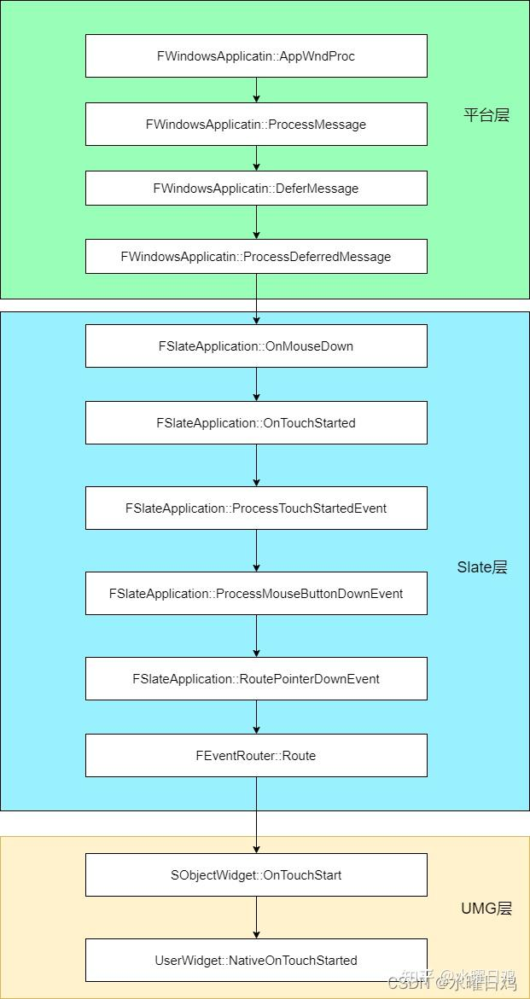

# UI

在虚幻中，实现 UI 的方法就是通过 `Slate` 弯沉

方便内存管理和使用，UMG 使用 `UObject` 来持有 `Slate` 控件

比如， UImage 持有 SImage 控件

通常来说真正实现功能的方法都在 `Slate` 控件中

`Slate` 中常见控件分为三种

- `SLeafWidget` 不包含子节点的叶子节点，比如 `STextBlock`
- `SPanel` 可以包含多个子节点的，比如 `SVerticalBox`
- `SCompoundWidget` 只能包含一个子节点，比如 `SButton`

## 渲染


在 `FEngineLoop::Tick` 中，触发 `FSlateApplication::Get().Tick` 函数，用于 `Slate` 渲染

Slate 的渲染逻辑是每帧重新渲染所有的控件，这当然会带来大量的性能浪费，因为某些控件的变化频率并没有那么高，无需每帧更新，`SInvalidationPanel` 则是当控件的内容发生变化时，只需重新渲染发生变化的部分，而不是整个面板

于是在 `PaintInvalidationRoot` 函数中出现了这么一段内容

```cpp
if (!Context.bAllowFastPathUpdate || bNeedsSlowPath || GSlateIsInInvalidationSlowPath)
	{
		GSlateIsOnFastUpdatePath = false;
		bNeedsSlowPath = false;
		CachedViewOffset = Context.ViewOffset;
		{
			if (Context.bAllowFastPathUpdate)
			{
				TGuardValue<bool> InSlowPathGuard(GSlateIsInInvalidationSlowPath, true);
				BuildFastPathWidgetList(RootWidget);
			}
			// Repopulates cached element lists
			CachedMaxLayerId = PaintSlowPath(Context);
		}
		Result.bRepaintedWidgets = true;
	}
	else if (!FastWidgetPathList->IsEmpty())
	{
		// We should not have been supplied a different root than the one we generated a path to
		check(RootWidget == FastWidgetPathList->GetRoot().Pin());
		Result.bRepaintedWidgets = PaintFastPath(Context);
	}
```

根据是否启用 `bAllowFastPathUpdate` 来决定执行 `PaintSlowPath` 全量计算，还是 `PaintFastPath` 快速计算

> 不过后续流程都是根据 `PaintSlowPath` 进行参考

在 `PaintSlowPath` 中以 `SWidget::PaintWindow` 为入口，开始深度遍历所有的 `Slate` 控件

在 `SWindow` 调用到 `SWindow::Paint`，`SWindow` 继承自 `SWidget` 且没有重写 `Paint`，最后还是调用到 `SWidget::Paint` 

### FGeometry

一个 UI 控件，需要计算自己的尺寸大小、位置坐标，这些信息都可以用 `FGeometry` 来表示

`FGeometry` 包含了控件的位置、大小、缩放等等各种信息，它在控件布局、事件处理、坐标变换、子控件传递以及支持复杂变换等方面发挥重要作用


成员属性比较简单

- `Size`: 表示控件在本地空间（Local Space）中的大小，即控件自身坐标系中的宽度和高度。这个字段主要用于描述控件的内部布局和尺寸
- `Scale`: 表示控件的缩放因子。这个字段用于描述控件在屏幕空间(Screen Space)中的缩放程度。这个值是累积的，包括了控件本身以及其所有父控件的缩放
- `AbsolutePosition`: 表示控件在屏幕空间中的位置，即控件相对于屏幕或应用程序窗口的左上角的坐标。这个字段主要用于描述控件在屏幕上的位置
- `Position`: 表示控件在本地空间中的位置。这个字段主要用于描述当前控件相对于其父控件的位置。
- `AccumulatedRenderTransform`: 表示从控件的本地空间到屏幕空间的累积渲染变换。这个变换包括了控件本身以及其所有父控件的渲染变换。这个字段主要用于在渲染过程中对控件应用复杂的变换，例如旋转、缩放和平移等
- `bHasRenderTransform`: 一个布尔值，表示控件是否具有渲染变换。这个字段用于在需要时快速检查控件是否具有渲染变换，以便在渲染过程中进行相应的处理

在 `Slate` 框架中，通常需要在本地空间和屏幕空间之间进行坐标转换。例如在处理控件的布局和点击事件时，需要将本地空间中的坐标转换为屏幕空间中的坐标，以便确定控件在屏幕上的实际位置

在这些计算的时候， `FGeometry` 可以发挥很大的作用


## 事件触发

https://zhuanlan.zhihu.com/p/448050955

以点击事件为例



在 `FSlateApplication::RoutePointerDownEvent` 函数中，传入参数有两个

- `WidgetsUnderPointer` 用于表示特定的 `Widget` 路径，它包含了从最上层的 `SWindow` 到特定 `Widget` 的层次结构、几何信息和虚拟光标位置
- `PointerEvent` 点输入事件类， 用于处理鼠标以及移动设备的触摸按键


## ListView


