# UI

在虚幻中，实现 UI 的方法就是通过 `Slate` 弯沉

方便内存管理和使用，UMG 使用 `UObject` 来持有 `Slate` 控件

比如， UImage 持有 SImage 控件

通常来说真正实现功能的方法都在 `Slate` 控件中

`Slate` 中常见控件分为三种

- `SLeafWidget` 不包含子节点的叶子节点，比如 `STextBlock`
- `SPanel` 可以包含多个子节点的，比如 `SVerticalBox`
- `SCompoundWidget` 只能包含一个子节点，比如 `SButton`

## 渲染

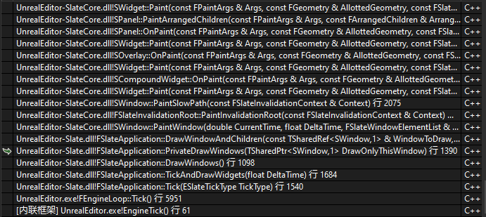

在 `FEngineLoop::Tick` 中，触发 `FSlateApplication::Get().Tick` 函数，用于 `Slate` 渲染

`Slate` 的渲染逻辑是每帧重新渲染所有的控件，这当然会带来大量的性能浪费，因为某些控件的变化频率并没有那么高，无需每帧更新，`SInvalidationPanel` 则是当控件的内容发生变化时，只需重新渲染发生变化的部分，而不是整个面板

于是在 `PaintInvalidationRoot` 函数中出现了这么一段内容

```cpp
if (!Context.bAllowFastPathUpdate || bNeedsSlowPath || GSlateIsInInvalidationSlowPath)
	{
		GSlateIsOnFastUpdatePath = false;
		bNeedsSlowPath = false;
		CachedViewOffset = Context.ViewOffset;
		{
			if (Context.bAllowFastPathUpdate)
			{
				TGuardValue<bool> InSlowPathGuard(GSlateIsInInvalidationSlowPath, true);
				BuildFastPathWidgetList(RootWidget);
			}
			// Repopulates cached element lists
			CachedMaxLayerId = PaintSlowPath(Context);
		}
		Result.bRepaintedWidgets = true;
	}
	else if (!FastWidgetPathList->IsEmpty())
	{
		// We should not have been supplied a different root than the one we generated a path to
		check(RootWidget == FastWidgetPathList->GetRoot().Pin());
		Result.bRepaintedWidgets = PaintFastPath(Context);
	}
```

根据是否启用 `bAllowFastPathUpdate` 来决定执行 `PaintSlowPath` 全量计算，还是 `PaintFastPath` 快速计算

> 不过后续流程都是根据 `PaintSlowPath` 进行参考

在 `PaintSlowPath` 中以 `SWidget::PaintWindow` 为入口，开始深度遍历所有的 `Slate` 控件

在 `SWindow` 调用到 `SWindow::Paint`，`SWindow` 继承自 `SWidget` 且没有重写 `Paint`，最后还是调用到 `SWidget::Paint` 

### PrePass

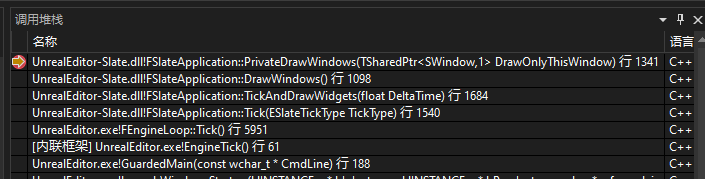

在调用 `DrawWindowAndChildren` 绘制之前，会调用 `DrawPrepass`

```cpp
// Prepass the window
DrawPrepass( DrawOnlyThisWindow );
```

根据注释，可以知道这是在绘制之前的流程

1. 执行自定义流程 `CustomPrepass`
2. 遍历子节点，对其执行 `Prepass_ChildLoop`
3. 缓存设计分辨率 `CacheDesiredSize` 

```cpp
void SWidget::Prepass_Internal(float InLayoutScaleMultiplier)
{
	PrepassLayoutScaleMultiplier = InLayoutScaleMultiplier;

	bool bShouldPrepassChildren = true;
	if (bHasCustomPrepass)
	{
		bShouldPrepassChildren = CustomPrepass(InLayoutScaleMultiplier);
	}

	if (bCanHaveChildren && bShouldPrepassChildren)
	{
		FChildren* MyChildren = this->GetChildren();
		const int32 NumChildren = MyChildren->Num();
		Prepass_ChildLoop(InLayoutScaleMultiplier, MyChildren);
		ensure(NumChildren == MyChildren->Num());
	}

	{
		CacheDesiredSize(PrepassLayoutScaleMultiplier.Get(1.0f));
		bNeedsPrepass = false;
	}
}
```

要自定义设计分辨率，需要重写 `ComputeDesiredSize` 函数，这是 `SWidget` 的纯虚函数，每个子类都要重写

```cpp
virtual FVector2D ComputeDesiredSize(float LayoutScaleMultiplier) const = 0;
```

计算每个控件占据的控件大小，是一个自下而上的计算过程

- 不含子项的控件基于其本质属性计算和缓存其所需的大小
- 组合其他控件的控件使用特殊逻辑决定其所需的大小

### ArrangeChildren

`ArrangeChildren` 函数负责计算子控件的几何信息并将其添加到 `ArrangedChildren` 列表中

`ArrangeChildren` 会在布局过程中被调用，子类可以重写 `OnArrangeChildren` 以实现自定义的子控件布局逻辑

```cpp
void SWidget::ArrangeChildren(const FGeometry& AllottedGeometry, FArrangedChildren& ArrangedChildren, bool bUpdateAttributes) const
{
	if (bUpdateAttributes)
	{
		FSlateAttributeMetaData::UpdateChildrenOnlyVisibilityAttributes(const_cast<SWidget&>(*this), FSlateAttributeMetaData::EInvalidationPermission::DelayInvalidation, false);
	}

	OnArrangeChildren(AllottedGeometry, ArrangedChildren);
}
```

这里 `OnArrangeChildren` 是一个纯虚函数，需要每个子类重写自己的内容

```cpp
virtual void OnArrangeChildren(const FGeometry& AllottedGeometry, FArrangedChildren& ArrangedChildren) const = 0;
```

以 `SCanvas::OnArrangeChildren` 为例

```cpp
void SCanvas::OnArrangeChildren( const FGeometry& AllottedGeometry, FArrangedChildren& ArrangedChildren ) const
{
    for (int32 ChildIndex = 0; ChildIndex < Children.Num(); ++ChildIndex)
    {
        // ... 做一些计算
        
        ArrangedChildren.AddWidget( AllottedGeometry.MakeChild(
            CurChild.GetWidget(),
            CurChild.GetPosition() + Offset,
            Size
        ));
    }
}
```

以 `SOverlay::OnPaint` 为例，展示使用 `ArrangeChildren` 的使用

```cpp
for (int32 ChildIndex = 0; ChildIndex < ArrangedChildren.Num(); ++ChildIndex)
{
    FArrangedWidget& CurArrangedWidget = ArrangedChildren[ChildIndex];

    const int32 CurWidgetsMaxLayerId =
        CurArrangedWidget.Widget->Paint(
            NewArgs,
            CurArrangedWidget.Geometry,
            MyCullingRect,
            OutDrawElements,
            MaxLayerId,
            InWidgetStyle,
            bChildrenEnabled);
}
```

将 `Widget` 的坐标偏移 和 大小 信息保存到 `ArrangedChildren` 中

### FGeometry

一个 UI 控件，需要计算自己的尺寸大小、位置坐标，这些信息都可以用 `FGeometry` 来表示

`FGeometry` 包含了控件的位置、大小、缩放等等各种信息，它在控件布局、事件处理、坐标变换、子控件传递以及支持复杂变换等方面发挥重要作用

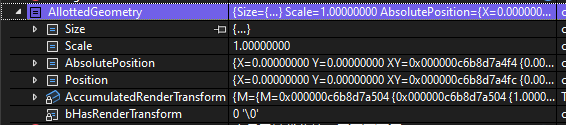

成员属性比较简单

- `Size`: 表示控件在本地空间（Local Space）中的大小，即控件自身坐标系中的宽度和高度。这个字段主要用于描述控件的内部布局和尺寸
- `Scale`: 表示控件的缩放因子。这个字段用于描述控件在屏幕空间(Screen Space)中的缩放程度。这个值是累积的，包括了控件本身以及其所有父控件的缩放
- `AbsolutePosition`: 表示控件在屏幕空间中的位置，即控件相对于屏幕或应用程序窗口的左上角的坐标。这个字段主要用于描述控件在屏幕上的位置
- `Position`: 表示控件在本地空间中的位置。这个字段主要用于描述当前控件相对于其父控件的位置。
- `AccumulatedRenderTransform`: 表示从控件的本地空间到屏幕空间的累积渲染变换。这个变换包括了控件本身以及其所有父控件的渲染变换。这个字段主要用于在渲染过程中对控件应用复杂的变换，例如旋转、缩放和平移等
- `bHasRenderTransform`: 一个布尔值，表示控件是否具有渲染变换。这个字段用于在需要时快速检查控件是否具有渲染变换，以便在渲染过程中进行相应的处理

在 `Slate` 框架中，通常需要在本地空间和屏幕空间之间进行坐标转换。例如在处理控件的布局和点击事件时，需要将本地空间中的坐标转换为屏幕空间中的坐标，以便确定控件在屏幕上的实际位置

在这些计算的时候， `FGeometry` 可以发挥很大的作用

### Paint

根据几何信息（`AllottedGeometry`）和父级剪裁矩形（`MyCullingRect`）计算当前 `Widget` 的剪裁边界（`CullingBounds`）

```cpp
FSlateRect CullingBounds = CalculateCullingAndClippingRules(AllottedGeometry, MyCullingRect, bClipToBounds, bAlwaysClip, bIntersectClipBounds);
```

将 `AllottedGeometry` 计算成桌面坐标

混合父级样式和当前 `Widget` 的透明度 

```cpp
FWidgetStyle ContentWidgetStyle = FWidgetStyle(InWidgetStyle).BlendOpacity(RenderOpacity);

FGeometry DesktopSpaceGeometry = AllottedGeometry;
DesktopSpaceGeometry.AppendTransform(FSlateLayoutTransform(Args.GetWindowToDesktopTransform()));
```

根据 `Flag` 指定定时逻辑，更新控件

```cpp
if (HasAnyUpdateFlags(EWidgetUpdateFlags::NeedsActiveTimerUpdate))
{
    // ... do something
    MutableThis->ExecuteActiveTimers(Args.GetCurrentTime(), Args.GetDeltaTime());
}

if (HasAnyUpdateFlags(EWidgetUpdateFlags::NeedsTick))
{
    // ... do something
    MutableThis->Tick(DesktopSpaceGeometry, Args.GetCurrentTime(), Args.GetDeltaTime());
}
```

> 这里执行 `Tick`，大部分控件的更新逻辑都在 `Tick` 中执行

将当前 `Widget` 压入绘制栈，缓存句柄

如果当前 `Widget` 可见并且支持命中测试，将其添加到命中测试网格 `FHittestGrid` 中

```cpp
OutDrawElements.PushPaintingWidget(*this, LayerId, PersistentState.CachedElementHandle);

if (bOutgoingHittestability)
{
    Args.GetHittestGrid().AddWidget(MutableThis, 0, LayerId, FastPathProxyHandle.GetWidgetSortOrder());
}
```

调用 `OnPaint` 由子类自行实现生成实际绘制指令

```cpp
int32 NewLayerId = OnPaint(UpdatedArgs, AllottedGeometry, CullingBounds, OutDrawElements, LayerId, ContentWidgetStyle, bParentEnabled);
```

### OnPaint

`SPanel` 和 `SCompoundWidget` 因为存在子节点，需要先调用 `PaintArrangedChildren` 计算每个子节点的坐标、大小

```cpp
ArrangeChildren(AllottedGeometry, ArrangedChildren);
```

> 如果是 `SLeafWidget` 则不用，毕竟没有子节点没必要计算

`SPanel` 和 `SCompoundWidget` 再对每个子节点调用 `Paint`

```cpp
for (int32 ChildIndex = 0; ChildIndex < ArrangedChildren.Num(); ++ChildIndex)
{
    const FArrangedWidget& CurWidget = ArrangedChildren[ChildIndex];

    if (!IsChildWidgetCulled(MyCullingRect, CurWidget))
    {
        const int32 CurWidgetsMaxLayerId = CurWidget.Widget->Paint(NewArgs, CurWidget.Geometry, MyCullingRect, OutDrawElements, LayerId, InWidgetStyle, bShouldBeEnabled);
        MaxLayerId = FMath::Max(MaxLayerId, CurWidgetsMaxLayerId);
    }
    else
    {
        //SlateGI - RemoveContent
    }
}
```

不过前面都是收集数据、遍历节点，真正绘制的内容其实是下面这样，以 `SButton::OnPaint` 为例

```cpp
FSlateDrawElement::MakeBox(
    OutDrawElements,
    LayerId,
    AllottedGeometry.ToPaintGeometry(),
    BrushResource,
    DrawEffects,
    BrushResource->GetTint(InWidgetStyle) * InWidgetStyle.GetColorAndOpacityTint() * GetBorderBackgroundColor().GetColor(InWidgetStyle)
);
```

`FSlateDrawElement` 是 `Slate` 渲染系统的原子绘制单元，封装了 `GPU` 绘制所需的所有元数据

`OutDrawElements` 是由 `SWindow` 创建，用于收集绘制信息。通过遍历所有节点时，由每个节点各自添加各自的绘制指令到 `OutDrawElements` 中

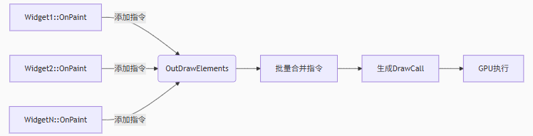

### FSlateDrawElement

参考 SButton 和 SSlate 在 `OnPaint` 的操作

通过 `FSlateDrawElement::MakeBox` 向 `OutDrawElements` 中添加绘制命令

除了 `MakeBox` 外，还提供一些其他的接口

| 接口 | 作用 |
| --- | --- |
| MakeBox | 创建九宫格（9-slice）样式盒子 |
| MakeRotatedBox | 创建可旋转的九宫格盒子 |
| MakeText | 渲染简单字符串 |
| MakeShapedText | 渲染复杂文本（支持双向文本/字体变体） |
| MakeGradient | 创建线性渐变区域 |
| MakeSpline | 绘制 Hermite 插值样条 |
| MakeCubicBezierSpline | 绘制 三次贝塞尔曲线 |
| MakeDrawSpaceSpline | 在 屏幕空间 绘制样条 |
| MakeLines |绘制多段连续折线 |
| MakeViewport | 嵌入外部渲染内容（如 3D 场景） |
| MakeCustom | 注入底层图形 API 调用 |
| MakeCustomVerts | 直接提交顶点/索引数据 |
| MakePostProcessPass | 应用屏幕后处理效果 |


## 自定义样条线

如果想要绘制一个样条曲线 `SSplineTest` ，应该如何使用实现？

```cpp
class SSplineWithHandles : public SCompoundWidget
```

### 定义属性

一个最简单的样条线，需要定义四个点，分别表示 起点、终点 和 两个控制点

需要在类中使用 `SLATE_BEGIN_ARGS` 来定义属性

```cpp
SLATE_BEGIN_ARGS(SSplineWithHandles)
: _P0(FVector2f(0.f,32.f))
, _P1(FVector2f(100.f, 32.f))
, _P2(FVector2f(0.f,132.f))
, _P3(FVector2f(100.f,132.f))
, _SplineThickness(1.0f)
{}
	SLATE_ARGUMENT(FVector2f, P0)
	SLATE_ARGUMENT(FVector2f, P1)
	SLATE_ARGUMENT(FVector2f, P2)
	SLATE_ARGUMENT(FVector2f, P3)
	SLATE_ATTRIBUTE(float, SplineThickness)
SLATE_END_ARGS()
```

那么什么是 `SLATE_BEGINE_ARGS` ？

看宏定义

```cpp
#define SLATE_BEGIN_ARGS( InWidgetType ) \
	public: \
	struct FArguments : public TSlateBaseNamedArgs<InWidgetType> \
	{ \
		typedef FArguments WidgetArgsType; \
		typedef InWidgetType WidgetType; \
		FORCENOINLINE FArguments()
```

定义了基于 `TSlateBaseNamedArgs` 的内部结构体，名为 `FArguments`

`TSlateBaseNamedArgs` 定义了很多通用属性：`ToolTipText`、`ToolTip`、`IsEnabled` 等

那么，上面的代码就很好理解了

首先就是下面这段代码，定义了一个名为 `FArguments` 的内部结构体，顺便在构造函数中把属性初始化

```cpp
SLATE_BEGIN_ARGS(SSplineWithHandles)
: _P0(FVector2f(0.f,32.f))
, _P1(FVector2f(100.f, 32.f))
, _P2(FVector2f(0.f,132.f))
, _P3(FVector2f(100.f,132.f))
, _SplineThickness(1.0f)
{}
```

如果没有需要初始化的属性，一般这么写

```cpp
SLATE_BEGIN_ARGS(SSplineWithHandles){}
```

接下来是定义属性，通常两种定义方式 `SLATE_ARGUMENT` 和 `SLATE_ATTRIBUTE`

`SLATE_ARGUMENT` 是单纯的定义了一个变量

```cpp
#define SLATE_PRIVATE_ARGUMENT_VARIABLE( ArgType, ArgName ) \
		ArgType _##ArgName


#define SLATE_PRIVATE_ARGUMENT_FUNCTION( ArgType, ArgName ) \
		WidgetArgsType& ArgName( ArgType InArg ) \
		{ \
			_##ArgName = InArg; \
			return static_cast<WidgetArgsType*>(this)->Me(); \
		}
```

比如 `SLATE_SLATE(FVector2f, P0)` 
- 定义了一个类型为 `FVector2f` 属性名为 `_P0` 的变量
- 定义了一个返回值为 `WidgetArgsType&` 函数名为 `P0` 的函数

> `WidgetArgsType` 类型就是 `FArguments`

为什么 `P0` 函数需要返回 `WidgetArgsType&` ？

这是为了连续赋值，比如 `Arguments.P0(1).P2(1).P3(1)` 这种方式来连续赋值

`SLATE_ATTRIBUTE` 与 `SLATE_ARGUMENT` 类似，不同的是它定义的是类型是 `TAttribute<>`

```cpp
#define SLATE_PRIVATE_ATTRIBUTE_VARIABLE( AttrType, AttrName ) \
		TAttribute< AttrType > _##AttrName
```

如果定义的是一个普通属性，仅在控件构造时设置，后续不可更改，可以直接使用 `SLATE_ARGUMENT`

如果定义的是一个属性，需要运行时修改并触发 UI 刷新，则需要使用 `SLATE_ATTRIBUTE`

比如这里使用 `SLATE_ATTRIBUT` 定义了 `SplineThickness` 属性

如果想要动态设置该值，则可以这么做 `SplineThickness.Bind( this, &SSplineWithHandles::GetContentScale )`

除了定义属性，还可以定义事件，使用 `SLATE_EVENT`

```cpp
// 定义事件
DECLARE_DELEGATE_RetVal_TwoParams(
	FReply, FPointerEventHandler,
	const FGeometry&,
	const FPointerEvent&)

// 定义事件绑定
SLATE_BEGIN_ARGS(SSplineWithHandles){}
	SLATE_EVENT(FPointerEventHandler, OnMouseButtonDown)
SLATE_END_ARGS()

// 绑定事件
SNew( SSplineWithHandles ).OnMouseButtonDown( this, &SElementTesting::TestBoxElement ) 
```

还有一个 `SLATE_NAMED_SLOT` 用于定义插槽

### 鼠标事件

在所有控件的基类 `SWidget` 中定义了很多函数用于处理输入事件

| 积累函数接口 | 作用 |
| --- | --- |
| OnFocusReceived | 控件获取焦点 |
| OnFocusLost | 焦点离开控件 |
| OnFocusChanging | 焦点转移前拦截 |
| OnKeyChar | 处理字符输入 |
| OnPreviewKeyDown | 按键预处理器，优先于 `OnKeyDown` |
| OnKeyDown | 主按键处理 |
| OnKeyUp | 按键释放处理 |
| OnAnalogValueChanged | 处理模拟输入，摇杆/手柄输入变化 |
| OnMouseButtonDown | 鼠标按下主处理 |
| OnPreviewMouseButtonDown | 鼠标按下拦截器，优先于 OnMouseButtonDown |
| OnMouseButtonUp | 鼠标释放处理 |
| OnMouseMove | 鼠标移动处理 |
| OnMouseEnter | 鼠标进入控件 |
| OnMouseLeave | 鼠标离开控件 |
| OnMouseWheel | 滚轮事件处理 |
| OnCursorQuery | 动态设置鼠标光标 |

当鼠标在控制点按下之后，控制点需要跟随鼠标移动，直到鼠标松开为止

那么在 `OnMouseButtonDown` 的时候，需要判断鼠标是否在控制点上，在控制点上会锁定鼠标

- 如果在控制点上，返回 `FReply::Handled` 来捕获鼠标，不让事件向更低层级的控件传递
- 如果不在控制点上，返回 `FReply::UnHandled` 让事件向更低层级的控件传递

在 `OnMouseButtonUp` 的时候，如果之前锁定过，则取消对鼠标的锁定

在 `OnMouseMove` 的时候，同步修改点击时绑定的控制点坐标

```cpp
virtual FReply OnMouseButtonDown(const FGeometry& MyGeometry, const FPointerEvent& MouseEvent)
{
	if (MouseEvent.GetEffectingButton()==EKeys::LeftMouseButton)
	{
		const FVector2f LocalCursorPos = UE::Slate::CastToVector2f(MyGeometry.AbsoluteToLocal(MouseEvent.GetScreenSpacePosition()));
		PointBeingDragged = PointIndexFromCursorPos(BezierPoints, LocalCursorPos, 2*BezierPointRadius.X*2*BezierPointRadius.X);
		if (PointBeingDragged != INDEX_NONE)
		{
			return FReply::Handled().CaptureMouse(SharedThis(this));
		}
	}

	return FReply::Unhandled();
}

virtual FReply OnMouseButtonUp(const FGeometry& MyGeometry, const FPointerEvent& MouseEvent)
{
	if (PointBeingDragged != INDEX_NONE && MouseEvent.GetEffectingButton() == EKeys::LeftMouseButton)
	{
		PointBeingDragged = INDEX_NONE;
		return FReply::Handled().ReleaseMouseCapture();
	}
	else
	{
		return FReply::Unhandled();
	}
}

virtual FReply OnMouseMove(const FGeometry& MyGeometry, const FPointerEvent& MouseEvent)
{
	if (PointBeingDragged != INDEX_NONE)
	{
		const FVector2f LocalCursorPos = UE::Slate::CastToVector2f(MyGeometry.AbsoluteToLocal(MouseEvent.GetScreenSpacePosition()));
		BezierPoints[PointBeingDragged] = LocalCursorPos;
		return FReply::Handled();
	}

	return FReply::Unhandled();
}
```

注意 `OnMouseButtonDown` 函数中，对 `FReply::Handled()` 进行了 `CaptureMouse` 操作，用于捕获鼠标，防止其他控件抢夺鼠标事件，直到 `ReleaseMouseCapture` 为止

### OnPaint

绘制命令使用 `FSlateDrawElement::Make*****` 创建进行绘制命令

比如，绘制 `Spline` 对应的命令是 `FSlateDrawElement::MakeSpline`

```cpp
FSlateDrawElement::MakeSpline(InParams.OutDrawElements, InParams.Layer, InParams.Geometry.ToPaintGeometry(), Start, StartDir, End, EndDir, InParams.Geometry.Scale, InParams.bEnabled ? ESlateDrawEffect::None : ESlateDrawEffect::DisabledEffect, FColor::White );
```

> 传入起点、起点朝向、终点、终点朝向，可以计算整个 Spline 曲线的样式

得到的效果是 


比如，绘制 直线 对应的命令是 `FSlateDrawElement::MakeLines`

```cpp
TArray<FVector2f> LinePoints;
TArray<FLinearColor> LineColors;
LinePoints.Add(LineStart); LineColors.Add(FLinearColor::Red);
LinePoints.Add( LineStart + FVector2f( 100.0f, 50.0f ) );
LinePoints.Add( LineStart + FVector2f( 200.0f, 10.0f ) );
LinePoints.Add( LineStart + FVector2f( 300.0f, 50.0f ) );
LinePoints.Add( LineStart + FVector2f( 400.0f, 10.0f ) );


FSlateDrawElement::MakeLines(InParams.OutDrawElements, InParams.Layer, InParams.Geometry.ToPaintGeometry(), LinePoints, InParams.bEnabled ? ESlateDrawEffect::None : ESlateDrawEffect::DisabledEffect, FColor::White, true, InParams.Geometry.Scale);
// 调用相同接口，修改 Y 轴高度
```

> `LinePoints` 存储点的坐标，会将这些点连接起来

得到的结果如下


虽然 `MakeLines` 创建的是直线，但是如果点非常密集，可以模拟曲线的效果

```cpp
static float CurTime = 0; 
CurTime += FSlateApplication::Get().GetDeltaTime();
CurTime = FMath::Fmod(CurTime, 2*PI);
for( float I = 0; I < 10*PI; I+=.1f)
{
	LinePoints.Add( LineStart + FVector2f( I*15 , 15*FMath::Sin( I + CurTime) ) );
}

static FColor Color = FColor::MakeRandomColor();
FSlateDrawElement::MakeLines(InParams.OutDrawElements, InParams.Layer+1, InParams.Geometry.ToPaintGeometry(), LinePoints, InParams.bEnabled ? ESlateDrawEffect::NoPixelSnapping : ESlateDrawEffect::NoPixelSnapping|ESlateDrawEffect::DisabledEffect, Color, true, InParams.Geometry.Scale);
// 调用相同接口，修改 Y 轴高度
```

> 使用 `CurTime` 来模拟曲线根据时间移动的效果

得到的结果如下


## HittestGrid

https://zhuanlan.zhihu.com/p/346460371

用户在屏幕上 Click 一下，如何知道点击的是哪一个控件呢？

如果 UI 控件数量很多，直接是深度优先遍历全部控件，是比较浪费时间的

`FHittestGrid` 是将屏幕划分成多个区域，缓存每个区域中的 控件 信息，在点击时根据点击坐标，从对应区域获取控件即可

在 `SWindow::PaintWindow` 函数调用 `PaintInvalidationRoot` 进行绘制之前重设 `HittestGrid`

由此可见，每个 `SWindow` 中都存储自己的 `HittestGrid`

```cpp
const bool HittestCleared = HittestGrid->SetHittestArea(GetPositionInScreen(), GetViewportSize());
```

在每个控件绘制的时候，都会将自己添加到 `HittestGrid` 中

```cpp
Args.GetHittestGrid().AddWidget(MutableThis, 0, LayerId, FastPathProxyHandle.GetWidgetSortOrder());
```

也就是说，为了绘制而遍历每个控件的时候，顺便就把 `HittestGrid` 给完成了

当用户点击的时候，会通过 `HittestGrid` 计算对应控件的 `FWidgetPath`

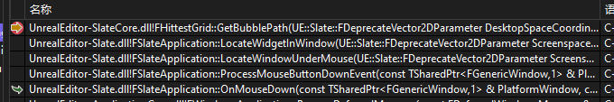

`HittestGrid` 将每个格子大小设置为 128 * 128

根据传入的点的坐标，直接计算出对应 `Grid` 的序号

```cpp
const FVector2f CellSize(128.0f, 128.0f);

FIntPoint FHittestGrid::GetCellCoordinate(UE::Slate::FDeprecateVector2DParameter Position) const
{
	return FIntPoint(
		FMath::Min(FMath::Max(FMath::FloorToInt(Position.X / CellSize.X), 0), NumCells.X - 1),
		FMath::Min(FMath::Max(FMath::FloorToInt(Position.Y / CellSize.Y), 0), NumCells.Y - 1));
}
```

## 事件触发

https://zhuanlan.zhihu.com/p/448050955


## ListView

### 基本使用

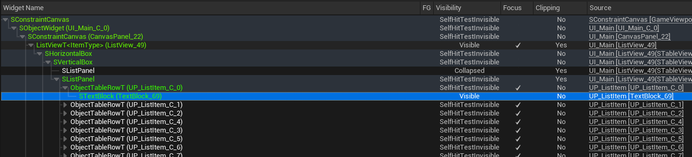

| 流程 | 示例 |
| --- | --- |
| 自定义 Entry 实现接口 | 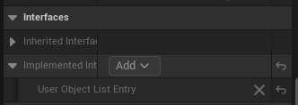 |
| ListView 配置 Entry | 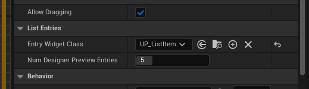 |
| 定义 UObject 作为 Item 存储 Data |  |
| 向 ListView 中添加数据 | 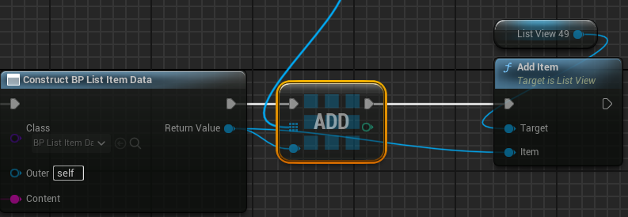 |

https://zhuanlan.zhihu.com/p/370249957

`ListView` 定义 Item 和 Entry 两个概念， Item 用于存储原始数据，Entry 用于表示实际的 UserWidget 控件

使用 `ListView` 是为了性能优化，在有大量数据的情况下，并不需要创建对应数量的 `UserWidget` 控件，因为屏幕大小有限无法将所有数据全部显示出来

理论上只需要创建屏幕空间最大能显示的 `UserWidget` 数量，再滑动 `ListView` 时将上方移动出显示区域的 `UserWidget` 移动到下方，再将要显示的数据替换到 `UserWidget` 中

> 后面用 `Entry` 替代 `UserWidget`

实际上也是这么做的，当 `Entry` 数据需要更新的时候，会触发接口中的 `OnListItemObjectSet` 函数，并将存储这 `Item` 信息的 `UObject` 作为参数传递

在 `Entry` 中只实现该接口，将传入的 `UObject*` 转换(`Cast`)成 `Item` 的数据类型即可

### AddItem

当使用 `AddItem` 将 `Item` 添加到 `ListView` 的时候，会触发 `RequestRefresh` 函数用于刷新表现效果

不过通常一次性可能会添加很多数据到 `ListView` 中，所以每次添加都全部重新计算是极其危险的行为

```cpp
void UListView::AddItem(UObject* Item)
{
    // ... do something 
	ListItems.Add(Item);
    // ... do something 
	RequestRefresh();
}
```

注意函数名称是 `RequestRefresh`，只是请求刷新，并非执行刷新

在真正执行逻辑的接口中是这样的

```cpp
void STableViewBase::RequestLayoutRefresh()
{
	if (!bItemsNeedRefresh)
	{
		bItemsNeedRefresh = true;
		RegisterActiveTimer(0.f, FWidgetActiveTimerDelegate::CreateSP(this, &STableViewBase::EnsureTickToRefresh));
	}

	if (ItemsPanel.IsValid())
	{
		ItemsPanel->SetRefreshPending(true);
	}

	Invalidate(EInvalidateWidget::Layout);
}
```

将 `bItemsNeedRefresh` 设置为 true

在前面 `OnPaint` 函数源码中可以看到，在绘制之前，会根据 `bItemsNeedRefresh` 的值判断是否需要执行 `Tick` 函数

所以，这里的操作就是为了能够记录这一帧是否需要刷新，并在绘制的时候执行 `Tick`，真正的刷新显示效果

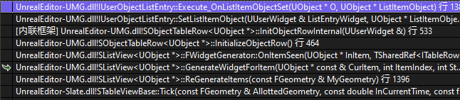

正如上面代码的执行流程，在 `Tick` 函数中执行了 `ReGenerateItems` 对每一个项都进行的刷新

### FWidgetGenerator

`FWidgetGenerator` 是一个用于存放映射关系的容器

```cpp
SListView<ItemType>* OwnerList;
TMap< ItemType, TSharedRef<ITableRow>, FDefaultSetAllocator, MapKeyFuncs > ItemToWidgetMap;
TMap< const ITableRow*, ItemType > WidgetMapToItem;

TArray< ItemType > ItemsWithGeneratedWidgets;
TArray<ItemType> ItemsToBeCleanedUp;
```

存储了 `ListView` 的原始指针 `OwnerList` 

存储了 `Entry` 映射 `Item` 的 `WidgetMapToItem`

存储了 `Item` 映射 `Entry` 的 `ItemToWidgetMap`

存储了当前有用所有 `Entry` 的 `ItemsWithGeneratedWidgets`

存储了需要被销毁 `Entry` 的 `ItemsToBeCleanedUp`

### ReGenerateItems

> Update generate Widgets for Items as needed and clean up any Widgets that are no longer needed.

按需更新生成的 Widgets，清理不需要的 Widgets

对每一项进行更新的 `GenerateWidgetForItem` 函数

```cpp
float GenerateWidgetForItem( const ItemType& CurItem, int32 ItemIndex, int32 StartIndex, float LayoutScaleMultiplier )
```

- `ItemType` 当钱定义的 Item 的数据类型
- `CurItem` 当前要显示的数据信息的地址
- `ItemIndex` 当前 Item 的序号
- `StartIndex` 当前 ListView 显示的第一个 Item 的序号

`CurItem` 是需要显示的数据，首先就要获取 `Item` 对应的 `Entry`，如果没有则需要创建

```cpp
TSharedPtr<ITableRow> WidgetForItem = WidgetGenerator.GetWidgetForItem( CurItem );
if (!WidgetForItem.IsValid())
{
    WidgetForItem = this->GenerateNewPinnedWidget(CurItem, ItemIndex, NumPinnedItems);
}
```

> `WidgetGenerator` 可以通过 `Item` 的地址，可以映射到对应 `Entry`

更新 `Entry` 对应的信息

```cpp
WidgetForItem->SetIndexInList(ItemIndex);
WidgetGenerator.OnItemSeen( CurItem, WidgetForItem.ToSharedRef() );
```

在 `OnItemSeen` 函数中，会顺便更新映射关系，通过执行 `Private_OnEntryInitialized` 最终会触发接口中更新数据的函数

恰好 `Entry` 继承了这个接口并且实现了这个函数，通过这种方式来更新 `Entry` 中的数据

```cpp
if ( bWidgetIsNewlyGenerated )
{
    ItemToWidgetMap.Add( InItem, InGeneratedWidget );
    WidgetMapToItem.Add( &InGeneratedWidget.Get(), InItem );

    OwnerList->Private_OnEntryInitialized(InItem, InGeneratedWidget);
}

// We should not clean up this item's widgets because it is in view.
ItemsToBeCleanedUp.Remove(InItem);
ItemsWithGeneratedWidgets.Add(InItem);
```

所以，如果使用 `TArray` 自己也保存了一份 Item 的数据信息，在手动更新完 `Item` 中的数据时，需要手动调一下 `RegenerateAllEntries` 重新生成所有的 `Entry`

### 其他

https://gwb.tencent.com/community/detail/113852
<!-- 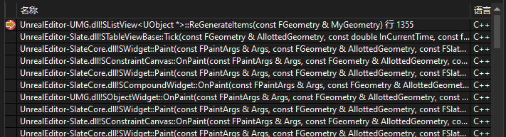 -->
