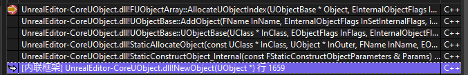

# GC

## 创建一个新的 UObject

在 `UObject` 的基类是 `UObjectBaseUtility`， `UObjectBaseUtility` 的基类是 `UObjectBase`

`UObjectBase` 的构造函数中就做了一个事情 `AddObject`，最终会将该对象添加到 `GUObjectArray`

```cpp
void UObjectBase::AddObject(FName InName, EInternalObjectFlags InSetInternalFlags, int32 InInternalIndex, int32 InSerialNumber)
{
	NamePrivate = InName;
	EInternalObjectFlags InternalFlagsToSet = InSetInternalFlags;
    
    // 设置 Tag ... do something ...

	GUObjectArray.AllocateUObjectIndex(this, InternalFlagsToSet, InInternalIndex, InSerialNumber);
	check(InName != NAME_None && InternalIndex >= 0);
	HashObject(this);
	check(IsValidLowLevel());
}
```

`GUObjectArray` 是一个全局唯一的 `FUObjectArray`，也就是说所有创建的 `UObject` 对象都会保存在这个数组里面



在 `StaticAllocateObject` 全局函数中


